# United States UAP Files

US Department of War 透過 PURSUE 系統解密公開的 UAP 檔案，中文索引與逐檔分析。

官方 portal: <https://www.war.gov/UFO/>

每條目附封面與中文報告。

完整條目 → folder 對照表：[`uap-full-index.tsv`](docs/uap-full-index.tsv)

## 縮寫

- AARO All-domain Anomaly Resolution Office（全領域異常解決辦公室）
- DOW Department of War（戰爭部）
- DOS Department of State（國務院）
- USPER U.S. PERSON（美國公民／居民／法人）
- MISREP Mission Report（任務報告）
- PR Unresolved UAP Report（未解 UAP 報告）
- SAC Special Agent in Charge（FBI 特別探員主管）
- CMP / LMP Command / Lunar Module Pilot（指揮艙／登月艙駕駛）
- FBI 302 FBI 訪談紀錄表

## 分類索引

- [1. FBI 62-HQ-83894 案卷（1947–1968 飛碟潮）](#cat1)
- [2. 二戰到冷戰初期（1944–1955）](#cat2)
- [3. 事件摘要單冊（Incident Summaries）](#cat3)
- [4. 1950s–60s 政府反應與目擊](#cat4)
- [5. NASA 太空任務（1965–1974）](#cat5)
- [6. 冷戰晚期外交電報（1985–2004）](#cat6)
- [7. 現代軍方任務報告（MISREP / Range Fouler，2016–2025）](#cat7)
- [8. 現代軍方未解 UAP 報告（PR，2013–2026）](#cat8)
- [9. FBI 現代靜止影像（2025，A1–A8 + B1–B24）](#cat9)
- [10. 2023 美國西部目擊事件](#cat10)

---

## 1. FBI 62-HQ-83894 案卷（1947–1968 飛碟潮）

1947-06 至 1968-07 期間 UFO 與飛碟的 FBI 調查紀錄、目擊證詞、民眾通報、Oak Ridge 影像、推進系統技術提案、UFO 大會議程、媒體剪報。完整版較 FBI vault 多出數頁、塗黑極少。

| 標題 | 描述 | 照片 | 報告 |
|---|---|---|---|
| **#001 Section 10** | 1966 年 Hoover 親簽、Hillsdale 沼氣、von Braun 進民間 UFO 雜誌，卷宗末段三件事一頁濃縮。 |  | [📝](docs/reports/001-65_hs1-834228961_62-hq-83894_section_10/report.md) |
| **#002 Section 2** | 1947 飛碟潮起點：Arnold、Rhodes Phoenix Brownie 相機、FBI 內部 'Army 實驗' 假設 28 天從提出到否認。 | 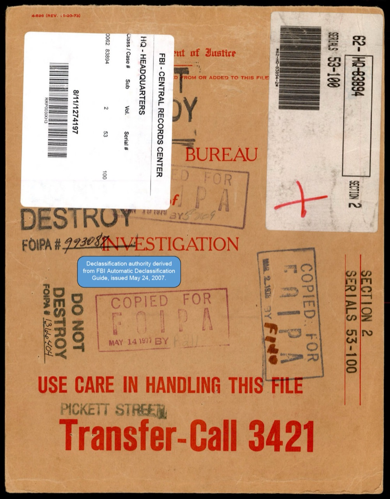 | [📝](docs/reports/002-65_hs1-834228961_62-hq-83894_section_2/report.md) |
| **#003 Section 3** | Maury Island、B-25 雙人罹難、Twin Falls 樹頂如真空、FBI 64 天退出 UFO 調查的弧線。 |  | [📝](docs/reports/003-65_hs1-834228961_62-hq-83894_section_3/report.md) |
| **#004 Section 4** | 退出令撐了 4 個月就被打破：Chiles-Whitted、Wham-O 飛碟玩具、SIGN 收土壤樣本、Gasser 上校的『俄國飛彈』說。 |  | [📝](docs/reports/004-65_hs1-834228961_62-hq-83894_section_4/report.md) |
| **#005 Section 5** | Walter Winchell 轉信、Oak Ridge AEC 廠 40,000 英尺雷達三次接觸、U.S. News『Navy 1942 就造出來了』封面故事。 | 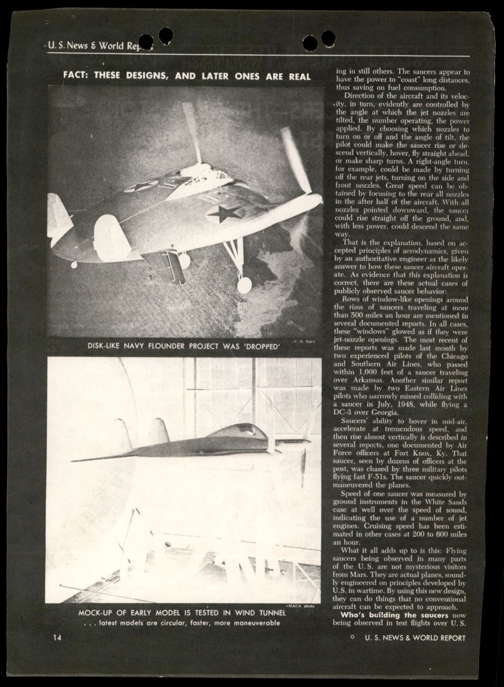 | [📝](docs/reports/005-65_hs1-834228961_62-hq-83894_section_5/report.md) |
| **#006 Section 6** | Belmont 內部備忘錄、New Mexico Green Fireball、ONR Liddel Skyhook 氣球解釋、Menzel 倒置層光學折射論。 | 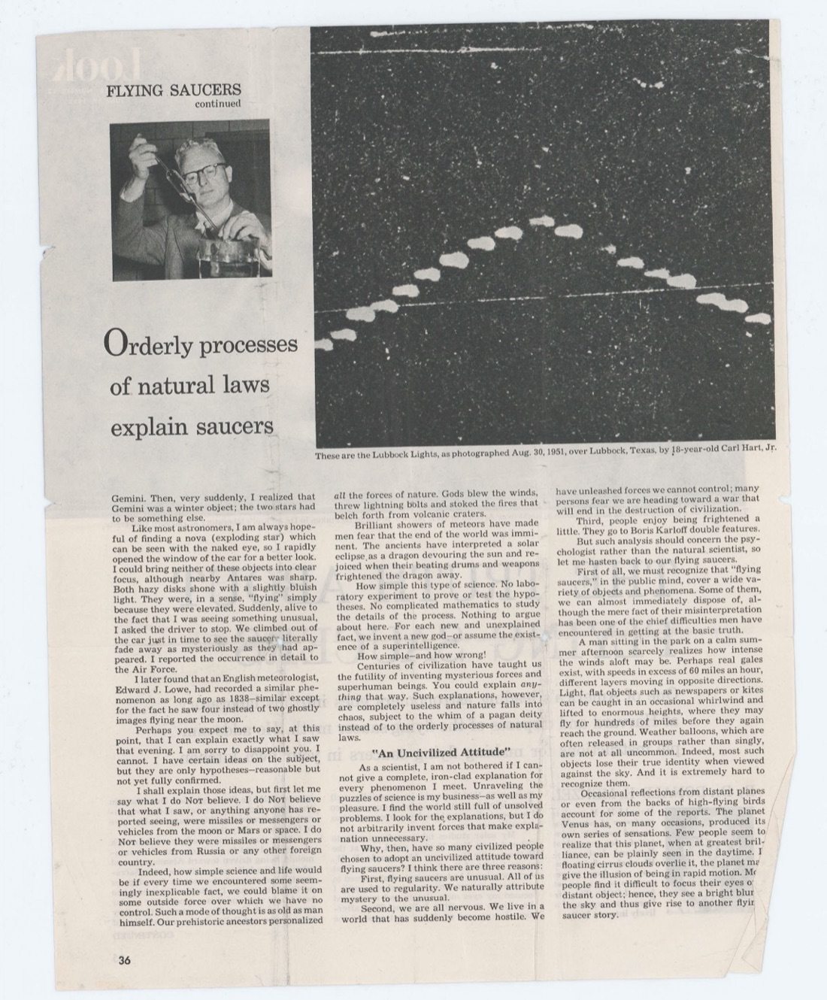 | [📝](docs/reports/006-65_hs1-834228961_62-hq-83894_section_6/report.md) |
| **#007 Section 7** | Gorman P-51 對光球 27 分鐘空戰、New Yorker 把 Project Saucer 帶進主流、1952 Washington National Airport 雷達 10 個回波。 |  | [📝](docs/reports/007-65_hs1-834228961_62-hq-83894_section_7/report.md) |
| **#008 Section 9** | Sputnik 後 1957-1960 民間飛碟組織爆量：Perry 幻燈片寄空軍、IFSB Bender、Stranges 自封教士。 | 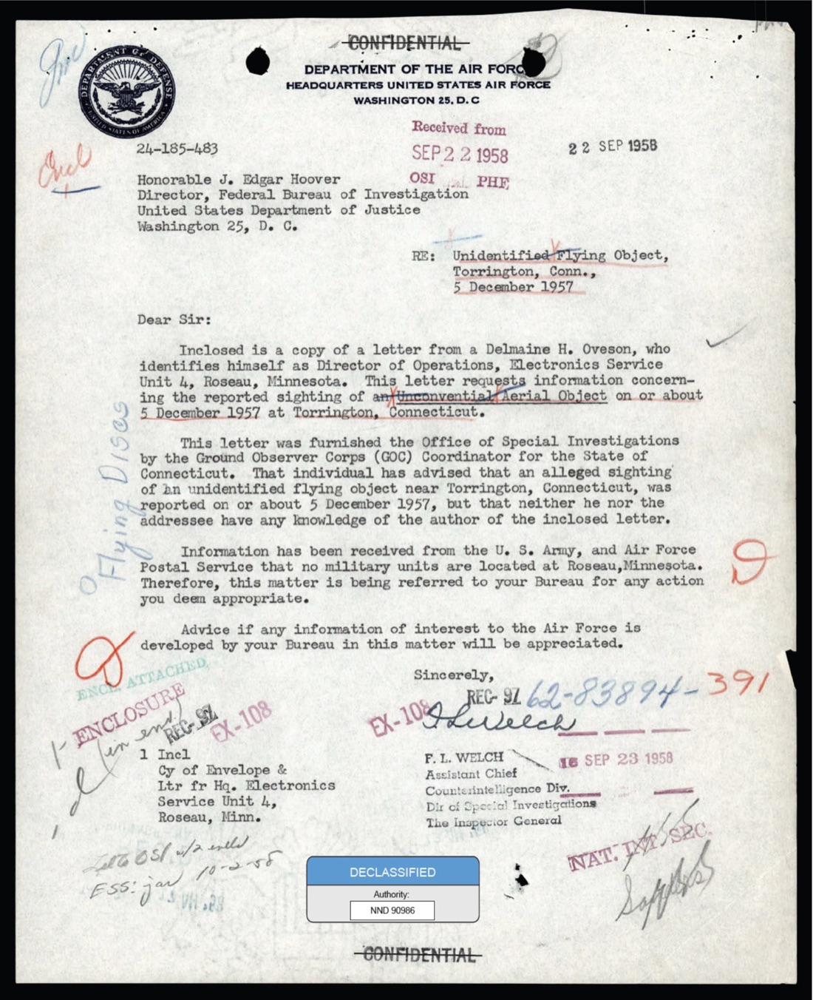 | [📝](docs/reports/008-65_hs1-834228961_62-hq-83894_section_9/report.md) |
| **#009 Serial 130** | 1947-08 ADC 編 18 件樣本案分類研究、Urie 父子帶兒童 .22 步槍對著飛碟開槍那件被列為樣本之一。 | 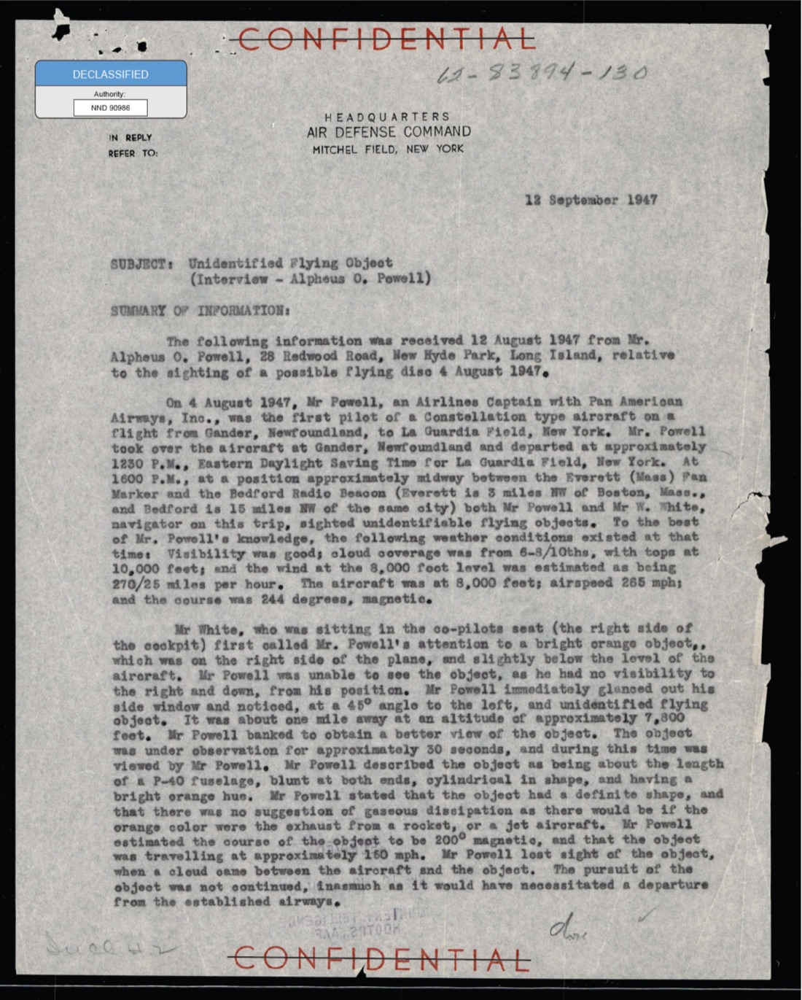 | [📝](docs/reports/009-65_hs1-834228961_62-hq-83894_serial_130/report.md) |
| **#010 Serial 153** | 1947-07 Oak Ridge 居民 Presley 拍到的兩張飛碟黑白照，FBI 收進案卷的真正物理證據之一。 |  | [📝](docs/reports/010-65_hs1-834228961_62-hq-83894_serial_153/report.md) |
| **#011 Serial 164** 1949-02-15 · USAF HQ | ADC 1947-09 起草、1949 改版的 UFO 目擊問卷標準格式，氣味、雲層通道、aerodynamic vanes、Katz Mayer effect 都列進去。 | 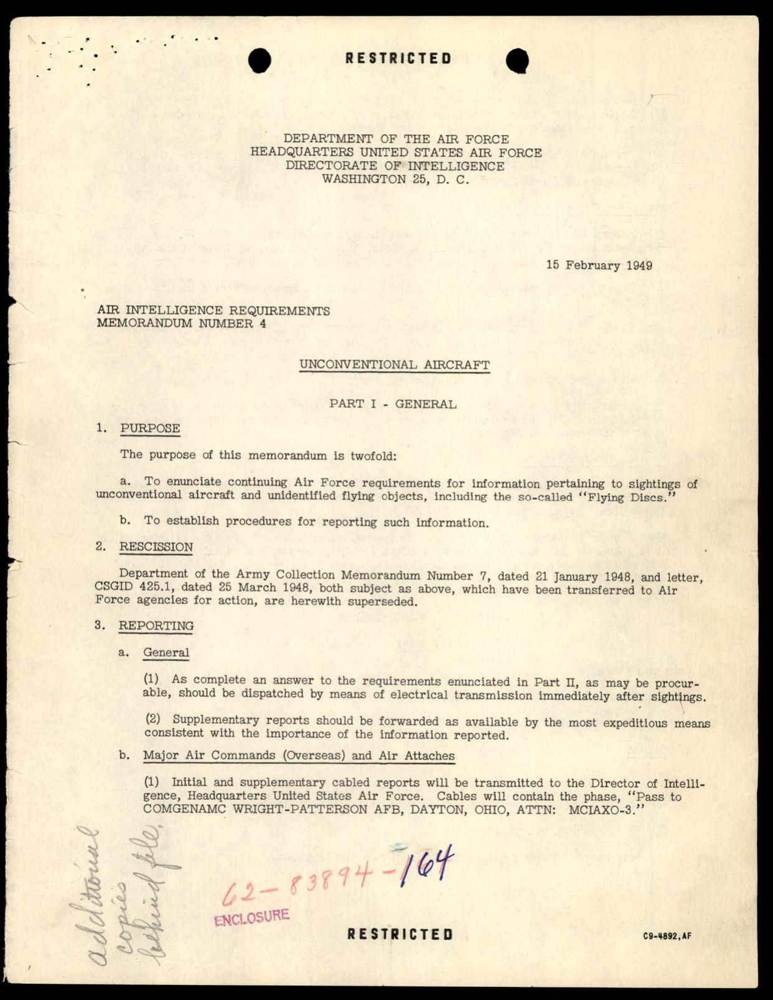 | [📝](docs/reports/011-65_hs1-834228961_62-hq-83894_serial_164/report.md) |
| **#012 Serial 220** 1950-03-19 · Veracruz | 1950 年墨西哥音樂家自薦『飛碟就是我設計的、貴國只是先註冊』，5 張學校黑板手繪設計圖加西文原信加 FBI 翻譯本。 |  | [📝](docs/reports/012-65_hs1-834228961_62-hq-83894_serial_220/report.md) |
| **#013 Serial 403** 1956 | Gray Barker 把『被神秘黑衣男警告』寫進飛碟史的那本書，FBI 1956 把整本書封剪進案卷做存證。 | 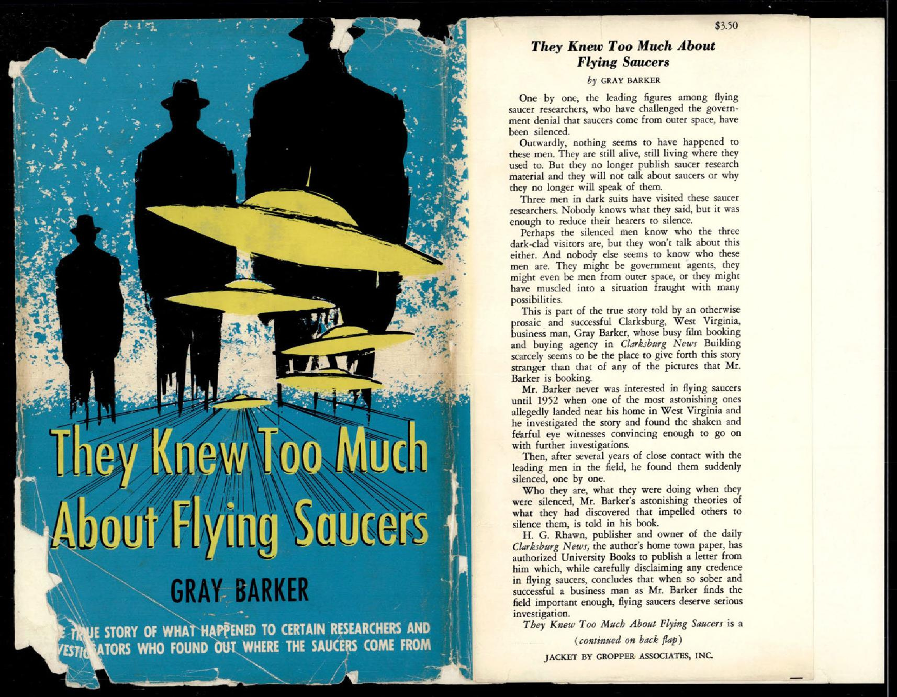 | [📝](docs/reports/013-65_hs1-834228961_62-hq-83894_serial_403/report.md) |
| **#014 Serial 438** 1964-04-24 · Socorro NM | 1964-04-24 Socorro 警官 Zamora 親見蛋形物著陸加兩名白衣人員，FBI 特派員 Byrnes 當晚親到現場、親手畫的物證分布圖。 |  | [📝](docs/reports/014-65_hs1-834228961_62-hq-83894_serial_438/report.md) |
| **#015 Serial 449** 1966-09/10 · LA | IRS 職員把訂的飛碟雜誌交給 FBI 說『裡面在闡述共產黨路線』，LA SAC 把整本上呈 Hoover。 | 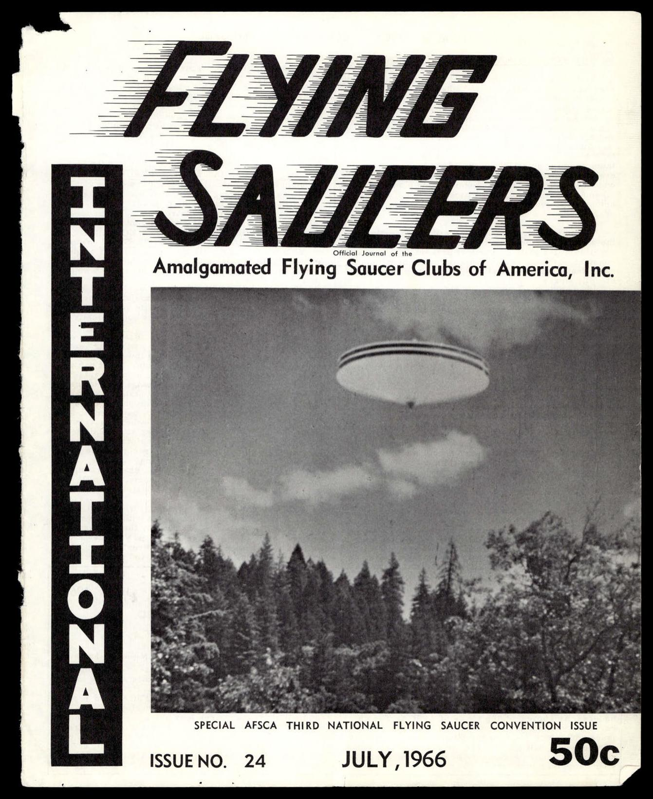 | [📝](docs/reports/015-65_hs1-834228961_62-hq-83894_serial_449/report.md) |
| **#016 SUB A** 1957-1960 · FBI HQ | Sub A 子卷收 1957-1960 飛碟相關新聞剪報：Schmidt 太空船故事、APRO 9 人團、Killian 飛機被 3 物體跟蹤 45 分鐘。 | 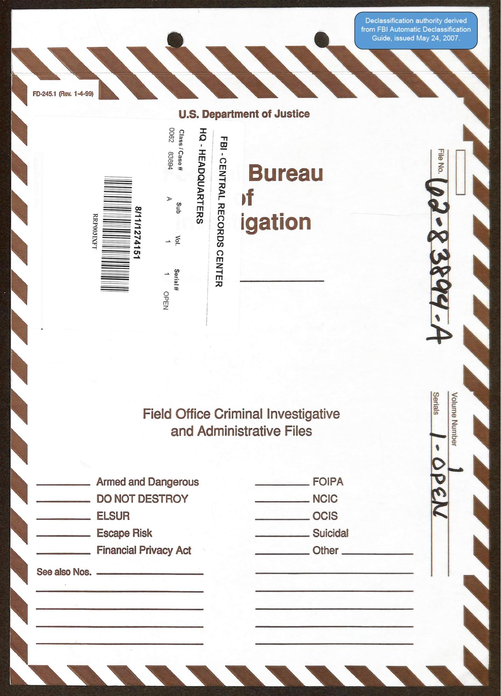 | [📝](docs/reports/016-65_hs1-834228961_62-hq-83894_sub_a/report.md) |
| **#033 Section 1** 1947-07 | 62-HQ-83894 整套案卷起點 Serials 1-52，1947-07 起：Grafton 神父呼嘯飛碟（圓鋸片爆竹惡作劇）加 Omaha Reibold 1947-07-07 燃燒物體目擊（Hoover 親自送進五角大廈）加匿名『歐洲國家投放細菌』陰謀論信。 | 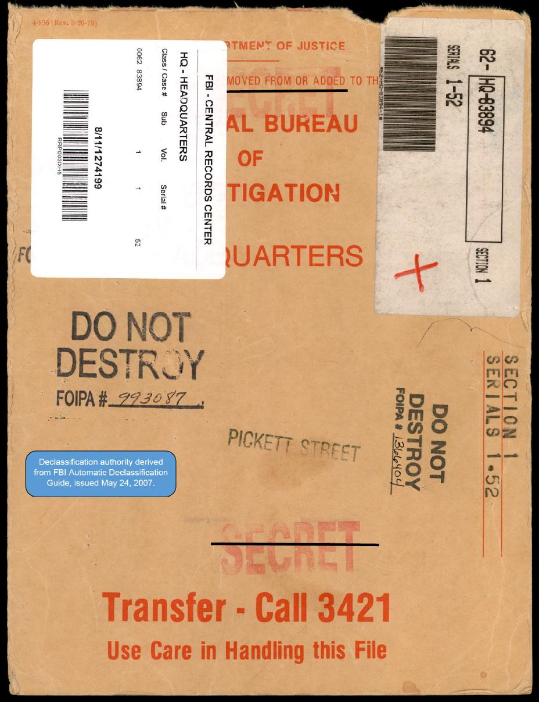 | [📝](docs/reports/033-65_hs1-834228961_62-hq-83894_section_1/report.md) |
| **#034 Section 8** 1954-06 to 08 | 1954-06 到 08 contactee 文化的 FBI 視角，Serials 344-384：Truman Bethurum 加 George Hunt Williamson Cincinnati 巡迴演講調查加 Mrs. Frances Swan 透過 thought transmission 接觸 AFFA（Uranus M-4）/ PONNAR（Hatann L-11）加 Hoover 親簽闢謠《MYSTIC》金星人故事。 | 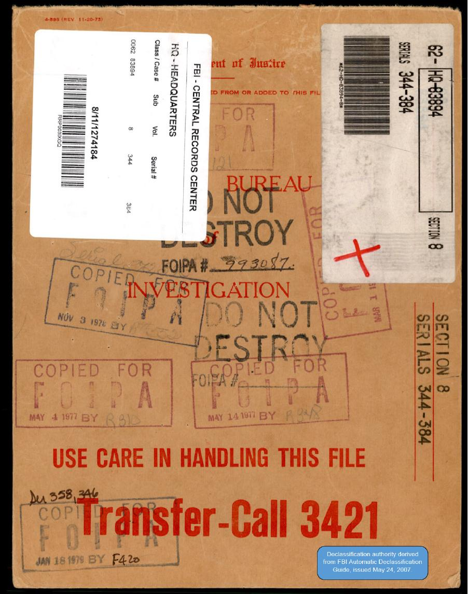 | [📝](docs/reports/034-65_hs1-834228961_62-hq-83894_section_8/report.md) |

---

## 2. 二戰到冷戰初期（1944–1955）

| 標題 | 描述 | 照片 | 報告 |
|---|---|---|---|
| **#017 General 1946-7 Vol 2** 1947-12-30 | 1947-08 到 12 AMC 與華府 USAF 飛碟公文鏈，從 Garrett Memo 七條特徵到 1947-12-30 Project Sign 立案令，含 Loedding LD-2 圓盤設計與 Horten 兄弟線。 | 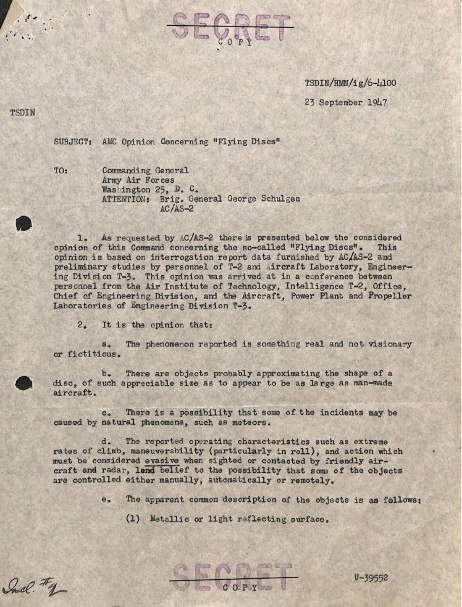 | [📝](docs/reports/017-18_100754_general_1946-7_vol_2/report.md) |
| **#022 SHAEF foofighters** 1944-1945 · Germany | 415th NFS 1944-12 到 1945-03 亞爾薩斯北部 foofighters 公文鏈，13 則 sortie 摘要加 SHAEF『Me 262 + flak rocket』官方解釋加 IX TAC 67th TRG 12 呎雪茄物體底片沖洗失敗紀錄。 | 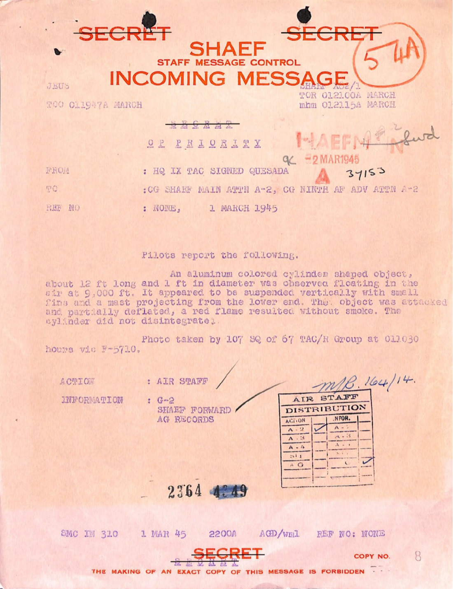 | [📝](docs/reports/022-331_120752_numeric_files_1944-1945_37153_german_armament_equipment_documents/report.md) |
| **#023 USAFE → Cabell** 1948-11 · Netherlands | 1948-09 北海荷蘭外海 307th BG 三組空勤目擊加 Neubiberg 飛碟懸停 30 分鐘加瑞典空軍情報處『非地球已知技術』說法加湖底未在水文圖上的火山口。 |  | [📝](docs/reports/023-341_110448_records_relating_to_intelligence_1948-1955_netherlands/report.md) |
| **#024 Russell 蘇聯目擊** 1955-10 · Azerbaijan | 1955-10-04 Senator Russell 加 Hathaway 加 Efron 在亞塞拜然鐵路上目擊 2 個飛碟垂直升空，外殼順時針旋轉內部燈靜止，蘇聯車廂服務員立刻拉窗簾。 |  | [📝](docs/reports/024-341_110677_numerical_file_5-2500_azerbaijan/report.md) |
| **#025 FSR 200-4 彙編** 1948-1949 | FSR 200-4 機制運轉的第一個完整週期 143 頁案件彙編，覆蓋 30+ 起目擊跨美國本土、紐芬蘭、夏威夷、日本，含 Chance-Vought XF5U-1 海軍圓盤實驗機對照圖。 |  | [📝](docs/reports/025-342_hs1-416511228_319.1_flying_discs_1949/report.md) |
| **#032 Krasuski 證述** 1957-11 · Germany 1944 | 1957 Levelland Texas UFO 案觸發底特律波蘭裔工人 Krasuski 寫信給艾森豪助理 Cutler，憶起 1944 年強迫勞動期間目睹的圓盤垂直升空加拖拉機引擎兩度熄火事件。Hoover 三天內走完訪談流程。 |  | [📝](docs/reports/032-65_hs1-101634279_100-de-26505_germany_1944/report.md) |

---

## 3. 事件摘要單冊（Incident Summaries）

每件含「Check-List - Unidentified Flying Objects」表單，附證人名單／證詞與敘事報告。

| 標題 | 描述 | 照片 | 報告 |
|---|---|---|---|
| **#028 Box 7, 1-100** | Project Sign 1948 年建檔的第一冊 Incident #1-100，含 Arnold #17 Mt Rainier 案、Muroc #1 案、Lake Mead #53 案、1948-01-07 Mantell day Kentucky 連續案件群（#30 系列）。 | 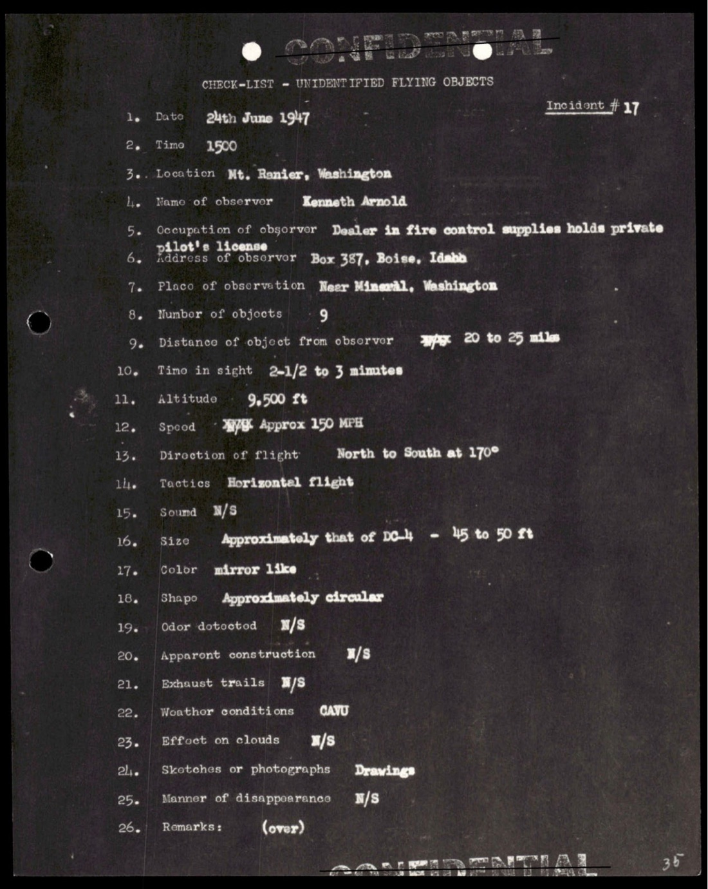 | [📝](docs/reports/028-38_143685_box7_incident_summaries_1-100/report.md) |
| **#026 Box 7, 101-172** | Project Sign Incident #101-172（1948-02 到 1948-08），覆蓋 Estimate of the Situation 草稿期，含 Chiles-Whitted DC-3 雪茄案加 Hecla SD 150 mi 高度案。 |  | [📝](docs/reports/026-38_143685_box7_incident_summaries_101-172/report.md) |
| **#027 Box, 173-233** | Project Sign / Grudge Incident #173-233（1948-09 到 1949-02），新墨西哥綠色火球集中爆發加 La Paz UNM 隕石學系主任親身目擊加 Project Twinkle 前夜的監測規劃。 |  | [📝](docs/reports/027-38_143685_box_incident_summaries_173-233/report.md) |

---

## 4. 1950s–60s 政府反應與目擊

| 標題 | 描述 | 照片 | 報告 |
|---|---|---|---|
| **#018 General 1948 Vol 1** 1948-06-15 | 1948-01 到 06 USAF 內部 28 頁飛碟通信集，含 Project Sign 正式命名（1948-02-12）、Pennsylvania 第十一航空軍案件轉報、Loedding LD-2 圖紙再次傳閱。 |  | [📝](docs/reports/018-18_6369445_general_1948_vol_1/report.md) |
| **#029 White House Space Council** 1963-07-18 | 1963-07-18 白宮 NASC 幕僚 Maxwell Hunter II 致國務院的 6 頁備忘，以工程計算推導三種 ET 接觸場景（化學動力火星人 / 0.5c 核動力星際 / 超光速 Einstein 之外）對應的外交政策。 |  | [📝](docs/reports/029-59_214434_sp_16_1963_alien_race/report.md) |
| **#030 State Dept Samford** 1952-07-18 | 1952 華府飛碟事件期間，USAF 情報主任 Samford 在 IAC 對國務院口述的內部立場書面快照，由 F.H. 整理交給 Paul Nitze 等高層。 |  | [📝](docs/reports/030-59_64634_711.5612_1952_state_samford/report.md) |
| **#031 FBI Detroit Weaver** 1958-04-17 · Detroit | 1958-04-17 凌晨 4:08 底特律 23 歲 David Weaver 致電 FBI 通報『圓盤型物體加水晶圓頂、反光』，先打 Selfridge Field 不通才改打 FBI，FBI 建議『通知適當的空軍當局』。 | 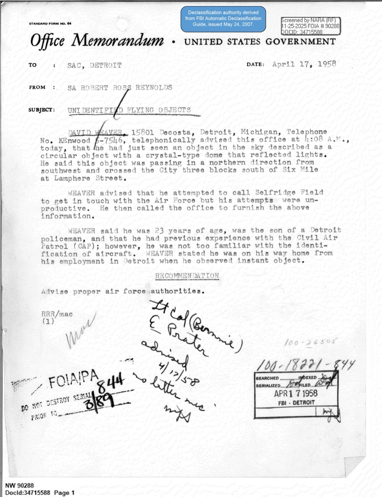 | [📝](docs/reports/031-65_hs1-101634279_100-de-18221_serial_844_detroit_1958/report.md) |

---

## 5. NASA 太空任務（1965–1974）

| 標題 | 描述 | 照片 | 報告 |
|---|---|---|---|
| **#019 COMETA + Rosin** 1999 | 法國退役將領 COMETA 委員會 1999 年 ET 假設報告，2001-04 由 Carol Rosin 親送 NASA 局長 Daniel Goldin，含 von Braun『偽造外星威脅』遺言線。 | 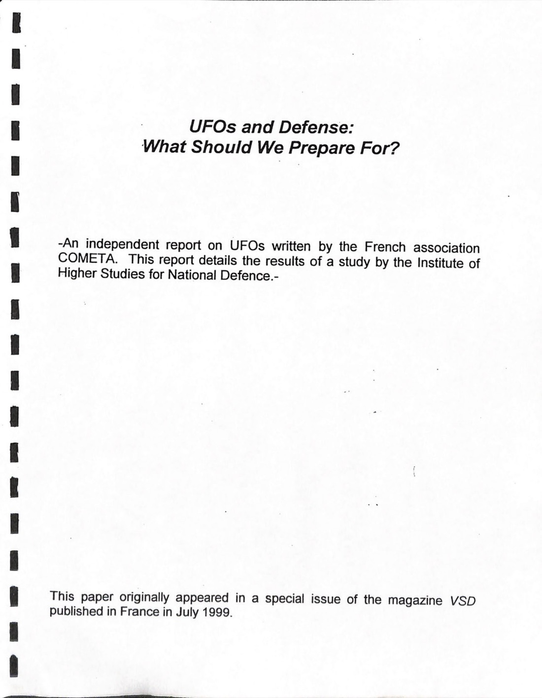 | [📝](docs/reports/019-255_413270_cometa_report_rosin/report.md) |
| **#020 Gemini 7 Transcript** 1965-12-05 · LEO | 1965-12-04 GT-7 PAO Release Commentary 單頁，Borman 三度確認 bogey/booster/數百顆 particles 三類獨立物體加 Lovell trillions of particles 加 PAO 結尾改稿痕跡。 | 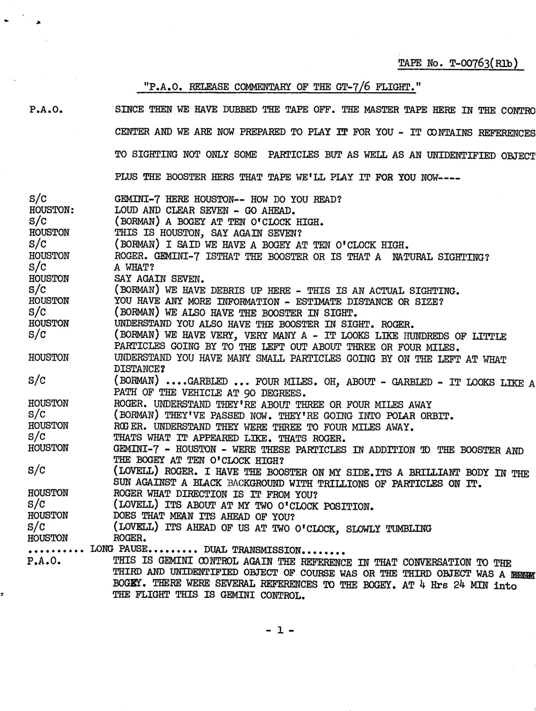 | [📝](docs/reports/020_021-nasa_gemini_7/report.md) |
| **#021 Gemini 7 Audio** 1965-12-05 · LEO | 同 #020 Gemini 7 事件的空地通訊原始磁帶 T-00763(R1b)。war.gov / DVIDS 公開 portal 未提供 mp3 直連，分析併入 #020 transcript 報告。 |  | [📝 併入 #020](docs/reports/020_021-nasa_gemini_7/report.md) |
| **#139+#145-149 Apollo 12** 1969-11 · Moon | VM1 月面 panorama，黃框框出地平線右上方垂直藍綠色光柱，4-5 個分離亮點堆疊。 |  | [📝](docs/reports/139_145_146_147_148_149-nasa_apollo_12/report.md) |
| **#140+#142+#143+#150 Apollo 17** 1972-12 · Moon | VM6 panorama：Taurus-Littrow valley 地平線 South Massif 山脊上方黃框內三個藍綠色亮點水平偏斜排列。 |  | [📝](docs/reports/140_142_143_150-nasa_apollo_17/report.md) |
| **#141 Apollo 11** 1969-07 · Moon | Aldrin debrief 6-37：「I observed what I thought were little flashes inside the cabin... some sort of penetration」 1969-07-31 寫，1972 改 U，2026-05-08 釋出。 |  | [📝](docs/reports/141-nasa_apollo_11/report.md) |
| **#144 Skylab** 1973-1974 · LEO | Garriott debrief 20-1：「Jack first noticed this rather large red star out the wardroom window. Upon close examination, it was much brighter than Jupiter」 SL-3 最戲劇性的 UAP-themed 觀察。 | 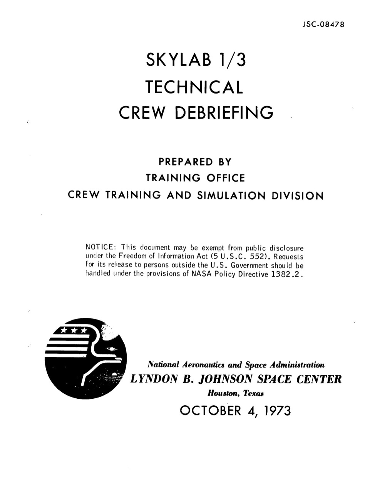 | [📝](docs/reports/144-nasa_skylab/report.md) |

---

## 6. 冷戰晚期外交電報（1985–2004）

| 標題 | 描述 | 照片 | 報告 |
|---|---|---|---|
| **#151 Papua New Guinea** 1985-01-28 | PNG NIO 在 Wewak 居民被高空高速飛行器嚇到 4 天後找上美使館問『是不是你們的飛機』，使館用 43SW 紀錄否認加反問 USCINCPAC。 |  | [📝](docs/reports/151-state_dept_uap_cable_1_papua_new_guinea_1985/report.md) |
| **#152 Kazakhstan** 1994-01-31 | Tajik Air 首席飛行員 Ed Rhodes 在 41,000 ft 哈薩克上空目擊 UAP 做圓圈與開瓶器螺旋 40 分鐘，contrail 在 100,000 ft 顯示飛行軌跡。 |  | [📝](docs/reports/152-state_dept_uap_cable_2_kazakhstan_1994/report.md) |
| **#153 Tbilisi** 2001-10-30 · Georgia | Vershbow 大使對俄外交部質問俄機越境轟炸 Kodori Gorge，Tereoken 副部長用『也可能是 UFO』當否認術，標題裡的 UFO 與真實 UFO 無關。 |  | [📝](docs/reports/153-state_dept_uap_cable_3_tbilisi_2001/report.md) |
| **#154 Ashgabat** 2004-11-05 · Turkmenistan | Turkmenistan 一間自稱 Union of UFOlogists 的 NGO 其實在做小企業註冊輔導加人道援助加獨立通訊刊物，UFO 是命名保護色，使館評語『Crazy? Like a fox』。 |  | [📝](docs/reports/154-state_dept_uap_cable_4_ashgabat_2004/report.md) |
| **#155 Mexico** 2003-09-16 | 墨西哥國會 2023-09-12 世界首場官方外星生命聽證，Maussan 搬偽造乾屍、Ryan Graves 公開表達失望，State Dept 把這寫進 weekly political blotter 第 11 條。 |  | [📝](docs/reports/155-state_dept_uap_cable_5_mexico_2023/report.md) |

---

## 7. 現代軍方任務報告（MISREP / Range Fouler / 其他，2016–2025）

| 標題 | 描述 | 照片 | 報告 |
|---|---|---|---|
| **#035 D10** 2022-05 · Iraq | MQ-9 在伊拉克 21 小時任務的最後 4 小時 20 分內，DGS 看到 5 個 UAP 橫越螢幕，其中 1 個的視覺判讀像飛彈。 |  | [📝](docs/reports/035-dow_uap_d10_mission_report_iraq_may_2022/report.md) |
| **#036 D12** 2022-05-20 · Iraq | 196 ATKS 在 OP PHANTOM FLEX 任務中，FMV + SIGINT 雙感測器都抓到 1 個 UAP 飛 N→NE，DGS judges 看完也沒能命名。 | 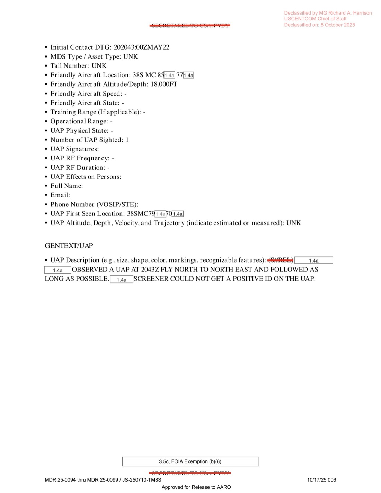 | [📝](docs/reports/036-dow_uap_d12_mission_report_iraq_may_2022/report.md) |
| **#037 D14** 2022-05-29 · E Mediterranean | MQ-9 監視俄羅斯地中海艦隊期間遭 RFAF Su-30 攔截，3.5 小時後又看到 1 個 UAP 飛向北/東北。 |  | [📝](docs/reports/037-dow_uap_d14_mission_report_eastern_mediterranean_may_2022/report.md) |
| **#038 D16** 2022-07-31 · Syria | TF CHOSIN 在 Deir ez-Zor 跟監 ISIS 車隊跟 30 個 ADM 之前 2.5 小時，DGS 看到 1 個 UAP 由北向南橫越，不到 1 分鐘。 |  | [📝](docs/reports/038-dow_uap_d16_mission_report_syria_july_2022/report.md) |
| **#039 D18** 2022-12-01 · Iraq | 482 ATKS 在巴格達上空 18,000 ft，看到 1 個 UAP/UAV 由西向東飛但沒追，繼續執行任務。 |  | [📝](docs/reports/039-dow_uap_d18_mission_report_iraq_december_2022/report.md) |
| **#040 D19** 2023-02-21 · Syria | F-15E 在敘利亞 ESSA killbox 巡防，遭 3 分鐘多頻雷達干擾，1 分鐘後在 FL240 看到 3 個 UAP，70 分鐘後再加 1 個氣球。 | 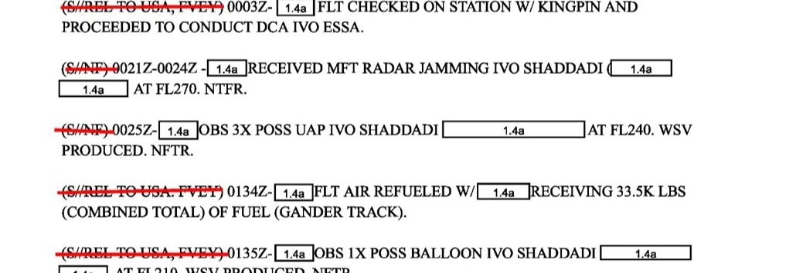 | [📝](docs/reports/040-dow_uap_d19_mission_report_syria_february_2023/report.md) |
| **#041 D20** 2023-03-31 · Syria ESSA | F-16CM 在 FL265 抬頭看到 10-20 個亮物在 FL600+ 機動，飛行員把瞄準莢艙鎖恆星比對，結果不一樣。 | 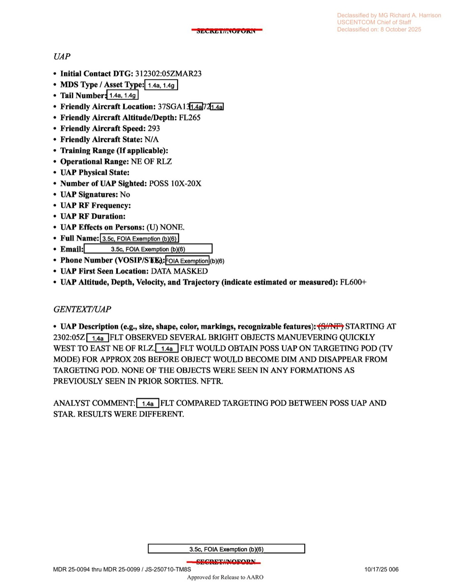 | [📝](docs/reports/041-dow_uap_d20_mission_report_syria_essa_march_2023/report.md) |
| **#042+#043 D23** 2023-10-24 · Arabian Gulf | MQ-9 在阿拉伯灣收到伊朗 Air Defense 的 Guard Frequency 通報『保持距離』，56 分鐘後在同一空域看到 2 個熱影像冷的固態物體，320 mph / 440 mph。 |  | [📝](docs/reports/042_043-dow_uap_d23_mission_report_uae_october_2023/report.md) |
| **#044 D25** 2024-01-25 · Mediterranean | AFSOC 33 SOS MQ-9 從 LGLR 起飛途中，SWIR 鏡頭單獨抓到 1 個圓鈍菱形物體帶底部探針，434 節，EO/可見光都看不到，2 分鐘後消失。 |  | [📝](docs/reports/044-dow_uap_d25_mission_report_greece_january_2024/report.md) |
| **#045 D27** 2024-06-07 · Gulf of Oman | AFSOC 3 SOS MQ-9 在阿曼灣 RTB 途中，看到 1 個發光熱球體下面掛根垂直棒，140 節貼水面直線飛，水裡有反射。 | 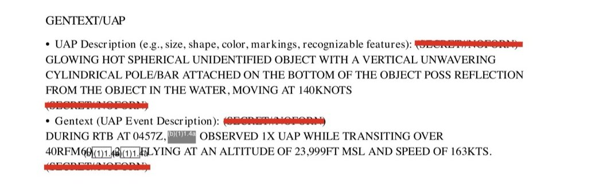 | [📝](docs/reports/045-dow_uap_d27_mission_report_gulf_of_oman_june_2024/report.md) |
| **#046 D28** 2024-09-20 · Iraq Ayn al Asad | AC-130J Ghostrider 在 Al Asad 範圍試射 AGM-176 Griffin，飛彈離架到擊中目標的中間，1 個高速 UAP 穿過 MX-20 + MX-25 兩個感測器，造成 IR 鏡頭炫光。 |  | [📝](docs/reports/046-dow_uap_d28_mission_report_ayn_al_asad_iraq_september_2024/report.md) |
| **#047 D3** 2020 · Arabian Gulf | AFCENT MQ-9 在 27 秒內連看 4 個 UAP，中間還夾一組 side-by-side 編隊，雲層蓋過去後就追不到了。 | 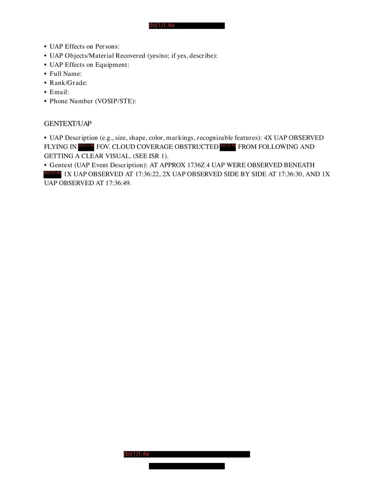 | [📝](docs/reports/047-dow_uap_d3_mission_report_arabian_gulf_2020/report.md) |
| **#048-#050 D32** 2024-10-20 · Syria | AFSOC 12 SOS MQ-9 在敘利亞 37SFU36 orbit 45 分鐘內看到 5 次 misshapen 白光球，被 Plasma 分類，機組親口說『不是雷射攻擊』。 | 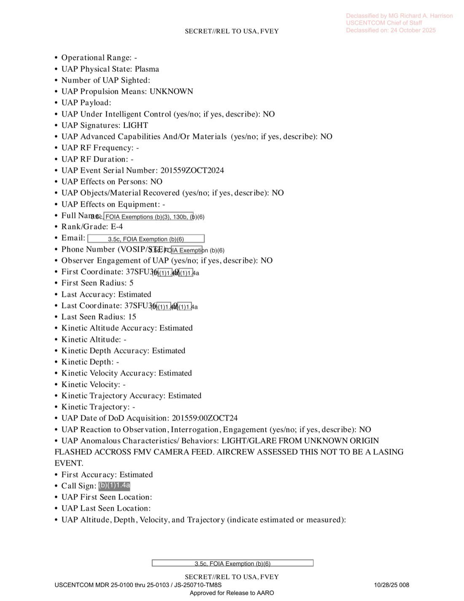 | [📝](docs/reports/048_049_050-dow_uap_d32_mission_report_syria_october_2024/report.md) |
| **#051 D33** 2023-10-27 · Aegean Sea | AFSOC 33 SOS MQ-9 凌晨從 LGLR 起飛飛往 OJMS 途中，3 分鐘內看到 1 個圓形物貼海面飛、做了好幾個 90 度直角轉彎，80 mph。 |  | [📝](docs/reports/051-dow_uap_d33_mission_report_greece_october_2023/report.md) |
| **#052 D35** 2023-10-29 · Aegean Sea | 兩天後同一支 33 SOS 又從 LGLR 起飛，在 D33 觀測點往東 100 km 又看到 1 個一樣的圓形小物，這次直線飛向陸地，30 mph。 | 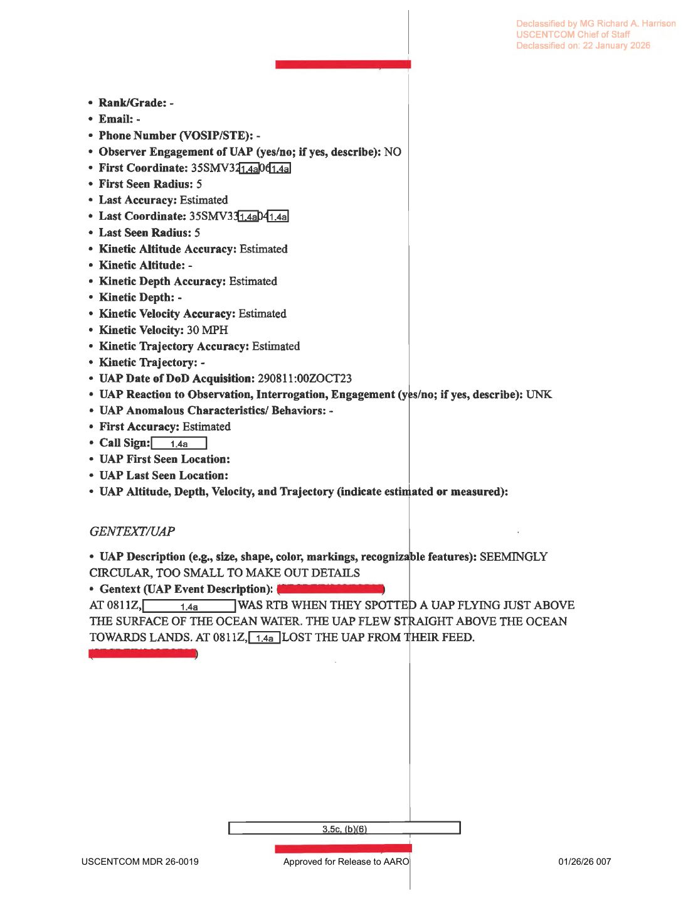 | [📝](docs/reports/052-dow_uap_d35_mission_report_greece_october_2023/report.md) |
| **#053 D38** 2020-05-14 · Arabian Gulf | 海軍夜間 ISR 任務，ATFLIR Black Hot 抓到 1 個圓形實體在波斯灣外海 20,000 ft 高度，水面下方還看得到波紋，4x zoom 後消失。 |  | [📝](docs/reports/053-dow_uap_d38_range_fouler_debrief_middle_east_may_2020/report.md) |
| **#054 D4** 2020 · Arabian Gulf | 5 頁中 4 頁完全 1.4(a) 遮蔽，僅 p-05 露出 GENTEXT/UAP 段，含 12:58Z 加 321 KTS 加加速東轉加 PILOT observer。 | 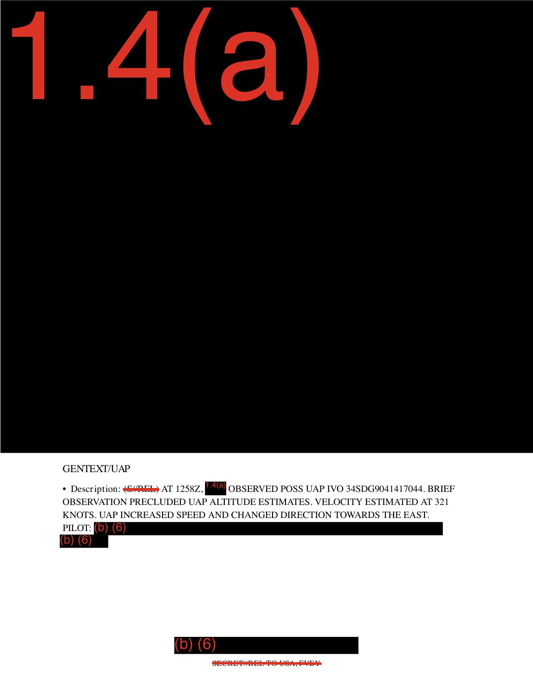 | [📝](docs/reports/054-dow_uap_d4_mission_report_arabian_gulf_2020/report.md) |
| **#055 D42** 2020-08-31 · Persian Gulf（標題誤 Japan）| AFRC 482 ATKS Pilot 在 39R WL 觀測 3 個同形物體互相超越，SPEAR 表單原圖。 |  | [📝](docs/reports/055-dow_uap_d42_range_fouler_debrief_japan_2023/report.md) |
| **#056 D44** 2020-10-15 · Gulf of Aden | 172 ATKS Michigan ANG MQ-9 觀測貼海面冷物體 abrupt directional changes，SPEAR 表單。 |  | [📝](docs/reports/056-dow_uap_d44_range_fouler_gulf_of_aden_october_2020/report.md) |
| **#057 D48** 1996-09-10 | ACTA + RTI 1996-09-10 給 45/30 SW 安全室的 Mode-5 失效建模技術報告封面。 |  | [📝](docs/reports/057-dow_uap_d48_air_force_space_booster_risk_report_1996/report.md) |
| **#058 D49** 2000-02-03 | 30 SW Office of History 1973 編製的 Vandenberg 發射總表封面。 |  | [📝](docs/reports/058-dow_uap_d49_vandenberg_launch_summary_1958_2000/report.md) |
| **#059 D5** 2020 · Mediterranean（標題誤 Arabian Gulf）| p-05 殘文：13:54Z 1 個 UAP at FL160-170 40 KTS 等速（觀測 #1，與 p-06 22:43Z 278 KTS 加速南向 觀測 #2 隔 8h49m）。 | 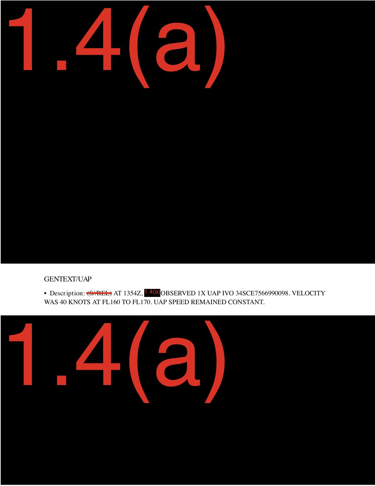 | [📝](docs/reports/059-dow_uap_d5_mission_report_arabian_gulf_2020/report.md) |
| **#060 D50** 2025-04-10/11 · INDOPACOM | USD(I&S) ↔ 12 AF/DET 3 PAROC email 對話，2025-04 INDOPACOM tearline 解密確認流程。 | 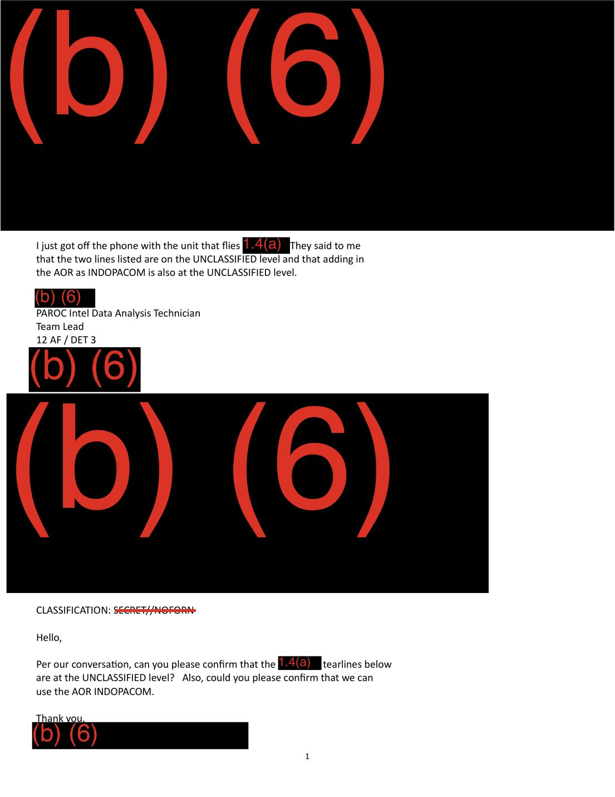 | [📝](docs/reports/060-dow_uap_d50_email_correspondence_indopacom_april_2025/report.md) |
| **#061 D51** 2023-03 · Pacific Time Zone | USD(I&S) ↔ AFOSI OSI CI Collections 第二次回覆 email，確認 UNCLASSIFIED 三角形藍光 UAP tearline 釋出。 | 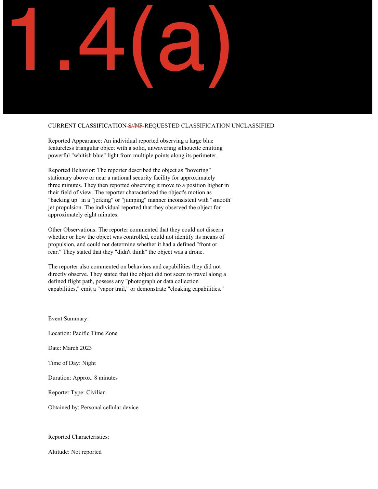 | [📝](docs/reports/061-dow_uap_d51_email_correspondence_pacific_time_zone_march_2023/report.md) |
| **#062 D52** 2024-10-31 · NA | USD(I&S) ↔ 15 AF/DET 1 PAROC email，申請補加 2024 年份到 oval/orb low-speed 2 小時觀測 tearline。 | 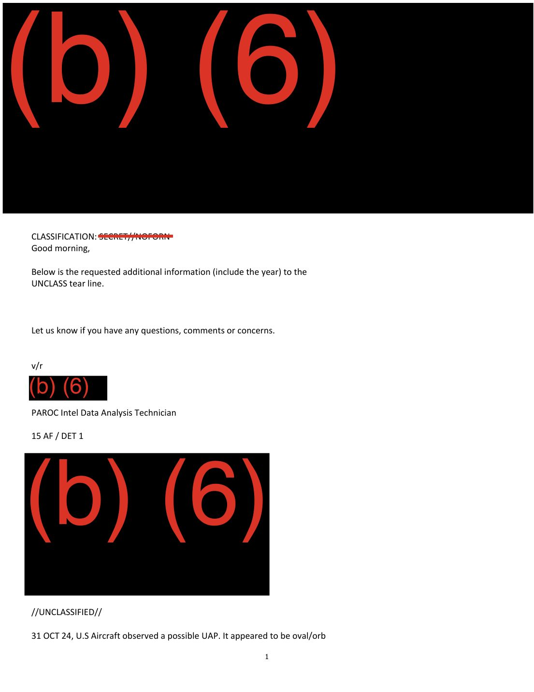 | [📝](docs/reports/062-dow_uap_d52_email_correspondence_na_august_2024/report.md) |
| **#063 D54** NA · E Aegean Sea | p-07 殘文：13:19Z 友軍機 RTB 過 36°34'53"N 25°59'43"E 觀測 1 個 TRIANGLUAR 且 METALLIC UAP at FL250 168 KTS。 | 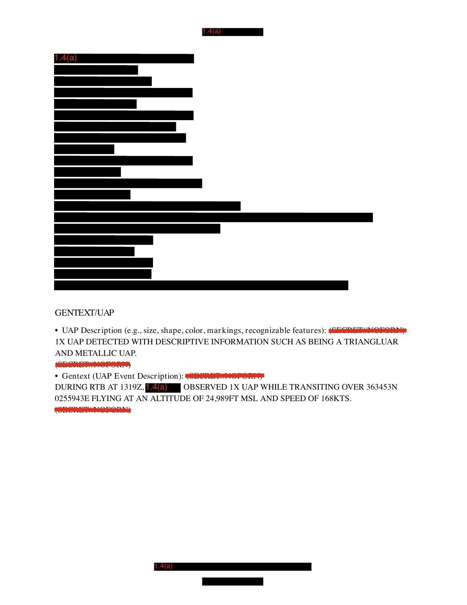 | [📝](docs/reports/063-dow_uap_d54_mission_report_mediterranean_sea_na/report.md) |
| **#064 D55** 2016-11-18 · Syria | 2016 年 11 月，P-8A 監視俄航艦戰鬥群，EO/IR 抓到 500 節 sea-skim 物體，2 分鐘後失聯。 |  | [📝](docs/reports/064-dow_uap_d55_mission_report_syria_2016/report.md) |
| **#065 D56** 2020-08-24 · Arabian Sea | 凌晨直升機看見 1 個 UAP 進雲層，雲層另一側出現的是 3 個編隊。 |  | [📝](docs/reports/065-dow_uap_d56_range_fouler_arabian_sea_aug_2020/report.md) |
| **#066 D57** 2020-09-04 · Gulf of Aden | MQ-9 IR 抓到 8 分鐘冷物體，277 mph 沿 168°，做了 a few abrupt directional changes。 | 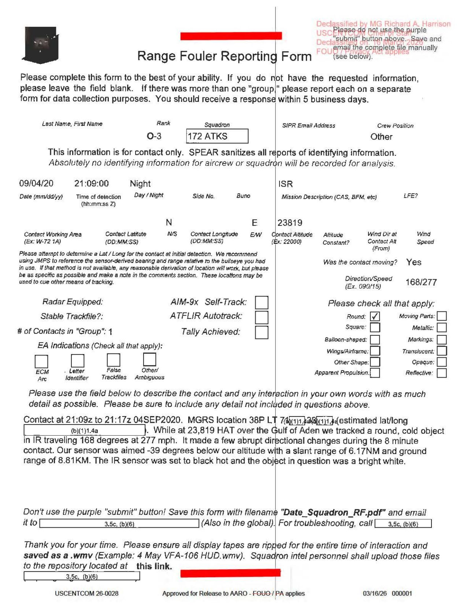 | [📝](docs/reports/066-dow_uap_d57_range_fouler_gulf_of_aden_sep_2020/report.md) |
| **#067 D58** 2020-10-27 · NA | F-15E 鎖定 2 個 IR 目標、一個繞另一個飛，雷達被 Noise Jamming，1/30 秒消失。 |  | [📝](docs/reports/067-dow_uap_d58_range_fouler_na_oct_2020/report.md) |
| **#068 D6** 2020 · Arabian Gulf | 7 頁 PDF，6 頁全黑遮蔽，只剩 22 個英文字交代 1246Z 觀測 1 個 UAP。 | 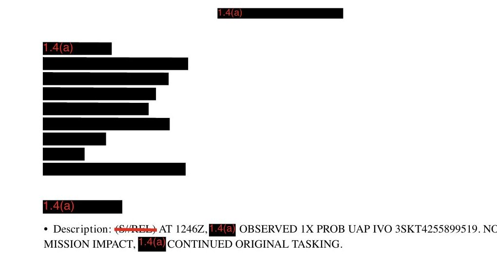 | [📝](docs/reports/068-dow_uap_d6_mission_report_arabian_gulf_2020/report.md) |
| **#069 D60** 2020-08-08 · Arabian Gulf | MQ-9 21 小時任務，UAP 在第 3 小時 49 分以 TRANSITTING 經過，5 小時後被伊朗防空喊話。 | 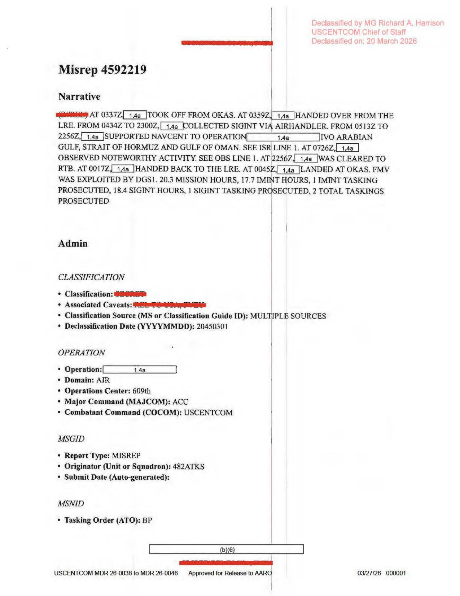 | [📝](docs/reports/069-dow_uap_d60_mission_report_persian_gulf_aug_2020/report.md) |
| **#070 D61** 2020-08-27 · Arabian Gulf | MQ-9 抓到 UNK FORMATION 沿海岸 NE-NW 飛 2 分鐘，輕度雲層遮住後整批消失。 |  | [📝](docs/reports/070-dow_uap_d61_mission_report_persian_gulf_aug_2020/report.md) |
| **#071 D62** 2020-09-16 · Strait of Hormuz | 21h 任務含 3 次伊朗喊話、2 次共 38 分鐘 1.4(g) 不明 EMI 失聯，黃昏前看見 1 個 UAP。 | 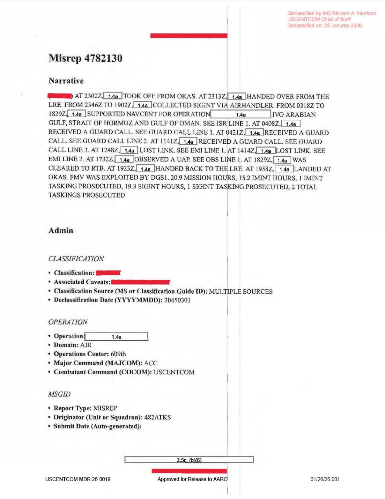 | [📝](docs/reports/071-dow_uap_d62_mission_report_strait_of_hormuz_sep_2020/report.md) |
| **#072 D63** 2020-10-01/02 · Strait of Hormuz | 21h 任務 5 次伊朗喊話、Abu Musa 跑道上拍到 ATR 72-500，UAP 在重霾下被瞄到。 |  | [📝](docs/reports/072-dow_uap_d63_mission_report_strait_of_hormuz_oct_2020/report.md) |
| **#073 D64** 2020-11-02 · Iran | MQ-9 開放水域掃 UUV 3 小時沒找到，UUV 段尾段 5 分鐘內冒出 2 個 UAP。 |  | [📝](docs/reports/073-dow_uap_d64_mission_report_iran_nov_2020/report.md) |
| **#074 D65** 2020-07-16/17 · Arabian Gulf | MQ-9 21h 任務天氣晴朗，連觀 3 個 UAP，並拍下 Naser / Safir Kish / Houdong 三種 IRGCN 艦艇。 |  | [📝](docs/reports/074-dow_uap_d65_mission_report_arabian_gulf_jul_2020/report.md) |
| **#075 D7** 2020 · Arabian Gulf | 6 頁 PDF 5 頁全黑，最末頁冒出 F-15E TFLIR 把 31000 ft 氣球狀 UAP 鎖到 weapons quality。 | 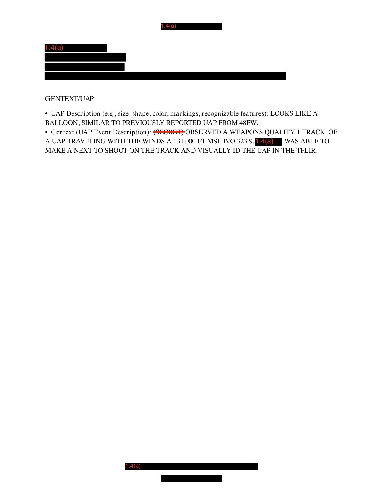 | [📝](docs/reports/075-dow_uap_d7_mission_report_arabian_gulf_2020/report.md) |
| **#076 D74** 2023-11-09 · Syria | 敘利亞 11 小時反 ISIS 任務 RTB 階段，一個 bouncy ball UAP 從南方接近、降高度、424 KN 平直擦肩，41 欄資料卡填好填滿。 | 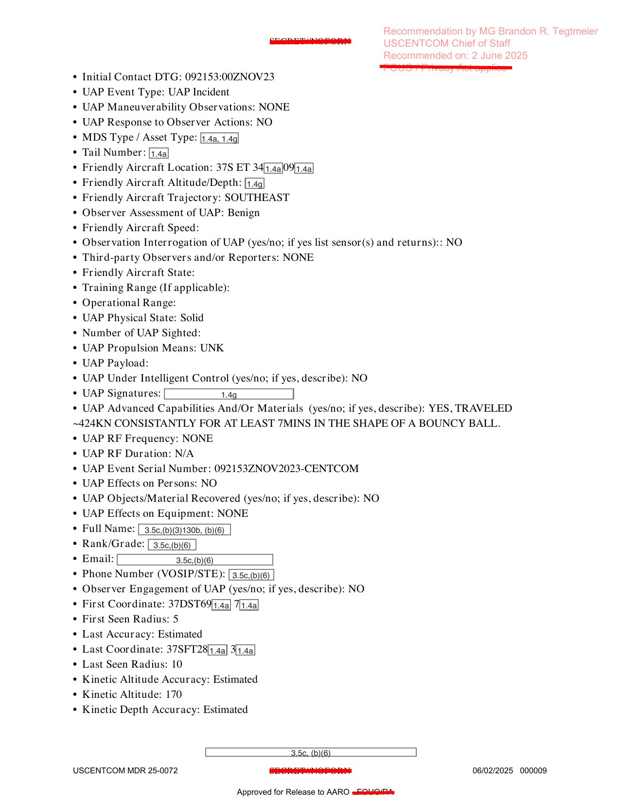 | [📝](docs/reports/076-dow_uap_d74_mission_report_syria_nov_2023/report.md) |
| **#077 D75** 2024-07-14 · Gulf of Aden | 亞丁灣 NAVCENT support ISR 機飛 1 小時 43 分就見 UAP，UAP 走直線同高比飛機快，飛機追到距離過遠才放棄。 | 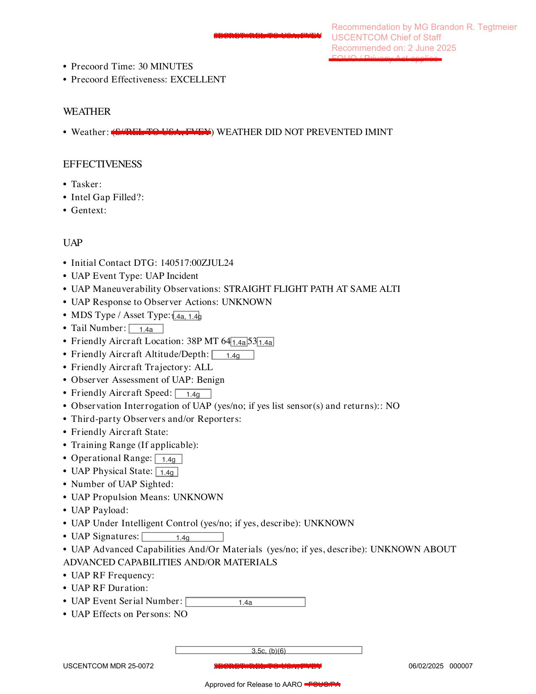 | [📝](docs/reports/077-dow_uap_d75_mission_report_gulf_of_aden_jul_2024/report.md) |
| **#078 D8** 2025 · Mediterranean（標題誤 Djibouti）| 7 頁中 6 頁全黑遮蔽，僅末頁 GENTEXT 可讀，2X round white hot UAPs dynamic south at 240 nm/hr IVO 35SQT 東地中海座標（標題寫 Djibouti 但座標在地中海）。 | 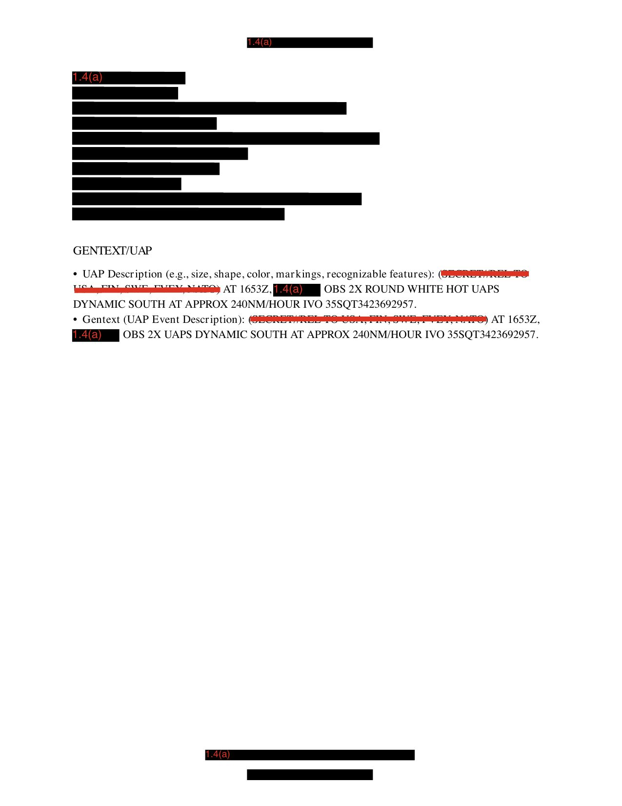 | [📝](docs/reports/078-dow_uap_d8_mission_report_djibouti_2025/report.md) |

---

## 8. 現代軍方未解 UAP 報告（PR，影片／影像，2013–2026）

AARO 未解 UAP 報告，多數為紅外感測器影片片段，部分對應同編號 D 系列 MISREP。影片來源以 DVIDS 鏡像 mp4 為主，搭配 war.gov UFO portal slideshow 縮圖，各報告以截幀方式嵌入畫面。**#080 PR20** 是 PR 系列中唯一一張單張 IR 靜止影像，PDF 直連於 `war.gov/medialink/ufo/release_1/dow-uap-pr20.pdf`，本 repo 從 PDF 抽出原始影像作 cover。

| 標題 | 描述 | 照片 | 報告 |
|---|---|---|---|
| **#079 PR19** Middle East 2022-05 | 5 秒 IR 影片，畫面下三分之一一條對比區由左掃到右，sensor 完全沒有 lock 上。 |  | [📝](docs/reports/079-dow_uap_pr19_video_middle_east_may_2022/report.md) |
| **#080 PR20** Kuwait 2022-05 | PR 系列中唯一一張單張 IR 靜止影像，紅圈標註左上區域一條帶細尾跡的亮體；準星在中央未鎖定，代表感測器無 auto-track。 | 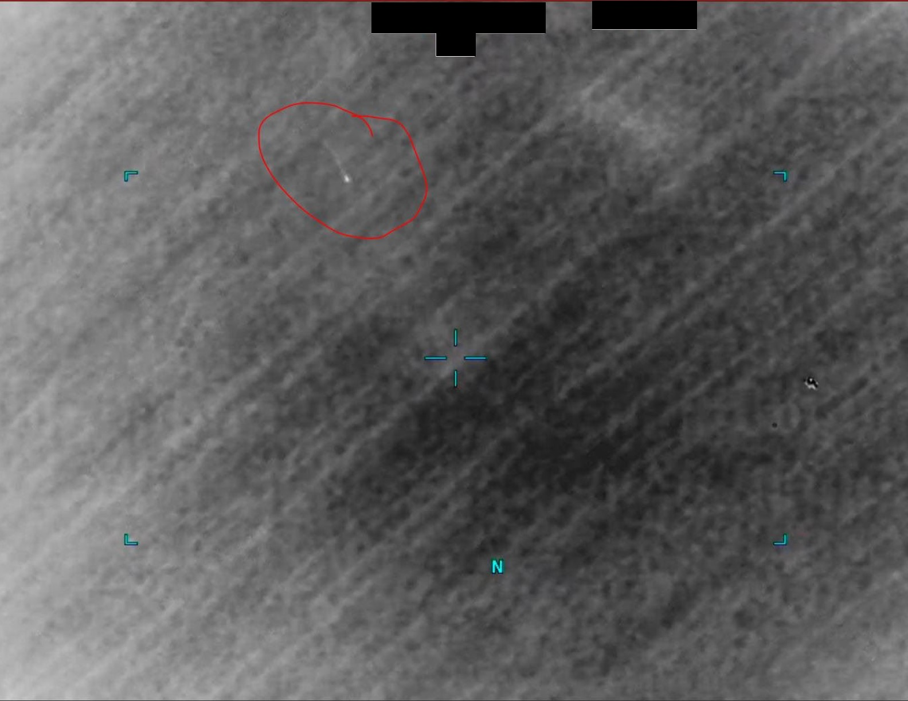 | [📝](docs/reports/080-dow_uap_pr20_image_kuwait_may_2022/report.md) |
| **#081 PR21** Iraq 2022-05 | 10 秒 IR 影片，兩處對比區並肩等距同進同出，VISRECCE 判讀『可能 Su-27/35』但無 IFF。 | 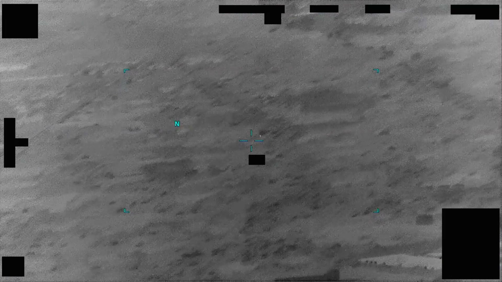 | [📝](docs/reports/081-dow_uap_pr21_video_iraq_may_2022/report.md) |
| **#082 PR22** Syria 2022-07 | 14 秒 IR+EO 分割畫面，5 秒處右上四分之一物體右到左掠過，雙通道比對結果未列在 caption。 | 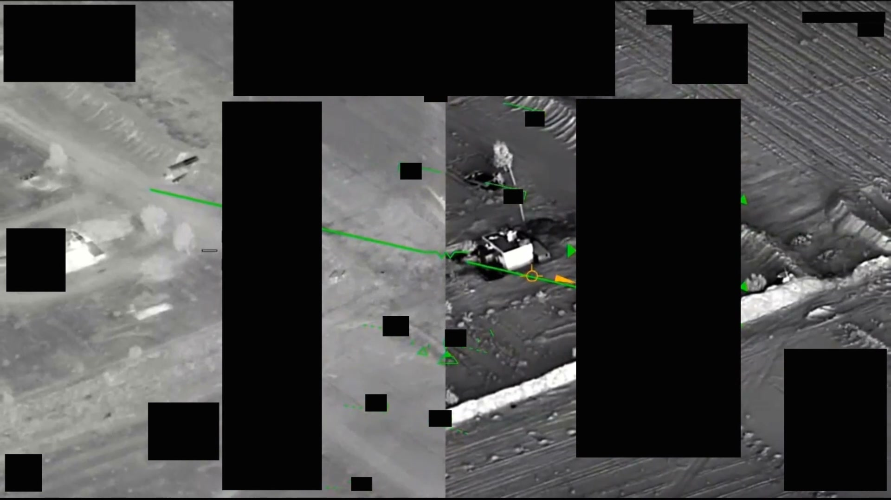 | [📝](docs/reports/082-dow_uap_pr22_video_syria_july_2022/report.md) |
| **#083 PR23** Iraq 2022-12 | 10 秒 IR 影片，對比區從左下斜飛右上，6 秒離開視野後 sensor 沒 follow，D18 首次列入『可能 UAV』分類。 | 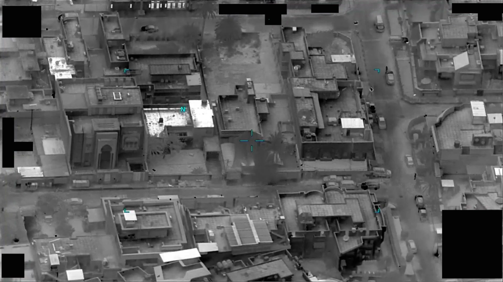 | [📝](docs/reports/083-dow_uap_pr23_video_iraq_december_2022/report.md) |
| **#084 PR26** UAE 2023-10 | 43 秒 IR 影片，前 17 秒對比區停在左上，sensor 橫掃 reacquire，29 秒徹底失鎖。 | 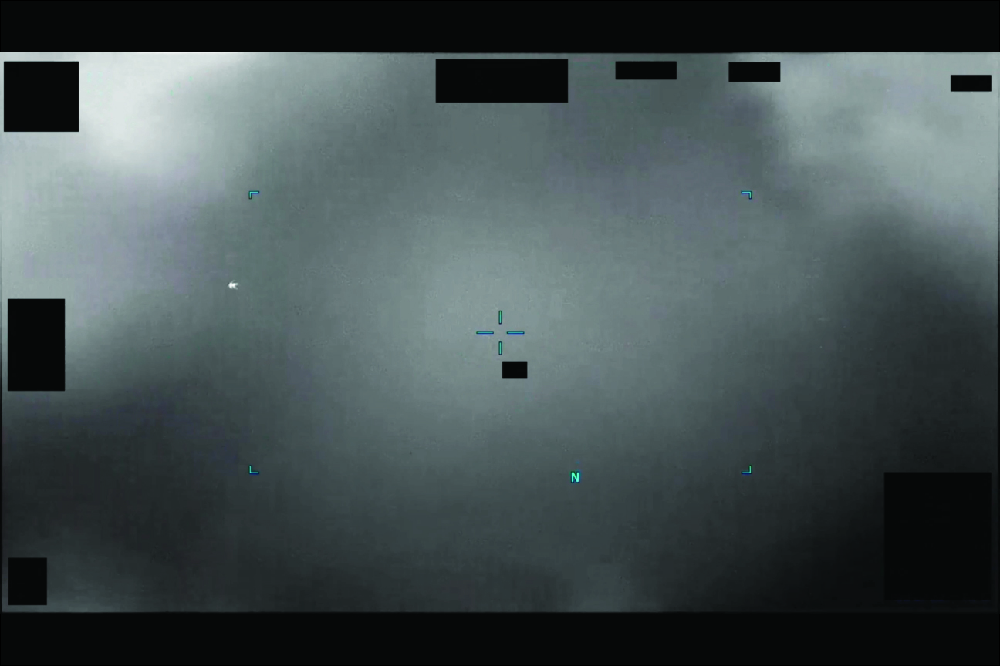 | [📝](docs/reports/084-dow_uap_pr26_video_uae_october_2023/report.md) |
| **#085 PR27** UAE 2023-10 | 4 分 57 秒 IR 影片，Part 1 最長一份，前 1m55s 無內容，後 3 分鐘 sensor stable track 440 mph thermal cold UAP。 | 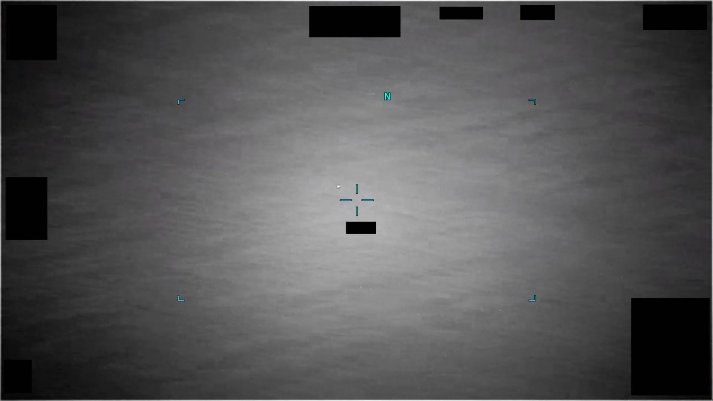 | [📝](docs/reports/085-dow_uap_pr27_video_uae_october_2023/report.md) |
| **#086 PR28** Greece 2024-01 | 1 分 5 秒 EO+SWIR 多模態影片，SWIR 上看得到『倒淚滴+垂直拖尾』，切到可見光同一視野空白。 | 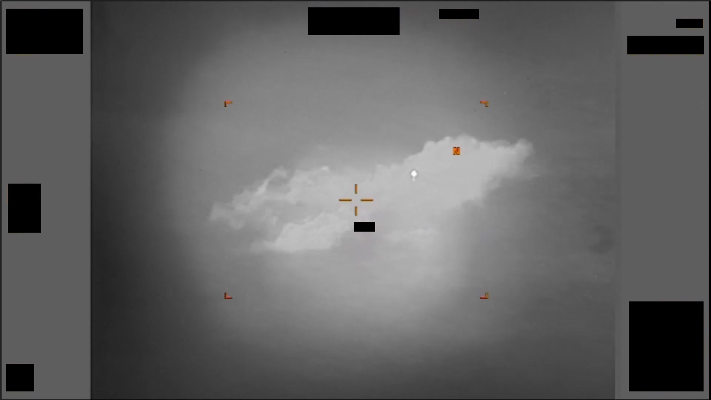 | [📝](docs/reports/086-dow_uap_pr28_video_greece_january_2024/report.md) |
| **#087 PR29** UAE 2024-06 | 21 秒 IR 影片，中央『倒淚滴+垂直拖尾』與 PR28 形態學一致，caption 標『possibly water reflection』但官方仍列 unresolved。 | 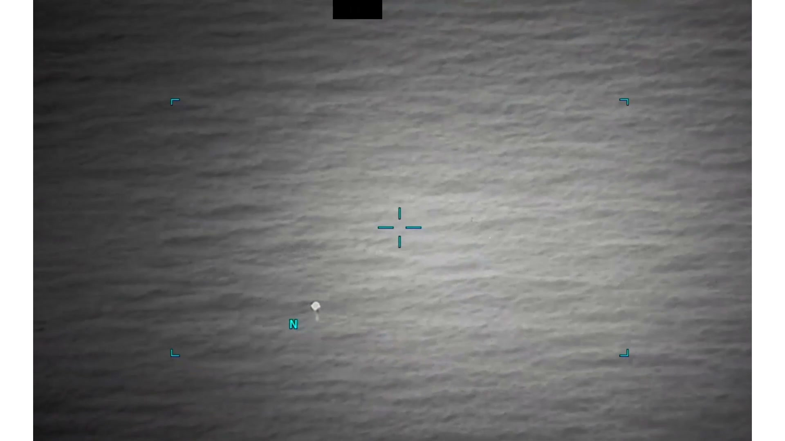 | [📝](docs/reports/087-dow_uap_pr29_video_uae_june_2024/report.md) |
| **#088 PR31** Syria 2024-10 | 5 秒 FMV，前 1 秒畫面上緣多色不規則亮區右到左掠過，對應 D32『Plasma』45 分鐘事件的早段。 | 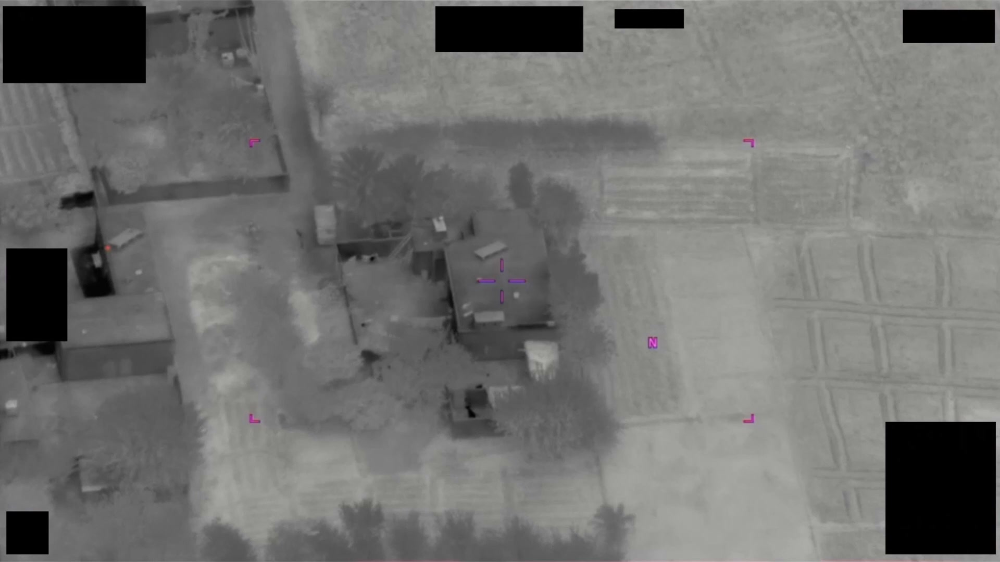 | [📝](docs/reports/088-dow_uap_pr31_video_syria_october_2024/report.md) |
| **#089 PR32** Syria 2024-10 | 6 秒 FMV，2-4 秒頂緣中央白紅色水平半橢圓亮區，D32 plasma 事件中段瞬間。 | 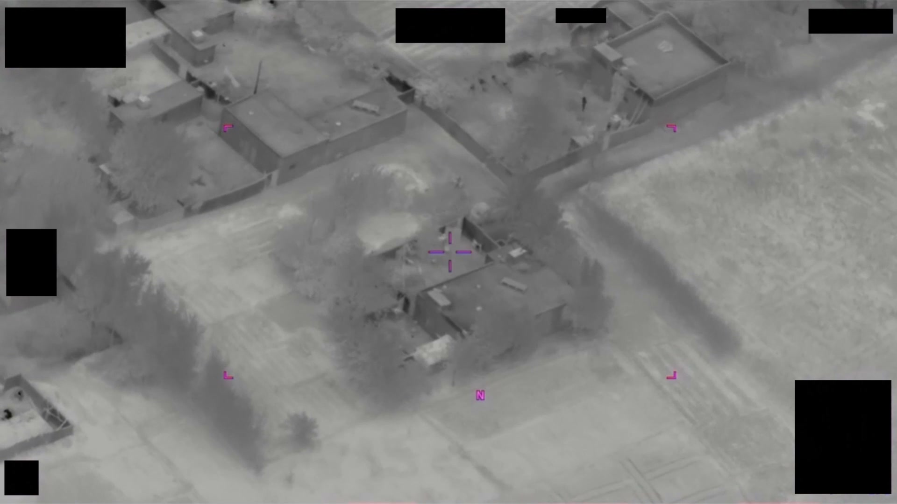 | [📝](docs/reports/089-dow_uap_pr32_video_syria_october_2024/report.md) |
| **#090 PR33** Syria 2024-10 | 5 秒 FMV，1-3 秒兩處半透明橙色不規則亮區同時出現，是 D32 plasma 三段中物理特徵最特別的一段。 | 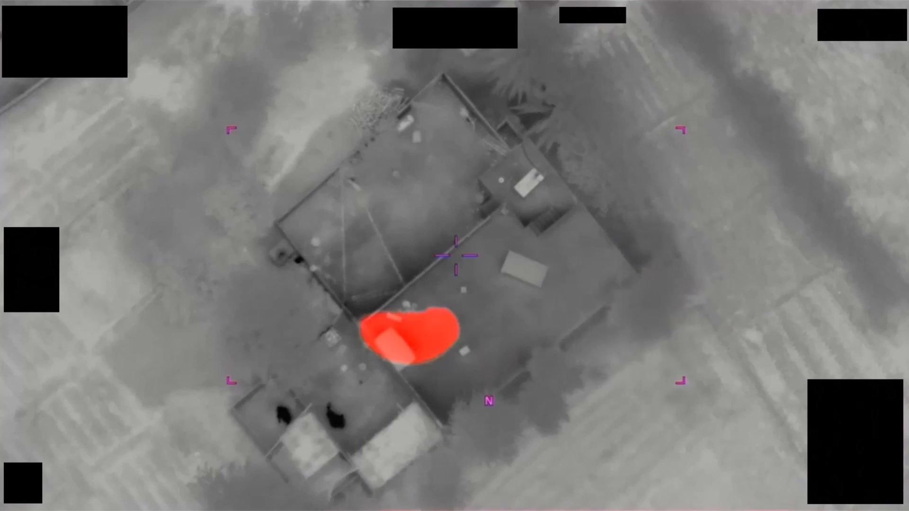 | [📝](docs/reports/090-dow_uap_pr33_video_syria_october_2024/report.md) |
| **#091 PR34** Greece 2023-10 | 2 分 57 秒 IR 影片，1 分鐘起 blue-cross auto-track 鎖定 1 分 22 秒後 2m22s 失鎖，D33『貼海面加多次 90 度轉彎』80 MPH UAP。 |  | [📝](docs/reports/091-dow_uap_pr34_video_greece_october_2023/report.md) |
| **#092 PR35** Greece 2023-10 | 24 秒 IR 影片，sensor narrow zoom 追海面對比區，過 shoreline 後背景熱亂流失鎖，D35 形狀描述與兩日前的 D33 逐字一致。 |  | [📝](docs/reports/092-dow_uap_pr35_video_greece_october_2023/report.md) |
| **#093 PR36** Middle East 2020-05 | 波斯灣 F/A-18 ATFLIR 跟拍水面圓形實體 2 分 17 秒，1m16s 收窄變焦、2m10s 藍十字一閃即失。對應 D38 案件。 | 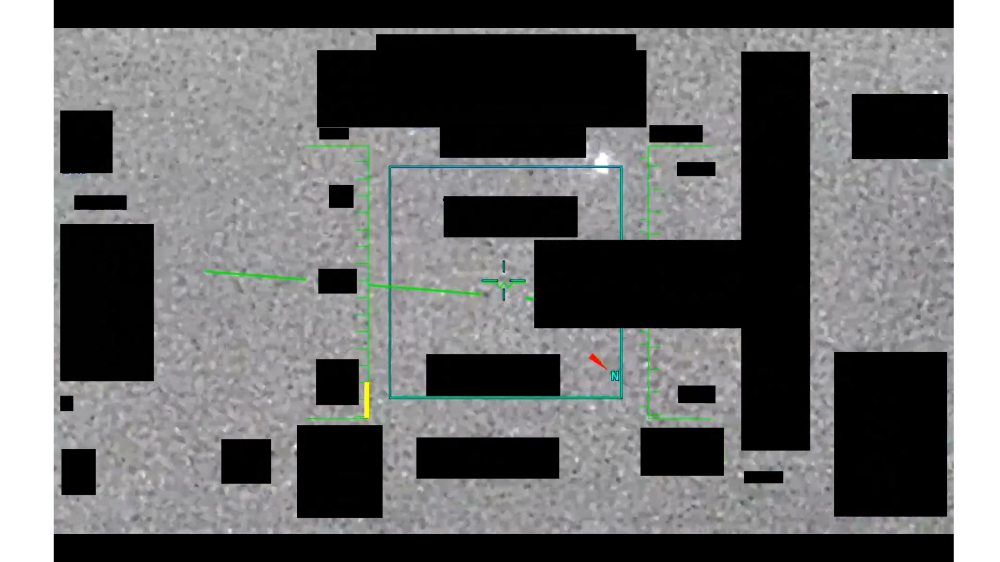 | [📝](docs/reports/093-dow_uap_pr36_middle_east_may_2020/report.md) |
| **#094 PR37** Middle East 2020 | 9 秒 IR 影片，畫面是水面船隻拖出尾跡，6-8 秒間一個微弱熱點從左下進入、爬升、左上離開。無 MISREP、無 caption。 | 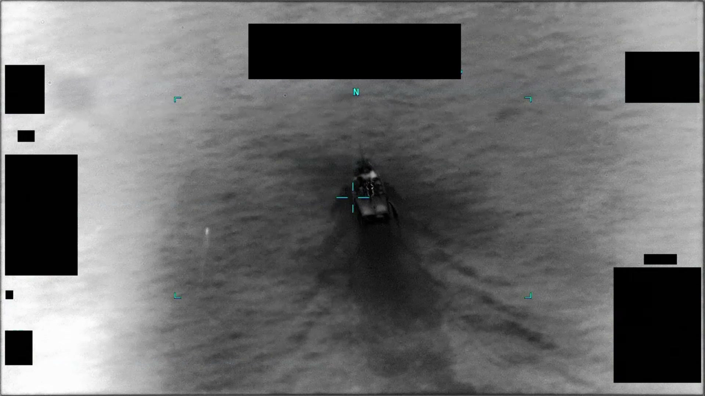 | [📝](docs/reports/094-dow_uap_pr37_middle_east_2020/report.md) |
| **#095 PR38** Middle East 2013 | PR 系列年代最早（2013）的中東案件。畫面中央是「八個臂、臂長交替」的黑色星狀對比區，official caption 親自寫死這個形態。 |  | [📝](docs/reports/095-dow_uap_pr38_middle_east_2013/report.md) |
| **#096 PR39** Middle East 2020 | 5.8 秒 IR 影片，微弱熱點從右下入場、貼底邊橫過、由底邊離開。連做運動學分析都不夠。 | 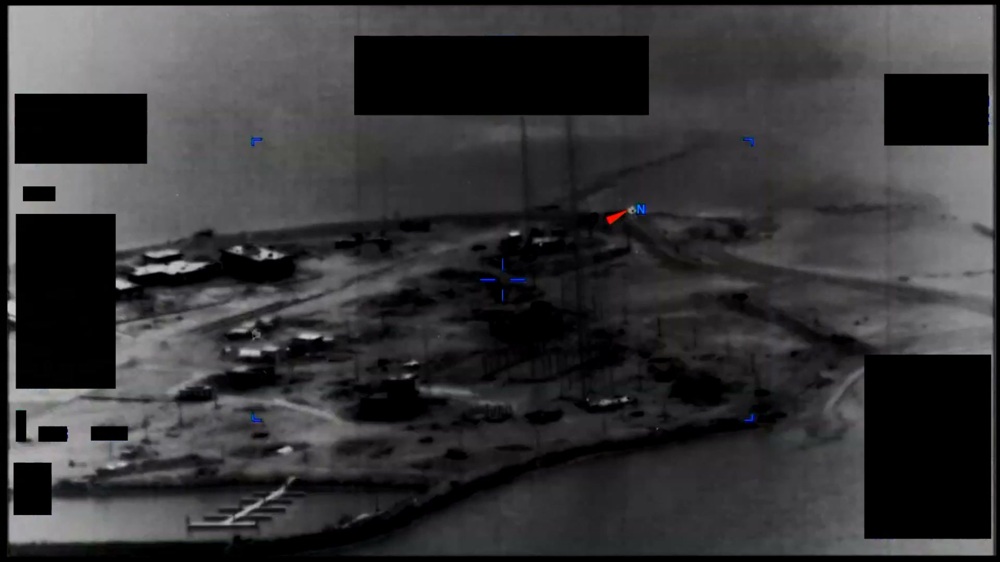 | [📝](docs/reports/096-dow_uap_pr39_middle_east_2020/report.md) |
| **#097 PR40** Middle East 2020 | 1 分 3 秒 IR 影片，第 10 秒 AARO 用白色圓圈+引線指向目標，標籤寫「U/I SMALL THERMAL SIGNATURE」。AARO 親自下 label 的少數案件。 |  | [📝](docs/reports/097-dow_uap_pr40_middle_east_2020/report.md) |
| **#098 PR41** Middle East 2020 | 1 分 34 秒 IR 影片。重點不在「對比區是什麼」，而在「操作員手動 slew 跟」。autotrack 沒鎖上去。 | 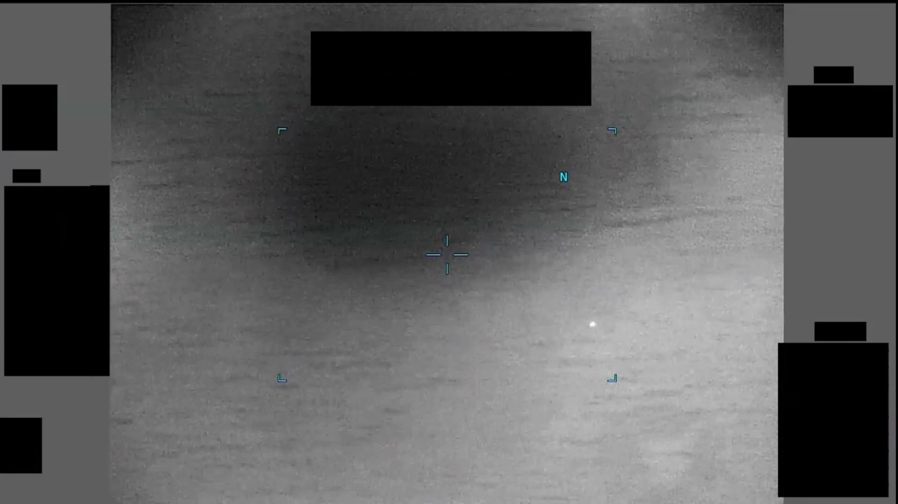 | [📝](docs/reports/098-dow_uap_pr41_middle_east_2020/report.md) |
| **#099 PR42** Middle East 2020 | 4 分 53 秒 IR 影片，中東 2020 案件中最長。操作員一直在切感測器設定（White Hot/Black Hot/模態切換），每次切換目標都消失幾秒。 | 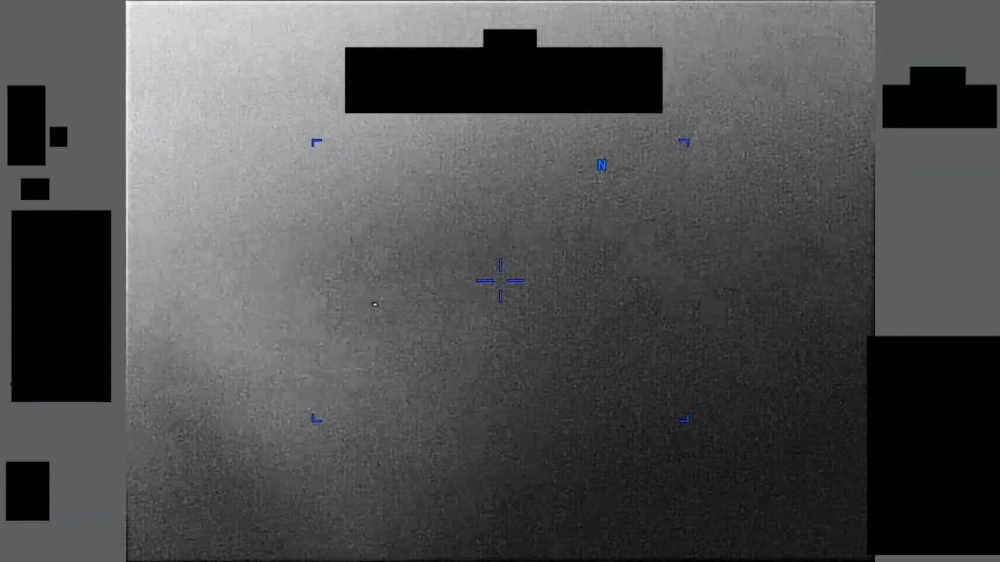 | [📝](docs/reports/099-dow_uap_pr42_middle_east_2020/report.md) |
| **#100 PR43** Africa 2025 | PR 系列首份「非洲」地點案件，年份 2025。原始 2 秒片段，DVIDS 做成 11.7 秒循環。AFRICOM 撤編期，AOR 與年份都是孤例。 | 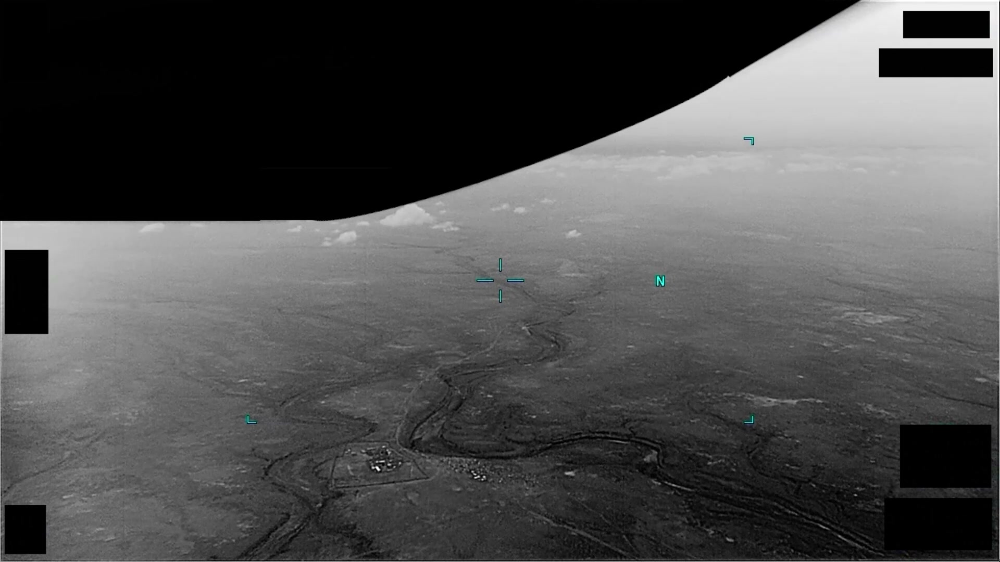 | [📝](docs/reports/100-dow_uap_pr43_africa_2025/report.md) |
| **#101 PR44** Middle East 2020 | 5 分 12 秒 IR 影片，近 3 分鐘主追蹤序列：autotrack 鎖定加多次變焦加 FOV 收窄。鎖得上不等於 ID 得出來。 | 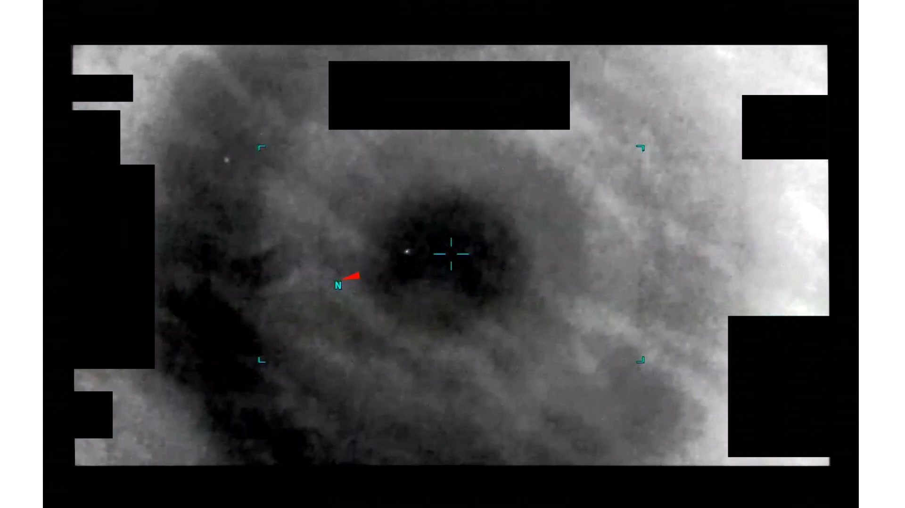 | [📝](docs/reports/101-dow_uap_pr44_middle_east_2020/report.md) |
| **#102 PR45** Middle East 2020 | AARO 主動加 caption 解釋「對比區看起來變大可能是斜距縮短」。AARO 想擋掉「物體在膨脹」這種誤讀。 |  | [📝](docs/reports/102-dow_uap_pr45_middle_east_2020/report.md) |
| **#103 PR46** INDOPACOM 2024 | PR 系列裡少數能用具體形狀詞描述目標的案件。橄欖球狀主體加 3 條徑向突出物（垂直 1 條、斜下 2 條），9 秒內幾何穩定。 | 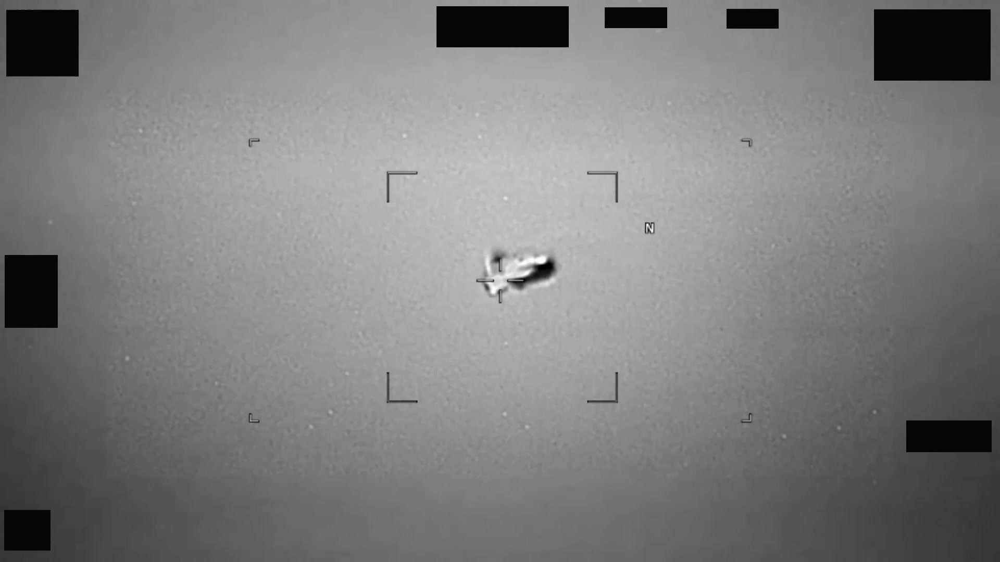 | [📝](docs/reports/103-dow_uap_pr46_indopacom_2024/report.md) |
| **#104 PR47** INDOPACOM 2023 | INDOPACOM 2023，1 分 59 秒 IR 影片。3 處對比區在 2 分鐘內保持精準幾何，要嘛剛體上的多點、要嘛剛體編隊飛行。 |  | [📝](docs/reports/104-dow_uap_pr47_indopacom_2023/report.md) |
| **#105 PR48** INDOPACOM 2024 | 畫面背景是一整片離岸風機，IR 下顯影成黑色三葉剪影。鎖定環圈在風機間水域的小亮點。「最正規」單目標追蹤仍 unresolved。 |  | [📝](docs/reports/105-dow_uap_pr48_indopacom_2024/report.md) |
| **#106 PR49** Army 2026 | PR 系列裡年份最新（2026）且首份來自 Army 通報。陸軍 IR 平台（Apache TADS / Black Hawk FLIR）觀測剖面與海軍/空軍 ISR 不同。 |  | [📝](docs/reports/106-dow_uap_pr49_army_2026/report.md) |

---

## 9. FBI 現代靜止影像（2025，A1–A8 + B1–B24）

A 系列為軍方 FLIR/IR 螢幕截圖（HUD metadata 12 條 1.4(a) 遮蔽，目標為中央十字準星中的圓塊）。B 系列為 1999-12-31 18:10-18:21 美國西部觀測序列（保留時間戳，可重建時間順序）。

### A 系列（Late 2025 軍方 IR 截圖）

| 標題 | 描述 | 照片 | 報告 |
|---|---|---|---|
| **#107 A1** | IR 螢幕中央一個小到只有一兩個像素的小黑點，準星右側留下一個白色『5』字，HUD metadata 被十二條黑條完全擦掉。 |  | [📝](docs/reports/107-fbi_photo_a1/report.md) |
| **#108 A2** | 從 A1 的均勻灰背景切到俯視地面，畫面下半開始出現乾燥地表紋路，目標變成可辨識的暗色塊狀剪影。 | 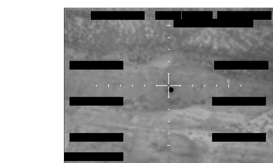 | [📝](docs/reports/108-fbi_photo_a2/report.md) |
| **#109 A3** | 目標被 sensor 操作員放進準星正中央 boresight，圓潤的暗色塊邊緣最銳利，地面紋路換成乾涸河床與鹽鹼地。 | 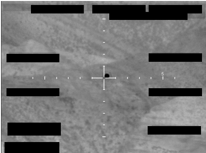 | [📝](docs/reports/109-fbi_photo_a3/report.md) |
| **#110 A4** | 左半邊整片白色覆蓋（疑為 dual-pane 另一個 sensor 視角被移除），右半山地紋路明確、準星偏離畫面中央。 | 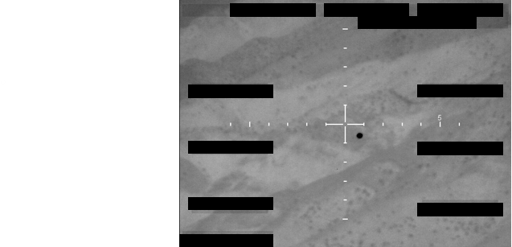 | [📝](docs/reports/110-fbi_photo_a4/report.md) |
| **#111 A5** | 畫面正上方多了一個小白圈（疑為第二個目標），左上角換成大黑方塊覆蓋疑似 PIP 副螢幕的位置。 |  | [📝](docs/reports/111-fbi_photo_a5/report.md) |
| **#112 A6** | 左上角整片重疊黑色覆蓋畫面近 1/4，是 A 系列遮蔽密度最高的一張，右上角才能瞥到一小塊明亮沙質地。 | 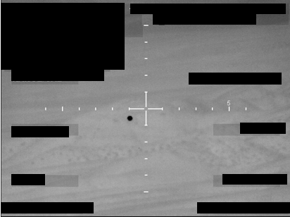 | [📝](docs/reports/112-fbi_photo_a6/report.md) |
| **#113 A7** | 目標從前面六張的暗色翻成亮白色，可能是 Black Hot/White Hot polarity 切換，也可能是 thermally cold signature。 | 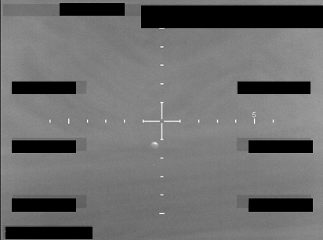 | [📝](docs/reports/113-fbi_photo_a7/report.md) |
| **#114 A8** | 目標縮減到只剩兩三個像素，準星交叉右側的一個極小暗點，看起來像觀測序列自然淡出的結束幀。 | 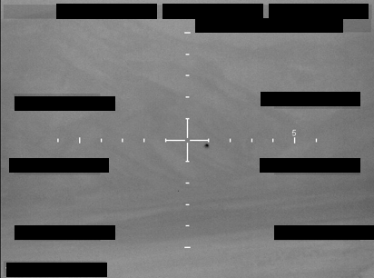 | [📝](docs/reports/114-fbi_photo_a8/report.md) |

### B 系列（1999-12-31 18:10-18:21 美國西部，含 milliradian 刻度準星）

依時間戳排序：

| 標題 | 描述 | 照片 | 報告 |
|---|---|---|---|
| **#135 B6** 18:10:00 | 整個 11 分鐘觀測的起點。大型不規則暗色團塊加下方小目標，是雙物體事件最早的視覺紀錄。 | 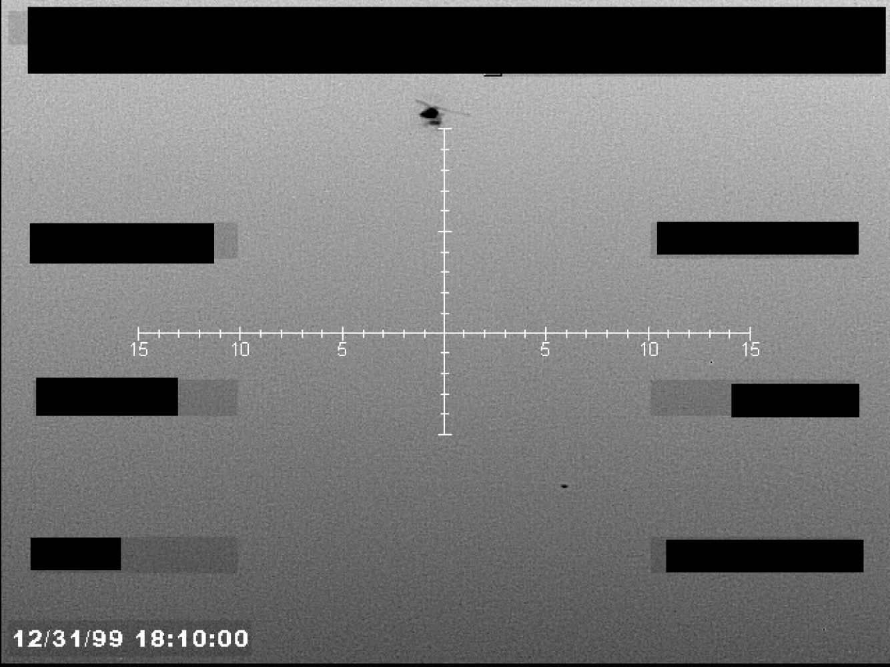 | [📝](docs/reports/135-fbi_photo_b6/report.md) |
| **#136 B7** 18:10:02 | B 系列最短間隔 2 秒，目標位移 6-8 mil。後續 48 秒退化成小點，疑似超音速到高超音速離場。 | 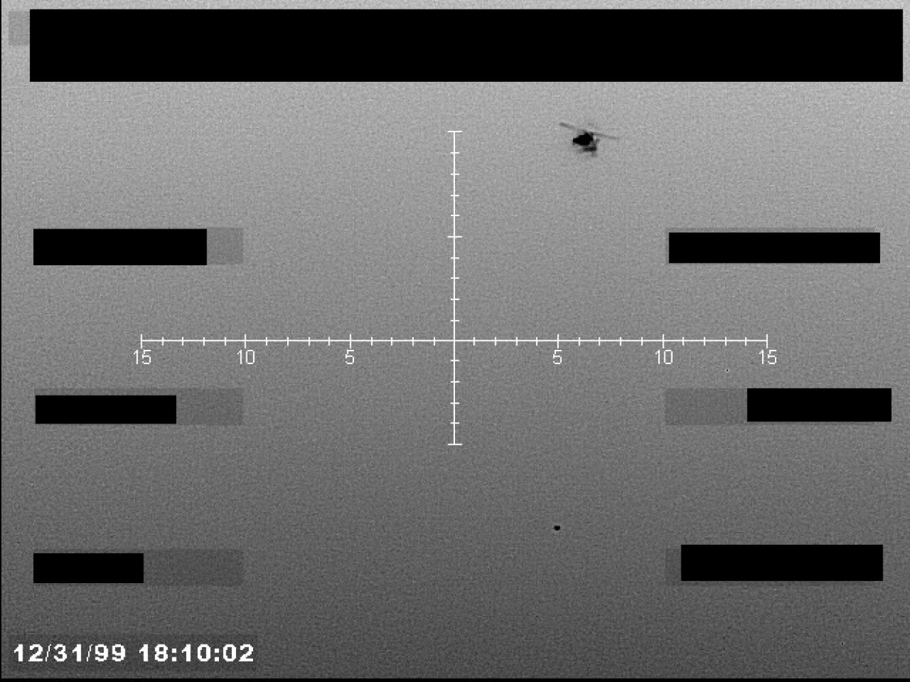 | [📝](docs/reports/136-fbi_photo_b7/report.md) |
| **#137 B8** 18:10:18 | B7 後 16 秒目標從可解析形態退化為單純圓點，是常規追蹤模式的起點。 | 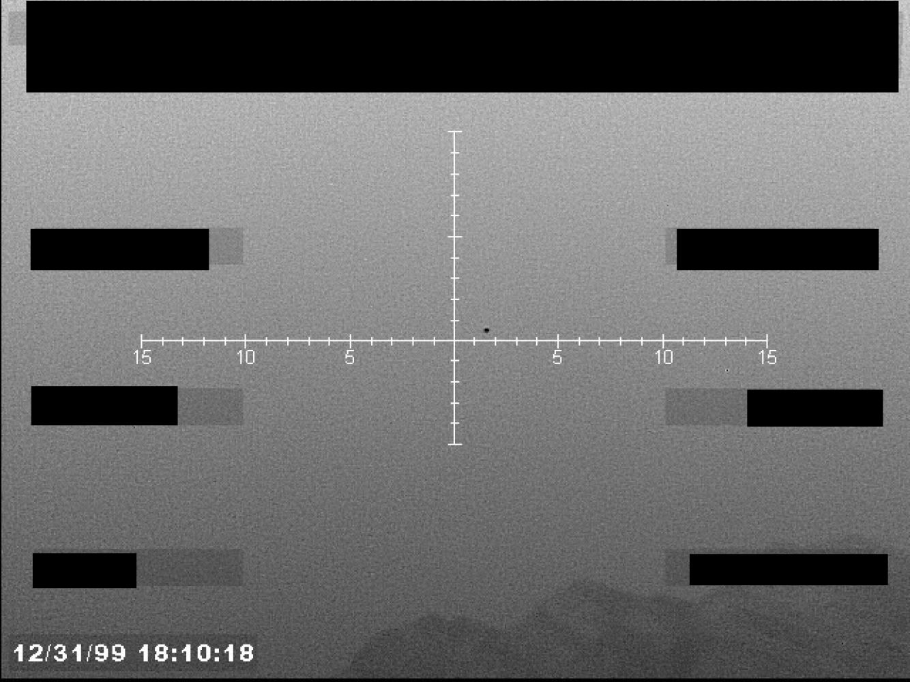 | [📝](docs/reports/137-fbi_photo_b8/report.md) |
| **#138 B9** 18:10:26 | 目標跑到準星左側 -5 到 -6 mil，24 秒內從右穿越到左再穿越回右。三種解讀（擺動 / 平台旋轉 / 多目標）皆成立。 | 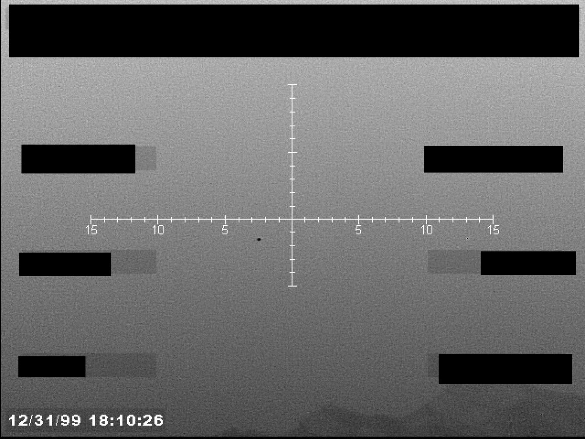 | [📝](docs/reports/138-fbi_photo_b9/report.md) |
| **#116 B10** 18:10:50 | 時間戳 18:10:50 比 B1 早 29 秒（檔名順序與時序相反），準星右側 +5 到 +7 mil 處看到清楚的小黑點目標。 |  | [📝](docs/reports/116-fbi_photo_b10/report.md) |
| **#117 B11** 18:11:06 | 時間戳 18:11:06 落在 B10 與 B1 中間，目標位置從 +5 到 +7 mil 收斂到 +2 到 +3 mil，背景幾乎不變意味平台接近靜止。 | 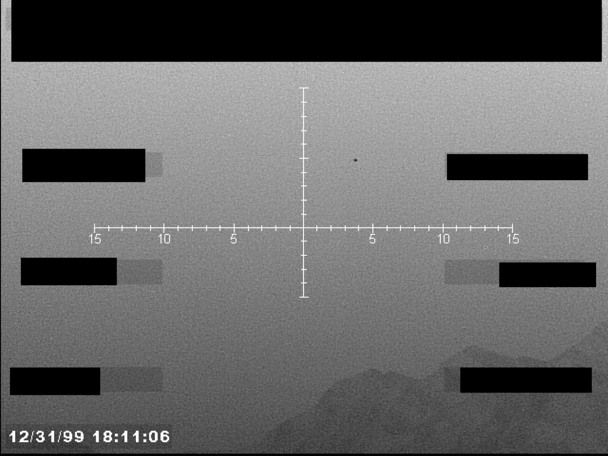 | [📝](docs/reports/117-fbi_photo_b11/report.md) |
| **#118 B12** 18:11:12 | 時間戳 18:11:12，22 秒內第四張關鍵幀。目標位置從靠近準星中心再略微外移，疑為 sensor 主動追蹤失準的瞬間。 | 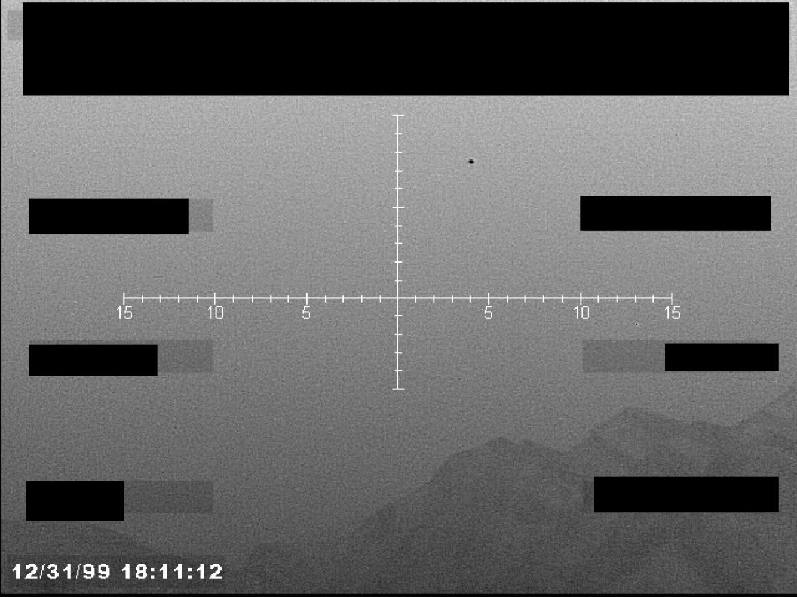 | [📝](docs/reports/118-fbi_photo_b12/report.md) |
| **#115 B1** 18:11:19 | 左下角白字時間戳『12/31/99 18:11:19』沒被遮，準星帶刻度測量網格（±15 mil 編號），右下角有微弱遠山稜線。 |  | [📝](docs/reports/115-fbi_photo_b1/report.md) |
| **#126 B2** 18:11:27 | B1 之後 8 秒目標重新出現，第一波至少 5 幀。對應 D32 周期性可見的閃爍現象。 |  | [📝](docs/reports/126-fbi_photo_b2/report.md) |
| **#132 B3** 18:11:34 | B2 後 7 秒目標對比下降，可能是大氣熱對流造成的視覺起伏。 | 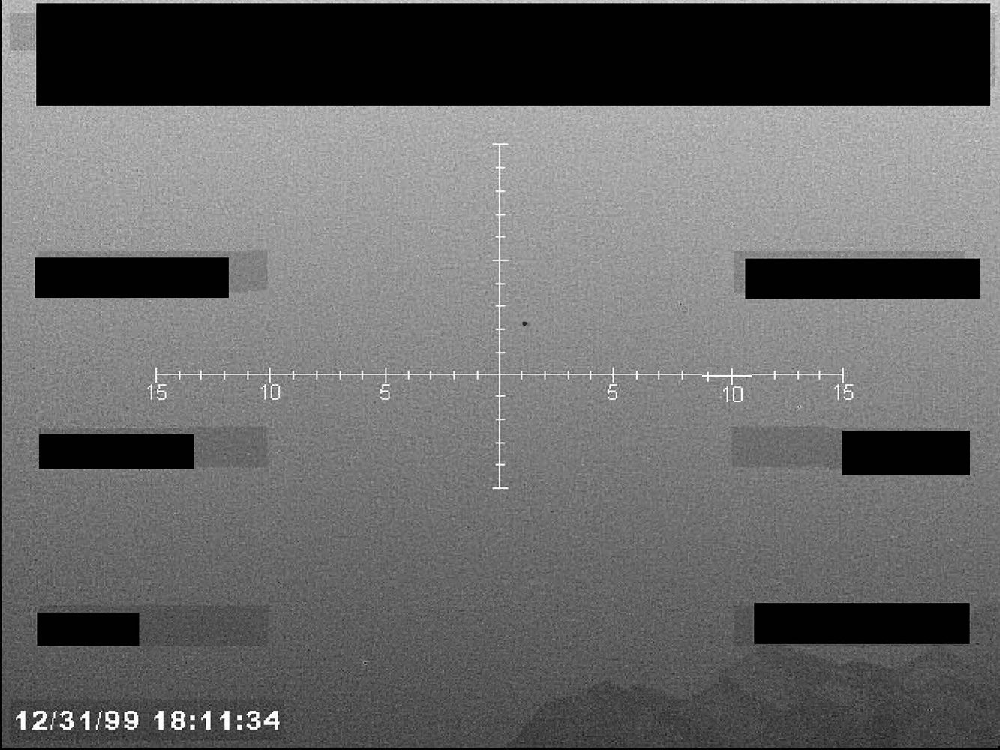 | [📝](docs/reports/132-fbi_photo_b3/report.md) |
| **#133 B4** 18:12:16 | B 系列最大相鄰幀間隔 42 秒。目標仍在原位附近，意味物體不快速橫越，而是漂浮盤旋。 | 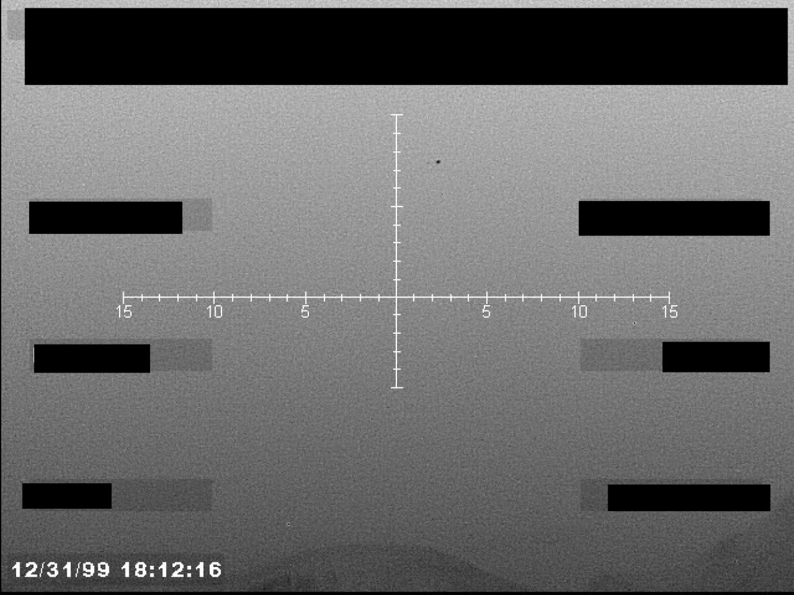 | [📝](docs/reports/133-fbi_photo_b4/report.md) |
| **#134 B5** 18:12:20 | 已公開廣角影像的最後一張，準星附近看不出目標。之後 6 分 33 秒完全空白。 |  | [📝](docs/reports/134-fbi_photo_b5/report.md) |
| **#125 B19** 18:18:53 | 第一波與第二波之間 7 分 34 秒空白中的唯一保留幀，sensor 從廣角過渡到 zoom in 的決定瞬間。 |  | [📝](docs/reports/125-fbi_photo_b19/report.md) |
| **#127 B20** 18:18:58 | B19 後 5 秒，廣角下首次出現雙塊形態，比第二波 zoom in 早 56 秒就看出兩個元素。 |  | [📝](docs/reports/127-fbi_photo_b20/report.md) |
| **#128 B21** 18:19:06 | 8 秒後雙塊形態維持不變，sensor 廣角設定也未切換。下一動作就是 zoom in。 |  | [📝](docs/reports/128-fbi_photo_b21/report.md) |
| **#129 B22** 18:19:19 | 真正的 zoom in 起點（比原以為的 B13 早 35 秒），兩個分開圓塊邊緣清晰可辨。 |  | [📝](docs/reports/129-fbi_photo_b22/report.md) |
| **#130 B23** 18:19:33 | 14 秒後從分變成合，水平延伸的拉長形態，分合循環的中間幀。 |  | [📝](docs/reports/130-fbi_photo_b23/report.md) |
| **#131 B24** 18:19:40 | 7 秒後出現翼狀延伸的複雜形態，前後 14 秒無支持，可能是 sensor 雜訊或物體 morphing。 | 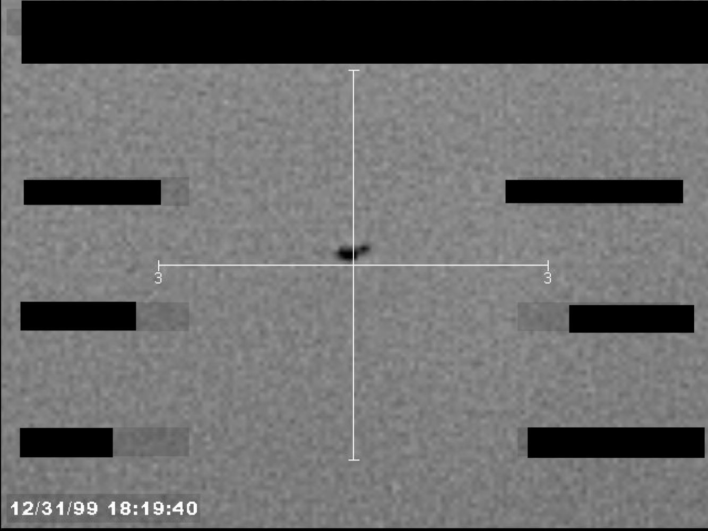 | [📝](docs/reports/131-fbi_photo_b24/report.md) |
| **#119 B13** 18:19:54 | 距 B1 過了 8 分 35 秒，sensor 比例尺從 ±15 mil 縮到 ±3 mil（zoom 5 倍），目標形態出現主體加右側突起的不對稱結構。 |  | [📝](docs/reports/119-fbi_photo_b13/report.md) |
| **#120 B14** 18:20:08 | 距 B13 14 秒，B13 那個「主體 + 突起」變成兩個分開的圓潤暗色塊，並排同大小同對比的雙物體。 |  | [📝](docs/reports/120-fbi_photo_b14/report.md) |
| **#121 B15** 18:20:22 | 距 B14 14 秒，兩個分開的黑點相對位置幾乎不變，壓掉「分裂中」解讀、剩下「編隊飛行」或「同物體雙熱源」兩種可能。 | 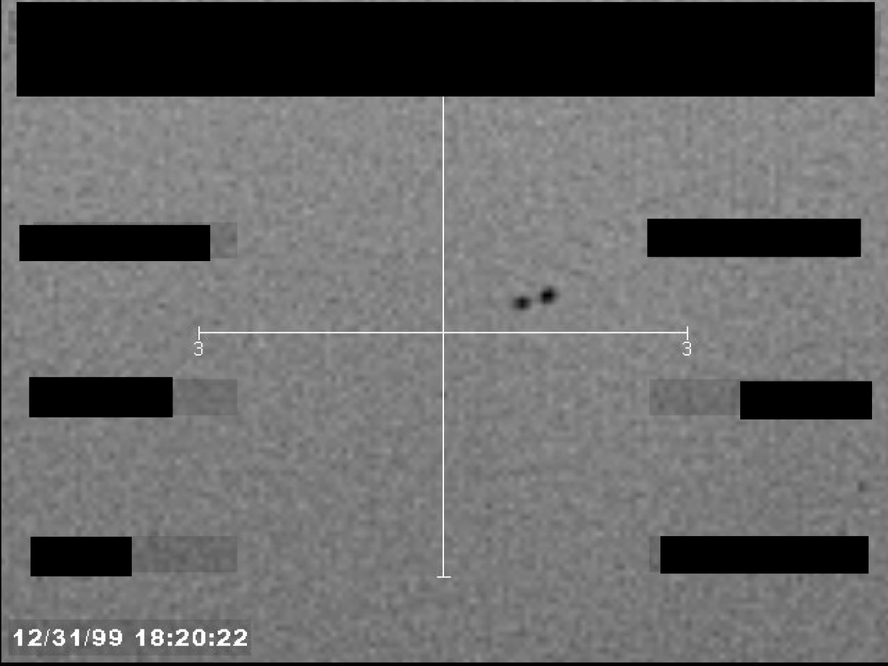 | [📝](docs/reports/121-fbi_photo_b15/report.md) |
| **#122 B16** 18:20:41 | 距 B15 19 秒，兩個分開的物體又合回 B13 那種「主體 + 小突起」的形態，47 秒內走完「合 → 分 → 分 → 合」循環。 | 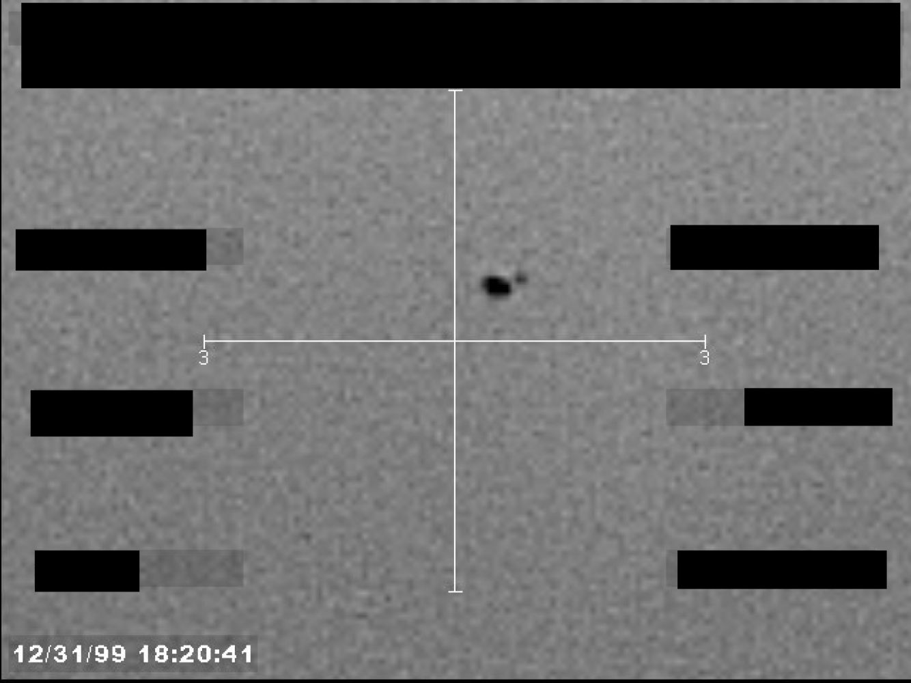 | [📝](docs/reports/122-fbi_photo_b16/report.md) |
| **#123 B17** 18:20:48 | 距上一幀只 7 秒，兩塊又分開了。54 秒內合-分-分-合-分，疑似繞行軌跡。 | 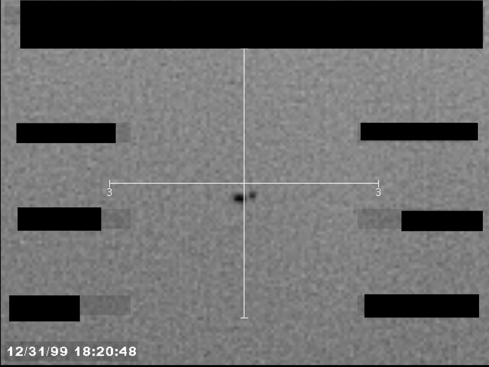 | [📝](docs/reports/123-fbi_photo_b17/report.md) |
| **#124 B18** 18:21:02 | 第二波 6 幀的最後一張，兩塊靠近但未完全合併。68 秒內 6 次形態切換。 | 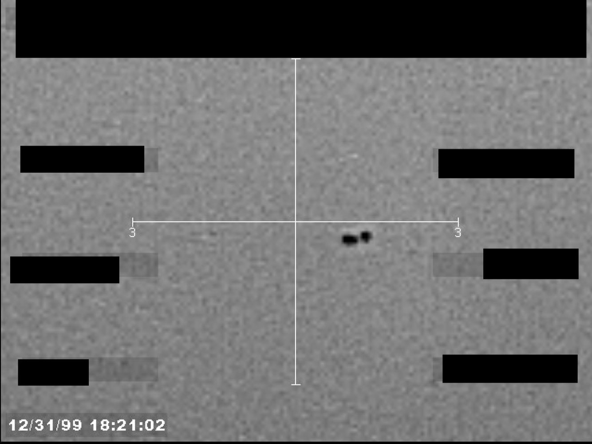 | [📝](docs/reports/124-fbi_photo_b18/report.md) |

整體觀測涵蓋約 10 分 12 秒（18:10:50-18:21:02）。

---

## 10. 2023 美國西部目擊事件

7 名聯邦政府雇員 2023 年兩天內分別觀測多次未明現象。回報內容分四類：（1）遠處「光球發射光球」、（2）近距離大型靜止發光球、（3）追逐近地大型現象、（4）「半透明風箏」狀大型透明現象。AARO 評為目前持有最值得關注事件之一。

| 標題 | 描述 | 照片 | 報告 |
|---|---|---|---|
| **#156 USPER Statement** Late 2025 | 2025 年資深情報官員搭直升機 FLIR + NVG 搜山，22:18 起連續五次目擊橙色光球編隊『flare up 一個個亮起、flare down 相反順序熄滅』、向軍機追擊。 |  | [📝](docs/reports/156-usper_statement_uap_sighting/report.md) |
| **#157 Composite Sketch** 2023-09 | FBI 實驗室依 #159 訪談證詞畫的合成草圖，銅金屬色橢球體加東端強烈藍白光，背景晴朗天空加樹線加草地加混凝土道路。 |  | [📝](docs/reports/157-fbi_september_2023_composite_sketch/report.md) |
| **#158 FBI 302（光點）** 2023-09 | 次要目擊者，三輛 LiDAR 試驗車隊穿閘門時看到地平線上方一道靜止白光、向右移動、10 秒消失，FaceTime 訪談。 | 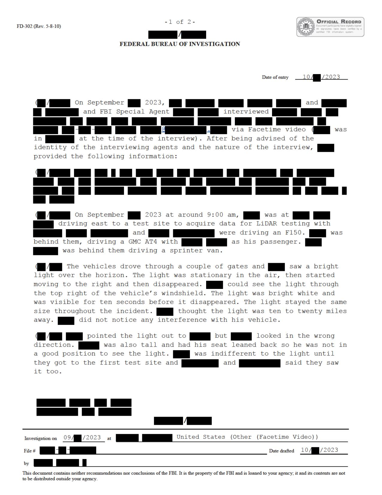 | [📝](docs/reports/158-fbi_september_2023_serial_3/report.md) |
| **#159 FBI 302（雪茄銅色）** 2023-09 | 試驗場區域主管，限飛區內閘門 fob 連三次失敗第四次才開，抬頭看到雪茄形銅金屬色物體 5-10 秒後 just disappeared；15 年現場經驗從未見過類似物。 |  | [📝](docs/reports/159-fbi_september_2023_serial_4/report.md) |
| **#160 FBI 302（線狀灰色）** 2023-09 | LiDAR 無人機操作員，看到 5,000 ft 上空線狀金屬灰物體、東西向、光內有條帶、無翼無排氣、5-10 秒消失；當晚酒店暴風雨電視斷訊 freaked out。 | 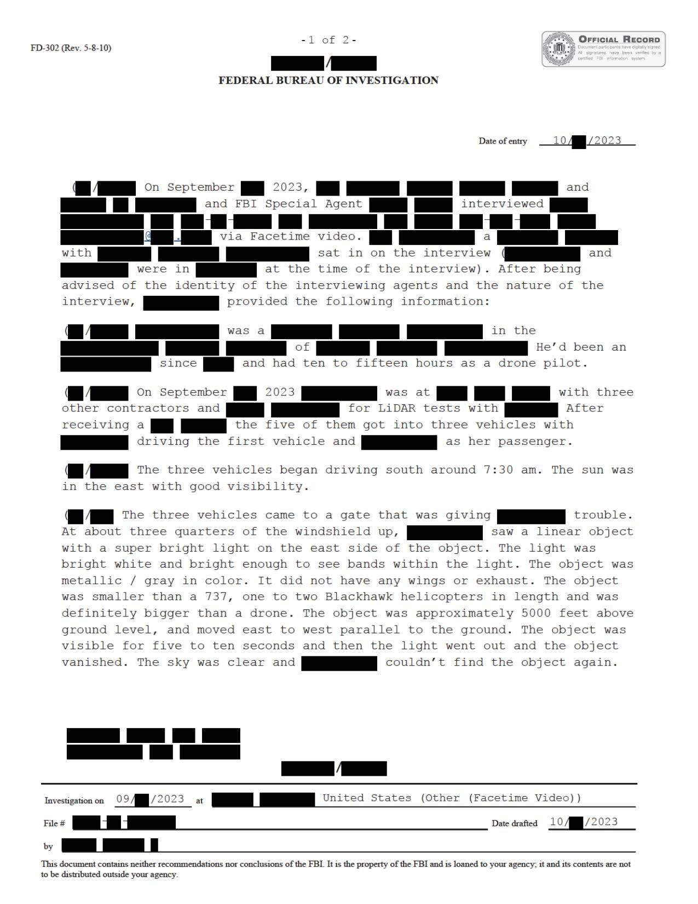 | [📝](docs/reports/160-fbi_september_2023_serial_5/report.md) |
| **#161 Western US Event** 2023 | 7 名聯邦執法探員兩日內目擊四種型態：Orbs Launching Orbs、Large Fiery Orb（AARO 量測直徑 12-18 m 距 1,050 m）、Dark Kite（偽裝成汽車）、Transparent Kite（NVG 可透視看到星光）。 |  | [📝](docs/reports/161-western_us_event/report.md) |
