# United States UAP Files

US Department of War 透過 PURSUE 系統解密公開的 UAP 檔案，中文索引與逐檔分析。

官方 portal: <https://www.war.gov/UFO/>

進度：124 / 161 完成。每條目附封面 + 中文報告（已完成）或官方連結（未完成）。

## 縮寫

- AARO All-domain Anomaly Resolution Office（全領域異常解決辦公室）
- DOW Department of War（戰爭部）
- DOS Department of State（國務院）
- USPER U.S. PERSON（美國公民／居民／法人）
- MISREP Mission Report（任務報告）
- PR Unresolved UAP Report（未解 UAP 報告）
- SAC Special Agent in Charge（FBI 特別探員主管）
- CMP / LMP Command / Lunar Module Pilot（指揮艙／登月艙駕駛）
- FBI 302 FBI 訪談紀錄表

## 分類索引

| # | 類別 | 數量 | 完成 |
|---|---|---|---|
| 1 | [FBI 62-HQ-83894 案卷（1947–1968 飛碟潮）](#cat1) | 18 | 10 |
| 2 | [二戰到冷戰初期（1944–1955）](#cat2) | 6 | 6 ✅ |
| 3 | [事件摘要單冊（Incident Summaries）](#cat3) | 3 | 3 ✅ |
| 4 | [1950s–60s 政府反應與目擊](#cat4) | 4 | 4 ✅ |
| 5 | [NASA 太空任務（1965–1974）](#cat5) | 15 | 13 |
| 6 | [冷戰晚期外交電報（1985–2004）](#cat6) | 5 | 5 ✅ |
| 7 | [現代軍方任務報告（MISREP / Range Fouler，2016–2025）](#cat7) | 44 | 44 ✅ |
| 8 | [現代軍方未解 UAP 報告（PR，2013–2026）](#cat8) | 28 | 0 |
| 9 | [FBI 現代靜止影像（2025，A1–A8 + B1–B24）](#cat9) | 32 | 32 ✅ |
| 10 | [2023 美國西部目擊事件](#cat10) | 6 | 6 ✅ |

---

## 1. FBI 62-HQ-83894 案卷（1947–1968 飛碟潮）

1947-06 至 1968-07 期間 UFO 與飛碟的 FBI 調查紀錄、目擊證詞、民眾通報、Oak Ridge 影像、推進系統技術提案、UFO 大會議程、媒體剪報。完整版較 FBI vault 多出數頁、塗黑極少。

| 標題 | 描述 | 照片 | 報告 |
|---|---|---|---|
| **#001 Section 10** | 1968 案件、FBI 立場已轉為 NASA 對接 | 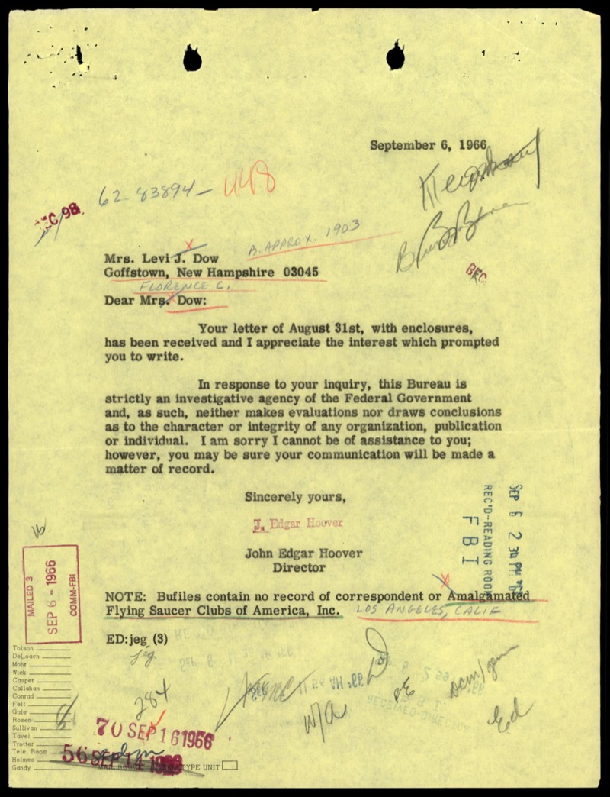 | [📝](reports/001-65_hs1-834228961_62-hq-83894_section_10/report.md) |
| **#002 Section 2** | 1947 飛碟潮起源：Arnold、Rhodes、FBI 內部「Army 實驗」假設 |  | [📝](reports/002-65_hs1-834228961_62-hq-83894_section_2/report.md) |
| **#003 Section 3** | Maury Island 黑衣人原型 + B-25 雙人罹難 + Twin Falls Urie + 10-1 FBI 退出 UFO 調查 | 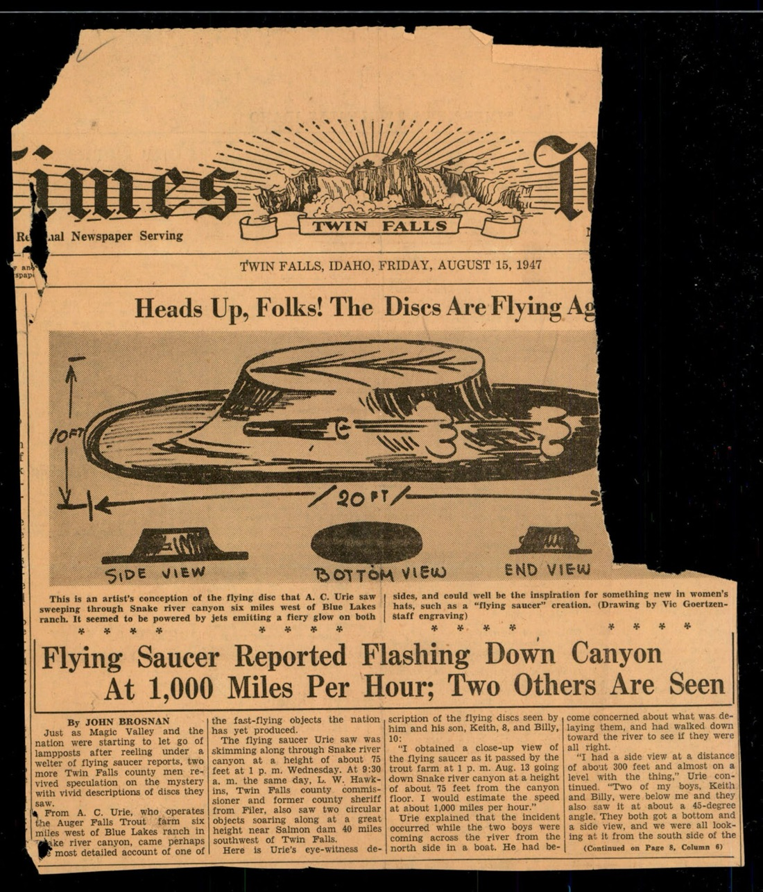 | [📝](reports/003-65_hs1-834228961_62-hq-83894_section_3/report.md) |
| **#004 Section 4** | FBI 退出令 4 個月後被空軍打破 + Chiles-Whitted DC-3 + Frisbee 誕生 + Project SIGN 土壤樣本 + SIGN 改 GRUDGE | 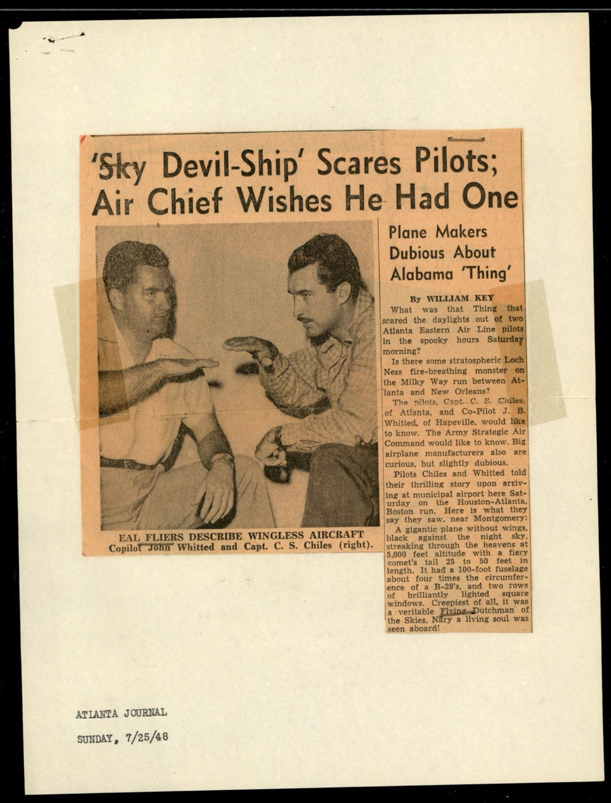 | [📝](reports/004-65_hs1-834228961_62-hq-83894_section_4/report.md) |
| **#005 Section 5** | Winchell「外星人來看原子彈」+ 1950-03 Oak Ridge 40,000 ft 雷達多機構聯動 + Boggs/Hearn 75% 可解釋 | 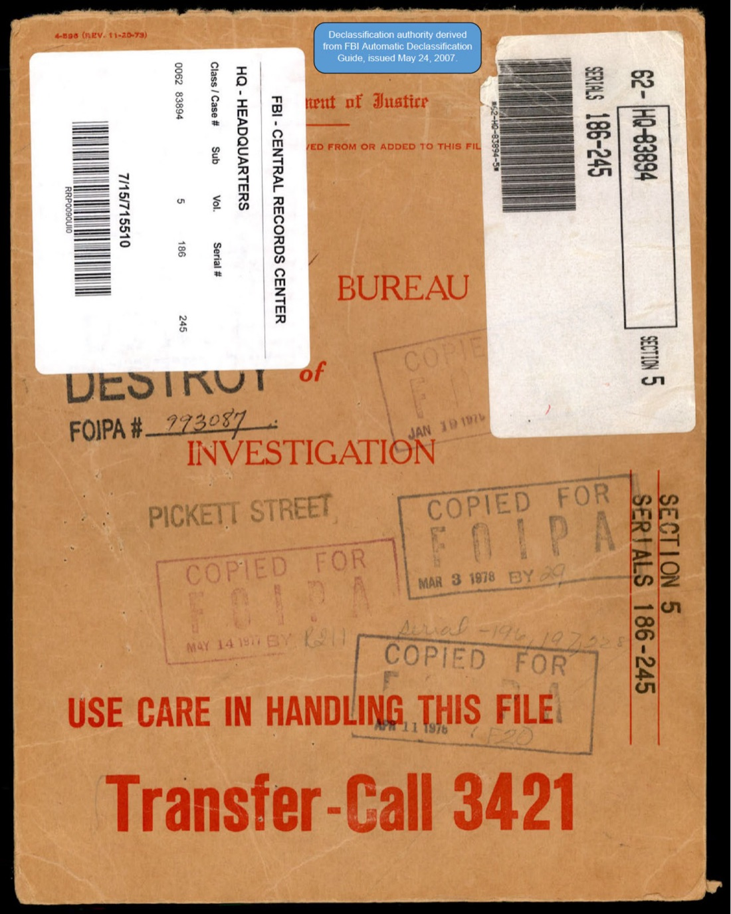 | [📝](reports/005-65_hs1-834228961_62-hq-83894_section_5/report.md) |
| **#006 Section 6** | New Mexico Green Fireballs + Project Twinkle + Liddel ONR「全是 Skyhook 氣球」+ Menzel 倒置層理論 + Lubbock Lights |  | [📝](reports/006-65_hs1-834228961_62-hq-83894_section_6/report.md) |
| **#007 Section 7** | 1948 Gorman Fargo 空戰 + 1950 New Yorker Project Saucer 報導 + 1952-07 Washington DC 雷達視覺案 | 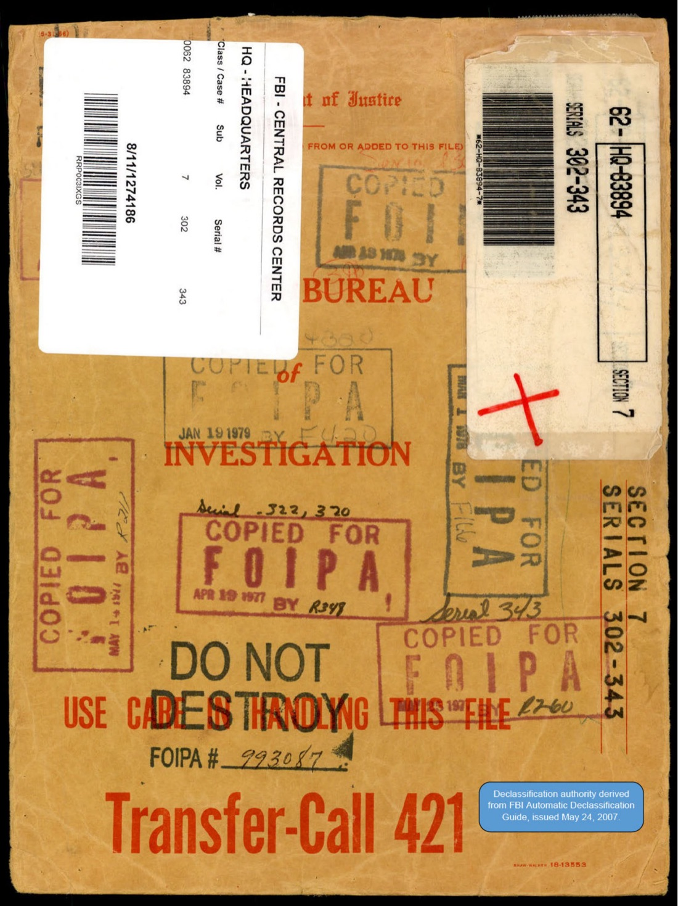 | [📝](reports/007-65_hs1-834228961_62-hq-83894_section_7/report.md) |
| **#008 Section 9** | Sputnik 後飛碟潮 + Levelland 引擎熄火 + Stringfield Tsar Bomba 預警匿名電話 + Bryant manuscript 案 | 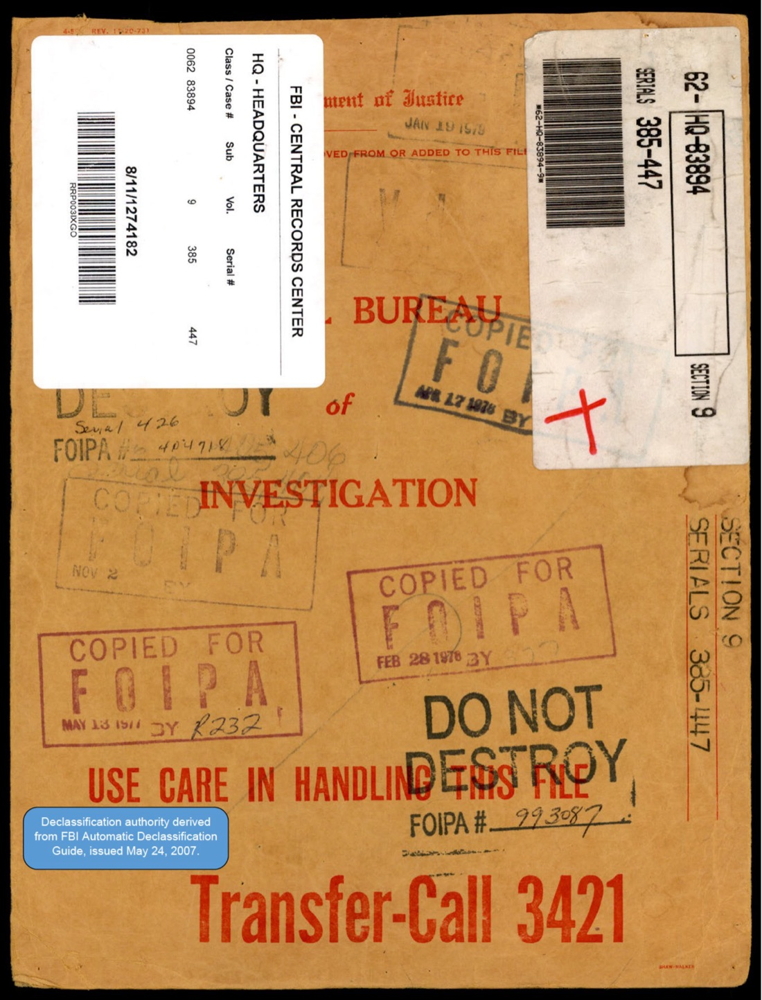 | [📝](reports/008-65_hs1-834228961_62-hq-83894_section_9/report.md) |
| **#009 Serial 130** | 1947-09-12 Air Defense Command 給 Hoover 的飛碟潮總結 + Powell Pan Am + 18 件比較表 + 退出令前 19 天 briefing |  | [📝](reports/009-65_hs1-834228961_62-hq-83894_serial_130/report.md) |
| **#010 Serial 153** | Oak Ridge 1947-07 W. R. Presley「最後一格底片」拍到的飛碟 + Internal Security X 分級 |  | [📝](reports/010-65_hs1-834228961_62-hq-83894_serial_153/report.md) |
| **#011 Serial 164** | 未處理 | — | [官方](https://www.war.gov/UFO/#65_HS1-834228961_62-HQ-83894_Serial_164) |
| **#012 Serial 220** | 未處理 | — | [官方](https://www.war.gov/UFO/#65_HS1-834228961_62-HQ-83894_Serial_220) |
| **#013 Serial 403** | 未處理 | — | [官方](https://www.war.gov/UFO/#65_HS1-834228961_62-HQ-83894_Serial_403) |
| **#014 Serial 438** | 未處理 | — | [官方](https://www.war.gov/UFO/#65_HS1-834228961_62-HQ-83894_Serial_438) |
| **#015 Serial 449** | 未處理 | — | [官方](https://www.war.gov/UFO/#65_HS1-834228961_62-HQ-83894_Serial_449) |
| **#016 SUB A** | 未處理 | — | [官方](https://www.war.gov/UFO/#65_HS1-834228961_62-HQ-83894_SUB_A) |
| **#033 Section 1** | 未處理 | — | [官方](https://www.war.gov/UFO/#65_HS1-834228961_62-HQ-83894_Section_1) |
| **#034 Section 8** | 未處理 | — | [官方](https://www.war.gov/UFO/#65_HS1-834228961_62-HQ-83894_Section_8) |

---

## 2. 二戰到冷戰初期（1944–1955）

| 標題 | 描述 | 照片 | 報告 |
|---|---|---|---|
| **#017 General 1946-7 Vol 2** 1947-12-30 | AMC 1947-08 → 12 飛碟公文鏈：Garrett Memo 7 條特徵 + LeMay 回函 + Twining「phenomenon is real」+ Project Sign 成立令 |  | [📝](reports/017-18_100754_general_1946-7_vol_2/report.md) |
| **#022 SHAEF foofighters** 1944-1945 · Germany | 415th NFS 13 則 sortie 摘要 + 1945-02 SHAEF「不僅只是想像」立場 + RAF「Me 262 + flak rocket」結案 |  | [📝](reports/022-331_120752_numeric_files_1944-1945_37153_german_armament_equipment_documents/report.md) |
| **#023 USAFE → Cabell** 1948-11 · Netherlands | 1948-09 北海荷蘭外海三組空勤目擊 + Neubiberg 飛碟懸停 30 分鐘 + 瑞典「飛碟可能來自地球以外」+ 湖底未記錄火山口 |  | [📝](reports/023-341_110448_records_relating_to_intelligence_1948-1955_netherlands/report.md) |
| **#024 Russell 蘇聯目擊** 1955-10 · Azerbaijan | 參議員 Russell + Hathaway + Efron 在蘇聯境內火車上目擊 2 個飛碟垂直升空，外殼旋轉內部燈靜止 | 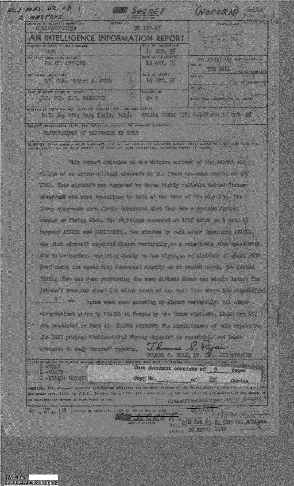 | [📝](reports/024-341_110677_numerical_file_5-2500_azerbaijan/report.md) |
| **#025 FSR 200-4 彙編** 1948-1949 | 143 頁案件彙編：Fairfield-Suisun + Chanute Houtag + Mr. Clark 編隊迴轉 + Seattle 三空管同步 + Goose Bay 撤回案 |  | [📝](reports/025-342_hs1-416511228_319.1_flying_discs_1949/report.md) |
| **#032 Krasuski 證述** 1957-11 · Germany 1944 | Levelland 案觸發底特律波蘭裔工人寫信給艾森豪助理。1944 Gut Alt Golssen 圓盤垂直升空、上下深灰靜止段 + 中段旋轉模糊環、引擎兩度熄火 | 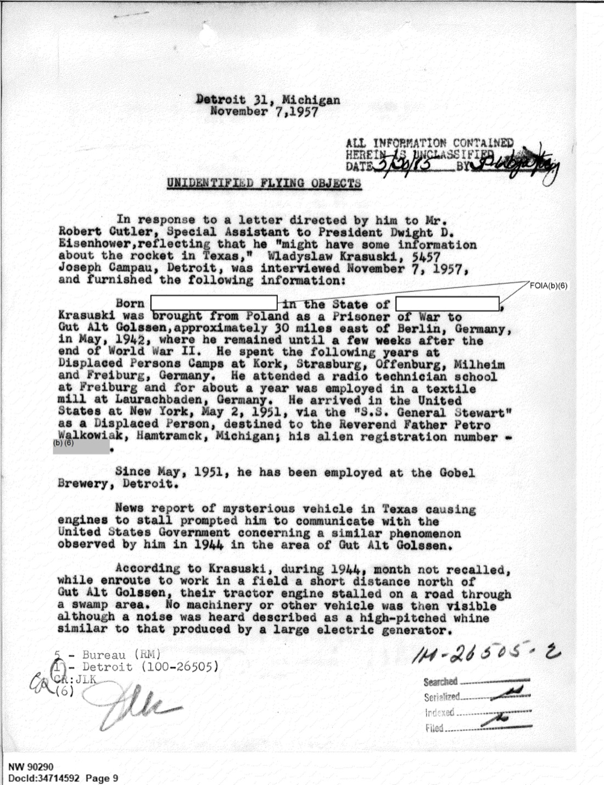 | [📝](reports/032-65_hs1-101634279_100-de-26505_germany_1944/report.md) |

---

## 3. 事件摘要單冊（Incident Summaries）

每件含「Check-List - Unidentified Flying Objects」表單，附證人名單／證詞與敘事報告。

| 標題 | 描述 | 照片 | 報告 |
|---|---|---|---|
| **#028 Box 7, 1-100** | Project Sign 案件 1-100：Arnold #17 + Mantell #30 + Lake Mead #53 |  | [📝](reports/028-38_143685_box7_incident_summaries_1-100/report.md) |
| **#026 Box 7, 101-172** | Project Sign 案件 101-172：Chiles-Whitted #144 + Hecla #140 + Estimate of Situation 草稿期 |  | [📝](reports/026-38_143685_box7_incident_summaries_101-172/report.md) |
| **#027 Box, 173-233** | Project Sign / Grudge 案件 173-233：NM Green Fireballs + La Paz #227 + Project Twinkle 前夜 | 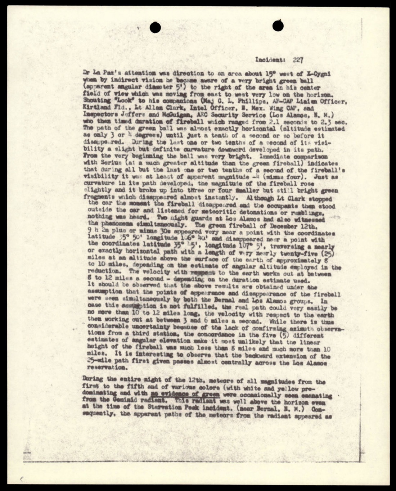 | [📝](reports/027-38_143685_box_incident_summaries_173-233/report.md) |

---

## 4. 1950s–60s 政府反應與目擊

| 標題 | 描述 | 照片 | 報告 |
|---|---|---|---|
| **#018 General 1948 Vol 1** 1948-06-15 | 1948 陸軍部備忘錄、通信、表單彙整：Project Sign 通信集、飛碟通報程序、目擊調查流程 | 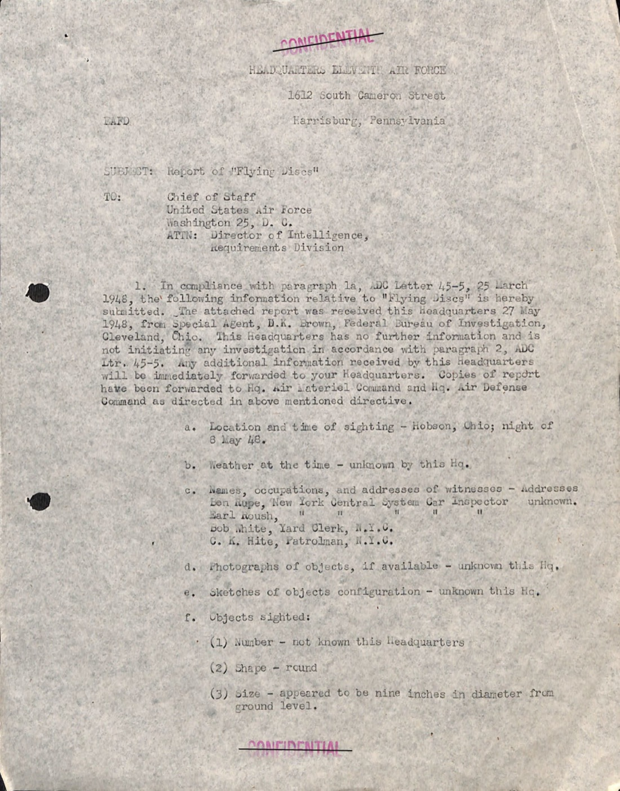 | [📝](reports/018-18_6369445_general_1948_vol_1/report.md) |
| **#029 White House Space Council** 1963-07-18 | 總統行政辦公室國家航太空間委員會「太空外星種族問題」備忘錄：發現後應對計畫、火星生命、外交政策 | 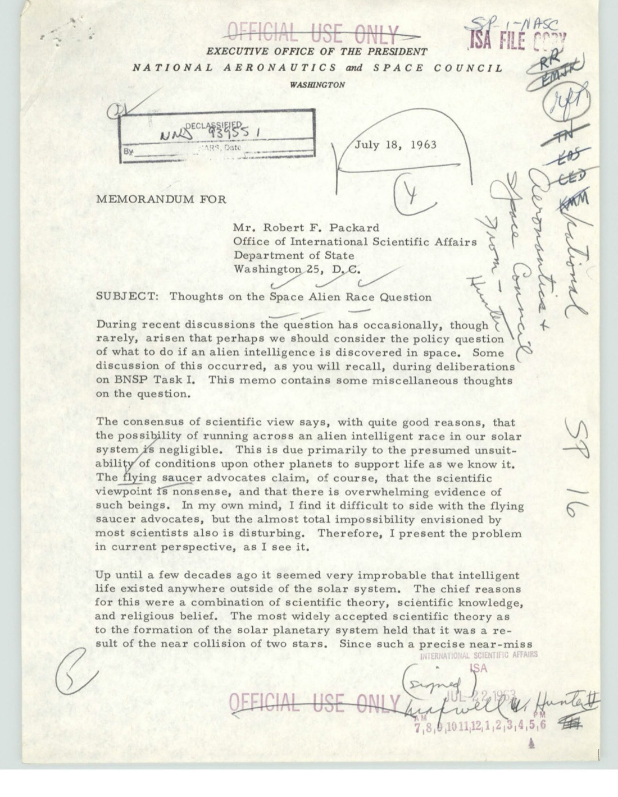 | [📝](reports/029-59_214434_sp_16_1963_alien_race/report.md) |
| **#030 State Dept Samford** 1952-07-18 | 1952 兩頁備忘錄，回應 UFO 通報暴增。技術改良、UFO 歷史紀錄、空軍對 UFO 觀點 | 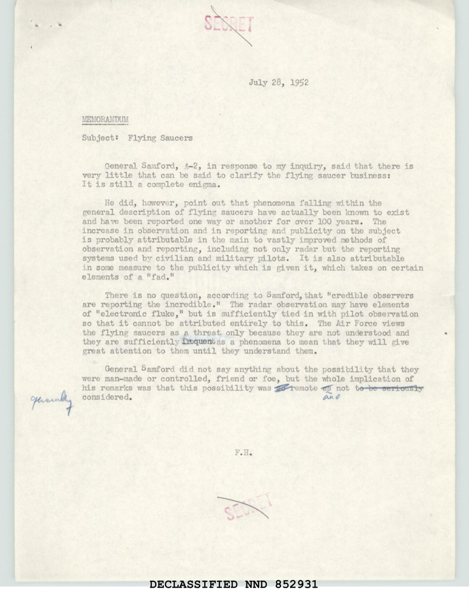 | [📝](reports/030-59_64634_711.5612_1952_state_samford/report.md) |
| **#031 FBI Detroit Weaver** 1958-04-17 · Detroit | 1958 FBI 備忘錄，底特律男子目擊「圓形物體 + 水晶圓頂」。建議轉交「適當的空軍當局」 |  | [📝](reports/031-65_hs1-101634279_100-de-18221_serial_844_detroit_1958/report.md) |

---

## 5. NASA 太空任務（1965–1974）

| 標題 | 描述 | 照片 | 報告 |
|---|---|---|---|
| **#019 COMETA + Rosin** 1999 | 法國 COMETA 1999 UFO 獨立報告（國家防衛高等研究院主持）+ Carol Rosin 信件（自稱 von Braun 晚年發言人） |  | [📝](reports/019-255_413270_cometa_report_rosin/report.md) |
| **#020 Gemini 7 Transcript** 1965-12-05 · LEO | Borman 報告觀測「bogey」與大量碎片場（數百顆小粒子距 4 哩）；Lovell 描述「黑色背景中閃亮物體 + 數兆顆粒子」 |  | [📝](reports/nasa-gemini-7/report.md) |
| **#021 Gemini 7 Audio** 1965-12-05 · LEO | 同 Gemini 7 觀測事件的空地通訊音檔片段，含 NASA 公共事務廣播評論 | — | [官方](https://www.war.gov/UFO/#NASA-UAP-D3A,%20Gemini%207%20Audio%20Excerpt,%201965) |
| **#139+#145-149 Apollo 12** 1969-11 · Moon | LMP Bean 透過 AOT 觀測「在太空中航行」的粒子與閃光，描述「逃離月球」；五張月面照框出 14 個藍色光點 |  | [📝](reports/nasa-apollo-12/report.md) |
| **#140+#142+#143+#150 Apollo 17** 1972-12 · Moon | CMP Evans 觀測明亮粒子漂移；Cernan 兩眼間如火車前燈閃光；Schmitt 親眼看到月面閃光；月面三點三角形 | 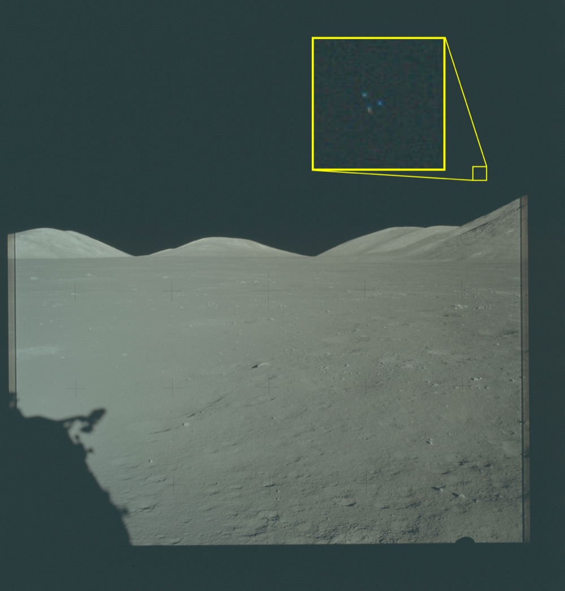 | [📝](reports/nasa-apollo-17/report.md) |
| **#141 Apollo 11** 1969-07 · Moon | Aldrin 三起觀測：接近月球觀測 S-IVB；艙內就寢時觀測閃光（中子穿過艙體假設）；返航時 laser-like 光源 | 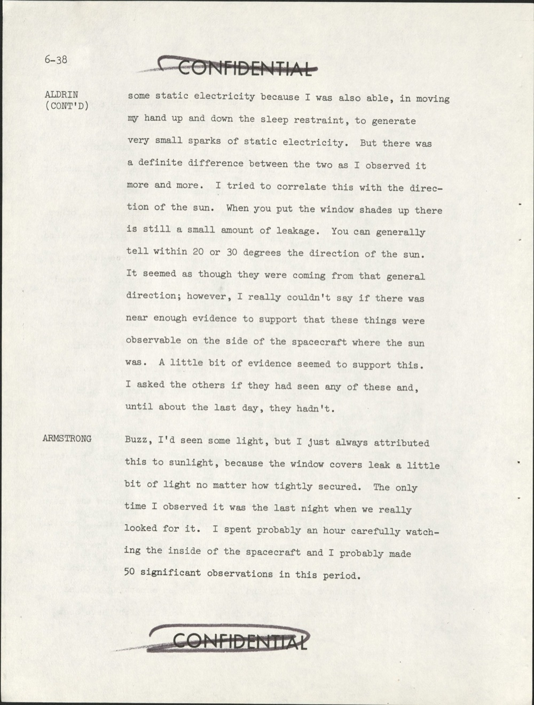 | [📝](reports/nasa-apollo-11/report.md) |
| **#144 Skylab** 1973-1974 · LEO | 三批次機組光閃觀測：Skylab 3 觀測「相似軌道衛星」+「紅色色調」物體；Skylab 4 觀測艙外閃光 | 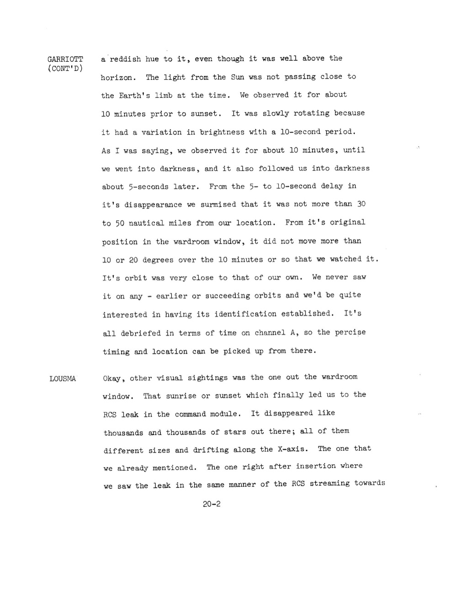 | [📝](reports/nasa-skylab/report.md) |

---

## 6. 冷戰晚期外交電報（1985–2004）

| 標題 | 描述 | 照片 | 報告 |
|---|---|---|---|
| **#151 Papua New Guinea** 1985-01-28 | 駐 Port Moresby 大使館回報「高空高速飛行器入侵」系列通報；Air Niugini 飛行員雷達紀錄南北向高速目標 | 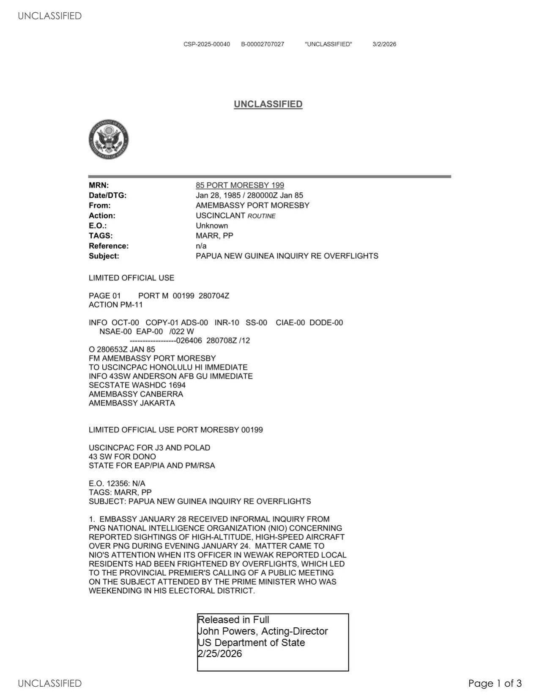 | [📝](reports/151-state_dept_uap_cable_1_papua_new_guinea_1985/report.md) |
| **#152 Kazakhstan** 1994-01-31 | 塔吉克飛行員 + 3 名美籍駕 747 於 41,000 ft 飛越哈薩克遭遇 UAP；目睹 90 度轉彎、螺旋、估算尾流 100,000 ft |  | [📝](reports/152-state_dept_uap_cable_2_kazakhstan_1994/report.md) |
| **#153 Tbilisi** 2001-10-30 · Georgia | 喬治亞外交部指控俄羅斯軍機侵犯領空並轟炸 Kodori 峽谷，俄方否認並稱可能是 UFO 所為 | 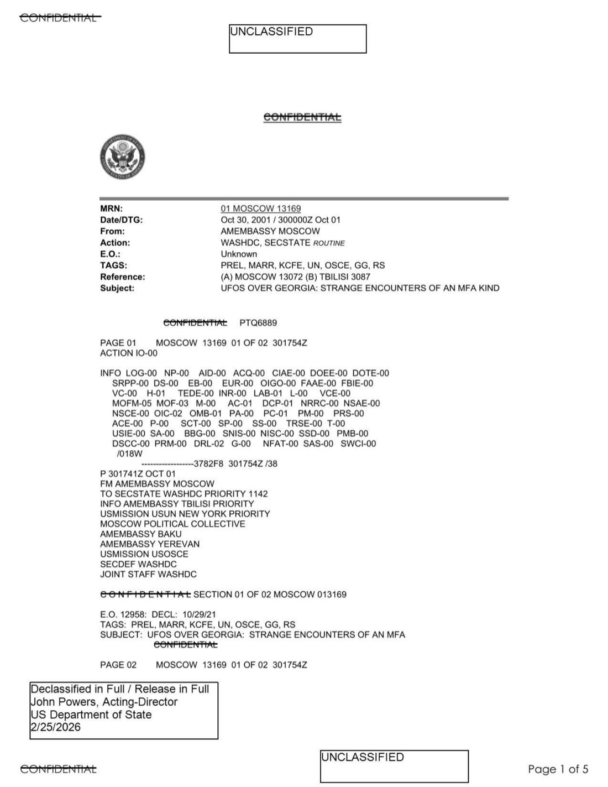 | [📝](reports/153-state_dept_uap_cable_3_tbilisi_2001/report.md) |
| **#154 Ashgabat** 2004-11-05 · Turkmenistan | 土庫曼 UFO 學會在公民社會建立過程中成為美方可信合作對象 | 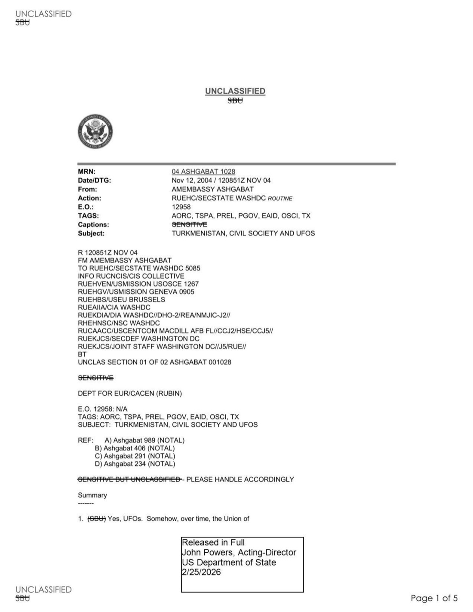 | [📝](reports/154-state_dept_uap_cable_4_ashgabat_2004/report.md) |
| **#155 Mexico** 2003-09-16 | 墨西哥國會「空中空間保護法」聽證 UAP 證詞；現場展示宣稱外星人遺體與墨西哥飛行員影片（遺體真偽爭議） | 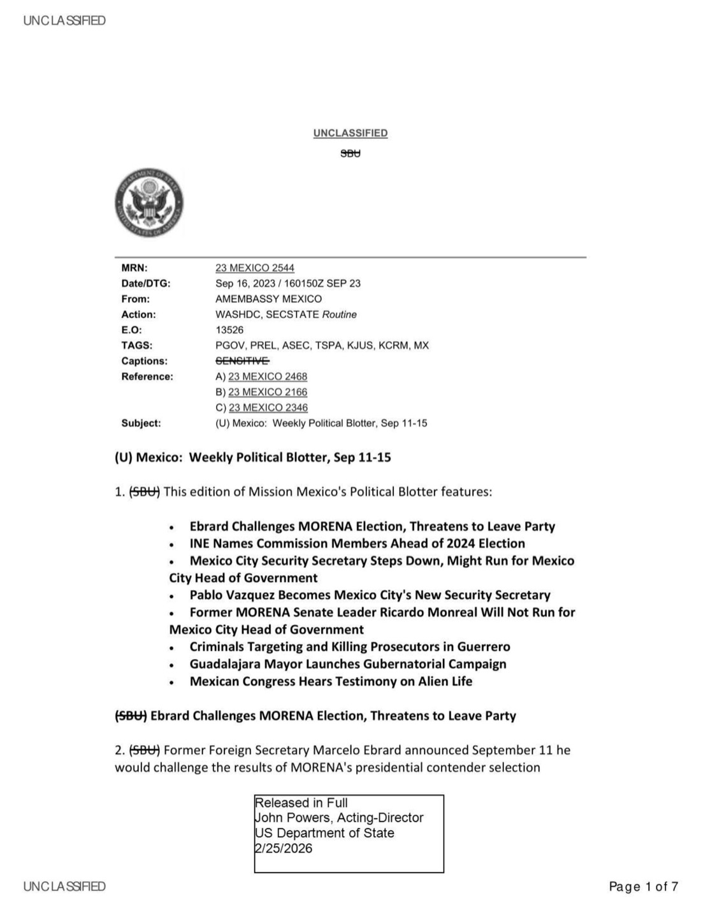 | [📝](reports/155-state_dept_uap_cable_5_mexico_2023/report.md) |

---

## 7. 現代軍方任務報告（MISREP / Range Fouler / 其他，2016–2025）

44 份全部完成。

| 標題 | 描述 | 照片 | 報告 |
|---|---|---|---|
| **#035 D10** 2022-05 · Iraq | 432 AEW MQ-9 21h OIR 任務，回報「5 個 UAP 飛越螢幕」（1 PROB MISSILE + 4 PROB BIRDS） |  | [📝](reports/035-dow_uap_d10_mission_report_iraq_may_2022/report.md) |
| **#036 D12** 2022-05-20 · Iraq | 196 ATKS（加州 ANG）MQ-9 OP PHANTOM FLEX，1 UAP 由北向東北飛行，DGS screener 無法 positive ID | 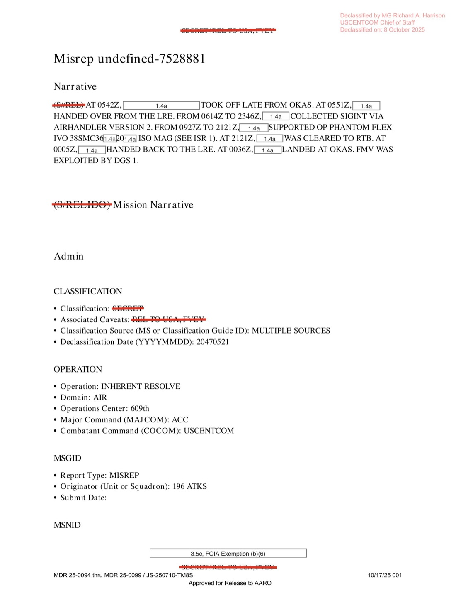 | [📝](reports/036-dow_uap_d12_mission_report_iraq_may_2022/report.md) |
| **#037 D14** 2022-05-29 · E Mediterranean | USAFE-AFAFRICA OP HUMMER SICKLE，Sigonella → LRCT 監視敘利亞海岸 + 俄 Su-30 5 nm 攔截 + 1 小型 UAP | 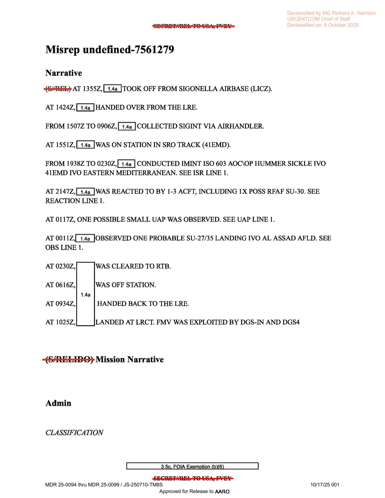 | [📝](reports/037-dow_uap_d14_mission_report_eastern_mediterranean_may_2022/report.md) |
| **#038 D16** 2022-07-31 · Syria | TF CHOSIN（海陸任務群）Deir ez-Zor 反 ISIS 車隊跟監期間，1 UAP 由北向南、不到 1 分鐘 | 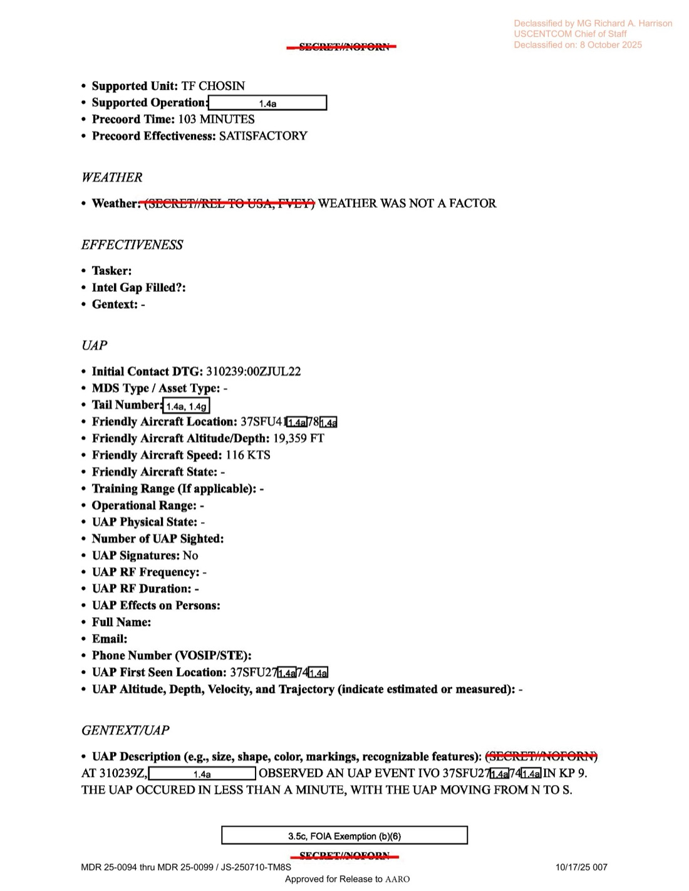 | [📝](reports/038-dow_uap_d16_mission_report_syria_july_2022/report.md) |
| **#039 D18** 2022-12-01 · Iraq | 482 ATKS（AFRC）巴格達 FL180 觀測「UAP/UAV」W→E（首次雙列描述，伊朗代理人無人機脈絡） | 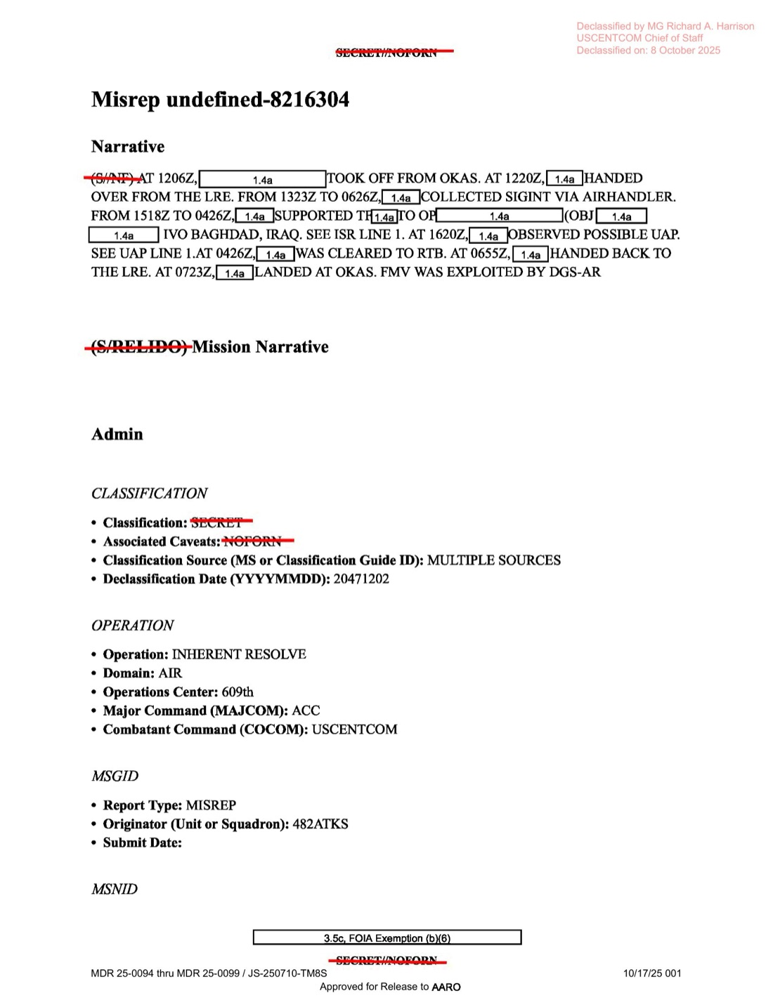 | [📝](reports/039-dow_uap_d18_mission_report_iraq_december_2022/report.md) |
| **#040 D19** 2023-02-21 · Syria | 389 EFS 二機 F-15E DCA 於 ESSA killbox，遭 MFT 雷達干擾 3 分鐘後觀測 3 POSS UAP @ FL240，WSV PRODUCED | 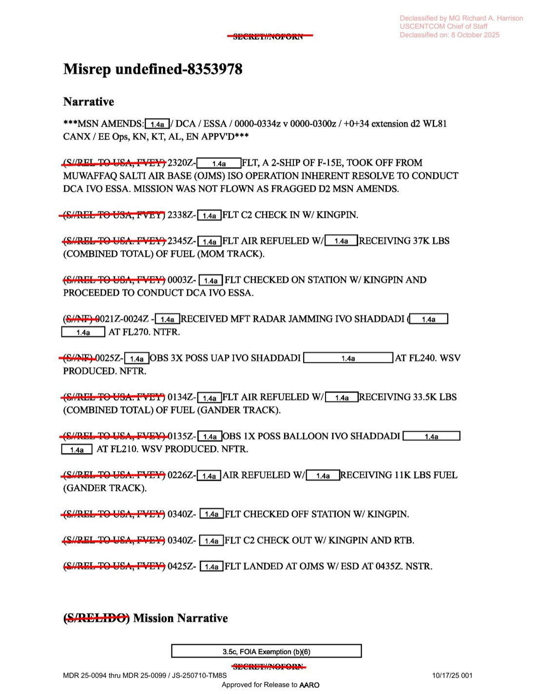 | [📝](reports/040-dow_uap_d19_mission_report_syria_february_2023/report.md) |
| **#041 D20** 2023-03-31 · Syria ESSA | 77 EFS 二機 F-16CM 從 OEPS，FL265 觀測 10-20 個亮物在 FL600+ 快速 W→E；飛行員主動比對 vs 恆星 signature | 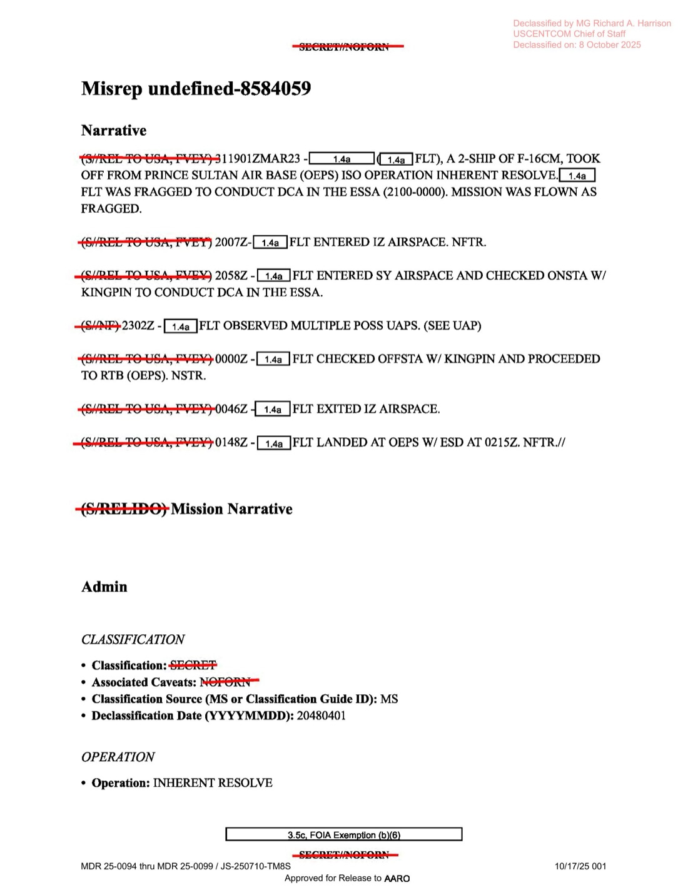 | [📝](reports/041-dow_uap_d20_mission_report_syria_essa_march_2023/report.md) |
| **#042+#043 D23** 2023-10-24 · Arabian Gulf | 50 ATKS MQ-9 收伊朗喊話後 56 分鐘觀測 2 UAP（FL243, 320/440 mph, thermal COLD, Benign） |  | [📝](reports/042_043-dow_uap_d23_mission_report_uae_october_2023/report.md) |
| **#044 D25** 2024-01-25 · Mediterranean | AFSOC 33 SOS MQ-9 transit，FL200 觀測「圓鈍菱形 + 底部 probe」434 KTS，**僅 SWIR 可見**，2 分鐘 | 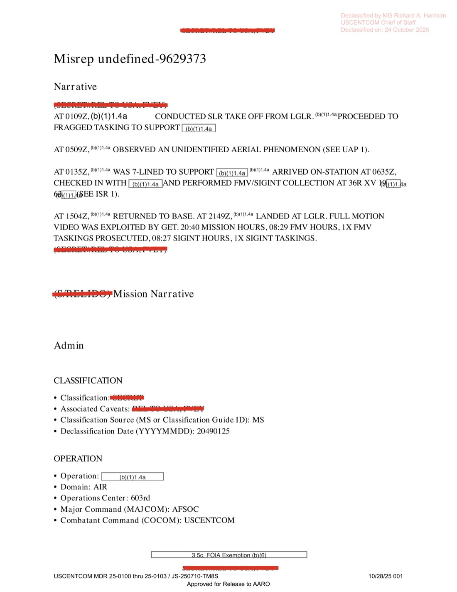 | [📝](reports/044-dow_uap_d25_mission_report_greece_january_2024/report.md) |
| **#045 D27** 2024-06-07 · Gulf of Oman | AFSOC 3 SOS MQ-9 OP ENDURING SENTINEL，RTB transit 中觀測「圓柱條附底部」140 KTS 貼水面 UAP | 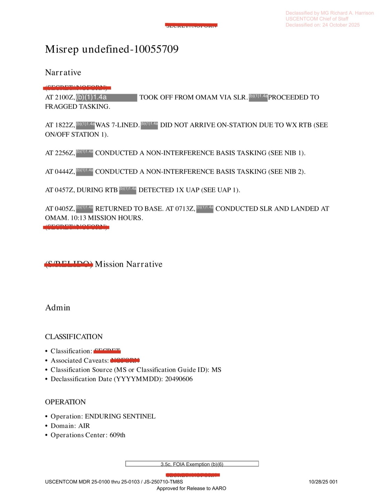 | [📝](reports/045-dow_uap_d27_mission_report_gulf_of_oman_june_2024/report.md) |
| **#046 D28** 2024-09-20 · Iraq Ayn al Asad | AC-130J Ghostrider 發射 AGM-176 Griffin 後、彈著前，高速 UAP 穿越 MX-20 + MX-25 雙感測器 IR 炫光，可能伴次物體分離 | 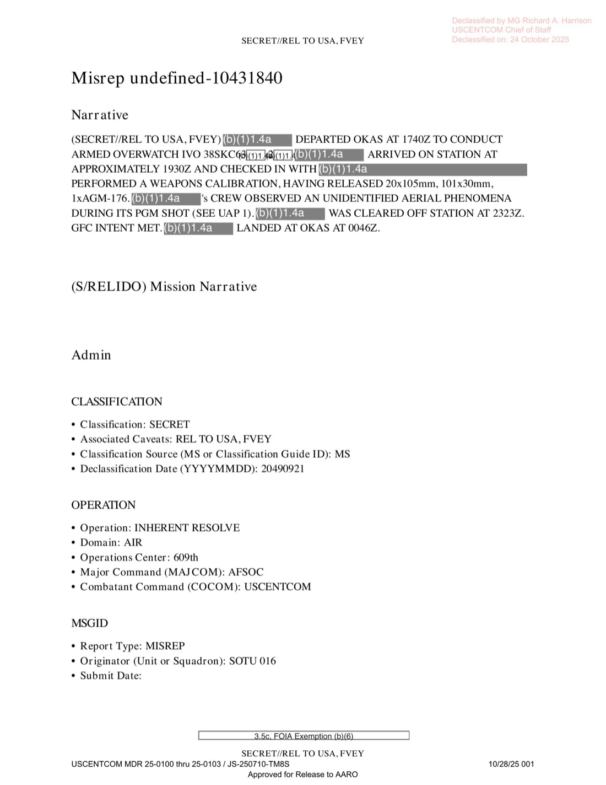 | [📝](reports/046-dow_uap_d28_mission_report_ayn_al_asad_iraq_september_2024/report.md) |
| **#047 D3** 2020 · Arabian Gulf | AFCENT MQ-9，17:36:22-49 共 27 秒內觀測 4 UAP（含 2 個 side-by-side 編隊），雲層阻擋追蹤 | 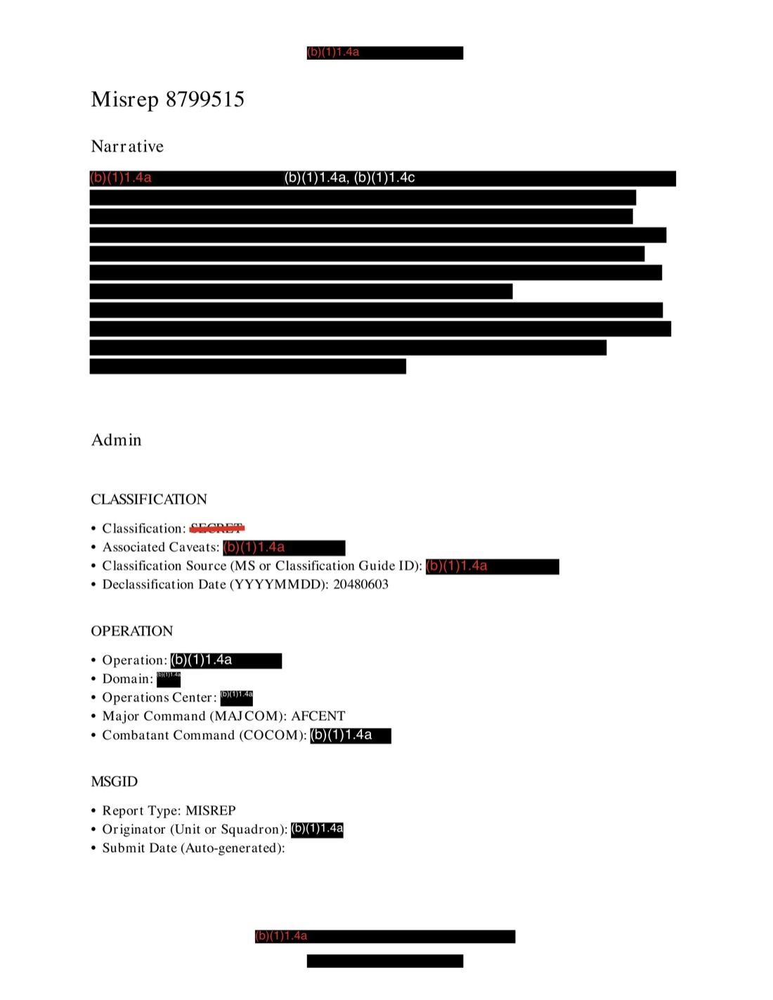 | [📝](reports/047-dow_uap_d3_mission_report_arabian_gulf_2020/report.md) |
| **#048-#050 D32** 2024-10-20 · Syria | AFSOC 12 SOS MQ-9 OP INHERENT RESOLVE，45 分鐘內 5 次「misshapen ball of white light」+ halo，Physical State: **Plasma**，排除 lasing | 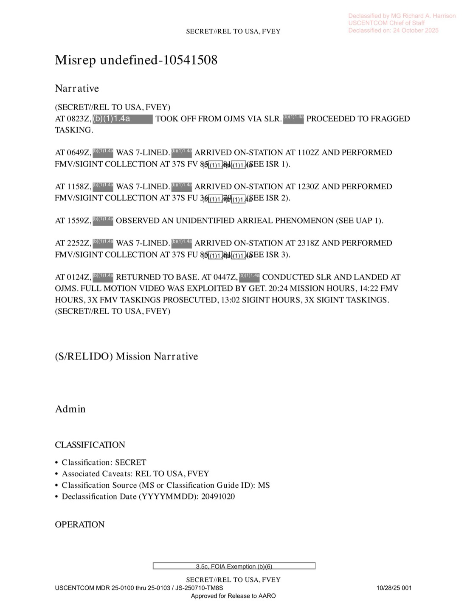 | [📝](reports/048_049_050-dow_uap_d32_mission_report_syria_october_2024/report.md) |
| **#051 D33** 2023-10-27 · Aegean Sea | 33 SOS MQ-9 從 LGLR 轉場赴 OJMS，1 UAP 貼海面 + **多次 90 度直角轉彎** + 80 MPH，3 分鐘後消失 |  | [📝](reports/051-dow_uap_d33_mission_report_greece_october_2023/report.md) |
| **#052 D35** 2023-10-29 · Aegean Sea | 33 SOS MQ-9 同基地，UAP 貼海面、直線飛向陸地、30 MPH（形狀字句與 D33 完全一致），48h 內同單位連續對 | 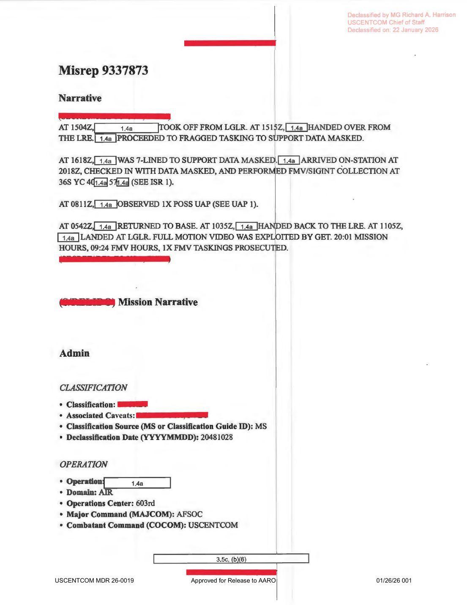 | [📝](reports/052-dow_uap_d35_mission_report_greece_october_2023/report.md) |
| **#053 D38** 2020-05-14 · Arabian Gulf | 海軍 SPEAR Range Fouler 首份，F/A-18 ATFLIR Black Hot 觀測 solid white **熱致冷** UAP 水面上 erratic | 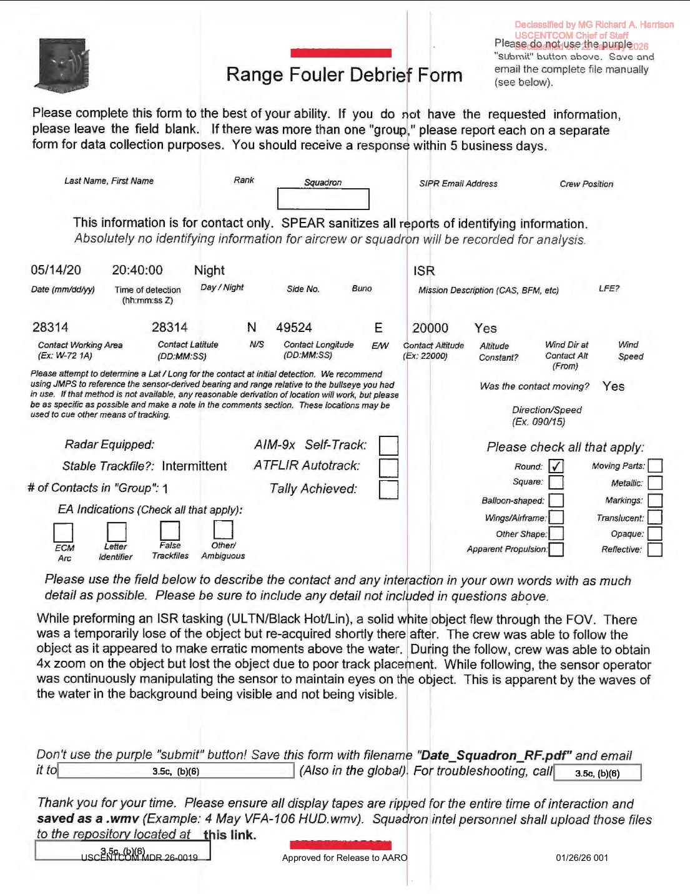 | [📝](reports/053-dow_uap_d38_range_fouler_debrief_middle_east_may_2020/report.md) |
| **#054 D4** 2020 · Arabian Gulf | D 系列遮蔽程度最高（5 頁中 4 頁全黑），PILOT 12:58Z 觀測 321 KTS UAP 加速東轉，SECRET // REL TO USA, FVEY | 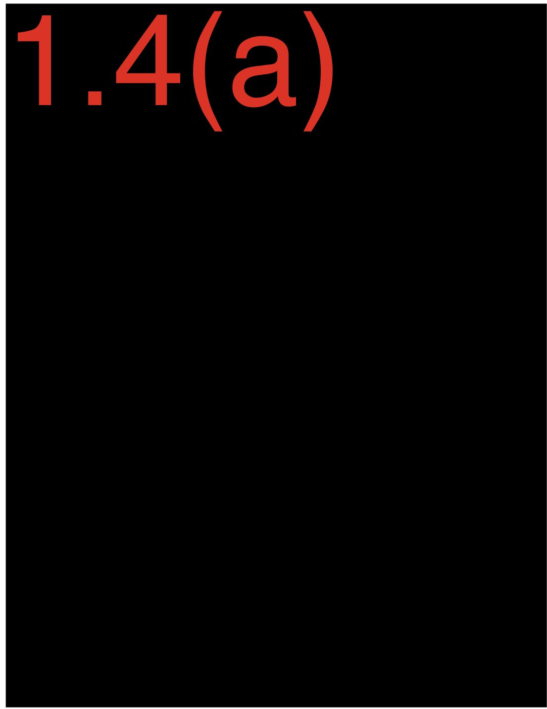 | [📝](reports/054-dow_uap_d4_mission_report_arabian_gulf_2020/report.md) |
| **#055 D42** 2020-08-31 · Persian Gulf（標題誤 Japan）| 482 ATKS dusk 觀測 1 UAP 被「同 size/shape 但 much higher speed」物體超越，peak 3 個同框互動 | 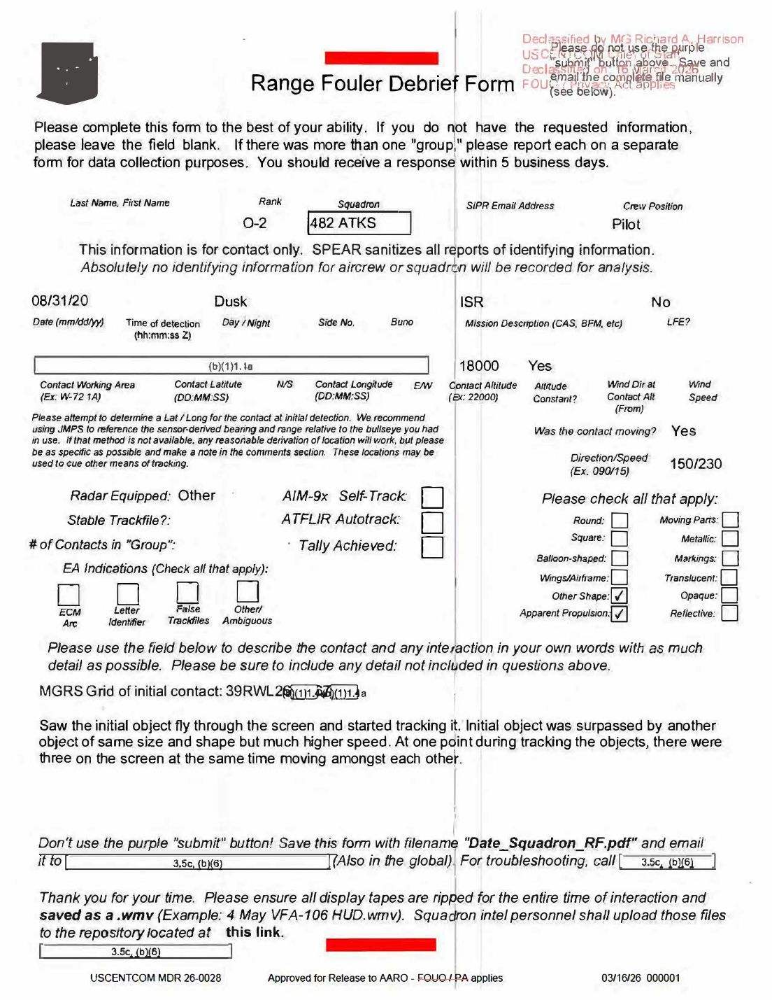 | [📝](reports/055-dow_uap_d42_range_fouler_debrief_japan_2023/report.md) |
| **#056 D44** 2020-10-15 · Gulf of Aden | 172 ATKS（Michigan ANG）MQ-9 觀測圓形 + 熱致冷 + 20 mph + abrupt directional changes，貼海面 171 ft | 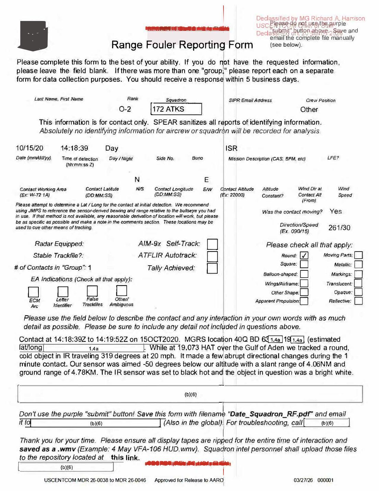 | [📝](reports/056-dow_uap_d44_range_fouler_gulf_of_aden_october_2020/report.md) |
| **#057 D48** 1996-09-10 | RTI/ACTA 為 USAF 45/30 SW Safety 撰寫的太空助推器失效風險建模技術報告（181 頁），**全文無 UAP** | 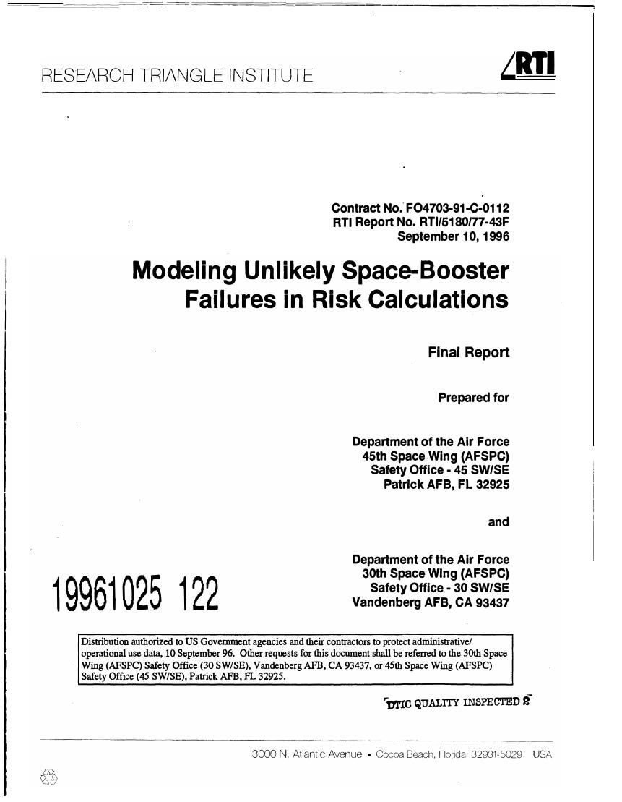 | [📝](reports/057-dow_uap_d48_air_force_space_booster_risk_report_1996/report.md) |
| **#058 D49** 2000-02-03 | 30 SW Office of History 編製的 Vandenberg AFB Launch Summary 1958-2000 官方登記冊（113 頁，1,418+ 次發射） | 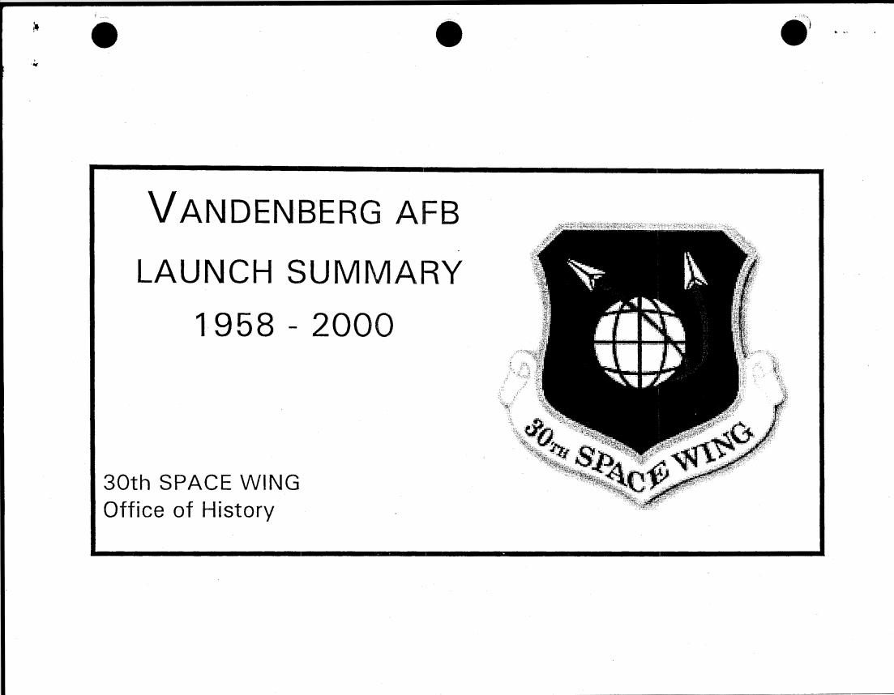 | [📝](reports/058-dow_uap_d49_vandenberg_launch_summary_1958_2000/report.md) |
| **#059 D5** 2020 · Mediterranean（標題誤 Arabian Gulf）| 5 頁全黑，13:54Z 40 KTS FL160 + 22:43Z 2 UAPs 278 KTS 加速南轉，跨 1,500 km 雙觀測，S//REL | 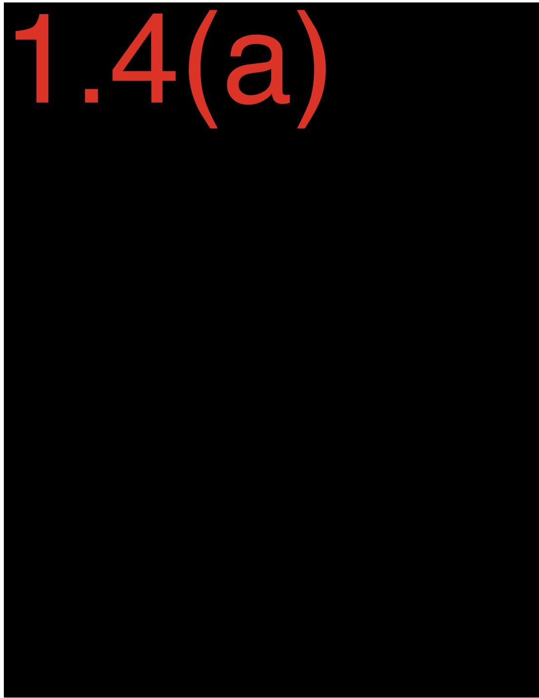 | [📝](reports/059-dow_uap_d5_mission_report_arabian_gulf_2020/report.md) |
| **#060 D50** 2025-04-10/11 · INDOPACOM | Email Correspondence，USD(I&S) ↔ 12 AF/DET 3 PAROC 確認兩筆 UAP tearline 釋出，揭示完整解密鏈條 |  | [📝](reports/060-dow_uap_d50_email_correspondence_indopacom_april_2025/report.md) |
| **#061 D51** 2023-03 · Pacific Time Zone | 民間人士手機拍藍色大型三角形 UAP，邊緣多點白藍光，國安設施上空 hover 3 min + backing up jerking 共 8 min |  | [📝](reports/061-dow_uap_d51_email_correspondence_pacific_time_zone_march_2023/report.md) |
| **#062 D52** 2024-10-31 · NA | 萬聖節當日 oval/orb UAP，US Aircraft 觀測，**單筆超過 2 小時**（D 系列最長），15 AF/DET 1 PAROC 路徑 |  | [📝](reports/062-dow_uap_d52_email_correspondence_na_august_2024/report.md) |
| **#063 D54** NA · E Aegean Sea | 6 頁主要全黑，13:19Z「TRIANGULAR + METALLIC」UAP @ FL250 168 KTS，座標 36°34'53"N 25°59'43"E |  | [📝](reports/063-dow_uap_d54_mission_report_mediterranean_sea_na/report.md) |
| **#064 D55** 2016-11-18 · Syria | P-8A 監視俄羅斯庫茲涅佐夫航艦戰鬥群期間，EO/IR 抓到 sea-skim ~500 KTS 東南向物體，2 分鐘後失聯 | 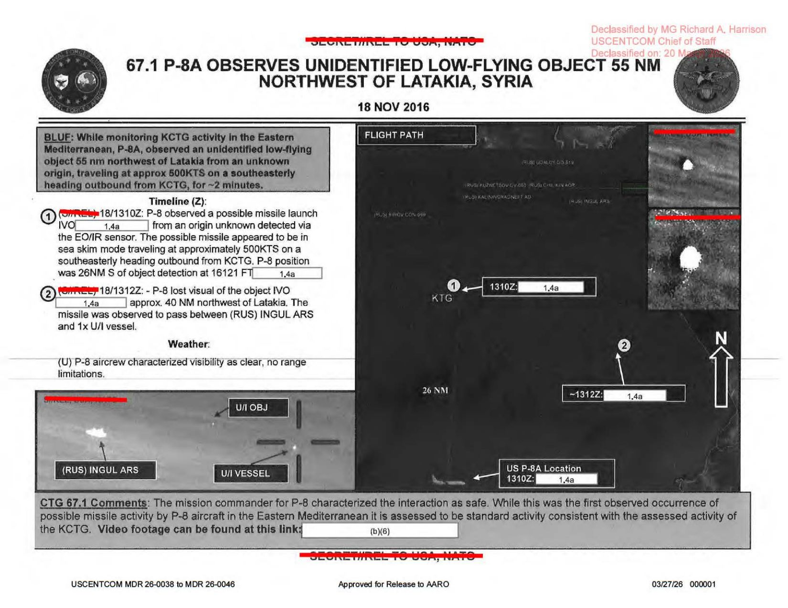 | [📝](reports/139-dow_uap_d55_mission_report_syria_2016/report.md) |
| **#065 D56** 2020-08-24 · Arabian Sea | HSM-73 MH-60R Seahawk 直升機 SSC，目視追蹤 1 個物體進雲層後**變成 3 個並排編隊**，Negative ES | 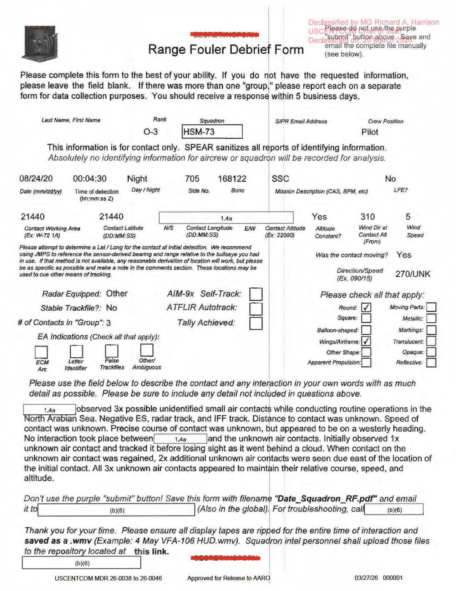 | [📝](reports/140-dow_uap_d56_range_fouler_arabian_sea_aug_2020/report.md) |
| **#066 D57** 2020-09-04 · Gulf of Aden | 172 ATKS MQ-9 23,819 ft，IR Black Hot 追蹤圓形冷物體 168°/277 mph，8 分鐘內幾次突然方向變化 |  | [📝](reports/141-dow_uap_d57_range_fouler_gulf_of_aden_sep_2020/report.md) |
| **#067 D58** 2020-10-27 · NA | 77 EFS F-15E + AWACS KINGPIN 攔截 2 個目標，**無法靠近 16.9 NM**，遭 Noise Jamming（2 chevrons），1/30 秒內消失 | 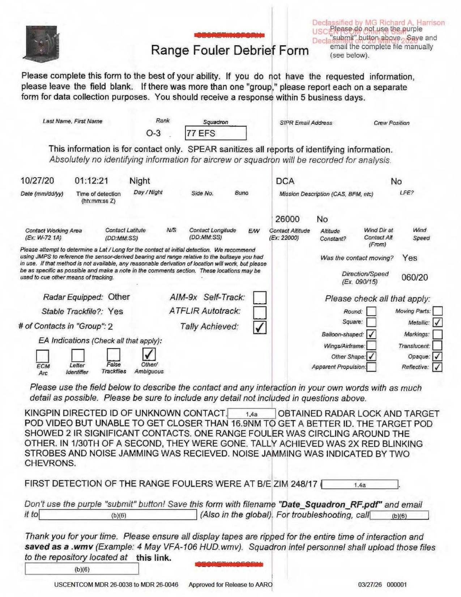 | [📝](reports/142-dow_uap_d58_range_fouler_na_oct_2020/report.md) |
| **#068 D6** 2020 · Arabian Gulf | **遮蔽程度最極端**：7 頁中前 6 頁全黑，僅末頁 22 字英文 description。觀測者執行有明確原訂任務 |  | [📝](reports/143-dow_uap_d6_mission_report_arabian_gulf_2020/report.md) |
| **#069 D60** 2020-08-08 · Arabian Gulf | 482 ATKS MQ-9 21h 8m 任務，07:26Z 透過 ANDAS4 觀測 1 UAP「TRANSITTING」，12:50Z 伊朗喊話 standard |  | [📝](reports/144-dow_uap_d60_mission_report_persian_gulf_aug_2020/report.md) |
| **#070 D61** 2020-08-27 · Arabian Gulf | D60 同單位 19 天後，2 分鐘內 FORMATION OF UNK FLYING OBJECTS 沿海岸 NE→NW，輕度雲層擋住 PID | 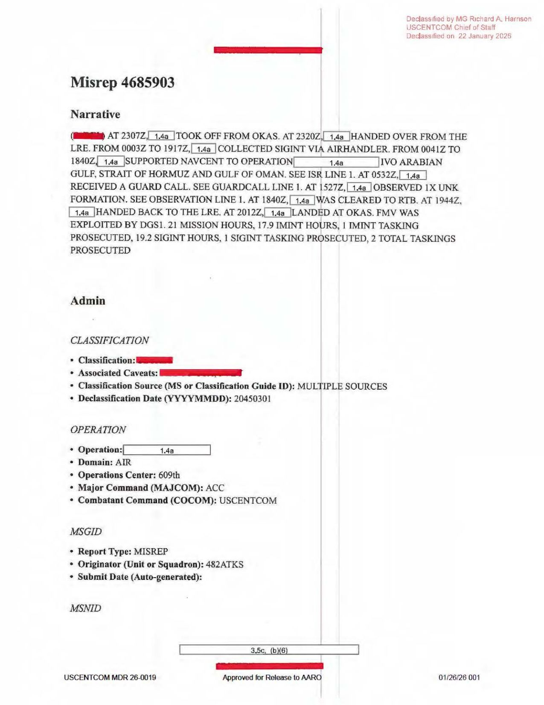 | [📝](reports/145-dow_uap_d61_mission_report_persian_gulf_aug_2020/report.md) |
| **#071 D62** 2020-09-16 · Strait of Hormuz | 同任務 21h 內：3 次伊朗喊話 + 2 次原因 UNKNOWN EMI 失聯（38 分鐘，1.4g 遮蔽）+ 17:32Z UAP |  | [📝](reports/146-dow_uap_d62_mission_report_strait_of_hormuz_sep_2020/report.md) |
| **#072 D63** 2020-10-01/02 · Strait of Hormuz | 482 ATKS MQ-9 21h 4m，伊朗喊話 5 次（Pro × 3 + Dir × 2），Abu Musa Airfield ATR 72-500 + Naser/Bushehr，18:29Z UAP（HEAVY HAZE） |  | [📝](reports/147-dow_uap_d63_mission_report_strait_of_hormuz_oct_2020/report.md) |
| **#073 D64** 2020-11-02 · Iran | 482 ATKS MQ-9 + OPEN WATER SCANS ISO UUV 3h（no UUV），UUV 段最後 25 分內 5 分鐘間隔 2 UAP（方向差 130°） | 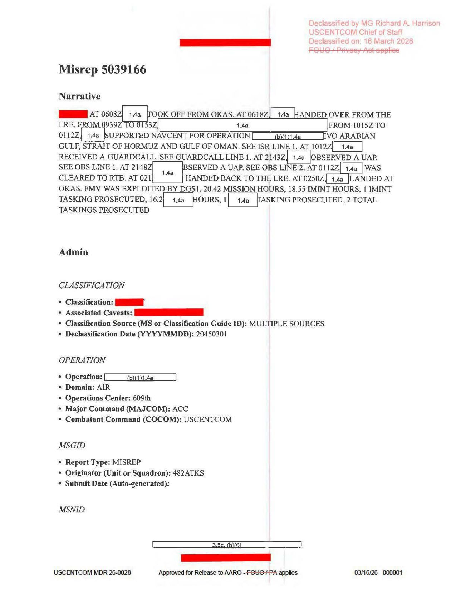 | [📝](reports/148-dow_uap_d64_mission_report_iran_nov_2020/report.md) |
| **#074 D65** 2020-07-16/17 · Arabian Gulf | 482 ATKS MQ-9 21h 17m，**3 個 UAP**（含 39RUN6234236874 = 1m 精度）+ IRGCN 三型齊備（Naser/Safir Kish/Houdong）| 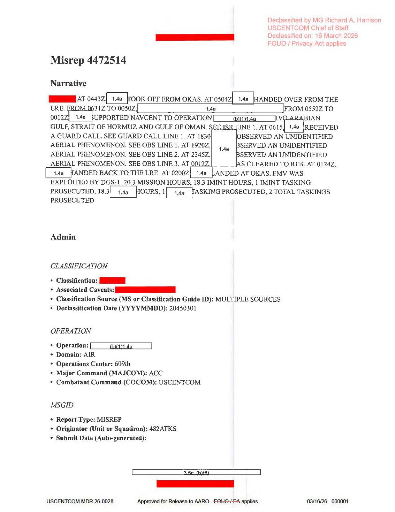 | [📝](reports/149-dow_uap_d65_mission_report_arabian_gulf_jul_2020/report.md) |
| **#075 D7** 2020 · Arabian Gulf | 6 頁前 5 頁全黑，末頁 GENTEXT 含 **WEAPONS QUALITY 1 TRACK + NEXT TO SHOOT** + TFLIR ID balloon @ 31,000 ft，48FW 跨指 |  | [📝](reports/150-dow_uap_d7_mission_report_arabian_gulf_2020/report.md) |
| **#076 D74** 2023-11-09 · Syria | OP INHERENT RESOLVE 反 VEO 11h28m，RTB 21:53Z 觀測 BOUNCY BALL UAP 從南方 co-alt 下降通過、~424 KN 持續 7 分鐘 |  | [📝](reports/151-dow_uap_d74_mission_report_syria_nov_2023/report.md) |
| **#077 D75** 2024-07-14 · Gulf of Aden | 05:17Z UAP 觀測，飛機嘗試追蹤但 **UAP'S SPEED WAS FASTER THAN [己方]**，followed till too far to follow | 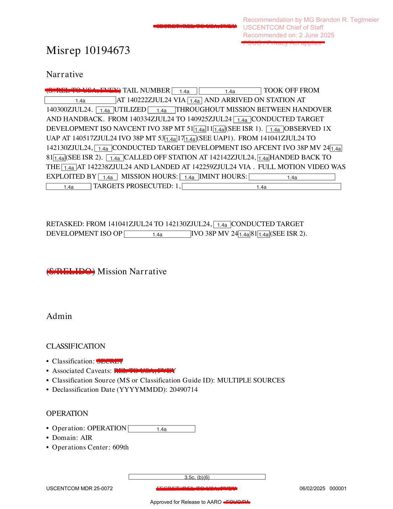 | [📝](reports/152-dow_uap_d75_mission_report_gulf_of_aden_jul_2024/report.md) |
| **#078 D8** 2025 · Mediterranean（標題誤 Djibouti）| 7 頁前 6 頁全黑，末頁 16:53Z 觀測 **2X ROUND WHITE HOT UAPS** 240NM/HOUR @ MGRS 35SQT（1m 精度），SECRET//REL TO USA, FIN, SWE, FVEY, NATO | 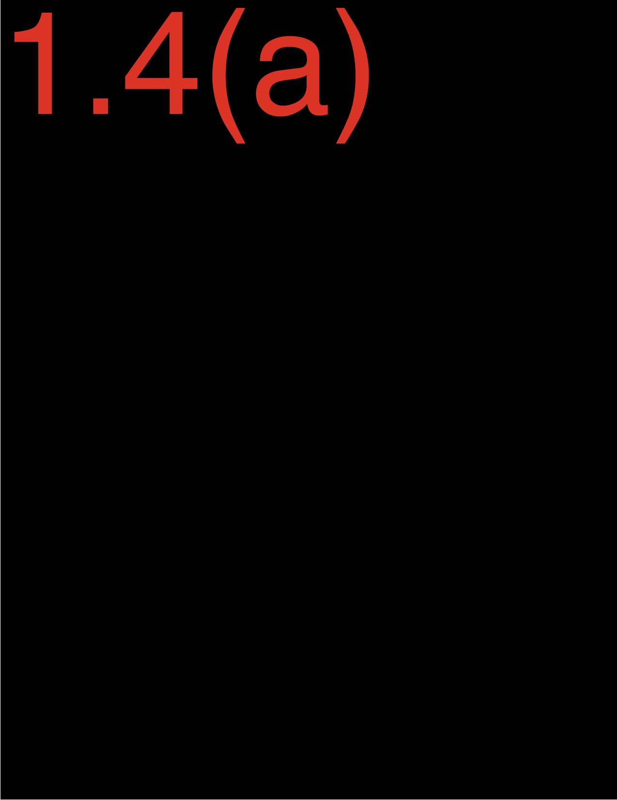 | [📝](reports/153-dow_uap_d8_mission_report_djibouti_2025/report.md) |

---

## 8. 現代軍方未解 UAP 報告（PR — 影片／影像，2013–2026）

28 份。AARO 未解 UAP 報告，多數為紅外感測器影片片段，常對應同編號 D 系列 MISREP。尚未撰寫中文報告。

| 標題 | 描述 | 照片 | 報告 |
|---|---|---|---|
| **#079 PR19** Middle East 2022-05 | 5 秒 IR 影片，畫面下三分之一左→右對比區（對應 D10）| 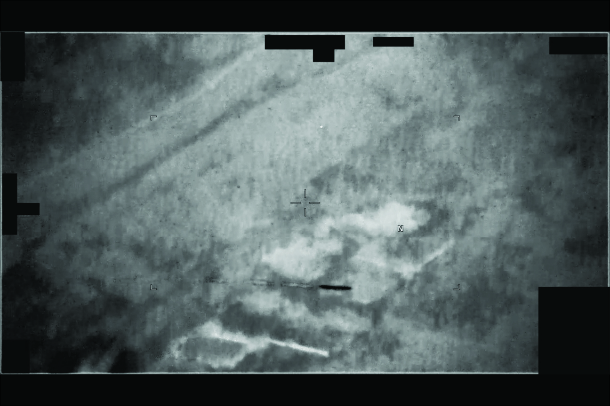 | [📝](reports/079-dow_uap_pr19_video_middle_east_may_2022/report.md) |
| **#080 PR20** Kuwait 2022-05 | N/A 單張靜止影像（紅圈標註），長條對比區左上→右下漸亮（對應 D12）| — | [📝](reports/080-dow_uap_pr20_image_kuwait_may_2022/report.md) |
| **#081 PR21** Iraq 2022-05 | 10 秒 IR 影片，畫面中央兩處對比區並肩移動，疑「可能 SU-27/35」（對應 D14）| — | [📝](reports/081-dow_uap_pr21_video_iraq_may_2022/report.md) |
| **#082 PR22** Syria 2022-07 | 14 秒 IR+EO 分割畫面，5 秒處右上四分之一物體右→左（對應 D16）| — | [📝](reports/082-dow_uap_pr22_video_syria_july_2022/report.md) |
| **#083 PR23** Iraq 2022-12 | 10 秒 IR 影片，對比區左下→右上，6 秒離開視野（對應 D18）| — | [官方](https://www.war.gov/UFO/#DOW-UAP-PR23,%20Unresolved%20UAP%20Report,%20Iraq,%20December%202022) |
| **#084 PR26** UAE 2023-10 | 43 秒 IR 影片，左上對比區停留，17/18 秒感測器橫掃，29 秒失鎖（對應 D23）| — | [官方](https://www.war.gov/UFO/#DOW-UAP-PR26,%20Unresolved%20UAP%20Report,%20United%20Arab%20Emirates,%20October%202023) |
| **#085 PR27** UAE 2023-10 | 4 分 57 秒 IR 影片，前 1m55s 無內容，後感測器追蹤對比區，3m27s 後失而復得（對應 D23）| — | [官方](https://www.war.gov/UFO/#DOW-UAP-PR27,%20Unresolved%20UAP%20Report,%20United%20Arab%20Emirates,%20October%202023) |
| **#086 PR28** Greece 2024-01 | 1 分 5 秒多模態（EO+SWIR）影片，SWIR 上「倒淚滴 + 垂直拖尾」切到可見光即消失（對應 D7）| — | [官方](https://www.war.gov/UFO/#DOW-UAP-PR28,%20Unresolved%20UAP%20Report,%20Greece,%20January%202024) |
| **#087 PR29** UAE 2024-06 | 21 秒 IR 影片，中央「倒淚滴 + 垂直拖尾」，操作員研判水面反射（對應 D8）| — | [官方](https://www.war.gov/UFO/#DOW-UAP-PR29,%20Unresolved%20UAP%20Report,%20United%20Arab%20Emirates,%20June%202024) |
| **#088 PR31** Syria 2024-10 | 5 秒 FMV，前 1 秒畫面上緣多色不規則區右→左掠過（對應 D32）| — | [官方](https://www.war.gov/UFO/#DOW-UAP-PR31,%20Unresolved%20UAP%20Report,%20Syria,%20October%202024) |
| **#089 PR32** Syria 2024-10 | 6 秒 FMV，2-4 秒頂緣中央白紅色不規則亮區，水平半橢圓（對應 D32）| — | [官方](https://www.war.gov/UFO/#DOW-UAP-PR32,%20Unresolved%20UAP%20Report,%20Syria,%20October%202024) |
| **#090 PR33** Syria 2024-10 | 5 秒 FMV，1-3 秒兩處半透明橙色不規則區疊背景，各持續不到 2 秒（對應 D32）| — | [官方](https://www.war.gov/UFO/#DOW-UAP-PR33,%20Unresolved%20UAP%20Report,%20Syria,%20October%202024) |
| **#091 PR34** Greece 2023-10 | 2 分 57 秒 IR 影片，1 分鐘起藍色十字鎖定，2m22s 失鎖後感測器循環變焦對比（對應 D33）| — | [官方](https://www.war.gov/UFO/#DOW-UAP-PR34,%20Unresolved%20UAP%20Report,%20Greece,%20October%202023) |
| **#092 PR35** Greece 2023-10 | 24 秒 IR 影片，感測器收窄追蹤海面對比區，海→陸過渡時消失於背景（對應 D35）| — | [官方](https://www.war.gov/UFO/#DOW-UAP-PR35,%20Unresolved%20UAP%20Report,%20Greece,%20October%202023) |
| **#093 PR36** Middle East 2020-05 | 2 分 17 秒 IR 影片，1m16s 收窄變焦放大，2m10s 短暫藍十字未鎖定（對應 D38）| — | [官方](https://www.war.gov/UFO/#DOW-UAP-PR36,%20Unresolved%20UAP%20Report,%20Middle%20East,%20May%202020) |
| **#094 PR37** Middle East 2020 | 9 秒 IR 影片，6-8 秒對比區左下進入近線性向上、左上離開。無敘述 | — | [官方](https://www.war.gov/UFO/#DOW-UAP-PR37,%20Unresolved%20UAP%20Report,%20Middle%20East,%202020) |
| **#095 PR38** Middle East 2013 | 1 分 46 秒 IR 影片，對比區形似「八角星，臂長交替」，10 秒放大，30 秒離開後復現 | — | [官方](https://www.war.gov/UFO/#DOW-UAP-PR38,%20Unresolved%20UAP%20Report,%20Middle%20East,%202013) |
| **#096 PR39** Middle East 2020 | 5 秒 IR 影片，微弱對比區右下進入、橫越底部、底邊離開 | — | [官方](https://www.war.gov/UFO/#DOW-UAP-PR39,%20Unresolved%20UAP%20Report,%20Middle%20East,%202020) |
| **#097 PR40** Middle East 2020 | 1 分 3 秒 IR 影片，10 秒白圈標註「U/I SMALL THERMAL SIGNATURE」| — | [官方](https://www.war.gov/UFO/#DOW-UAP-PR40,%20Unresolved%20UAP%20Report,%20Middle%20East,%202020) |
| **#098 PR41** Middle East 2020 | 1 分 34 秒 IR 影片，對比區左下進入後感測器左→右橫掃保持其於畫面中央 | — | [官方](https://www.war.gov/UFO/#DOW-UAP-PR41,%20Unresolved%20UAP%20Report,%20Middle%20East,%202020) |
| **#099 PR42** Middle East 2020 | 4 分 53 秒 IR 影片，對比區中段間歇消失與重現，感測器多次切換成像模態 | — | [官方](https://www.war.gov/UFO/#DOW-UAP-PR42,%20Unresolved%20UAP%20Report,%20Middle%20East,%202020) |
| **#100 PR43** Africa 2025 | 2 秒 IR 影片，微小對比區左→右橫越畫面，右下離開，循環播放 | — | [官方](https://www.war.gov/UFO/#DOW-UAP-PR43,%20Unresolved%20UAP%20Report,%20Africa,%202025) |
| **#101 PR44** Middle East 2020 | 5 分 11 秒 IR 影片，感測器追蹤約 3 分鐘含十字鎖定、變焦、收窄視野 | — | [官方](https://www.war.gov/UFO/#DOW-UAP-PR44,%20Unresolved%20UAP%20Report,%20Middle%20East,%202020) |
| **#102 PR45** Middle East 2020 | 58 秒 IR 影片，感測器鎖定對比區漸放大。AARO 註：「變大」可能源於平台距離縮短 | — | [官方](https://www.war.gov/UFO/#DOW-UAP-PR45,%20Unresolved%20UAP%20Report,%20Middle%20East,%202020) |
| **#103 PR46** INDOPACOM 2024 | 9 秒 IR 影片，聚焦「橄欖球狀主體 + 3 條徑向突出物」（1 條垂直、2 條向下 45 度）| — | [官方](https://www.war.gov/UFO/#DOW-UAP-PR46,%20Unresolved%20UAP%20Report,%20INDOPACOM,%202024) |
| **#104 PR47** INDOPACOM 2023 | 1 分 59 秒 IR 影片，感測器追蹤 3 處對比區，相對位置與方位固定 | — | [官方](https://www.war.gov/UFO/#DOW-UAP-PR47,%20Unresolved%20UAP%20Report,%20INDOPACOM,%202023) |
| **#105 PR48** INDOPACOM 2024 | 1 分 39 秒 IR 影片，感測器追蹤一處對比區於畫面中央 | — | [官方](https://www.war.gov/UFO/#DOW-UAP-PR48,%20Unresolved%20UAP%20Report,%20INDOPACOM,%202024) |
| **#106 PR49** Army 2026 | 1 分 49 秒 IR 影片，先後追蹤多處對比區，多次調整變焦與對比 | — | [官方](https://www.war.gov/UFO/#DOW-UAP-PR49,%20Unresolved%20UAP%20Report,%20Department%20of%20the%20Army,%202026) |

---

## 9. FBI 現代靜止影像（2025，A1–A8 + B1–B24）

32 份全部完成。A 系列為軍方 FLIR/IR 螢幕截圖（HUD metadata 12 條 1.4(a) 遮蔽，目標為中央十字準星中的圓塊）。B 系列為 1999-12-31 18:10-18:21 美國西部觀測序列（保留時間戳，可重建時間順序）。

### A 系列（Late 2025 軍方 IR 截圖）

| 標題 | 描述 | 照片 | 報告 |
|---|---|---|---|
| **#107 A1** | PNG 544×368，準星中央小黑點 = UAP 目標，右側「5」字。Nimitz Tic Tac / GIMBAL / GOFAST 同類格式 | 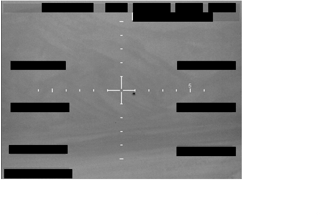 | [📝](reports/107-fbi_photo_a1/report.md) |
| **#108 A2** | sensor 下視，畫面底層乾燥半沙漠地表紋路，準星正下方目標明顯。HUD 遮蔽位置與 A1 完全一致 |  | [📝](reports/108-fbi_photo_a2/report.md) |
| **#109 A3** | 413×307，目標放入準星正中央 boresight 對齊，地面紋路起伏，目標在 IR 視野中比所有地表都暗 |  | [📝](reports/109-fbi_photo_a3/report.md) |
| **#110 A4** | 左半邊整片空白（疑 dual-pane 雙螢幕配置左視角被移除）。山地紋路明顯，目標位於準星右下方 |  | [📝](reports/110-fbi_photo_a4/report.md) |
| **#111 A5** | 準星垂直延伸線上小白圈（疑第二目標或 waypoint），左上額外大方塊遮蔽（疑 PIP 副螢幕被移除）| 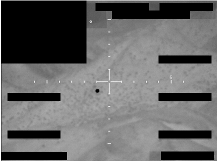 | [📝](reports/111-fbi_photo_a5/report.md) |
| **#112 A6** | 左上連續黑色覆蓋畫面 1/4 + 下方延伸黑條（遮蔽密度最大）。可見部分含準星 + 暗色圓塊目標 |  | [📝](reports/112-fbi_photo_a6/report.md) |
| **#113 A7** | 目標突然變為**亮白點**（IR Black Hot → White Hot 反演，或物體本身翻為 thermally cold 訊號）|  | [📝](reports/113-fbi_photo_a7/report.md) |
| **#114 A8** | 目標縮減到一兩個像素的暗色點，幾乎消失。序列自然結束（拉遠、轉開、或物體主動結束被觀測）|  | [📝](reports/114-fbi_photo_a8/report.md) |

### B 系列（1999-12-31 18:10-18:21 美國西部，含 milliradian 刻度準星）

依時間戳排序：

| 標題 | 描述 | 照片 | 報告 |
|---|---|---|---|
| **#135 B6** 18:10:00 | **整個事件最早一幀**，畫面頂端大型不規則暗色團塊（比後續小暗點大 5-10 倍）+ 下方銳利點 |  | [📝](reports/135-fbi_photo_b6/report.md) |
| **#136 B7** 18:10:02 | **2 秒最短間隔**，同團塊水平移動 5-7 mil 到準星右側。橫向速度 20-80 m/s |  | [📝](reports/136-fbi_photo_b7/report.md) |
| **#137 B8** 18:10:18 | 大型團塊完全消失，準星右側 +1 mil 變回小圓點。「可解析形態 → 點狀」轉折後第一張 |  | [📝](reports/137-fbi_photo_b8/report.md) |
| **#138 B9** 18:10:26 | 位置左右穿越（+5-7 → +1 → -5-6 → +5-7），24 秒內擺動或多目標輪流追蹤 |  | [📝](reports/138-fbi_photo_b9/report.md) |
| **#116 B10** 18:10:50 | 準星右側 +5~+10 mil 邊緣銳利小黑點，背景與 B1 完全相同 | 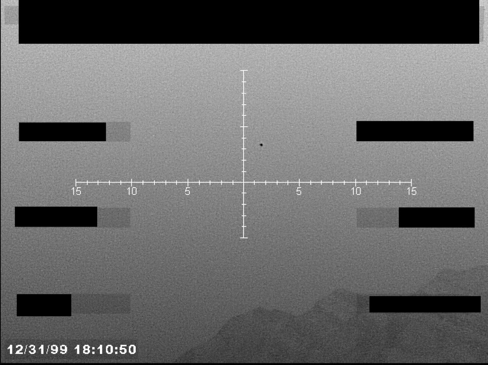 | [📝](reports/116-fbi_photo_b10/report.md) |
| **#117 B11** 18:11:06 | 目標漸往 +2~+3 mil 靠近準星中心（操作員主動追蹤對齊），sensor 平台 16 秒近靜止 |  | [📝](reports/117-fbi_photo_b11/report.md) |
| **#118 B12** 18:11:12 | 目標 +3~+4 mil 略外移，sensor 追蹤可能於 B11-B12 之間斷掉 |  | [📝](reports/118-fbi_photo_b12/report.md) |
| **#115 B1** 18:11:19 | B 系列日期沒被遮掉。畫面左下「12/31/99 18:11:19」，目標微弱不清，山脈剪影 | 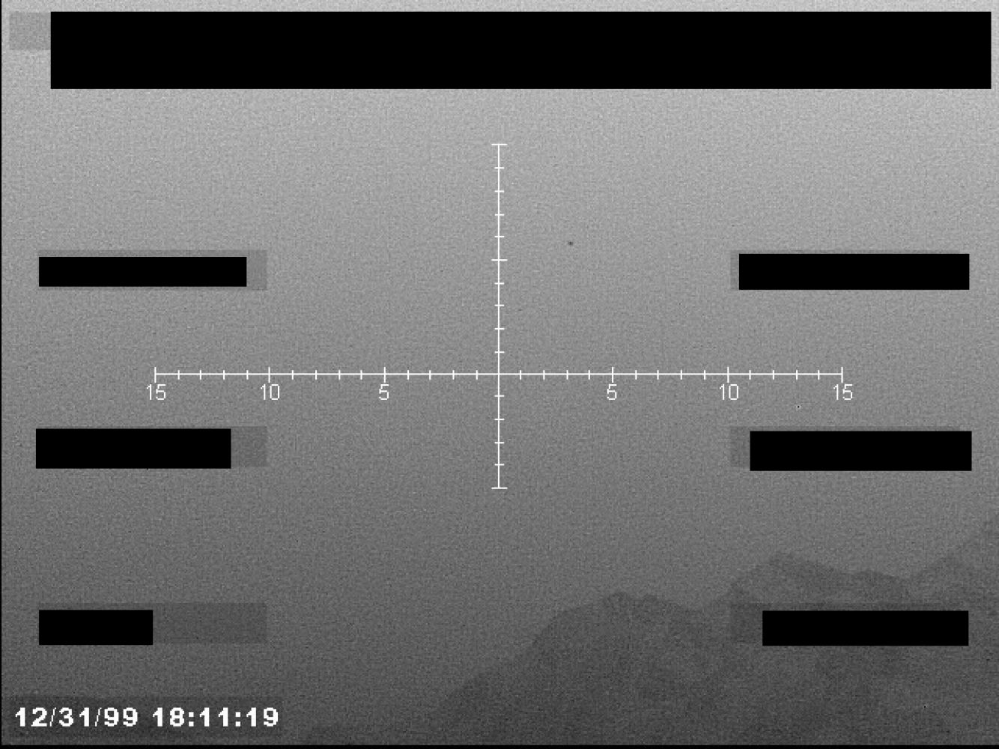 | [📝](reports/115-fbi_photo_b1/report.md) |
| **#126 B2** 18:11:27 | 距 B1 8 秒，第一波至少 5 個關鍵幀（18:10:50-18:11:27 共 37 秒），目標重新清楚 | 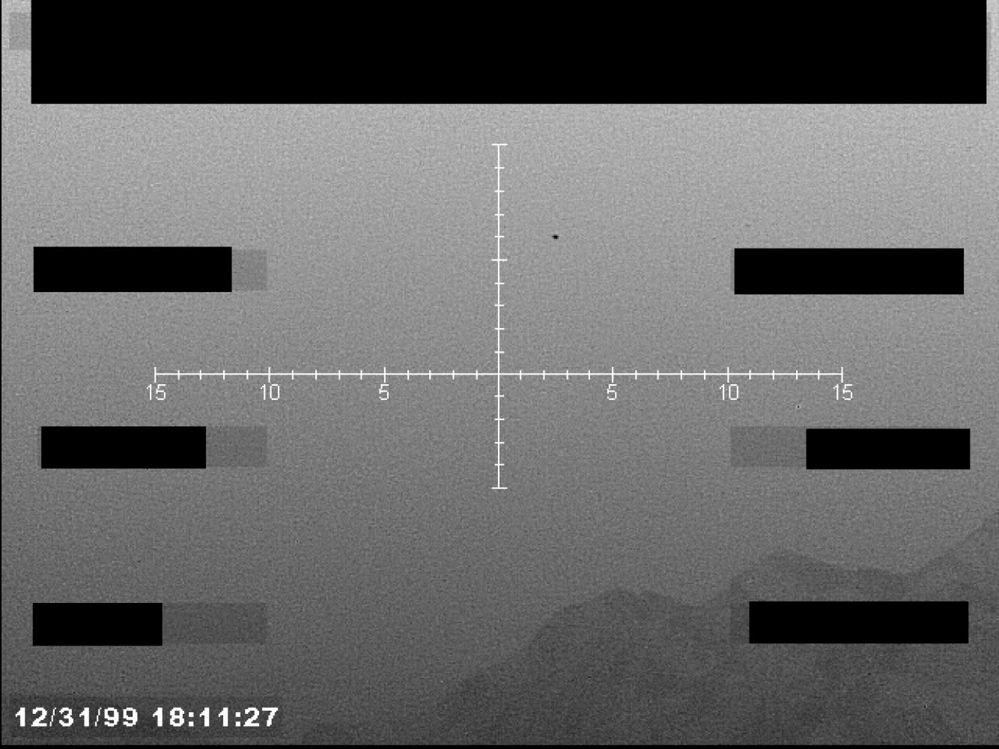 | [📝](reports/126-fbi_photo_b2/report.md) |
| **#132 B3** 18:11:34 | 整張比 B2 略灰（大氣擾動造成對比降低），目標還在但對比較弱 |  | [📝](reports/132-fbi_photo_b3/report.md) |
| **#133 B4** 18:12:16 | **B 系列最大相鄰幀間隔 42 秒**（sensor 操作員調整模式 / 目標暫時離開）。打開後目標仍在原位 |  | [📝](reports/133-fbi_photo_b4/report.md) |
| **#134 B5** 18:12:20 | 準星附近**看不出明確目標**，第一波廣角影像最後一張。距下一個保留瞬間 6m33s | 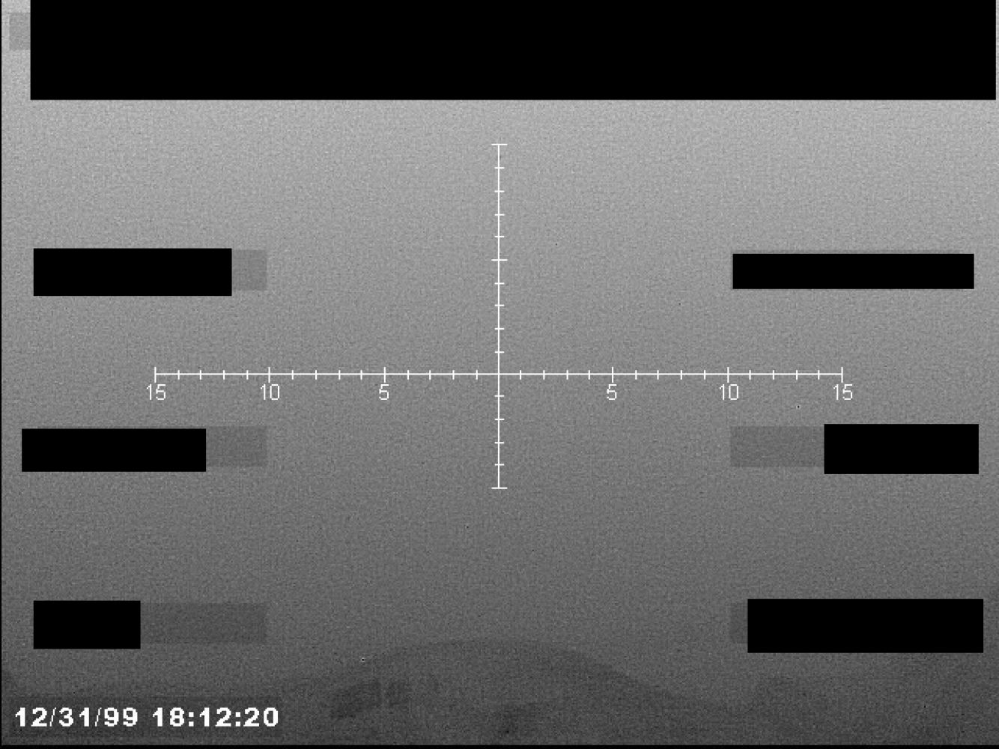 | [📝](reports/134-fbi_photo_b5/report.md) |
| **#125 B19** 18:18:53 | 第一波與第二波之間 7m34s 空白的中段，準星 ±15 mil 廣角，目標接近準星中心 | 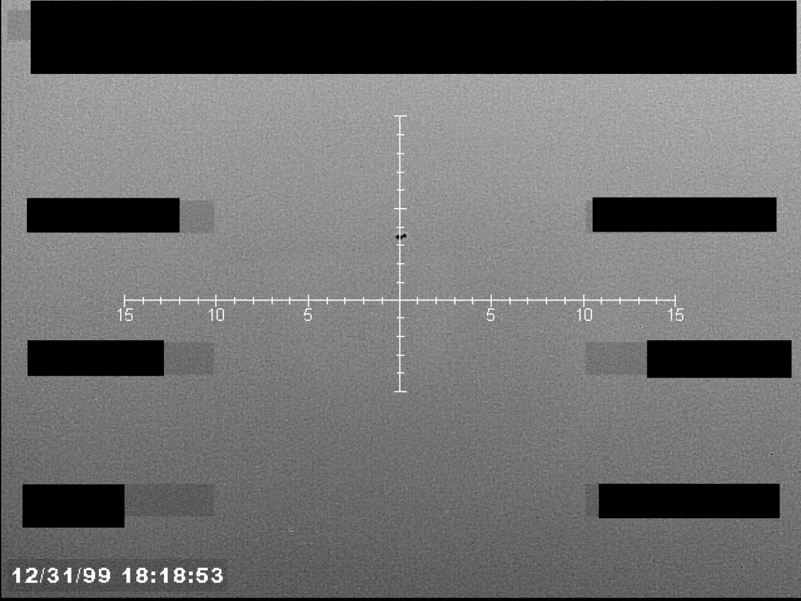 | [📝](reports/125-fbi_photo_b19/report.md) |
| **#127 B20** 18:18:58 | 距 B19 5 秒，目標位置幾乎沒變但形態變為**兩個並排暗色小塊**（首次廣角下解析雙塊）| 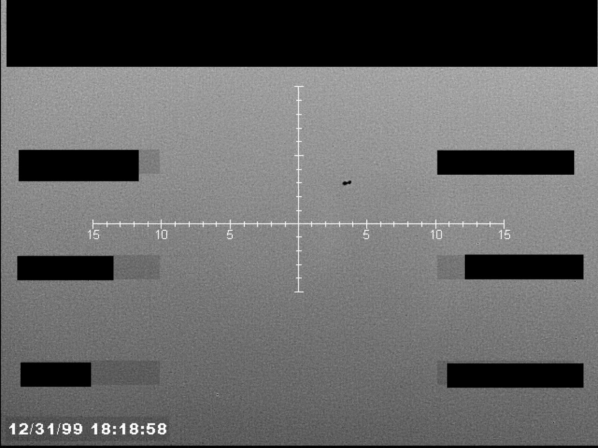 | [📝](reports/127-fbi_photo_b20/report.md) |
| **#128 B21** 18:19:06 | 距 B20 8 秒，雙塊形態維持至少 8 秒，意味非 sensor 雜訊假象 | 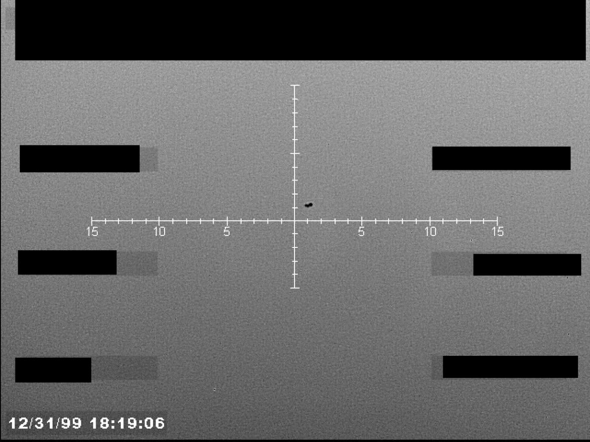 | [📝](reports/128-fbi_photo_b21/report.md) |
| **#129 B22** 18:19:19 | **真正 zoom in 起點**：刻度切到 ±3 mil，兩個分開圓潤暗塊清晰、邊緣銳利、IR 對比強 | 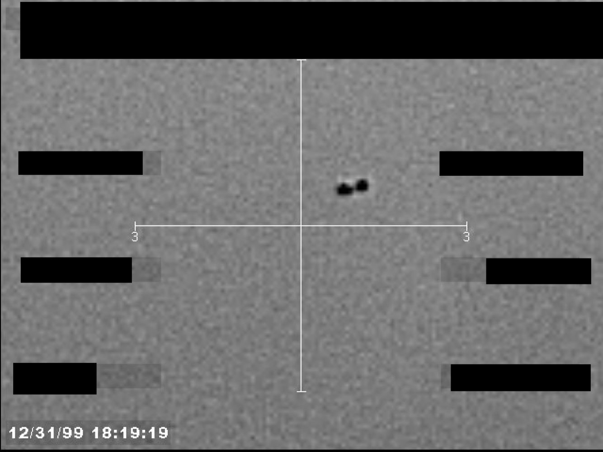 | [📝](reports/129-fbi_photo_b22/report.md) |
| **#130 B23** 18:19:33 | 兩塊變成**拉長形態**（主體 + 右側較小延伸），合併中 | 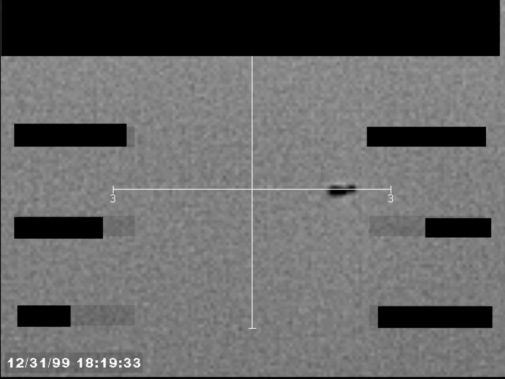 | [📝](reports/130-fbi_photo_b23/report.md) |
| **#131 B24** 18:19:40 | 中央偏左「翼狀延伸」不規則暗色形狀（上突出 + 下水平延伸），第二波形態最不規則 |  | [📝](reports/131-fbi_photo_b24/report.md) |
| **#119 B13** 18:19:54 | 距 B22 35 秒，準星比例尺從 ±15 切到 **±3 mil**（zoom in 5 倍），目標水平延伸暗色形狀 | 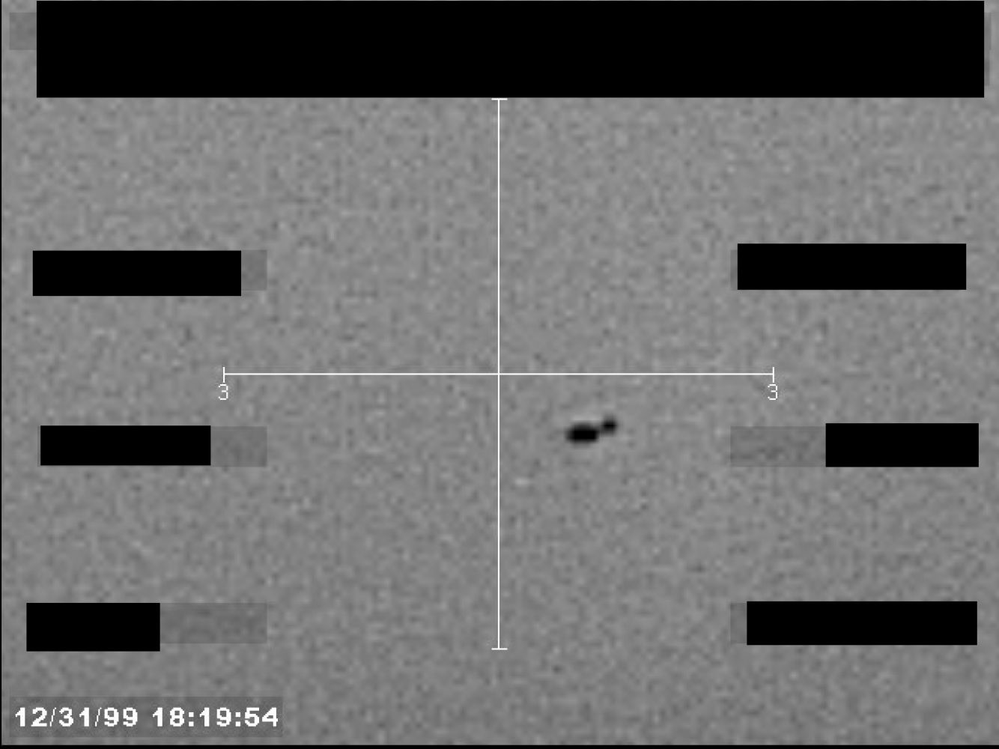 | [📝](reports/119-fbi_photo_b13/report.md) |
| **#120 B14** 18:20:08 | B13 那個「主體 + 突起」**明確變成兩個分開的圓塊**並排同大小，D 系列「同 size/shape 多物體」signature | 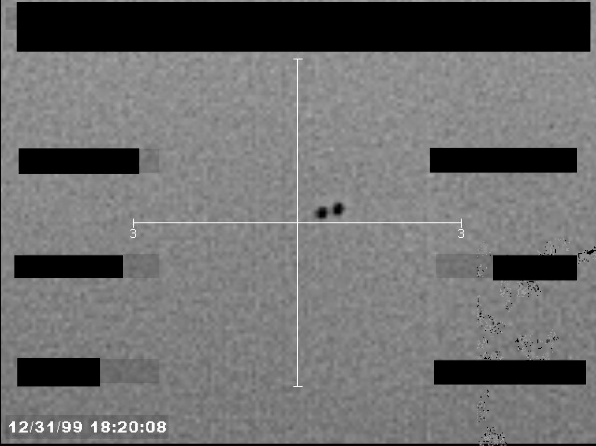 | [📝](reports/120-fbi_photo_b14/report.md) |
| **#121 B15** 18:20:22 | 兩塊相對位置幾乎完全保持，意味**接近相同速度方向一起移動**（鬆散編隊，非分裂碎片）|  | [📝](reports/121-fbi_photo_b15/report.md) |
| **#122 B16** 18:20:41 | 兩塊**重新合併**成拉長團塊（主體 + 右側突起，跟 B13 形態幾乎一致）。47 秒「合→分→分→合」一循環 |  | [📝](reports/122-fbi_photo_b16/report.md) |
| **#123 B17** 18:20:48 | 距 B16 僅 7 秒，再次分開。54 秒內 4 次形態切換（合→分→分→合→分），疑繞行軌跡 0.7 m/s |  | [📝](reports/123-fbi_photo_b17/report.md) |
| **#124 B18** 18:21:02 | 兩個並排但仍可分辨，「半合半分」狀態。已公開第二波 6 幀觀測結束於此 |  | [📝](reports/124-fbi_photo_b18/report.md) |

整體觀測涵蓋約 10 分 12 秒（18:10:50-18:21:02）。

---

## 10. 2023 美國西部目擊事件

7 名聯邦政府雇員 2023 年兩天內分別觀測多次未明現象。回報內容分四類：（1）遠處「光球發射光球」、（2）近距離大型靜止發光球、（3）追逐近地大型現象、（4）「半透明風箏」狀大型透明現象。AARO 評為目前持有最值得關注事件之一。

| 標題 | 描述 | 照片 | 報告 |
|---|---|---|---|
| **#156 USPER Statement** Late 2025 | FBI 302，高階情報官搭直升機追蹤光球，「超熱」光球懸浮地表，以追不上的速度移動 20 哩；「群」狀光點四處移動；30 分鐘 4-5 顆光球閃亮 → 熄滅循環 | 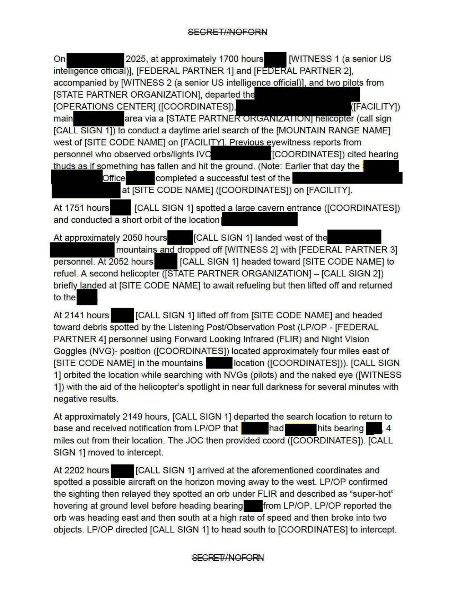 | [📝](reports/156-usper_statement_uap_sighting/report.md) |
| **#157 Composite Sketch** 2023-09 | FBI 實驗室合成草圖：橢球銅金屬色物體 + 強光位於東端、光內可見光環；依 #159 雪茄銅色目擊證詞繪製 |  | [📝](reports/157-fbi_september_2023_composite_sketch/report.md) |
| **#158 FBI 302（光點）** 2023-09 | FBI 302 FaceTime 訪談：LiDAR 試驗場承包商，地平線上方亮白光、靜止 10 秒、向右移動然後消失；10-20 哩遠 |  | [📝](reports/158-fbi_september_2023_serial_3/report.md) |
| **#159 FBI 302（雪茄銅色）** 2023-09 | FBI 302 in-person 訪談：試驗場主管，雪茄形 + 金屬銅色 + 2-3 架黑鷹長 + 強光在東端；限飛區閘門 fob 三次失敗 |  | [📝](reports/159-fbi_september_2023_serial_4/report.md) |
| **#160 FBI 302（線狀灰色）** 2023-09 | FBI 302 FaceTime 訪談：無人機操作員，線狀 + 金屬灰色 + 1-2 架黑鷹長 + 強光在東側、光內可見條帶；5,000 ft 上空東西向 |  | [📝](reports/160-fbi_september_2023_serial_5/report.md) |
| **#161 Western US Event** 2023 | 4 種型態：（1）橙色母球發射紅色子球（2）500-1050 m 處 12-18 m 直徑橙色發光球（3）Dark Kite 黎明前偽裝汽車（4）Transparent Kite 透明風箏；AARO 量測介入 | 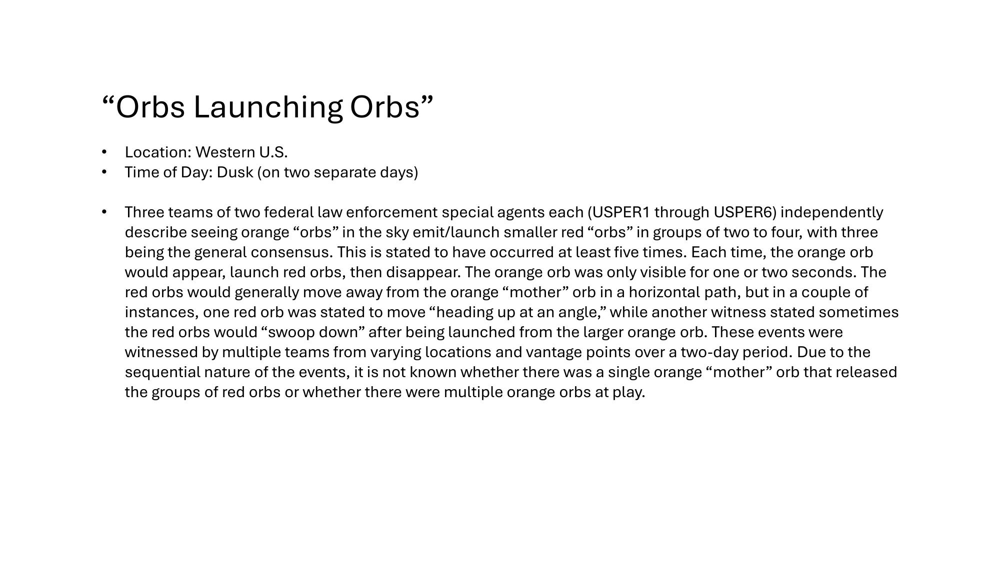 | [📝](reports/161-western_us_event/report.md) |
