# United States UAP Files

US Department of War 透過 PURSUE 系統解密公開的 UAP 檔案，中文索引與逐檔分析。

官方 portal：<https://www.war.gov/UFO/>

## Release 01（2026-05-08，161 份）

目前 IMG / VID 全部完成中文整理（43 份），PDF 先放 placeholder（118 份），完整中文摘要與譯文後續分批補上。

| ID | 圖 | 檔名 | 機關 | 事件日期 | 地點 | 類型 | 簡述 | 報告 |
| --- | --- | --- | --- | --- | --- | --- | --- | --- |
| 001 |  | 65_HS1-834228961_62-HQ-83894_Section_10 | FBI | N/A | N/A | PDF | FBI HQ-83894 歷史 UAP 檔案 | [報告](reports/001-fbi-hq83894-sec10/report.md) |
| 002 |  | 65_HS1-834228961_62-HQ-83894_Section_2 | FBI | N/A | N/A | PDF | FBI HQ-83894 歷史 UAP 檔案 | [報告](reports/002-fbi-hq83894-sec2/report.md) |
| 003 |  | 65_HS1-834228961_62-HQ-83894_Section_3 | FBI | N/A | N/A | PDF | FBI HQ-83894 歷史 UAP 檔案 | [報告](reports/003-fbi-hq83894-sec3/report.md) |
| 004 |  | 65_HS1-834228961_62-HQ-83894_Section_4 | FBI | N/A | N/A | PDF | FBI HQ-83894 歷史 UAP 檔案 | [報告](reports/004-fbi-hq83894-sec4/report.md) |
| 005 |  | 65_HS1-834228961_62-HQ-83894_Section_5 | FBI | N/A | N/A | PDF | FBI HQ-83894 歷史 UAP 檔案 | [報告](reports/005-fbi-hq83894-sec5/report.md) |
| 006 |  | 65_HS1-834228961_62-HQ-83894_Section_6 | FBI | N/A | N/A | PDF | FBI HQ-83894 歷史 UAP 檔案 | [報告](reports/006-fbi-hq83894-sec6/report.md) |
| 007 |  | 65_HS1-834228961_62-HQ-83894_Section_7 | FBI | N/A | N/A | PDF | FBI HQ-83894 歷史 UAP 檔案 | [報告](reports/007-fbi-hq83894-sec7/report.md) |
| 008 |  | 65_HS1-834228961_62-HQ-83894_Section_9 | FBI | N/A | N/A | PDF | FBI HQ-83894 歷史 UAP 檔案 | [報告](reports/008-fbi-hq83894-sec9/report.md) |
| 009 |  | 65_HS1-834228961_62-HQ-83894_Serial_130 | FBI | N/A | N/A | PDF | FBI 2023 目擊事件 83894_Serial_130 | [報告](reports/009-fbi-hq83894-ser130/report.md) |
| 010 |  | 65_HS1-834228961_62-HQ-83894_Serial_153 | FBI | N/A | N/A | PDF | FBI 2023 目擊事件 83894_Serial_153 | [報告](reports/010-fbi-hq83894-ser153/report.md) |
| 011 |  | 65_HS1-834228961_62-HQ-83894_Serial_164 | FBI | N/A | N/A | PDF | FBI 2023 目擊事件 83894_Serial_164 | [報告](reports/011-fbi-hq83894-ser164/report.md) |
| 012 |  | 65_HS1-834228961_62-HQ-83894_Serial_220 | FBI | N/A | N/A | PDF | FBI 2023 目擊事件 83894_Serial_220 | [報告](reports/012-fbi-hq83894-ser220/report.md) |
| 013 |  | 65_HS1-834228961_62-HQ-83894_Serial_403 | FBI | N/A | N/A | PDF | FBI 2023 目擊事件 83894_Serial_403 | [報告](reports/013-fbi-hq83894-ser403/report.md) |
| 014 |  | 65_HS1-834228961_62-HQ-83894_Serial_438 | FBI | N/A | N/A | PDF | FBI 2023 目擊事件 83894_Serial_438 | [報告](reports/014-fbi-hq83894-ser438/report.md) |
| 015 |  | 65_HS1-834228961_62-HQ-83894_Serial_449 | FBI | N/A | N/A | PDF | FBI 2023 目擊事件 83894_Serial_449 | [報告](reports/015-fbi-hq83894-ser449/report.md) |
| 016 |  | 65_HS1-834228961_62-HQ-83894_SUB_A | FBI | N/A | N/A | PDF | FBI HQ-83894 歷史 UAP 檔案 | [報告](reports/016-fbi-hq83894-suba/report.md) |
| 017 |  | 18_100754_ General 1946-7_Vol_2 | Department of War | 12/30/47 | N/A | PDF | FBI/NARA RG 18 1946-1947 UAP 檔案 | [報告](reports/017-fbi-rg18-1946-vol2/report.md) |
| 018 |  | 18_6369445_General_1948_Vol_1 | Department of War | 6/15/48 | N/A | PDF | FBI/NARA RG 18 1948 UAP 檔案 | [報告](reports/018-fbi-rg18-1948-vol1/report.md) |
| 019 |  | 255_413270_UFO's_and_Defense_What_Should_we_Prepare_For | NASA | N/A | N/A | PDF | RG 255 NASA 國防 UFO 文件 | [報告](reports/019-fbi-rg255-ufo-defense/report.md) |
| 020 |  | NASA-UAP-D3, Gemini 7 Transcript, 1965 | NASA | 12/5/65 | Low Earth Orbit | PDF | NASA Apollo/Skylab 任務逐字稿（NASA-UAP-D3） | [報告](reports/020-nasa-uap-d3/report.md) |
| 021 |  | NASA-UAP-D3A, Gemini 7 Audio Excerpt, 1965 | NASA | 12/5/65 | Low Earth Orbit | VID | NASA Apollo/Skylab 任務逐字稿（NASA-UAP-D3A） | [報告](reports/021-nasa-uap-d3a/report.md) |
| 022 |  | 331_120752_Numeric_Files_1944–1945_37153_German_Armament_Equipment_Documents | Department of War | 3/18/45 | Germany | PDF | NARA RG 331 1944-1945 德軍裝備檔案 | [報告](reports/022-fbi-rg331-german-armaments-1944/report.md) |
| 023 |  | 341_110448_Records_Relating_to_the_Collection_and_Dissemination_of_Intelligence_1948-1955-TS_CONT_No.2_2-5300-2-5399 | Department of War | 11/8/48 | Netherlands | PDF | USAF RG 341 1948-1955 情報蒐集記錄 | [報告](reports/023-fbi-rg341-intel-records-1948-55/report.md) |
| 024 |  | 341_110677_Numerical_File,_5-2500 | Department of War | 10/14/55 | Azerbaijan | PDF | USAF RG 341 數值檔案 5-2500 | [報告](reports/024-fbi-rg341-num-file-5-2500/report.md) |
| 025 |  | 342_HS1-416511228_319.1 Flying Discs 1949 | Department of War | 1/9/50 | N/A | PDF | USAF RG 342 1949 飛碟檔案 | [報告](reports/025-fbi-rg342-flying-discs-1949/report.md) |
| 026 |  | 38_143685_box_Incident_Summaries_101-172 | Department of War | N/A | N/A | PDF | Navy RG 38 BOX 7 事件摘要 | [報告](reports/026-fbi-rg38-incidents-101-172/report.md) |
| 027 |  | 38_143685_box_Incident_Summaries_173-233 | Department of War | N/A | N/A | PDF | Navy RG 38 BOX 7 事件摘要 | [報告](reports/027-fbi-rg38-incidents-173-233/report.md) |
| 028 |  | 38_143685_box7_Incident_Summaries_1-100 | Department of War | N/A | N/A | PDF | Navy RG 38 BOX 7 事件摘要 | [報告](reports/028-fbi-rg38-incidents-1-100/report.md) |
| 029 |  | 59_214434_SP 16 [7.18.1963] | Department of State | 7/18/63 | N/A | PDF | RG 59 SP-16 1963 文件 | [報告](reports/029-fbi-rg59-sp16-1963a/report.md) |
| 030 |  | 59_64634_711.5612[7-2852 | Department of State | 7/18/52 | N/A | PDF | RG 59 SP-16 1963 文件 | [報告](reports/030-fbi-rg59-sp16-1963b/report.md) |
| 031 |  | 65_HS1-101634279_100-DE-18221_Serial_844 | FBI | 4/17/58 | Detroit, MI | PDF | FBI 2023 目擊事件 18221_Serial_844 | [報告](reports/031-fbi-de18221-ser844/report.md) |
| 032 |  | 65_HS1-101634279_100-DE-26505 | FBI | 11/7/57 | Germany | PDF | FBI DE-18221/26505 檔案 | [報告](reports/032-fbi-de26505/report.md) |
| 033 |  | 65_HS1-834228961_62-HQ-83894_Section_1 | FBI | N/A | N/A | PDF | FBI HQ-83894 歷史 UAP 檔案 | [報告](reports/033-fbi-hq83894-sec1/report.md) |
| 034 |  | 65_HS1-834228961_62-HQ-83894_Section_8 | FBI | N/A | N/A | PDF | FBI HQ-83894 歷史 UAP 檔案 | [報告](reports/034-fbi-hq83894-sec8/report.md) |
| 035 |  | DOW-UAP-D10, Mission Report, Middle East, May 2022 | Department of War | 5/6/22 | Iraq | PDF | DoW MISREP：Iraq，5/6/22 | [報告](reports/035-dow-uap-d10/report.md) |
| 036 |  | DOW-UAP-D12, Mission Report, Iraq, May 2022 | Department of War | 5/20/22 | Iraq | PDF | DoW MISREP：Iraq，5/20/22 | [報告](reports/036-dow-uap-d12/report.md) |
| 037 |  | DOW-UAP-D14, Mission Report, Iraq, May 2022 | Department of War | 5/29/22 | Syria | PDF | DoW MISREP：Syria，5/29/22 | [報告](reports/037-dow-uap-d14/report.md) |
| 038 |  | DOW-UAP-D16, Mission Report, Syria, July 2022 | Department of War | 7/31/22 | Syria | PDF | DoW MISREP：Syria，7/31/22 | [報告](reports/038-dow-uap-d16/report.md) |
| 039 |  | DOW-UAP-D18, Mission Report, Iraq, December 2022 | Department of War | 12/1/22 | Iraq | PDF | DoW MISREP：Iraq，12/1/22 | [報告](reports/039-dow-uap-d18/report.md) |
| 040 |  | DOW-UAP-D19, Mission Report, Syria, February 21, 2023 | Department of War | 2/21/23 | Syria | PDF | DoW MISREP：Syria，2/21/23 | [報告](reports/040-dow-uap-d19/report.md) |
| 041 |  | DOW-UAP-D20, Mission Report, Iraq, 2023 | Department of War | 3/31/23 | Iraq | PDF | DoW MISREP：Iraq，3/31/23 | [報告](reports/041-dow-uap-d20/report.md) |
| 042 |  | DOW-UAP-D23, Mission Report, United Arab Emirates, October 2023 | Department of War | 10/31/23 | Arabian Gulf | PDF | DoW MISREP：Arabian Gulf，10/31/23 | [報告](reports/042-dow-uap-d23/report.md) |
| 043 |  | DOW-UAP-D23, Mission Report, United Arab Emirates, October 2023 | Department of War | 10/31/23 | Arabian Gulf | PDF | DoW MISREP：Arabian Gulf，10/31/23 | [報告](reports/043-dow-uap-d23/report.md) |
| 044 |  | DOW-UAP-D25, Mission Report, Greece, January 2024 | Department of War | 1/25/24 | Mediterranean Sea | PDF | DoW MISREP：Mediterranean Sea，1/25/24 | [報告](reports/044-dow-uap-d25/report.md) |
| 045 |  | DOW-UAP-D27, Mission Report, United Arab Emirates, October 2023 | Department of War | 6/7/24 | Gulf of Oman | PDF | DoW MISREP：Gulf of Oman，6/7/24 | [報告](reports/045-dow-uap-d27/report.md) |
| 046 |  | DOW-UAP-D28, Mission Report, Iraq, September 2024 | Department of War | 9/20/24 | Iraq | PDF | DoW MISREP：Iraq，9/20/24 | [報告](reports/046-dow-uap-d28/report.md) |
| 047 |  | DOW-UAP-D3, Mission Report, Arabian Gulf, 2020 | Department of War | N/A | N/A | PDF | DoW MISREP：N/A，N/A | [報告](reports/047-dow-uap-d3/report.md) |
| 048 |  | DOW-UAP-D32, Mission Report, Syria, October 2024 | Department of War | 10/20/24 | Syria | PDF | DoW MISREP：Syria，10/20/24 | [報告](reports/048-dow-uap-d32/report.md) |
| 049 |  | DOW-UAP-D32, Mission Report, Syria, October 2024 | Department of War | 10/20/24 | Syria | PDF | DoW MISREP：Syria，10/20/24 | [報告](reports/049-dow-uap-d32/report.md) |
| 050 |  | DOW-UAP-D32, Mission Report, Syria, October 2024 | Department of War | 10/20/24 | Syria | PDF | DoW MISREP：Syria，10/20/24 | [報告](reports/050-dow-uap-d32/report.md) |
| 051 |  | DOW-UAP-D33, Mission Report, Greece, October 2023 | Department of War | 10/27/23 | Aegean Sea | PDF | DoW MISREP：Aegean Sea，10/27/23 | [報告](reports/051-dow-uap-d33/report.md) |
| 052 |  | DOW-UAP-D35, Mission Report, Greece, October 2023 | Department of War | 10/29/23 | Aegean Sea | PDF | DoW MISREP：Aegean Sea，10/29/23 | [報告](reports/052-dow-uap-d35/report.md) |
| 053 |  | DOW-UAP-D38, Range Fouler Debrief, Middle East, May 2020 | Department of War | 5/14/20 | Arabian Gulf | PDF | DoW Range Fouler 報告：Arabian Gulf | [報告](reports/053-dow-uap-d38/report.md) |
| 054 |  | DOW-UAP-D4, Mission Report, Arabian Gulf, 2020 | Department of War | N/A | N/A | PDF | DoW MISREP：N/A，N/A | [報告](reports/054-dow-uap-d4/report.md) |
| 055 |  | DOW-UAP-D42, Range Fouler Debrief, Japan, 2023 | Department of War | 8/31/20 | Arabian Gulf | PDF | DoW Range Fouler 報告：Arabian Gulf | [報告](reports/055-dow-uap-d42/report.md) |
| 056 |  | DOW-UAP-D44, Range Fouler Reporting Form, Gulf of Aden, October 2020 | Department of War | 10/15/20 | Arabian Sea | PDF | DoW Range Fouler 報告：Arabian Sea | [報告](reports/056-dow-uap-d44/report.md) |
| 057 |  | DOW-UAP-D48, Department of the Air Force Report, 1996 | Department of War | 9/10/96 | N/A | PDF | DoW DOW-UAP-D48：N/A | [報告](reports/057-dow-uap-d48/report.md) |
| 058 |  | DOW-UAP-D49, Launch Summary, Vandenberg AFB, 2000 | Department of War | 2/3/00 | N/A | PDF | DoW DOW-UAP-D49：N/A | [報告](reports/058-dow-uap-d49/report.md) |
| 059 |  | DOW-UAP-D5, Mission Report, Arabian Gulf, 2020 | Department of War | N/A | Mediterranean Sea | PDF | DoW MISREP：Mediterranean Sea，N/A | [報告](reports/059-dow-uap-d5/report.md) |
| 060 |  | DOW-UAP-D50, Email Correspondence, INDOPACOM, April 2025 | Department of War | 4/10/2025-4/11/2025 | N/A | PDF | DoW UAP 通報 email correspondence | [報告](reports/060-dow-uap-d50/report.md) |
| 061 |  | DOW-UAP-D51, Email Correspondence, Pacific Time Zone, March 2023 | Department of War | 3/23/26 | Pacific Time Zone | PDF | DoW UAP 通報 email correspondence | [報告](reports/061-dow-uap-d51/report.md) |
| 062 |  | DOW-UAP-D52, Email Correspondance, NA, August 2024 | Department of War | 10/31/24 | N/A | PDF | DoW UAP 通報 email correspondence | [報告](reports/062-dow-uap-d52/report.md) |
| 063 |  | DOW-UAP-D54, Mission Report, Mediterranean Sea, NA | Department of War | N/A | Mediterranean Sea | PDF | DoW MISREP：Mediterranean Sea，N/A | [報告](reports/063-dow-uap-d54/report.md) |
| 064 |  | DOW-UAP-D55, Mission Report, Syria, November 2016 | Department of War | 11/18/16 | Syria | PDF | DoW MISREP：Syria，11/18/16 | [報告](reports/064-dow-uap-d55/report.md) |
| 065 |  | DOW-UAP-D56, Range Fouler Debrief, Arabian Sea, August 2020 | Department of War | 8/24/20 | Arabian Sea | PDF | DoW Range Fouler 報告：Arabian Sea | [報告](reports/065-dow-uap-d56/report.md) |
| 066 |  | DOW-UAP-D57, Range Fouler Reporting Form, Gulf of Aden, September 2020 | Department of War | 9/4/20 | Gulf of Aden | PDF | DoW Range Fouler 報告：Gulf of Aden | [報告](reports/066-dow-uap-d57/report.md) |
| 067 |  | DOW-UAP-D58, Range Fouler Debrief, NA, October 2020 | Department of War | 10/27/20 | N/A | PDF | DoW Range Fouler 報告：N/A | [報告](reports/067-dow-uap-d58/report.md) |
| 068 |  | DOW-UAP-D6, Mission Report, Arabian Gulf, 2020 | Department of War | N/A | Pacific Ocean | PDF | DoW MISREP：Pacific Ocean，N/A | [報告](reports/068-dow-uap-d6/report.md) |
| 069 |  | DOW-UAP-D60, Mission Report, Arabian Gulf, August 2020 | Department of War | 8/8/20 | Arabian Gulf | PDF | DoW MISREP：Arabian Gulf，8/8/20 | [報告](reports/069-dow-uap-d60/report.md) |
| 070 |  | DOW-UAP-D61, Mission Report, Arabian Gulf, August 2020 | Department of War | 8/27/20 | Arabian Gulf | PDF | DoW MISREP：Arabian Gulf，8/27/20 | [報告](reports/070-dow-uap-d61/report.md) |
| 071 |  | DOW-UAP-D62, Mission Report, Strait of Hormuz, September 2020 | Department of War | 9/16/20 | Strait of Hormuz | PDF | DoW MISREP：Strait of Hormuz，9/16/20 | [報告](reports/071-dow-uap-d62/report.md) |
| 072 |  | DOW-UAP-D63, Mission Report, Strait of Hormuz, October 2020 | Department of War | 10/1/20 | Strait of Hormuz | PDF | DoW MISREP：Strait of Hormuz，10/1/20 | [報告](reports/072-dow-uap-d63/report.md) |
| 073 |  | DOW-UAP-D64, Mission Report, Iran, November 2020 | Department of War | 11/2/20 | Iran | PDF | DoW MISREP：Iran，11/2/20 | [報告](reports/073-dow-uap-d64/report.md) |
| 074 |  | DOW-UAP-D65, Mission Report, Arabian Gulf, July 2020 | Department of War | 7/16/20 | Arabian Gulf | PDF | DoW MISREP：Arabian Gulf，7/16/20 | [報告](reports/074-dow-uap-d65/report.md) |
| 075 |  | DOW-UAP-D7, Mission Report, Arabian Gulf, 2020 | Department of War | N/A | N/A | PDF | DoW MISREP：N/A，N/A | [報告](reports/075-dow-uap-d7/report.md) |
| 076 |  | DOW-UAP-D74, Mission Report, Syria, November 2023 | Department of War | 11/9/23 | Syria | PDF | DoW MISREP：Syria，11/9/23 | [報告](reports/076-dow-uap-d74/report.md) |
| 077 |  | DOW-UAP-D75, Mission Report, Gulf of Aden, July 2024 | Department of War | 7/14/24 | Gulf of Aden | PDF | DoW MISREP：Gulf of Aden，7/14/24 | [報告](reports/077-dow-uap-d75/report.md) |
| 078 |  | DOW-UAP-D8, Mission Report, Djibouti, 2025 | Department of War | N/A | Mediterranean Sea | PDF | DoW MISREP：Mediterranean Sea，N/A | [報告](reports/078-dow-uap-d8/report.md) |
| 079 | 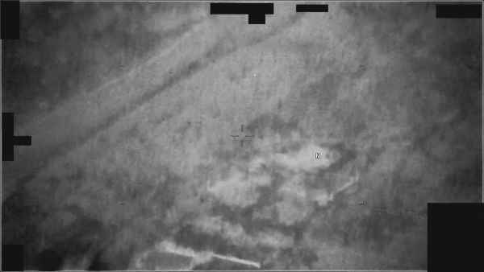 | DOW-UAP-PR19, Unresolved UAP Report, Middle East, May 2022 | Department of War | N/A | Middle East | VID | DoW PURSUE 影片：Middle East | [報告](reports/079-dow-uap-pr19/report.md) |
| 080 |  | DOW-UAP-PR20, Unresolved UAP Report, Kuwait, May 2022 | Department of War | N/A | Iraq | PDF | DoW PURSUE 影片：Iraq | [報告](reports/080-dow-uap-pr20/report.md) |
| 081 | 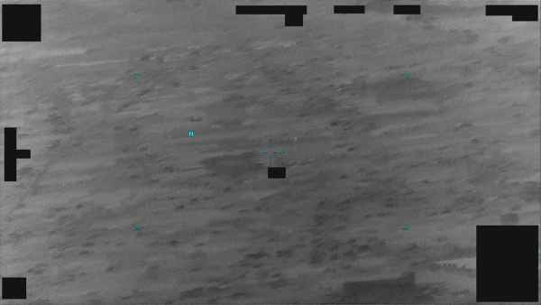 | DOW-UAP-PR21, Unresolved UAP Report, Iraq, May 2022 | Department of War | N/A | Iraq | VID | DoW PURSUE 影片：Iraq | [報告](reports/081-dow-uap-pr21/report.md) |
| 082 | 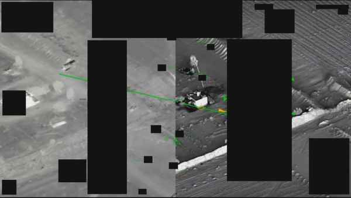 | DOW-UAP-PR22, Unresolved UAP Report, Syria, July 2022 | Department of War | N/A | Syria | VID | DoW PURSUE 影片：Syria | [報告](reports/082-dow-uap-pr22/report.md) |
| 083 | 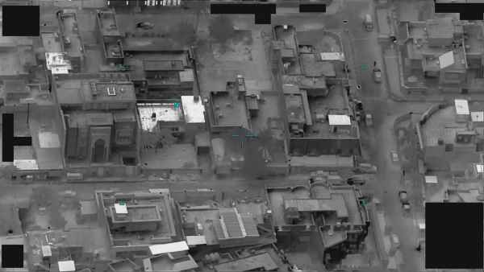 | DOW-UAP-PR23, Unresolved UAP Report, Iraq, December 2022 | Department of War | N/A | Iraq | VID | DoW PURSUE 影片：Iraq | [報告](reports/083-dow-uap-pr23/report.md) |
| 084 | 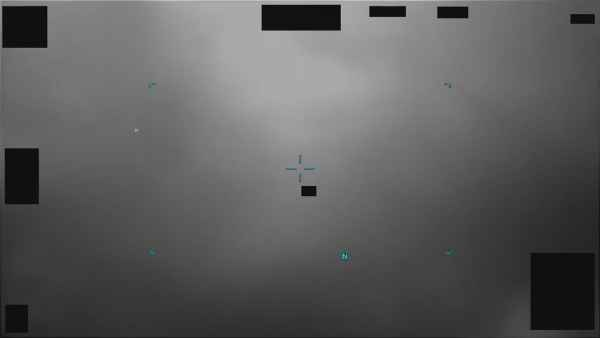 | DOW-UAP-PR26, Unresolved UAP Report, United Arab Emirates, October 2023 | Department of War | N/A | United Arab Emirates | VID | DoW PURSUE 影片：United Arab Emirates | [報告](reports/084-dow-uap-pr26/report.md) |
| 085 | 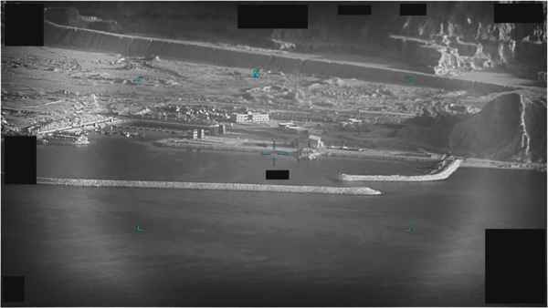 | DOW-UAP-PR27, Unresolved UAP Report, United Arab Emirates, October 2023 | Department of War | N/A | United Arab Emirates | VID | DoW PURSUE 影片：United Arab Emirates | [報告](reports/085-dow-uap-pr27/report.md) |
| 086 | 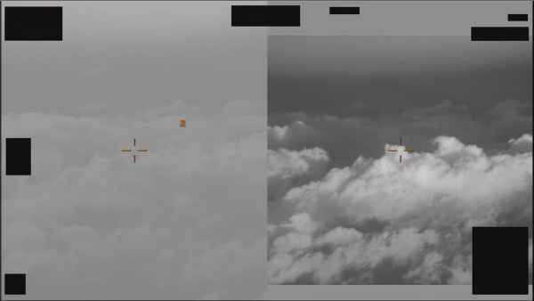 | DOW-UAP-PR28, Unresolved UAP Report, Greece, January 2024 | Department of War | N/A | Greece | VID | DoW PURSUE 影片：Greece | [報告](reports/086-dow-uap-pr28/report.md) |
| 087 | 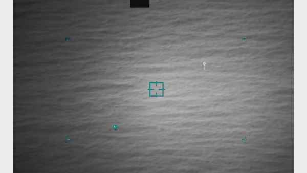 | DOW-UAP-PR29, Unresolved UAP Report, United Arab Emirates, June 2024 | Department of War | N/A | Gulf of Oman | VID | DoW PURSUE 影片：Gulf of Oman | [報告](reports/087-dow-uap-pr29/report.md) |
| 088 | 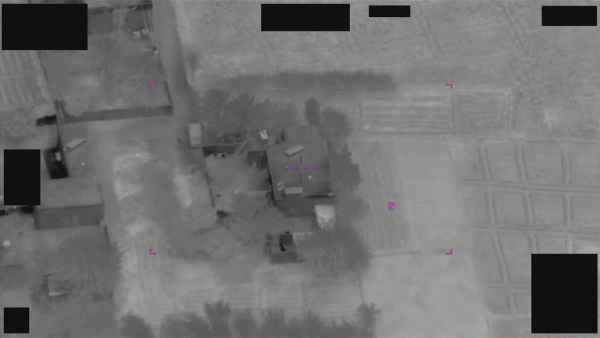 | DOW-UAP-PR31, Unresolved UAP Report, Syria, October 2024 | Department of War | N/A | Syria | VID | DoW PURSUE 影片：Syria | [報告](reports/088-dow-uap-pr31/report.md) |
| 089 | 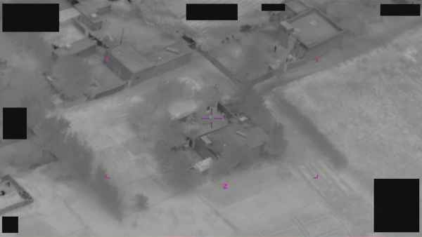 | DOW-UAP-PR32, Unresolved UAP Report, Syria, October 2024 | Department of War | N/A | Syria | VID | DoW PURSUE 影片：Syria | [報告](reports/089-dow-uap-pr32/report.md) |
| 090 | 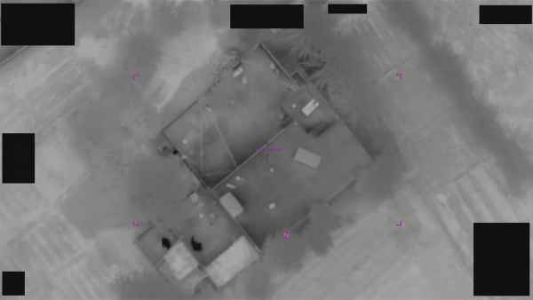 | DOW-UAP-PR33, Unresolved UAP Report, Syria, October 2024 | Department of War | N/A | Syria | VID | DoW PURSUE 影片：Syria | [報告](reports/090-dow-uap-pr33/report.md) |
| 091 | 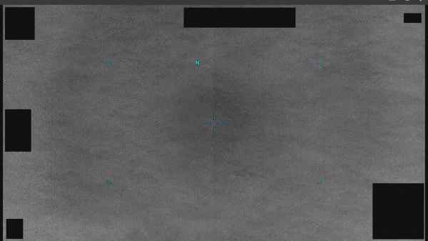 | DOW-UAP-PR34, Unresolved UAP Report, Greece, October 2023 | Department of War | N/A | Greece | VID | DoW PURSUE 影片：Greece | [報告](reports/091-dow-uap-pr34/report.md) |
| 092 | 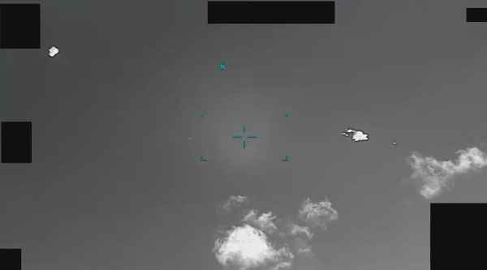 | DOW-UAP-PR35, Unresolved UAP Report, Greece, October 2023 | Department of War | N/A | Greece | VID | DoW PURSUE 影片：Greece | [報告](reports/092-dow-uap-pr35/report.md) |
| 093 | 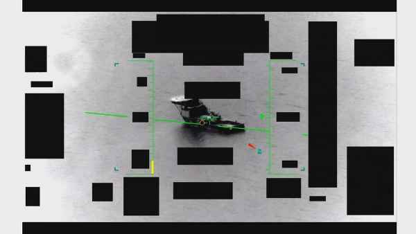 | DOW-UAP-PR36, Unresolved UAP Report, Middle East, May 2020 | Department of War | N/A | Middle East | VID | DoW PURSUE 影片：Middle East | [報告](reports/093-dow-uap-pr36/report.md) |
| 094 | 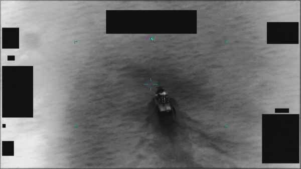 | DOW-UAP-PR37, Unresolved UAP Report, Middle East, 2020 | Department of War | N/A | Arabian Gulf | VID | DoW PURSUE 影片：Arabian Gulf | [報告](reports/094-dow-uap-pr37/report.md) |
| 095 | 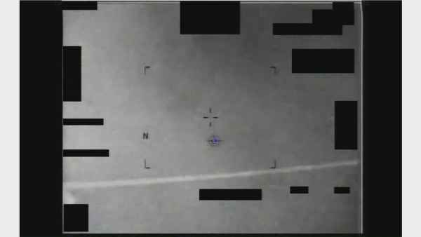 | DOW-UAP-PR38, Unresolved UAP Report, Middle East, 2013 | Department of War | N/A | Middle East | VID | DoW PURSUE 影片：Middle East | [報告](reports/095-dow-uap-pr38/report.md) |
| 096 | 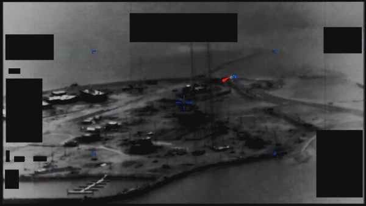 | DOW-UAP-PR39, Unresolved UAP Report, Middle East, 2020 | Department of War | N/A | Arabian Gulf | VID | DoW PURSUE 影片：Arabian Gulf | [報告](reports/096-dow-uap-pr39/report.md) |
| 097 | 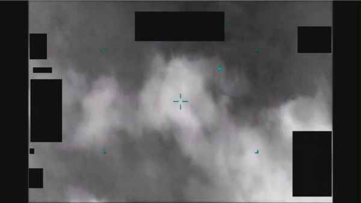 | DOW-UAP-PR40, Unresolved UAP Report, Middle East, 2020 | Department of War | N/A | Arabian Gulf | VID | DoW PURSUE 影片：Arabian Gulf | [報告](reports/097-dow-uap-pr40/report.md) |
| 098 | 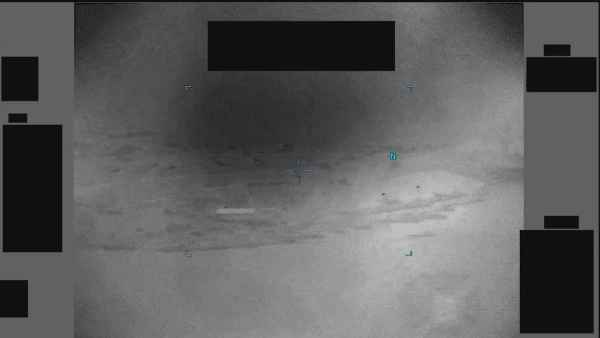 | DOW-UAP-PR41, Unresolved UAP Report, Middle East, 2020 | Department of War | N/A | Arabian Gulf | VID | DoW PURSUE 影片：Arabian Gulf | [報告](reports/098-dow-uap-pr41/report.md) |
| 099 | 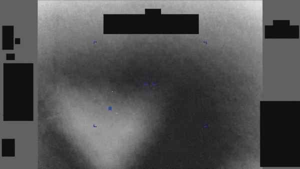 | DOW-UAP-PR42, Unresolved UAP Report, Middle East, 2020 | Department of War | N/A | Arabian Gulf | VID | DoW PURSUE 影片：Arabian Gulf | [報告](reports/099-dow-uap-pr42/report.md) |
| 100 | 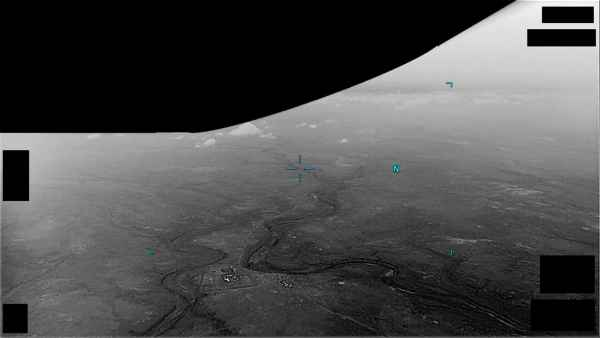 | DOW-UAP-PR43, Unresolved UAP Report, Africa, 2025 | Department of War | N/A | Djibouti | VID | DoW PURSUE 影片：Djibouti | [報告](reports/100-dow-uap-pr43/report.md) |
| 101 | 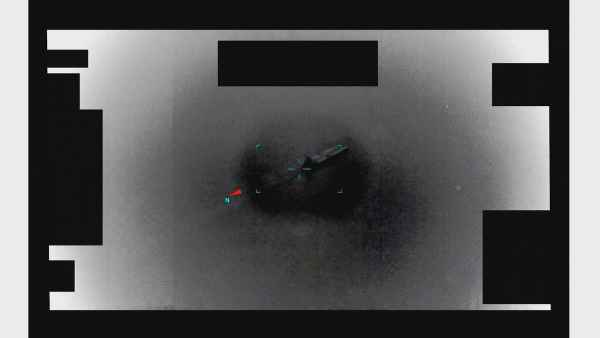 | DOW-UAP-PR44, Unresolved UAP Report, Middle East, 2020 | Department of War | N/A | Arabian Gulf | VID | DoW PURSUE 影片：Arabian Gulf | [報告](reports/101-dow-uap-pr44/report.md) |
| 102 | 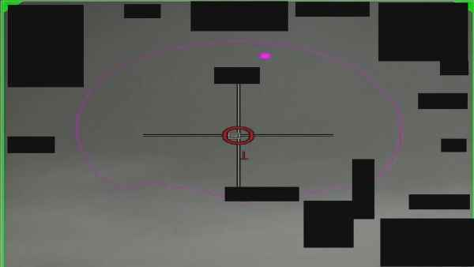 | DOW-UAP-PR45, Unresolved UAP Report, Middle East, 2020 | Department of War | N/A | Southern United States | VID | DoW PURSUE 影片：Southern United States | [報告](reports/102-dow-uap-pr45/report.md) |
| 103 | 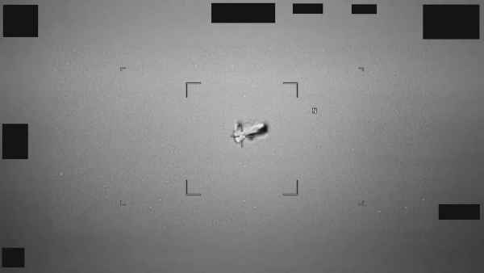 | DOW-UAP-PR46, Unresolved UAP Report, INDOPACOM, 2024 | Department of War | N/A | East China Sea | VID | DoW PURSUE 影片：East China Sea | [報告](reports/103-dow-uap-pr46/report.md) |
| 104 | 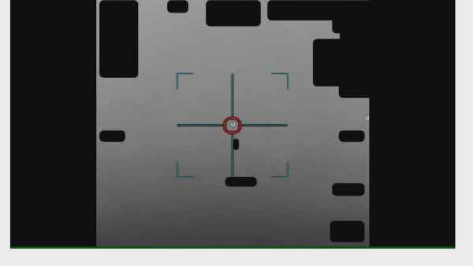 | DOW-UAP-PR47, Unresolved UAP Report, INDOPACOM, 2023 | Department of War | N/A | Japan | VID | DoW PURSUE 影片：Japan | [報告](reports/104-dow-uap-pr47/report.md) |
| 105 | 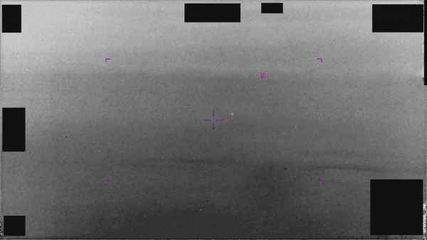 | DOW-UAP-PR48, Unresolved UAP Report, INDOPACOM, 2024 | Department of War | N/A | Indo-PACOM | VID | DoW PURSUE 影片：Indo-PACOM | [報告](reports/105-dow-uap-pr48/report.md) |
| 106 | 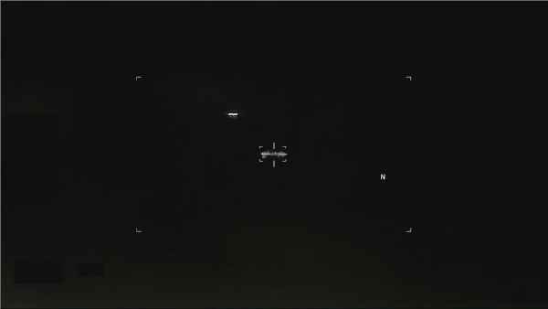 | DOW-UAP-PR49, Unresolved UAP Report, Department of the Army, 2026 | Department of War | N/A | North America | VID | DoW PURSUE 影片：North America | [報告](reports/106-dow-uap-pr49/report.md) |
| 107 | 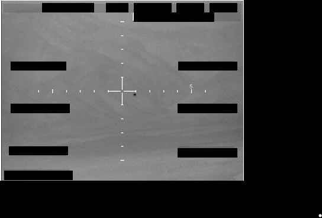 | FBI Photo A1 | FBI | Late 2025 | N/A | IMG | FBI 提交 AARO 的 UAP 靜態影像（A1） | [報告](reports/107-fbi-photo-a1/report.md) |
| 108 |  | FBI Photo A2 | FBI | Late 2025 | N/A | IMG | FBI 提交 AARO 的 UAP 靜態影像（A2） | [報告](reports/108-fbi-photo-a2/report.md) |
| 109 |  | FBI Photo A3 | FBI | Late 2025 | N/A | IMG | FBI 提交 AARO 的 UAP 靜態影像（A3） | [報告](reports/109-fbi-photo-a3/report.md) |
| 110 | 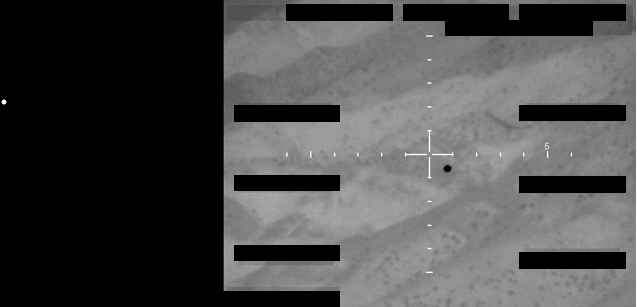 | FBI Photo A4 | FBI | Late 2025 | N/A | IMG | FBI 提交 AARO 的 UAP 靜態影像（A4） | [報告](reports/110-fbi-photo-a4/report.md) |
| 111 |  | FBI Photo A5 | FBI | Late 2025 | N/A | IMG | FBI 提交 AARO 的 UAP 靜態影像（A5） | [報告](reports/111-fbi-photo-a5/report.md) |
| 112 |  | FBI Photo A6 | FBI | Late 2025 | N/A | IMG | FBI 提交 AARO 的 UAP 靜態影像（A6） | [報告](reports/112-fbi-photo-a6/report.md) |
| 113 |  | FBI Photo A7 | FBI | Late 2025 | N/A | IMG | FBI 提交 AARO 的 UAP 靜態影像（A7） | [報告](reports/113-fbi-photo-a7/report.md) |
| 114 |  | FBI Photo A8 | FBI | Late 2025 | N/A | IMG | FBI 提交 AARO 的 UAP 靜態影像（A8） | [報告](reports/114-fbi-photo-a8/report.md) |
| 115 |  | FBI Photo B1 | FBI | Late 2025 | Western United States | PDF | FBI 提交 AARO 的 UAP 靜態影像（B1） | [報告](reports/115-fbi-photo-b1/report.md) |
| 116 |  | FBI Photo B10 | FBI | Late 2025 | Western United States | PDF | FBI 提交 AARO 的 UAP 靜態影像（B10） | [報告](reports/116-fbi-photo-b10/report.md) |
| 117 |  | FBI Photo B11 | FBI | Late 2025 | Western United States | PDF | FBI 提交 AARO 的 UAP 靜態影像（B11） | [報告](reports/117-fbi-photo-b11/report.md) |
| 118 |  | FBI Photo B12 | FBI | Late 2025 | Western United States | PDF | FBI 提交 AARO 的 UAP 靜態影像（B12） | [報告](reports/118-fbi-photo-b12/report.md) |
| 119 |  | FBI Photo B13 | FBI | Late 2025 | Western United States | PDF | FBI 提交 AARO 的 UAP 靜態影像（B13） | [報告](reports/119-fbi-photo-b13/report.md) |
| 120 |  | FBI Photo B14 | FBI | Late 2025 | Western United States | PDF | FBI 提交 AARO 的 UAP 靜態影像（B14） | [報告](reports/120-fbi-photo-b14/report.md) |
| 121 |  | FBI Photo B15 | FBI | Late 2025 | Western United States | PDF | FBI 提交 AARO 的 UAP 靜態影像（B15） | [報告](reports/121-fbi-photo-b15/report.md) |
| 122 |  | FBI Photo B16 | FBI | Late 2025 | Western United States | PDF | FBI 提交 AARO 的 UAP 靜態影像（B16） | [報告](reports/122-fbi-photo-b16/report.md) |
| 123 |  | FBI Photo B17 | FBI | Late 2025 | Western United States | PDF | FBI 提交 AARO 的 UAP 靜態影像（B17） | [報告](reports/123-fbi-photo-b17/report.md) |
| 124 |  | FBI Photo B18 | FBI | Late 2025 | Western United States | PDF | FBI 提交 AARO 的 UAP 靜態影像（B18） | [報告](reports/124-fbi-photo-b18/report.md) |
| 125 |  | FBI Photo B19 | FBI | Late 2025 | Western United States | PDF | FBI 提交 AARO 的 UAP 靜態影像（B19） | [報告](reports/125-fbi-photo-b19/report.md) |
| 126 |  | FBI Photo B2 | FBI | Late 2025 | Western United States | PDF | FBI 提交 AARO 的 UAP 靜態影像（B2） | [報告](reports/126-fbi-photo-b2/report.md) |
| 127 |  | FBI Photo B20 | FBI | Late 2025 | Western United States | PDF | FBI 提交 AARO 的 UAP 靜態影像（B20） | [報告](reports/127-fbi-photo-b20/report.md) |
| 128 |  | FBI Photo B21 | FBI | Late 2025 | Western United States | PDF | FBI 提交 AARO 的 UAP 靜態影像（B21） | [報告](reports/128-fbi-photo-b21/report.md) |
| 129 |  | FBI Photo B22 | FBI | Late 2025 | Western United States | PDF | FBI 提交 AARO 的 UAP 靜態影像（B22） | [報告](reports/129-fbi-photo-b22/report.md) |
| 130 |  | FBI Photo B23 | FBI | Late 2025 | Western United States | PDF | FBI 提交 AARO 的 UAP 靜態影像（B23） | [報告](reports/130-fbi-photo-b23/report.md) |
| 131 |  | FBI Photo B24 | FBI | Late 2025 | Western United States | PDF | FBI 提交 AARO 的 UAP 靜態影像（B24） | [報告](reports/131-fbi-photo-b24/report.md) |
| 132 |  | FBI Photo B3 | FBI | Late 2025 | Western United States | PDF | FBI 提交 AARO 的 UAP 靜態影像（B3） | [報告](reports/132-fbi-photo-b3/report.md) |
| 133 |  | FBI Photo B4 | FBI | Late 2025 | Western United States | PDF | FBI 提交 AARO 的 UAP 靜態影像（B4） | [報告](reports/133-fbi-photo-b4/report.md) |
| 134 |  | FBI Photo B5 | FBI | Late 2025 | Western United States | PDF | FBI 提交 AARO 的 UAP 靜態影像（B5） | [報告](reports/134-fbi-photo-b5/report.md) |
| 135 |  | FBI Photo B6 | FBI | Late 2025 | Western United States | PDF | FBI 提交 AARO 的 UAP 靜態影像（B6） | [報告](reports/135-fbi-photo-b6/report.md) |
| 136 |  | FBI Photo B7 | FBI | Late 2025 | Western United States | PDF | FBI 提交 AARO 的 UAP 靜態影像（B7） | [報告](reports/136-fbi-photo-b7/report.md) |
| 137 |  | FBI Photo B8 | FBI | Late 2025 | Western United States | PDF | FBI 提交 AARO 的 UAP 靜態影像（B8） | [報告](reports/137-fbi-photo-b8/report.md) |
| 138 |  | FBI Photo B9 | FBI | Late 2025 | Western United States | PDF | FBI 提交 AARO 的 UAP 靜態影像（B9） | [報告](reports/138-fbi-photo-b9/report.md) |
| 139 |  | NASA-UAP-D1, Apollo 12 Transcript, 1969 | NASA | 1969 | Moon | PDF | NASA Apollo/Skylab 任務逐字稿（NASA-UAP-D1） | [報告](reports/139-nasa-uap-d1/report.md) |
| 140 |  | NASA-UAP-D2, Apollo 17 Transcript, 1972 | NASA | 1972 | Moon | PDF | NASA Apollo/Skylab 任務逐字稿（NASA-UAP-D2） | [報告](reports/140-nasa-uap-d2/report.md) |
| 141 |  | NASA-UAP-D4, Apollo 11 Technical Crew Debriefing, 1969 | NASA | 1969 | N/A | PDF | NASA Apollo/Skylab 任務逐字稿（NASA-UAP-D4） | [報告](reports/141-nasa-uap-d4/report.md) |
| 142 |  | NASA-UAP-D5, Apollo 17 Crew Debriefing for Science, 1973 | NASA | 1973 | N/A | PDF | NASA Apollo/Skylab 任務逐字稿（NASA-UAP-D5） | [報告](reports/142-nasa-uap-d5/report.md) |
| 143 |  | NASA-UAP-D6, Apollo 17 Technical Crew Debriefing, 1973 | NASA | 1973 | N/A | PDF | NASA Apollo/Skylab 任務逐字稿（NASA-UAP-D6） | [報告](reports/143-nasa-uap-d6/report.md) |
| 144 |  | NASA-UAP-D7, Skylab Techincal Crew Debriefing 1973 | NASA | 1973 | N/A | PDF | NASA Apollo/Skylab 任務逐字稿（NASA-UAP-D7） | [報告](reports/144-nasa-uap-d7/report.md) |
| 145 | 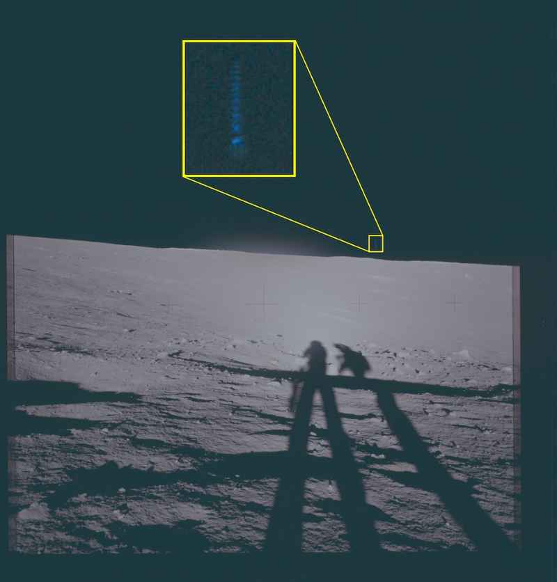 | NASA-UAP-VM1, Apollo 12, 1969 | NASA | 1969 | Moon | IMG | NASA Apollo 12 月面 UAP 影像 | [報告](reports/145-nasa-uap-vm1/report.md) |
| 146 | 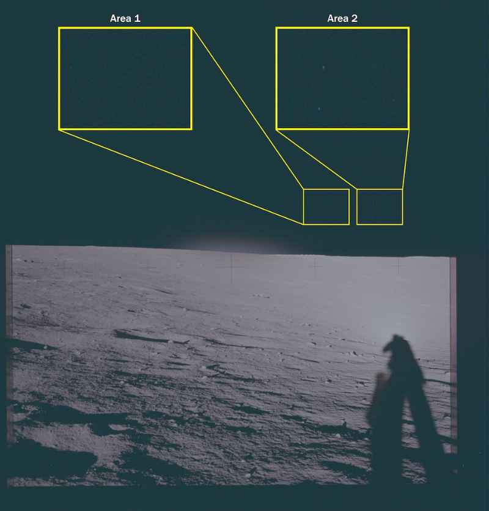 | NASA-UAP-VM2, Apollo 12, 1969 | NASA | 1969 | Moon | IMG | NASA Apollo 12 月面 UAP 影像 | [報告](reports/146-nasa-uap-vm2/report.md) |
| 147 | 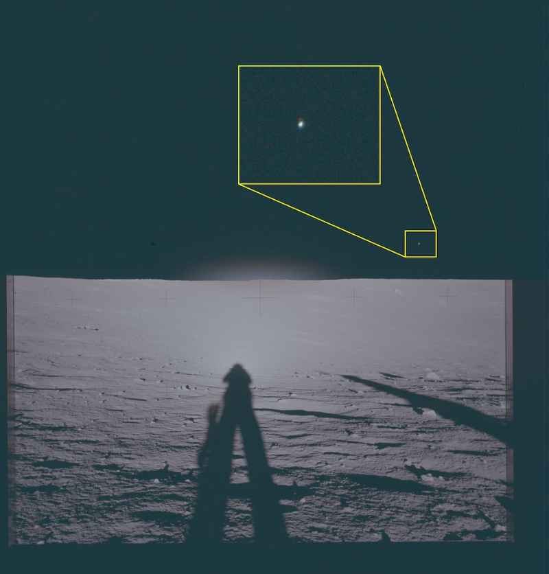 | NASA-UAP-VM3, Apollo 12, 1969 | NASA | 1969 | Moon | IMG | NASA Apollo 12 月面 UAP 影像 | [報告](reports/147-nasa-uap-vm3/report.md) |
| 148 | 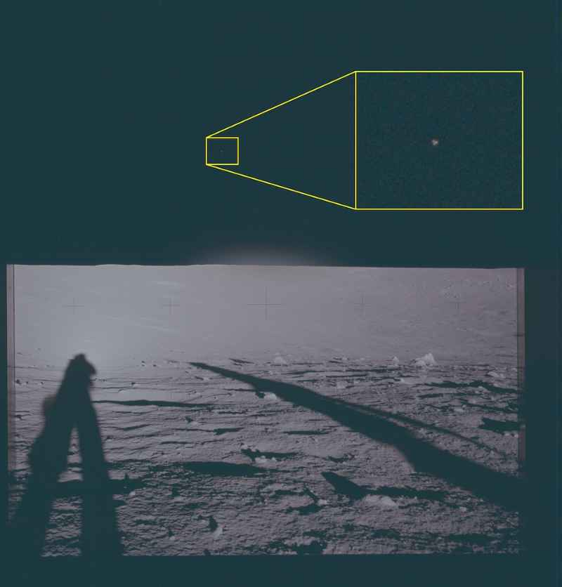 | NASA-UAP-VM4, Apollo 12, 1969 | NASA | 1969 | Moon | IMG | NASA Apollo 12 月面 UAP 影像 | [報告](reports/148-nasa-uap-vm4/report.md) |
| 149 | 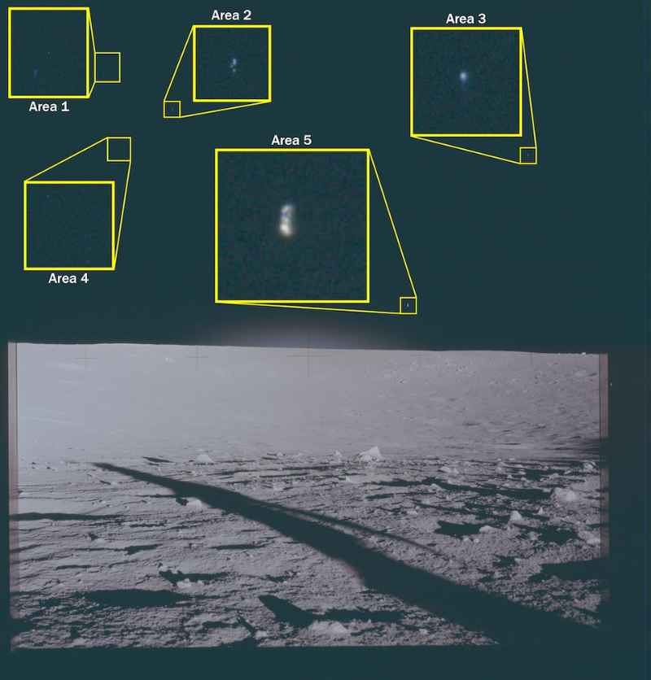 | NASA-UAP-VM5, Apollo 12, 1969 | NASA | 1969 | Moon | IMG | NASA Apollo 12 月面 UAP 影像 | [報告](reports/149-nasa-uap-vm5/report.md) |
| 150 |  | NASA-UAP-VM6, Apollo 17, 1972 | NASA | 1972 | Moon | IMG | NASA Apollo 17 月面 UAP 影像 | [報告](reports/150-nasa-uap-vm6/report.md) |
| 151 |  | State Department UAP Cable 1, Papua New Guinea, January 28, 1985 | Department of State | 1/24/85 | Papua New Guinea | PDF | 國務院 UAP 電報：Papua New Guinea | [報告](reports/151-dos-uap-d1/report.md) |
| 152 |  | State Department UAP Cable 2, Kazakhstan, January 31, 1994 | Department of State | 1/27/94 | Kazakhstan | PDF | 國務院 UAP 電報：Kazakhstan | [報告](reports/152-dos-uap-d2/report.md) |
| 153 |  | State Department UAP Cable 3, Tbilisi, Georgia, October 30, 2001 | Department of State | 10/28/2001-10/29/2001 | Georgia | PDF | 國務院 UAP 電報：Georgia | [報告](reports/153-dos-uap-d3/report.md) |
| 154 |  | State Department UAP Cable 4, Ashgabat, Turkmenistan, November 5, 2004 | Department of State | 11/5/04 | Turkmenistan | PDF | 國務院 UAP 電報：Turkmenistan | [報告](reports/154-dos-uap-d4/report.md) |
| 155 |  | State Department UAP Cable 5, Mexico, September 16, 2003 | Department of State | 9/12/03 | Mexico | PDF | 國務院 UAP 電報：Mexico | [報告](reports/155-dos-uap-d5/report.md) |
| 156 |  | USPER Statement about UAP Sighting | FBI | Late 2025 | United States | PDF | USPER（美國公民）UAP 目擊聲明 | [報告](reports/156-usper-statement/report.md) |
| 157 |  | FBI September 2023 Sighting - Composite Sketch | FBI | 9/1/23 | United States | PDF | FBI 2023 目擊事件素描 | [報告](reports/157-fbi-2023-composite-sketch/report.md) |
| 158 |  | FBI September 2023 Sighting - Serial 3 | FBI | 9/1/23 | United States | PDF | FBI 2023 目擊事件 Serial 3 | [報告](reports/158-fbi-2023-serial-3/report.md) |
| 159 |  | FBI September 2023 Sighting - Serial 4 | FBI | 9/1/23 | United States | PDF | FBI 2023 目擊事件 Serial 4 | [報告](reports/159-fbi-2023-serial-4/report.md) |
| 160 |  | FBI September 2023 Sighting - Serial 5 | FBI | 9/1/23 | United States | PDF | FBI 2023 目擊事件 Serial 5 | [報告](reports/160-fbi-2023-serial-5/report.md) |
| 161 |  | Western US Event | Department of War | 2023 | Western United States | PDF | DoW 西部美國事件 PURSUE 簡報 | [報告](reports/161-western-us-event/report.md) |
