# FBI 62-HQ-83894 案卷 #004 ─ Section 4：被空軍拉回戰場、1948 飛碟潮、Project SIGN 土壤樣本

| 欄位 | 內容 |
|---|---|
| 案卷編號 | `65_HS1-834228961_62-HQ-83894_Section_4` |
| 期間 | 1947-09-11 → 1949-06-30 |
| 頁數 | 214 頁 |
| 主軸 | FBI 在 1947-10-01 宣布退出 UFO 調查後 4 個月被空軍拉回現場、Chiles-Whitted DC-3 案、Wham-O 飛碟玩具誕生、Project SIGN 土壤樣本、Noack 8mm 影片、Oak Ridge Gasser 上校的「俄國飛彈」說、SIGN 改名 GRUDGE、Bristol 雪茄潮 |
| 官方 portal | <https://www.war.gov/UFO/#65_HS1-834228961_62-HQ-83894_Section_4> |

## 開場：退出令撐了 4 個月

[#003 Section 3](../003-65_hs1-834228961_62-hq-83894_section_3/report.md) 結尾，FBI 在 1947-10-01 發出 Bureau Bulletin #57，1947 系列，正式宣布退出 UFO 調查。所有新進線報轉給空軍。Hoover 簽字，全案落幕。

這份 Section 4 從那道命令之後開始，第一份歸檔文件是 1947-10-09 SAC Portland 寫給 Director 的 follow-up 備忘錄（p-002）。處理 9 月 11 日波特蘭警局接報的城市上空目擊事件。Portland 警車 District 18 的 Adair 和 Caldwell 兩位巡警上報了五分鐘內的視覺追蹤，包含 Chief of Police Jenkins 親自從巡邏車回報目擊的紀錄。Hoover 退出令發出後 8 天，案件還是流到 Director 辦公桌。

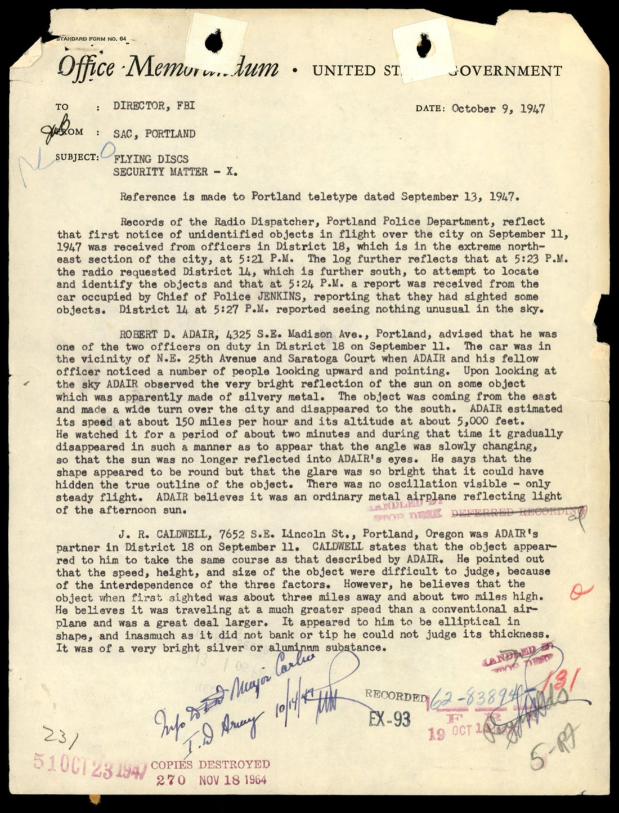

退出令真正的考驗在 1948-02-12 來臨。SAC San Francisco 寫信給 Director（p-035），轉送了一份 1948-02-04 由空軍 Air Defense Command（位於紐約 Mitchel AFB）發出的機密信，由 Lt. General STRATEMEYER 簽署，發給第一、第二、第四、第十、第十一、第十四航空軍司令官，內容是要求空軍人員調查 flying disc 時要與當地 FBI 辦事處協調：

> Investigations will be coordinated with the FBI Office concerned.
>
> 調查將與相關 FBI 辦事處協調。

問題很明顯，這跟 Bureau Bulletin #57「FBI 不再調查」直接衝突。SAC San Francisco 在信末寫：

> Inasmuch as there recent instructions of the Headquarters, Air Defense Command, Mitchel Air Force Base, New York, are contrary to the instructions contained in Bureau Bulletin #57, Series 1947, dated October 1, 1947, in which it was stated that the Bureau had discontinued its investigative activities...
>
> 鑑於 Air Defense Command（紐約 Mitchel 空軍基地）總部最近的指令，與 1947 系列第 57 號 Bureau Bulletin（日期 1947-10-01）所載指令相牴觸，後者明示本局已停止其調查活動……

這封信實際上是 SAC 把問題踢回 Hoover 桌上。空軍把 FBI 寫進自己的 SOP，要 FBI 怎麼配合？退出令只撐了 4 個月。

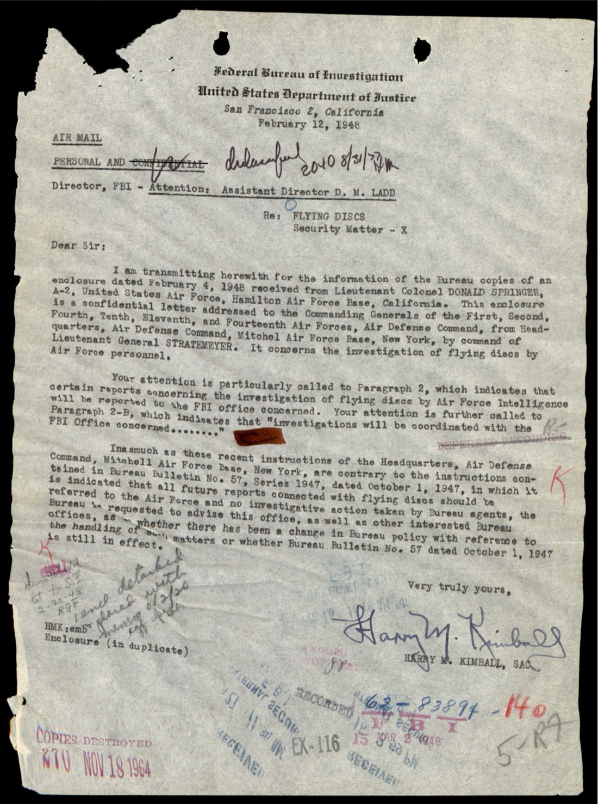

## §1 退役士兵寫信給參議員

1948-03-15 下午 2:30，Nebraska 州 Benkelman 鎮的 Kenneth Praster 看到高速、高空、有蒸氣尾跡的物體在空中，回家後他選擇寫信給 US Senator Kenneth Wherry（p-046）。Praster 不是飛碟愛好者，信開頭就寫明：

> I am not writing this so that it might seem to be another disc, fan or whatever you might call them. I just saw this and it has been on my mind...
>
> 我寫這封信不是想再湊一個飛碟、飛盤或你們怎麼稱呼的目擊報告。我只是看到了，這事一直在我腦中盤旋……

Praster 描述：聲音像 10 到 12 英里外的火車轟隆聲，物體像「流線型火車」高速移動，遠遠在地平線之上就消失。他附了一句 P.S.：「物體由東向西移動。看起來可能飛越了 Denver。」

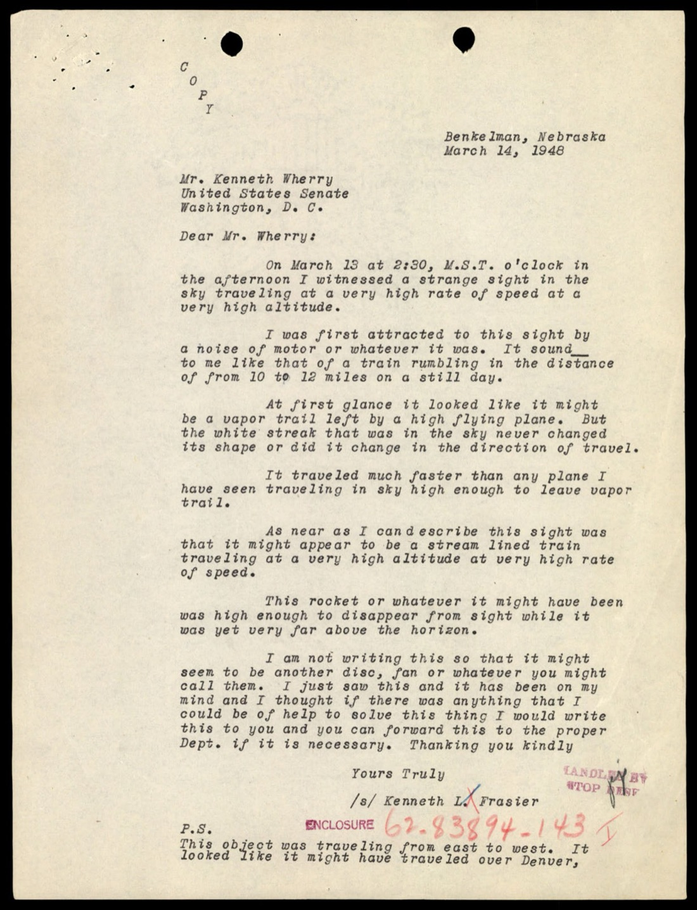

Senator Wherry 把信轉給 Hoover。Hoover 把信歸入 65-58300 案卷，不採取任何調查行動。但歸檔的動作本身證明：FBI 早就回到 UFO 案件流上。這只是還沒對外公開承認。

## §2 1948-07-24 凌晨：Chiles-Whitted DC-3 案

1948-07-24 凌晨 2:45，Eastern Air Lines 由 Houston 飛 Boston 的 DC-3 班機，飛過 Alabama 州 Montgomery 上空，機長 Clarence S. Chiles（Atlanta）和副機長 John B. Whitted（Hapeville）看到一艘 100 英尺長、雪茄狀、無翼的飛行物，從右舷快速逼近，差點對撞。Chiles 急轉左滾避開，物體從機翼右側通過，速度估計 700 mph。物體有「兩排明亮窗戶」和「25 到 50 英尺長的火尾」。

Atlanta Journal 1948-07-25 週日版頭版報導（p-179）：

> A gigantic plane without wings, black against the night sky, streaking through the heavens at 5,000 feet altitude with a fiery comet's tail 25 to 50 feet in length. It had a 100-foot fuselage about four times the circumference of a B-29's, and two rows of brilliantly lighted square windows.
>
> 一架巨大的無翼飛機，在夜空中呈黑色剪影，以 5,000 英尺高度橫掃天空，後拖 25 到 50 英尺長的火彗尾。機身 100 英尺長，圓周約 B-29 的四倍，有兩排明亮的方形窗戶。

> Strangest of all it was a veritable Flying Dutchman of the skies. Not a living soul was seen aboard!
>
> 最詭異的是它根本是天上的飛行荷蘭人號。船上不見半個活人！

機身比 B-29 還粗四倍，後拖火彗尾，兩排亮窗，沒看到任何乘客。這幅描述後來成為 1948 年最有名的飛行員目擊案，Project SIGN 把這案子列為「最不容置疑」之一。

Atlanta Journal 同版搭配另一則旁稿〈Plane Makers Dubious About Alabama 'Thing'〉（飛機製造商懷疑 Alabama 那玩意），由 William Key 撰稿。波音、Lockheed、Douglas 都否認手上有任何 100 英尺長、無翼、會發光的原型機。Army Strategic Air Command 公開表示「我們也想知道」（Air Chief Wishes He Had One）。

## §3 飛碟變成商品：Fred Morrison 與 Wham-O 起源

1948 年夏天，加州 San Gabriel 出現一個畫面：退役陸軍中尉 Fred Morrison 和合夥人 Warren Franscioni 在 Daytona Beach 賣金屬飛盤。FBI 把這件商業活動的雜誌剪報也歸進案卷。

Pacific Plastics 1948 年 8 月號刊登〈Flying Saucers Come from Southern California〉（p-178）：

> Freddie grew up into a man called Fred Morrison, who always remembered what fun he had had playing with the pie tins. As a grown-up, he applied his knowledge of aerodynamics to the problem of developing a disc which could be thrown and tossed and its flight controlled by the thrower.
>
> 小 Freddie 長大後變成 Fred Morrison，他始終記得拿媽媽派盤丟著玩的樂趣。長大後，他把空氣動力學的知識用在開發一個能丟、能拋、軌跡可由投擲者控制的圓盤上。

> A lightweight, slightly flexible plastics looked like the answer, and Morrison brought his metal model to Southern California Plastic Co., Glendale, Calif... Cellulose acetate provided the best combination of properties to do the job. Acetate discs will not break glass windows, nor shatter when falling from a great height, nor scar the finish on automobiles, nor injure the players.
>
> 輕量、稍具彈性的塑膠看來是答案。Morrison 把金屬樣品送到加州 Glendale 的 Southern California Plastic 公司……乙酸纖維素提供了最佳組合。乙酸纖維素圓盤不會打破玻璃窗、不會從高空摔碎、不會刮傷汽車車漆，也不會弄傷玩家。

最早的金屬版會打破窗戶，所以才改用乙酸纖維素塑膠。1948 年的設計：直徑 9 英寸、深 2 英寸、輻射弧形鰭片、外緣加重環。基本原理：旋轉產生陀螺穩定、輻射鰭片在表面形成負壓、外緣重量提供穩定。

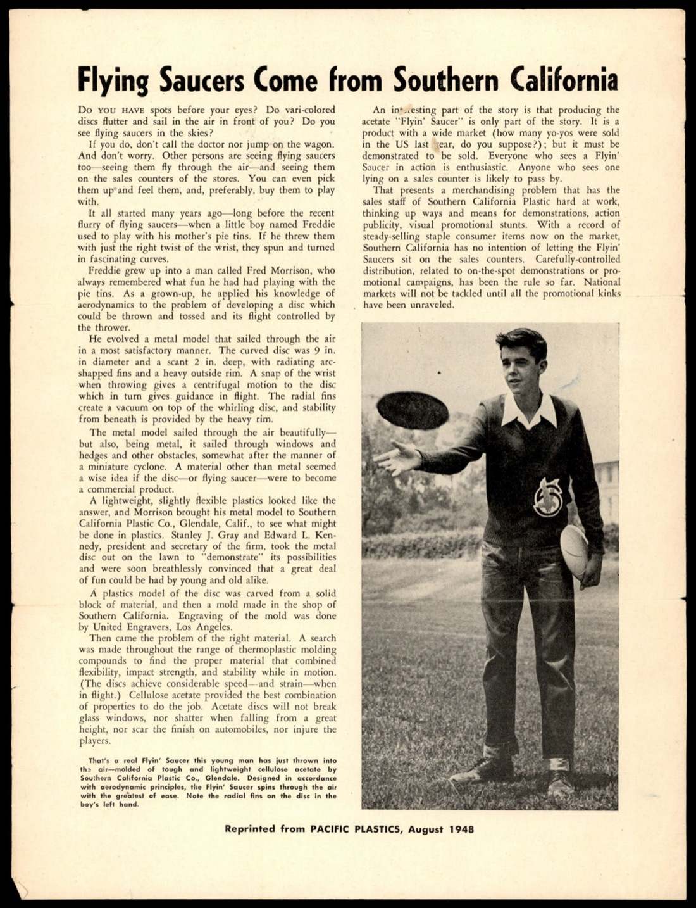

另一份剪報（p-186）由〈Ex-Army Air Force Fliers Invent Novel, New Game〉為題，記錄 Morrison 和合夥人在 Daytona Beach 把產品打進主流市場：

> Inadvertent collaborators with the public, the boys took advantage of the flying saucer fever sweeping the country to dub their product the Flyin' Saucer.
>
> 兩人意外搭上全國飛碟熱潮的順風車，把產品取名為 Flyin' Saucer。

> The football coach at Hemet, Calif. High School was intrigued with the idea of using the saucers in scrimmage and to teach receivers... It may be just coincidence, Franscioni and Morrison said today, but Hemet's coach last season pummeled out his first championship season.
>
> Hemet 高中橄欖球教練被這個想法吸引：用飛碟做衝刺練習、訓練接球手……Franscioni 與 Morrison 今天說，這可能只是巧合，但 Hemet 教練去年球季打出了他第一個冠軍球季。

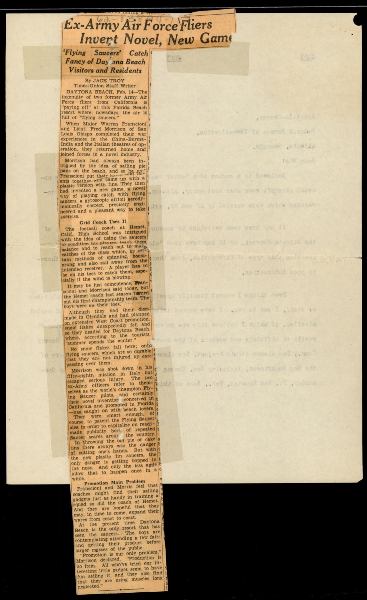

連產品說明書都進到 FBI 檔案。p-177 是 Wham-O 原始 Flyin' Saucer 包裝裡的飛行說明書（Flight Instructions）：

> FLYIN' SAUCERS have flight characteristics very similar to airplanes. The SAUCER is launched in identically the same manner as sailing your hat onto a hook—by spinning and forward motion.
>
> 飛碟的飛行特性和飛機很像。發射方式就跟你把帽子甩上掛鉤一樣，靠旋轉加前向動能。

> Because the spin creates a gyroscopic action which controls the attitude of the SAUCER in flight, a smooth, fast spinning delivery should be developed.
>
> 由於旋轉產生陀螺效應，控制飛碟在空中的姿態，必須練出順暢、快速的旋轉投擲。

說明書還附了一個叫 HECKLE 的雙人遊戲：FLIER 在直徑 6 英尺的圈內，必須把飛碟丟過兩個 HECKLER 的圈子，給對面 FLIER 接到。HECKLER 可以干擾、可以打掉飛碟，但不能離開自己的圈子。

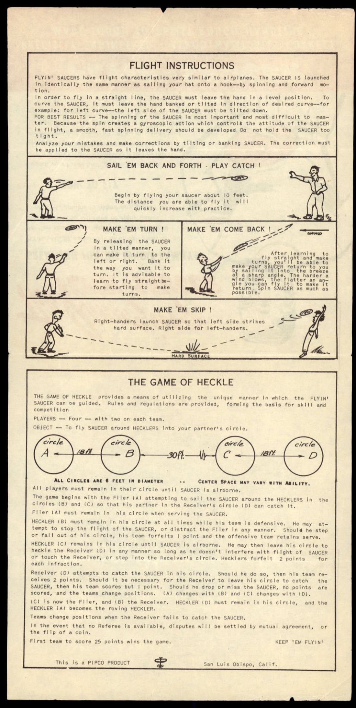

為什麼 FBI 連這份玩具說明書都歸檔？1948 年的 FBI 假設是：如果美國民眾把任何空中物體都當成「飛碟」，那就需要把所有相關文化材料都建立起來，包括這個讓全國學會「丟飛碟」的玩具產品本身。退出令說的是「不調查」，但「歸檔證據」沒人說不行。

## §4 Project SIGN：FBI Lab 收到飛碟降落點的土壤

1948-09-09，Wright-Patterson 空軍基地 Air Materiel Command 直接寫信給 J. Edgar Hoover（p-056），不再透過退出令繞圈子，附寄品：**一份土壤樣本**。

> Accompanying this letter is a small sample of soil. This soil was taken from a depression reputed to have been caused by a "flying saucer" described as being approximately two feet in diameter and one foot thick which supposedly settled gently to the ground, rebounded to a height of about twenty feet and then continued on its journey.
>
> 隨信附上一小份土壤樣本。土壤取自一個傳聞由「飛碟」造成的凹陷處，飛碟直徑約 2 英尺、厚 1 英尺，據稱緩緩落地、彈起約 20 英尺、然後繼續飛行。

> Although the declivity was immediately covered by a large washtub a heavy rain subsequently filled the depression about one-third full of water before any sample of dirt could be taken.
>
> 凹陷處立即用一個大澡盆蓋住，但採樣前下了一場大雨，凹陷處積了約三分之一深的水。

> It is the desire of this Headquarters to ascertain, in particular, if there are traces of unusual elements or alloys adhering to the surface of the particles, or if any irregularity in structure exists showing that the soil was subjected to intense heat, gases or radioactive substances, etc.
>
> 本部希望特別查明：顆粒表面是否附著有異常元素或合金；土壤結構是否有異常顯示曾受高溫、氣體或放射性物質作用。

請 FBI Lab 找的是：異常元素、合金殘跡、高溫痕跡、放射性物質。空軍假設這個直徑 2 英尺的小飛碟可能用某種異常推進系統。

文件最後一段尤其有意思：

> Unfortunately, in this regard, no one thought to forward a sample of soil surrounding the depression so no comparison of soils can be made at this time.
>
> 不幸的是，在這一點上，沒人想到附寄凹陷處周圍的土壤樣本，所以目前無法做對照分析。

連對照樣本都沒準備好。空軍把現場處理得這麼粗糙，可是依然要 FBI Lab 做出科學鑑定。1948 年的 UFO 現場處理 SOP，光從這封信就可以看出來：用澡盆蓋住、淋過大雨、不收對照組、寄給 FBI。整個鏈條漏洞百出。

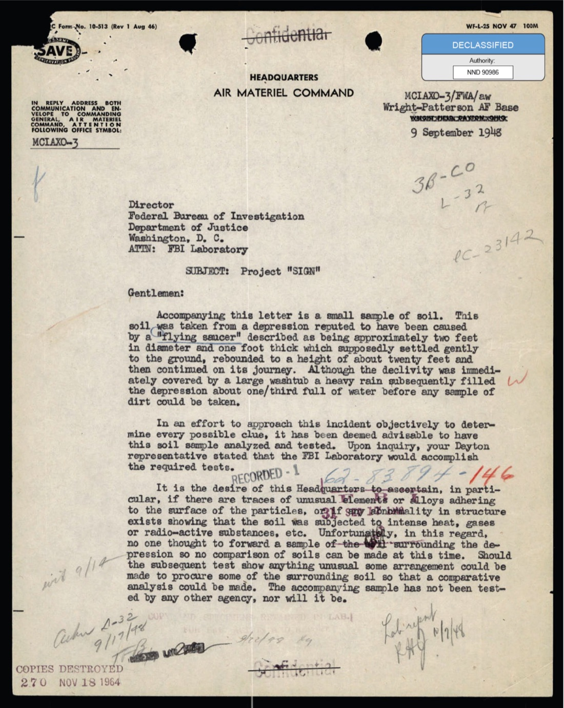

附帶說明，這份土壤樣本後續分析結果沒有出現在 Section 4 中，FBI Lab 的最終報告應該在後續 Section。但 1948-09-09 這封信的存在，已經足以推翻「FBI 在 1947-10 退出 UFO 調查」這個官方說法。

## §5 1948-12-27 Noack 8mm 影片：UFO 最早的影片證據之一

1948-12-27 下午，Houston 律師 Fuller Blackwell 致電 FBI Houston 辦事處（p-089），轉達他朋友 Loney Noack 的事情。Noack 是 Humble Oil and Refining Company 的機械工，據說在內華達 Las Vegas 附近沙漠看到一個約 8 英尺直徑、有尾翼、像噴射推進的飛行物體，並用 8mm 攝影機拍下了影片。

> Mr. BLACKWELL, in calling, advised that the disc, or object, was approximately eight feet in diameter, had a tail and wings, and apparently was equipped for jet propulsion. He stated NOACK had observed this object at a desert location near Las Vegas, Nevada; further, that Mr. NOACK had taken some movie film of the disc and that this film was currently in his possession.
>
> Blackwell 來電告知，該圓盤或物體直徑約 8 英尺，有尾翼，似乎配有噴射推進。他說 Noack 在內華達 Las Vegas 附近沙漠看到該物，且 Noack 拍下了該圓盤的影片，影片目前在他手上。

FBI Houston 立刻通知了 Ellington Field 的 OSI 特別探員 Robert B. Fleming，以及 MID 代表 Captain Harold Bush。當天下午 5 點，Noack 帶著影片到 FBI Houston 辦事處放映：

> Mr. NOACK in making his initial appearance at the office surrendered his movie film which consisted of one 50 foot roll of 8mm movie film. Approximately fifteen feet of this roll relates exclusively to the pictures of the flying disc.
>
> Noack 第一次到辦事處時繳交了影片，是一卷 50 英尺長的 8mm 電影膠卷。其中約 15 英尺完全是該飛碟的畫面。

50 英尺 8mm 膠卷裡 15 英尺拍 UFO。以 8mm 標準 24 fps 計算，15 英尺約 60 秒長。1948 年底，FBI 手上有一段 1 分鐘長的疑似 UFO 影片。

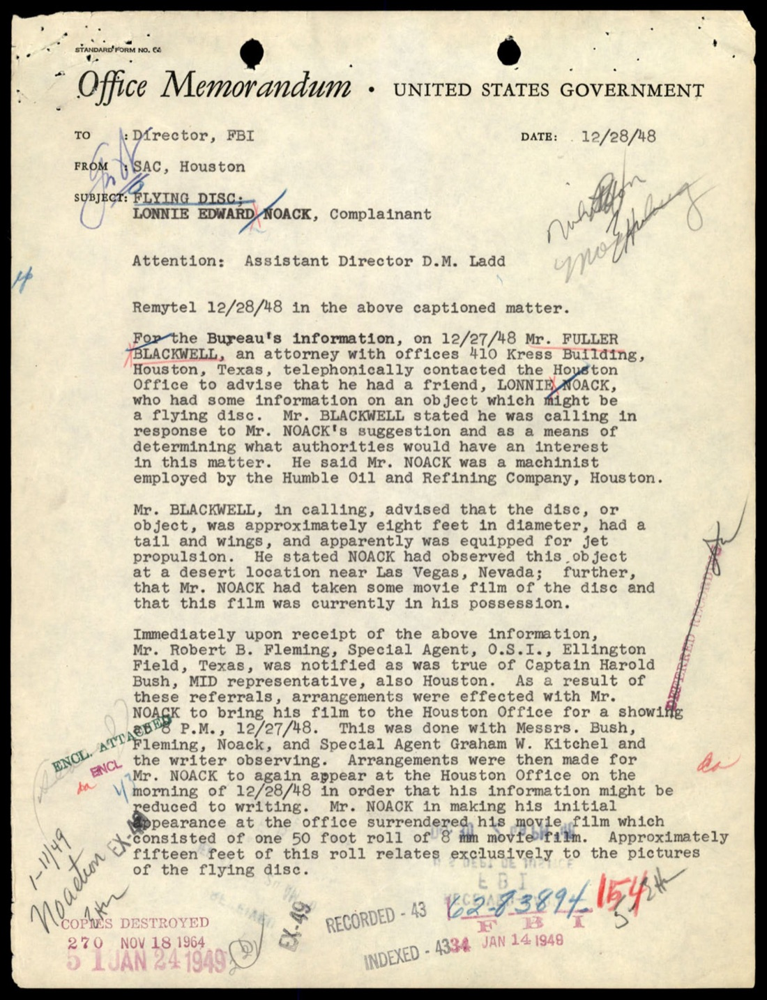

這份影片的命運在 Section 4 沒有明說，但已知 Noack 案後來被 Air Force OSI 收編、影片帶去 Ellington Field 分析。Project SIGN 卷宗有零星紀錄。1948 年 12 月底這個時間點，意味著：在 Trent Photographs（McMinnville, 1950-05）和 Tremonton Film（Utah, 1952）之前，FBI 已經看過真正的 UFO 影片證據。

## §6 1949-02-16 Los Alamos：Green Fireball 會議

1949-02-16，Los Alamos 召開了一場機密會議，主題是「Green Fireball Phenomena（綠色火球現象）」。SAC San Antonio 在 1949-03-22 寫給 Director 的備忘錄（p-120）裡，記下了會議裡描述的典型事件：

> Description was given as in the "Sandia incident":
> - There was an initial bright light (no period of intensity increase) and constant intensity during the duration of the phenomenon.
> - Yellow green color about 5200 Angstroms.
> - Essentially horizontal path.
> - Trajectory traversed at constant angular velocity.
> - Duration about two seconds.
> - No accompanying noise.
>
> 描述採自「Sandia 事件」：
> - 起始為一道明亮光（無強度逐漸增加期），現象持續時間內強度恆定。
> - 黃綠色，波長約 5200 埃。
> - 軌跡基本水平。
> - 以恆定角速度橫越天空。
> - 持續時間約 2 秒。
> - 無伴隨聲響。

5200 埃落在綠色光譜帶，恆定強度（沒有逐漸點亮的過程）、水平軌跡、恆定角速度、無聲。這些參數讓 Los Alamos 的科學家排除了流星假說：流星會先亮後暗、彈道是拋物線、會有衝擊波音。

會議結論很妙：

> It was brought out that this question has been classified "secret" and that investigation is now the primary responsibility of the U.S. Air Force, Air Materiel Command, T-2.
>
> 會議指出，此問題已列為「機密」，調查現主要由美國空軍 Air Materiel Command 的 T-2 部門負責。

Green Fireball 從 1946-12-05 開始在 New Mexico 出現，並且大量集中在 Sandia 國家實驗室、Los Alamos、Kirtland 空軍基地周邊核設施。1949 年初空軍指定 Dr. Lincoln La Paz（New Mexico 大學流星專家）秘密調查。

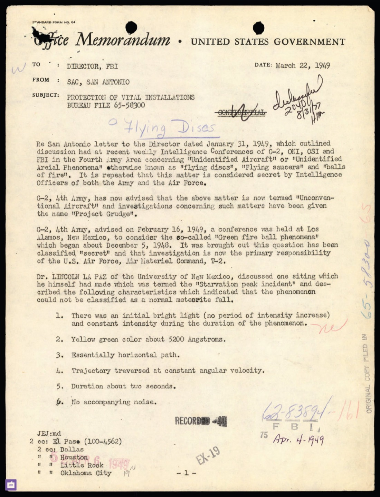

## §7 Oak Ridge Gasser 上校的「俄國飛彈」說

1948-09 到 10 之間，FBI 一位 Knoxville 特別探員專門訪問了 Tennessee 州 Oak Ridge 的 Colonel C. D. Gasser，職稱「Air Materiel Command 飛機核能推進研究駐地工程師」（Resident Engineer, Air Materiel Command, Nuclear Energy for the Propulsion of Aircraft Research, Oak Ridge, Tennessee）。Gasser 上校給的是個人理論，但他講得非常具體（p-086 到 p-088）：

第一個假設：飛碟是俄製：

> First, he pointed out that knowledge of such a possible aircraft is not by any means new, it having been known as early as four years ago that some type of flying disc was being experimented with by the Russians.
>
> 首先，他指出這類飛行器的存在並非新發現，早在 4 年前就已知俄國人在試驗某種飛碟。

四年前是 1944 年。Gasser 暗示 FBI 美國情報界早在二戰末期就知道蘇聯在搞圓盤型飛行器。

第二個假設：CIA 證據鏈：

> More recent reports have been received from representatives of the Central Intelligence Agency in Southern Europe and Southern Asia to the effect that the Russians were experimenting with some type of radical aircraft or guided missile which could be dispatched for great distances out over the sea, made to turn in flight and return to the base from which it was launched.
>
> 最近 CIA 駐南歐和南亞代表的回報顯示，俄國人正試驗某種激進飛行器或導彈，可遠距派遣越洋飛行、空中迴轉，並返回發射基地。

可以返航的飛彈。Gasser 強調：「這件事極為值得關注，因為美國目前的飛彈試驗只發展到準確命中目標，沒有考慮要讓飛彈具備返回能力。」

第三個假設：來自北方：

> They usually approach the United States from a northerly direction and have been reported as returning in a northerly direction. None have ever been known to crash, collide or disintegrate over American soil, but it would appear that they come to the United States, cruise around, and go back over the North Pole.
>
> 它們通常從北方接近美國，並從北方返回。從未有任何一架在美國國土上墜毀、碰撞或解體，似乎都是飛來美國、繞一圈、然後越過北極回去。

第四個假設：捷克碰撞事件：

> One report has been received concerning a collision of these missiles with another type of aircraft... this report emanated from Czechoslovakia. This report was that a Czechoslovakian transport had collided with some unidentified missile while in mid-air over the ocean, and that said missile and said transport had been completely disintegrated without recovery of parts or survivors from either.
>
> 收到過一份報告，提到此類飛彈曾與另一型飛機相撞……該報告來自捷克斯洛伐克。內容是捷克斯洛伐克的一架運輸機在海面上空與一個不明飛彈相撞，飛彈與運輸機均完全解體，雙方均無殘骸或生還者。

第五個假設：核子推進：

> There is only one possible fuel which could be utilized which is in accord with present theory, and that is the utilization of atomic energy. As further evidence of this possible means of propulsion, Colonel GASSER called attention to the vapor trail and gaseous corona described as a ball of fire, which he states might give some evidence to the fact that a radio-active field is present.
>
> 唯一可能、且符合當前理論的燃料是原子能。為進一步佐證這種可能推進方式，Gasser 上校特別指出，所謂火球的氣態暈光與蒸氣尾跡可能顯示有放射性場存在。

Gasser 是 Oak Ridge 飛機核能推進計劃的駐地工程師，職位讓他這個推論帶上特定份量。他的職務就是研究「怎麼用原子能推進飛機」，看到飛碟的描述後，他第一反應是把它套到自己的研究領域。

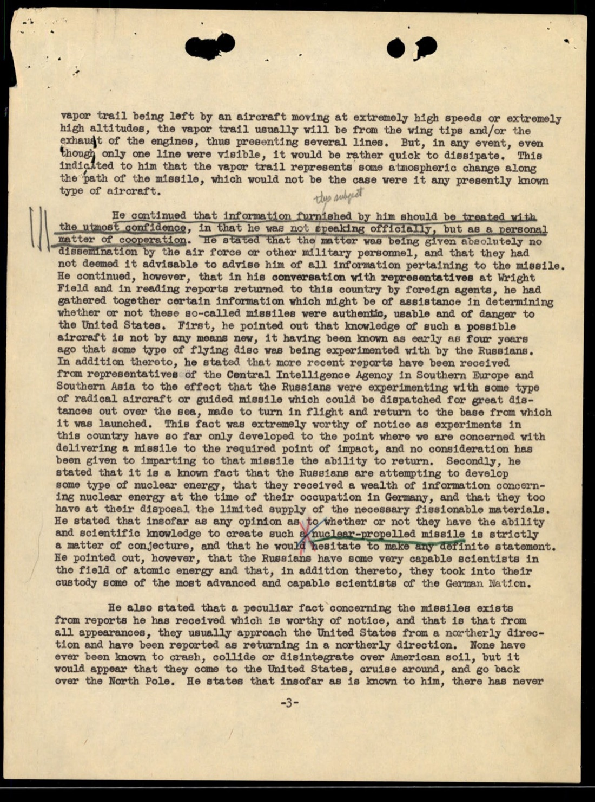

## §8 1949-03-14：Hoover 內部翻盤

Gasser 的訪談直接觸發了 Hoover 系統的政策翻盤。1949-03-14，FBI 副處長 Fletcher 寫備忘錄給 Assistant Director D. M. Ladd（p-118），請求 Executive Conference 批准重啟對 UFO 的資訊蒐集：

> You will recall that by Bureau Bulletin #57, Series 1947, dated October 1, 1947, the field was advised that effective as of that date the Bureau had discontinued its investigative activities in connection with flying discs.
>
> 你應該記得，1947 系列第 57 號 Bureau Bulletin（日期 1947-10-01）已通知各地辦事處，自該日起本局停止對飛碟的調查活動。

提醒這一點，等於是為下一句鋪墊：

> Colonel C. D. Gasser, Resident Engineer, Air Materiel Command, Nuclear Energy for the Propulsion of Aircraft Research, Oak Ridge, Tennessee, has recently and confidentially advised the Bureau that flying discs are believed by the Air Force to be man-made missiles rather than some natural phenomenon and that as much as four years ago it was learned that some type of flying discs were being experimented upon by the Russians.
>
> Oak Ridge Air Materiel Command 飛機核能推進研究駐地工程師 C. D. Gasser 上校近期機密告知本局，空軍認為飛碟是人造飛彈而非自然現象，且早在 4 年前就已得知俄國人在試驗某型飛碟。

備忘錄的結論：

> Although no active investigation will be conducted by the Bureau, it is believed that the captioned matter is of sufficient importance to the internal security of the country that our field offices should secure as much information as possible from complainants in order to assist the Department of the Air Force.
>
> 雖然本局不會進行主動調查，但鑑於此事對國家內部安全具有充分重要性，各地辦事處應從通報人處盡可能取得資訊，協助空軍部。

文字技巧很明顯。「不進行主動調查」「但要從通報人處盡可能取得資訊」。實質上的調查、語言上的退出。Bureau Bulletin #57 沒有撤回，但實務上已經被 March 14 1949 這份備忘錄重新覆蓋。

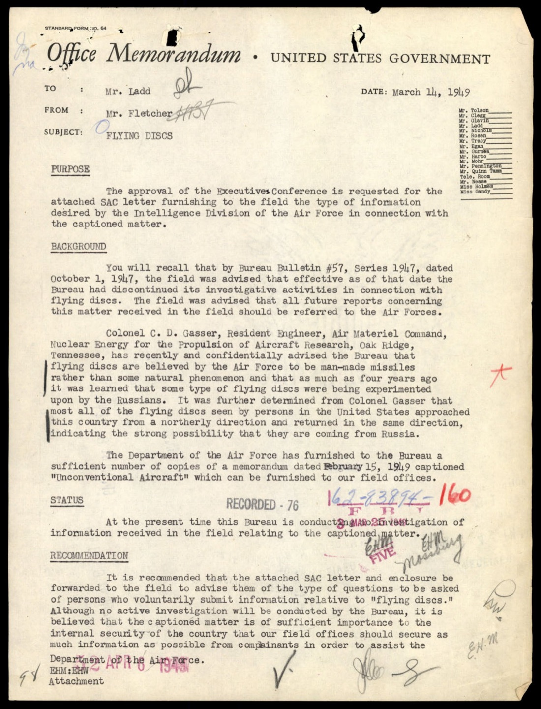

## §9 1949-03-22：Project SIGN → Project GRUDGE

1949-03-22，SAC San Antonio 寫給 Director 的備忘錄（p-120）裡，記錄了空軍計畫的代號改名：

> G-2, 4th Army, has now advised that the above matter is now termed "Unconventional Aircraft" and investigations concerning such matters have been given the name "Project Grudge."
>
> 第四陸軍 G-2 已告知，上述事項現在改稱「非常規飛行器」，相關調查代號為「Project Grudge」。

Project SIGN 於 1947-09 成立，於 1949-02 結束。SIGN 的內部估計報告（"Estimate of the Situation"）原本傾向「飛碟是星際來客」結論，但被空軍參謀長 Hoyt Vandenberg 退回，要求撤銷該結論。SIGN 撤銷後改組為 GRUDGE，新方向是「儘量找已知物體解釋」。1949-03-22 SAC San Antonio 的這份備忘錄，是少數從 FBI 端記錄到 GRUDGE 改名時間點的文件。

備忘錄裡同時提到：

> This matter is considered secret by Intelligence Officers of both the Army and the Air Force.
>
> 此事被陸軍和空軍情報官員視為機密。

陸軍 G-2、海軍 ONI、空軍 OSI、FBI 在「第四陸軍情報會議」中協調，把「Unidentified Aircraft」和 "Unidentified Aerial Phenomena" 統一改稱「Unconventional Aircraft」。1949 年的官方語言已經從「flying disc」轉成「unconventional aircraft」，從通俗用語轉到軍方分類用語。

## §10 1949-04-04 Parrott Merced CA：聲學先導的目擊

1949-04-04 晚上 10:20，加州 Merced 鎮的 William H. Parrott 從家門口走出來。Parrott 是 Air Corps 後備軍人，住家西邊距離鎮中心約 1 英里、距離 Castle Air Force Base 約 7 英里。他寫的目擊紀錄（p-157）描述了一次「聲音先到、視覺後到」的案件：

> My attention was diverted to a clicking noise of considerable intensity. I stopped on the sidewalk about 20 feet from the front steps and recognized the source of this clicking to be in the sky in an area about 40 degrees from the surface of the earth in an easterly direction.
>
> 我的注意力被一陣相當大聲的「咔嗒」聲吸引。我停在離前階約 20 英尺的人行道上，認出咔嗒聲來自天空東方，仰角約 40 度。

> After about ten seconds of looking into the area described previously as being the source of this sound, an object was observed blanking out stars in describing a flight path in a west or northwesterly direction.
>
> 看著聲源處約 10 秒之後，我看到一個物體沿西方或西北方向飛行，把它經過的星星都遮住了。

> Only one object was apparent, its shape can be described as only a solid mass. Its size can be estimated as four or five feet in diameter in keeping with an estimated altitude of considerably less than 1000 (one thousand) feet.
>
> 只見一個物體，形狀只能形容為實心質量。直徑估計 4 到 5 英尺，與估計高度（明顯低於 1,000 英尺）相當。

Parrott 是 Air Corps 後備軍人這個身分讓案子升級。他先向 Castle 空軍基地情報官員 Lt. Col. Stanley F. Jacobs 報告，Jacobs 寫了一封信給 Wright-Patterson AFB 的 Air Materiel Command 司令，內容附在 Parrott 的書面陳述後面。同時，OSI 駐 Castle AFB 的 Detachment Commander George Bremer 也得知此事。Bremer 對 SA Marlin W. Johnson 抱怨：基地情報官員沒把資訊轉給他。

OSI 和 USAF Intelligence 之間的內鬥剛好被 FBI 的訪談紀錄抓到一個側面。Parrott 案開了三條平行報告線：空軍情報、OSI、FBI。

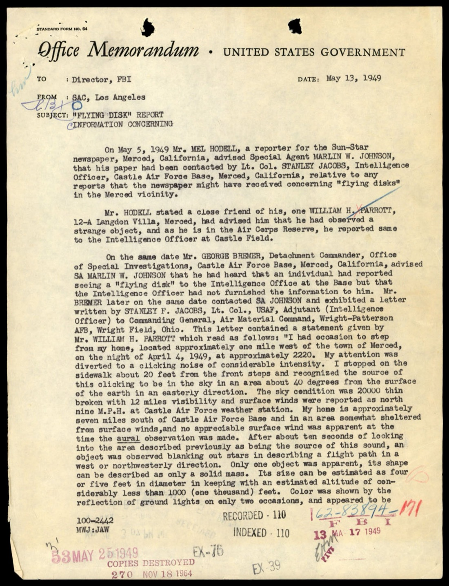

## §11 1949-04 Virginia/Tennessee：Bristol「飛雪茄」潮

1949-04 月底，Virginia 西南部和 Tennessee 東部出現一波雪茄狀飛行物目擊潮。FBI 把 Bristol Herald Courier 和 Radford 當地報紙的報導全部收進案卷（p-191, p-192, p-193）。

Bristol Herald Courier 標題用了一句帶幽默的對比（p-193）：

> Remember Flying Saucers? Well Looks Like Flying Seegars Now
>
> 還記得飛碟嗎？現在看來變成飛雪茄了

報導裡列出當天五個地點的目擊：Roanoke、Lynchburg 和 Roanoke、Kingsport、Blacksburg、Pulaski 三件。同一晚同一地理區域內五個地點都有目擊。Bristol Herald Courier 引用：

> The unidentified caller said that she had sighted something that "looked like white smoke with a blue flue that traveled to the north and east"... "it didn't look like an airplane," she said, "only like white smoke. It was just a streak and disappeared so fast out of sight it was so high."
>
> 一位匿名女性來電說她看到一個東西「像帶藍色管子的白煙，朝北方和東方移動」……她說「看起來不像飛機，只像一道白煙。就是一道條紋，因為太高了所以很快消失。」

Tri-Cities 機場交通管制員（要求匿名）說，他打給 Atlanta Air Route 交通管制中心查詢，回報附近沒有噴射機通過。他推測：「如果是噴射機在 30,000 英尺高度飛行，飛得這麼快，地面只能看到蒸氣尾跡。」

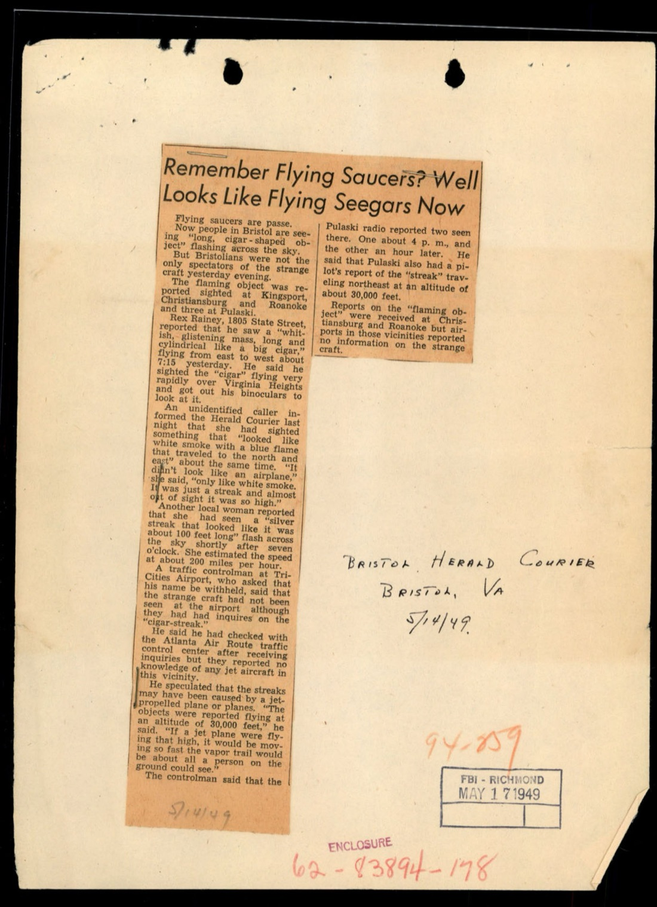

第二份報導〈These Flying Discs Are at It Again, Virginians Report〉（p-191）以 4 月底「飛雪茄潮」為主題，引用 Roanoke 居民 J. S. Mays 和 W. P. Mullins 的話：

> "It looked like a streak of fire," said Mays, "and appeared to be going almost straight up and was stepping on it."
>
> Mays 說「看起來像一道火條紋，幾乎是直直往上飛、而且飛得很急。」

> Suddenly, he said, it appeared to level off and head eastward, resembling "a snake wiggling on water."
>
> 他說那物體突然似乎水平地往東飛去，「像一條在水面上扭動的蛇」。

第三份是 Radford News Journal 由 Wells Caldwell 撰稿的更詳細地方版報導（p-192）。詳細整理了當地多位目擊者的描述：

- 一位匿名 Radford 男子：「我在院子裡工作時抬頭一看，看到一個長長的黑色物體飛過天空。它從 Pulaski 方向飛來，很像一根前端著火、燃燒中的圓木棒。物體後拖蒸氣或煙，當它看似在頭頂正上方時就消失了。」
- Mrs. Alfred Tolley（西七街 1102 號）：她 12 歲的兒子 Albert 在隔壁玩，看到後叫她注意。兒子最近在學校學過彗星，所以以為是彗星或流星。Tolley 太太說：「那個怪東西長長黑黑，前端有一道光。沿著 Pulaski 飛來的飛航路徑飛，後來轉向 Blacksburg。前端有光，後拖長長的火條紋。我們看了大約 10 分鐘。」
- Radford College 生物系的 Miss Joe Stewart：「我看到了，覺得就是飛機排氣，一點也不警張。」
- Fred W. Hurt（第四街和 Tyler 街口）：第一次看到「像彗星，我記得 Halley 彗星，這個物體很像。一開始火條紋前面有一個亮點，到天頂時尾跡就沒那麼亮。」
- Mrs. James D. Heinline（60 Jackson Street，Monroe Terrace）：「像一根長長的黑雪茄著火了。我們聽到微弱的聲音，可能是小馬達聲。有時看起來像很遠很遠的飛機。」

報導裡一個細節值得注意：每位目擊者描述的形狀（長黑、雪茄、燃燒木棒、彗星）和飛行軌跡（西南向東、Pulaski 起點、軸線在 Pulaski-Blacksburg 之間）一致，但對「物體本身」的解讀差異很大：科學素養的（生物系的 Stewart）說是飛機排氣；學過天文的（Tolley 的兒子 Albert）說是彗星；老一輩的（Hurt）說是 Halley 彗星。報導本身就是一個樣本，記錄了一個物體如何在不同知識背景的旁觀者腦中被分類。

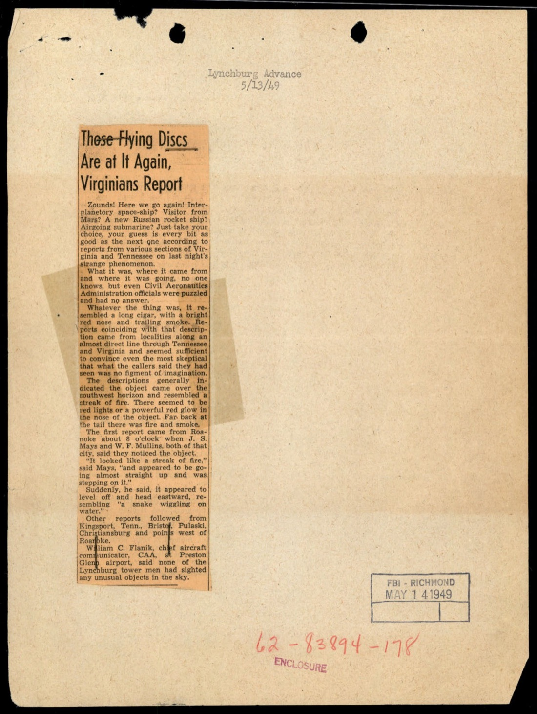

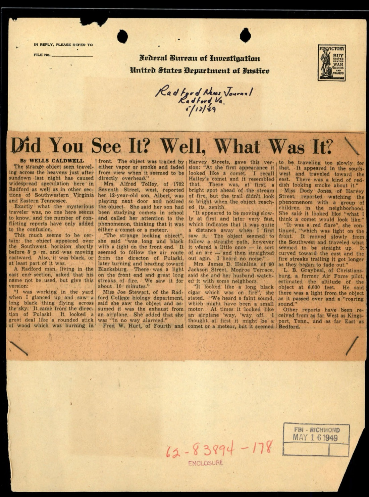

## §12 1949-06-30：Rhodes 案被翻出來

[#002 Section 2](../002-65_hs1-834228961_62-hq-83894_section_2/report.md) 詳細記錄了 1947-07 William Albert Rhodes 在 Phoenix 拍到的兩張飛碟照片。Rhodes 把底片和照片交給 FBI Phoenix 辦事處和 Hamilton Field 的 A-2 代表 George Fugate Jr.。1947 年 FBI 已經把案子收結，照片送到 Wright-Patterson 給 Project SIGN。

兩年後，1949-06-30，FBI 副處長 Lish Whitson 寫備忘錄給 Mr. H. B. Fletcher（p-209），提出一個尷尬的請求：

> Mr. Lynn C. Aldrich, OSI representative at Phoenix, Arizona, has requested the Phoenix Office to furnish him complete facts relating to this interview, which are to be subsequently forwarded to the OSI Office at San Francisco. According to Aldrich, Mr. Fugate, referred to above, has been questioned concerning this matter by his superiors and he has advised them that his recollection is "hazy" on the matter.
>
> Phoenix 的 OSI 代表 Lynn C. Aldrich 請求 Phoenix 辦事處提供本案訪談的完整事實，後續轉送 San Francisco 的 OSI 辦公室。Aldrich 表示，上述的 Fugate 先生曾被上級就此事詢問，他向上級表示自己對此事的記憶「模糊（hazy）」。

Fugate 是 1947 年和 FBI 一起訪問 Rhodes 的那位 A-2 代表。兩年後當 OSI 重新追問他案情細節，他說自己「記憶模糊」。OSI 不得不回頭找 FBI 要當年的訪談紀錄。

備忘錄繼續：

> According to Aldrich, Mr. Rhodes has apparently now requested the Air Force to return the photographs, which were previously obtained from him.
>
> Aldrich 表示，Rhodes 現在似乎已向空軍要求歸還先前從他那裡取走的照片。

Rhodes 1949-06 要照片要回去。1947 年他「自願」交出底片給 A-2 代表，1949 年要回去時遇到阻力。空軍要 FBI 幫忙翻檔來證明當年取得照片的法律基礎。Whitson 的建議：把 1947 年的訪談紀錄轉給 OSI Phoenix，讓他們去面對 Rhodes。

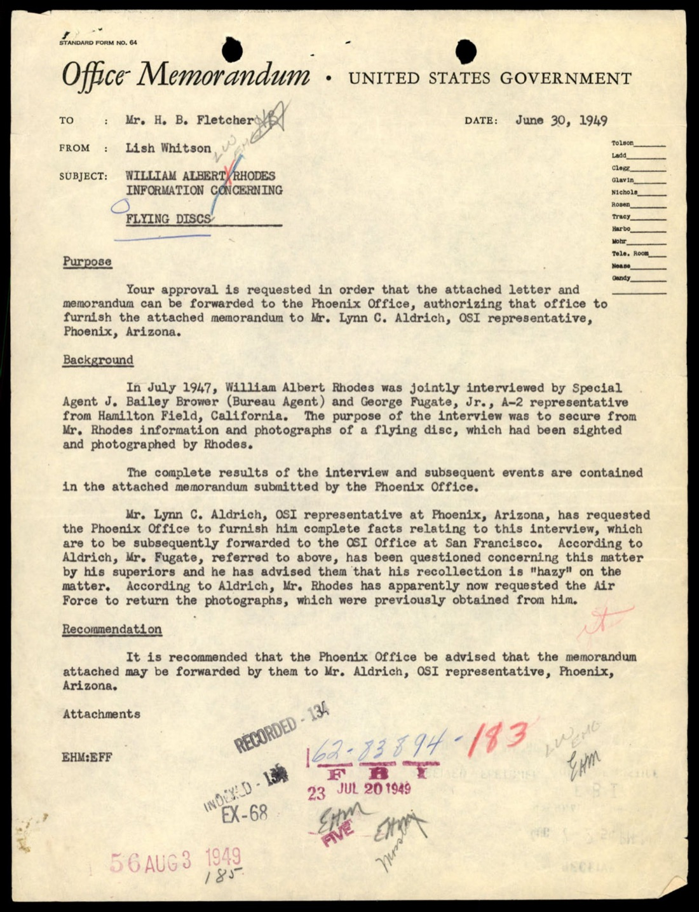

## 整段時間軸

| 日期 | 事件 |
|---|---|
| 1947-10-01 | Bureau Bulletin #57 發出，FBI 退出 UFO 調查（[#003 結尾](../003-65_hs1-834228961_62-hq-83894_section_3/report.md)） |
| 1947-10-09 | SAC Portland 上報 9-11 Portland 警局五分鐘目擊（p-002） |
| 1948-02-04 | 空軍 Air Defense Command（Stratemeyer）發信給六個航空軍司令，要求 FBI 配合調查 |
| 1948-02-12 | SAC San Francisco 把空軍信轉到 Hoover 桌上，指出與 Bureau Bulletin #57 矛盾（p-035） |
| 1948-03-15 | Nebraska 退役士兵 Kenneth Praster 寫信給 Senator Wherry（p-046） |
| 1948-07-24 | Eastern Air Lines DC-3 凌晨在 Alabama Montgomery 上空遇到「100 英尺雪茄」（Chiles-Whitted 案） |
| 1948-07-25 | Atlanta Journal 頭版報導 Chiles-Whitted（p-179） |
| 1948-08 | Pacific Plastics 雜誌報導 Fred Morrison 的 Flyin' Saucer（p-178） |
| 1948-09-09 | Wright-Patterson Project SIGN 寄土壤樣本給 FBI Lab（p-056） |
| 1948-09–10 | Oak Ridge Colonel C. D. Gasser 向 FBI 提出「俄國飛彈」「核能推進」說（p-086-088） |
| 1948-12-27 | Houston 機械工 Loney Noack 帶 8mm 影片到 FBI Houston 辦事處放映（p-089） |
| 1949-01-31 | 第四陸軍 G-2、ONI、OSI、FBI 情報會議 |
| 1949-02-16 | Los Alamos「Green Fireball Phenomena」會議 |
| 1949-03-14 | Fletcher 寫備忘錄給 Ladd，建議重新從通報人蒐集資訊（p-118） |
| 1949-03-22 | SAC San Antonio 記錄：SIGN 改名 GRUDGE，案件分類改稱「Unconventional Aircraft」（p-120） |
| 1949-04-04 | Merced CA 後備軍人 William H. Parrott「咔嗒聲先導」目擊（p-157） |
| 1949-04 月底 | Virginia/Tennessee「飛雪茄」潮（p-191, p-192, p-193） |
| 1949-06-30 | Whitson 處理 Rhodes 案：兩年後 OSI 翻舊檔（p-209） |

## 觀察一：退出令的結構性失效

Bureau Bulletin #57 的設計是「FBI 不調查、轉給空軍」。這個設計在 1948-02 就被空軍自己打破，因為空軍 Air Defense Command 的 SOP 要求「空軍人員調查飛碟時與當地 FBI 辦事處協調」。FBI 退場了，空軍卻把 FBI 寫進自己的 SOP，這在組織上根本走不通。SAC San Francisco 1948-02-12 那封信就是把這個矛盾踢回 Hoover。Hoover 沒有公開撤回退出令，但 1949-03-14 Fletcher 備忘錄重新打開了資訊蒐集管道，實質上恢復了 FBI 的 UFO 調查角色。從 1947-10-01 到 1949-03-14，「退出令撐了 17 個月」是表面，「退出令在 4 個月內就被空軍規範打破」是實質。

## 觀察二：Gasser 上校的私人理論如何變成 FBI 政策

Gasser 訪談是個人意見，他自己反覆強調「給予我絕對沒有官方資訊」，他講的是「他從 CIA 報告和 Wright Field 對話拼湊出的個人推測」。但這份私人推測經由 FBI 內部備忘錄上呈後，1949-03-14 Fletcher→Ladd 備忘錄裡，Gasser 已經被引述為「Air Force 認為飛碟是人造飛彈而非自然現象」「俄國早在 4 年前就試驗」這兩個論點的核心來源。一個 Oak Ridge 駐地工程師的個人推論，5 個月內變成 FBI 重啟調查的政策依據。這個傳遞鏈條的速度，比官方退出令更值得記。

## 觀察三：Wham-O 飛碟玩具進入 FBI 案卷

這是 Section 4 最反直覺的一段。1948 年 Fred Morrison 的 Flyin' Saucer 是商業塑膠玩具，從派盤遊戲演化而來，邏輯上跟「軍方關注的 UFO 調查」完全無關。但 FBI 把 Pacific Plastics 雜誌、Daytona Beach 地方報、甚至產品包裝裡的遊戲說明書，全部歸進 62-HQ-83894 案卷。一種解讀：FBI 1948 年的工作假設是「全國民眾把所有空中物體都當飛碟」，所以塑造這種認知的所有文化材料都需要建立基線。另一種解讀：歸檔的 SAC 沒有自由裁量權，「凡是用了 flying saucer 一詞的剪報都歸檔」是當時的硬規則。後者比較貼近文獻處理 SOP 的習慣。

## 觀察四：1948-1949 飛碟潮的物體類型分佈

把 Section 4 的目擊紀錄按形狀分類：

| 形狀 | 案例 |
|---|---|
| 雪茄 / 圓柱 | Chiles-Whitted 100 英尺雪茄；Virginia/Tennessee 飛雪茄潮 |
| 圓盤 | Portland 警局 9-11；Las Vegas Noack 8 英尺帶尾翼 |
| 火球 / 綠火球 | Los Alamos Sandia incident；Nebraska Praster 流線型 |
| 蒸氣尾跡 | Praster 火車式蒸氣；Bristol 機場管制員推測噴射機尾跡 |
| 實心質量 | Merced Parrott 4-5 英尺 |

1947 飛碟潮的主流是 Arnold 式弧形圓盤，1948-49 已經分化出多種形狀，「雪茄」變成主流，這個分類學上的演化在 Section 4 文件裡有完整呈現。

## 跨檔連結

- [#001 Section 10](../001-65_hs1-834228961_62-hq-83894_section_10/report.md) ─ 1947 飛碟潮第一波，Arnold、Rhodes、FBI 內部假設
- [#002 Section 2](../002-65_hs1-834228961_62-hq-83894_section_2/report.md) ─ Rhodes 照片完整訪談紀錄，Section 4 §12 的源頭
- [#003 Section 3](../003-65_hs1-834228961_62-hq-83894_section_3/report.md) ─ 1947-10-01 退出令發出前的 3 個月（Maury Island、B-25、Twin Falls）

## 來源

US Department of War, PURSUE FOIA Release, 2026-05-08
65_HS1-834228961_62-HQ-83894_Section_4
<https://www.war.gov/UFO/#65_HS1-834228961_62-HQ-83894_Section_4>
