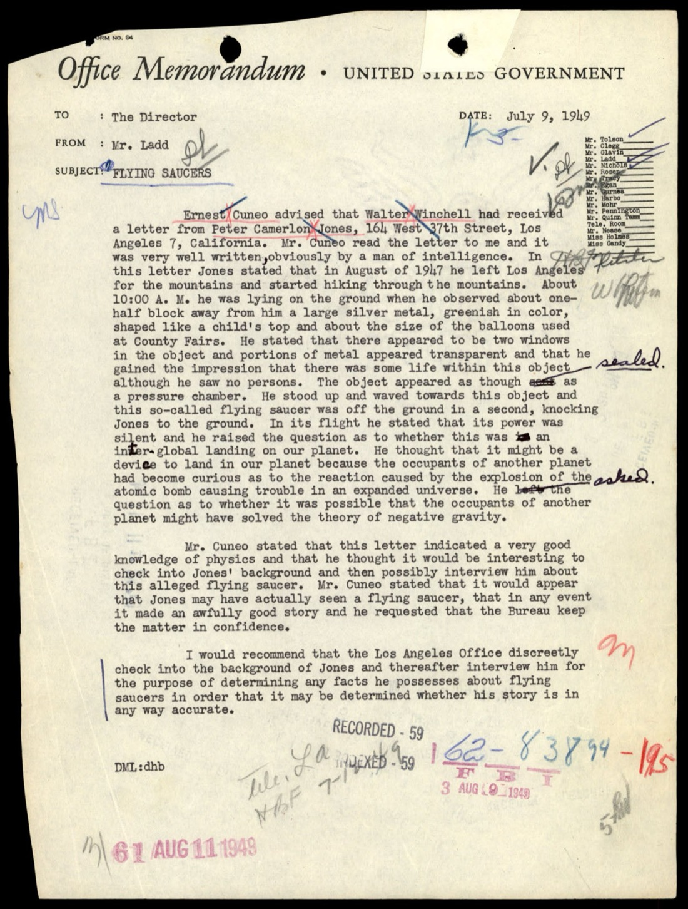
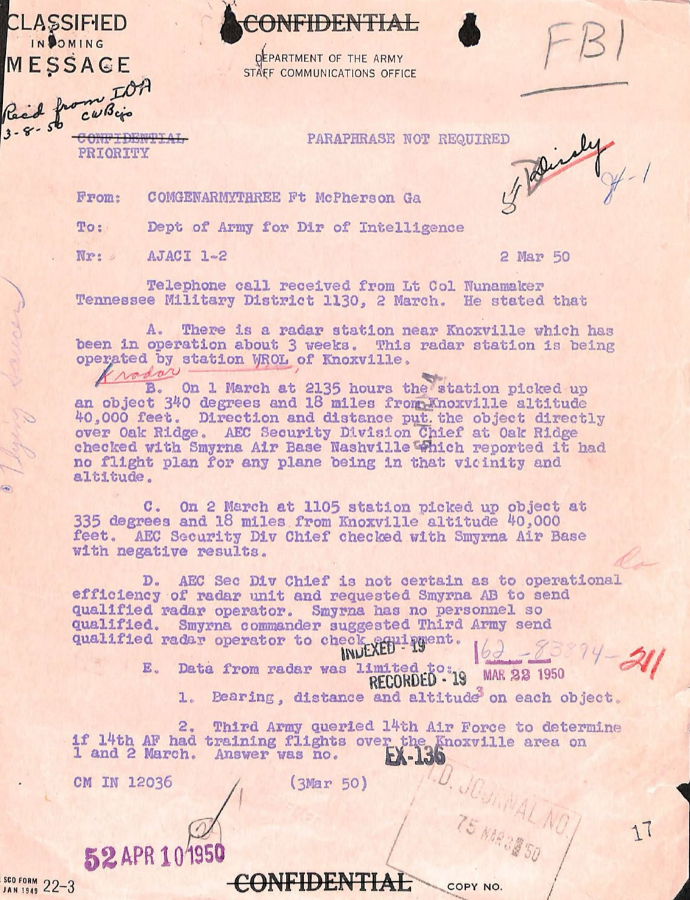
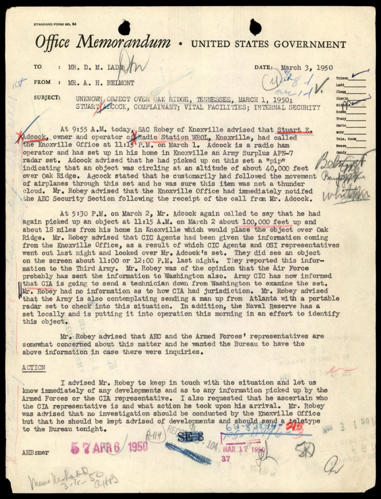
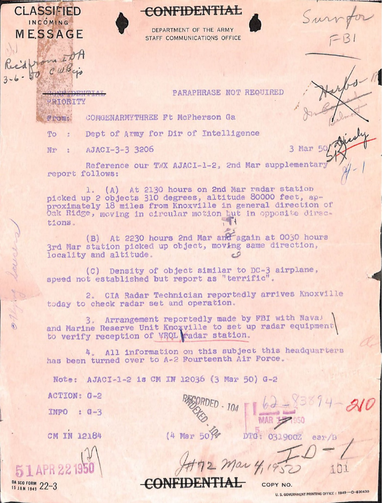
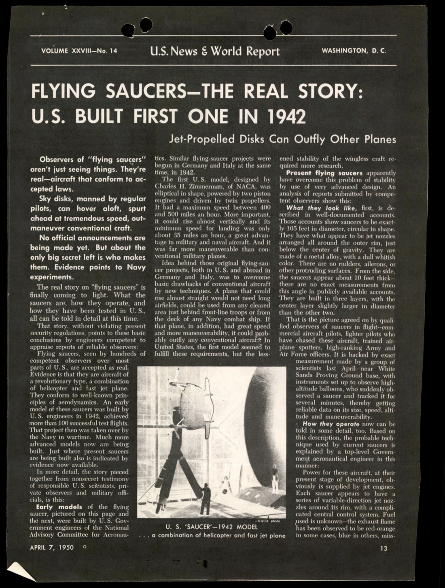
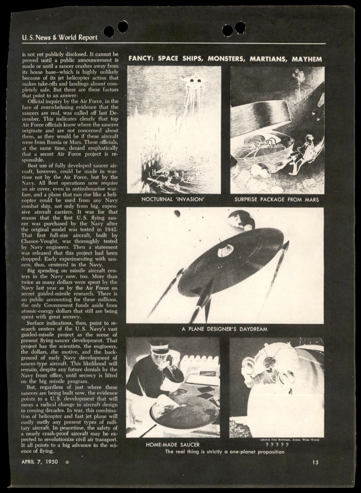
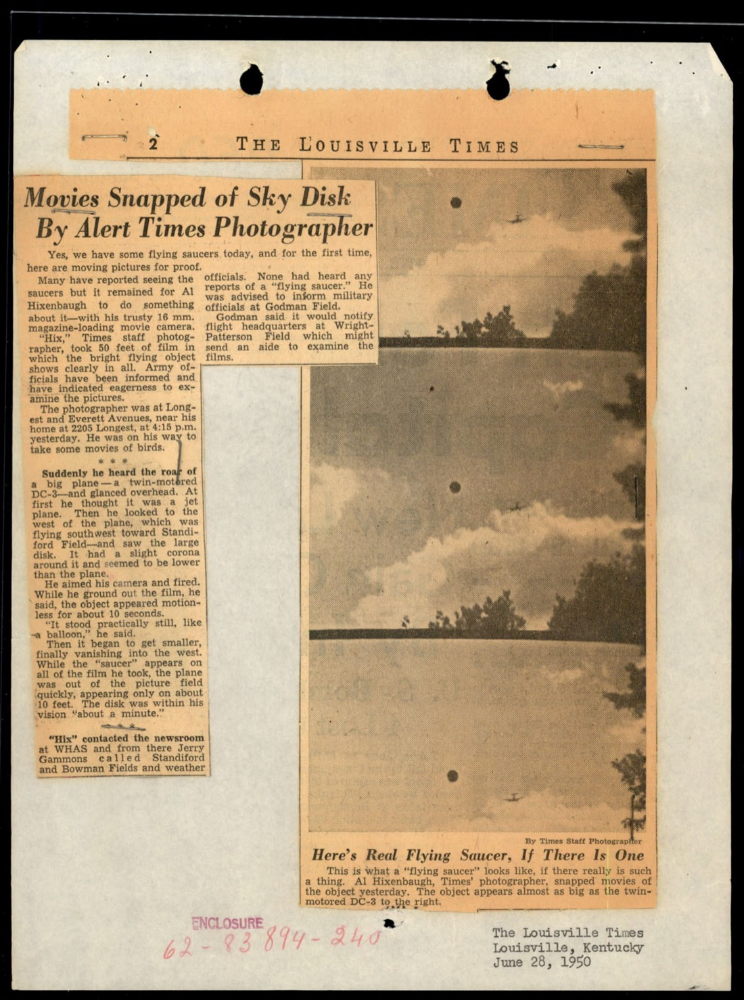
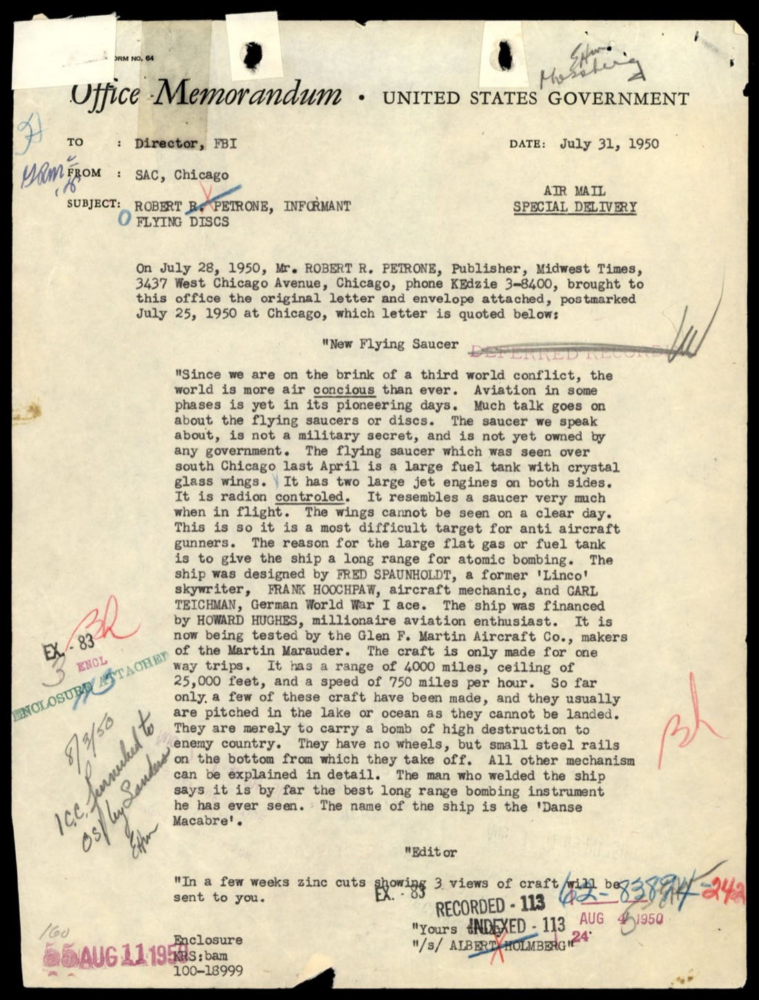
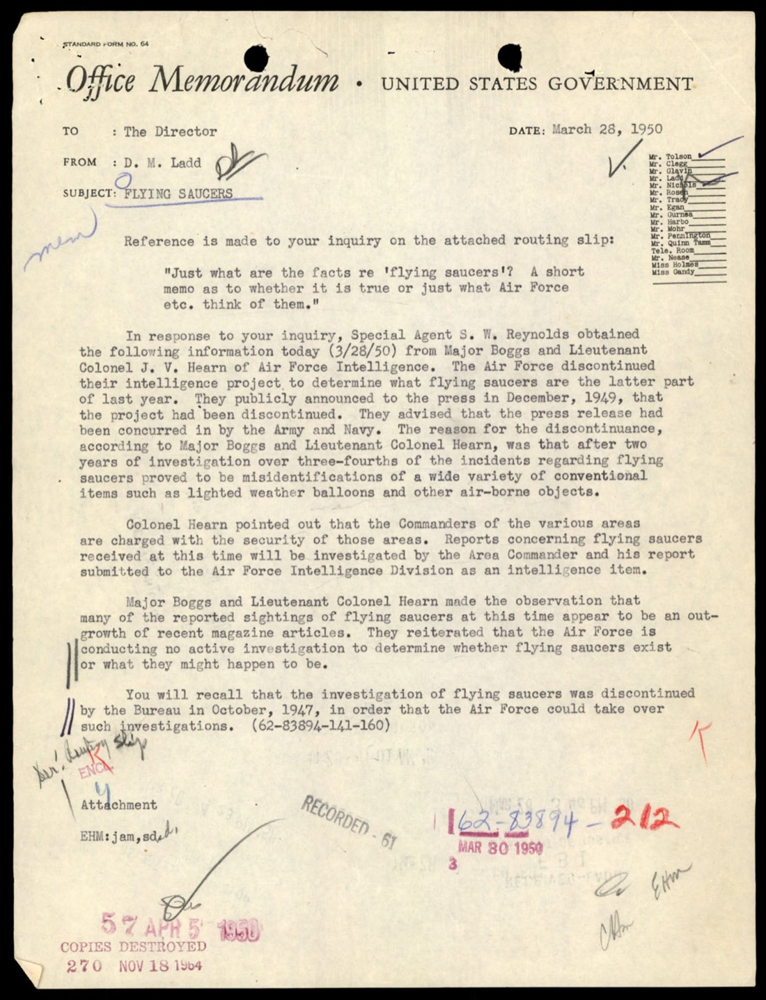
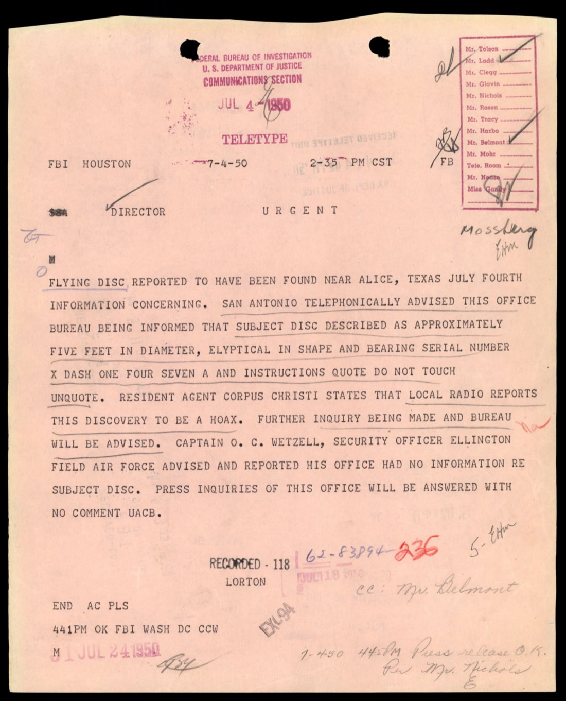

# FBI 62-HQ-83894 案卷 #005 ─ Section 5：Winchell 轉的「外星人來探訪原子彈」、1950-03 Oak Ridge 40,000 英尺雷達案、U.S. News「Navy 1942 年就造出來了」、Hughes 資助的飛碟陰謀信

| 欄位 | 內容 |
|---|---|
| 案卷編號 | `65_HS1-834228961_62-HQ-83894_Section_5` |
| 期間 | 1949-07 → 1950-08 |
| Serial 範圍 | 186 → 245 |
| 頁數 | 209 頁 |
| 主軸 | Walter Winchell 1949-07 轉的 Peter Jones「外星人來看原子彈反應」案、1950-03-01/02/03 Oak Ridge AEC 廠 40,000 英尺雷達 3 次接觸 + AEC/CIC/OSI/Naval Reserve/CIA 五單位聯動、1950-04-07 U.S. News & World Report「Navy 1942 年就造出第一架，是 Chance-Vought」宣傳、1950-04 Louisville Times 攝影師 Hixenbaugh 16mm 影片、1950-07-25 Chicago Howard Hughes 資助陰謀信、Major Boggs 與 Lt. Col. Hearn 的「75% 可解釋」立場 |
| 官方 portal | <https://www.war.gov/UFO/#65_HS1-834228961_62-HQ-83894_Section_5> |

## 1949-1950 年的政策真空

Section 5 涵蓋 Serial 186 到 245，時間跨度 13 個月，從 1949-07 [#004 §12 Rhodes 案重啟](../004-65_hs1-834228961_62-hq-83894_section_4/report.md) 之後幾天，到 1950-08 [#006 §1 Belmont New Mexico 備忘錄](../006-65_hs1-834228961_62-hq-83894_section_6/report.md) 之前幾天。

這 13 個月是 FBI 對 UFO 政策的真空期：1947-10 Bureau Bulletin #57 退出令的字面立場仍有效，但 [#004 §8 1949-03-14 Fletcher 備忘錄](../004-65_hs1-834228961_62-hq-83894_section_4/report.md) 已經把資訊蒐集管道悄悄重啟。Section 5 收進的是這個真空期裡 FBI 桌上發生的混雜案件 ─ 名人轉信、敏感設施雷達追蹤、媒體 cover story、地方攝影師、陰謀論寄件人。FBI 沒有「主動調查」，但 FBI 桌上不斷有 UFO 文件被推進來。

## §1 1949-07-09 Walter Winchell 轉信：原子彈擾動宇宙的飛碟

p-021 是 Section 5 第一份案件文件 ─ 1949-07-09 Mr. Ladd 寫給 The Director（即 Hoover）的內部備忘錄。標題「FLYING SAUCERS」。

> Ernest Cuneo advised that Walter Winchell had received a letter from Peter Camerlon Jones, 164 West 37th Street, Los Angeles 7, California. Mr. Cuneo read the letter to me and it was very well written, obviously by a man of intelligence.
>
> Ernest Cuneo 告知 Walter Winchell 收到一封來自加州 Los Angeles 7 區 West 37 街 164 號的 Peter Camerlon Jones 的信。Cuneo 先生把信念給我聽，文筆相當好，明顯出自一位有頭腦的人。

Walter Winchell 是當時美國最有名的廣播 / 報紙 gossip 專欄作家。Ernest Cuneo 是 Winchell 的法律顧問兼 OSS 退役、戰後從事 FBI 聯絡。Winchell 透過 Cuneo 把 UFO 來信轉給 FBI ─ 這個傳遞鏈意味著名人圈的 UFO 線報直接進到 Hoover 桌上。

Jones 的目擊內容：

> In this letter Jones stated that in August of 1947 he left Los Angeles for the mountains and started hiking through the mountains. About 10:00 A.M. he was lying on the ground when he observed about one-half block away from him a large silver metal, greenish in color, shaped like a child's top and about the size of the balloons used at County Fairs.
>
> Jones 在信中說，1947 年 8 月他從 Los Angeles 出發進山健行。上午約 10:00 他躺在地上時，看到大約半個街區外有一個銀色金屬、偏綠色、形狀像兒童陀螺、跟縣集會展示用的氣球差不多大小的物體。

> He stated that there appeared to be two windows in the object and portions of metal appeared transparent and that he gained the impression that there was some life within this object, although he saw no persons.
>
> 他說該物體似乎有兩個窗戶，部分金屬看起來是透明的，他得到的印象是物體內有生命存在，雖然他沒看到任何人。

> The object appeared as though as a pressure chamber. He stood up and waved towards this object and this so-called flying saucer was off the ground in a second, knocking Jones to the ground.
>
> 該物體看起來像壓力艙。他站起來向這個物體揮手，這個所謂的飛碟一秒內就離地，把 Jones 撞倒在地。

Jones 接著提出他自己的解釋：

> He thought that it might be a device to land in our planet because the occupants of another planet had become curious as to the reaction caused by the explosion of the atomic bomb causing trouble in an expanded universe. He raised the question as to whether it was possible that the occupants of another...
>
> 他認為這可能是要登陸我們星球的裝置，因為另一個星球的居民對原子彈爆炸在膨脹宇宙中引起的反應感到好奇。他提出疑問：是否可能是另一個……（文件被截）

「外星人因為原子彈擾動宇宙而來看我們」 ─ 這個敘事框架 1949 年就已經成形。Jones 的解釋預示了後續 1950 年代 contactee 文化裡 George Adamski、George Van Tassel 等人主打的「外星人因為核試驗而警告人類」主題，比這些 contactee 公開出版的書（1953 以後）早了 4 年。

FBI 內部沒有對 Jones 個人做任何調查。但 Ladd 把這封 Winchell 線的轉信記錄成正式備忘錄，遞給 Hoover。1949-07-09 的 FBI 桌上開始收進「外星人＋原子彈」這個議題框架。

## §2 1950-03-01/02 Oak Ridge AEC 廠 40,000 英尺雷達 3 次接觸

Section 5 中段的重要案件是 1950-03 Oak Ridge 雷達追蹤。p-072 是 1950-03-02 Department of the Army Staff Communications Office 的優先優先電報，等級 PRIORITY CONFIDENTIAL，發自 COMGENARMYTHREE Ft McPherson GA，收件人 Dept of Army for Dir of Intelligence。

> Telephone call received from Lt Col Nunamaker, Tennessee Military District, 1130, 2 March. He stated that:
>
> A. There is a radar station near Knoxville which has been in operation about 3 weeks. This radar station is being operated by station WROL of Knoxville.
>
> B. On 1 March at 2135 hours the station picked up an object 340 degrees and 18 miles from Knoxville altitude 40,000 feet. Direction and distance put the object directly over Oak Ridge. AEC Security Division Chief at Oak Ridge checked with Smyrna Air Base Nashville which reported it had no flight plan for any plane being in that vicinity and altitude.
>
> C. On 2 March at 1105 station picked up object at 335 degrees and 18 miles from Knoxville altitude 40,000 feet. AEC Security Div Chief checked with Smyrna Air Base with negative results.
>
> 1950-03-02 11:30 收到 Tennessee 軍區 Lt. Col. Nunamaker 電話。他表示：
>
> A. Knoxville 附近有一座啟用約 3 週的雷達站，由 Knoxville 的 WROL 電台運作。
>
> B. 1950-03-01 21:35 該站在方位 340°、距 Knoxville 18 英里、高度 40,000 英尺處捕捉到一個物體。方位和距離把該物體放在 Oak Ridge 正上方。Oak Ridge AEC 安全部門主管向 Nashville Smyrna 空軍基地查詢，回報該區域該高度沒有任何飛行計劃。
>
> C. 1950-03-02 11:05 雷達站再次在方位 335°、距 Knoxville 18 英里、高度 40,000 英尺捕捉到物體。AEC 安全部門主管再次向 Smyrna 空軍基地查詢，結果同樣為否定。

> D. AEC Sec Div Chief is not certain as to operational efficiency of radar unit and requested Smyrna AB to send qualified radar operator. Smyrna has no personnel so qualified. Smyrna commander suggested Third Army send qualified radar operator to check radar unit.
>
> AEC 安全部門主管不確定該雷達單元的運作效率，要求 Smyrna 空軍基地派合格雷達操作員。Smyrna 沒有合格人員。Smyrna 指揮官建議第三陸軍派合格雷達操作員檢查。

p-080 是 1950-03-03 A. H. Belmont 給 D. M. Ladd 的 FBI 內部備忘錄，把這個案件從 FBI 角度補充完整：

> At 9:55 A.M. today, SAC Robey of Knoxville advised that Mr. Adcock, owner and operator of Radio Station WROL, Knoxville, had called the Knoxville office at 11 P.M. on March 1. Adcock is a radio ham operator and has set up in his home in Knoxville an Army Surplus APN-7 radar set.
>
> 今日 9:55，Knoxville SAC Robey 告知，WROL 電台的擁有人兼營運者 Adcock 先生於 1950-03-01 23:00 致電 Knoxville 辦公室。Adcock 是無線電 ham 操作員，在 Knoxville 自家設了一台 Army Surplus APN-7 雷達。

關鍵：這不是軍方雷達站，是民間 ham 操作員家裡的剩餘物資雷達。APN-7 是 WWII 標準機載雷達系統，戰後流入民間市場。

> Adcock advised that he had picked up on this set a "pip" indicating that an object was circling at an altitude of about 40,000 feet over Oak Ridge. Adcock stated that he customarily had followed the movement of airplanes through this set and he was sure this item was not a thunder cloud.
>
> Adcock 告知他在這台設備上捕捉到一個「pip」，顯示有物體在 Oak Ridge 上空約 40,000 英尺高度盤旋。Adcock 表示他平常用這套設備追蹤飛機動態，確定這個東西不是雷雨雲。

> At 5:30 P.M. on March 2, Mr. Adcock again called to say that he had again picked up an object at 11:15 A.M. on March 2 about 100,000 feet up and about 18 miles from his home in Knoxville which would place the object over Oak Ridge.
>
> 1950-03-02 17:30，Adcock 再次致電說他於 1950-03-02 11:15 再次捕捉到物體，距家約 18 英里、高度約 100,000 英尺，位置在 Oak Ridge 上空。

40,000 英尺到 100,000 英尺。1950 年沒有任何已知民用或軍用飛機能在 100,000 英尺巡航 ─ U-2 1955 年才出來，SR-71 1964 年才出來。1950-03 在 100,000 英尺有物體盤旋 18 英里範圍，這在當時的技術現實裡無法歸因到任何已知飛機類別。

各機構的聯動反應：

> CIC Agents and CSI representatives went out last night and looked over Mr. Adcock's set. They did see an object on the screen about 11:00 or 12:00 P.M. last night. They reported this information to the Third Army. Mr. Robey was of the opinion that the Air Force probably has sent the information to Washington also. Army CIC has now informed that CIA is going to send a technician down from Washington to examine the set.
>
> CIC（陸軍反情報軍團）特工與 OSI 代表昨晚到 Adcock 先生家檢查他的設備。他們在螢幕上確實看到一個物體，時間約昨晚 23:00 或 00:00。他們把訊息報告給第三陸軍。Robey 認為空軍可能也已把訊息送到華盛頓。陸軍 CIC 現在告知 CIA 將派一位技術人員從華盛頓南下檢查該設備。

> In addition, the Naval Reserve has a set locally and is putting it into operation this morning in an effort to identify this object.
>
> 此外，海軍預備隊在當地也有一台設備，今早正啟用以辨識此物體。

48 小時內 6 個機構聯動：AEC 安全部門 + 陸軍 CIC + OSI + 第三陸軍 + 空軍 + CIA + 海軍預備隊。一位民間 ham 操作員家裡的剩餘物資雷達觸發了 1950 年代最高層級的多機構應變。

這個案件後續的命運 ─ CIA 派出的技術人員確認了什麼、Naval Reserve 雷達是否也看到物體、Adcock 的 APN-7 設備是否正常 ─ Section 5 沒有明說，後續處理可能落在 ATIC（Wright-Patterson）或 CIA 內部檔案。但 1950-03-03 Belmont 備忘錄這份文件本身已經足以證明：1950-03 退出令發出 29 個月後，FBI 內部對 Oak Ridge 上空 100,000 英尺物體的反應，仍是接近最高警戒級別。

p-070 是上述案件的進一步補充電報，記錄 1950-03-03 起 OIA Radar Technician 抵達 Knoxville 檢查設備、Marine Reserve Unit 設立第二台雷達裝置交叉驗證，相關資訊「均已轉交 A-2 Fourteenth Air Force」。第十四航空軍 A-2 部門負責情報，是 Section 7 的 Daniel Lang 報導裡引述的層級。

## §3 1950-04-07 U.S. News & World Report：「Navy 1942 年就造出第一架」

p-099 是 1950-04-07 U.S. News & World Report Volume XXVIII No. 14 的頭條報導〈FLYING SAUCERS—THE REAL STORY: U.S. BUILT FIRST ONE IN 1942〉，副標題「Jet-Propelled Disks Can Outfly Other Planes」。

第一段定下基調：

> Observers of "flying saucers" aren't just seeing things. They're real—aircraft that conform to accepted laws.
>
> 飛碟的目擊者不是看花眼。它們是真的 ─ 是符合公認規律的飛機。

> Sky disks, manned by regular pilots, can hover aloft, spurt ahead at tremendous speed, outmaneuver conventional craft.
>
> 天空中的圓盤由常規飛行員駕駛，能在空中懸停、瞬間加速到驚人速度、勝過常規飛機的機動性。

> No official announcements are being made yet. But about the only big secret left is who makes them. Evidence points to Navy experiments.
>
> 尚未有官方公告。但唯一剩下的大秘密是誰造的。證據指向海軍實驗。

文章的核心論述（p-099 後段）：

> Flying saucers, seen by hundreds of competent observers over most parts of U.S., are accepted as real.
>
> Evidence is that they are aircraft of a revolutionary type, a combination of helicopter and fast jet plane. They conform to well-known principles of aerodynamics.
>
> An early model of these saucers was built by U.S. engineers in 1942, achieved more than 100 successful test flights. That project then was taken over by the Navy in wartime.
>
> Much more advanced models now are being [tested].
>
> 飛碟在全美大多數地區被數百位有能力的觀察者看到，被承認為真實的。
>
> 證據顯示它們是革命性新型飛機 ─ 直升機與快速噴射機的結合。它們符合眾所周知的空氣動力學原理。
>
> 早期型號由美國工程師於 1942 年製造，完成超過 100 次試飛。該計劃於戰時由海軍接手。
>
> 目前正在測試更先進的型號。

「1942 年」這個年份指向 Chance-Vought V-173「Flying Pancake」實驗機 ─ 由 Charles H. Zimmerman 設計、1942-11-23 首飛的木質單座圓盤狀飛機。1944 年其升級版 XF5U「Flying Flapjack」開始試造但戰爭結束後被取消（1947 年原型被切除為廢料）。

p-100 的配圖：

> MOCK-UP OF EARLY MODEL IS TESTED IN WIND TUNNEL — latest models are circular, faster, more maneuverable
>
> 早期型號的模型在風洞中測試 ─ 最新型號為圓形、更快、更靈活

技術細節說明：

> By choosing which nozzles to turn on or off and the angle of tilt, the pilot could make the saucer rise or descend vertically, hover, fly straight ahead or make sharp turns. A right-angle turn for example, could be made by turning off the rear jets, turning on the side and front nozzles.
>
> 飛行員通過選擇哪些噴嘴開或關以及傾斜角度，可使飛碟垂直升降、懸停、直線前進或急轉彎。例如直角轉彎可關閉後方噴射、開啟側面和前方噴嘴。

「噴嘴方向控制」這個解釋，後來在 1955 年加拿大 Avro Aircraft 公司的 Avrocar VZ-9 開發案裡實際試造。但 1950-04 的 U.S. News 把這個還未實現的技術，描述成「已經試飛過 100 多次」 ─ 跟 V-173 的歷史紀錄並不吻合（V-173 1942-1947 累積試飛時數約 130 小時）。

p-101 是文章最關鍵的政治論述：

> Official inquiry by the Air Force, in the face of overwhelming evidence that the saucers are real, was called off last December.
>
> 面對飛碟為真的壓倒性證據，空軍官方調查已於去年 12 月被叫停。

> This indicates clearly that top Air Force officials know where the saucers originate and are not concerned about them, as they would be if these aircraft were from Russia or Mars.
>
> 這清楚顯示高層空軍官員知道飛碟的來源，而且並不擔心 ─ 如果這些飛機來自俄國或火星，他們就會擔心。

> These officials, at the same time, denied emphatically that a secret Air Force project is responsible.
>
> 這些官員同時強烈否認有秘密空軍計劃負責。

> Best use of fully developed saucer aircraft, however, could be made in wartime not by the Air Force, but by the Navy. All fleet operations now require air cover, even in antisubmarine warfare, and a plane that can rise like a helicopter could be used from any Navy combat ship, not only from big, expensive aircraft carriers.
>
> 然而，戰時完全發展的飛碟飛機最佳用途不是空軍而是海軍。所有艦隊行動現在都需要空中掩護，連反潛戰也需要，而能像直升機那樣升空的飛機可用於任何海軍戰鬥艦，不僅限於大型昂貴的航空母艦。

> It was for that reason that the first U.S. flying saucer was purchased by the Navy after the original model was tested in 1942. That first full-size aircraft, built by Chance-Vought, was thoroughly tested.
>
> 正因如此，第一架美國飛碟在 1942 年原型測試後被海軍購買。第一架全尺寸飛機由 Chance-Vought 製造，經過完整測試。

論述結構非常精細：（1）承認飛碟是真的 ─ 解除「政府否認」的心理壓力；（2）排除「外星 / 蘇聯」起源 ─ 安撫民眾；（3）暗示是 Navy + Chance-Vought ─ 給出滿足好奇心的具體答案；（4）但「沒有官方公告」 ─ 保留秘密研究的氛圍。

U.S. News & World Report 在 1950 年是嚴肅的政治週刊，類似今天的《經濟學人》定位。這篇文章經由這個媒體管道出去，等於是給知識分子讀者群一個「政府正在做秘密超前研發」的安心敘事。FBI 把這篇文章歸進 Section 5 案卷，跟 [#006 §4 Liddel ONR Skyhook 文章](../006-65_hs1-834228961_62-hq-83894_section_6/report.md) 一起，構成 1950-1951 年「主流媒體把飛碟自然化／國有化」的兩篇代表文獻。

## §4 1950-04 Louisville Times：攝影師 Hixenbaugh 的 16mm 飛碟影片

p-191 是 1950-04 The Louisville Times 的一則新聞剪報〈Movies Snapped of Sky Disk by Alert Times Photographer〉。

> Yes, we have some flying saucers today, and for the first time, here are moving pictures for proof.
>
> 沒錯，我們今天有飛碟，而且第一次有動態影片作為證據。

> Many have reported seeing the saucers but it remained for Al Hixenbaugh to do something about it—with his trusty 16mm magazine-loading movie camera. "Hix," Times staff photographer, took 50 feet of film in which the bright flying object shows clearly.
>
> 許多人通報看到飛碟，但 Al Hixenbaugh 是第一個用他可靠的 16mm 雜誌式裝填攝影機處理這件事的人。Times 攝影師「Hix」拍了 50 英尺底片，畫面清楚顯示明亮的飛行物體。

> The photographer was at Longest and Everett Avenues, near his home at 2208 Longest, at 4:15 p.m. yesterday. He was on his way to take some movies of birds.
>
> 該攝影師昨日下午 4:15 在 Longest 街和 Everett 大道交叉口，靠近他位於 Longest 街 2208 號的家。他原本要去拍鳥的影片。

> Suddenly he heard the roar of a big plane—a twin-motored DC-3—and glanced overhead.
>
> 突然他聽到一架大飛機 ─ 雙引擎 DC-3 ─ 的轟鳴聲，往頭頂看。

> Army officials have been informed and have indicated eagerness to examine the pictures.
>
> 陸軍官員已被告知並表示渴望檢視這些影片。

> Godman said it would notify flight headquarters at Wright-Patterson Field which might send an aide to examine the films.
>
> Godman[Field]說會通知 Wright-Patterson 機場的飛行總部，後者可能派人來檢視影片。

50 英尺 16mm 膠卷 = 約 50 秒影片。Wright-Patterson 即 ATIC（Air Technical Intelligence Center）所在地，Project Grudge 的母艦。Godman Field 是 1948-01 Mantell case 的所在地 ─ Capt. Thomas Mantell 在 Godman Field 上空追逐 UFO 後墜機身亡。同一個 Godman Field 1950 年再次把 UFO 影片往 Wright-Patterson 送。

跟 [#010 Presley 1947](../010-65_hs1-834228961_62-hq-83894_serial_153/report.md) 和 [#004 §5 Noack 1948-12 Las Vegas 8mm 影片](../004-65_hs1-834228961_62-hq-83894_section_4/report.md) 連起來看，Hixenbaugh 1950-04 Louisville 16mm 是第三件 1947-1950 年間 FBI 知道存在的 UFO 物理底片證據。三件影片的最終分析結果在 Section 5 文件裡都沒明說，意味著 Project Grudge / ATIC 內部分析的結論沒有回流到 FBI 案卷。

## §5 1950-07-25 Chicago：Howard Hughes 資助、Glenn L. Martin 製造的飛碟

p-194 是 1950-07-31 SAC Chicago 寫給 Director 的辦公室備忘錄，主旨「ROBERT R. PETRONE, INFORMANT, SPECIAL DELIVERY UNIDENTIFIED FLYING DISCS」。

Robert R. Petrone 是 Midwest Times 的發行人（位於 Chicago West Chicago Avenue 3437 號）。他在 1950-07-28 把一封 1950-07-25 從 Chicago 郵戳寄出的匿名信交給 FBI。信件全文：

> New Flying Saucer
>
> Since we are on the brink of a third world conflict, the world is more air conscious than ever. Aviation in some phases is yet in its pioneering days. Much talk goes on about the flying saucers or discs. The saucer we speak about, is not a military secret, and is not yet owned by any government.
>
> 新飛碟
>
> 由於我們處於第三次世界大戰邊緣，世界比以往更加重視空中力量。航空業有些方面仍處於先驅階段。關於飛碟或圓盤有許多談論。我們所說的飛碟並非軍事機密，且尚未由任何政府擁有。

> The flying saucer which was seen over south Chicago last April is a large fuel tank with crystal glass wings. It has two large jet engines on both sides. It is radio controlled. It resembles a saucer very much when in flight. The wings cannot be seen on a clear day. This is so it is a most difficult target for anti-aircraft gunners. The reason for the large flat gas or fuel tank is to give the ship a long range for atomic bombing.
>
> 1950-04 在芝加哥南部上空看到的飛碟是一個大型燃料箱配上水晶玻璃機翼。兩側各有一個大型噴射引擎。是無線電遙控的。飛行時非常像飛碟。晴天時看不見機翼。設計目的是讓它成為防空炮兵最難擊中的目標。大型扁平油箱的設計是為了給飛機足夠航程進行原子彈轟炸。

> The ship was designed by FRED SPAUNHOLDT, a former Lincoln skywriter, FRANK HOOCHPAW, aircraft mechanic, and CARL TEICHMAN, German World War I ace. The ship was financed by HOWARD HUGHES, millionaire aviation enthusiast. It is now being tested by the Glenn L. Martin Aircraft Co., makers of the Martin Marauder.
>
> 這艘飛行器由 Fred Spaunholdt（前 Lincoln 牌煙霧書寫飛行員）、Frank Hoochpaw（飛機機械師）、Carl Teichman（德國 WWI 王牌）設計。由百萬富翁航空愛好者 Howard Hughes 資助。目前由 Glenn L. Martin 飛機公司（Martin Marauder 製造商）測試。

> The craft is only made for one way trips. It has a range of 4000 miles, ceiling of 25,000 feet, and a speed of 750 miles per hour. So far only a few of these craft have been made, and they usually...
>
> 這艘飛行器只設計用於單程任務。航程 4,000 英里，升限 25,000 英尺，速度 750 mph。目前只造了少數，通常……

「Howard Hughes 出錢、Glenn L. Martin 製造、德國 WWI 王牌設計、原子彈用、單程」 ─ 這封匿名信的密度極高，姓名／公司／規格／用途全都具體到引人懷疑。1950-07 美國介入韓戰前 1 個月（1950-06-25 北韓越線），「世界處於第三次大戰邊緣」這個開場符合當時氛圍。

FBI Chicago 把這封信歸進 Section 5，沒有對 Spaunholdt / Hoochpaw / Teichman 三個名字做進一步追查（這些名字在 FBI 後續檔案裡找不到記錄，說明可能是化名）。Howard Hughes 1950 年代確實在運作 Hughes Aircraft Company，但業務範圍不含飛碟原型機。Glenn L. Martin 公司是真實存在的飛機製造商（B-26 Marauder 製造商），1950 年代主要承包美國海軍 P5M 巡邏機。

這封信的真正功能是「假情報擾流」或「業餘陰謀論愛好者投書」 ─ 兩種解讀都不影響 FBI 的處理方式：歸檔、不查、留存。

## §6 Major Boggs 與 Lt. Col. Hearn：75% 可解釋的官方比例

p-075 是 Section 5 中段一份未署日期的 FBI 內部備忘錄，記錄 Major Boggs 與 Lt. Col. J. V. Hearn（Air Force Intelligence）對 FBI 的簡報內容。引用的關鍵語句：

> Major Boggs and Lieutenant Colonel J. V. Hearn of Air Force Intelligence... their intelligence project to determine what flying saucers are has been announced to the public to have been discontinued, but the project continued.
>
> 空軍情報的 Major Boggs 與 Lt. Col. J. V. Hearn ……他們判定飛碟為何的情報項目已向公眾宣告中止，但項目實際上仍在繼續。

> The investigation has been concurrent throughout 1949 and 1950 according to Major Boggs and Lieutenant Colonel Hearn. Investigation over three-fourths of the incidents reported has shown the items observed to be misidentified items such as lighted weather balloons and other airborne items.
>
> Boggs 少校與 Hearn 中校表示，1949 年和 1950 年全年調查同時進行。在所有通報案件中，超過四分之三的調查結果顯示物體為誤辨識物，如照亮的氣象球或其他空中物體。

「對外公開宣告中止、實際上仍在進行」─ 這句話直接證明 1949-12 Project Saucer 「結束」是公關訊息，不是組織事實。1950 年的 Boggs 和 Hearn 是把這個事實私下告訴 FBI 的人。「75% 可解釋」的比例後來在 1953 年 Robertson Panel、1968 年 Condon Report、1969 年 Project Blue Book 結案報告裡都被沿用。1950 年的 Boggs/Hearn 簡報是這個比例最早的公開紀錄之一。

> Colonel Hearn pointed out that ... the responsibility of investigation. Reports received at this time will... be submitted to the Air Force [Intelligence] organization to determine [the cause].
>
> Hearn 上校指出，調查責任屬於空軍情報組織。目前收到的通報會被提交到空軍情報組織以判定原因。

FBI 1950 年的角色定位非常清楚：接收線報 → 轉空軍 → 由空軍判斷 → FBI 不主動調查。這個鏈條一直持續到 1969 年。

## §7 1950 Corpus Christi 飛碟報導：F-147 探員確認為惡作劇

p-176 是 1950 年的 FBI Teletype，從 Houston 發出：

> FLYING DISC INFORMATION CONCERNING
> [F]IVE F[ORCE] DASH ONE FOUR SEVEN A[GENT].
>
> RESIDENT AGENT CORPUS CHRISTI STATES THAT LOCAL SUBJECT DISC. PRESS INQUIRY TO BE A HOAX.
>
> CAPTAIN O. C. WETZELL, [AIR FORCE] ADVISED. NO COMMENT UACB.
>
> 飛碟相關資訊
> 第五[航空軍 OSI]-147 探員
>
> Corpus Christi 駐地探員表示：當地該圓盤通報、媒體調查屬於騙局。
>
> Captain O. C. Wetzell（空軍）已告知。在獲得本局指示前不予評論。

「UACB」（Until Advised by the Bureau）─ FBI 內部標準術語，意思是「等 Bureau 給指示才公開評論」。Corpus Christi 通報被當地 OSI 駐站探員 F-147 直接判定為 hoax，並通報給 Captain Wetzell。FBI 收到後歸檔，沒有外部評論。

Section 5 把這份兩行電報歸進案卷，並列於 §3 U.S. News 文章（「Navy 1942 年就造出來了」）和 §5 Chicago 陰謀信（「Howard Hughes 資助」）之間 ─ 編輯邏輯顯示 FBI 1950 年把這三類訊息（媒體 cover story、地方確認的 hoax、陰謀論寄件人）並列保存，作為「飛碟議題」的訊息光譜樣本庫。

## 整段時間軸

| 日期 | 事件 |
|---|---|
| 1947-08 | Peter Camerlon Jones 加州山中目擊「兒童陀螺形」物體（後續 1949 才寫信給 Winchell） |
| 1949-07-09 | Mr. Ladd 內部備忘錄記錄 Winchell 線收到 Jones 信 |
| 1949-12 | Project Saucer 公開宣告中止 |
| 1950-01 → 1950-04 | Major Boggs / Lt. Col. Hearn 私下告訴 FBI：實際調查仍在繼續，75% 案件可歸因到誤辨識 |
| 1950-03-01 21:35 | Adcock APN-7 ham 雷達首次在 Oak Ridge 上空 40,000 英尺捕捉到物體 |
| 1950-03-02 11:05 | 第二次捕捉，同位置同高度 |
| 1950-03-02 11:15 | 第三次捕捉，100,000 英尺 |
| 1950-03-02 11:30 | Lt Col Nunamaker 致電 Third Army 報告 |
| 1950-03-02 晚 | CIC + OSI 親到 Adcock 家驗證、確認雷達顯示物體 |
| 1950-03-03 9:55 | SAC Robey Knoxville 通知 Belmont |
| 1950-03-03 | Belmont 寫備忘錄給 Ladd；CIA 派技術員、Naval Reserve 啟用第二套雷達 |
| 1950-04 | Louisville Times 攝影師 Al Hixenbaugh 拍下 50 英尺 16mm 飛碟影片 |
| 1950-04-07 | U.S. News & World Report 刊出「Navy 1942 年就造出第一架」封面故事 |
| 1950-06-25 | 韓戰爆發 |
| 1950-07-25 | Chicago 匿名信寄出，聲稱 Howard Hughes 資助、Glenn L. Martin 製造 |
| 1950-07-28 | Robert R. Petrone 把信交給 FBI Chicago |
| 1950-07-31 | SAC Chicago 把信轉給 Director |
| 1950 年內 | Corpus Christi 通報被 OSI F-147 判定為 hoax |

## 觀察一：1950-03 Oak Ridge 雷達案的政治升級鏈條

從一位民間 ham 操作員家裡的剩餘物資雷達（APN-7）開始，48 小時內升級到 6 個機構聯動（AEC + 陸軍 CIC + OSI + 第三陸軍 + 空軍 + CIA + 海軍預備隊），FBI 內部備忘錄直接送到 Belmont 與 Ladd 桌上。這個升級速度跟 1947-10-01 退出令的「FBI 不調查」表面立場形成強烈對比。實際運作中，敏感設施（Oak Ridge AEC 廠）上空的雷達回波是 FBI 不能不接的線。退出令的政策邊界並非「FBI 完全離場」，而是「FBI 不主動發起、但敏感設施相關線報立即升級」這個更微妙的實際操作。Section 5 §2 把這個雙重立場用文件級證據呈現出來。

## 觀察二：1950-04 U.S. News 文章的兩層功能

p-099 到 p-101 的 U.S. News & World Report 文章看似「揭露真相」（Navy 1942 年就造出飛碟），實際上有兩層政策功能：

1. **對民眾**：給出滿足好奇心的具體答案（Chance-Vought + V-173 + Navy），避免「政府否認 → 大眾不信 → 陰謀論擴大」這個惡性循環。
2. **對情報界**：作為 Project Saucer 公開宣告中止後（1949-12）的延伸 cover story，把 1950-03 Oak Ridge 雷達案等真正未解事件包裹進「我們有秘密研發」這個敘事下，讓 1950-1951 年的 UFO 通報能在這個敘事框架內被吸收。

U.S. News 不是政府的 mouthpiece，但它經由「未公開來源」（文章裡多次提到「一位有權威的工程師告訴本刊」）取得敘事素材的方式，意味著訊息進到 U.S. News 之前已有 controlled leakage。1950-04 這篇文章的發表，跟 [#006 §4 1951-01 Liddel ONR Skyhook 解釋](../006-65_hs1-834228961_62-hq-83894_section_6/report.md) 在敘事上互相補強，形成 1950-1951 年美國主流媒體對 UFO 議題的兩種「自然化」工具：（1）國有秘密研發（U.S. News），（2）氣象球光學錯覺（Liddel）。

## 觀察三：名人線（Winchell）vs. 出版人線（Petrone）的兩種訊息傳遞模型

Section 5 內收進兩種民間訊息流向 FBI 的路徑：

| 路徑 | 案例 | 機制 |
|---|---|---|
| 名人線 | Walter Winchell → Ernest Cuneo → Mr. Ladd → Director | 名人收到讀者信、透過律師朋友轉給 FBI 高層 |
| 出版人線 | Midwest Times Petrone → SAC Chicago → Director | 地方出版人收到匿名信、直接交給 FBI 地方辦事處 |

兩種路徑的傳遞速度和受重視程度不同。Winchell-Cuneo-Ladd 線是 1 步到 Hoover 桌上的 fast track；Petrone-SAC Chicago-Director 線是常規郵件處理。同樣是 UFO 民間線報，社會階層位置決定了訊息在 FBI 內部上升的速度。Section 5 把這兩條線並列保存，本身就是訊息社會學的歷史標本。

## 跨檔連結

- [#001 Section 10](../001-65_hs1-834228961_62-hq-83894_section_10/report.md) ─ Oak Ridge 推進系統技術提案，與 §2 1950-03 雷達案同一地理
- [#002 Section 2](../002-65_hs1-834228961_62-hq-83894_section_2/report.md) ─ 1947 Rhodes Phoenix
- [#003 Section 3](../003-65_hs1-834228961_62-hq-83894_section_3/report.md) ─ 1947 飛碟潮 + 退出令
- [#004 Section 4](../004-65_hs1-834228961_62-hq-83894_section_4/report.md) ─ 1948-1949 退出令被打破
- [#006 Section 6](../006-65_hs1-834228961_62-hq-83894_section_6/report.md) ─ 1948-1952 New Mexico Green Fireball + Skyhook + Menzel 倒置層
- [#007 Section 7](../007-65_hs1-834228961_62-hq-83894_section_7/report.md) ─ 1948-1953 Gorman + New Yorker + Washington DC 雷達
- [#008 Section 9](../008-65_hs1-834228961_62-hq-83894_section_9/report.md) ─ 1957 Sputnik 後飛碟潮
- [#009 Serial 130](../009-65_hs1-834228961_62-hq-83894_serial_130/report.md) ─ 1947 ADC 卷宗
- [#010 Serial 153](../010-65_hs1-834228961_62-hq-83894_serial_153/report.md) ─ 1947 Oak Ridge Presley 照片

## 來源

US Department of War, PURSUE FOIA Release, 2026-05-08
65_HS1-834228961_62-HQ-83894_Section_5
<https://www.war.gov/UFO/#65_HS1-834228961_62-HQ-83894_Section_5>
