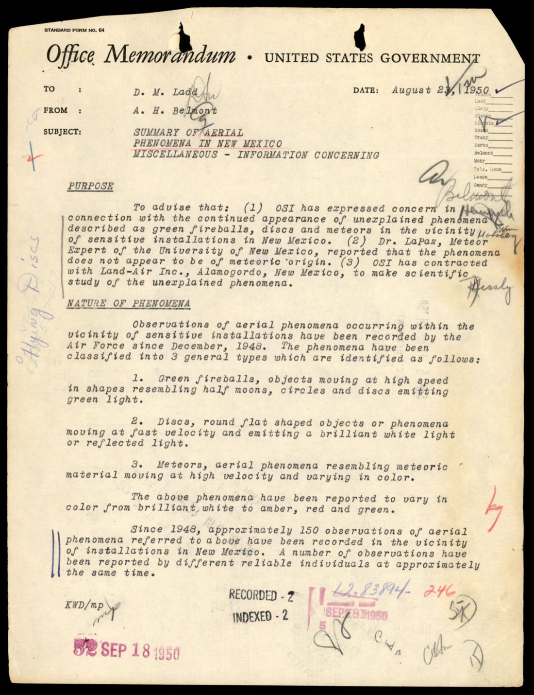
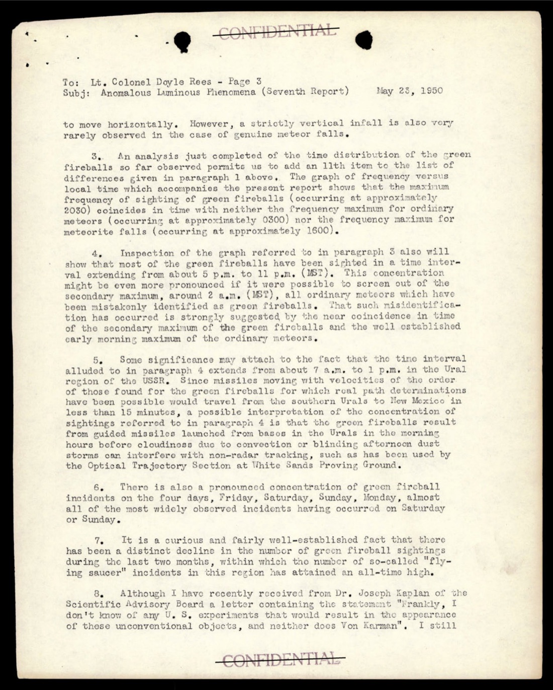
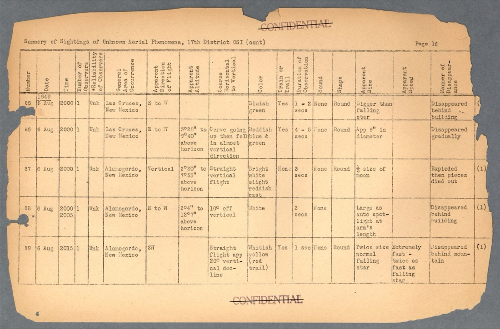
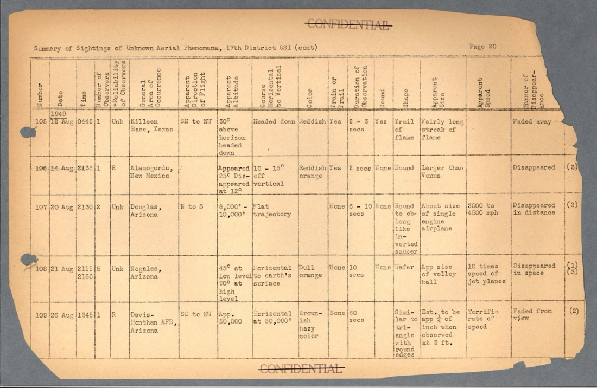
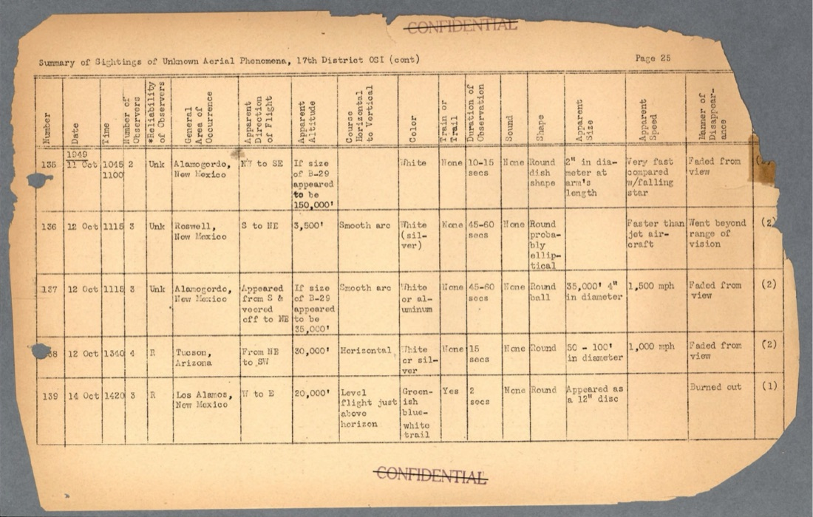
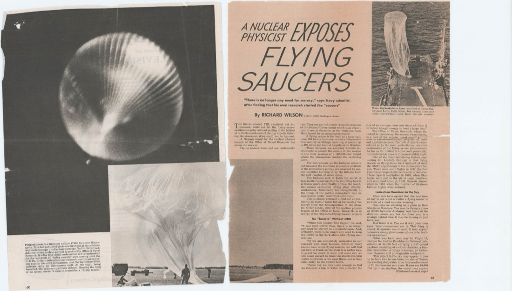
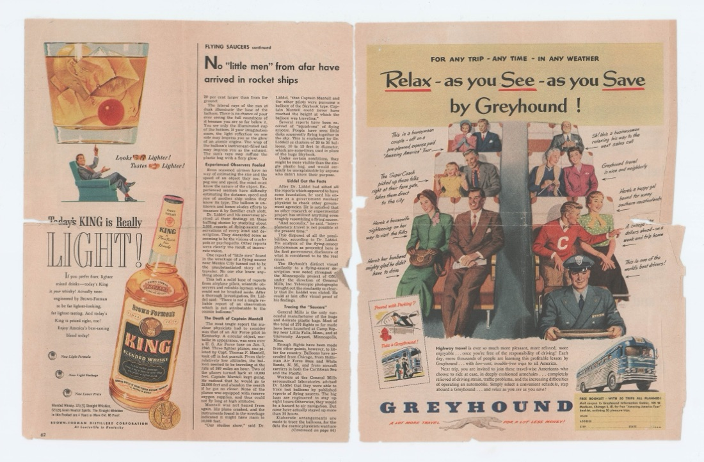
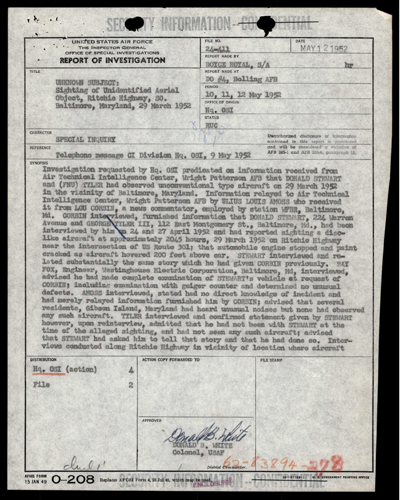
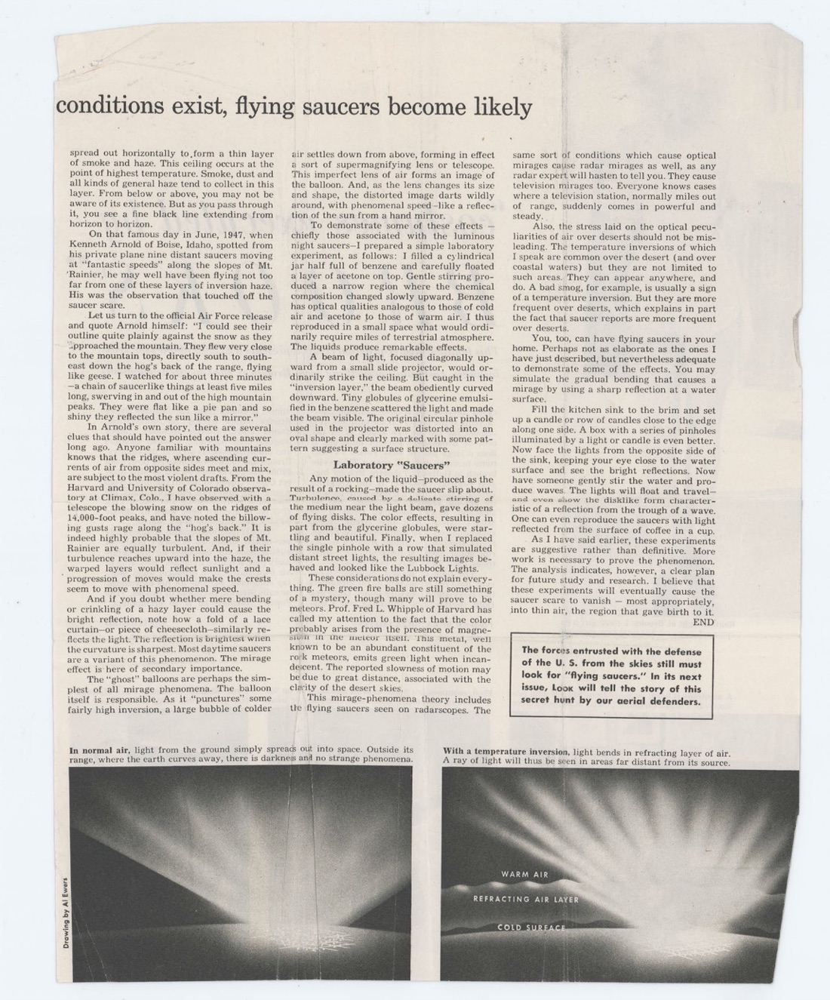

# FBI 62-HQ-83894 案卷 #006 ─ Section 6：New Mexico Green Fireball、Project Twinkle、Dr. La Paz、Skyhook 解釋、Menzel 倒置層理論

| 欄位 | 內容 |
|---|---|
| 案卷編號 | `65_HS1-834228961_62-HQ-83894_Section_6` |
| 期間 | 1948-12 → 1952-04 |
| 頁數 | 271 頁 |
| 主軸 | New Mexico Sandia / Los Alamos / Kirtland 周邊的 Green Fireball 現象、Dr. Lincoln La Paz 的流星專家判定「不是流星」、Land-Air Inc Alamogordo 民間承包科研、Belmont 1950-08-02 內部備忘錄、Dr. Urner Liddel ONR 1951「全是 Skyhook 氣球」公開反駁、1951-08-30 Lubbock Lights、1951-12 Dr. Donald Menzel LIFE 雜誌倒置層理論、1952-03-29 Baltimore Ritchie Highway OSI 調查發現偽證 |
| 官方 portal | <https://www.war.gov/UFO/#65_HS1-834228961_62-HQ-83894_Section_6> |

## 開場：核設施上空的綠光

[#004 Section 4 §6](../004-65_hs1-834228961_62-hq-83894_section_4/report.md) 介紹過 1949-02-16 Los Alamos「Green Fireball Phenomena」會議。Section 6 把這個會議之後 3 年的後續完整鋪開。

1948-12-05 到 1949-04 之間，New Mexico 三大核設施 ─ Los Alamos 國家實驗室、Sandia National Laboratories、Kirtland 空軍基地 ─ 周邊上空出現一系列「綠色火球」現象。物體不像隕石（沒有由暗轉亮的軌跡、水平飛行、無聲），不像飛機（無雷達回波），也不像氣象球（軌跡太穩定）。1949 年 1 月起，多位 Los Alamos 物理學家親自目擊，包括 Dr. Edward Teller 在內。

Sandia 警衛、Kirtland 控制塔、Los Alamos 內部員工 ─ 這些都是有 Q-clearance 的人。他們看到的東西必須處理。Section 6 收進的是 1948-12 到 1952-04 之間 FBI 對 New Mexico Green Fireball 案件的內部備忘錄、Project Twinkle 文件、Dr. La Paz 的流星專家鑑定、Land-Air Inc 民間承包合約、以及 1951-1952 年公開媒體上空軍試圖把整個 UFO 議題「自然化」的論述工具：Dr. Urner Liddel 的 Skyhook 氣球解釋和 Dr. Donald Menzel 的倒置層理論。

## §1 1950-08-02 Belmont 內部備忘錄：New Mexico 仍未解決

p-002 是 Section 6 第一份重要文件 ─ 1950-08-02 A. Belmont 寫給 D. M. Ladd 的內部備忘錄，標題「SUMMARY OF AERIAL PHENOMENA IN NEW MEXICO」。Belmont 後來會成為 FBI Domestic Intelligence Division 副處長，1950 年他是 D. M. Ladd 的直屬下屬。

> Purpose: To advise that: (1) OSI has expressed concern in connection with the continued appearance of unexplained phenomena described as green fireballs, discs and meteors in the vicinity of sensitive installations in New Mexico. (2) Dr. La Paz, Meteor Expert of the University of New Mexico, reported that the phenomena does not appear to be of meteoritic origin. (3) OSI has contracted with Land-Air Inc., Alamogordo, New Mexico, to make scientific study of the unexplained phenomena.
>
> 目的：告知：（1）OSI 對 New Mexico 敏感設施周邊持續出現的不明現象（被描述為綠色火球、圓盤和流星）表示關切；（2）New Mexico 大學流星專家 Dr. La Paz 報告，該現象似乎並非流星起源；（3）OSI 已與位於 New Mexico Alamogordo 的 Land-Air Inc. 簽約，對這些不明現象進行科學研究。

備忘錄把現象分成三類：

> 1. Green fireballs, objects moving at high speed in shapes resembling half moons, circles and discs emitting green light.
>
> 2. Discs, round flat shaped objects or phenomena moving at fast velocity and emitting a brilliant white light or reflected light.
>
> 3. [未完整列出，後文應為「Meteors」之常規隕石類別]
>
> 1. 綠色火球：高速移動、形狀像半月、圓形、圓盤，發綠光的物體。
>
> 2. 圓盤：高速移動、圓形扁平的物體或現象，發亮白光或反射光。
>
> 3. 流星

三類並列 ─ 第三類是常規流星，前兩類是「未知」。OSI 對前兩類的關切是 Section 6 的核心政策議題。

備忘錄裡記下「Observations of aerial phenomena occurring within the vicinity of sensitive installations have been recorded by the Air Force since December, 1948」（空軍自 1948-12 起記錄敏感設施周邊的空中現象）。1948-12 是 Green Fireball 開始浮上檯面的時間點 ─ 跟 [#003 §8 退出令發出後 14 個月](../003-65_hs1-834228961_62-hq-83894_section_3/report.md) 形成有趣對照。

## §2 Project Twinkle：Dr. La Paz 與 Anomalous Luminous Phenomena

p-029 是 Section 6 內部一份未署日期的技術摘要，可能是 1950 年初 Project Twinkle 的方法論文件。Project Twinkle 1949-12 成立，由 Holloman AFB（New Mexico）和 University of New Mexico 的 Dr. Lincoln La Paz 主導，使用 Askania cinetheodolite 攝影機 24/7 觀測 Vaughn NM 山頭上空。

文件記錄的觀測標準：

> Anomalous Luminous Phenomena... Green fireballs do not appear to move horizontally; rarely observed near horizon. However observed in three groups of:
> - cosmic meteors (occurring rarely)
> - meteorite falls (visible in dust)
> - local fireballs (occurring locally only)
>
> 異常發光現象……綠色火球似乎不會水平移動；很少在地平線附近觀測到。然而觀測到三個族群：
> - 宇宙流星（極少發生）
> - 流星墜落（在塵埃中可見）
> - 局部火球（僅在局部出現）

「local fireballs」這個分類 ─ 只在 New Mexico 核設施周邊出現的「局部」火球 ─ 是 Project Twinkle 給 Green Fireball 的工作分類名稱。Dr. La Paz 作為流星專家，明確排除「Green Fireballs = 常規流星」這個解釋。

文件還記下 Project Twinkle 的觀測週期：

> Since most of the green fireballs are visible from one to four days, it would be desirable to maintain the observation post... cloudiness can interfere
>
> 由於多數綠色火球持續可見一到四天，理想做法是維持觀測站……雲量會干擾觀測

觀測週期 1 到 4 天 ─ 比一般流星（持續秒級）長 4 個量級。Project Twinkle 從 1949-12 持續到 1951-12，但是因為 Askania 攝影機從未捕捉到清晰影像，最終結果不確定。

## §3 New Mexico 案件比較表：Las Cruces、Alamogordo、Killeen

p-049、p-053、p-058 是 Section 6 中段的兼比較表 ─「Summary of Sightings of Unknown Aerial Phenomena」。欄位：

| 欄位 |
|---|
| Number of Observers（目擊人數）|
| Reliability of Observers（目擊者可信度）|
| General Description（總體描述）|
| Time / Area of Occurrence（發生時間與地點）|
| Altitude（高度）|
| Apparent Course Horizontal to Vertical（表觀軌跡水平／垂直）|
| Apparent Direction of Flight（表觀飛行方向）|
| Manner of Disappearance（消失方式）|
| Duration of Observation（觀測時長）|

地點集中在三處：
- **Las Cruces, New Mexico**（接近 White Sands 飛彈試驗場）
- **Alamogordo, New Mexico**（Holloman AFB、Project Twinkle 中心、Land-Air Inc 駐地）
- **Killeen, Texas**（Fort Hood 軍方設施）

跟 [#009 AFBIR-CO 18 件全國比較表](../009-65_hs1-834228961_62-hq-83894_serial_130/report.md) 不同，Section 6 的比較表把目擊集中在 New Mexico 三點 + Fort Hood 的「敏感設施群」。1948-12 到 1950 年的 USAF 累積已經建立起「核設施 / 飛彈試驗場上空有異常物體」這個量化證據基線。

## §4 Dr. Urner Liddel：「全部都是 Skyhook 氣球」

p-114 到 p-115 是 1951-01 LOOK 雜誌的長篇文章〈Physicist Exposes FLYING SAUCERS〉的剪報，作者 Richard Wilson（LOOK 的 Washington Bureau）。文章的中心人物是 Dr. Urner Liddel，海軍 Office of Naval Research（ONR）核物理分部主任。

文章開頭：

> A 10-page report by the nuclear physics branch of the Office of Naval Research has given the answer:
>
> 海軍研究局核物理分部一份 10 頁的報告給出了答案：

> Flying saucers were, and are, undeniably real. They are part of a basic research program of the Federal Government which is as important, if not so dramatic, as the visitation from Mars feared by an imaginative public.
>
> 飛碟過去和現在都無可否認是真的。它們是聯邦政府基礎研究計劃的一部分，雖然沒有想像力豐富的公眾所擔心的「火星訪客」那麼戲劇性，但同樣重要。

Liddel 的論點：所有飛碟目擊都是 Skyhook 計劃的高空氣球。Skyhook 是 ONR 從 1947 年起執行的研究計劃，使用直徑 100 英尺、氦氣填充的塑膠氣球，把宇宙射線測量儀升到 100,000 英尺以上的大氣層研究放射線。

p-114 的配圖是「Skyhook balloon 77,000 feet over Minneapolis」（Skyhook 氣球在 Minneapolis 上空 77,000 英尺）的照片，從追蹤望遠鏡拍攝。文章配圖文字：

> To Dr. Urner Liddel of the nuclear-physics branch of the Office of Naval Research, this is the first visual confirmation of his explanation for the hundreds of "flying saucer" reports.
>
> 對海軍研究局核物理分部的 Dr. Urner Liddel 而言，這是他對數百起「飛碟」通報解釋的第一次視覺確認。

文章左下角的圖文：

> Nearing the launch point, above, [the balloon] clearly resembles a "flying saucer."
>
> 在發射點附近（上圖），氣球明顯像「飛碟」。

Liddel 的詳細機制（p-115）：

> The lateral rays of the sun at dusk illuminate the base of the balloon. There is no chance of your ever seeing the full roundness of it because you are so far below it. You see only the illuminated cup of the bottom. If your imagination soars, the light reflection on one side may impress you as the glow of an atomic engine. The wisp of the balloon's instrument-filled tail may impress you as the exhaust.
>
> 黃昏時太陽的橫向光線照亮氣球底部。你絕對不可能看到它的完整圓形，因為你離它太遠太低。你只看到被照亮的底部杯狀。如果你想像力豐富，光線在一側的反射可能讓你覺得像原子引擎的光芒。氣球儀器尾部的細絲可能讓你覺得像排氣。

Liddel 的策略：他承認飛碟「是真的」，但「真實」的內容是 ONR 自己的氣球，不是火星人。1951-01 LOOK 雜誌讀者讀完這篇後，可以放心：（1）政府確實在做秘密研究 ─ 這是好事；（2）外星人不存在 ─ 這是定論。

文章結尾：

> "There is no longer any need for secrecy," says Navy scientist, after finding that his own research started the "saucers."
>
> 「不再需要保密了，」海軍科學家在發現自己的研究造成「飛碟」之後說。

Liddel 把整個 1947 飛碟潮歸因到自己的 Skyhook 計劃。然而 Section 6 把這篇文章收進 FBI 案卷，配上 Belmont 內部備忘錄裡「Green Fireball 不像氣球軌跡」的 Dr. La Paz 結論 ─ FBI 1951 年內部沒有完全相信 Liddel 的論述。Liddel 的解釋對民眾有效，對內部分析師不一定有效。

## §5 1952-03-29 Baltimore Ritchie Highway：OSI 抓到偽證

p-153 是 1952-04 USAF OSI 寫的 Report of Investigation，主題「Sighting of Unidentified Aerial Object, Ritchie Highway, NE Baltimore, Maryland, 29 March 1952」。

> Investigation requested by Hq, OSI Air Technical Intelligence Center, in the vicinity of Baltimore.
>
> 調查由 OSI Air Technical Intelligence Center 總部要求，在 Baltimore 附近進行。

對象是 Mr. Corbin Tyler III、Mr. Amoss（一位 Westinghouse 工程師）、以及 Stewart。Tyler 起初報告 1952-03-29 看到「飛機狀」物體懸停在 200 英尺空中，地點接近 US Route 3 路口。Amoss 訪談時否認看到任何此類飛機，他在 Gibson Island 居住。

但訪談 Tyler 後，他改口：

> however, upon reinterview, [Tyler] admitted that... at the time of the alleged sighting... STEWART had asked him to...
>
> 然而再訪談時，Tyler 承認……所謂目擊發生時……STEWART 要求他……

OSI 抓到偽證。Tyler 是被 Stewart 要求做假證的。OSI 把整個案件的證據鏈追到底，發現是社交圈內的偽造。Section 6 收進這份 OSI 報告，意味著 FBI 把「偽證的飛碟案」也歸進案卷，作為「不是所有目擊都是真的」的內部證據。

這個案例放在 Liddel Skyhook 文章後面有特定的編輯邏輯：先給讀者「自然氣球」的官方解釋，再給「偽證」案例做佐證。FBI 內部 1952 年的分析框架：絕大多數通報都可以用 (1) 氣象球 (2) 流星 (3) 心理暗示 (4) 偽證 解釋。剩下無法解釋的小數量，留給 ATIC（Project Blue Book）處理。

## §6 1951-12 Dr. Donald Menzel LIFE 雜誌：倒置層理論

p-257、p-259、p-260 是 1951-12 LIFE 雜誌 Dr. Donald H. Menzel（Harvard 天文學家）長篇文章〈Flying Saucers Are They Real?〉的剪報。Menzel 是 1950 年代最有影響力的 UFO 反駁者，後來在 1953 年出版專書《Flying Saucers》，1963 年再版《The World of Flying Saucers》。

p-257 的內文是 Menzel 描述自己親身目擊：

> Gemini. Then, very suddenly, I realized that Gemini was a winter object; the two stars had to be something else.
>
> 雙子座。然後我突然意識到，雙子座是冬天的星座；那兩顆「星」必定是別的東西。

> Like most astronomers, I am always hopeful of finding a nova (exploding star) which can be seen with the naked eye, so I rapidly opened the window of the car for a better look. I could bring neither of these objects into clear focus, although nearby Antares was sharp. Both hazy disks shone with a slightly bluish light.
>
> 像大多數天文學家，我總是希望發現一顆能用肉眼看到的新星（爆炸星）。我趕緊打開車窗看得更清楚。我無法把這兩個物體對焦到清晰，雖然附近的 Antares 是銳利的。兩個朦朧的圓盤都發出略帶藍色的光。

> Suddenly, alive to the fact that I was seeing something unusual, I asked the driver to stop. We climbed out of the car just in time to see the saucers literally fade away as mysteriously as they had appeared.
>
> 突然意識到我看到了不尋常的東西，我請司機停車。我們下車剛好看到那些飛碟神秘地淡出消失，就跟它們神秘出現一樣。

> I reported the occurrence in detail to the Air Force.
>
> 我向空軍詳細報告了這次事件。

Menzel ─ 一位 Harvard 天文系主任、自己看到飛碟、報告給空軍 ─ 然後用整篇 LIFE 文章解釋為什麼那不是真的飛碟。這個敘事姿態的價值在於：作者自己已經目擊過、不能說「我沒看過所以不信」、必須提出科學解釋。

Menzel 的論點（p-257 後段）：

> I do Not believe that what I saw, or anything anyone has reported seeing, were missiles or messengers or vehicles from the moon or Mars or space.
>
> 我不相信我看到的、或任何人通報看到的，是來自月球、火星、太空的飛彈、信使或飛行器。

> I shall explain those ideas, but first let me say what I do Not believe. I have certain ideas on the subject, but they are only hypotheses—reasonable but not yet fully confirmed.
>
> 我會解釋我的想法，但先說我不相信什麼。我對這個主題有些想法，但只是假說 ─ 合理但尚未完全證實。

p-259 是 Menzel 對 Arnold 1947-06-24 Mt. Rainier 案的詳細「解釋」：

> On that famous day in June, 1947, when Kenneth Arnold of Boise, Idaho, spotted from his private plane nine distant saucers moving at "fantastic speeds" along the slopes of Mt. Rainier, he may well have been flying not too far from one of these layers of inversion haze.
>
> 1947 年 6 月那個著名日子，Boise Idaho 的 Kenneth Arnold 從他的私人飛機上看到九個遙遠的飛碟以「不可思議的速度」沿著 Mt. Rainier 山坡移動，他很可能就飛在這些倒置霾層附近。

> His was the observation that touched off the saucer scare.
>
> 他的觀察觸發了飛碟恐慌。

Menzel 的「倒置層理論」：大氣中存在溫度倒置層，下方冷上方熱，邊界處空氣折射率變化，產生光學透鏡效應。Arnold 看到的「碟」是太陽光透過倒置層折射在 Mt. Rainier 山坡上的高亮反射 ─ 不是物體。

> Anyone familiar with mountains knows that the ridges, where ascending currents of air from opposite sides meet and mix, are subject to the most violent drafts. From the Harvard and University of Colorado observatory at Climax, Colo., I have observed with great accuracy...
>
> 任何熟悉山的人都知道，山脊處兩側上升氣流相遇混合，氣流最劇烈。從位於 Colorado Climax 的 Harvard 與 Colorado 大學天文台，我曾以極高精度觀察……

「我從 Harvard-Colorado 天文台觀察過」這個自我引用，把 Menzel 的 authority 加碼到 Liddel 的論述之上。Liddel 是 ONR 核物理；Menzel 是 Harvard 天文系主任。

文章的配圖（p-257）：

> These are the Lubbock Lights, as photographed Aug. 30, 1951, over Lubbock, Texas, by 18-year-old Carl Hart, Jr.
>
> 這是 Lubbock Lights，由 18 歲的 Carl Hart Jr. 於 1951-08-30 在 Texas Lubbock 上空拍攝。

**Lubbock Lights** 是 1951-08-25 到 1951-09-05 之間 Lubbock TX 上空多次出現的 V 字形光列。Carl Hart Jr. 1951-08-30 用 Kodak Reflex 相機拍到 5 張清晰照片，後來成為 1950 年代最有名的 UFO 照片證據。Menzel 的 LIFE 文章把這張照片放在「Orderly processes of natural laws explain saucers」（自然規律的有序過程解釋飛碟）這個副標題下，作為「自然現象」的展示案。

但 Menzel 在文章內並沒有給出 Lubbock Lights 的具體自然解釋。他只是把照片放在那裡，附上「自然規律」的標題。1951-12 的 LIFE 讀者讀完，得到的訊息是「Menzel 是 Harvard 教授、他看過、他解釋過、所以一切都是自然現象」。實際的物理機制？文章裡只說了「倒置層」這個關鍵詞，沒有給 Lubbock Lights 對應的計算。

## 整段時間軸

| 日期 | 事件 |
|---|---|
| 1948-12-05 | New Mexico 核設施周邊綠色火球現象開始記錄 |
| 1949-01 | Los Alamos 物理學家（含 Teller）親自目擊 Green Fireballs |
| 1949-02-16 | Los Alamos「Green Fireball Phenomena」會議（[#004 §6](../004-65_hs1-834228961_62-hq-83894_section_4/report.md)）|
| 1949-12 | Project Twinkle 成立，Dr. La Paz + Holloman AFB |
| 1950-08-02 | A. Belmont 寫給 D. M. Ladd 內部備忘錄總結 NM 現象 |
| 1950-08-02 | OSI 簽約 Land-Air Inc. Alamogordo 做科研 |
| 1951-01 | LOOK 雜誌 Richard Wilson〈Physicist Exposes Flying Saucers〉Liddel Skyhook 文章 |
| 1951-08-25 → 09-05 | Lubbock Lights TX 多次目擊 |
| 1951-08-30 | Carl Hart Jr. 拍到 Lubbock Lights 5 張照片 |
| 1951-12 | LIFE 雜誌 Dr. Donald Menzel〈Flying Saucers Are They Real?〉文章 |
| 1951-12 | Project Twinkle 結束 |
| 1952-03-29 | Baltimore MD Ritchie Highway 目擊 |
| 1952-04 | OSI 投以調查並抓到偽證（Tyler / Stewart）|

## 觀察一：FBI 內部 vs FBI 公開立場的雙重結構

Section 6 的兩半結構非常清楚：

前半（p-002 到 p-100）：FBI 內部備忘錄、Project Twinkle 技術文件、New Mexico 三點比較表 ─ 都顯示「敏感設施上空有未解釋的綠色火球，Dr. La Paz 排除流星解釋，OSI 簽約承包民間研究」。

後半（p-100 到 p-260）：LOOK 雜誌 Liddel Skyhook、LIFE 雜誌 Menzel 倒置層 ─ 都顯示「全是自然現象、不是飛碟、不需要擔心」。

兩半並列存在於同一個案卷裡。FBI 1951-1952 年的內部分析師可以同時看到「核設施周邊未解之謎」（前半）和「主流媒體已成功把議題自然化」（後半）。這個雙重結構不是矛盾，是 FBI 1952 年的政策運作模式：內部繼續關注、外部不挑戰主流敘事。

## 觀察二：1951 年的兩位「權威科學家」分工

1951-01 Liddel（ONR）和 1951-12 Menzel（Harvard）兩位科學家對公眾講同一個結論「飛碟不是外星人」，但用不同的論述工具：

| 學者 | 機構 | 媒體 | 解釋機制 |
|---|---|---|---|
| Dr. Urner Liddel | Office of Naval Research 核物理分部 | LOOK 雜誌（1951-01） | Skyhook 高空氣球的光學錯覺 |
| Dr. Donald Menzel | Harvard 天文系主任 | LIFE 雜誌（1951-12） | 大氣倒置層光學折射 |

Liddel 的角色是「政府內部秘密研究曝光」─ 他承認 ONR 在做秘密的 Skyhook 計劃，但說那不可怕，反而值得驕傲。Menzel 的角色是「外部學界權威確認」─ 他是 Harvard 天文系主任，自己看過、自己解釋過、不是政府人員。兩位學者一前一後 11 個月內出來，在主流媒體上把整個飛碟議題「自然化」。FBI 把兩篇文章都收進案卷，等於是把 1951 年的整套官方論述工具完整保存。

## 觀察三：偽證案的編輯位置

p-153 的 Baltimore Ritchie Highway 偽證案放在 Liddel Skyhook 文章之後、Menzel 倒置層文章之前，這個位置不是巧合。FBI 1952-04 的編輯邏輯：第一層用「自然現象」解釋（氣球、倒置層），第二層用「偽造」解釋（Tyler/Stewart），第三層留給 ATIC 處理無法用前兩層解釋的剩餘案件。Section 6 的整體編排顯示 1952 年的 FBI 已經把 UFO 議題建構成「層層篩過後幾乎一定可以分類掉」的分析框架。Bureau Bulletin #57 的「FBI 不調查」立場仍然成立，但 FBI 對 UFO 議題的分類學能力 ─ 而非調查能力 ─ 已經被精細化。

## 跨檔連結

- [#001 Section 10](../001-65_hs1-834228961_62-hq-83894_section_10/report.md) ─ 1949-1950 Oak Ridge + 推進系統技術提案
- [#003 Section 3](../003-65_hs1-834228961_62-hq-83894_section_3/report.md) ─ 1947 飛碟潮 + 退出令
- [#004 Section 4 §6](../004-65_hs1-834228961_62-hq-83894_section_4/report.md) ─ 1949-02-16 Los Alamos Green Fireball 會議
- [#007 Section 7](../007-65_hs1-834228961_62-hq-83894_section_7/report.md) ─ 1948-1953 Gorman + New Yorker + Washington DC 雷達
- [#008 Section 9](../008-65_hs1-834228961_62-hq-83894_section_9/report.md) ─ 1957 Sputnik 後飛碟潮
- [#009 Serial 130](../009-65_hs1-834228961_62-hq-83894_serial_130/report.md) ─ 1947 ADC 全國比較表（與 Section 6 New Mexico 比較表對照）

## 來源

US Department of War, PURSUE FOIA Release, 2026-05-08
65_HS1-834228961_62-HQ-83894_Section_6
<https://www.war.gov/UFO/#65_HS1-834228961_62-HQ-83894_Section_6>
