# FBI 62-HQ-83894 案卷 #007 ─ Section 7：1948 Gorman Fargo 空戰、1950 New Yorker 對 Project Saucer 的深度報導、1952-07 Washington DC 雷達視覺案、IFSB 與 Men in Black 神話起源

| 欄位 | 內容 |
|---|---|
| 案卷編號 | `65_HS1-834228961_62-HQ-83894_Section_7` |
| 期間 | 1948-10 → 1953-07 |
| 頁數 | 205 頁 |
| 主軸 | Gorman P-51 vs 圓盤 27 分鐘空戰、Daniel Lang 在 New Yorker 1952-09-06 對 Project Saucer 的長篇報導、1952-07-19/20 Washington National Airport 雷達 10 個回波、1952-08-08 Savannah River AEC 廠目擊、1952-10 國際浪潮（Air France 飛行員、Korea 戰場、Gaillac 法國「融化」飛碟）、Albert Bender 的 IFSB 國際飛碟局 + Gray Barker 在 WV 當代表 |
| 官方 portal | <https://www.war.gov/UFO/#65_HS1-834228961_62-HQ-83894_Section_7> |


## 開場：從 Gorman 空戰到 Washington 雷達案

[#004 Section 4](../004-65_hs1-834228961_62-hq-83894_section_4/report.md) 結尾停在 1949-06-30 Whitson 處理 Rhodes 案的兩年後追訊。Section 7 從那之後接著走，但時間軸跳到 1948-10-01 ─ 在 [#009](../009-65_hs1-834228961_62-hq-83894_serial_130/report.md) ADC 卷宗之後、[#004](../004-65_hs1-834228961_62-hq-83894_section_4/report.md) 開頭之前那段空隙。Section 7 收的是這段空隙的關鍵案件，加上 1950 到 1953 之間 UFO 從「軍方內部議題」轉變為「全國公共議題」這個過程的記錄。

讀完 Section 7 可以看到幾條主軸：

1. **空中對抗**：1948-10-01 Gorman 在 Fargo 上空用 P-51 跟一顆光球做 27 分鐘 dogfight，這是飛碟史上第一次正式記錄的飛行員空中追逐
2. **公共敘事**：1950 年 New Yorker 雜誌 Daniel Lang 的長篇報導，把 Project Saucer 帶進主流知識分子讀者群
3. **雷達證據**：1952-07-19/20 + 7-26/27 Washington DC 雷達視覺案（Capitol 上空 10 個雷達回波 + Andrews AFB 噴射機攔截）
4. **AEC 設施穿越**：1952-08-08 Savannah River Plant 上空目擊
5. **國際浪潮**：1952-10 法國、挪威、瑞典、波多黎各、Korea 戰場同月內同步出現
6. **民間組織化**：IFSB（International Flying Saucer Bureau）成立、SPACE REVIEW 雜誌、Albert K. Bender 與 Gray Barker 後來孕育「Men in Black」神話的關係

## §1 1948-10-01 Gorman Fargo 空戰

p-079 的剪報記錄了 Lt. George F. Gorman 的證詞。Gorman 是 North Dakota Air National Guard 飛行員，二戰退役 P-51 Mustang 駕駛。1948-10-01 晚上，他剛在 Fargo 自治市機場做完一次練習飛行，向塔台請求降落許可時看到「另一架飛機尾燈」在他正前方 8,000 碼處：

> Gorman queried the tower, and the men then reported that the only other aircraft near the field was a Piper Cub. Gorman could see the Cub plainly outlined below him.
>
> Gorman 問塔台，回答是場內附近唯一另一架飛機是 Piper Cub。Gorman 能清楚看到下方輪廓分明的 Cub。

下方是 Cub，但前方還有「另一個光」。

> As I approached, the light suddenly became steady and pulled into a sharp left bank. I dove after it and brought my manifold pressure up to sixty inches, but I couldn't catch up with the thing. It started gaining altitude and again made a left bank. I put my P-51 into a sharp turn and tried to cut the light off in its turn. By this time we were at about seven thousand feet. Suddenly it made a sharp right turn and we headed straight at each other.
>
> 我接近時，那道光突然穩定下來，急轉左滾。我俯衝追過去，把進氣壓推到 60 英寸，但追不上那東西。它開始爬升，再次急轉左滾。我把 P-51 急轉，想在它轉彎時截住它。這時我們都在約 7,000 英尺。突然它急轉右滾，我們直接面對面。

Gorman 描述的物體：「約 6 到 8 英寸直徑、清晰白色、完全圓形、邊緣沒有任何輪廓或可分辨形狀、看起來像融化金屬的邊緣」。整段空戰持續 27 分鐘。Gorman 全程在無線電上與塔台和地面雷達同步通話，CAA（Civil Aeronautics Administration）雷達確認了該物體的軌跡。

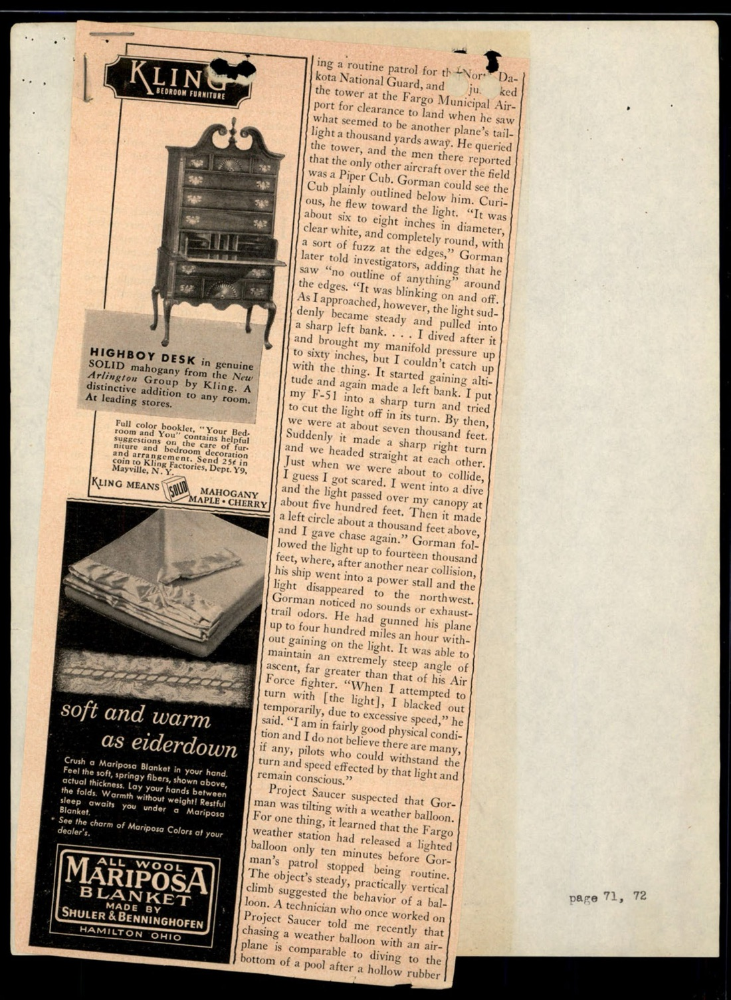

Gorman 空戰後來成為 Project SIGN（剛從 SIGN 改為 GRUDGE 前一個月）的標誌性案例。空軍最初的結論是「氣象氣球」（Skyhook 高空氣球），但 Gorman 自己拒絕接受這個解釋 ─ 氣球不會在 7,000 英尺以 600 mph 級的速度急轉俯衝。FBI 把這份 Fargo Forum 剪報歸進案卷，沒有評論。

## §2 1950 New Yorker Daniel Lang〈SOMETHING IN THE SKY〉

p-075 到 p-078 是 1950 年 New Yorker 雜誌 Daniel Lang 的長篇報導〈SOMETHING IN THE SKY〉的剪報。這份文件對 FBI 案卷意義重大：它是第一篇把 Project Saucer 的完整輪廓帶進主流知識分子讀者圈的深度報導。

開頭：

> In the midsummer of 1947, the United States Air Force, already concerned with such problems as the development of guided missiles and supersonic flight, found itself confronted by an objective, new and completely different, headed flying saucer.
>
> 1947 年仲夏，美國空軍正為導彈和超音速飛行等問題煩心時，遇到了一個全新、完全不同的目標：飛碟。

Lang 把背景鋪好之後切入空軍的兩個可能立場：

> There was certainly no harm in assuming for the moment that the era of interplanetary travel had arrived and the earth had become an objective for journeys from elsewhere in the solar system. Or—and this would not necessarily exclude the first two considerations—the Air Force may have been setting up a smoke screen to protect, in the interest of national security, the secret of some experimental flying objects of its own that only a trusted few of its members knew about.
>
> 假設行星際旅行時代已經到來、地球已成為太陽系其他地方飛行任務的目標 ─ 這個假設沒有壞處。或者 ─ 且這不必然排除前兩個假設 ─ 空軍可能在製造煙霧屏障，為了國家安全的利益，保護某些只有少數受信任成員知道的實驗性飛行物的秘密。

> Whatever the purpose, the investigation, with which I have been in touch from time to time, has seemingly been exhaustive.
>
> 無論目的為何，我不時接觸到的這項調查，看似已經詳盡。

Lang 描述 Project Saucer 的人員組成：

> The Air Force personnel originally assigned to it was later augmented by astronomers, psychologists, physicists, meteorologists, physicians, and representatives of the F.B.I.
>
> 最初指派的空軍人員後來擴編，加入天文學家、心理學家、物理學家、氣象學家、醫師、以及 FBI 代表。

「FBI representatives」這個說法後來變成 FBI 內部抗議的爆點（見 §6）。

Lang 接著進入個案分析：

> In December, 1949, after checking, over a period of two years, three hundred and seventy-five reports of intruders in the sky, the Air Force publicly called it quits, but Project Saucer was not actually disbanded.
>
> 1949 年 12 月，空軍在花了兩年檢視 375 件天空入侵者通報後，公開宣布收場，但 Project Saucer 並未真正解散。

> National security, the Air Force announced at the time, was not endangered. The flying saucers were apparitions, it said, all attributable either to a failure to recognize conventional objects, to hoaxes, or to a mild form of mass hysteria.
>
> 空軍當時宣布，國家安全並未受威脅。它說飛碟是幻象，全部可歸因於：未能辨識常規物體、惡作劇、或輕度集體歇斯底里。

「Apparitions」這個字 Lang 在報導裡用得很重 ─ 空軍 1949-12 的官方說法是「飛碟是幻象」。但 Lang 後續描述顯示這個說法在 1950 年代初就站不住腳。

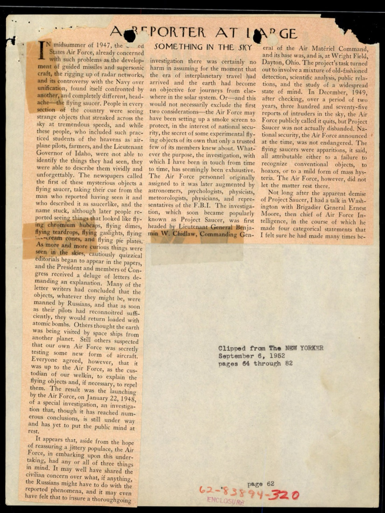

p-076 是 Lang 對 1947 年第一輪飛碟潮的回顧：

- **Kenneth Arnold**（1947-06-24, Mt. Rainier）：「a chain of saucerlike things at least five miles long, swerving in and out of the high mountain peaks」（至少 5 英里長的碟狀物體鏈，在高山峰之間穿梭）
- **Lieutenant Governor Donald Whitehead of Idaho**：「a comet-shaped object over the western part of the State that finally dipped below the horizon」(Idaho 副州長看到彗星狀物體) ─ Project Saucer 後來判定他看到的是水星或金星
- **波特蘭 4 位警官**：看到一群圓盤「wobbling, disappearing, and reappearing」
- **Fort Richardson, Alaska 2 位陸軍軍官**：看到球形物體高速無尾跡飛行
- **紐芬蘭外海漁民**：「a series of aerial flashes, silver to reddish in color」 ─ 同 [#009 §3 Burgeo](../009-65_hs1-834228961_62-hq-83894_serial_130/report.md) 的目擊案
- **Oregon 一位印地安人**：看到一群飛碟「拼出 1」並警告鄰居「我們空中有外國特務在練習秘密代碼」
- **Oklahoma City**：碟「the bulk of six B-29s」（6 架 B-29 那麼大）
- **Cascade Mountains 探勘員**：6 個飛碟編隊「round, silent, and not flying in formation」
- **1947-07-04**：全美 12 件分散通報，Trenton NJ 那件追查是煙火表演

最關鍵的一段是 Lang 引述 **Dr. Paul Schmidt**（Ohio State University 心理學家、Project Saucer 借調人員）的解釋：

> Dr. Paul Schmidts, an Ohio State University psychologist who was for a time attached to Project Saucer, considered this crowded condition in the holiday skies the result of mass suggestibility, the same jumpy trait that caused Americans to see Zeppelins overhead during and after the First World War.
>
> Ohio 州立大學心理學家、曾借調 Project Saucer 的 Paul Schmidt 博士認為，假日天空的擁擠狀況是集體暗示性的結果 ─ 同一個過敏特質，讓美國人在第一次世界大戰中和戰後看到天空中有 Zeppelin 飛艇。

把飛碟跟 WWI 後 Zeppelin 幻覺做類比 ─ 這個敘事策略後來被 1968 年 Condon Report 直接沿用。

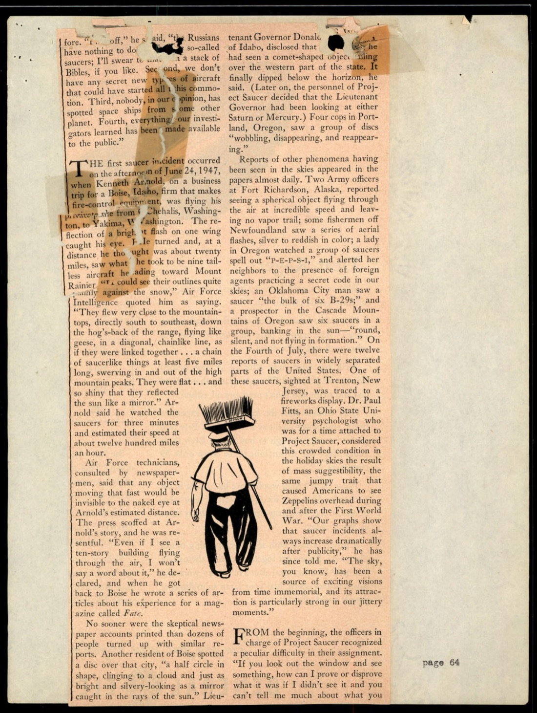

p-077 是 Lang 引述 Major Goeppe（？─ OCR 不清楚，可能是 Major Goeppinger）的長段哲學討論：

> "It is impossible to prove, logically and with finality, a double negative—that is, that there are no flying saucers and that people have not seen flying saucers. The best we could do under the circumstances was to deduce, first, from the fact that it had not been proved, that flying saucers had been seen and, second, from the fact that reasonable theories could be advanced to explain away all the reports of seeing them, that probably nobody had seen them at all."
>
> 「邏輯上不可能最終證明一個雙重否定，也就是：飛碟不存在、且人們沒有看到飛碟。在這種情況下，我們能做的最好的事是：第一，從『飛碟被看到』未被證明的事實推論；第二，從『所有目擊報告都可以用合理理論解釋掉』的事實推論。從這兩點推出：可能根本沒人看到任何東西。」

> "The fewer the theoretical explanations and the more reason there was for suspecting people had seen saucers."
>
> 「理論解釋越少，懷疑人們確實看到飛碟的理由就越多。」

這段話的結構很微妙。Major 先建立空軍的官方立場（無法證明雙重否定，所以推論可能沒人真正看到），然後用一句反向陳述（理論越少，越要懷疑人們真的看到了）暗中翻轉。Lang 把這段哲學討論放進報導，等於把空軍內部的不確定態度透露給讀者。

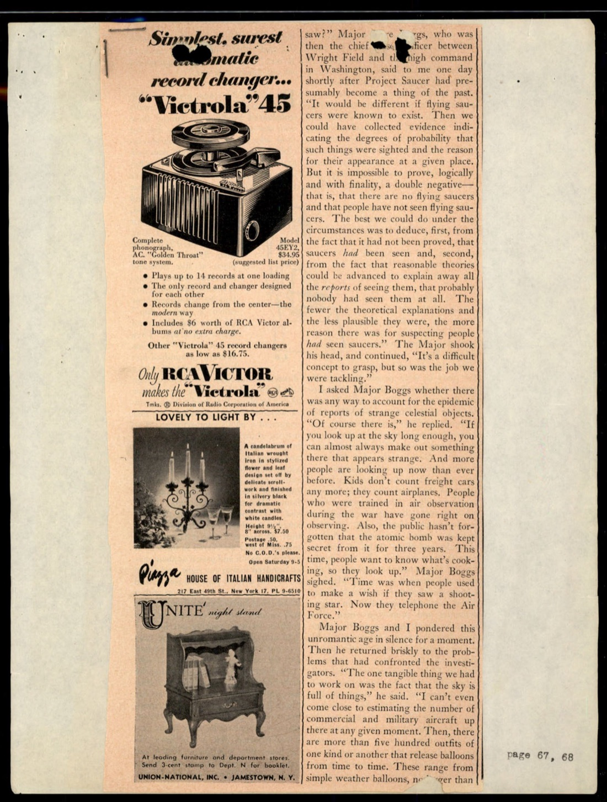

p-078 是 Lang 對 [#004 §3 Chiles-Whitted 案](../004-65_hs1-834228961_62-hq-83894_section_4/report.md) 的詳細處理：

> The first question Project Saucer scientists faced was to determine whether the mysterious object was an aircraft that had been partially obscured by a rain storm. Two hundred and fifty weather reports were analyzed, and it was found that no other plane, an Air Force C-47, had been near the Eastern airliner at the time the mysterious object was seen.
>
> Project Saucer 科學家面對的第一個問題是：那個神秘物體是不是被雨遮蔽的飛機？分析了 250 份氣象報告，結論是 ─ 物體被看到時，附近沒有其他飛機，只有一架 Air Force C-47。

> Conjecture about the C-47 did not appear relevant, however, when the Macon ground crews agreed with Chiles and Whitted that anything from elsewhere wouldn't have had to get from Macon to Montgomery in an hour like that.
>
> 但 C-47 的推測似乎也不相關 ─ Macon 地勤同意 Chiles 和 Whitted 的說法：任何其他來源的東西，不會在一小時內從 Macon 飛到 Montgomery。

> Astronomers went to work on the problem. Dr. Hynek considered the possibility that a brilliant, daytime meteor might be the explanation. Various bits of the apparition's description—"flame-shaped," "a tremendous flame."—Unfortunately, the meteor theory could not be reconciled with...
>
> 天文學家著手處理。Hynek 博士考慮了「白晝出現的明亮流星」這個可能解釋。幽靈描述中有些片段 ─「火焰狀」「巨大火焰」─ 不幸的是流星理論無法調和。

「Dr. Hynek」就是 J. Allen Hynek，後來 Project Blue Book 的科學顧問、UFO 研究史上「Close Encounter」分類的提出者。1950 年的 New Yorker 已經把他當作 Project Saucer 的科學分析權威。

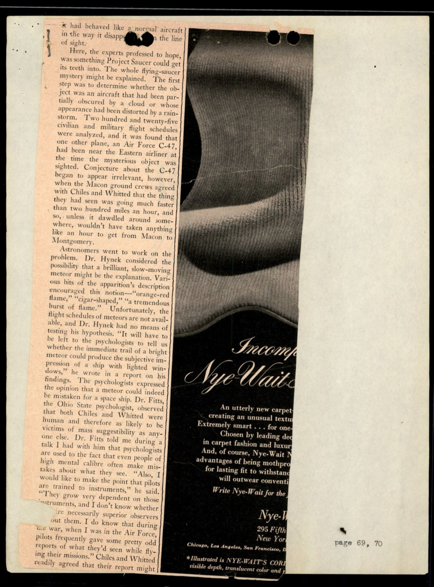

## §3 1952-08-08 Savannah River AEC 廠：DuPont 員工目擊

p-003 是 1952-08-08 FBI 內部 teletype，簡短但分量大：

> FLYING SAUCERS, SAVANNAH RIVER PLANT, AEC. SECURITY OFFICE OF E[C] ADVISED THIS DATE THAT TWO EMPLOYEES OF THE E. I. DU PONT COMPANY SAW A BLUE LIGHT WITH AN ORANGE FRINGE SHAPED LIKE A SAUCER FLY OVER THE FOUR HUNDRED AREA OF THE SAVANNAH RIVER PLANT AT APPROXIMATELY [EIGHT] THIRTY PM AUGUST EIGHT, FIFTYTWO. OBJECT FLYING AT A HIGH RATE OF SPEED AND TRAVELING IN A...
>
> 飛碟，Savannah River 廠，AEC。AEC 安全辦公室今日告知：E. I. DuPont 公司兩名員工於 1952-08-08 約晚上 8:30 看到一個藍色帶橙色邊緣、形狀像飛碟的物體飛越 Savannah River 廠 400 區。物體高速飛行……

Savannah River Plant 是 1950-51 年成立的 AEC 核武設施，位於 South Carolina 與 Georgia 邊界，由 DuPont 公司營運，生產 plutonium-239 和 tritium，供應 H-bomb 計劃。1952-08 美國第一顆 H-bomb（Ivy Mike）測試前 3 個月，Savannah River 廠正處於最敏感的時期。

兩位 DuPont 員工的目擊，因為發生在 AEC 設施內，安全辦公室必須立即報給 FBI。從 [#010 Oak Ridge Presley 1947-07 案](../010-65_hs1-834228961_62-hq-83894_serial_153/report.md) 到 1952-08 Savannah River 案，原子能設施上空的 UFO 通報始終是 FBI 案卷裡的高敏感子類別。

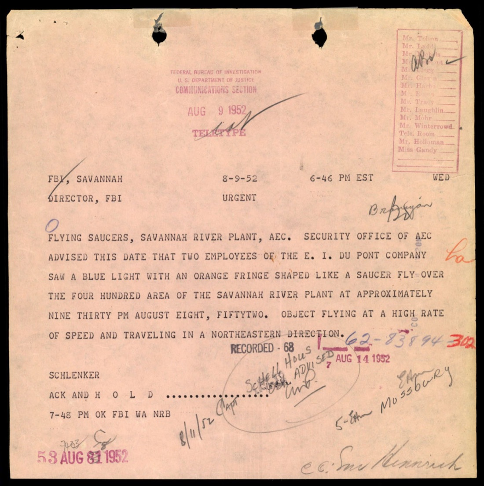

## §4 1952-07-19/20 Washington National Airport 雷達視覺案

p-083 是 Section 7 最重要的一段。報導內容描述 1952-07-19/20 凌晨 Washington National Airport 的事件，引述 Senior Controller Harry G. Barnes 的話：

> "There is no other conclusion I can reach but that for six hours on the morning of the twentieth of July there were at least ten unidentifiable objects above Washington."
>
> 「我能得出的唯一結論是：1952-07-20 早上六小時內，Washington 上空至少有十個無法識別的物體。」

> "They were not ordinary aircraft. Nor in my opinion could any natural phenomena account for these spots on our radar. Neither shooting stars, electrical disturbances, nor clouds could, either. Exactly what they are, I don't know. Now you know as much about them as I do. And your conjecture is as good as mine."
>
> 「它們不是普通飛機。我認為任何自然現象都無法解釋雷達上的這些光點。流星、電氣干擾、雲都不行。它們究竟是什麼，我不知道。現在你對它們的了解和我一樣。你的推測跟我的一樣好。」

Barnes 是 Air Route Traffic Control Center（ARTC）的資深管制員。他全程操作雷達 6 小時。地點精準：Washington 國家機場、Andrews 空軍基地、Bolling Field 三個機場的雷達同時看到回波。商業機飛行員在空中目視確認，部分回報「左翼有光」，Barnes 在雷達上找到對應 pip。

第二波發生在一週後：

> A week later, at 9:08 P.M. on [date], the Air Route Traffic Control Center's radarscope again showed unidentifiable objects over Washington. The screen at the Andrews [field], just outside the capital. Two jet interceptors, capable of doing six hundred miles an hour, were dispatched from a base near New Castle...
>
> 一週後，[日期] 晚上 9:08，Air Route Traffic Control Center 的雷達再次顯示 Washington 上空有無法識別的物體。Andrews 機場（緊鄰首都）的螢幕……兩架時速可達 600 mph 的噴射攔截機從 New Castle 附近基地起飛……

第二波是 1952-07-26/27。F-94 Starfire 噴射攔截機從 New Castle AFB（Delaware）起飛攔截。報導裡描述的「噴射機到場後雷達回波消失，噴射機離場後又出現」這個現象，後來被收入 Project Blue Book 的"Top 25 cases"。

這個案件直接迫使空軍在 1952-07-29 召開飛碟史上最大規模的記者會，由 Major General John A. Samford（空軍情報署署長）主持。

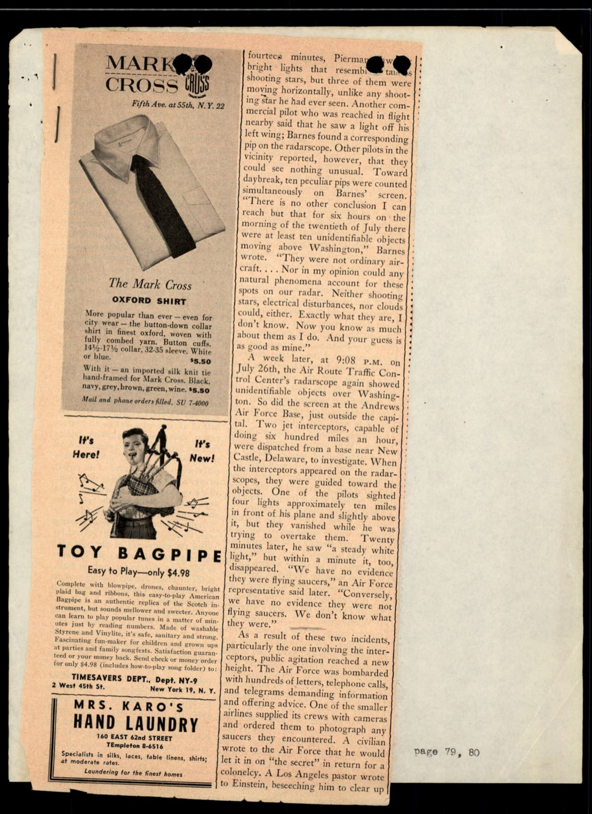

## §5 FBI 對 Daniel Lang 報導的內部回應

p-090 是 1952-10-08 FBI 內部 V. P. Keay 寫的備忘錄，標題「FLYING SAUCERS」。是對 1952-09-06 New Yorker Daniel Lang 報導的內部反應：

> Reference is made to an article which appeared in "New Yorker" dated September 6, 1952, which is attached. This article which was written by Daniel Lang contained inaccurate information regarding FBI investigations, indicating that the FBI conducts certain inquiries regarding flying saucers at the request of the Air Force.
>
> 茲指該文，1952-09-06「New Yorker」刊登的文章，附件如此。Lang 撰寫的這篇文章含有對 FBI 調查的不正確資訊，暗示 FBI 應空軍請求進行特定飛碟調查。

Keay 提供 FBI 1952 年的正式立場：

> It is pointed out here that, although the Bureau did at one time conduct some investigations regarding flying saucers, a present agreement has been set up with the Air Force whereby the Air Force conducts all investigations pertaining to flying saucers and the Bureau, upon receiving complaints of this nature, merely turns the complaints over to the Office of Special Investigations (OSI), which in turn transmits the information to Air Intelligence.
>
> 此處應指出：雖然本局曾經進行過一些飛碟調查，但目前與空軍已有約定 ─ 空軍進行所有飛碟相關調查，本局收到此類投訴後，僅將投訴移交 OSI，OSI 再將資訊轉送 Air Intelligence。

> Air Intelligence has set up the Air Technical Intelligence Center at Wright-Patterson Air Force Base, Dayton, Ohio, for the purpose of coordinating and handling of research pertaining to flying saucers.
>
> Air Intelligence 在 Ohio Dayton 的 Wright-Patterson 空軍基地設立了 Air Technical Intelligence Center，協調並處理飛碟相關研究。

Keay 找 OSI 的 L. L. Free 中校（Espionage Branch, Counter-Intelligence Division）和 Air Intelligence 的 Colonel O. A. Young（Executive Officer），追查 Lang 的資訊來源。兩邊都說「沒人聯絡過 Lang」。Lang 怎麼拿到 Project Saucer 內部運作的細節，FBI 內部也搞不清楚。

這份備忘錄揭示了 1952 年的 FBI 立場架構：

```
民眾通報 → FBI 受理但不調查 → 移交 OSI → 轉 Air Intelligence → ATIC（Wright-Patterson）
```

ATIC 是後來 Project Blue Book 的母體機構。FBI 在這個鏈條裡的角色是「中介轉送站」，不是「調查者」。但 Lang 報導把 FBI 寫進「調查者」這條線，違反了 1947-10-01 退出令確立的 FBI 政策語言。

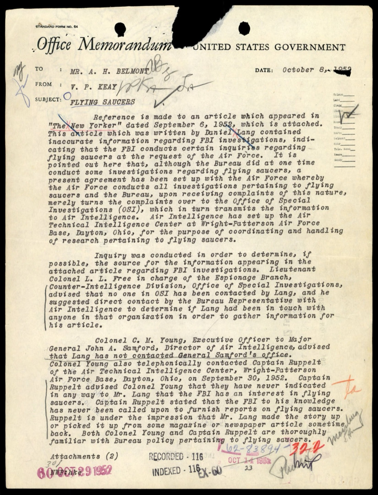

## §6 1952-10 國際浪潮：Air France、Korea、Gaillac「融化飛碟」

p-115 是 SPACE REVIEW 雜誌「SAUCERS IN THE NEWS」欄目的剪報，列出 1952-10 整月的全球目擊：

| 日期 | 地點 | 內容 |
|---|---|---|
| 1952-10-03 | Mayagüez, Puerto Rico | 兩人看到金屬粉紅色物體，下午 10:30 |
| 1952-10-07 | Paris, France | Air France 兩位飛行員看到飛碟越南法 |
| 1952-10-13 | Norway / Sweden | 挪威政府聲明：飛碟形物體在挪威領土降落。德國專家聲稱是俄國製造 |
| 1952-10-16 | Washington, D.C. | 海軍宣布從 Geomagnetic North Pole 上方氣球發射火箭，氣球比 10 層樓還高（Skyhook 計劃） |
| 1952-10-29 | Western Korea Front | 美軍看到半打神秘「閃光的車輪」越過西部前線 |
| 1952-10-29 | Gaillac, South of France | 一位女士看到無聲、低空、發白色發光的圓形物體，輕微凸起，直徑 18 英寸，做 15 英尺圓周運動 |

Gaillac 案後續引發了 1952-11 的法國全國飛碟潮 ─ 同一個地理區域內 60 個目擊報告連續發生。法國農民甚至報告「飛碟降落，當他們試圖撿起物體時，它像蠟一樣融化」。「融化的飛碟」這個敘事細節後來成為 1950 年代法國 UFO 研究界（Aimé Michel、Jacques Vallée）反覆引用的標誌。

朝鮮戰場上的美軍目擊案則更敏感。1952-10-29 在朝鮮西部前線，美軍報告「sparkling cartwheels」（閃光的車輪）橫越戰線，方向不明。Project Blue Book 後來把這列為「Korea Phenomenon」分類，但具體細節到 1990 年代才解密。

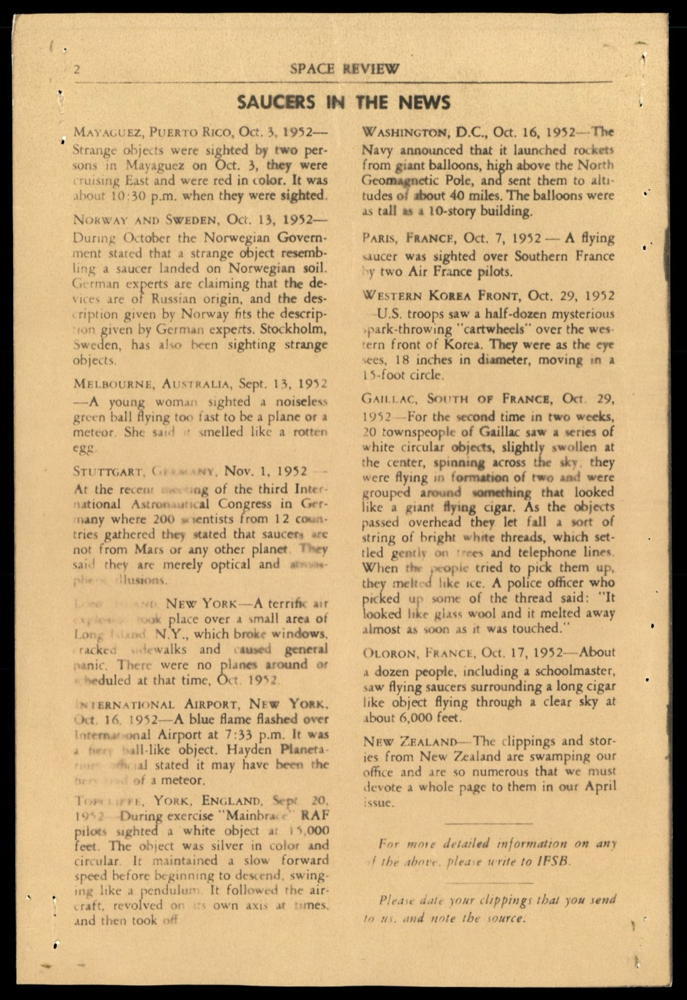

## §7 IFSB：Albert Bender 的國際飛碟局 + Gray Barker 接 WV 代表

p-112 是一份 IFSB（International Flying Saucer Bureau）的官方信件抬頭。地址：P.O. Box 241, Bridgeport 2, Conn.。日期 1952-10-26。簽名者 Alan C. Riedman（USA, the Editor）。國際理事會列表：

- **Stanley E. Crouch** ─ Editor of Science and Adventure Magazine
- **Robert N. Webster** ─ Author, Editor of Science Newsletter
- **Elliott Rockmore** ─ Editor Publisher Saucer Review
- **George D. Fawcett** ─ Council
- **British Representative**: E. L. Plunkett (Retired Cmdr Army)

信件內容是給一位 Indiana 會員的指示：

> In your last letter you asked what course of action you should take in connection with IFSB. I have the following:
>
> You'd be the local Chairman of the IFSB in Indiana. Also appoint a local secretary...
>
> 你上一封信問我，你應該對 IFSB 採取什麼行動。我有以下建議：
>
> 你會擔任 IFSB 在 Indiana 的地方主席。也指派一位地方秘書……

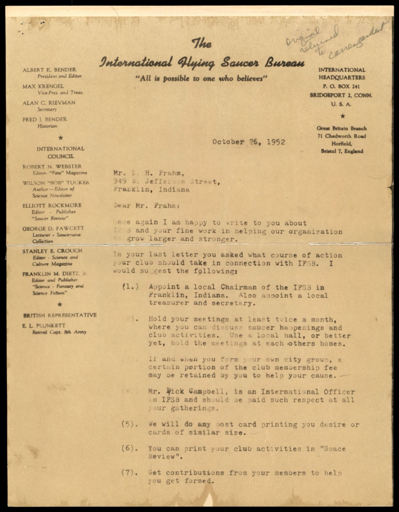

IFSB 是 Albert K. Bender 1952 年在 Bridgeport 自家閣樓成立的民間 UFO 研究組織。1953-10，Bender 突然宣布解散 IFSB，聲稱被「三個穿黑衣的人」訪問並警告停止調查。這個敘事後來被他的 WV 代表 **Gray Barker** 寫成 1956 年出版的《They Knew Too Much About Flying Saucers》─ 這本書是「Men in Black」流行神話的真正源頭。

p-121 是 1953 SPACE REVIEW 雜誌的「DIRECTORY OF REPRESENTATIVES」（代表名錄）。列出 IFSB 的州 / 國代表：

| 區域 | 代表 |
|---|---|
| British | Edgar L. Plunkett, 71 Chedworth Rd, Horfield, Bristol 7, England |
| British Assistant | Denis Plunkett |
| Puerto Rico | Luis Luhring, Box 23, Punta Santiago |
| Colorado | Verna M. Hampton, 4245 Alcott St., Denver |
| Maine | Allan Levinsky, 59 Atlantic St., Portland |
| Missouri | Ralph Hetzel, 6 Scarsdale, St. Louis 17 |
| New Jersey | August C. Roberts, 443 Ogden Ave., Jersey City |
| North Carolina | David T. Benton, Box 430, E.C.C., Greenville |
| Ohio | Robert C. Schnelle, Sr., 714 McMaha Ave., Cincinnati |
| Oregon | G. J. McColly, 524 Jersey St., Silverton |
| District of Columbia | Rev. S. L. Daw, 5119 7th St., N.W., Washington |
| **West Virginia** | **Gray Barker, Box 981, Clarksburg** |

Gray Barker 在 1952 年只是 IFSB 在 WV 的地方代表。1953 年 Bender 解散後，Barker 從會員升級為 IFSB 故事的詮釋者、寫進主流書市。FBI 案卷裡保留的這份名錄，把 Barker 在 1952 年的位置定錨在 Clarksburg WV 的 P.O. Box 981。

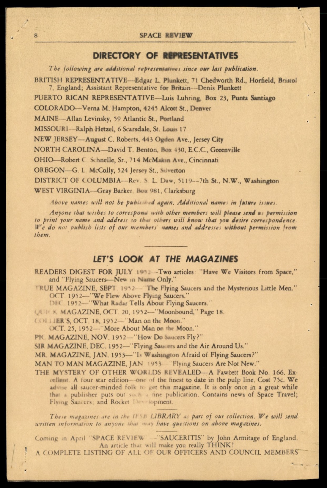

## §8 George D. Fawcett：五年飛碟調查的個人總結

p-124 是 IFSB 國際理事會成員 George D. Fawcett 的個人聲明〈Excerpts From a Summary of a Five-Year Flying Saucer Investigation〉。發表於 SPACE REVIEW 雜誌。Fawcett 來自 Virginia Lynchburg，自稱五年來累積了大量證據：

> I have just decided to stop investigation that I began a little over five years ago on one of the most fascinating mysteries of modern times, that being the well-known "Flying Saucer" phenomena.
>
> 我剛剛決定停止五年多前開始的一項調查 ─ 現代最迷人的謎之一：眾所周知的「飛碟」現象。

> I have spent much of my time, money and energy seeking a solution to the riddle. While carrying on my private investigations I was able to interview several airmen pilots and guided missile experts who had spent their spare time investigating or studying these strange objects.
>
> 我花了大量時間、金錢和精力尋找這個謎的解答。私人調查期間，我採訪了多位空軍飛行員和導彈專家，他們利用業餘時間調查或研究這些奇怪物體。

> Personally interested in this phenomena from the very first, my sighting of an apparent saucer-like globe which hovered for four minutes over the Lynchburg College administration building in Lynchburg, Virginia, on the morning of July 6, 1951, has interested me even more.
>
> 我從一開始就對此現象感興趣。1951-07-06 早上，我目擊了一個明顯像飛碟的球體在 Lynchburg 學院行政大樓上方盤旋四分鐘，這讓我更感興趣。

Fawcett 的結論：

> Many of the reports that I was able to gather in my collection tend to back this statement... that these flying saucers are still being seen everywhere, for longer periods of time, and in groups instead of alone, as well as in groups of huge saucers or motor ships.
>
> 我蒐集到的許多報告支持這個說法 ─ 飛碟仍在各處被看見，持續時間更長，成群而非單獨出現，也出現巨型飛碟或母船的集群。

> I have no doubt that our government must know something about these saucers because in my opinion at the present moment the United States Government is carrying on an educational...
>
> 我毫不懷疑政府必定知道這些飛碟的一些事情，因為我認為目前美國政府正在進行某種教育性的……（文件下方被裁掉）

Fawcett 1953 年「停止調查」的決定是個人累積疲勞的結果，但他的論點 ─「政府知道但不說」─ 預示了 1956 年 Donald Keyhoe 在《The Flying Saucer Conspiracy》裡確立的政府陰謀論敘事框架。

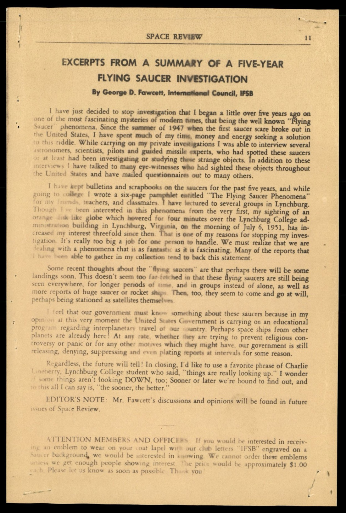

## §9 1953-07-09 Mackinac Island：Hoover 個人回信給 Grand Hotel 總裁

p-149 是 Section 7 後段的一份 FBI 內部備忘錄，日期 1953-07-09。Helen Gandy（Hoover 的長期秘書）寫信給 Mackinac Island Grand Hotel 的總裁 S. Woodfill：

> Your letter of June 30, 1953, has been received in Mr. Hoover's absence from the city, and I am taking the liberty of acknowledging its receipt.
>
> 您 1953-06-30 的來信於 Hoover 先生不在華盛頓期間收到，謹此先行確認收件。

備忘錄底下有 SAC 指令：

> ATTENTION SAC: You are instructed to thoroughly check your files in an effort to determine whether or not the Mr. Stevenson referred to by correspondent has been interviewed by an Agent of your office. You should also furnish the Bureau any information which might assist in clarifying the story set forth by Woodfill.
>
> SAC 注意：請徹底檢查您辦事處檔案，確認來信提到的 Stevenson 先生是否曾被貴辦事處探員訪談過。也請提供任何能釐清 Woodfill 陳述的資訊。

> NOTE: Although inquiries regarding such phenomena are being handled by the Air Force at this present time, it is believed desirable to check the source of this rumor and following receipt of reply from Cincinnati, refer correspondent's inquiry to the Air Force.
>
> 註：雖然此類現象的詢問目前由空軍處理，但仍認為應追查此謠言來源，收到 Cincinnati 回覆後，將通信人的詢問轉送空軍。

Mackinac Island Grand Hotel 的總裁直接寫信給 Hoover ─ 關於某個叫 Stevenson 的人和 UFO 相關的「story」。1953 年的 Hoover 仍是收件人，雖然 FBI 對外的官方立場是「Air Force 處理」。

歷史背景：Mackinac Island 是 Michigan 上半島 Mackinac 海峽中的島嶼，Grand Hotel 是 1887 年建造的維多利亞風格大飯店，1953 年仍是美國頂級夏季度假地。S. Woodfill 是當時的飯店總裁。一個社會名流寫信給 Hoover，FBI 內部即使分類為「Air Force 管轄」，仍然啟動了內部追查機制。

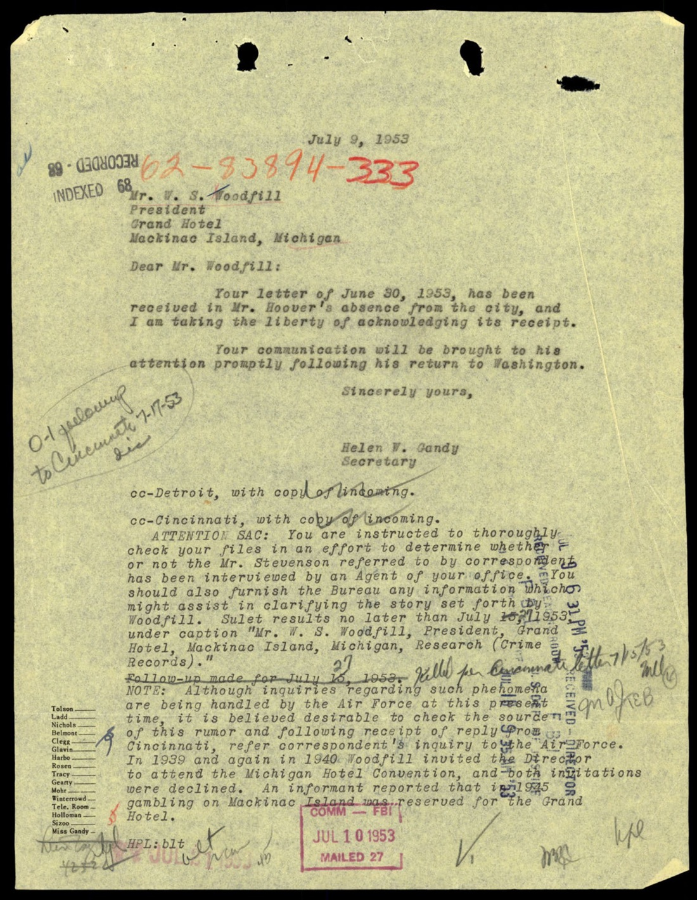

## 整段時間軸

| 日期 | 事件 |
|---|---|
| 1948-10-01 | Lt. George F. Gorman 在 Fargo ND 用 P-51 vs 圓盤做 27 分鐘空戰 |
| 1949-12 | Air Force 公開宣布 Project Saucer 收場（375 件案件分析後） |
| 1950-XX | Daniel Lang 在 New Yorker 刊出〈Something in the Sky〉長篇報導 |
| 1951-07-06 | George D. Fawcett 在 Lynchburg College 行政大樓上方目擊球體 4 分鐘 |
| 1952-07-19/20 | Washington National Airport 第一波雷達視覺案，Capitol 上空 10 個雷達回波 6 小時 |
| 1952-07-26/27 | Washington 第二波，F-94 從 New Castle AFB 起飛攔截 |
| 1952-07-29 | Major General John A. Samford 召開飛碟史上最大規模記者會 |
| 1952-08-08 | Savannah River AEC 廠：DuPont 員工目擊藍光橙緣物體越 400 區 |
| 1952-09-06 | New Yorker 刊出 Lang 第二篇報導 |
| 1952-10-03 | Mayagüez Puerto Rico |
| 1952-10-07 | Paris France：Air France 飛行員 |
| 1952-10-08 | FBI 內部 Keay 備忘錄反駁 Lang 報導 |
| 1952-10-13 | Norway / Sweden：挪威「飛碟降落」聲明 |
| 1952-10-26 | IFSB Indiana 代表任命信 |
| 1952-10-29 | Western Korea Front 美軍 + Gaillac France「融化飛碟」 |
| 1952-11-01 | Stuttgart 德國 |
| 1953-06-30 | Mackinac Island Grand Hotel 總裁 Woodfill 寫信給 Hoover |
| 1953-07-09 | Helen Gandy 代 Hoover 回信 + 內部 SAC 追查指令 |
| 1953-10 | Albert K. Bender 解散 IFSB（後續事件，不在 Section 7 內） |

## 觀察一：1952-07 Washington 案是 FBI 立場分水嶺

1947-10 的 Bureau Bulletin #57 把 FBI 從 UFO 調查上撤下。1948 Gorman、1949 Project Saucer 解散公告、1950 Lang 報導 ─ 這個階段 FBI 大致守住「不參與」的姿態。但 1952-07 Washington 案發生在 Capitol 上空、6 小時、噴射機攔截、Samford 召開記者會這個量級的政治事件後，1952-10 Keay 備忘錄重新整理了 FBI 的官方立場語言：「Air Force 進行所有調查，FBI 是中介轉送站」。這個立場語言一直持續到 1969 年 Project Blue Book 結束。1952 之前 FBI 的立場是「不參與」，1952 之後是「中介但不調查」─ 微妙但實質的轉變。

## 觀察二：IFSB 名錄 1952 年的 Gray Barker

Section 7 收進 IFSB 的代表名錄這件事，FBI 1953 年的編輯沒有預見後續歷史。Gray Barker 在 1952 年只是 WV Clarksburg 的地方代表 ─ Box 981 的郵件聯絡點。1953 年 Bender 解散 IFSB 後，Barker 接手 IFSB 的剩餘訂閱戶，1956 年出版《They Knew Too Much About Flying Saucers》，把「Men in Black」這個術語帶進美國民間 UFO 文化。FBI 案卷意外地保留了 Men in Black 神話誕生前一年的 Barker 通訊地址 ─ 一個正式存檔的證據鏈起點。

## 觀察三：Lang 報導 vs FBI 內部備忘錄的差距

p-075-078 的 Daniel Lang 報導是 1950-1952 年知識分子讀者圈中流通的 Project Saucer 長篇報導。p-090 的 Keay 1952-10-08 內部備忘錄則是 FBI 對 Lang 描述的內部更正。兩份文件並列在同一個案卷裡的事實，本身就是文獻學上的反諷：FBI 把它認為「錯誤的」Lang 報導歸進案卷，旁邊配上自己的更正紀錄。一個未來的研究者拿到這份案卷時，可以同時讀到 1950-1952 年的兩種版本敘事 ─ 媒體版 + FBI 內部版。FBI 沒有銷毀 Lang 報導，只是並列保存。這個編輯選擇遠比抽掉它更耐人尋味。

## 跨檔連結

- [#001 Section 10](../001-65_hs1-834228961_62-hq-83894_section_10/report.md) ─ 1949-1950 Oak Ridge + 推進系統技術提案 + UFO 大會議程
- [#002 Section 2](../002-65_hs1-834228961_62-hq-83894_section_2/report.md) ─ 1947 Rhodes Phoenix
- [#003 Section 3](../003-65_hs1-834228961_62-hq-83894_section_3/report.md) ─ 1947 飛碟潮 + 退出令
- [#004 Section 4](../004-65_hs1-834228961_62-hq-83894_section_4/report.md) ─ 1948-1949 退出令被打破，包含 Chiles-Whitted 原始案
- [#008 Section 9](../008-65_hs1-834228961_62-hq-83894_section_9/report.md) ─ 1957 Sputnik 後飛碟潮，Section 7 的下一個十年
- [#009 Serial 130](../009-65_hs1-834228961_62-hq-83894_serial_130/report.md) ─ 1947 ADC 卷宗，Section 7 內 New Yorker 引述的紐芬蘭等案的源頭
- [#010 Serial 153](../010-65_hs1-834228961_62-hq-83894_serial_153/report.md) ─ 1947 Oak Ridge Presley，Savannah River 案 5 年前的同模式

## 來源

US Department of War, PURSUE FOIA Release, 2026-05-08
65_HS1-834228961_62-HQ-83894_Section_7
<https://www.war.gov/UFO/#65_HS1-834228961_62-HQ-83894_Section_7>
