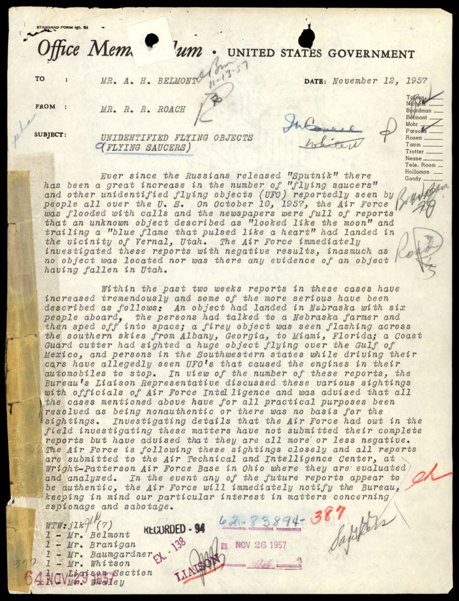
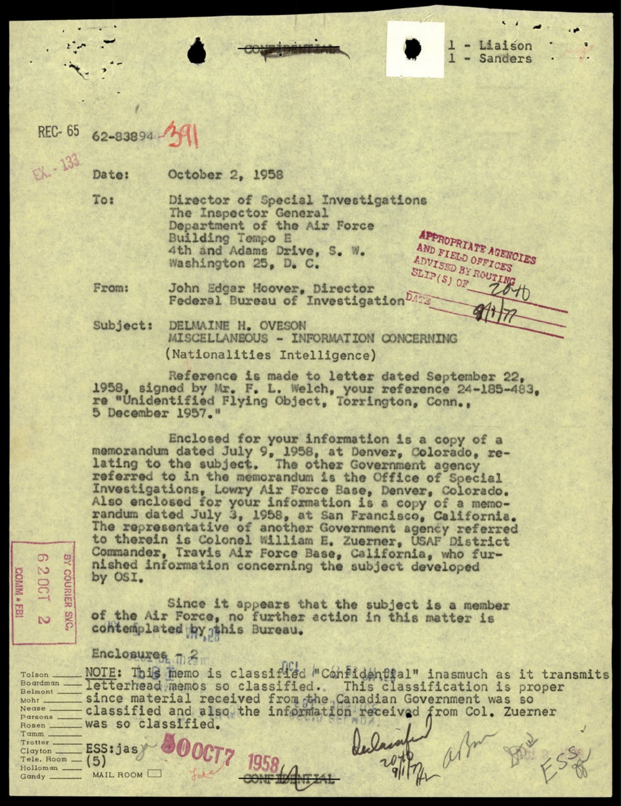
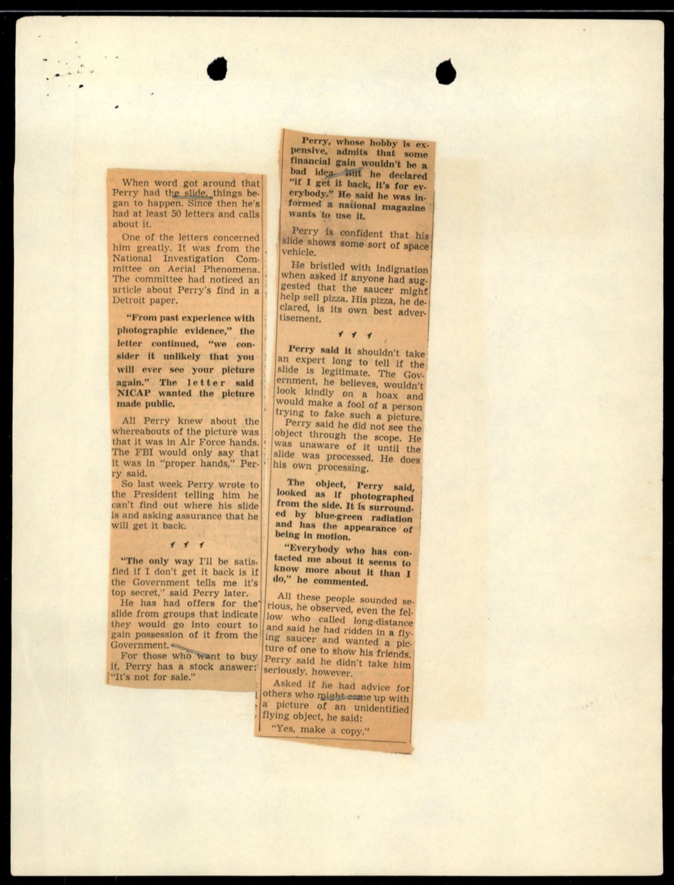
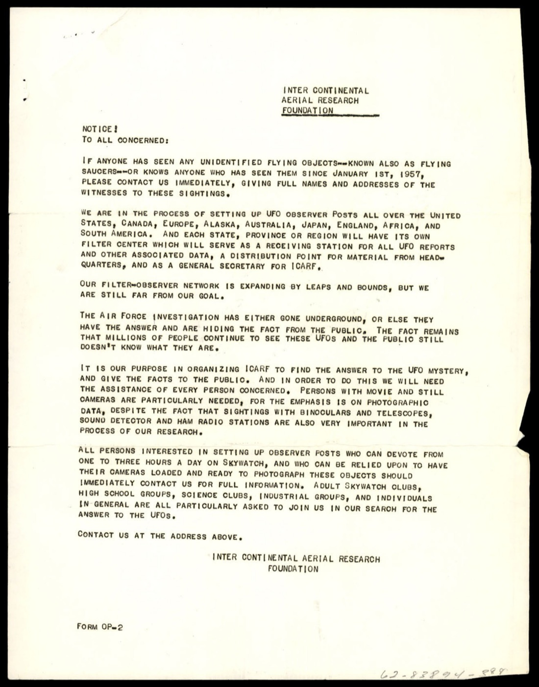
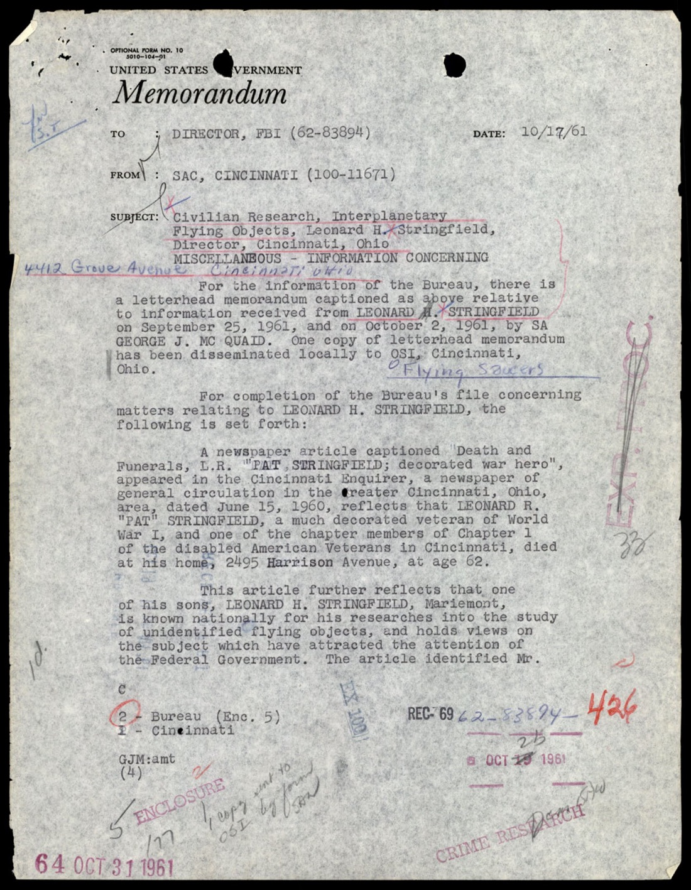
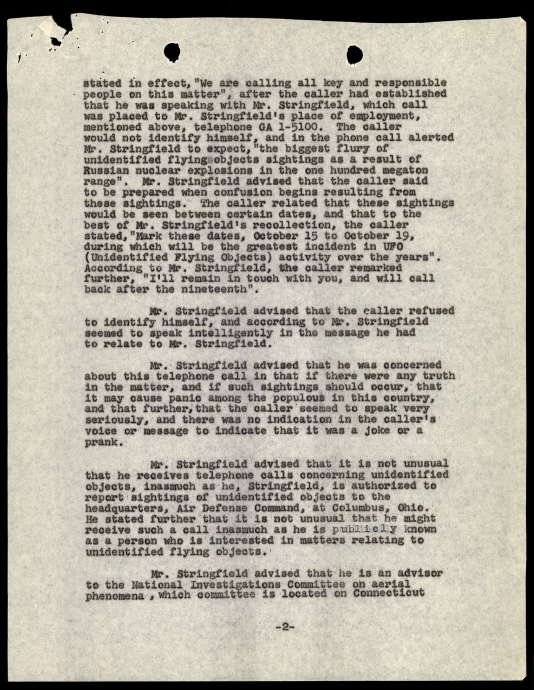
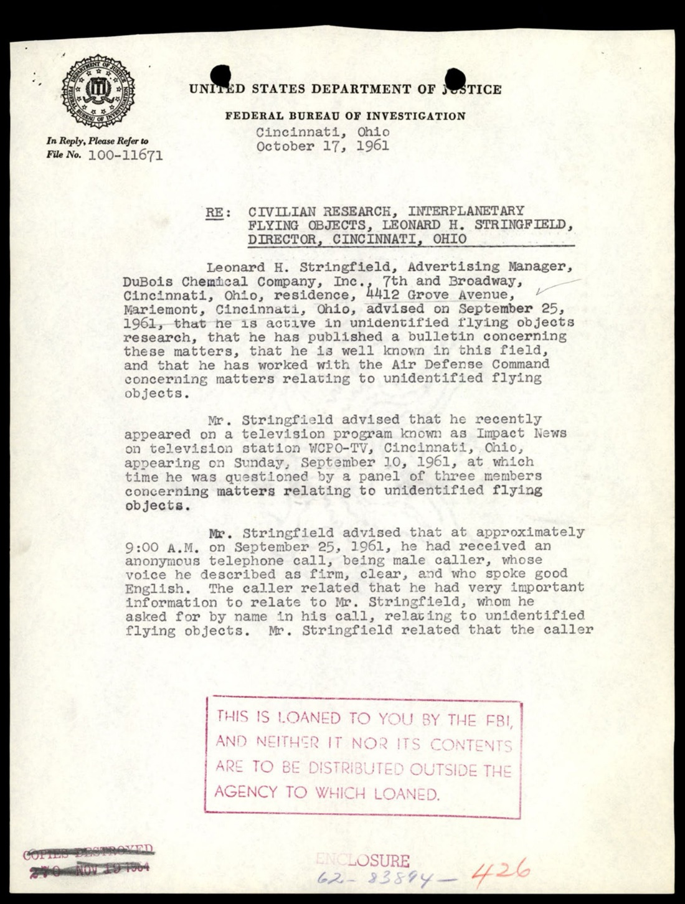
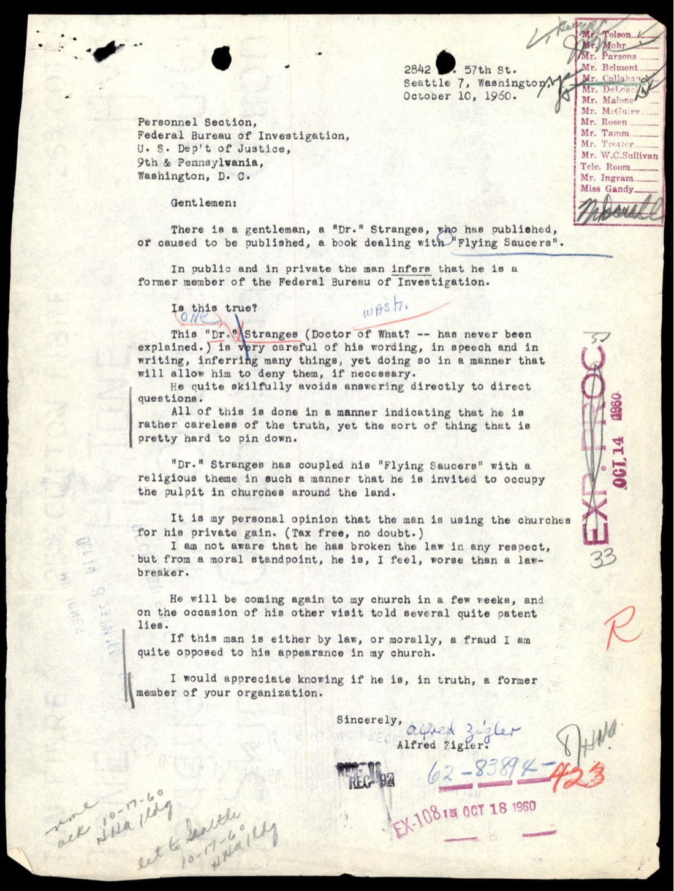
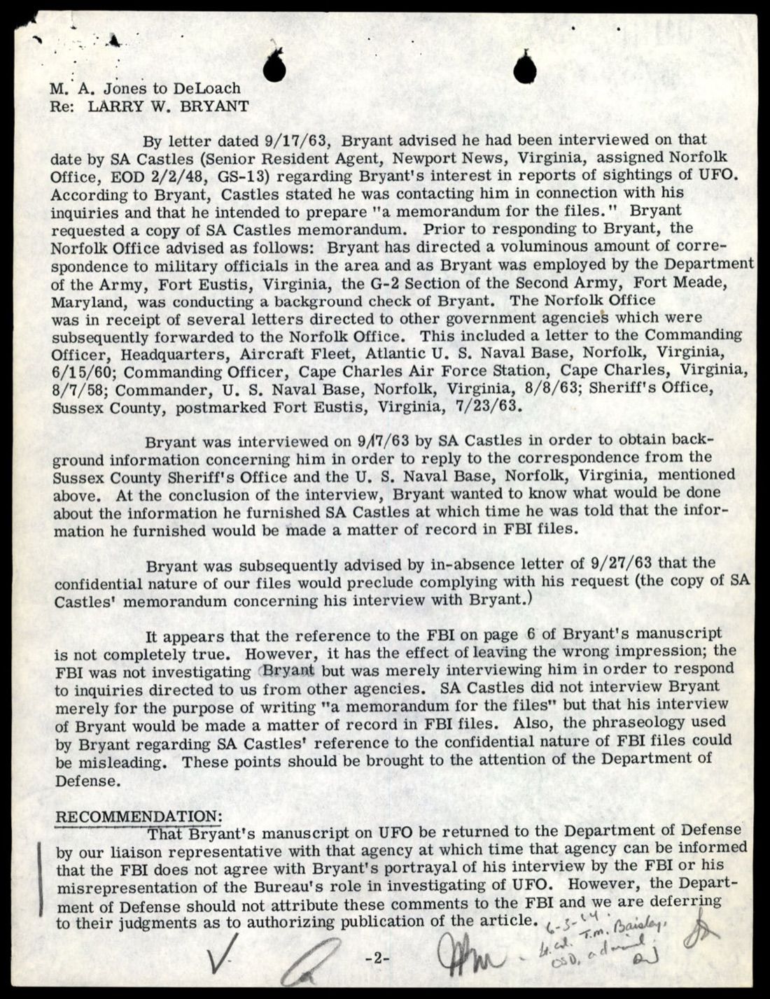

# FBI 62-HQ-83894 案卷 #008 ─ Section 9：Sputnik 後的飛碟潮、Levelland 引擎熄火、Stringfield 接到的 Tsar Bomba 預警電話

| 欄位 | 內容 |
|---|---|
| 案卷編號 | `65_HS1-834228961_62-HQ-83894_Section_9` |
| 期間 | 1957-10 → 1963-09 |
| 頁數 | 290 頁 |
| 主軸 | 1957 年 10 月 Sputnik 發射後全美飛碟通報暴增、Levelland 德州引擎熄火案、Vernal 猶他州落地案、Nebraska 6 人下船案、Torrington 康州 Delmaine Oveson 軍方身分冒用案、Perry 密西根照片案、Leonard Stringfield 接到的 Tsar Bomba 預警匿名電話、Dr. Stranges 飛碟 + 教會詐騙、1963 Larry Bryant 案 |
| 官方 portal | <https://www.war.gov/UFO/#65_HS1-834228961_62-HQ-83894_Section_9> |

## Sputnik 之後

[#003 §8 退出令](../003-65_hs1-834228961_62-hq-83894_section_3/report.md) 在 1947-10-01 把 FBI 從 UFO 調查上拉下來。十年後，UFO 調查的政治地位徹底改變了 ─ 1957-10-04，蘇聯發射 Sputnik 1 號，全球第一顆人造衛星，圍繞地球轉。冷戰太空競賽開始。一個月內，全美的飛碟通報暴增到 1947 年來的最高峰。FBI 案卷 62-HQ-83894 在 1947 年退出後就沒新章節，1957 年的浪潮把它逼出新一冊：Section 9。

Section 9 的時間跨度從 1957-10（Sputnik 一週後）橫跨到 1963-09。涵蓋三類事件：

1. 1957-10 到 12 之間爆發、由 Sputnik 引發的全國性飛碟潮
2. 1958-60 年代的個案調查、軍方身分冒用、民間 UFO 研究組織
3. 1961-63 年代的長期接觸案例（Stringfield, Bryant）和疑似騙術案（Stranges）

## §1 1957-11-12 Roach 備忘錄：Sputnik 一個月後的飛碟潮

Section 9 的第一份重點文件是 1957-11-12 FBI 內部由 R. R. Roach 寫的 UFO 備忘錄（p-006）。文件分級 SECRET。開頭就把脈絡定下：

> Ever since the Russians released "Sputnik" there has been a great increase in the number of "flying saucers" and other unidentified flying objects (UFO) reportedly seen by people all over the U.S.
>
> 自從俄國人發射「Sputnik」以來，全美各地民眾通報的「飛碟」和其他不明飛行物（UFO）大量增加。

接著羅列當月所有重大案件：

> On October 10, 1957, the Air Force was flooded with calls and the newspapers were full of reports that an unknown object described as "looked like the moon" and trailing a "blue flame that pulsed like a heart" had landed in the vicinity of Vernal, Utah.
>
> 1957-10-10，空軍電話被打爆，報紙刊滿了報導：一個被描述為「看起來像月亮」、後拖「像心臟一樣脈動的藍色火焰」的不明物體，在猶他州 Vernal 附近降落。

「Vernal Utah landing」沒在主流 UFO 史書裡留下強印象，但 Roach 把它放在第一段。後續：

> An object had landed in Nebraska with six people aboard, the persons had talked to a Nebraska farmer and then sped off into space; a fiery object was seen flashing across the southern skies from Albany, Georgia, to Miami, Florida; a Coast Guard cutter had sighted a huge object flying over the Gulf of Mexico, and persons in the Southwestern states while driving their cars have allegedly seen UFO's that caused the engines in their automobiles to stop.
>
> 一個物體在內布拉斯加州降落，船上有 6 人，這些人和一位內布拉斯加州農夫談話後加速進入太空；一個火球從喬治亞 Albany 飛到佛羅里達 Miami；海岸警備隊一艘巡邏艇看到一個巨大物體飛越墨西哥灣；西南部各州的駕駛者在駕車時據稱看到 UFO，導致汽車引擎熄火。

最後一句點出了 1957-11-02 到 11-09 的 Levelland Texas Wave ─ 一週內德州 Levelland 鎮和周邊有 15 起以上駕駛報告引擎在 UFO 接近時熄火、車燈熄滅的案例。Levelland 是 1957 年最有名的飛碟潮事件，至今仍是 UFO 研究裡電磁干擾類案件的標誌性案例。

Roach 還記下 FBI 與 Air Force 的協作分工：

> All the cases mentioned above have for all practical purposes been resolved as being nonauthentic or there was no basis for the sightings. Investigating details that the Air Force had out in the field investigating these matters have not submitted their complete reports but have advised that they are all more or less negative. The Air Force is following these sightings closely and all reports are submitted to the Air Technical and Intelligence Center, at Wright-Patterson Air Force Base in Ohio where they are evaluated and analyzed.
>
> 所有上述案件實際上都已被認定為非真實或無事實依據。空軍派出田野調查的人員雖未提交完整報告，但已告知大致結果都是負面的。空軍密切追蹤這些目擊事件，所有報告都送到俄亥俄州 Wright-Patterson 空軍基地的 Air Technical and Intelligence Center 進行評估分析。

> In the event any of the future reports appear to be authentic, the Air Force will immediately notify the Bureau, keeping in mind our particular interest in matters concerning espionage and sabotage.
>
> 若未來任何報告似乎是真實的，空軍將立即通知本局，並牢記本局對間諜活動和破壞活動相關事務的特別關注。

「Espionage and sabotage」是 1957 年 FBI 對 UFO 的立場。Sputnik 之後，UFO 通報不再是 1947 那種「俄國新型飛機」假設，而是「蘇聯間諜可能利用大眾飛碟熱潮做掩護」這個更靠後的政治焦點。

## §2 1957-12-05 Torrington Connecticut + Delmaine Oveson 冒用軍方身分

p-040 是 1958-09-22 USAF Headquarters 寫給 Hoover 的轉送信，附寄一封 Delmaine H. Oveson 給空軍 Special Investigations 的信。Oveson 自稱「Director of Operations, Electronics Service Unit 4, Roseau, Minnesota」，內容是關於 1957-12-05 在 Connecticut Torrington 附近的「unconventional aerial object」目擊報告。

> This letter was furnished the Office of Special Investigations by the Ground Observer Corps (GOC) Coordinator for the State of Connecticut. That individual has advised that an alleged sighting of an unidentified flying object near Torrington, Connecticut, was reported on or about 5 December 1957, but that neither he nor the addressee have any knowledge of the author of the inclosed letter.
>
> 這封信由 Connecticut 州 Ground Observer Corps（GOC）協調員轉交給 OSI。該員告知，1957-12-05 左右確實有人通報 Torrington 附近看到不明飛行物，但他和該信收件人都不認識附件信的作者。

> Information has been received from the U. S. Army, and Air Force Postal Service that no military units are located at Roseau, Minnesota.
>
> 美陸軍與空軍郵政服務都已查證，Roseau, Minnesota 沒有任何軍事單位駐紮。

Oveson 自稱的「Electronics Service Unit 4」在 Roseau MN 不存在。陸軍和空軍郵政都查無此單位。Air Force 把案子轉給 FBI：「this matter is being referred to your Bureau for any action you deem appropriate」（茲此事轉送貴局，由貴局採取適當行動）。

p-038 是 Hoover 1958-10-02 給 USAF Director of Special Investigations 的回信。Hoover 引述兩份 FBI 內部備忘錄（1958-07-09 Denver 和 1958-07-03 San Francisco），都涉及 Oveson 這個對象：

> The other Government agency referred to in the memorandum is the Office of Special Investigations, Lowry Air Force Base, Denver, Colorado. Also enclosed for your information is a copy of a memorandum dated July 3, 1958, at San Francisco, California. The representative of another Government agency referred to therein is Colonel William E. Zinser, USAF District Commander, Travis Air Force Base, California, who furnished information concerning the subject.
>
> 備忘錄中提到的另一政府機構是位於科羅拉多 Denver 的 Lowry 空軍基地 OSI。另附 1958-07-03 在加州 San Francisco 起草的備忘錄。其中提到的另一政府機構代表是 USAF District Commander Travis 空軍基地 Colonel William E. Zinser，他提供了關於此對象的資訊。

Oveson 同一個人，在 1958 年 7 月的 Denver 和 San Francisco 兩個 FBI 辦事處都有檔案。從 Torrington CT（1957-12）到 Denver CO（1958-07）到 San Francisco（1958-07）到 Roseau MN 自稱地址 ─ 跨多州的人物，到處冒用「軍方電子單位主管」身分追蹤 UFO 案件。FBI 把這個檔案以「Nationalities Intelligence」分類整理。

## §3 Perry Michigan 照片案：NICAP、Air Force、FBI 的三角拉扯

p-125 是 Detroit 報紙剪報，主題是密西根州一位 Perry 先生用相機拍到的飛碟照片，引發 NICAP（National Investigations Committee on Aerial Phenomena，全國空中現象調查委員會）、Air Force 和 FBI 三方拉扯：

> When word got around that Perry had photographed the saucer, things began to happen. Since then he's had at least 30 letters and calls about it.
>
> 當 Perry 拍到飛碟的消息傳開後，事情開始發生。從那之後他至少收到了 30 封信和電話。

> One of the letters concerned him greatly. It was from the office of the National Investigations Committee on Aerial Phenomena, NICAP.
>
> 其中一封信讓他相當困擾。是 NICAP 辦公室寫來的。

> "From past experience with photographic evidence," the letter certified, "very few claimants are willing to part with their property." [NICAP also said] making the picture NICAP wanted would make it public.
>
> 信中聲明：「依過往經驗，極少數攝影證據持有人願意割捨自己的財產。」NICAP 還說，他們會把照片公開。

> All Perry knew about the whereabouts of the picture was that it was in Air Force hands. The FBI would only say that it was in "proper hands."
>
> Perry 知道的照片目前所在是 Air Force 手上。FBI 只說照片在「適當的人手上」。

Perry 拍到照片 → Air Force 收走原件 → NICAP 想要副本 → FBI 介入但不告知細節。1950 年代末 UFO 證據的物流：政府單位拿到後就消失，民間研究組織只能透過媒體向證人施壓。

Perry 對動機也透明：

> Perry, whose hobby is "expensive," admits that some financial gain wouldn't be a "bad idea." "If I get back its turn for sale, my asking price would not be unreasonable," he declared.
>
> Perry 承認他「燒錢的」嗜好需要錢，所以「賺一點也不是壞主意」。「如果我能把它（照片）拿回來放著賣，我開的價也不會不合理。」

接著新聞點到一個關鍵：

> Perry said he did not see the object through the scope, but was unaware of it about until the slide was processed.
>
> Perry 說他並沒有透過取景鏡看到該物體，直到底片沖洗後才意識到它的存在。

跟 Oak Ridge Presley 1947 案（[#010](../010-65_hs1-834228961_62-hq-83894_serial_153/report.md)）同樣模式：拍照當下沒看到 UFO，事後沖洗才發現。1957 年的 Perry 案是 1947 Presley 案 10 年後的版本。

## §4 ICARF：民間設立的全球 Filter Center 網絡

p-020 是 Inter Continental Aerial Research Foundation（ICARF）的公開通告，標題「NOTICES TO ALL CONCERNED」。是一份全大寫的招募聲明，徵求 1957-01-01 以後的目擊紀錄：

> WE ARE IN THE PROCESS OF SETTING UP UFO OBSERVER POSTS ALL OVER THE UNITED STATES, CANADA, EUROPE, ALASKA, AUSTRALIA, JAPAN, ENGLAND, AFRICA, AND SOUTH AMERICA, AND EACH STATE, PROVINCE OR REGION WILL HAVE ITS OWN FILTER CENTER WHICH WILL SERVE AS A RECEIVING STATION FOR ALL UFO REPORTS AND OTHER ASSOCIATED DATA.
>
> 我們正在美國、加拿大、歐洲、阿拉斯加、澳洲、日本、英國、非洲、南美洲設立 UFO 觀察站。每個州、省或區都會有自己的 Filter Center，作為所有 UFO 通報和相關資料的接收站。

> THE AIR FORCE INVESTIGATION HAS EITHER GONE UNDERGROUND, OR ELSE THEY HAVE THE ANSWER AND ARE HIDING THE FACT FROM THE PUBLIC. THE FACT REMAINS THAT MILLIONS OF PEOPLE CONTINUE TO SEE THESE UFOs AND THE PUBLIC STILL DOESN'T KNOW WHAT THEY ARE.
>
> 空軍調查若不是已經轉入地下，就是已經找到答案但對公眾隱瞞。事實是，數百萬人持續看到這些 UFO，公眾仍不知道它們是什麼。

> PERSONS WITH MOVIE AND STILL CAMERAS ARE PARTICULARLY NEEDED, FOR THE EMPHASIS IS ON PHOTOGRAPHIC DATA, DESPITE THE FACT THAT SIGHTINGS WITH BINOCULARS AND TELESCOPES, SOUND DETECTOR AND HAM RADIO STATIONS ARE ALSO VERY IMPORTANT.
>
> 特別需要有電影或靜止相機的人，因為重點在攝影證據。當然，望遠鏡、聲音偵測器、業餘無線電站的目擊也很重要。

ICARF 把自己定位為 Air Force 的對立面：政府如果不公開，民間就建自己的全球觀察網絡。1957 年的 ICARF 已經提出後來 1990 年代 MUFON、UFO Reporting Center 等民間組織的同一個模型：分散式 Filter Center、攝影證據優先、地面觀察 + 業餘無線電監聽。

「拍照時刻準備好的成年觀察俱樂部、高中、科學社團、企業社團、個人」是徵募名單。1957 年的 UFO 觀察是全民運動。

ICARF 文件被 FBI 收進案卷，FBI 既沒承認也沒否認與其合作，但歸檔行為意味著民間 UFO 組織進到 FBI 監控範圍。

## §5 Leonard Stringfield 與「Tsar Bomba」預警匿名電話

Section 9 最詭異的一段是 1961-10 圍繞 Leonard H. Stringfield 的紀錄。Stringfield 是 Cincinnati Ohio 的廣告經理（DuBois Chemical Company），同時是全美知名的 UFO 研究者。1953-54 年他創辦 CRIFO（Civilian Research, Interplanetary Flying Objects）。

p-179 是 1961-10-17 SAC Cincinnati 寫給 Director Hoover 的內部備忘錄，記錄 Stringfield 於 1961-09-25 和 1961-10-02 接受 SA George J. McQuaid 訪問的內容。備忘錄附上 Stringfield 的家庭背景：

> Leonard H. Stringfield, Advertising Manager, DuBois Chemical Company, Inc., 7th and Broadway, Cincinnati, Ohio, residence, [number] Grove Avenue, Mariemont, Cincinnati, Ohio, advised on September 25, 1961, that he is active in unidentified flying objects research, that he has written articles relating to these matters, that he is well known in this field, and that he has worked with the Air Defense Command concerning matters relating to unidentified flying objects.
>
> Leonard H. Stringfield，Cincinnati DuBois 化學公司廣告經理，住 Mariemont 區 Grove 大道，1961-09-25 告知本局：他活躍於不明飛行物研究、撰寫過相關文章、在此領域知名、並曾與 Air Defense Command 合作處理 UFO 相關事務。

p-186 是訪談紀錄的關鍵段。Stringfield 接到了一通匿名電話：

> The caller stated in effect, "We are calling all key and important people on this matter", after the caller had established that he was speaking with Mr. Stringfield, which call was placed to Mr. Stringfield's place of employment, mentioned above, telephone GA 1-5100. The caller would not identify himself, and in the phone call alerted Mr. Stringfield to expect, "the biggest flurry of unidentified flying objects sightings as a result of Russian nuclear explosions in the one hundred megaton range".
>
> 來電者實際上說：「我們正在聯絡所有與此事相關的關鍵和重要人物。」來電者確認對方是 Stringfield 後，這通電話打到 Stringfield 上述上班地點，電話 GA 1-5100。來電者不肯透露身分，在電話中提醒 Stringfield 預期將會出現「因俄國 100 百萬噸級核爆引發的最大一波 UFO 目擊潮」。

> The caller related that these sightings were to be seen between certain dates, and that to the best of Mr. Stringfield's recollection, the caller stated, "Mark these dates, October 15 to October 19, during which will be the greatest incident in UFO activity over the years".
>
> 來電者表示，這些目擊將在某些特定日期之間發生。Stringfield 記憶中，來電者說：「記下這幾個日期：10 月 15 日到 10 月 19 日，這幾天將會是多年來最大的 UFO 活動事件。」

> "I'll remain in touch with you, and will call back after the nineteenth".
>
> 「我會保持聯繫，19 號之後再打給你。」

兩個關鍵預測：

1. **時間**：1961-10-15 到 1961-10-19 之間
2. **誘因**：「俄國 100 百萬噸級核爆」

實際歷史：1961-10-30，蘇聯在 Novaya Zemlya 試爆 Tsar Bomba（沙皇炸彈）─ 史上最強核子試爆。原始設計理論當量 100 MT，實際試爆減半到 50 MT 以避免放射性塵埃。Stringfield 接到電話的時間是 1961-09-25 之前，匿名來電者用「100 megaton」這個具體數字。Tsar Bomba 試爆的正式公告是 1961-10-17（即 Stringfield 預警範圍 10/15-10/19 內）由 Khrushchev 在蘇共 22 大公開宣布。

Stringfield 對這個預警的反應：

> Mr. Stringfield advised that he was concerned about this telephone call in that if there were any truth in the matter, and if such sightings should occur, that it cause panic among the populous in this country, and that further, that the caller seemed to speak very seriously, and there was no indication in the caller's voice that he was attempting any joke or hoax.
>
> Stringfield 表示他擔心這通電話 ─ 若內容屬實、若這些目擊確實發生，會在全國造成恐慌。此外，來電者語氣非常嚴肅，聲音中沒有任何嘗試開玩笑或惡作劇的跡象。

匿名電話、語氣嚴肅、用具體日期區間、用具體核爆當量、提到「我們正在聯絡所有相關關鍵人物」。Stringfield 報給 FBI 是為了避免被當作恐慌散布者的同時建立記錄。FBI 把這份備忘錄歸進 62-HQ-83894 案卷。

p-182 是同案的補充訪問紀錄。Stringfield 還告知 FBI 他與 Air Defense Command 合作的歷史：

> [Stringfield] worked with the Air Defense Command concerning matters relating to unidentified flying objects.
>
> Stringfield 曾與 Air Defense Command 合作處理 UFO 相關事務。

1961 年的 ADC 已經和 Stringfield 建立非正式管道。CRIFO 作為民間組織，實質上有時是 ADC 的線報來源。Stringfield 因此被視為「key and important people on this matter」之一，匿名電話打到他的辦公室。

## §6 Dr. Stranges：飛碟 + 教會的詐騙模式

p-173 是 1960-10-10 一位 Seattle 7 區居民寫給 FBI 人事部門的舉報信。她舉報的是 "Dr." Frank E. Stranges（後來自稱在 1959-12 於五角大廈見過外星人 Valiant Thor 的著名 contactee）：

> This "Dr." Stranges (Doctor of What? — has never been explained.) is very careful of his wording, in speech and in writing, inferring many things, yet doing so in a manner that will allow him to deny them, if necessary.
>
> 這位 "Dr." Stranges（什麼的 Doctor？─ 從未說明過。）在口頭和書面用詞上都非常小心，暗示了很多事，但用一種隨時可以否認的方式表達。

> "Dr." Stranges has coupled his "Flying Saucers" with a religious theme in such a manner that he is invited to occupy the pulpit in churches around the land.
>
> "Dr." Stranges 把他的「飛碟」與宗教題材結合得很好，被邀請站在全美教會的講台上。

> It is my personal opinion that the man is using the churches for his private gain. (Tax free, no doubt.)
>
> 我個人認為這個人在利用教會謀取私利。（免稅，無疑。）

舉報人問的具體問題：「他公開和私下都暗示自己是 FBI 前成員。這是真的嗎？」FBI 自然否認。Stranges 用「FBI 前成員」這個身分加上「飛碟使者」這個角色，加上「教會講台」這個免稅平台，建立 1960 年代的 UFO + 宗教變現模型。

值得注意：FBI 處理「假冒 FBI 前成員」的案件，比處理 UFO 案件本身更積極。冒用身分是聯邦罪，UFO 通報不是。Section 9 收進這份舉報信，意味著 FBI 1960 年代對 UFO 「邊緣社群」的監控，部分是透過追蹤冒用聯邦身分這個入口進行。

## §7 1963 Larry W. Bryant：陸軍員工 + 海量信件 + 出版品錯誤引用 FBI

p-241 是 Section 9 後段最後一個關鍵案例 ─ Larry W. Bryant 案。1963-09-17 SA Castles（Norfolk 辦事處 Senior Resident Agent at Newport News, VA）訪問了 Bryant。Bryant 是 Department of the Army 在 Fort Eustis VA 的員工：

> Bryant has directed a voluminous amount of correspondence to military officials in the area and as Bryant was employed by the Department of the Army, Fort Eustis, Virginia, the G-2 Section of the Second Army, Fort Meade, Maryland, was conducting a background check of Bryant.
>
> Bryant 對該地區軍方官員發出大量信件，且 Bryant 受雇於 Fort Eustis 的陸軍部，因此 Fort Meade 第二陸軍 G-2 部門正在對他進行背景調查。

FBI Norfolk 辦公室收到的 Bryant 信件包括：

| 日期 | 收件機構 |
|---|---|
| 1958-08-07 | Commanding Officer, Cape Charles Air Force Station, VA |
| 1960-06-15 | Commanding Officer, Headquarters, Aircraft Fleet, Atlantic US Naval Base, Norfolk VA |
| 1963-07-23 | Sheriff's Office, Sussex County（從 Fort Eustis 寄出） |
| 1963-08-08 | Commander, US Naval Base, Norfolk VA |

陸軍員工五年內持續對多個軍方單位發 UFO 相關信件，邊工作邊推動。Bryant 訪問完之後出版了一份 manuscript，提到了 FBI。FBI 內部評語：

> It appears that the reference to the FBI on page 6 of Bryant's manuscript is not completely true. However, it has the effect of leaving the wrong impression; the FBI was not investigating Bryant but was merely interviewing him in order to respond to inquiries directed to us from other agencies.
>
> 看來 Bryant 的 manuscript 第 6 頁對 FBI 的引述並非完全真實。然而效果是留下錯誤印象 ─ FBI 並未在調查 Bryant，只是為了回應其他機構轉來的詢問而訪問他。

Bryant 自願承認 FBI 訪問他、把訪問紀錄寫進公開出版品、暗示 FBI 在「調查」他。FBI 內部很在意這個 framing 偏差。1963 年的 FBI 處理 UFO 議題的標準：「我們不調查，我們只是回應其他機構轉來的詢問。」這個立場跟 1957 年 Roach 備忘錄裡的「Air Force 主導、我們關注 espionage / sabotage」一脈相承。

## 整段時間軸

| 日期 | 事件 |
|---|---|
| 1957-10-04 | 蘇聯發射 Sputnik 1 號 |
| 1957-10-10 | Vernal, Utah：「看起來像月亮」+「藍色脈動火焰」物體降落報告 |
| 1957-10 月中 | Nebraska：物體降落，6 人下船和農夫談話後加速進入太空 |
| 1957-10 月中 | Albany GA → Miami FL：火球橫掃南方天空 |
| 1957-10 月中 | 墨西哥灣：Coast Guard 巡邏艇看到巨大物體 |
| 1957-11-02 → 11-09 | Levelland, Texas Wave：15 起以上引擎熄火、車燈熄滅案 |
| 1957-11-12 | R. R. Roach 內部備忘錄：Sputnik 後飛碟潮綜述 |
| 1957-12-05 | Torrington, Connecticut：不明飛行物目擊 |
| 1958-07-03 | San Francisco：Travis AFB Col. Zinser 通報 Oveson |
| 1958-07-09 | Denver：Lowry AFB OSI 處理 Oveson |
| 1958-09-22 | USAF 把 Oveson 案轉送 FBI |
| 1958-10-02 | Hoover 回信給 USAF Director of Special Investigations |
| 1960-10-10 | Seattle 居民舉報 "Dr." Stranges 冒用 FBI 前成員身分 |
| 1961-09-25 | Stringfield 接到 Tsar Bomba 預警匿名電話 |
| 1961-10-15 → 10-19 | 匿名來電者預測的 UFO 活動高峰期 |
| 1961-10-17 | Khrushchev 在蘇共 22 大公開宣布 Tsar Bomba 試爆計畫 |
| 1961-10-17 | SAC Cincinnati 把 Stringfield 訪談備忘錄發給 Hoover |
| 1961-10-30 | Tsar Bomba 試爆（50 MT 實際當量，原設計 100 MT） |
| 1963-09-17 | SA Castles 訪問 Larry W. Bryant |
| 1963-09-27 | FBI 拒絕 Bryant 取得訪談紀錄複本的請求 |

## 觀察一：Sputnik 衝擊重新定義 FBI 對 UFO 的政策語言

1947 年的 Bureau Bulletin #57 退出令把 UFO 案件移轉給空軍。1957 年的 Sputnik 重啟了 FBI 對 UFO 的關注，但關注角度從「物體本身」轉移到「對國家內部安全的二階效應」。Roach 1957-11-12 備忘錄的關鍵詞是「espionage and sabotage」（間諜活動和破壞活動）─ FBI 不關心碟子是不是來自外星，FBI 關心碟子熱潮會不會被蘇聯間諜利用作掩護。這個立場貫穿 Section 9 整個時段。

## 觀察二：身分冒用是 FBI 介入 UFO 案件的主要法律入口

Section 9 裡 FBI 真正動起來的案件，幾乎都不是 UFO 本身：

| 案件 | FBI 介入理由 |
|---|---|
| Delmaine Oveson | 冒用不存在的軍方「Electronics Service Unit 4」 |
| Dr. Stranges | 冒用 FBI 前成員身分 |
| Larry Bryant | 出版品錯誤引述 FBI 在「調查」他 |

UFO 通報本身在 1947-10-01 之後就不在 FBI 主動調查範圍。但「假冒聯邦身分」「身分冒用」「散布錯誤的政府機構聲明」都是 FBI 有正式管轄權的聯邦罪名。Section 9 顯示 1957-63 年代 FBI 處理 UFO 邊緣社群的標準路徑：透過追蹤身分冒用案件，間接累積對 UFO 圈子的人事檔案。

## 觀察三：Tsar Bomba 預警電話的訊息結構分析

Stringfield 接到的電話有幾個可驗證細節值得拆解：

1. **打到上班電話**：GA 1-5100 是 Stringfield 在 DuBois Chemical 的辦公室分機。來電者知道他白天工作地點，不是隨機電話。
2. **預測時間範圍**：1961-10-15 到 10-19。Tsar Bomba 試爆公告（10-17）+ 實際試爆（10-30）部分落在範圍內。
3. **預測誘因**：「Russian nuclear explosions in the one hundred megaton range」。當時公開資訊中沒有「100 MT 等級核爆即將發生」的線索。蘇聯 1961-09-01 剛恢復核爆試驗，但具體當量沒公開。
4. **身分聲明**：「We are calling all key and important people on this matter」。複數第一人稱「我們」，暗示組織。
5. **拒絕透露身分**：但承諾「19 號之後再聯絡」。

這個訊息結構可以做兩種讀法：

讀法一，內幕來源：來電者是有蘇聯核試驗情報的人（CIA、NSA、ADC 內部、或友軍情報單位），透過 Stringfield 這個民間 UFO 網絡放出預警，意圖在 Tsar Bomba 試爆引發民眾驚慌時，把「UFO 通報暴增」這個現象提前框定為「核試驗副作用」而非未知。

讀法二，惡作劇但碰巧：來電者是普通愛好者，亂猜時段、亂猜當量，恰好猜對 Tsar Bomba 公告日期。Stringfield 把這當回事報給 FBI，FBI 歸檔，1961-10-30 試爆後沒人能反駁也沒人能證實。

哪一種讀法成立，Section 9 沒給答案。但 FBI 把整份備忘錄歸進主案卷的動作本身意味著：FBI 1961 年認為這個線索不能輕易丟掉。

## 跨檔連結

- [#001 Section 10](../001-65_hs1-834228961_62-hq-83894_section_10/report.md) ─ 1949-1950 Oak Ridge 推進系統技術提案 + UFO 大會議程
- [#002 Section 2](../002-65_hs1-834228961_62-hq-83894_section_2/report.md) ─ Rhodes Phoenix 1947 照片
- [#003 Section 3](../003-65_hs1-834228961_62-hq-83894_section_3/report.md) ─ 1947 飛碟潮 + 退出令發出
- [#004 Section 4](../004-65_hs1-834228961_62-hq-83894_section_4/report.md) ─ 1948-1949 退出令被空軍打破
- [#009 Serial 130](../009-65_hs1-834228961_62-hq-83894_serial_130/report.md) ─ 1947-09 Air Defense Command 給 Hoover 的飛碟潮總結
- [#010 Serial 153](../010-65_hs1-834228961_62-hq-83894_serial_153/report.md) ─ 1947-07 Oak Ridge Presley 照片，Perry 案 10 年前的同模式

## 來源

US Department of War, PURSUE FOIA Release, 2026-05-08
65_HS1-834228961_62-HQ-83894_Section_9
<https://www.war.gov/UFO/#65_HS1-834228961_62-HQ-83894_Section_9>
