# FBI 62-HQ-83894 案卷 #009 ─ Serial 130：1947-09-12 Air Defense Command 給 Hoover 的飛碟潮總結報告

| 欄位 | 內容 |
|---|---|
| 案卷編號 | `65_HS1-834228961_62-HQ-83894_Serial_130` |
| 編製日期 | 1947-09-12 |
| 編製單位 | Air Defense Command, Mitchel Field, New York |
| 涵蓋期間 | 1947-06-25 → 1947-08-15 |
| 頁數 | 126 頁 |
| 主軸 | 飛碟潮爆發 3 個月後，空軍 Air Defense Command 把全美及紐芬蘭累積的目擊報告編成一份系統性卷宗，連同 18 件代表案例的 15 欄比較表，送給 FBI Director。這是 1947-10-01 Bureau Bulletin #57 退出令發出前 19 天，Hoover 桌上的最後一份完整 UFO 簡報。 |
| 官方 portal | <https://www.war.gov/UFO/#65_HS1-834228961_62-HQ-83894_Serial_130> |

## 為什麼 Serial 130 跟其他 Serial 不一樣

Serial 130 不是某一件案的報告，是空軍 Air Defense Command 把過去 3 個月所有的飛碟案件整理成的一份系統性總結。封面寫得很清楚：

> HEADQUARTERS AIR DEFENSE COMMAND
> MITCHEL FIELD, NEW YORK
> 12 September 1947
> CONFIDENTIAL
> SUBJECT: Unidentified Flying Object

文件分級為 CONFIDENTIAL，提交日期 1947-09-12，提交單位 Air Defense Command。這份卷宗從紐芬蘭 Harmon Field 到伯明罕、從 Pan Am 班機到拖網漁船船長，涵蓋全美和北大西洋 1947 年 7 到 8 月所有列管的個案。Hoover 收到的時候是 1947 年 9 月中旬。19 天後，他簽發了 [Bureau Bulletin #57](../003-65_hs1-834228961_62-hq-83894_section_3/report.md) 「FBI 停止調查」的退出令。

Serial 130 是退出令前夜的 briefing。理解 1947-10-01 那道命令為什麼會發，要看 Hoover 在那之前讀了什麼。

## §1 1947-07-10 Harmon Field 紐芬蘭：航空機械師 + Kodachrome 底片

第一件正式 FINAL REPORT OF SIGHTING 表格（p-018）來自紐芬蘭 Harmon Field 的 1388th AAF Base Unit。1947-07-10 下午 8:00（當地時間），三位航空機械師在 Stephenville Crossing 開車回 Harmon Field 的途中目擊。

| 欄位 | 內容 |
|---|---|
| 地點 | Harmon Field 西南偏南約 6 英里 |
| 高度 | 10,000 英尺 |
| 天氣 | 晴朗，10,000 英尺以下 6/10 積雲 |
| 行進方向 | 東北東向，水平軌跡 |
| 速度 | 非常高 |
| 形狀大小 | 圓形像車輪，從 10,000 英尺看大小相當於 C-54 |
| 顏色 | 透明或銀色，留 15 英里長的藍黑色尾跡 |
| 照片 | Robert W. Leidy 報告他拍了兩張 Kodachrome 快照 |
| 目擊者 | TWA 機械師 John W. Nerhman；PAA 機械師 John W. Woodruff；PAA 機械師 Robert E. Leidy |

> They were enroute from Stephenville Crossing to Harmon Field at the time of the sighting. Mr. Woodruff was the first to see the Disc. It appeared to rent or split the clouds thru which it passed.
>
> 他們目擊時正從 Stephenville Crossing 開往 Harmon Field。Woodruff 先看到那個圓盤。圓盤通過雲層時，雲層像被撕開或劈開一樣。

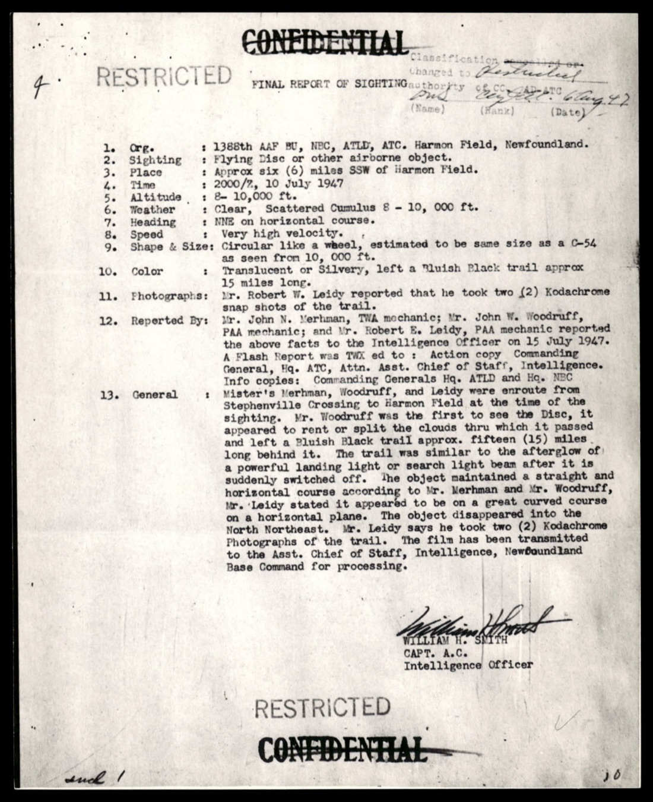

p-024 是 Woodruff 後續的深度訊問紀錄（Interrogation of John W. Woodruff），一問一答非常具體：

> Q: What kind of break did it make in the clouds?
> A: It cut a straight path right through the cloud.
>
> Q: Did it leave a trail?
> A: Yes, it left a trail dark bluish in color similar to a high power light. The trail was from approximately fifteen (15) to twenty (20) miles long.
>
> Q: Have you ever seen a meteor?
> A: Yes.
>
> Q: Do you think this was a meteor?
> A: No, I don't think so, it was cut too clean. This was as straight as an arrow.

> 問：物體在雲裡劃出什麼樣的破口？
> 答：直直一條路把雲剖開。
>
> 問：有沒有留下尾跡？
> 答：有，深藍色尾跡，像強功率燈光。長度大約 15 到 20 英里。
>
> 問：你看過流星嗎？
> 答：看過。
>
> 問：你覺得這是流星嗎？
> 答：不覺得。流星沒這麼乾淨，這個跟箭一樣直。

Woodruff 把流星跟這個物體做對比的邏輯很直接：流星軌跡會晃、會分叉、會分解；這個東西「直得像箭」。航空機械師的判斷對軍方分析師有份量。

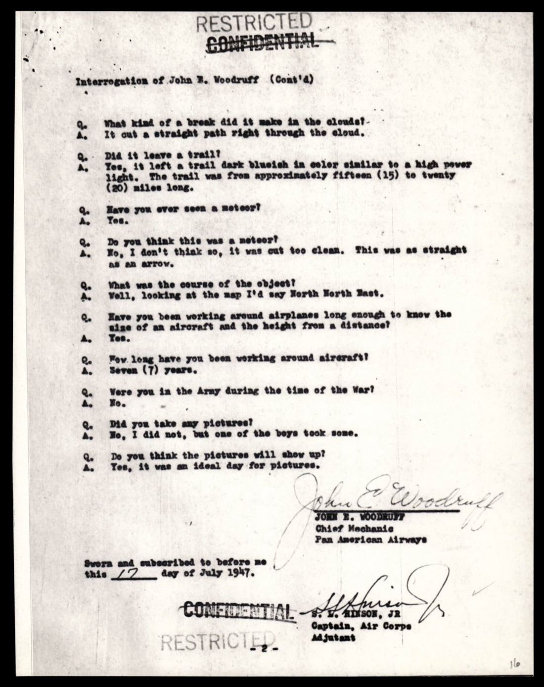

Kodachrome 照片的命運在 Serial 130 沒有附上。Leidy 拍的兩張正片應該後續分流到 Wright-Patterson Project SIGN 做分析（同 Rhodes 案的處理路徑，[#002](../002-65_hs1-834228961_62-hq-83894_section_2/report.md)）。

## §2 1947-07-11 Codroy 紐芬蘭：「桶蓋大小」碟盤 + 火尾錐

Harmon Field 事件第二天，1947-07-11，Codroy（紐芬蘭西南海岸）的 John Legge 和 Wm. Evans 站在 Legge 自家商店外面看到（p-019）：

| 欄位 | 內容 |
|---|---|
| 地點 | Codroy, Newfoundland (59°03'W, 47°50'N) |
| 高度 | 約 6,000 英尺 |
| 天氣 | 晴朗，黃昏 |
| 行進方向 | 從西北飛向東 |
| 速度 | 極高 |
| 形狀 | 圓盤，被報告為「桶蓋、餐盤、和高飛飛機的大小相當」；尾跡讓整個物體看起來像錐形 |
| 顏色 | 火焰色，後拖較淡的火焰色尾跡 |
| 目擊者 | John Legge, Wm. Evans, Albert Samns |

「桶蓋、餐盤、高飛飛機」三個量級疊起來。Legge 和 Evans 都同意「圓盤非常明亮，有餘輝」。

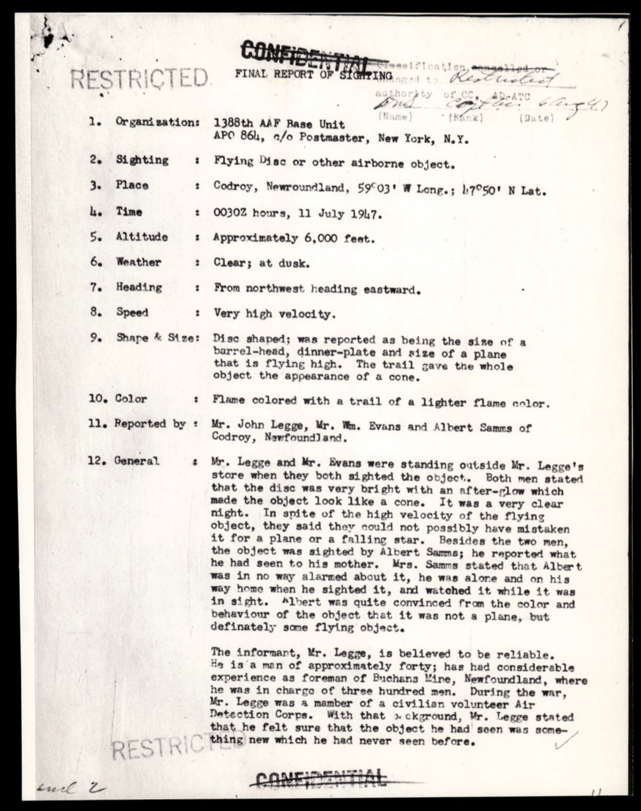

## §3 1947-07-20 Steamship Burgeo：船長 + 4 名工程師

1947-07-20 凌晨 00:15 Z（協調世界時），從 Nova Scotia 的 Sydney 開往紐芬蘭 Port aux Basques 的蒸汽輪船 Burgeo 號上，Captain Gullage 和 4 位 Hamilton, Metcalfe and Kansas City Bridge 公司的工程師（Maitland、Larkin、Douglas、Hamilton）站在右舷甲板（p-021）：

| 欄位 | 內容 |
|---|---|
| 地點 | Sydney NS 外海約 1 小時航程 |
| 海空狀況 | 晴朗、黑夜 |
| 方位 | 真北東偏 30°（NNE） |
| 速度 | 高速，比曳光彈快 |
| 觀察 | 目擊者沒看到物體本身，看到的是它的閃光 |

> Observers did not see the object, they saw its flashes and all four observers agreed there were four (4) or five (5) flashes approximately one (1) second apart and equidistant. The flashes were said to be silvery to reddish in color, and were described by two observers to be like those of a Fire Fly only larger and at equal intervals, and did not look like a shooting star or airplane.
>
> 目擊者沒看到物體本身，只看到閃光。四位目擊者一致同意，總共有 4 或 5 次閃光，間隔約 1 秒、間距等距。閃光顏色從銀色到偏紅，其中兩位形容像放大版的螢火蟲、等間距出現，不像流星也不像飛機。

5 位目擊者，4 個是 Harmon Field 軍事建設承包商的工程師。船長 Gullage 是專業海員。觀察的不是物體，是它的「節奏性閃光」。「螢火蟲」這個比喻意外地精確：放大版的、有節奏的、不是連續發光的點。

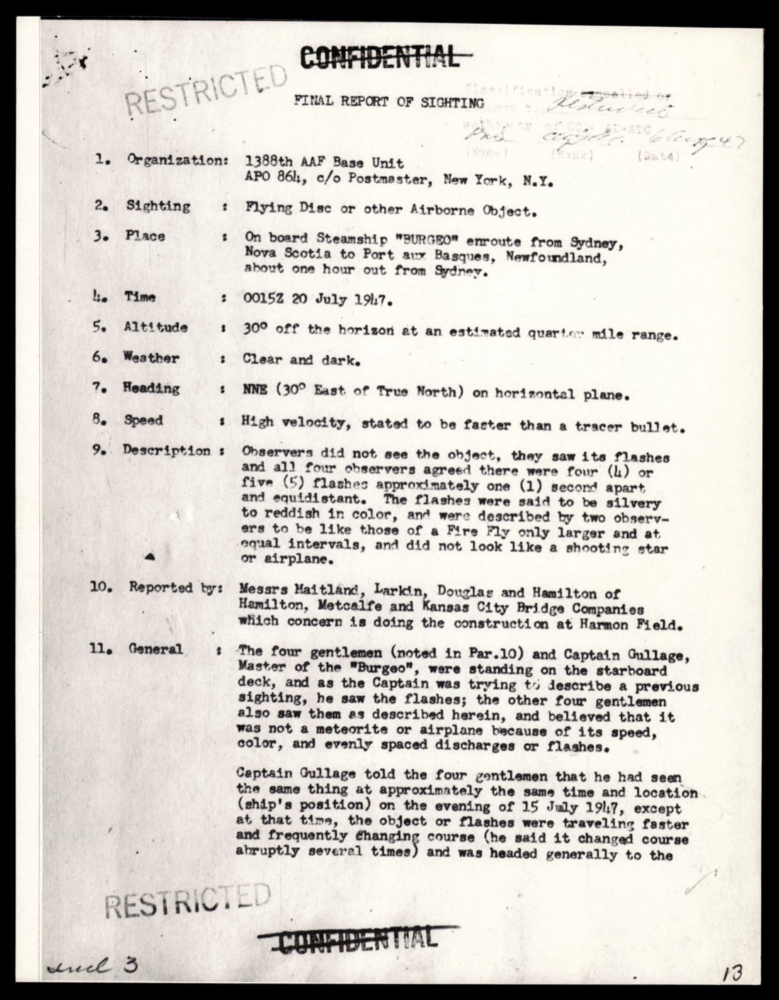

## §4 1947-07-30 Richard Rankin Portland 採訪：7,000 小時飛行員

Richard Rankin 是另一個重量級證人（p-039）。他不是普通民眾：

- 47 歲，從 19 歲開始飛
- 7,000 飛行小時，民用 + 軍機都飛過
- 自 1919 年起飛行
- 二戰前替美國林務局空照測繪整個美西
- 兄長是「Tex」Rankin，美西著名飛行員，戰時辦了 primary training school 訓練數千名飛行學員
- 在飛行表演做特技飛行

採訪日期 1947-07-30，FBI 探員親自到 Portland NE Schuyler Street 634 號訪問。Rankin 在訪談裡先做了一段自我介紹，等於先建立「為什麼我有資格判斷飛行物」：

> I am well acquainted with most articles that one would see in the air and I feel that I am well qualified to say when I see articles flying through the air, although I would not attempt to say that I am infallible nor that I could not be mistaken about some object that might be flying.
>
> 我熟悉空中看到的大多數物體，我認為自己有充分資格判斷在空中看到的東西。我不會宣稱自己絕對不會出錯，也不會說我對某個飛行物的判斷不可能搞錯。

實際目擊在 1947-06-23 中午約 12:00 PM，地點 Bakersfield, California。他在自家前院做日光浴時看到。後來他在 Bakersfield 的家門口仰望，看到「10 個物體成編隊向北飛」。

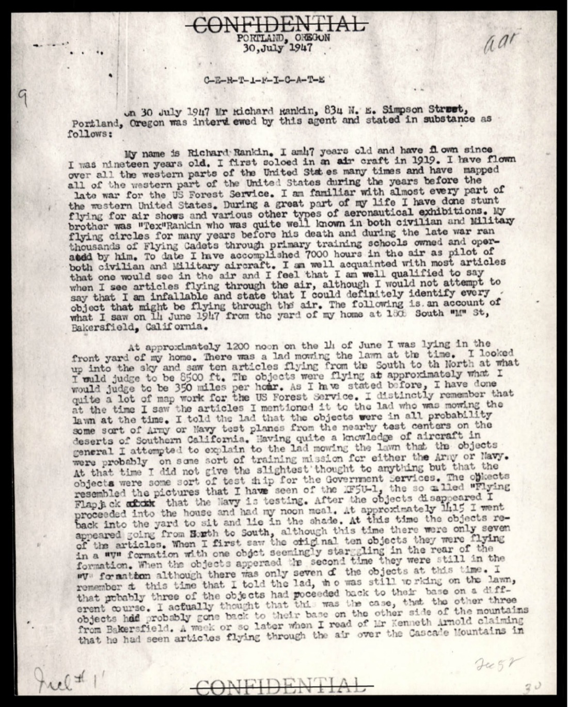

p-041 是同一個 Rankin 案的 Portland Oregonian 報紙報導〈Pilot Recalls〉。Rankin 對 The Oregonian 公開講出他的私人推測：

> I puzzled over their strange shape for a while and finally concluded that they were navy's new XF5U-1 'flapjacks,' which are thin and round, with twin propellers and a stubby tail.
>
> 我為他們的奇怪形狀困惑了一陣子，最後得出結論：那是海軍新型的 XF5U-1「飛鬆餅」，又薄又圓、有雙螺旋槳和短尾。

XF5U-1 是真實機型 ─ Vought XF5U-1「Flying Flapjack」, 海軍實驗型圓盤戰機。但 Portland Oregonian 的編輯立刻加上一段免責聲明：

> (The navy and the manufacturer have announced officially that only one such machine was built and that it never left the experimental stage.)
>
> （海軍和製造商已正式宣布只造了一架，且從未離開實驗階段。）

只造了 1 架實驗機。Bakersfield 看到的 10 架編隊不可能是 XF5U-1。Rankin 的推測為什麼還是被收進 Serial 130？因為「資深飛行員主動提出國防部已知機種解釋、結果與官方記錄牴觸」這個敘事弧線，本身就是反證據。如果 Rankin 看的是 Flapjack，那就有 9 架實驗機沒登記。

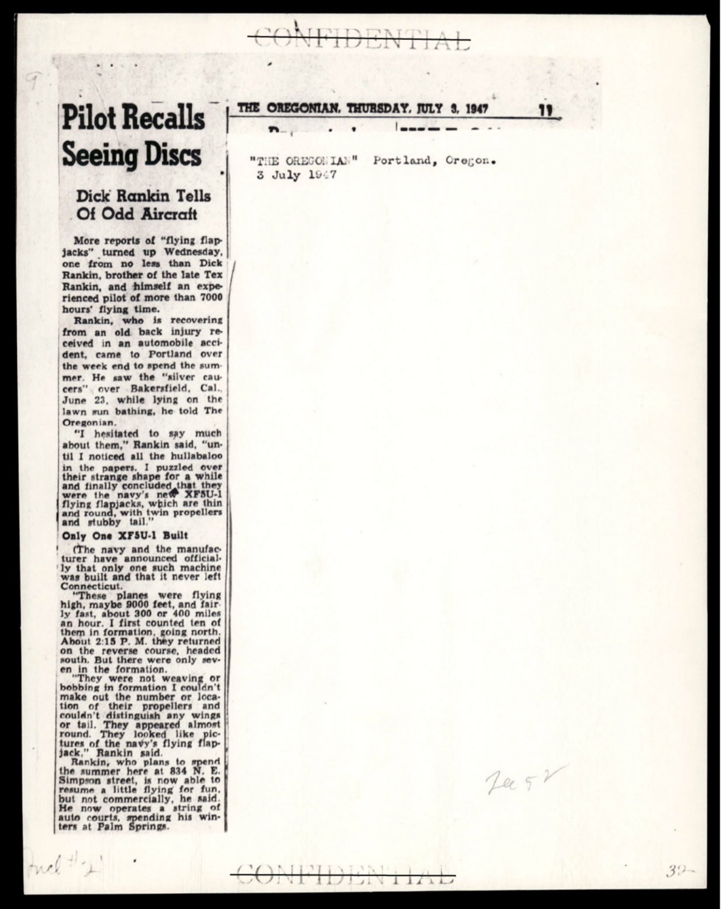

## §5 1947-08-04 Powell Pan Am Constellation：東岸航線目擊

p-001（也就是 Serial 130 的首頁正文）是 Pan American Airways 機長 Alpheus O. Powell 1947-08-04 在 Gander 紐芬蘭飛 La Guardia 班機的目擊報告。

| 欄位 | 內容 |
|---|---|
| 機型 | Lockheed Constellation |
| 航線 | Gander, Newfoundland → La Guardia Field, NY |
| 時間 | 16:00 EDT (1600 EDT) |
| 位置 | Everett Fan Marker（波士頓西北 5 英里）和 Bedford Radio Beacon（西北 15 英里）之間 |
| 飛機狀態 | 8,000 英尺，空速 265 mph，磁航向 244° |
| 天氣 | 能見度良好，雲覆蓋 6-8/10，雲頂 10,000 英尺，8,000 英尺風 270°/25 mph |
| 物體 | P-40 機身長度，兩端鈍、圓柱狀、亮橙色 |
| 物體航向 | 200° 磁向，速度約 160 mph |
| 觀察時長 | 約 50 秒 |
| 目擊者 | Captain Powell；副駕駛位的 Mr. W. White（領航員） |

> Mr Powell described the object as being about the length of a P-40 fuselage, blunt at both ends, cylindrical in shape, and having a bright orange hue. Mr Powell stated that the object had a definite shape, and that there was no suggestion of gaseous dissipation as there would be if the orange color were the exhaust from a rocket, or a jet aircraft.
>
> Powell 描述該物體長度約 P-40 機身那麼長、兩端鈍、圓柱狀、亮橙色。Powell 強調該物體有明確形狀，沒有任何像火箭或噴射機排氣那種氣態擴散的跡象。

P-40 Warhawk 機身長 31 英尺 8 英寸（約 9.7 公尺）。Powell 用同行飛行員都認得的尺寸基準描述這個物體。「沒有氣態擴散」這一點關鍵 ─ Powell 排除了「火箭或噴射機排氣造成的橙色火光」這個常見解釋。

Powell 想追，但會偏離 established airways（既定航線），所以放棄。一架 Constellation 載滿乘客為了追 UFO 違規偏航，Powell 守規矩。Serial 130 沒記載當班乘客是否目擊。

## §6 1947-06-25 Birmingham AL：39 州報導、Crosland 15 秒曝光

p-009 是 Birmingham 報紙（從版型推測是 Birmingham Age-Herald 或 Birmingham News）的剪報，主標題：

> 'Flying Saucers' Reported From 39 States, But Seem To Be Concentrated Here
>
> 來自 39 州的飛碟通報，但似乎集中在這裡（伯明罕）

副標題：

> City Is Baffled By Dazzling Display Of Spooky Discs
>
> 全城困惑於這場耀眼的詭異圓盤秀

關鍵段：

> REPORTS BEGAN coming into the Age-Herald city room around 8 o'clock last night. For more than an hour thereafter, the place was bedlam. The switchboard operators were swamped with calls. Reporters, office boys, copy readers—everyone in the place was called into action.
>
> 通報從昨晚 8 點開始湧進 Age-Herald 編輯部。後續一個多小時內，現場一團混亂。總機被打爆。記者、辦事員、改稿員，整個編輯部全員投入處理。

通報來自 Edgewood、Mountain Brook、Avondale、South Side、Fairfield、Pratt City、West End、Central Park、Bessemer ─ 大伯明罕都會區的每一個社區。

剪報主圖是 Age-Herald 改稿員 Robert Crosland 親自拍的「15 秒曝光」照片：

> The picture above was made by Mr. Crosland at 8:37 p.m. last night at his home at 28th Street and Highland Avenue. Second exposure. He said he gave the film a 15-second exposure.
>
> 上面這張照片由 Crosland 先生在昨晚 8:37 PM 在他位於 28 街和 Highland 大道交叉口的家中拍攝。第二次曝光。他說他給底片 15 秒曝光。

照片本身內容很模糊，黑色畫面上有一道淡淡的光跡 ─ 15 秒曝光把移動光點拉成軌跡。

新聞還記了一個重要細節：「On one thing everyone who has seen the mysterious objects agree ─ they are round, saucer-like. After that, every story differs.」（所有目擊者一致同意一件事：物體是圓的、像碟子。除此之外，每個人的說法都不一樣。）

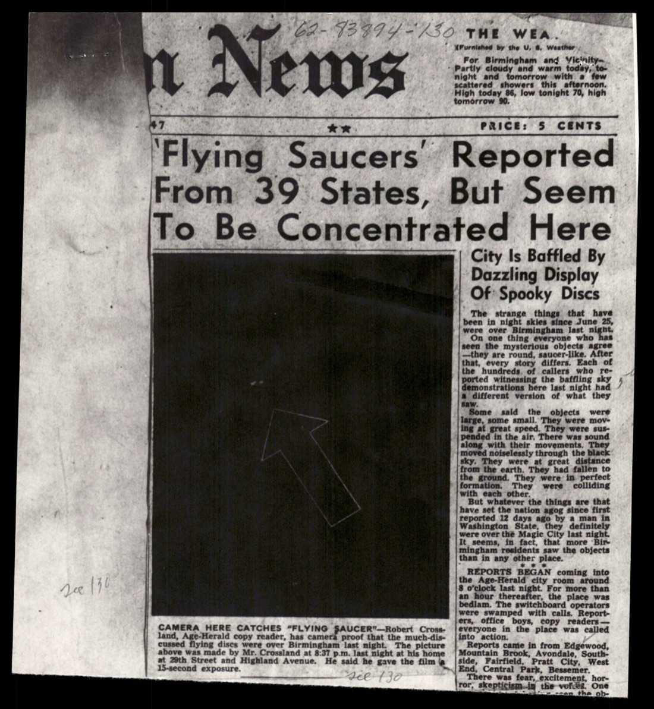

## §7 1947-07-06 Hollywood Tarzana：寫給軍方情報主任的信

p-052 是 Los Angeles 一位女士（住址 2636 Magnolia Ave., Los Angeles 7, Calif.）寫給 War Department 軍事情報主任的信，日期未明但提到事件發生在 1947-07-06。她解釋為什麼她要寫這封信：

> As I do not wish to be considered the victim of mass psychology, a crack-pot or visionary, it is rather hard for me to make this report. I am doing it because I consider it my duty.
>
> 由於我不希望被視為集體心理作用的犧牲品、瘋子或幻想家，要寫這份報告對我來說相當不容易。但我認為這是我的責任。

她先寫信給 National Bureau of Standards（國家標準局），Hugh L. Dryden 博士回信建議她改寫給軍方情報主任。Dryden 是後來 1958 年 NASA 成立時的副署長。1947 年他在 NBS 擔任 Associate Director，順手把民眾信件轉介給軍方。

事件描述：

> The Hollywood-Tarzana Bus was parked at the Tarzana end of the line. The driver was busy making out his reports preparatory to making the return trip. I was the only one in the bus and I sat in the middle of the side next to Ventura so the bus was parked north and south.
>
> As I looked to my right, a "saucer" appeared out of nowhere, apparently out of nowhere, and it was followed by several others; they were of uniform size and spaced at regular intervals and it seemed as if they turned a corner from the east and they rolled along at great speed to the Northward and parallel to Ventura boulevard.
>
> Hollywood-Tarzana 公車停在 Tarzana 終點站。司機正在寫返程前的報表。我是車上唯一的乘客，坐在靠 Ventura 大道那側中間，公車南北停放。
>
> 我往右看，一個「碟子」突然不知從哪冒出來，後面跟著好幾個。它們大小一致、間距規律，看起來像從東邊轉了個彎，沿著 Ventura 大道平行往北方高速滾動。

Hollywood-Tarzana 公車線在 1947 年是真實的路線（穿越 San Fernando Valley），Ventura Blvd 也是該地區主幹道。地理座標非常具體。「轉了個彎」「滾動」這些動詞描述了一個編隊的物體。

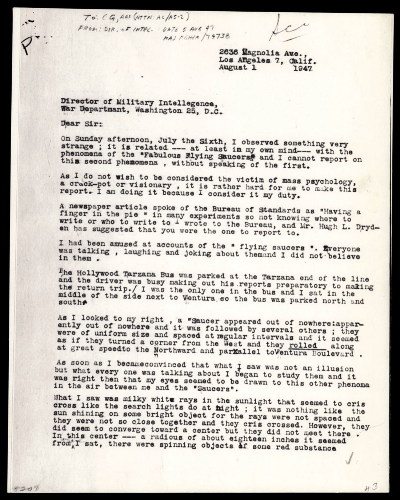

## §8 1947-07-30 Oklahoma City：Dan Nelson 自稱解開飛碟之謎

不是所有歸進 Serial 130 的線索都站得住腳。p-054 是 Oklahoma City 律師 Dan Nelson 案的 OSI 訪談紀錄。Nelson 53 歲、Oklahoma 大學 1929 年畢業、執業律師，同時兼任 Dual Parking Meter Company 的代理人。

> Subject advised the basis for his theory concerning the Flying Saucer Mystery was obtained from simple experiments which he conducted with his automobile.
>
> 對象表示，他關於飛碟之謎的理論，是基於他用自家汽車進行的簡單實驗得出的。

Nelson 1947-07-14 寫信給陸軍航空隊，1947-07-23 收到回信叫他去 Tinker Field 找 7 月 29 日報到，在 7 月 29 日他做了陳述（一份未在 Serial 130 收錄的陳述），1947-07-30 OSI 在他律師事務所（Perrine Building 926 室）訪問他。

「用自家汽車做實驗推出飛碟原理」這個敘述本身就讓 OSI 標記為可疑。Serial 130 還是把這個訪問紀錄歸檔。1947 年 9 月空軍處理飛碟線報的標準：所有人寫進來都要建檔，不論可信度。

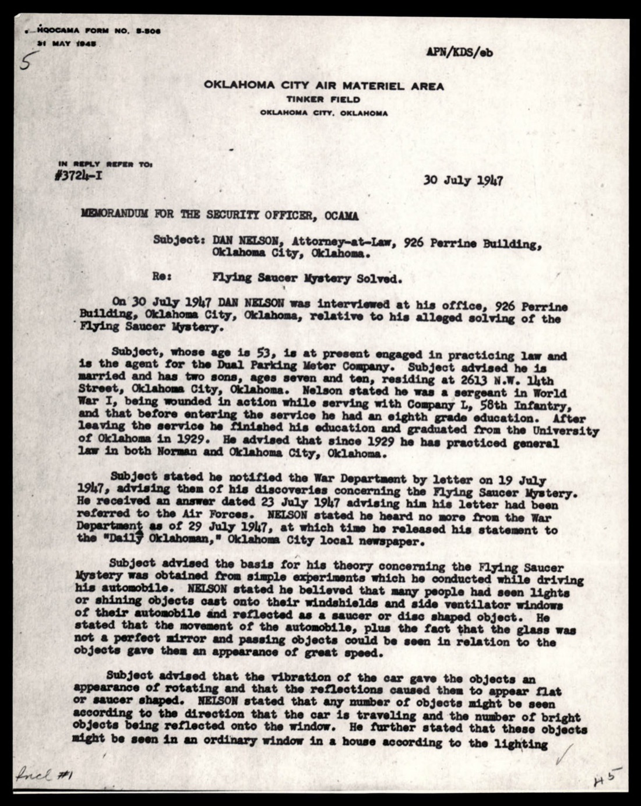

## §9 AFBIR-CO 的 18 件代表案例比較表

Serial 130 後半部（p-074 到 p-085）是 1947-09-20 由 AFBIR-CO（Air Force Bureau of Intelligence Requirements - Counter-Operations）製作的系統性比較表。p-074 是方法說明頁：

> For purposes of analysis by AFBIR-CO, eighteen reported sightings of "Flying Discs" were selected for breakdown into detailed particulars. Each report was assigned a number and each number appears in the left-hand column of the data on the following pages.
>
> 為了 AFBIR-CO 的分析，挑選了 18 件「飛碟」目擊通報做詳細特徵分解。每份報告有編號，編號出現在後續資料左欄。

> The subject headings on which the breakdown has been made are:
> Date / Hour (Local Standard Time) / Location / Observer's Name / Observer's Occupation / Observed from Ground or Air / Number of Objects sighted / Altitude / Direction of Flight / Speed / Distance Covered / Length of Time in sight / Deviation from straight Flight / Color / Size / Shape / Trail / Clouds / Manner of Disappearance / Remarks
>
> 分析依照以下欄位進行：日期／當地標準時間／地點／目擊者姓名／目擊者職業／地面或空中觀察／物體數量／高度／飛行方向／速度／涵蓋距離／持續時間／偏離直線飛行／顏色／大小／形狀／尾跡／雲況／消失方式／備註

20 個欄位、18 件案例、橫向比較。這是 1947 年的 UFO 系統分析方法論。後來的 Project Blue Book、Condon Report、CUFOS 資料庫都繼承類似框架。

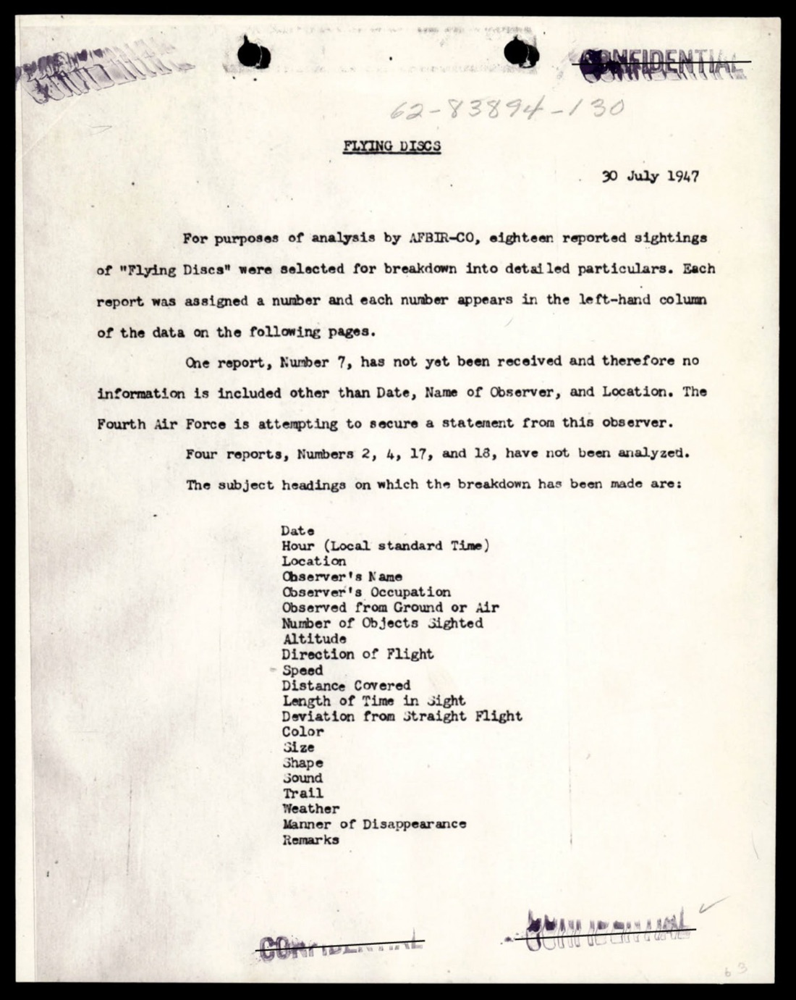

p-076 是觀察者名單頁。18 件案例的目擊者列表：

| Report # | Observer |
|---|---|
| 1 | D. A. Houser |
| 2 | P. J. Smith |
| 3 | L. D. Jamison |
| 4 | Byron Savage |
| 5 | E. L. DeRose |
| 6 | **Kenneth Arnold** |
| 7 | Wilson H. Kayko |
| 8 | John W. Cantrell |
| 9 | Redman |
| 10 | Theodore Deney |
| 11 | C. H. Zohn |
| 12 | J. R. Kauke |
| 13 | F. C. Rockwood |
| 14 | Nancy Rockwood |
| 15 | **Richard Rankin** |
| 16 | B. J. Smith |
| 17 | Ralph Stevens |
| 18 | A. B. Browning |

Kenneth Arnold 是 6 號案例 ─ 1947-06-24 在 Mt. Rainier 看到 9 個碟形物體並把「flying saucer」一詞推進大眾語彙的源頭事件。Richard Rankin 是 15 號 ─ 也就是 §4 那位 7,000 小時飛行員。同一張表把 Arnold 跟 Rankin 並列，等於是 AFBIR-CO 1947-09 對「最值得分析的 18 個案例」的選擇。

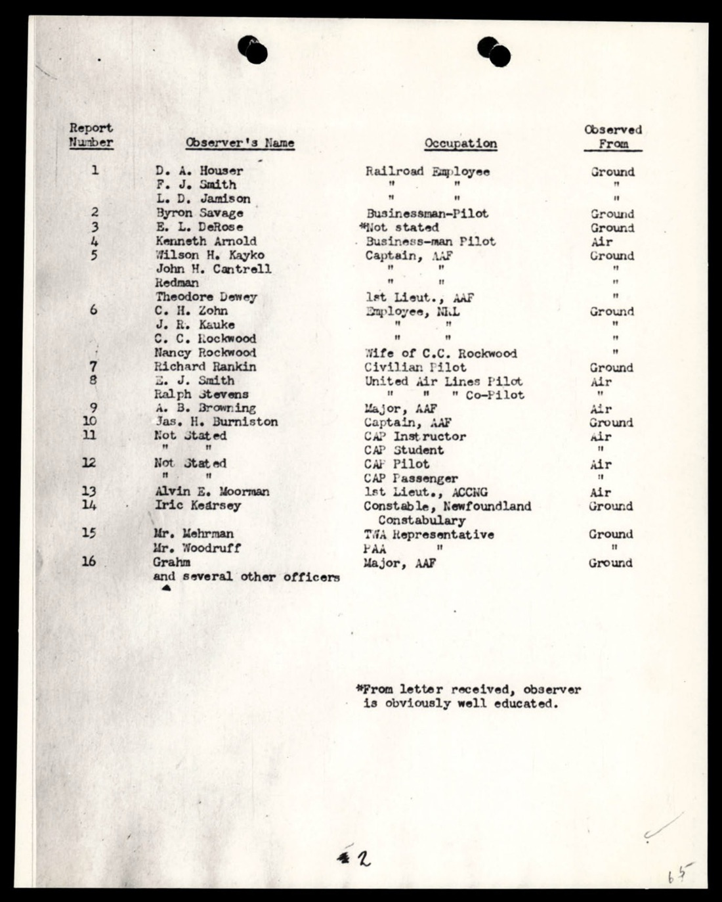

p-078 是「形狀」+「尾跡」+「雲況」欄位的橫向比較。形狀分類非常生動：

> No definite shape could be determined
> Irregular; round. Did not appear particularly disc-shaped
> None stated; seemed like a bright light
> No details other than that shape was uniform with no protuberances
> None definite, but seemed flat on base with the top slightly rough in contour
> Round, disc-shaped
> No shape could be distinguished
> Not stated, but report refers to "saucer" several times
> Same as Report No. 11
> Flat object, of light-reflecting nature which appeared to be without vertical fin or any visible wings
> Egg-shaped, or like barrel head
> Circular in shape, like wagon wheel
> Resembled balloon
>
> 無法判斷明確形狀
> 不規則、圓形。看起來不特別像圓盤
> 未陳述；似乎只是一道亮光
> 除了形狀均勻、無突出部位外，無其他細節
> 不明確，但底部似乎平、頂部輪廓略粗糙
> 圓形、碟狀
> 無法分辨形狀
> 未陳述，但報告中多次提到「飛碟」
> 同 11 號報告
> 平面物，會反光，看起來沒有垂直尾翼或任何可見的翅膀
> 蛋形，或像桶蓋
> 圓形，像馬車輪
> 像氣球

13 種描述、13 種詞彙。「車輪」、「桶蓋」、「氣球」、「碟」、「蛋」、「亮光」 ─ AFBIR-CO 沒有強迫把它們歸成同一類，而是直接抄錄目擊者原話。這個編輯選擇本身就是分析論：1947-09 的空軍不認為這些描述指向同一種物體。

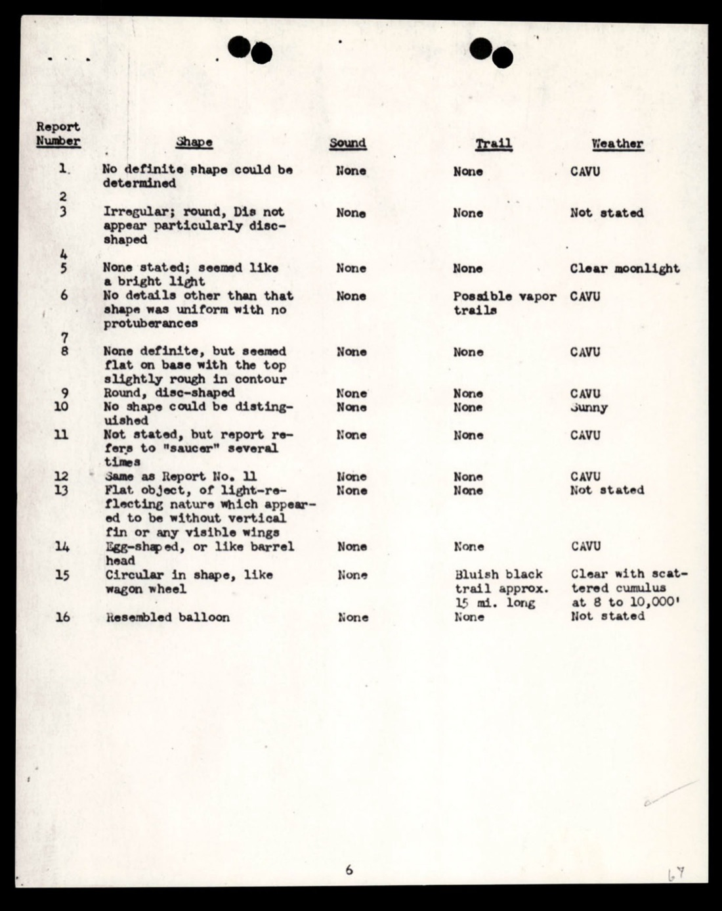

p-079 是「消失方式」欄位。13 種記錄：

> Climbed very fast and out of sight
> Obscured by a cloud bank
> Lost in brilliancy of the moon
> Cannot explain, except that reflection angle may have changed abruptly
> Don't know whether they put on a tremendous burst of speed, or disintegrated. However, they did disappear into sunset
> Unexplained
> Disappeared at an angle of about 30° above the earth's surface
> Unexplained
> Unexplained
> Pilot (at 300MPH) attempted to keep object in sight, but unable to do so
> Unexplained
> Unexplained
>
> 高速爬升消失
> 被雲遮蔽
> 沒入月光中
> 無法解釋，可能是反射角度突然改變
> 不知是高速衝刺還是解體，但確實消失於夕陽中
> 無法解釋
> 在地表以上約 30° 角消失
> 無法解釋
> 無法解釋
> 飛行員（時速 300 mph）試圖跟住物體，但無法做到
> 無法解釋
> 無法解釋

「Unexplained」出現 6 次。1947-09 AFBIR-CO 系統化分析的核心結論：50% 的代表案例中物體消失方式無法解釋。Remarks 欄位則記下分析師的逐案評語：

> From letter this observer wrote, it is obvious he is a well-educated person. Seeks no publicity.
>
> 從這位觀察者的來信看，他顯然是受過良好教育的人。不尋求曝光。

> Observers (2 rated, 2 air intel.) phoned Field Ops to ascertain no scheduled experimental a/c were in vicinity. Sky chart attached to report.
>
> 目擊者（2 位空勤評級、2 位空軍情報）打電話給 Field Ops 確認附近沒有預定的實驗性飛機。報告附了天空圖。

「Seeks no publicity」是 1947 年空軍給「可信目擊者」加的暗號。這個邏輯後來被 Project Blue Book 沿用：尋求媒體曝光的證人可信度降一級，主動避免曝光的證人可信度升一級。

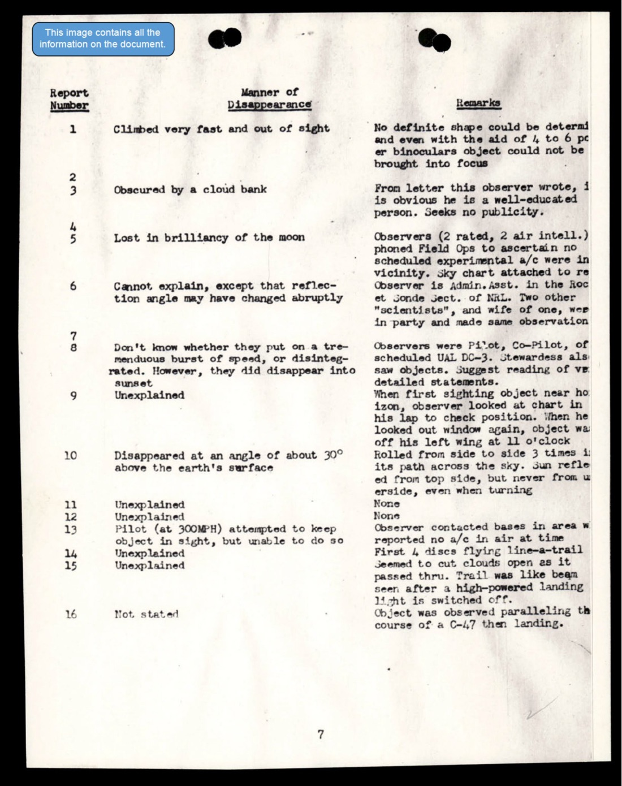

## §10 Twin Falls Urie 案的詳細草圖（與 #003 互補）

p-042 是 [#003 Section 3 §6](../003-65_hs1-834228961_62-hq-83894_section_3/report.md) Twin Falls Urie 案的另一份 FBI 內部追蹤備忘錄，日期 1947-08-20，發送單位 SAC Butte，主旨 FLYING DISCS。這份備忘錄專門處理 Urie 手繪草圖的細節：

> URIE attempted to sketch his impression of the instrument which he claims to have seen.
>
> Urie 嘗試畫出他自稱看到的儀器的印象。

> Concerning URIE's sketches, it may be noted that he believed the folded outer edge which he attempted to create in his drawing to have been about a foot through, URIE likewise believed that the tubular or exhaust flame which he and his sons claim to have seen was about a foot through and extended at least to the back end of the device. The flame did not appear to taper off nor widen out toward the back.
>
> 關於 Urie 的草圖：他相信自己在圖中試圖畫出的折疊外緣大約 1 英尺厚。他同樣相信他和兒子們看到的管狀或排氣火焰大約 1 英尺粗，至少延伸到裝置的後端。火焰沒有逐漸變細也沒有向後變寬。

> BILLY and KEITH URIE stated that they could see a knot on the side of the device from which the flames were shooting, and that they could see daylight between the exhaust flame and the side of the device. The flames did not leave any smoke or odor.
>
> Billy 和 Keith Urie 表示，他們能看到裝置側面有一個結節，火焰從這裡射出，並且能在排氣火焰和裝置側面之間看到日光。火焰沒留下煙也沒留下氣味。

「在火焰和裝置之間看到日光」這個視覺細節非常具體。Urie 父子三人的草圖差異本身也記錄了：

> The URIE boys thought that the "side view" sketch should show that the device was more sharply angled from bottom to top, while URIE himself thought that it was more streamlined and curved. URIE said that the instrument came to a pointed or rounded top.
>
> Urie 的兒子們認為「側視圖」草圖應該畫得從底部到頂部更陡銳的角度，但 Urie 本人覺得它更流線型、更彎。Urie 說那台儀器是尖頂或圓頂。

三位目擊者，三套不同的形狀記憶。FBI 把這些差異原樣記下來。Urie 還更正了一個時間錯誤：

> In his notations, URIE mistakenly said that he had seen it on Thursday. During interview, he stated that it actually had been on Wednesday, August 13, 1947, when he and his sons saw the contrivance about 1:00 P.M.
>
> 在他的筆記中，Urie 誤寫成週四看到。訪談中他更正為實際是 1947-08-13 週三約下午 1 點，他和兒子們看到那個裝置。

[#003 §6](../003-65_hs1-834228961_62-hq-83894_section_3/report.md) 已經記了 Urie 案的整體輪廓。Serial 130 補上的是「他們三人怎麼畫的，誰畫的角度跟誰不一樣，daylight 從哪裡透出來」這個層級的細節。

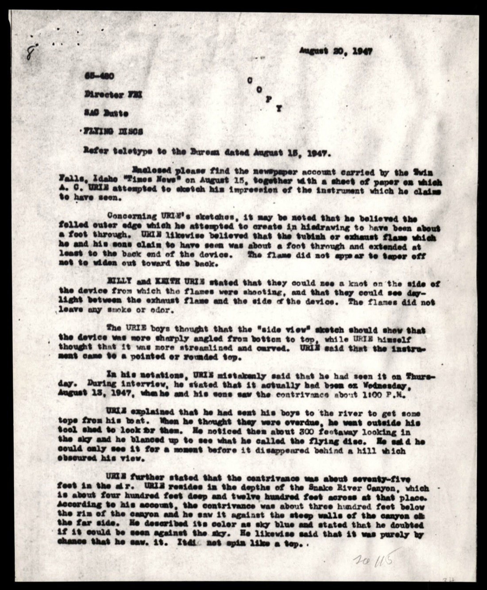

## §11 1947-08-13 Twin Falls：Salmon Gorge 同日另案

p-045 是 Times-News（Twin Falls 當地報）的另一篇報導〈'Saucer' Seen Flying Down Snake Gorge〉。這篇報導的主訊息（同 [#003 §6](../003-65_hs1-834228961_62-hq-83894_section_3/report.md)）有 Urie 描述：

> It was all one color—sort of a light sky blue with a red tubular fiery glow at the side of the top of the hood.
>
> 整個物體是同一個顏色，像淺天藍色，在「罩」頂部一側有紅色管狀火焰光。

> It is my opinion that it is guided by instruments and must be powered by atomic energy, as it made very little noise—just a swish-ish as it passed by.
>
> 我的看法是它由儀器導引，必定以原子能驅動，因為它幾乎沒聲音 ─ 通過時只是「咻」一聲。

「以原子能驅動」這個推測 ─ 1947-08 一位 Idaho 鋸木廠老闆已經想到的解釋，跟 1948-09 Oak Ridge Colonel Gasser 上校在他自己研究領域裡推出的同樣解釋（[#004 §7](../004-65_hs1-834228961_62-hq-83894_section_4/report.md)），相距整整一年。

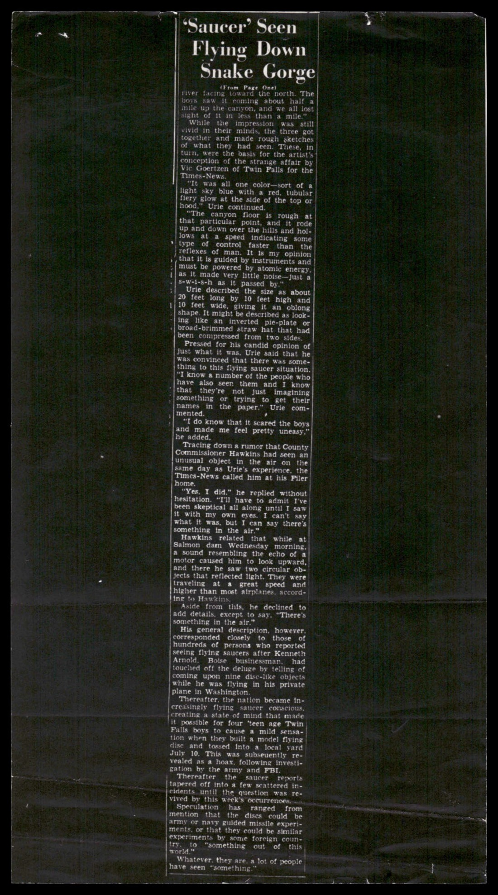

## 整段時間軸

| 日期 | 事件 |
|---|---|
| 1947-06-23 | Bakersfield CA：Richard Rankin 在自家前院看到 10 個編隊（[§4](#§4-1947-07-30-richard-rankin-portland-採訪：7000-小時飛行員)） |
| 1947-06-24 | Mt. Rainier WA：Kenneth Arnold 9 碟（AFBIR-CO 表 6 號案）|
| 1947-06-25 | Birmingham AL：飛碟潮開始降臨大伯明罕 |
| 1947-07-06 | Hollywood Tarzana：公車乘客寫信給 War Department |
| 1947-07-10 | Harmon Field 紐芬蘭：3 位機械師目擊，Leidy 拍 Kodachrome |
| 1947-07-11 | Codroy 紐芬蘭：3 人目擊「桶蓋」碟 |
| 1947-07-20 | Steamship Burgeo：船長 + 4 工程師看到節奏性閃光 |
| 1947-07-30 | Oklahoma City：律師 Dan Nelson 自稱用汽車實驗解開飛碟之謎 |
| 1947-07-30 | Portland OR：FBI 訪問 7,000 小時飛行員 Richard Rankin |
| 1947-08-04 | Pan Am Constellation：Powell 機長從 Gander 飛 La Guardia |
| 1947-08-13 | Twin Falls ID：Urie 父子在 Snake Gorge 看到藍藍色物體 |
| 1947-08-15 | Times-News 刊出 Urie 報導 + 三視圖 |
| 1947-08-20 | SAC Butte 寫信給 Director 處理 Urie 草圖細節 |
| 1947-09-12 | Air Defense Command 把 Serial 130 編成卷宗，送 FBI |
| 1947-09-20 | AFBIR-CO 完成 18 件代表案例的橫向比較表 |
| 1947-10-01 | Hoover 簽發 [Bureau Bulletin #57](../003-65_hs1-834228961_62-hq-83894_section_3/report.md)，FBI 退出 UFO 調查 |

19 天。從 Serial 130 抵達 Hoover 桌上到退出令發出，19 天。

## 觀察一：紐芬蘭三案是 Serial 130 的結構性主軸

打開 Serial 130 不是看到 Arnold 或 Roswell，而是看到 1388th AAF Base Unit 從 Harmon Field 發出的 FINAL REPORT 表格。為什麼紐芬蘭？因為 1947 年的紐芬蘭仍是英國領地（直到 1949 加入加拿大），但是 Harmon Field、Stephenville、Argentia 都是美國依照 1941 年 Lend-Lease Bases 協議租用的軍事基地。1947 年 7 月這些基地上空的飛碟事件，美國軍方在法理上有調查管轄權，但在政治上需要避免被解讀為「干預英國領地空中事務」。Serial 130 三件紐芬蘭案的軍方目擊者（TWA / PAA 機械師、海軍承包工程師、輪船船長）全是民間身分 ─ 沒有任何案件由現役軍人提出。這個身分配置非常微妙：訊息進到美國軍方手裡，但表面上沒有「美軍在英國領地上空偵察」的痕跡。

## 觀察二：18 件代表案例的篩選原則

AFBIR-CO 從 1947-06-24 到 1947-08-15 三個月內成百上千件通報中挑出 18 件做橫向比較。挑選原則沒有明說，但從 18 個觀察者的背景可以推：

- Arnold（6 號）：商人 + 私人飛行員，民選裁判信任度高
- Rankin（15 號）：7,000 飛行小時、林務局空照測繪、戰時飛行教官
- Powell（未列入此 18 件，但在 Serial 130 前段）：Pan Am Captain
- 多位有姓無職稱者：可能是軍方匿名提供的內部觀察

挑選標準似乎是「目擊者具備航空專業背景」+「物體行為脫離已知飛機」。Birmingham Crosland 案（民眾大規模目擊 + 報社改稿員拍照）被歸入後面，Tarzana Bus 女士（一個人在公車上看到）沒進 18 件 ─ 這暗示 1947-09 AFBIR-CO 的優先序仍偏向「專家證人」高於「集體事件」。

## 觀察三：「Unexplained」佔比 50%，但退出令還是發了

AFBIR-CO 比較表的「消失方式」欄裡，12 件有具體記錄的案例中 6 件標 Unexplained（50%）。空軍系統化分析的結論不是「都能解釋」，而是「一半沒解釋」。但這份比較表完成 11 天後，Hoover 簽發退出令。Serial 130 的訊息含量沒有催生 FBI 升級調查，反而催生 FBI 退出。

為什麼？讀完 Serial 130 後可以做一個推測：Hoover 看到的不是「未解之謎」而是「不適合 FBI 調查的議題」。退出令的邏輯不是「沒事可查」，而是「這件事該由空軍處理」。Serial 130 自己就是空軍主動編寫的卷宗，正好給 Hoover 一個漂亮的離場理由：「既然空軍已經建立起這個量級的系統分析能力，FBI 就把資源退出。」這個讀法和 [#004 §1](../004-65_hs1-834228961_62-hq-83894_section_4/report.md) 1948-02 空軍立刻把 FBI 拉回來形成有趣對照 ─ 退場是 Hoover 的選擇，回場是空軍的需求。

## 跨檔連結

- [#001 Section 10](../001-65_hs1-834228961_62-hq-83894_section_10/report.md) ─ 1947 飛碟潮第一波 + Arnold 詳細紀錄
- [#002 Section 2](../002-65_hs1-834228961_62-hq-83894_section_2/report.md) ─ Rhodes Phoenix 1947-07-04 照片完整訪談
- [#003 Section 3](../003-65_hs1-834228961_62-hq-83894_section_3/report.md) ─ Maury Island、B-25、Twin Falls Urie 完整故事 + 1947-10-01 退出令
- [#004 Section 4](../004-65_hs1-834228961_62-hq-83894_section_4/report.md) ─ 退出令發出後 1948-49 卷宗
- [#010 Serial 153](../010-65_hs1-834228961_62-hq-83894_serial_153/report.md) ─ Oak Ridge Presley 照片，同期 Serial 編號

## 來源

US Department of War, PURSUE FOIA Release, 2026-05-08
65_HS1-834228961_62-HQ-83894_Serial_130
<https://www.war.gov/UFO/#65_HS1-834228961_62-HQ-83894_Serial_130>
