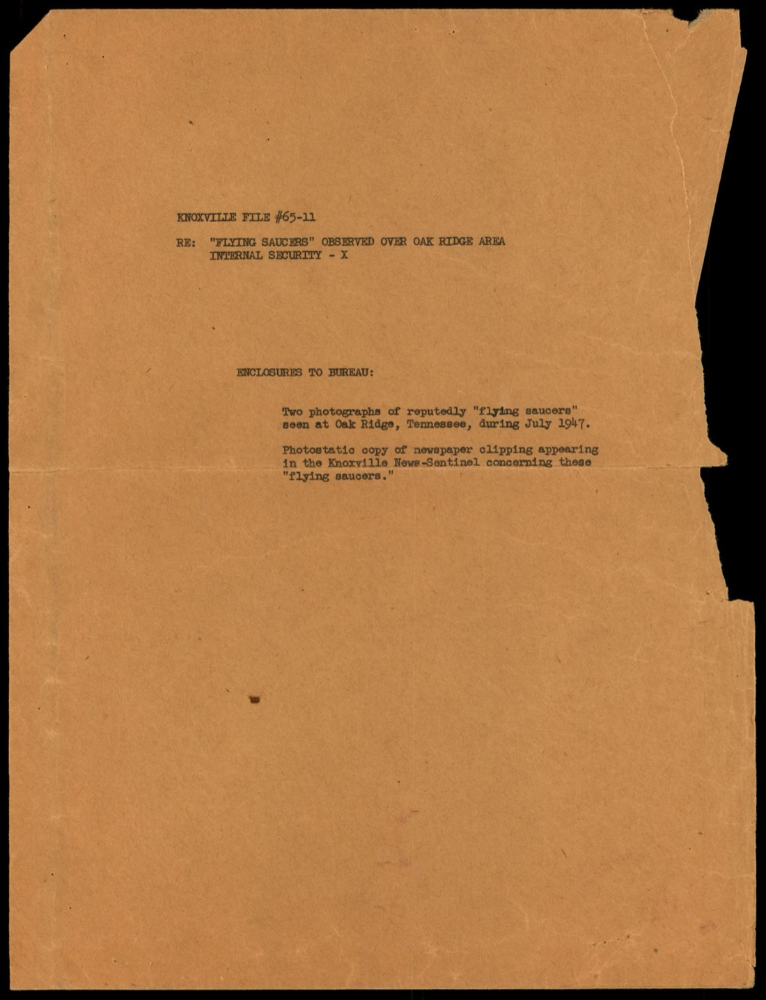
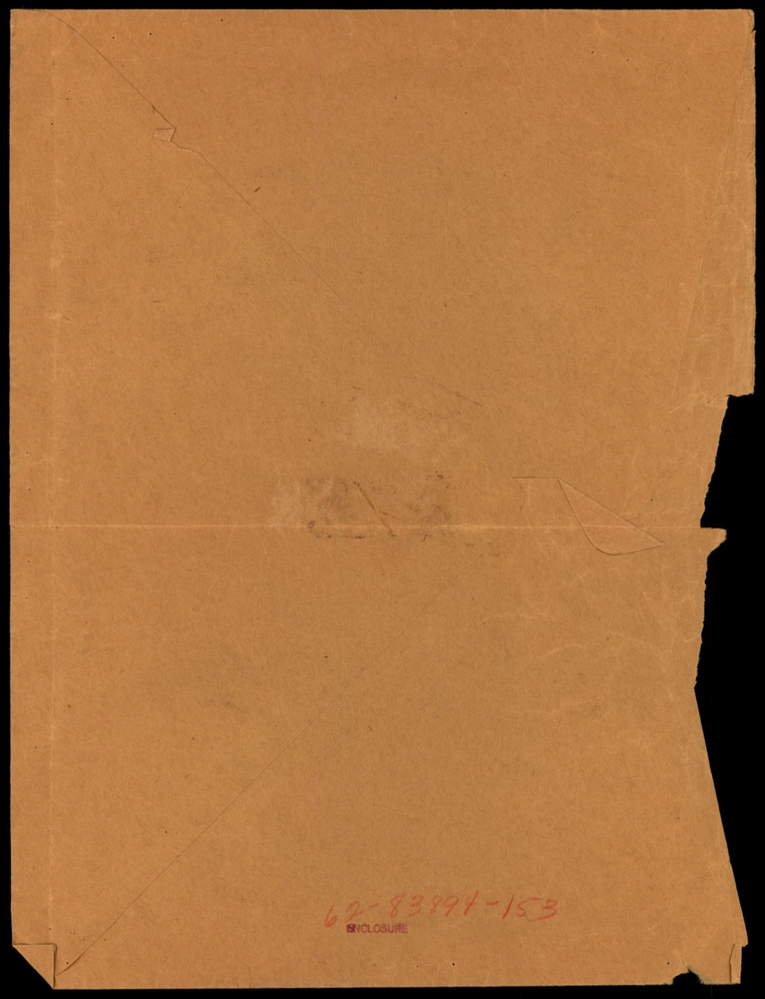
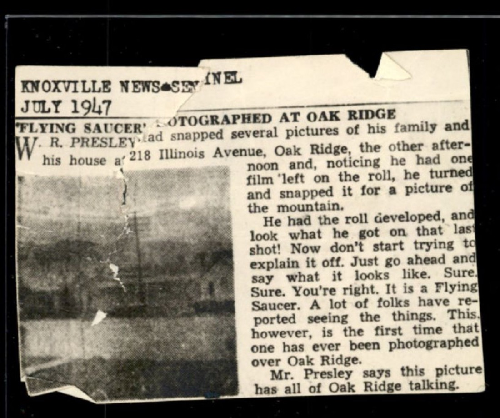
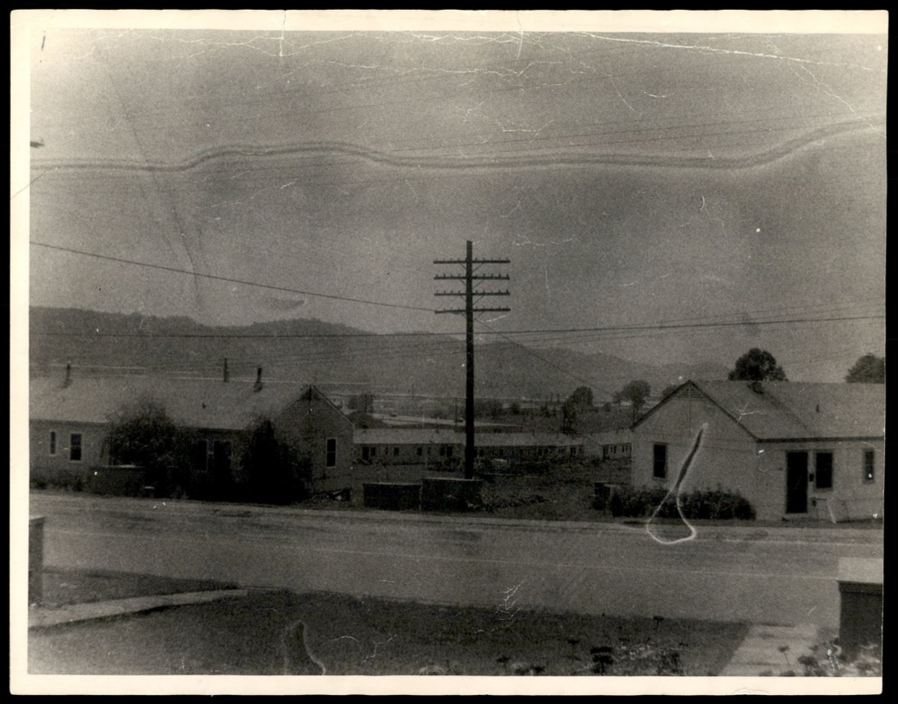
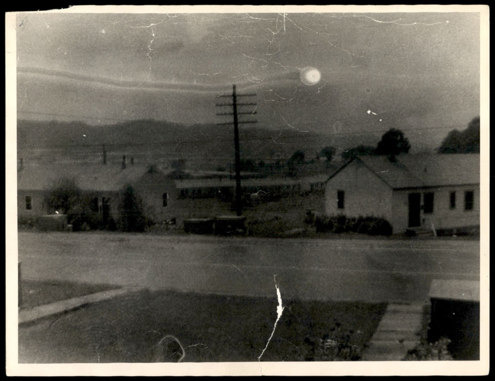

# FBI 62-HQ-83894 案卷 #010 ─ Serial 153：Oak Ridge 1947-07 W. R. Presley「最後一格底片」拍到的飛碟

| 欄位 | 內容 |
|---|---|
| 案卷編號 | `65_HS1-834228961_62-HQ-83894_Serial_153` |
| 日期 | 1947-07 |
| 頁數 | 9 頁（含實體照片 2 張 + 剪報 1 份 + 信封） |
| 主軸 | Knoxville 居民 W. R. Presley 用底片最後一格意外拍到的 Oak Ridge 飛碟照片，Knoxville FBI 把照片 + 新聞剪報以「Internal Security ─ X」分級送到 Hoover 桌上 |
| 官方 portal | <https://www.war.gov/UFO/#65_HS1-834228961_62-HQ-83894_Serial_153> |

## 為什麼 Oak Ridge 的飛碟特別敏感

[#001 Section 10](../001-65_hs1-834228961_62-hq-83894_section_10/report.md) 已經建立過背景：Oak Ridge 是 Manhattan Project 的核心三大基地之一（Los Alamos 設計、Hanford 生產 plutonium、Oak Ridge 生產 uranium-235）。1947 年戰後，Y-12 工廠和 K-25 廠仍在運作，AEC（Atomic Energy Commission）剛從 Manhattan Engineer District 接手不久。Oak Ridge 上空看到不明物體，跟 Twin Falls Urie 父子在 Snake River 看到的情況完全不是同一個量級。

Serial 153 這份只有 9 頁的薄卷，重要性不在頁數，而在它是 FBI 案卷裡少數帶有實體 UFO 照片的 enclosure。

## §1 Transmittal Cover Sheet：Internal Security ─ X

p-2 是 Knoxville FBI 辦事處的 enclosure 清單頁。文件結構是公文上呈用的標準格式：

> KNOXVILLE FILE #65-11
> RE: "FLYING SAUCERS" OBSERVED OVER OAK RIDGE AREA
>     INTERNAL SECURITY - X
>
> ENCLOSURES TO BUREAU:
>     Two photographs of reputedly "flying saucers" seen at Oak Ridge, Tennessee, during July 1947.
>     Photostatic copy of newspaper clipping appearing in the Knoxville News-Sentinel concerning these "flying saucers."
>
> KNOXVILLE 案卷 #65-11
> 主旨：Oak Ridge 區域所見的「飛碟」
>      內部安全 ─ X
>
> 致 BUREAU 的附件：
>     兩張 1947 年 7 月在 Tennessee 州 Oak Ridge 所見、傳聞為「飛碟」的照片。
>     Knoxville News-Sentinel 一篇關於這些「飛碟」之剪報的影印複本。

「Internal Security ─ X」的分級值得注意。1947 年 FBI 把 UFO 案件統一掛在「Internal Security」類別下，「X」是子類別代碼。同一系列其他子類別包括「Internal Security ─ R」（Russian / 蘇聯相關）、「Internal Security ─ C」（Communist Party 美國共產黨）。「X」是專門新建的、給 UFO / 不明飛行物的分類。

換句話說：1947 年的 FBI 從一開始就把 UFO 當作「國家內部安全」事項處理，跟監控蘇聯滲透、共產黨活動放在同一個檔案系統的相鄰格子裡。

## §2 實體信封：Enclosure 標記

p-3 是裝照片的牛皮紙信封反面。紙質磨損、有摺痕、左上角被撕裂。底部用紅筆寫上 `62-83894-153`，旁邊蓋了「ENCLOSURE」黑色橡皮章。

這是 FBI 檔案系統的物理標記：**Serial 153** 意味著主案卷 `62-HQ-83894`（飛碟調查總卷）的第 153 號條目。一個 Serial 通常是「一份來自某地的單一報告 + 附件」。Serial 153 = 1947-07 Knoxville 辦事處送進來的這一份。Section（章節）是把多個 Serial 合裝成厚冊，比方 [Section 3](../003-65_hs1-834228961_62-hq-83894_section_3/report.md) 就包了 Maury Island、B-25 墜毀、Twin Falls 等多個 1947 年 Serial。

## §3 Knoxville News-Sentinel 1947-07 剪報全文

p-4 是 Knoxville News-Sentinel 1947 年 7 月某日刊出的剪報照像版。標題：「'FLYING SAUCER' PHOTOGRAPHED AT OAK RIDGE」（飛碟在 Oak Ridge 被拍到）。剪報內嵌一張縮小版照片（也就是 p-6 的場景）。

新聞全文：

> W. R. PRESLEY had snapped several pictures of his family and his house at 218 Illinois Avenue, Oak Ridge, the other afternoon and, noticing he had one film left on the roll, he turned and snapped it for a picture of the mountain.
>
> W. R. Presley 那天下午在 Oak Ridge 的 Illinois Avenue 218 號家裡拍了幾張家人和房子的照片，發現底片還剩一格，於是轉身把它拍成山的照片。

> He had the roll developed, and look what he got on that last shot! Now don't start trying to explain it off. Just go ahead and say what it looks like. Sure. Sure. You're right. It is a Flying Saucer.
>
> 他把底片送去沖洗，看看他最後那格拍到了什麼！別開始想怎麼把它解釋掉。直說它像什麼就好。沒錯，沒錯，你說對了，就是一個飛碟。

> A lot of folks have reported seeing the things. This, however, is the first time that one has ever been photographed over Oak Ridge.
>
> 很多人都通報看過這東西。但這是第一次有人把它拍到 Oak Ridge 上空。

> Mr. Presley says this picture has all of Oak Ridge talking.
>
> Presley 說整個 Oak Ridge 都在討論這張照片。

新聞用語很口語、帶幽默語氣，「Now don't start trying to explain it off」「Sure. Sure. You're right.」是 1947 年中部小報典型的閒談腔。但語氣輕鬆掩蓋不了一個事實：Knoxville News-Sentinel 認定這是「Oak Ridge 上空第一張飛碟照」。這個聲明很大膽，因為 Oak Ridge 從 Manhattan Project 時代起就有最嚴格的航空禁航區管制。

## §4 照片一：街景 + 山脊

p-6 是 enclosure 的第一張實體照片。1947 年 4x5 規格相紙，左上角有膠帶痕跡、中間水平方向有摺痕、右下角有破損。

畫面內容：

- 前景：一條柏油路，路面有水跡
- 中景：兩排 Oak Ridge 標準戰時宿舍（一層樓、平頂、水泥外牆）
- 中央：一根電線桿，多條電力線往左右拉
- 背景：橫貫畫面的低矮山脊（東 Tennessee 典型的阿帕拉契亞低山）
- 右下角：用鉛筆畫的指示箭頭，往山脊方向指

這張照片本身沒有明顯的飛碟。指示箭頭指向山脊頂部的一個小點，視覺上需要放大才能辨識。Presley 的兩張照片裡，這張可能是他原本想拍的「山的照片」，意外的物體在另一張上。

## §5 照片二：天空中央的明亮圓盤

p-8 是第二張實體照片。同樣的 Oak Ridge 街景，同樣的房屋、電線桿、山脊。但這張畫面右上半部的天空中央，明確有一個發亮的圓形物體：

- 形狀：圓形 / 球體
- 亮度：比天空本身亮得多，邊緣有暈光
- 位置：相對於電線桿頂端，物體在電線桿右上方
- 大小：肉眼估計，物體在天空中佔據的角度大約是滿月直徑的 1/2 到 2/3

這就是 Knoxville News-Sentinel 報導裡指的「Flying Saucer」。Presley 站在 218 Illinois Avenue 自家門口，鏡頭朝著背景山脈方向按下底片最後一格快門，意外把這個物體拍進畫面正上方。

從照片本身可以做一些觀察：

1. 物體形狀偏向「球體」或「碟狀正面」，不是 Arnold 描述的「弧形碟」側面，也不是 Chiles-Whitted 案的「雪茄」。
2. 邊緣的暈光（halo）讓人聯想到 1949 年 Oak Ridge Colonel Gasser 的「氣態暈光可能顯示放射性場存在」推論（見 [#004 Section 4 §7](../004-65_hs1-834228961_62-hq-83894_section_4/report.md)）。
3. 物體沒有出現在 §4 那張照片中。Presley 拍兩張之間的時間差未知，但如果兩張間隔幾秒到幾分鐘，這個物體就是在這個短時段內進入或離開鏡頭視野的。

照片本身沒有比例尺、沒有時間戳、沒有經緯度，只能靠 Presley 的家住址（218 Illinois Avenue）反推拍攝點。1947 年的 Illinois Avenue 在 Oak Ridge 的 Townsite 區域，東向視野可以看到 Black Oak Ridge 山脊。

## §6 為什麼 1947 年 7 月

時間軸對照：

| 日期 | 事件 |
|---|---|
| 1947-06-24 | Kenneth Arnold 在 Mt. Rainier 看到 9 個碟狀物體（[#001 §1](../001-65_hs1-834228961_62-hq-83894_section_10/report.md)） |
| 1947-07-04 | William Albert Rhodes 在 Phoenix 拍到的兩張照片（[#002](../002-65_hs1-834228961_62-hq-83894_section_2/report.md)） |
| 1947-07-08 | Muroc Shoop + Scott 軍方四人同日目擊（[#003 §2](../003-65_hs1-834228961_62-hq-83894_section_3/report.md)） |
| 1947-07 月內 | Presley 在 Oak Ridge 拍到 Serial 153 這兩張照片 |

Presley 案落在 1947-07 整個月「全美 46 / 48 州都有目擊」的高峰期裡。Oak Ridge 上空當月還有多次官方目擊（從機場、Y-12 警衛塔、K-25 廠區內部目擊），這些都會在後續 Section 卷宗裡出現。Presley 是少數民間人士拍到照片、且把底片送到媒體的案例。

剪報裡 Presley 用「snapped」（隨手拍）這個動詞，並強調「最後一格」「意外」。這是 1947 年 7 月飛碟潮裡，民間目擊者面對發現自己拍到 UFO 時的典型反應姿態：把它框定為偶然性、解除「我故意找它」的嫌疑。這個語言模式在 Rhodes 案、Maury Island 案（Crisman 的「來自地球之外」聲明）裡都有不同變形。

## §7 為什麼 FBI 把這份歸成獨立 Serial

對照 [#001 Section 10](../001-65_hs1-834228961_62-hq-83894_section_10/report.md) 的 Oak Ridge 內容：Section 10 是 1949-1950 年代 Oak Ridge 區域累積的多筆目擊報告 + 推進系統技術提案的合裝厚冊。Serial 153 不在 Section 10 之內，被獨立成一份。為什麼？

兩個可能解釋：

第一，Serial 153 含有實體照片，光是物理上就需要單獨保管（Section 大多是打字紙頁，可以裝訂；照片需要平放、配信封）。
第二，Serial 153 的時間點（1947-07）比 Section 10 多數內容早一年以上，主案卷把 Serial 153 編到 153 號位置，意味著它在 1947-1948 年間順位歸檔，後續 Oak Ridge 相關材料才陸續被歸到 Section 10 的合裝範圍。

兩個解釋不互斥。實務上 FBI 1947-1948 的檔案習慣就是按收件順序給 Serial 號，到某個累積量再合裝成 Section。Serial 153 沒被併進去，反而獨立保存了 1947 年最早的 Oak Ridge 民間照片證據。

## 跨檔連結

- [#001 Section 10](../001-65_hs1-834228961_62-hq-83894_section_10/report.md) ─ Oak Ridge 推進系統技術提案 + 多筆 1949-1950 年代目擊
- [#002 Section 2](../002-65_hs1-834228961_62-hq-83894_section_2/report.md) ─ 1947-07 Rhodes Phoenix 照片案，同月份的另一份民間照片證據
- [#003 Section 3](../003-65_hs1-834228961_62-hq-83894_section_3/report.md) ─ 1947 飛碟潮第二波（Maury Island、B-25、Twin Falls）
- [#004 Section 4](../004-65_hs1-834228961_62-hq-83894_section_4/report.md) ─ 1948-1949 案件 + Oak Ridge Gasser 上校的核能推進說

## 來源

US Department of War, PURSUE FOIA Release, 2026-05-08
65_HS1-834228961_62-HQ-83894_Serial_153
<https://www.war.gov/UFO/#65_HS1-834228961_62-HQ-83894_Serial_153>
