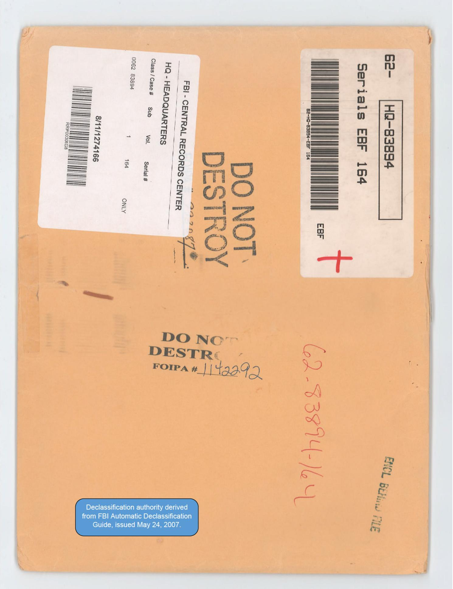
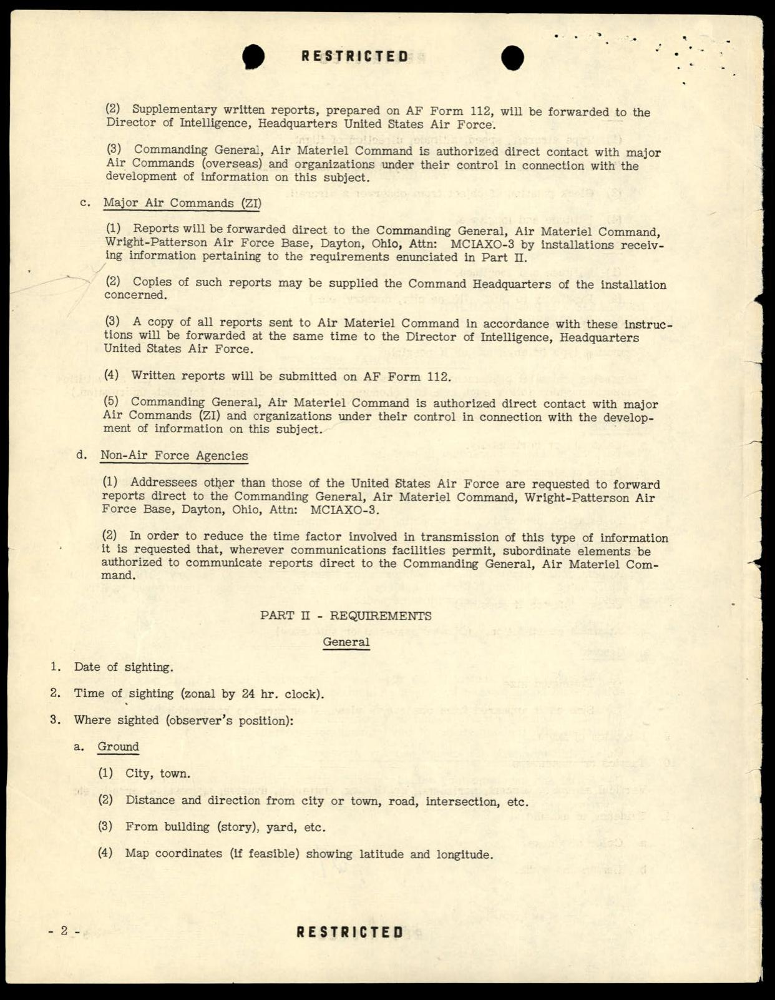
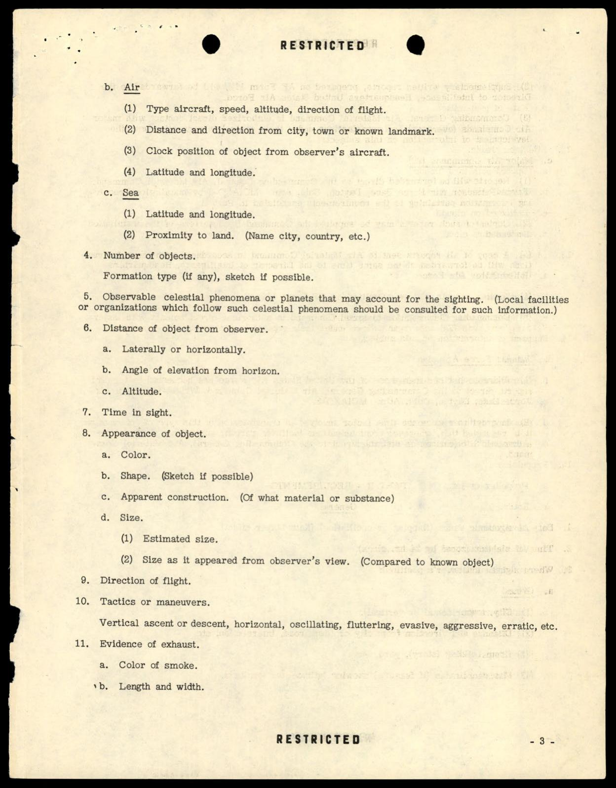
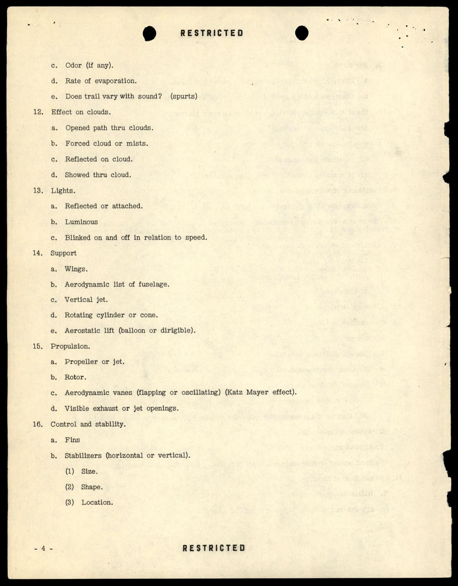
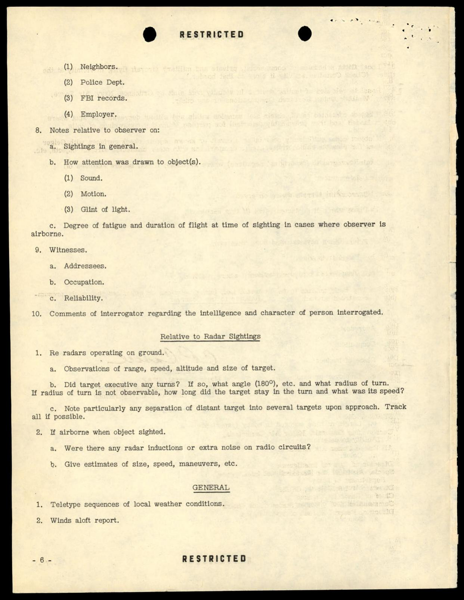
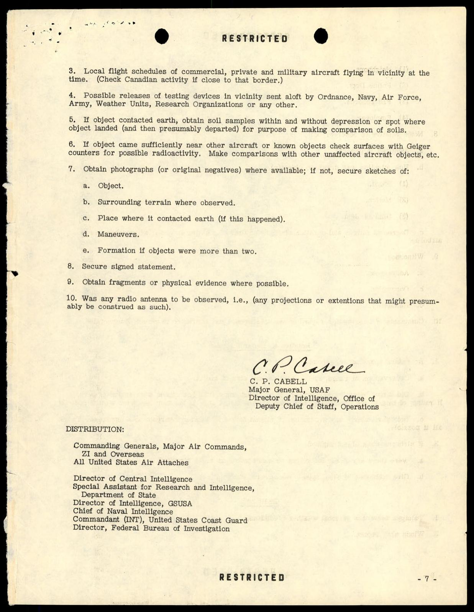

# FBI 62-HQ-83894 案卷 #011 ─ Serial 164：1949 Cabell「Unconventional Aircraft」AFOIN Memo 4 全套訂購單

| 欄位 | 內容 |
|---|---|
| 案卷編號 | `65_HS1-834228961_62-HQ-83894_Serial_164` |
| 日期 | 1949-02-15（memo 簽署） |
| 主軸 | 空軍情報局 Major General C.P. Cabell 1949-02-15 對全軍頒布的「Air Intelligence Requirements Memorandum Number 4: Unconventional Aircraft」，列為 RESTRICTED，FBI 留下完整訂購副本，137 頁中含約 17 份重複副本（含 Director, FBI 名列分發名單） |
| 頁數 | 137（信封封面 + 多份完全相同的 8 頁 memo 影印） |
| 官方 portal | <https://www.war.gov/UFO/#65_HS1-834228961_62-HQ-83894_Serial_164> |

## 為什麼 FBI 保存 17 份相同副本

Serial 164 一份 137 頁的卷宗，內容卻只有一份 8 頁的 memo，重複了大約 17 次。為什麼 FBI 會這樣保存？

答案在 memo 的分發名單裡。1949-02-15 Cabell 發出的 AFOIN（Air Force Office of Information / Office of Intelligence）Memorandum Number 4，分發給：

- All Commanding Generals, Major Air Commands, ZI and Overseas
- All United States Air Attaches
- Director of Central Intelligence
- Special Assistant for Research and Intelligence, Department of State
- Director of Intelligence, GSUSA（陸軍）
- Chief of Naval Intelligence
- Commandant (INT), United States Coast Guard
- **Director, Federal Bureau of Investigation**

FBI 是分發對象之一。但 FBI 顯然不只收到 1 份，而是收到 17 份左右的多套副本（可能是 Bureau Headquarters + 各 Field Office 各一份）。後來這些副本被全部編進 Serial 164 一起歸檔，形成 137 頁的厚卷。

這個歸檔方式罕見的地方是：對 FBI 而言，137 頁裡有 129 頁是冗餘的（同一份 memo 的重複影印）。但 FBI 沒有把它們合併或精簡，全部保留下來，2026 公開時也按原樣釋出。

## §1 信封：62-HQ-83894 Serials EBF 164

FBI Central Records Center 牛皮紙信封，標示：

- 條碼貼紙「62-HQ-83894 / Serials EBF 164」（EBF = Enclosure Behind File）
- 黑色 `DO NOT DESTROY` 印章（兩處）
- 紅色 `+` 標記（檢查標記）
- 紅色 `DO NOT DESTROY / FOIPA #1142292` 印章
- 紅筆手寫 `62-83894-164`
- 中間白色 FBI Central Records Center 標籤，Class/Case # 0062-83894、Vol. 1、Serial # 164、ONLY、條碼 8/11/1274166
- 右側 `ENCL BEHIND FILE` 黑章
- 右下藍色解密貼紙：「Declassification authority derived from FBI Automatic Declassification Guide, issued May 24, 2007」

FOIPA #1142292 與 Serial 403 共用同一個 FOIPA 編號，意味是同一次 FOIA 請求批次釋出。

## §2 memo 第 1 頁：發文 + 目的 + 廢止舊文

第二頁是 memo 第 1 頁：

> RESTRICTED
>
> DEPARTMENT OF THE AIR FORCE
> HEADQUARTERS UNITED STATES AIR FORCE
> DIRECTORATE OF INTELLIGENCE
> WASHINGTON 25, D.C.
>
> 15 February 1949
>
> AIR INTELLIGENCE REQUIREMENTS
> MEMORANDUM NUMBER 4
>
> UNCONVENTIONAL AIRCRAFT
>
> PART I - GENERAL
>
> 1. PURPOSE
> The purpose of this memorandum is twofold:
>
> a. To enunciate continuing Air Force requirements for information pertaining to sightings of unconventional aircraft and unidentified flying objects, including the so-called "Flying Discs."
>
> b. To establish procedures for reporting such information.

> 本 memo 目的有二：a. 明定空軍對非常規飛行器與不明飛行物（含所謂「飛碟」）目擊報告的長期情報需求；b. 建立此類資訊的回報程序。

> 2. RESCISSION
> Department of the Army Collection Memorandum Number 7, dated 21 January 1948, and letter, CSGID 425.1, dated 25 March 1948, both subject as above, which have been transferred to Air Force agencies for action, are herewith superseded.

> 1948-01-21 陸軍部收集備忘錄第 7 號與 1948-03-25 CSGID 425.1 函件（兩者同主題、已轉給空軍辦理）此處廢止取代。

廢止舊文的兩個日期都落在 1948 年第一季，正好是 [Section 3](../003-65_hs1-834228961_62-hq-83894_section_3/report.md) 記錄的 FBI 在 1947-10-01 退出 UFO 調查、把所有案件轉給空軍之後不久。陸軍部 1948-01 那份備忘錄是空軍剛從陸軍航空隊分出（1947-09-18）後的過渡產物。Cabell 1949-02-15 這份 memo 正式把整個流程歸到空軍。

紅筆手寫的 `62-83894-164` 在頁底中央，加上 `ENCLOSURE` 紅字章。左下角加上手寫鉛筆「additional copies behind file」(額外副本在本檔案之後)，這就解釋了為什麼後面有 17 份重複的 memo 副本。

## §3 memo 第 2-3 頁：回報程序

PART I 第 2-3 頁規範誰怎麼回報：

- **海外 Major Air Commands + Air Attaches**：透過電報直接傳給 HQ USAF Director of Intelligence，標明「Pass to COMGENAMC WRIGHT-PATTERSON AFB, DAYTON, OHIO, ATTN: MCIAXO-3.」（轉空軍物資司令部，萊特派特森基地，注意：MCIAXO-3）
- **書面後續報告**：填 AF Form 112，寄 Director of Intelligence
- **空軍物資司令部（AMC, Wright-Patterson）**：可直接跟各 Major Air Commands、其他組織聯絡
- **本土 Major Air Commands**：報告直接寄 Wright-Patterson AMC，ATTN: MCIAXO-3
- **Non-Air Force Agencies（含 FBI）**：報告直接寄 Wright-Patterson AMC

MCIAXO-3 是 Project Sign / Grudge 在萊特派特森基地的內部代號。1949-02 那時候 Project Sign 已經改名 Project Grudge（1949-02-11 改名，比這份 memo 早 4 天）。

PART II 開始列出回報需要包含的資料項目，分四大段：General（時間地點）、Relative to the Observer（目擊者背景）、Relative to Radar Sightings（雷達跡象）、General（最後一段）。

第 3 頁列 General 的 1-3 項：

1. Date of sighting
2. Time of sighting（zonal by 24 hr. clock）
3. Where sighted（observer's position）：
   - a. Ground（city, town; distance and direction from city/road/intersection; from building (story), yard; map coordinates）
   - b. Air（type aircraft, speed, altitude, direction of flight; distance/direction from city/town; clock position of object from observer's aircraft; latitude and longitude）
   - c. Sea（latitude and longitude; proximity to land）

## §4 memo 第 3-4 頁：物體外觀與動作

第三頁繼續：

4. Number of objects + Formation type (if any), sketch if possible
5. Observable celestial phenomena or planets that may account for the sighting
6. Distance of object from observer（laterally, angle of elevation, altitude）
7. Time in sight
8. **Appearance of object**：a. Color; b. Shape (sketch if possible); c. Apparent construction (Of what material or substance); d. Size (1. Estimated size; 2. Size as it appeared from observer's view, compared to known object)
9. Direction of flight
10. **Tactics or maneuvers**：Vertical ascent or descent, horizontal, oscillating, fluttering, evasive, aggressive, erratic, etc.
11. **Evidence of exhaust**：a. Color of smoke; b. Length and width; c. Odor (if any); d. Rate of evaporation; e. Does trail vary with sound? (spurts)
12. **Effect on clouds**：a. Opened path thru clouds; b. Forced cloud or mists; c. Reflected on cloud; d. Showed thru cloud
13. **Lights**：a. Reflected or attached; b. Luminous; c. Blinked on and off in relation to speed
14. **Support**：a. Wings; b. Aerodynamic list of fuselage; c. Vertical jet; d. Rotating cylinder or cone; e. Aerostatic lift (balloon or dirigible)
15. **Propulsion**：a. Propeller or jet; b. Rotor; c. Aerodynamic vanes (flapping or oscillating)(Katz Mayer effect); d. Visible exhaust or jet openings
16. **Control and stability**：a. Fins; b. Stabilizers (horizontal or vertical) - Size, Shape, Location
17. **Air ducts**：a. Slots; b. Duct openings
18. **Speed - M.P.H.**
19. **Sound**：a. Continuous whine or buzz; b. Roar, whistle, whoosh; c. Intermittent
20. **Manner of disappearance**：a. Explode (Possibility of fragments, Other physical evidence); b. Faded from view; c. Disappeared behind obstacle

這份清單是 1949 年空軍對「unconventional aircraft」可觀察特徵的完整盤點。注意第 15 項「Aerodynamic vanes (flapping or oscillating)(Katz Mayer effect)」，Katz Mayer 效應指流體在振盪翼下的升力產生機制，1940 年代的空氣動力研究議題。把它列進飛碟 memo，意味空軍把「會拍動或振盪的翼面」當作可能的推進方式之一。

## §5 memo 第 5-6 頁：觀察者背景 + 雷達

第七頁是 memo 第 5-6 頁，列「Relative to the Observer」+「Relative to Radar Sightings」：

> Relative to the Observer
>
> 1. Name of observer.
> 2. Address.
> 3. Occupation.
> 4. Place of business. a. Employer or employee.
> 5. Pertinent hobbies. a. Is observer amateur astronomer, pilot, engineer, etc. b. Length of time engaged in hobby (experience).
> 6. Ability to determine: a. Color. b. Speed of moving objects. c. Size at distance.
> 7. Reliability of observer. a. Sources.
>    (1) Neighbors. (2) Police Dept. (3) FBI records. (4) Employer.
> 8. Notes relative to observer on: a. Sightings in general. b. How attention was drawn to object(s). (1) Sound. (2) Motion. (3) Glint of light. c. Degree of fatigue and duration of flight at time of sighting in cases where observer is airborne.
> 9. Witnesses. a. Addressees. b. Occupation. c. Reliability.
> 10. Comments of interrogator regarding the intelligence and character of person interrogated.

第 7 條 Reliability of observer a. Sources 寫到要查的對象是「Neighbors / Police Dept / **FBI records** / Employer」。空軍直接把 FBI 列為查目擊者背景的 standard source。這是 1947-1948 年 FBI 跟空軍角力的延續：FBI 雖然 1947-10 退出 UFO 個案調查，但繼續扮演「人員背景查核資料庫」的角色。

> Relative to Radar Sightings
>
> 1. Re radars operating on ground. a. Observations of range, speed, altitude and size of target. b. Did target execute any turns? If so, what angle (180°), etc. and what radius of turn? If radius of turn is not observable, how long did the target stay in the turn and what was its speed? c. Note particularly any separation of distant target into several targets upon approach. Track all if possible.
> 2. If airborne when object sighted. a. Were there any radar inductions or extra noise on radio circuits? b. Give estimates of size, speed, maneuvers, etc.

「target separation into several targets upon approach」（目標接近時分裂成多個目標）是 1947 Arnold 案後特別注意的特徵。「radar inductions or extra noise on radio circuits」（雷達感應或無線電額外雜訊）是 EMI 干擾觀察，後來在 1957 Levelland 引擎熄火案（[Section 9](../008-65_hs1-834228961_62-hq-83894_section_9/report.md)）有更明確的證據。

## §6 memo 第 7 頁：General + Cabell 簽名 + 分發名單

第八頁是 memo 第 7 頁，列 General 最後一段：

> 1. Teletype sequences of local weather conditions.
> 2. Winds aloft report.
> 3. Local flight schedules of commercial, private and military aircraft flying in vicinity at the time. (Check Canadian activity if close to that border.)
> 4. Possible releases of testing devices in vicinity sent aloft by Ordnance, Navy, Air Force, Army, Weather Units, Research Organizations or any other.
> 5. If object contacted earth, obtain soil samples within and without depression or spot where object landed (and then presumably departed) for purpose of making comparison of soils.
> 6. If object came sufficiently near other aircraft or known objects check surfaces with Geiger counters for possible radioactivity. Make comparisons with other unaffected aircraft objects, etc.
> 7. Obtain photographs (or original negatives) where available; if not, secure sketches of: a. Object. b. Surrounding terrain where observed. c. Place where it contacted earth (if this happened). d. Maneuvers. e. Formation if objects were more than two.
> 8. Secure signed statement.
> 9. Obtain fragments or physical evidence where possible.
> 10. Was any radio antenna to be observed, i.e., (any projections or extensions that might presumably be construed as such).

> 1. 當地天氣電報。2. 高空風報告。3. 當時飛經當地的商用、民用、軍機航班時刻表（若靠近加拿大邊界，查加拿大活動）。4. 軍械署、海軍、空軍、陸軍、氣象單位、研究機構或任何其他單位可能在當地施放的測試裝置。5. 若物體接觸地面，取下陷處內外的土壤樣本，比較土質。6. 若物體靠近其他飛機或已知物體，用 Geiger 計數器掃描表面找放射性，跟未受影響的飛機物體比較。7. 取得物體、周圍地形、接地點、機動、編隊（若 > 2 個物體）的照片或原始底片，若無則速記草圖。8. 取得簽名聲明。9. 盡可能取得碎片或物理證據。10. 是否看到任何可能被解釋成無線電天線的突出物或延伸物？

第 4 項是 1949 年空軍對「Project Mogul」「Skyhook」等高空研究氣球的官方確認：space-band 偵測氣球是常見的誤報來源。第 5、6 項是 [Section 4](../004-65_hs1-834228961_62-hq-83894_section_4/report.md) Chiles-Whitted DC-3 案後續 Project SIGN 採土壤樣本流程的源頭。第 9 項「碎片或物理證據」是 [Section 3](../003-65_hs1-834228961_62-hq-83894_section_3/report.md) Maury Island 案的延續：1947 年 Brown + Davidson 載著 Dahl 碎片墜機後，空軍要求所有 UFO 物理證據都要遵循採樣流程。

> C. P. CABELL
> Major General, USAF
> Director of Intelligence, Office of
> Deputy Chief of Staff, Operations
>
> DISTRIBUTION:
> Commanding Generals, Major Air Commands, ZI and Overseas
> All United States Air Attaches
> Director of Central Intelligence
> Special Assistant for Research and Intelligence, Department of State
> Director of Intelligence, GSUSA
> Chief of Naval Intelligence
> Commandant (INT), United States Coast Guard
> Director, Federal Bureau of Investigation

簽名的 Cabell 是 USAF Major General、後來 1953-1962 任 CIA 副局長，1961 年 Bay of Pigs 事件後辭職。1949 年的 Cabell 還是空軍情報局長。他的簽名底下「Office of Deputy Chief of Staff, Operations」明白把這份 memo 定位為「作戰副參謀長辦公室 + 情報局」的聯合產物。

## §7 為什麼 FBI 留下 17 份相同副本

對照 [Section 4 §11](../004-65_hs1-834228961_62-hq-83894_section_4/report.md)：1948-1949 是 FBI 從 UFO 個案調查全面退出、轉為「對外提供 background check」角色的關鍵轉變期。Cabell 1949-02-15 memo 把 FBI 列在分發名單裡，意味空軍正式把 FBI 當作 standing reference，不再依靠 FBI 做個案調查。

FBI Headquarters 收到的 1 份原件 + 各 Field Office（紐約、洛杉磯、芝加哥、舊金山、丹佛、達拉斯、邁阿密、新奧爾良、波士頓、費城、底特律、克利夫蘭、匹茲堡、堪薩斯城、聖路易、西雅圖、亞特蘭大... 共 17 個主要 Field Office）各 1 份的可能性吻合 17 份重複副本的數量。

FBI 把所有副本歸進 Serial 164 一起檔，技術上保留了所有版本（包含 Field Office 副本的內部流通標記），對歷史研究者來說是完整的「分發 + 接收」紀錄。

## 影像規格與來源

| 項目 | 內容 |
|---|---|
| 格式 | PDF，AES-256 加密 |
| 頁數 | 137（含約 17 套重複副本） |
| 解密日 | 2007-05-24（FBI Automatic Declassification Guide） |
| 公開日 | 2026-05-08 |
| 原始機密層級 | RESTRICTED（最低密級，1949 年標準） |
| 機關 | USAF Directorate of Intelligence → Director, FBI（多單位分發） |
| FOIPA | #1142292 |
| 官方下載 | <https://www.war.gov/medialink/ufo/release_1/65_hs1-834228961_62-hq-83894_serial_164.pdf> |

## 相關案件

- [#003 Section 3](../003-65_hs1-834228961_62-hq-83894_section_3/report.md) ─ 1947-10-01 FBI 退出 UFO 調查（Bureau Bulletin #51）、Maury Island 碎片案
- [#004 Section 4](../004-65_hs1-834228961_62-hq-83894_section_4/report.md) ─ 1948 Chiles-Whitted DC-3 案、Project SIGN 土壤樣本流程
- [#008 Section 9](../008-65_hs1-834228961_62-hq-83894_section_9/report.md) ─ 1957 Levelland 引擎熄火案，本 memo 第 2.a「radar inductions or extra noise」的後續對應

## 來源

US Department of War, PURSUE FOIA Release, 2026-05-08
65_HS1-834228961_62-HQ-83894_Serial_164
<https://www.war.gov/UFO/#65_HS1-834228961_62-HQ-83894_Serial_164>
