# FBI 62-HQ-83894 案卷 #012 ─ Serial 220：墨西哥發明家 Garcia Macias 給美國科學調查委員會的飛碟設計信

| 欄位 | 內容 |
|---|---|
| 案卷編號 | `65_HS1-834228961_62-HQ-83894_Serial_220` |
| 日期 | 1950-03-19（信件） / 1950-04-07（FBI 紐約 stamp） |
| 主軸 | 委拉克魯斯（Veracruz）發明家 Miguel Angel Garcia Macias 親筆寫信給「美國科學調查委員會總統」，附 1950 年 3 月墨西哥 Durango 拍到的「第一張飛碟照」剪報 + 5 張黑板手繪設計圖 |
| 頁數 | 15 頁（信封 + 英譯本 + 西文原件 + 5 張設計圖 + 信封寄件袋） |
| 官方 portal | <https://www.war.gov/UFO/#65_HS1-834228961_62-HQ-83894_Serial_220> |

## 為什麼一封來自墨西哥的私人發明家信函會進到 FBI 主案卷

Serial 220 在 1950-04-07 從 FBI 紐約辦事處進到主案卷。它是一封 1950-03-19 從委拉克魯斯（Veracruz, Mexico）由「Pianist Composer Discoverer and Ideographic Inventor」Miguel Angel Garcia Macias 寄出、收件人寫「美國科學調查委員會總統」（President of the Commission of Scientific Investigation of the United States of North America）的信。

信本身寫得直白：「Aerial 飛碟其實就是我發明的『stratospheric aerostats』。我要把這個 IDEA 提交給貴委員會。」隨信附上的還包括 5 張學校黑板上用粉筆畫出來的飛行器設計圖（chalk-on-blackboard sketches）和一份 1950-03-16 墨西哥日報 El Cromos 的剪報「Las Primeras Fotografias de un 'Plato Volador'」（飛碟的第一張照片）。

FBI 沒把這封信轉給其他單位，而是直接歸進 62-HQ-83894 主案卷。這意味 FBI 把它視為 UFO 案卷裡的一個資料點：一個外國民眾自願寄來的、宣稱「飛碟就是我設計的」的私人陳述。

## §1 信封：FBI Central Records Center 編號 + ENCL BEHIND FILE

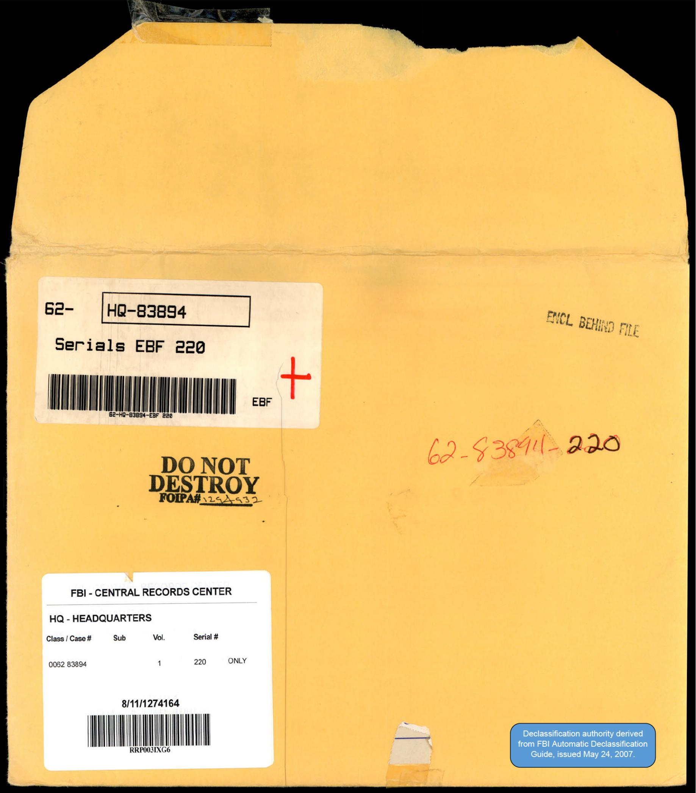

第一頁是 FBI Central Records Center 的牛皮紙信封正面。標示：

- 上方手寫 `62-HQ-83894 / Serials EBF 220`（EBF = Enclosure Behind File）
- 條碼貼紙 `62-HQ-83894-EBF 220`
- 黑色 `DO NOT DESTROY / FOIPA #1294532` 印章
- 黑色橡皮章 `ENCL BEHIND FILE`
- 紅筆手寫 `62-83894-220`
- 中間白色 FBI Central Records Center 標籤，Class/Case # 0062-83894、Vol. 1、Serial # 220、ONLY
- 標籤下方條碼 8/11/1274164
- 右下藍色貼紙：「Declassification authority derived from FBI Automatic Declassification Guide, issued May 24, 2007」

ENCL BEHIND FILE 章意味這份原本是附在另一份主檔之後的 enclosure，這次數位化時被單獨拆出，編成獨立 Serial 220 歸檔。FOIPA #1294532 是 FOIA / Privacy Act 請求編號。

## §2 英譯本第 1 頁：發明家自介 + 三項發明

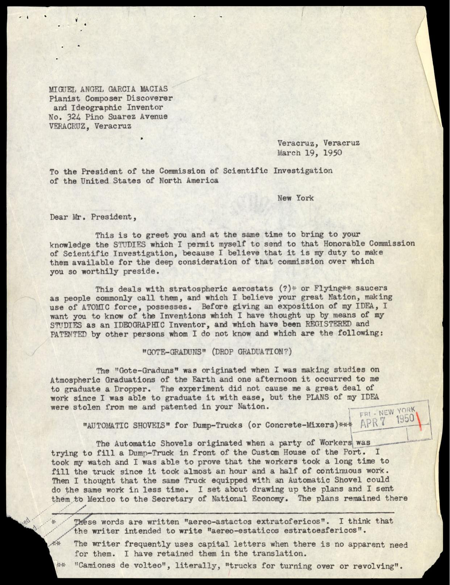

第二頁是 FBI 翻譯員 Mrs. Sophia Saliba 在紐約做的英譯本第 1 頁。原信全文翻譯：

> MIGUEL ANGEL GARCIA MACIAS
> Pianist Composer Discoverer
> and Ideographic Inventor
> No. 324 Pino Suarez Avenue
> VERACRUZ, Veracruz

> Veracruz, Veracruz
> March 19, 1950

> To the President of the Commission of Scientific Investigation
> of the United States of North America
> New York

> Dear Mr. President,

> This is to greet you and at the same time to bring to your knowledge the STUDIES which I permit myself to send to that Honorable Commission of Scientific Investigation, because I believe that it is my duty to make them available for the deep consideration of that commission over which you so worthily preside.

> 親愛的總統先生：本信向您致意，同時向您報告我的 STUDIES，這些研究我冒昧地寄給該尊貴的科學調查委員會，因為我認為我有義務把它們交給您所主持的這個委員會深入考慮。

> This deals with stratospheric aerostats (?) or Flying** saucers as people commonly call them, and which I believe your great Nation, making use of ATOMIC force, possesses. Before giving an exposition of my IDEA, I want you to know of the Inventions which I have thought up by means of my STUDIES as an IDEOGRAPHIC Inventor, and which have been REGISTERED and PATENTED by other persons whom I do not know and which are the following:

> 本信討論的是 stratospheric aerostats（？）或人們通稱的「Flying saucers」，我相信貴國利用 ATOMIC 力量已經擁有它們。在闡述我的 IDEA 之前，我想讓您知道我這個 IDEOGRAPHIC 發明家透過 STUDIES 想出來的幾項發明，它們已經被其他不認識我的人 REGISTER 並 PATENT 走，內容如下：

接著 Garcia 列出他的三項主要發明：

- **"GOTE-GRADUNS"（DROP GRADUATION）**：研究大氣分級時意外發明的「滴管分級」實驗，圖紙被偷走另登專利
- **"AUTOMATIC SHOVELS" for Dump-Trucks**：站在 Veracruz 海關大樓對面看到工人花一個半小時填卡車後想出的自動填料系統，圖紙寄到墨西哥國家經濟部後 8 個月，被告知已被另一個他不認識的人申請專利

FBI 譯本還在註腳寫明西語原文「aereo-astactos extratoferícos」直譯應該是「aereo-estaticos estratoesfericos」（平流層的氣體靜止裝置），「Camiones de volteo」字面是「翻轉用的卡車」（dump-trucks）。

## §3 英譯本第 2 頁：其他發明 + 飛碟原理

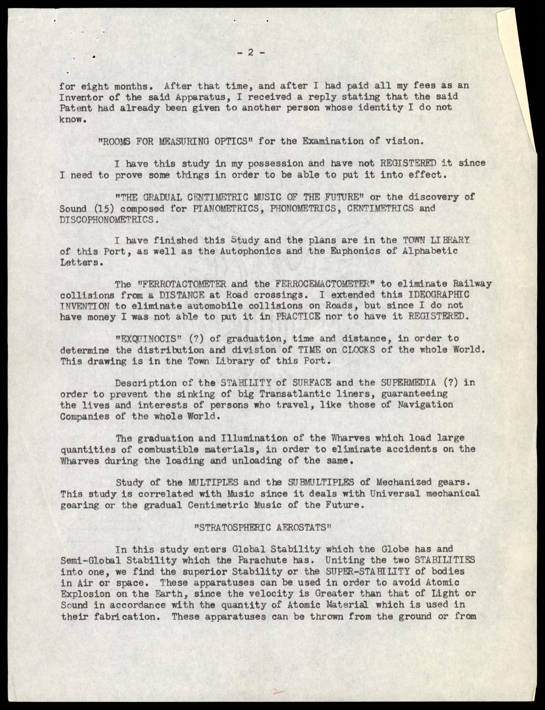

第二頁繼續列其他發明：

- **"ROOMS FOR MEASURING OPTICS"** for the Examination of vision（視力檢查用的光學測量室）
- **"THE GRADUAL CENTIMETRIC MUSIC OF THE FUTURE"** ─ 一種把聲音 (15) 成分用 PIANOMETRICS、PHONOMETRICS、CENTIMETRICS、DISCOPHONOMETRICS 重組的音樂理論
- **"FERROTACTOMETER and the FERROCEMACTOMETER"** ─ 鐵路防撞遠距感測器，他想擴大到公路汽車防撞但沒錢申請專利
- **"EXQUINOCIS" (?) of graduation, time and distance** ─ 全球時鐘的時間分配理論
- **STABILITY of SURFACE and SUPERMEDIA** ─ 防止跨大西洋郵輪沉沒
- **MULTIPLES and SUBMULTIPLES of Mechanized gears** ─ 機械齒輪的倍數理論

接著是飛碟原理：

> "STRATOSPHERIC AEROSTATS"

> In this study enters Global Stability which the Globe has and Semi-Global Stability which the Parachute has. Uniting the two STABILITIES into one, we find the superior Stability or the SUPER-STABILITY of bodies in Air or space. These apparatuses can be used in order to avoid Atomic Explosion on the Earth, since the velocity is Greater than that of Light or Sound in accordance with the quantity of Atomic Material which is used in their fabrication. These apparatuses can be thrown from the ground or from the Water since the Conic-Global or Global-Conic form permits it.

> 在這個研究中加入兩種穩定性：地球擁有的「全球穩定性」（Global Stability）和降落傘擁有的「半全球穩定性」（Semi-Global Stability）。把兩種穩定性結合成一個，就得到空氣或太空中物體的「超級穩定性」（SUPER-STABILITY）。這些裝置可以用來避免地球上的原子爆炸，因為其速度大於光速或音速，視製造時使用的原子材料量而定。這些裝置因為具有 Conic-Global 或 Global-Conic 形狀，可以從地面或水中發射。

## §4 英譯本第 3 頁：原子能推進 + 結語

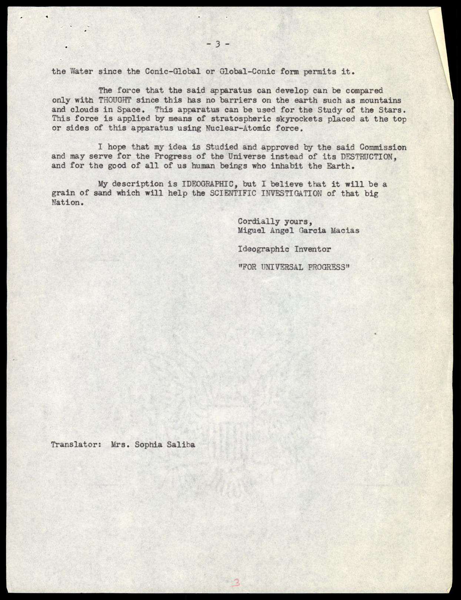

最後一頁的英譯結語：

> The force that the said apparatus can develop can be compared only with THOUGHT since this has no barriers on the earth such as mountains and clouds in Space. This apparatus can be used for the Study of the Stars. This force is applied by means of stratospheric skyrockets placed at the top or sides of this apparatus using Nuclear-Atomic force.

> 這個裝置能產生的力量只能跟 THOUGHT（思想）相比，因為思想在地球上沒有山或太空中雲的障礙。這個裝置可以用於 Study of the Stars（恆星研究）。這個力量是透過放在裝置頂部或側邊、使用 Nuclear-Atomic 力量的平流層火箭施加的。

> I hope that my idea is Studied and approved by the said Commission and may serve for the Progress of the Universe instead of its DESTRUCTION, and for the good of all of us human beings who inhabit the Earth.

> 我希望這個想法能被該委員會研究與批准，並服務於宇宙的進步而不是其毀滅，造福所有居住在地球上的人類。

> My description is IDEOGRAPHIC, but I believe that it will be a grain of sand which will help the SCIENTIFIC INVESTIGATION of that big Nation.

> 我的描述是 IDEOGRAPHIC（意符式），但我相信它會是一粒沙，能幫助該大國的科學調查。

> Cordially yours,
> Miguel Angel Garcia Macias
> Ideographic Inventor
> "FOR UNIVERSAL PROGRESS"

> Translator: Mrs. Sophia Saliba

Garcia 自署「Ideographic Inventor」「FOR UNIVERSAL PROGRESS」是他的個人簽名銜頭。Sophia Saliba 是 FBI 紐約辦事處接案的翻譯員。

## §5 Durango 飛碟剪報：第一張飛碟照

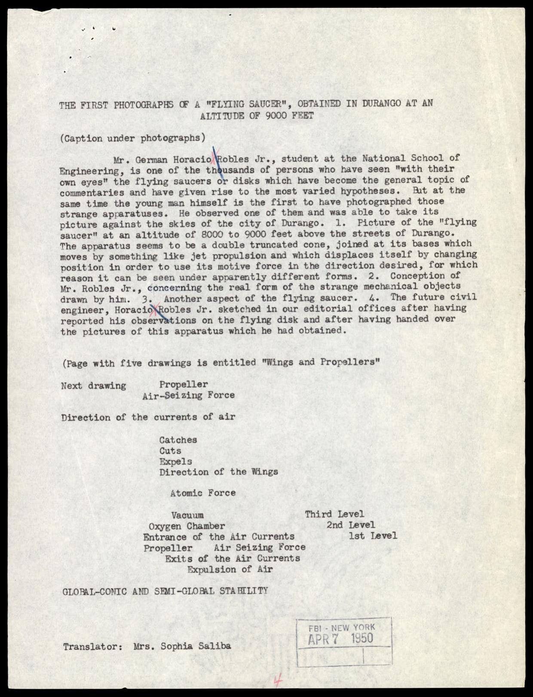

第五頁是另一份附件的英譯：墨西哥日報 1950-03-16 刊出的剪報「THE FIRST PHOTOGRAPHS OF A 'FLYING SAUCER', OBTAINED IN DURANGO AT AN ALTITUDE OF 9000 FEET」（在 9000 英尺高空拍到飛碟的第一張照片）。

> Mr. German Horacio Robles Jr., student at the National School of Engineering, is one of the thousands of persons who have seen "with their own eyes" the flying saucers or disks which have become the general topic of commentaries and have given rise to the most varied hypotheses. But at the same time the young man himself is the first to have photographed those strange apparatuses. He observed one of them and was able to take its picture against the skies of the city of Durango.

> German Horacio Robles Jr. 是國家工程學院的學生。他是「親眼」看到飛碟的數千人之一，飛碟已經成為大眾評論的普遍話題並引發各種不同的假說。但同時這位年輕人也是第一個把這些奇怪裝置拍下來的人。他觀察到其中一個，並能在 Durango 城市的天空背景下把它拍下來。

> 1. Picture of the "flying saucer" at an altitude of 8000 to 9000 feet above the streets of Durango. The apparatus seems to be a double truncated cone, joined at its bases which moves by something like jet propulsion and which displaces itself by changing position in order to use its motive force in the direction desired, for which reason it can be seen under apparently different forms. 2. Conception of Mr. Robles Jr., concerning the real form of the strange mechanical objects drawn by him. 3. Another aspect of the flying saucer. 4. The future civil engineer, Horacio Robles Jr. sketched in our editorial offices after having reported his observations on the flying disk and after having handed over the pictures of this apparatus which he had obtained.

剪報描述 Robles 看到的飛碟是「雙截錐」（double truncated cone）形狀，兩個截錐底部相連（也就是上下兩個倒過來的圓錐拼成菱形），靠類似噴氣推進的方式移動，可以改變姿勢來把推力方向轉向。

剪報還列出 5 張附圖的標題（「Wings and Propellers」），列出每張圖的元素：Propeller、Air-Seizing Force、Direction of the currents of air、Catches Cuts Expels、Direction of the Wings、Atomic Force（Vacuum / Oxygen Chamber / Entrance of the Air Currents / Propeller / Air Seizing Force / Exits of the Air Currents / Expulsion of Air）、GLOBAL-CONIC AND SEMI-GLOBAL STABILITY。

## §6 西文原信

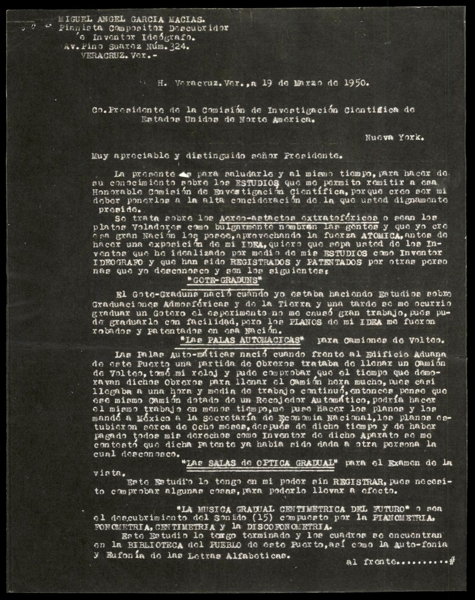

第七頁是 Garcia 寄出的西文原信第一頁。打字機字體，西語原文。文法與英譯本對應，但保留 Garcia 原本的西語拼法（部分是非標準拼法，例如 "aereo-astactos extratoferícos"）。

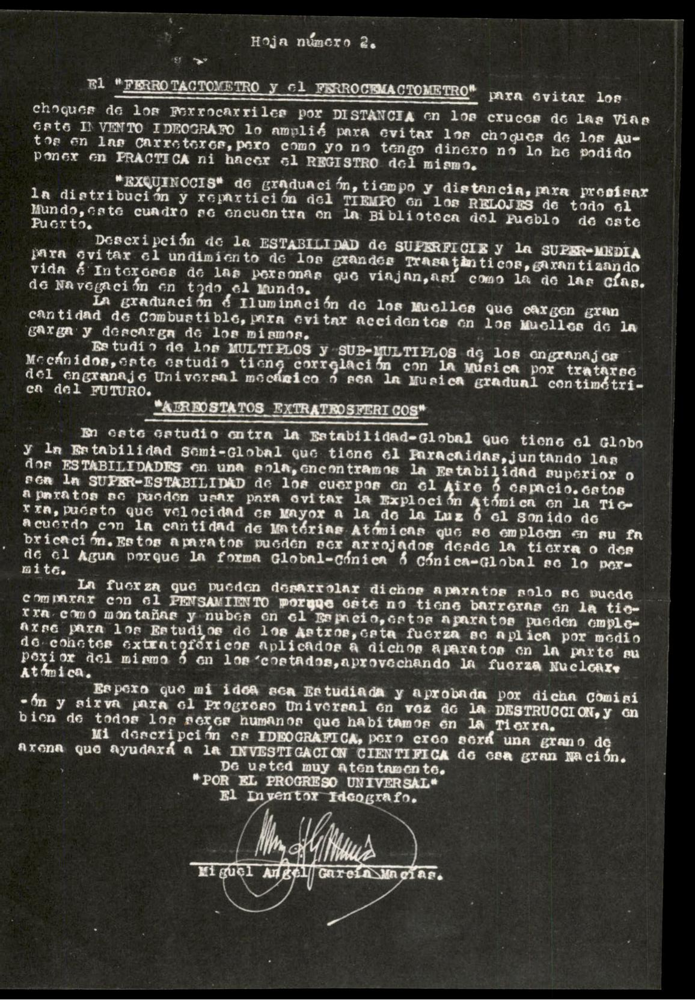

第八頁是西文原信第二頁，含 Garcia 手寫簽名 + 印章「Miguel Angel Garcia Macias」。

## §7 寄件信封：航空郵件 + 50 cents 郵資

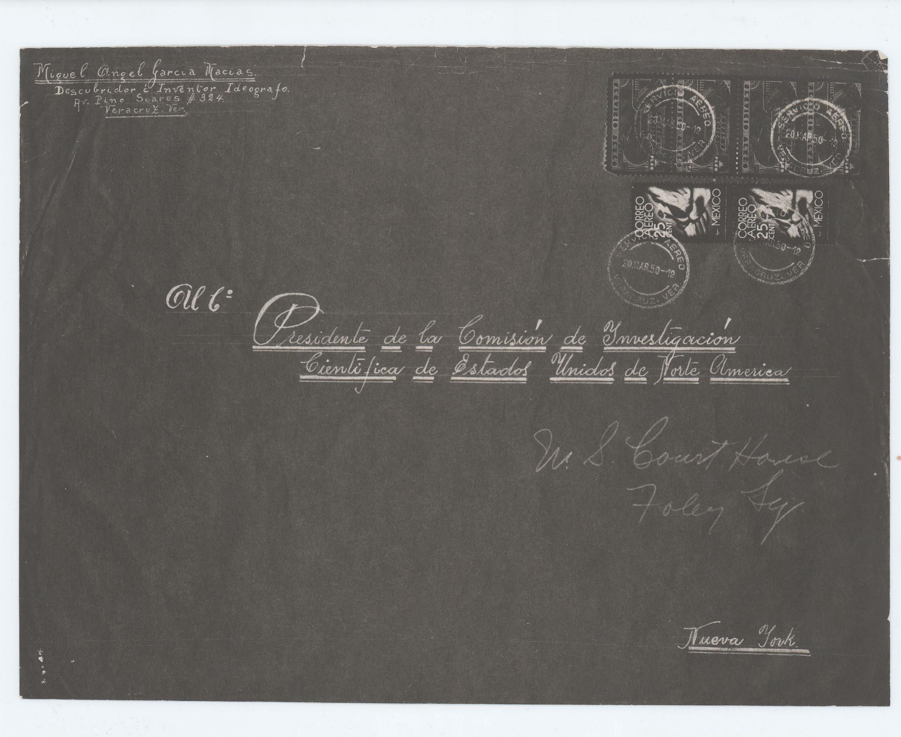

第九頁是 Garcia 寄到紐約的真正航空信封反面。深棕色磨損紙質。手寫銀色字跡：

> Miguel Angel Garcia Macias
> Descubridor é Inventor Ideografo
> Av. Pino Suarez # 324
> Veracruz, Ver.

> Al C. Presidente de la Comisión de Investigación
> Científica de Estados Unidos de Norte America
> U.S. Court House
> Foley Sq.
> Nueva York

四張墨西哥航空郵票，兩張 50 centavos、兩張 25 centavos，蓋有 Veracruz 出口戳「20 MAR 50」。Garcia 沒有確切的美國對口單位地址，所以把收件地址寫成「U.S. Court House, Foley Sq.（聯邦法院大樓，紐約 Foley 廣場）」。Foley Square 是紐約曼哈頓的聯邦行政區，FBI 紐約辦事處跟聯邦法院都在這附近，所以信件最後落到 FBI 紐約辦事處。

## §8 5 張黑板手繪設計圖

Garcia 寄了 5 張用粉筆畫在學校黑板上、然後拍下來的飛碟設計圖。每張都是黑底白字、邊框工整、字體統一的「教學掛圖」風格。

### §8.1 Conic-Global 與 Semi-Global Stability（俯視）

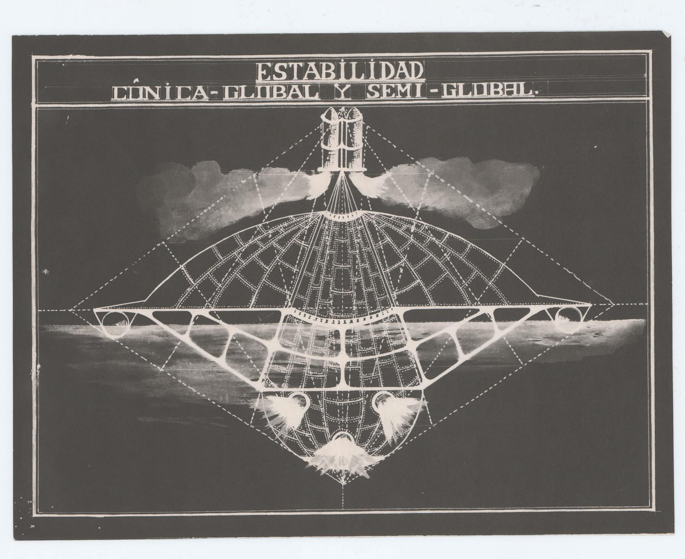

第十頁是飛行器側視圖，標題「ESTABILIDAD CÓNICA-GLOBAL Y SEMI-GLOBAL」。畫面中央是一個碟狀載具：

- 上半部是半球形圓頂（球體上半，畫格線網格）
- 中段是垂直貫穿的中心軸（Garcia 標的「stratospheric skyrocket」位置）
- 下半部是倒錐形（菱形下半），延伸到水面下
- 左右兩翼伸出尖端
- 底部噴出尾焰
- 上方雲層、下方水波，顯示載具可以從水下發射

格線網格畫法跟早期太空船設計圖（von Braun 1950s 科普書、Disney 1950s「Tomorrowland」太空船插畫）有相同的視覺語言。

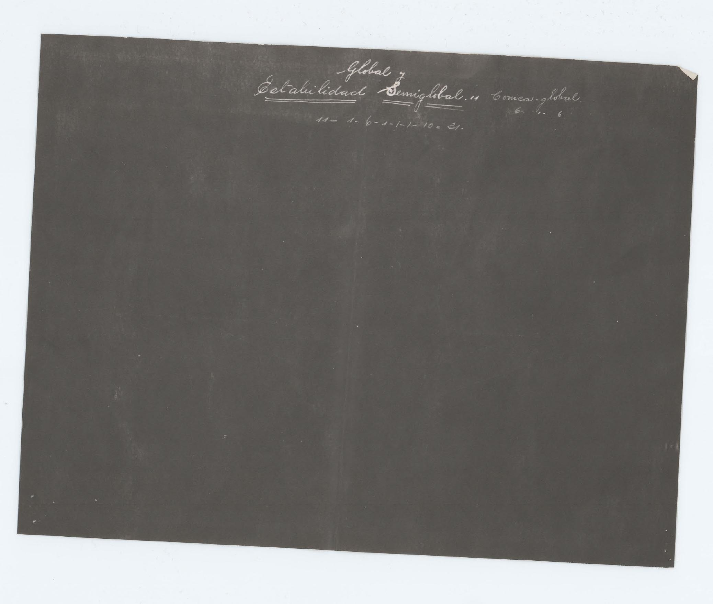

第十一頁是同一張圖的反面（紙的背面），透過紙張可以看到正面 chalk 字跡的鏡像，加上紙頂手寫銀色字「Estabilidad Semi-Global - Conica-global / Global / 11-1-6-1-1-1-10 = 31」（不完全解讀的注記）。

### §8.2 Hélice：螺旋槳 + 引擎艙剖面

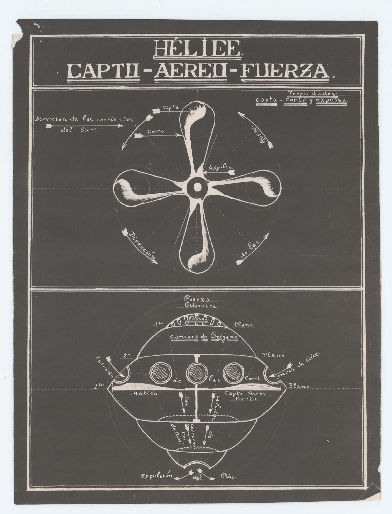

第十二頁是「HÉLICE CAPTA-AEREO-FUERZA」（螺旋槳-空氣捕獲-力量）兩格圖。

上格：俯視四葉螺旋槳，每片葉都標 capta（捕獲）、corta（切割）、expulsa（排出）、Dirección de las corrientes del aire（氣流方向）、Aspas（葉片）、propiedades: capta, corta y expulsa（性質：捕獲、切割、排出）。

下格：飛行器剖面，標示三層 Plano（平面）：

- 3er Plano：頂部，Fuerza Atómica（原子力）
- 2do Plano：中間，Cámara de Oxígeno（氧氣艙），開三個圓孔讓 Corrientes de aire（氣流）進入
- 1er Plano：底層，Hélice + Capto-Aereo Fuerza（螺旋槳 + 空氣捕獲力）
- 底部：expulsión del Aire（空氣排出）

整個設計思路是：頂部的原子推進器把高能量輸出推進到中段氧氣艙，氧氣艙裡的螺旋槳把空氣切割並從底部排出，產生推力。

### §8.3 1950-03-16 剪報照片版

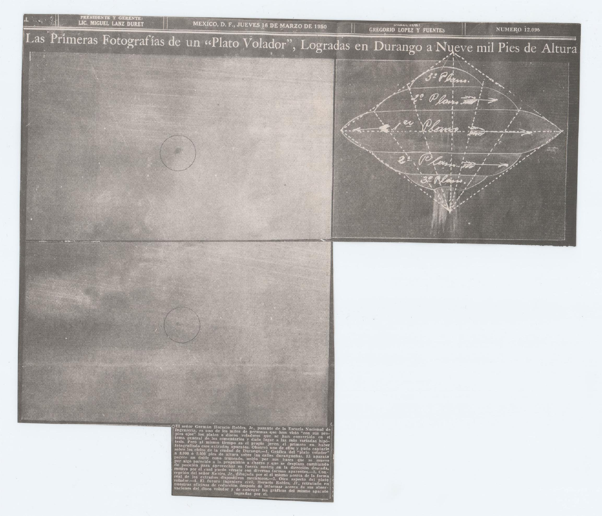

第十三頁是 1950-03-16 El Cromos 報的實際剪報：「Las Primeras Fotografías de un 'Plato Volador', Logradas en Durango a Nueve mil Pies de Altura」（在 Durango 9000 英尺高空拍到的飛碟第一張照片）。

剪報中央是兩張 Robles 拍的照片（上下排列，灰階畫面看不太出輪廓），右側是一張 Robles 自己畫的菱形雙錐形示意圖，標示「3er Plano / 2do Plano / 1er Plano / 2do Plano / 3er Plano」上下對稱五層結構。

Robles 的雙錐形示意圖跟 Garcia 第十頁的「Cónica-Global y Semi-Global」設計圖極為相似（兩者都是菱形雙錐 + 5 層結構）。這暗示 Garcia 可能直接受 Robles 1950-03 剪報啟發，把它套進自己已經有的 IDEOGRAPHIC INVENTOR 系統論述。

### §8.4 Aspas y Hélices：螺旋槳分類

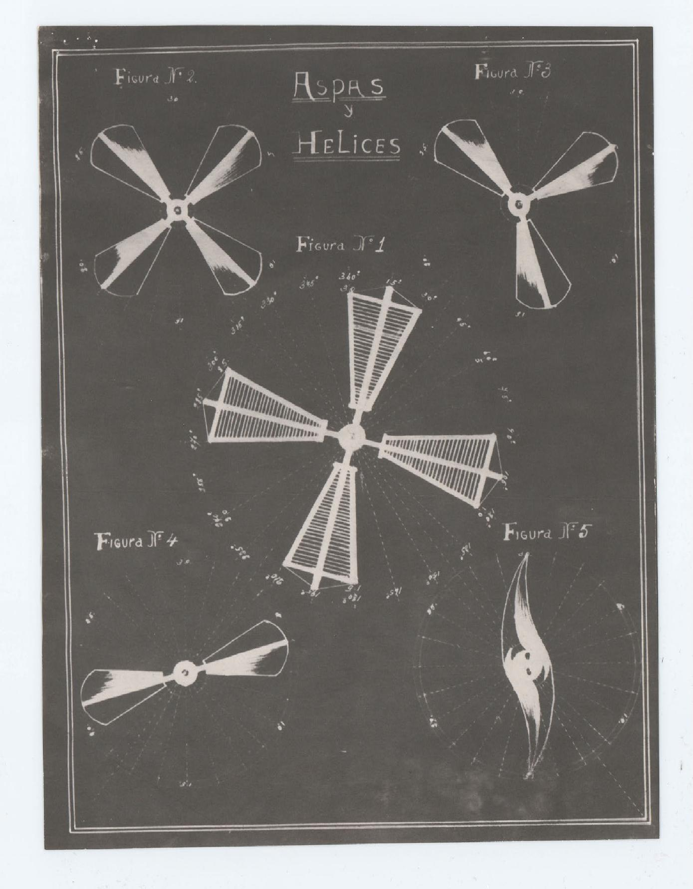

第十四頁是「ASPAS y HÉLICES」（葉片與螺旋槳），共 5 張螺旋槳分類圖：

- Figura No. 1（中央）：六葉風車式扇葉，類似中世紀風車或農業用風車
- Figura No. 2（左上）：四葉螺旋槳（標準飛機螺旋槳）
- Figura No. 3（右上）：三葉螺旋槳（現代飛機常用）
- Figura No. 4（左下）：兩葉螺旋槳（早期飛機）
- Figura No. 5（右下）：單葉曲面螺旋槳（不對稱形狀）

每張圖都用粉筆精細描繪，葉緣有陰影模糊效果，是工程教學圖的標準畫法。

### §8.5 Estabilidad Global-Cónica y Semi-Global（剖面 + 雲層）

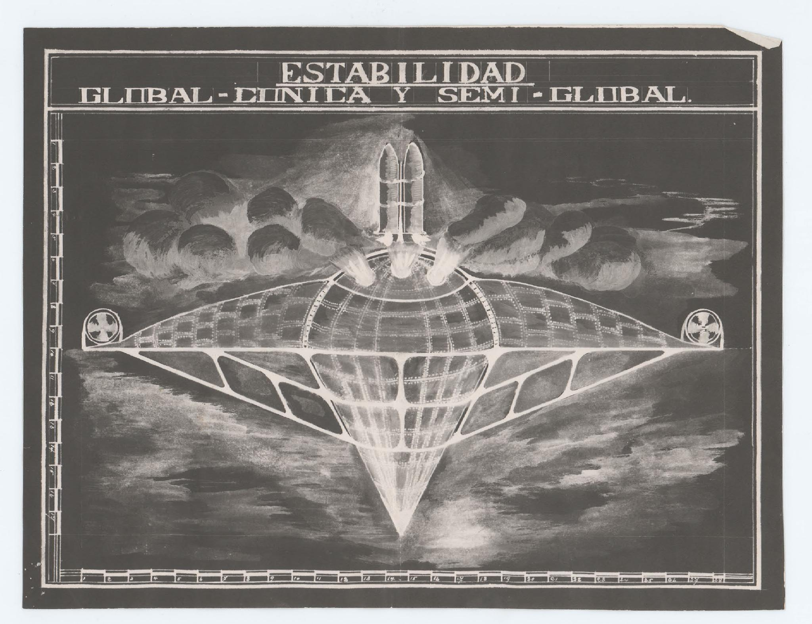

第十五頁是另一張完整飛行器圖，標題「ESTABILIDAD GLOBAL-CÓNICA Y SEMI-GLOBAL」。比第十頁多畫了：

- 頂部明確畫出兩根並列的火箭推進器，正在點火（火焰白色 + 灰色煙霧）
- 主體菱形構造，網格更密、層次更明顯
- 左右兩翼端各有一個圓形側推進器
- 底部尖端伸入下方水波 / 雲層
- 背景雲層密集，整個畫面是「正在從雲端發射」的瞬間

這張比第十頁更接近「實際操作狀態」的示意圖。

## §9 為什麼 Garcia 案會被 FBI 留下來

對照 [Section 5](../005-65_hs1-834228961_62-hq-83894_section_5/report.md)：1950 年 1 月 Winchell「外星人來看原子彈」的全國廣播後，FBI 收到大量民眾來信，內容從「我看到飛碟」到「我有設計飛碟的方法」都有。Garcia 案落在這個時間點，是 1950 年代典型的「民間發明家自薦」（unsolicited inventor proposal）：

1. 寄件人地址明確（Veracruz 真實住址）
2. 自署多重職銜（鋼琴家 + 作曲家 + 發現者 + 意符發明家）
3. 列出多項「被他人偷走」的發明
4. 把飛碟原理跟自己的「IDEAS」綁在一起
5. 附上剛刊的剪報當「證據」
6. 寄到模糊的收件單位（U.S. Court House）

FBI 紐約辦事處 1950-04-07 收到後，沒有回信、沒有調查 Garcia 本人、沒有把資料轉給空軍 Project Sign / GRUDGE。它的處理方式是：找 Sophia Saliba 翻譯成英文 + 歸進主案卷 220 號。

這個處理動作的含義：FBI 不認為 Garcia 是潛在的反間諜或國安威脅，但確實認為這份資料有檔案保存價值。對比 [Section 3](../003-65_hs1-834228961_62-hq-83894_section_3/report.md) 裡 Maury Island 案 FBI 燒掉的大量人力，Garcia 案的處理近乎被動歸檔。

## 影像規格與來源

| 項目 | 內容 |
|---|---|
| 格式 | PDF，AES-256 加密 |
| 頁數 | 15 |
| 解密日 | 2007-05-24（FBI Automatic Declassification Guide） |
| 公開日 | 2026-05-08 |
| 機關 | FBI 紐約辦事處 → Central Records Center → War Department |
| 機密層級 | 無分類（民眾自願寄送，無敏感性） |
| FOIPA | #1294532 |
| 翻譯 | Sophia Saliba（FBI 紐約） |
| 官方下載 | <https://www.war.gov/medialink/ufo/release_1/65_hs1-834228961_62-hq-83894_serial_220.pdf> |

## 相關案件

- [#003 Section 3](../003-65_hs1-834228961_62-hq-83894_section_3/report.md) ─ Maury Island 1947 案、FBI 燒掉大量人力的對照案件
- [#005 Section 5](../005-65_hs1-834228961_62-hq-83894_section_5/report.md) ─ 1950 Winchell「外星人來看原子彈」全國廣播 → 民眾自薦發明潮
- [#010 Serial 153](../010-65_hs1-834228961_62-hq-83894_serial_153/report.md) ─ 1947 Oak Ridge Presley「最後一格底片」民間照片，另一個獨立 Serial 範例

## 來源

US Department of War, PURSUE FOIA Release, 2026-05-08
65_HS1-834228961_62-HQ-83894_Serial_220
<https://www.war.gov/UFO/#65_HS1-834228961_62-HQ-83894_Serial_220>
