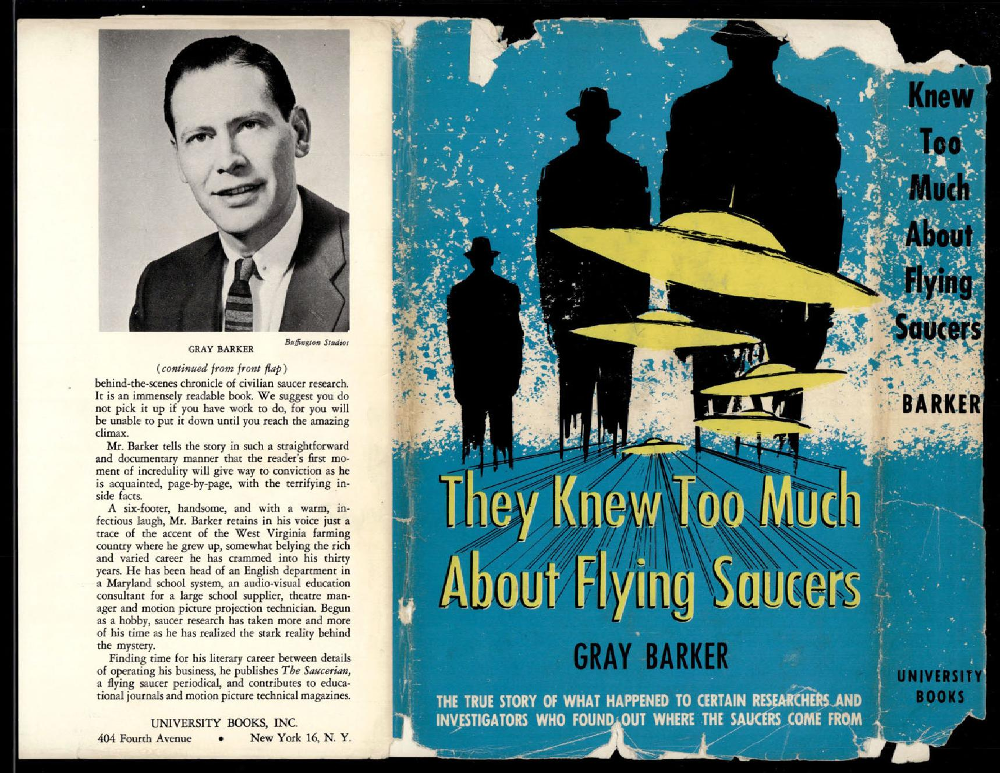

# FBI 62-HQ-83894 案卷 #013 ─ Serial 403：Gray Barker《他們知道太多》進入 FBI 檔案

| 欄位 | 內容 |
|---|---|
| 案卷編號 | `65_HS1-834228961_62-HQ-83894_Serial_403` |
| 主軸 | Gray Barker 1956 年出版的書《They Knew Too Much About Flying Saucers》封面與護封內折，被 FBI 列入 62-HQ-83894 主案卷 |
| 頁數 | 3 頁（信封封面 + 護封正反兩面） |
| 官方 portal | <https://www.war.gov/UFO/#65_HS1-834228961_62-HQ-83894_Serial_403> |

## 為什麼 FBI 會把一本書編進 62-HQ-83894

Serial 403 是 62-HQ-83894 主案卷中很短的一份。整份 3 頁，前一頁是 FBI Central Records Center 牛皮信封封面，後兩頁是同一本書的護封正反掃描。FBI 把整本書收進來、給它編一個 Serial 號、寫上 `62-83894-403` 紅色案卷標記，意味這本書本身就被當作 UFO 案卷的證物或材料。

這本書是 1956 年的《They Knew Too Much About Flying Saucers》，作者 Gray Barker，University Books 出版（紐約第四大道 401 號）。Barker 在書裡建立的「Men in Black」（黑衣人）敘事框架，後來進入 UFO 文化的長期符號譜系。

## §1 信封：62-83894-403

第一頁是 FBI Central Records Center 寄送或歸檔用的牛皮紙信封。封面元素：

- 上方白色貼紙條碼，黑字「62-HQ-83894 / Serial 403 / EBF」（EBF = Enclosure Behind File，附件夾在卷宗之後）
- 條碼下方紅色 X 標記（FBI 內部處理標記）
- 中間白色 FBI Central Records Center 標籤，標示 Class/Case # 0062-83894、Vol. 1、Serial # 403、ONLY（單卷）
- 標籤下方條碼 9/18/226771，序號 RRP00A/1WL
- 右側黑色 `DO NOT DESTROY` 戳記 + FOIPA 編號 `#1142292`（手寫紅筆）
- 底部紅筆手寫 `62-83894-403`
- 右下方藍色貼紙：「Declassification authority derived from FBI Automatic Declassification Guide, issued May 24, 2007」

FOIPA #1142292 是這份檔案最終公開的 FOIA / Privacy Act 請求編號。「Do Not Destroy」是 FBI 標準歸檔指令，表示這份檔案受到永久保存規則保護。

## §2 護封內折：書的廣告文字

第二頁是書的護封拆開後攤平的內折部分。左半邊是護封內折的廣告文字，右半邊是書脊與封面的縮小版。

護封內折（dust jacket flap）的廣告文字節錄：

> **They Knew Too Much About Flying Saucers**
> by GRAY BARKER

> One by one, the leading figures among flying saucer researchers, who have challenged the government denial that saucers come from outer space, have been silenced.

> 一個接一個，向「政府否認飛碟來自外太空」立場提出挑戰的飛碟研究領袖人物，都被噤聲了。

> Outwardly, nothing seems to have happened to these men. They are still alive, still living where they used to. But they no longer publish saucer research material and they will not talk about saucers or why they no longer will speak of them.

> 表面上，這些人並沒有發生什麼事。他們還活著，住在原本的地方。但他們不再發表飛碟研究材料，也不會討論飛碟，更不肯說他們為什麼不再開口談飛碟。

> Mr. Barker tells the story in such a straightforward and documentary manner that the reader's first sense of incredulity will give way to conviction as he is presented with overwhelming proof.

> Barker 用如此直白、紀錄片式的口吻寫這個故事，使讀者起初的懷疑，會在連續鋪陳的證據面前轉化成相信。

護封內折用相當戲劇化的語氣，把飛碟研究者描繪成被某種無形勢力（黑衣人、黑色窗戶轎車、黑衣訪客）監控、噤聲、心理威嚇的對象。文字本身已經是 Barker 在書內建立的「Men in Black」敘事框架的縮影。

## §3 護封正面：書封 + 黃色飛碟編隊

第三頁是護封正反兩面攤開的右半邊：書脊、封底、封面。

封面元素：

- 主色：黑色背景 + 藍色色塊
- 主視覺：三個黃色「Adamski 風格」飛碟編隊飛越夜空，下方剪影是三個戴禮帽、穿西裝的男人背影（黑衣人形象）
- 標題：「**They Knew Too Much About Flying Saucers**」
- 作者：「GRAY BARKER」
- 副標：「THE TRUE STORY OF WHAT HAPPENED TO CERTAIN RESEARCHERS AND INVESTIGATORS WHO FOUND OUT WHERE THE SAUCERS COME FROM」（一群找出飛碟來自何方的研究者與調查員的真實故事）
- 出版社：「UNIVERSITY BOOKS」
- 書脊：「Knew Too Much About Flying Saucers / BARKER / UNIVERSITY BOOKS」

封底有 Barker 本人的肖像照（黑白半身照，西裝領帶，1950 年代風格肖像）以及作者介紹欄。介紹欄寫明 Barker 是 West Virginia 出身的研究者，1950 年代中期 30 歲左右，曾在馬里蘭州當英語系主任、學校圖書館員，後來轉做電影排片研究。出版社把這本書定位為「civilian saucer research 的幕後紀事」。

## §4 Maury Island 與 Albert Bender 的影子

書的核心案例（FBI 把這本書編進主案卷的理由）跟 [Section 3](../003-65_hs1-834228961_62-hq-83894_section_3/report.md) 收錄的 Maury Island 事件有直接傳承關係。Maury Island 1947-06 的 Harold Dahl + Fred Crisman 「碎片」案、1947-08-01 Brown + Davidson 兩位陸軍情報官搭 B-25 載送碎片墜機罹難，是 FBI 1947 年在 Maury Island 案燒掉最多人力、最後沒結案的案件。

Barker 1956 年這本書把 Maury Island 跟另一個案例（Albert K. Bender 在 1953 年突然關閉 International Flying Saucer Bureau / IFSB）接在一起，建立了「找到答案的人都被噤聲」的敘事結構。Bender 後來在 1962 年出版自己的回憶錄《Flying Saucers and the Three Men》，自述被三個黑衣人造訪、告知禁令、被迫關閉 IFSB。

FBI 1956 年把 Barker 的書整本歸進主案卷 Serial 403 號，紅筆案卷標記，DO NOT DESTROY 戳印。歸檔位置在主案卷第 403 號，意味落在 1955-1956 年的收件順序裡。

## §5 為什麼歸檔整本書，而不是書評或摘要

對照 [Section 9](../008-65_hs1-834228961_62-hq-83894_section_9/report.md) 與 [Section 7](../007-65_hs1-834228961_62-hq-83894_section_7/report.md)：FBI 在 1950 年代後半，從「個案調查者」角色轉變成「UFO 文化監控者」。Bryant manuscript 案、New Yorker 對 Project Saucer 的長文，都是這個轉變的證據。Serial 403 把 Barker 的書整本歸檔，是同一個趨勢的具體例子：FBI 不再去調查每一個個別目擊，而是把 UFO 圈裡的書、雜誌、會議材料當作監控對象。

整本書歸檔的操作效果：

- 不用做筆記或摘要，書的所有內容直接保存
- 可以隨時翻查 Barker 提到的所有人名、地點、事件
- 護封 + 廣告文字本身就把「Men in Black 敘事」寫在外面，FBI 不需要額外解讀

FBI 在 Serial 403 沒有對 Barker 開案、沒有面談 Barker、沒有約談書裡提到的 Bender。Serial 403 把書收進來、編號、歸檔。

## 影像規格與來源

| 項目 | 內容 |
|---|---|
| 格式 | PDF，AES-256 加密（print:yes copy:no） |
| 頁數 | 3 |
| 解密日 | 2007-05-24（FBI Automatic Declassification Guide） |
| 公開日 | 2026-05-08 |
| 機關 | FBI Central Records Center → War Department |
| 機密層級 | 無分類（書本歸檔，原本就是公開出版品） |
| FOIPA | #1142292 |
| 官方下載 | <https://www.war.gov/medialink/ufo/release_1/65_hs1-834228961_62-hq-83894_serial_403.pdf> |

## 相關案件

- [#003 Section 3](../003-65_hs1-834228961_62-hq-83894_section_3/report.md) ─ Maury Island 1947 原始案件、B-25 墜毀、FBI 退出 UFO 調查
- [#007 Section 7](../007-65_hs1-834228961_62-hq-83894_section_7/report.md) ─ 1950 New Yorker Project Saucer 報導、FBI 對外公開資訊的監控
- [#008 Section 9](../008-65_hs1-834228961_62-hq-83894_section_9/report.md) ─ Stringfield 案、Bryant manuscript 案，1950 年代後期 FBI 從個案轉向文化監控

## 來源

US Department of War, PURSUE FOIA Release, 2026-05-08
65_HS1-834228961_62-HQ-83894_Serial_403
<https://www.war.gov/UFO/#65_HS1-834228961_62-HQ-83894_Serial_403>
