# FBI 62-HQ-83894 案卷 #015 ─ Serial 449：1966 Flying Saucers International 雜誌 + AFSCA 第三屆全國飛碟大會議程

| 欄位 | 內容 |
|---|---|
| 案卷編號 | `65_HS1-834228961_62-HQ-83894_Serial_449` |
| 日期 | 1966-09-22（Philadelphia 來函） / 1966-10-03（LA SAC 上呈） |
| 主軸 | 1966 FBI Los Angeles SAC 把 Flying Saucers International Issue 24（1966-07）整本上呈 Director（J. Edgar Hoover），疑似含「Communist Party line」內容；雜誌核心是 AFSCA 第 3 屆全國飛碟大會議程 + Bob Renaud「Korendor 行星」短波通訊聲明 |
| 頁數 | 18 頁（FBI 信封封面 + LA SAC 上呈函 + 雜誌內頁掃描） |
| 官方 portal | <https://www.war.gov/UFO/#65_HS1-834228961_62-HQ-83894_Serial_449> |

## 為什麼一本飛碟雜誌會被 FBI 上呈到 Hoover 桌上

Serial 449 起點是 Philadelphia 的訂閱者 Jarvis H. Cooper（401 North Broad Street）跟 FBI Philadelphia Division 通報：他訂的雜誌《Flying Saucers International》Issue 24（1966-07）裡，第 2-3 頁有一篇文章他「認為在闡述 Communist Party 路線」。Cooper 跟 IRS（國稅局）有關係（FBI 信件明寫他是 IRS 職員），這個身分讓他的舉報得到比一般民眾更高的處理層級。

Philadelphia FBI 1966-09-22 把雜誌轉給 Los Angeles Division（雜誌總部 2004 N. Hoover Street, LA）。LA SAC 1966-10-03 把雜誌完整上呈 Director（J. Edgar Hoover）。LA SAC 同時報告：

- LA Division 索引中沒有「RENAUD」相關資料
- 從未對 Amalgamated Flying Saucer Clubs of America 做過調查
- 不打算進一步行動（No further action is contemplated）

FBI 把整本雜誌歸進 62-HQ-83894 主案卷 Serial 449，留下完整影本但不開新案。這跟 [Serial 403](../013-65_hs1-834228961_62-hq-83894_serial_403/report.md) 的處理一樣：把民間出版物整本歸檔。

## §1 信封：62-HQ-83894 Vol 1 Serial 449 ONLY

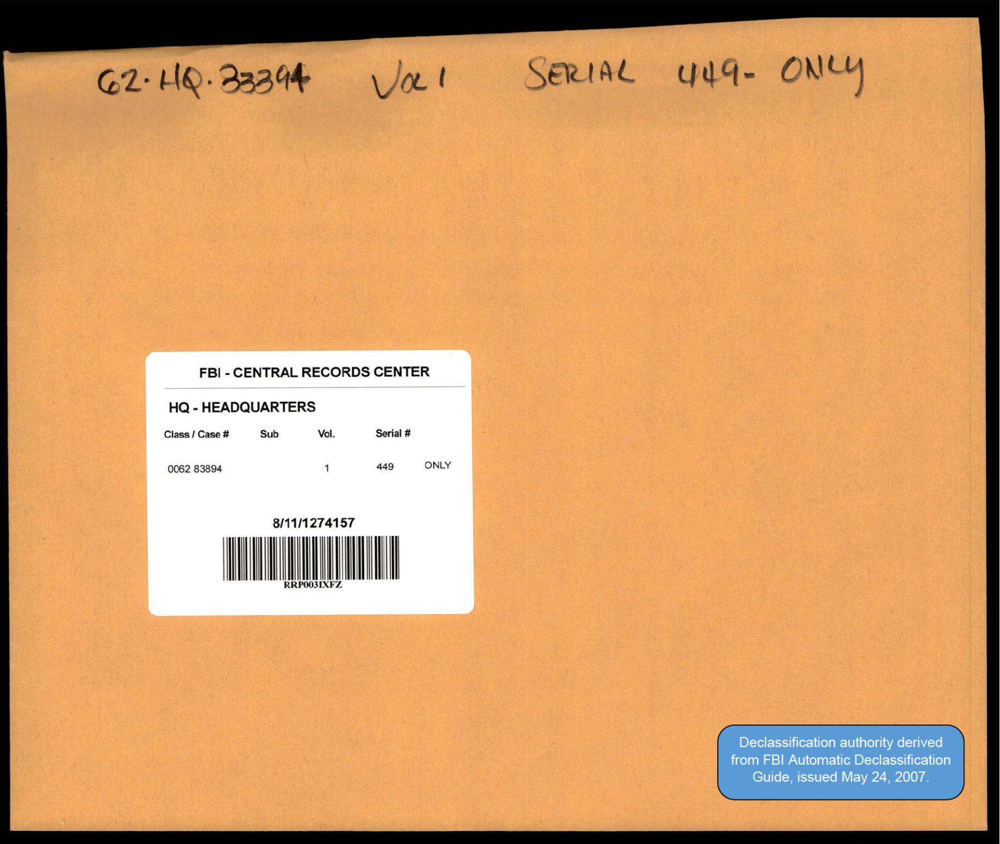

第一頁是 FBI Central Records Center 牛皮紙信封正面，手寫黑筆「62-HQ-83394 Vol 1 SERIAL 449- ONLY」（83394 是 83894 的筆誤）。中間是 FBI Central Records Center 白色標籤，Class/Case # 0062-83894、Vol. 1、Serial # 449、ONLY、條碼 8/11/1274157（與 Serial 220 連號相近，是同一批數位化作業的產物）。右下藍色解密貼紙：「Declassification authority derived from FBI Automatic Declassification Guide, issued May 24, 2007」。

## §2 LA SAC 上呈函：10/3/66

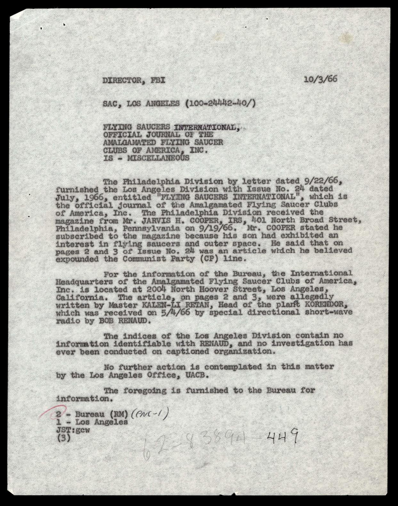

第二頁是 LA SAC 給 Director, FBI 的 1966-10-03 上呈函。完整內容：

> DIRECTOR, FBI
> SAC, LOS ANGELES (100-24442-40/)
>
> FLYING SAUCERS INTERNATIONAL,
> OFFICIAL JOURNAL OF THE
> AMALGAMATED FLYING SAUCER
> CLUBS OF AMERICA, INC.
> IS - MISCELLANEOUS
>
> The Philadelphia Division by letter dated 9/22/66, furnished the Los Angeles Division with Issue No. 24 dated July, 1966, entitled "FLYING SAUCERS INTERNATIONAL", which is the official journal of the Amalgamated Flying Saucer Clubs of America, Inc. The Philadelphia Division received the magazine from Mr. JARVIS H. COOPER, IRS, 401 North Broad Street, Philadelphia, Pennsylvania on 9/19/66. Mr. COOPER stated he subscribed to the magazine because his son had exhibited an interest in flying saucers and outer space. He said that on pages 2 and 3 of Issue No. 24 was an article which he believed expounded the Communist Party (CP) line.
>
> 1966-09-22 費城分局送來 1966 年 7 月號的 Issue No. 24《FLYING SAUCERS INTERNATIONAL》，這是 Amalgamated Flying Saucer Clubs of America, Inc. 的官方刊物。費城分局 1966-09-19 從 IRS 的 Jarvis H. Cooper（賓州費城北 Broad 街 401 號）那裡收到雜誌。Cooper 說他訂這本雜誌是因為他兒子對飛碟和外太空有興趣，他在 Issue 24 第 2-3 頁看到一篇文章，他認為是在闡述 Communist Party 路線。
>
> For the information of the Bureau, the International Headquarters of the Amalgamated Flying Saucer Clubs of America, Inc. is located at 2004 North Hoover Street, Los Angeles, California. The article, on pages 2 and 3, were allegedly written by Master KALEN-LI RENAN, Head of the planet KORENDOR, which was received on 5/4/66 by special directional short-wave radio by BOB RENAUD.
>
> 該組織總部位於洛杉磯 2004 North Hoover Street。第 2-3 頁的文章據稱由「KORENDOR 行星」首領「Master KALEN-LI RENAN」所寫，1966-05-04 由 BOB RENAUD 透過特殊定向短波無線電接收。
>
> The indices of the Los Angeles Division contain no information identifiable with RENAUD, and no investigation has ever been conducted on captioned organization.
>
> No further action is contemplated in this matter by the Los Angeles Office, UACB.
>
> The foregoing is furnished to the Bureau for information.

UACB = Unless Advised to the Contrary by the Bureau（除非局裡另有指示）。LA SAC 對這份雜誌的處置態度是「歸檔不處理」，把判斷權交回給 Hoover 局裡。

## §3 雜誌封面：飛碟懸停在森林上方

第三頁是雜誌封面：

- 上方標題大字「**FLYING SAUCERS INTERNATIONAL**」
- 副標：「Official Journal of the Amalgamated Flying Saucer Clubs of America, Inc.」
- 主視覺：一張黑白飛碟照片，碟身有水平條紋（土星環式），懸停在松林上方
- 底部：「SPECIAL AFSCA THIRD NATIONAL FLYING SAUCER CONVENTION ISSUE」
- 「ISSUE NO. 24 / JULY, 1966 / 50¢」

封面照片的飛碟外型跟 1966 年 4 月 Michigan UFO flap（後來 Project Blue Book 評估為「沼氣」結論）流行的「土星環式碟」一致。AFSCA = Amalgamated Flying Saucer Clubs of America，1959 年由 Gabriel Green 在 LA 創立的全國性 UFO 組織。

## §4 Cooper 標記為「CP line」的爭議文章（第 2 頁）

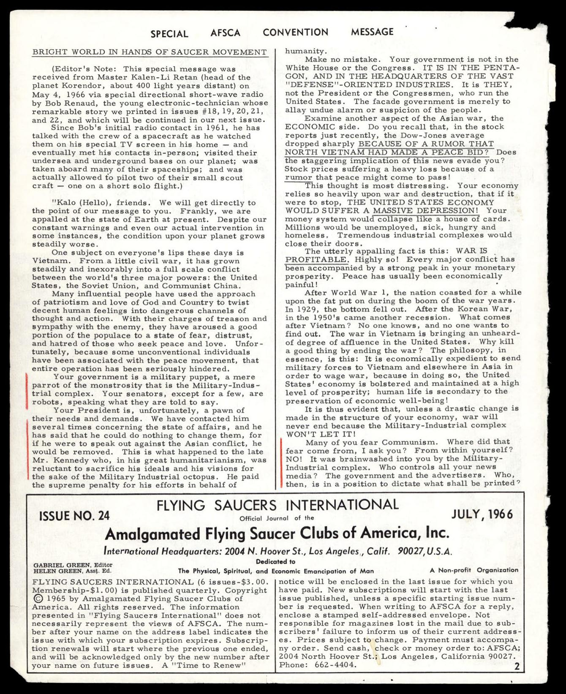

第四頁是雜誌內頁第 2 頁：「BRIGHT WORLD IN HANDS OF SAUCER MOVEMENT」（編者按 + 「SPECIAL AFSCA CONVENTION MESSAGE」）。

從畫面隱約可辨的內容片段：

> Make no mistake. Your government is not in the White House or the Congress. IT IS IN THE PENTAGON, AND IN THE HEADQUARTERS OF THE VAST "DEFENSE"-ORIENTED INDUSTRIES. It is THEY, then, who are the masters of war, of poverty, of disease, of the United States. The Saucer movement is currently in the unique position of alerting other nations of expansion of military strategy by the computer which controls the United States.
>
> 別搞錯，你們的政府不在白宮或國會。它在五角大廈，在巨大的「國防」導向工業總部。是「他們」，才是戰爭、貧窮、疾病、美國的主人。飛碟運動目前處於獨特位置，可以警告其他國家美國軍事戰略由電腦所控制。

> Examine the various world organizations now, those who deal with this earth's heavy work. You will see them all to all various viewpoints. You and they have a lot to think about. There were no facts ever even noted but a great mass of statements. Nobody knows what they said, but it can be quite cleanly stated. It is the same as if we'd have a system... It is the future generation that must put it into the law and into action. It is even possible to be made law against the use of the Military Industrial Complex...

文章具體的指控包括：實際的政府在「五角大廈 + 軍事工業綜合體」、軍方策略由「電腦」執行、飛碟運動是警告全球的窗口。Cooper 把這個論述讀成「Communist Party line」（譴責美國軍工複合體 + 把國家權力歸給軍方）的左派批判語言。

文章末尾標明寄送者 SACERS INTERNATIONAL 在 LA 的地址。

## §5 雜誌第 5 頁：Saucer News in Brief

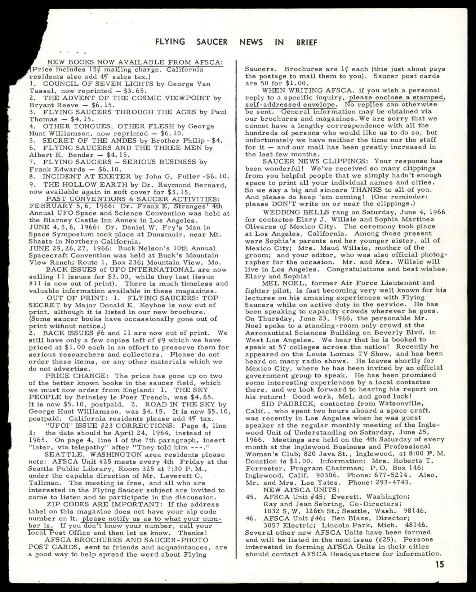

第五頁是「FLYING SAUCER NEWS IN BRIEF」短訊版，列出多筆 1966 年的 UFO 圈動態：

- 新書消息：George Hunt Williamson 在 Peru 失蹤後成立的研究組織
- October 22 在 Saskatoon 的會議
- A Jordan Society 等地方組織
- December 5 西海岸活動

這部分是 AFSCA 的全國 UFO 圈活動公告版，作為組織的網絡中樞功能。

## §6 AFSCA 第 3 屆全國飛碟大會：1966-07-08~10 Reno, Nevada

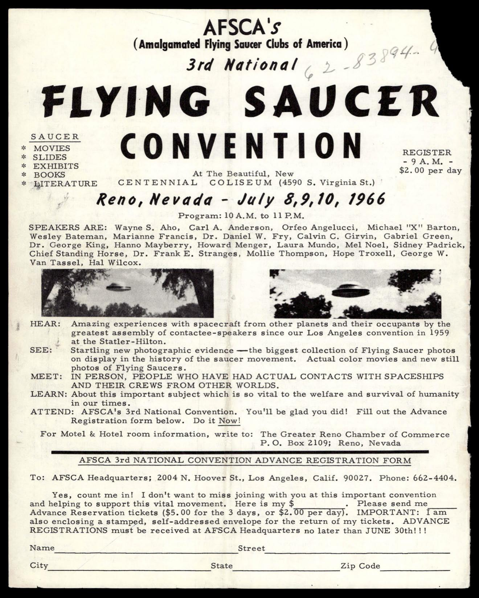

第六頁是大會傳單：「AFSCA's 3rd National FLYING SAUCER CONVENTION」

- 日期：1966-07-08~10（三天）
- 地點：Centennial Coliseum, Reno, Nevada
- 時間：每天 10 AM - 11 PM
- 註冊費：每天 9 AM 起 $2.00
- 議程包含：SAUCER MOVIES / SLIDES / EXHIBITS / BOOKS / LITERATURE
- 主講人列表（部分可辨）：Wayne S. Aho, Carl A. Anderson, Orfeo Angelucci, Michael "X" Barton, Wesley Bateman, Marianne Francia, Dr. Daniel W. Fry, Calvin C. Girvin, Gabriel Green, Dr. George King, Hanen Mayberry, Howard Menger, Laura Mundo, Mel Noel, Sidney Padrick, Chief Standing Horse, Dr. Frank E. Stranges, Mollie Thompson, Hope Troxell, George W. Van Tassel, Hal Wilcox

這個講者名單是 1960 年代美國「contactee」（接觸者）UFO 運動的代表性集合。Daniel Fry（被外星人接到沙漠飛碟基地）、Howard Menger（金星訪客）、George Van Tassel（Joshua Tree Integratron 創建者）都是 1950 年代「黃金時代」contactee 的延續。Bob Renaud（被指控寫「Korendor」文章那位）後續被 Master Kalen-Li Renan「短波通訊」的內容也屬同一脈絡。

## §7 雜誌第 4 頁（同一篇文章末段 + 簽名）

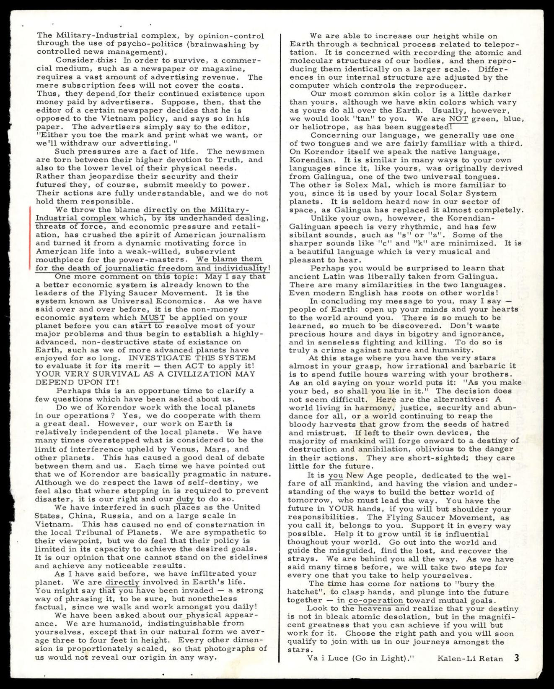

第七頁是文章第 2-3 頁的延續，落款是「Yu (I Love My in Light) Kalen-Li Renan」（外星人語氣的署名）。下方排版繼續是 AFSCA 軍工複合體批判論述。

## §8 大會議程表 + 飯店廣告（第 4 頁）

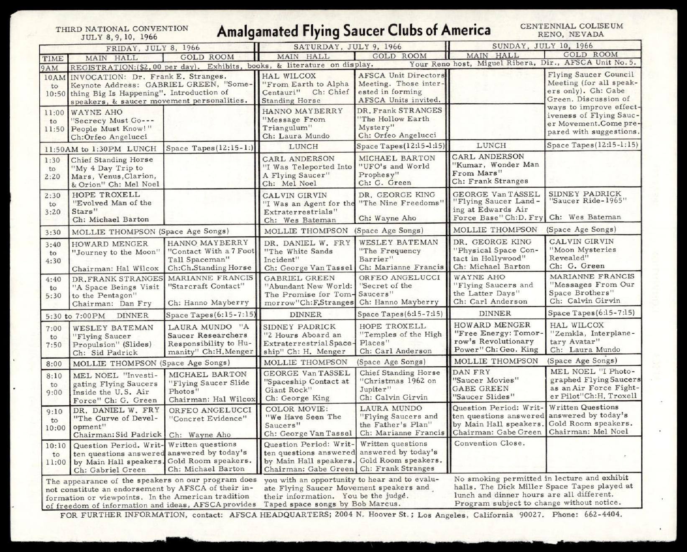

第八頁是「Amalgamated Flying Saucer Clubs of America - THIRD NATIONAL FLYING SAUCER CONVENTION - JULY 8, 9, 10, 1966 / CENTENNIAL COLISEUM / RENO, NEVADA」議程表：

- 3 天時間表，分上午/中午/下午/晚間時段
- 每個時段有指定 SPEAKER 或活動（如 Chief Standing Horse 的 Indian ceremony、Calvin Girvin、Carol Honey 等）
- LUNCH 與 DINNER 時段在飯店餐廳
- 周日 7:30 PM 有 PETER COMM 的 SPACE MUSIC

整體結構像一個結合 contactee 演講 + UFO 影片放映 + 印第安儀式 + 太空主題音樂會的綜合大會。

## §9 1966 飛碟大會行程預告 + 各地 UFO 圈組織通訊

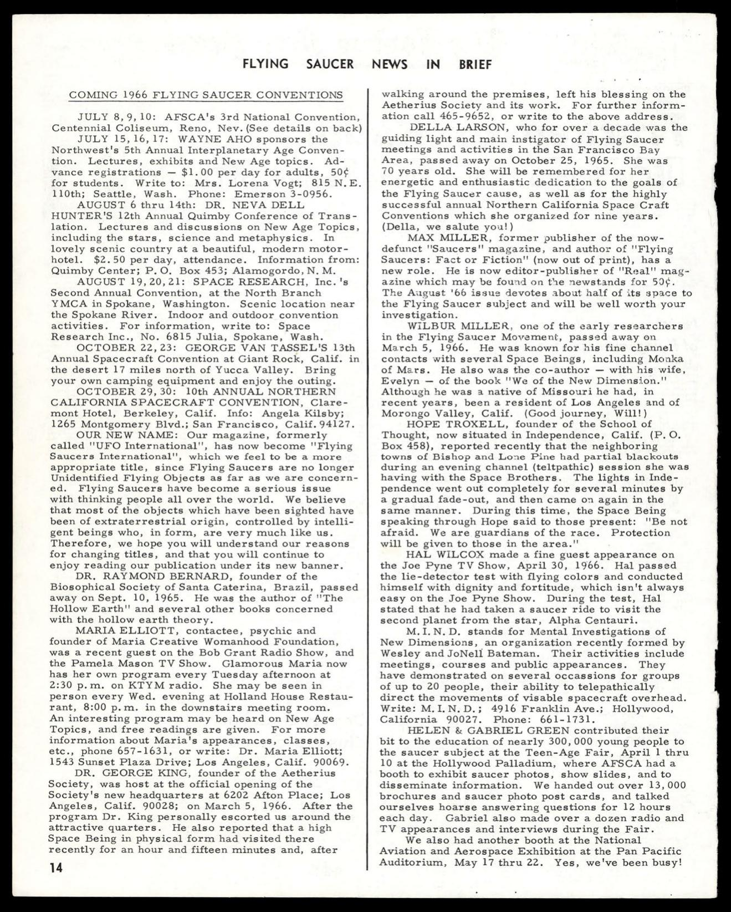

第九頁是「COMING 1966 FLYING SAUCER CONVENTIONS」公告，列出 1966-1967 年 AFSCA 預定的全國巡迴行程：

- August 13-15：New York 都會區
- October 22：Saskatoon, Canada
- December 5：West Coast Tour
- 多個地方 club 的 SUB-CONVENTION

每筆條目都包含主辦人姓名與聯絡電話。這頁的價值在於建立 1966 年北美 contactee 圈的地理分布圖。

## §10 媒體剪報集：London Free Press「Tracked by Radar」

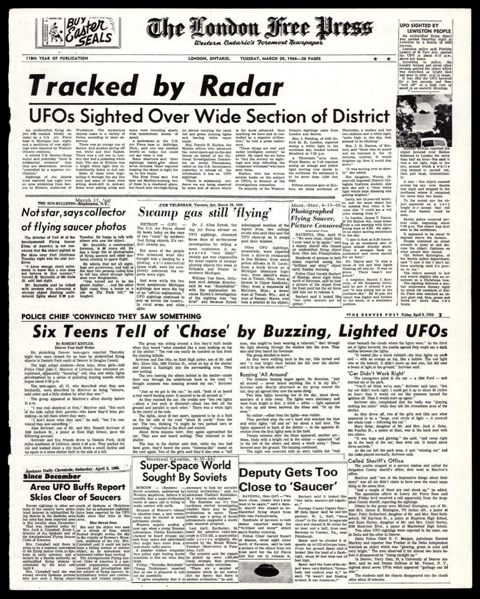

第十頁是雜誌的「PRESS COVERAGE」剪報區，集成多份報紙的 UFO 報導：

- The London Free Press（Ontario）1966-03-30：「**Tracked by Radar** / UFOs Sighted Over Wide Section of District」
- 「Six Teens Tell of Chase by Buzzing, Lighted UFOs」
- 「Air Force UFO Buffs Report Skies Clear of Saucers」
- 「Super-Space World Sought By Soviets」
- 「Deputy Gets Too Close to 'Saucer'」
- 「Nofstar, says collector of flying saucer photos」
- 「Swamp gas still 'flying'」

「Swamp gas」（沼氣）出現在剪報中，呼應 1966-03-20 Michigan 警長報告，後來 Project Blue Book 顧問 J. Allen Hynek 把這批通報歸因為沼氣燃燒，引發 Michigan 居民 + 國會議員 Gerald Ford 反彈，最終推動 1966 年國會聽證 + 1968 Condon Report。

## §11 演講者名單（第 5 頁）

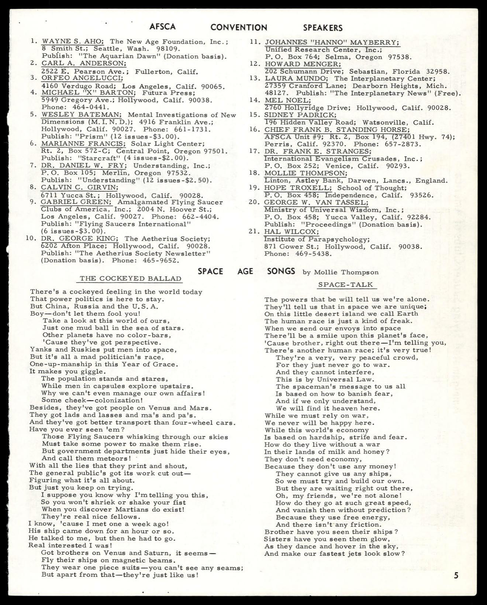

第十一頁是大會講者完整名單第 2 頁，包含太空音樂表演者：

- Wayne S. Aho（New Age Foundation）
- Carl A. Anderson（B. Smith B.C. Seattle）
- David L. Anderson（XYZ Publications）
- Michael "X" Barton（FLYING SAUCERS THROUGH THE AGES 作者）
- Wesley Bateman（Mental Investigations of New Phenomena）
- 等等

下方還有「THE COCKEYED BALLAD」（飛碟主題民謠歌詞）「There's a cockeyed feeling in the world today / That paper pulpit is here to stay...」（諷刺主流媒體的飛碟報導）

最右側是 SPACE AGE SONGS 主題歌詞「SPACE-TALK」「The powers that be will tell us we're alone / They tell us so we cannot have to roam...」

## §12 Daniel Fry 6 張 Merlin OR + Joshua Tree CA 飛碟照

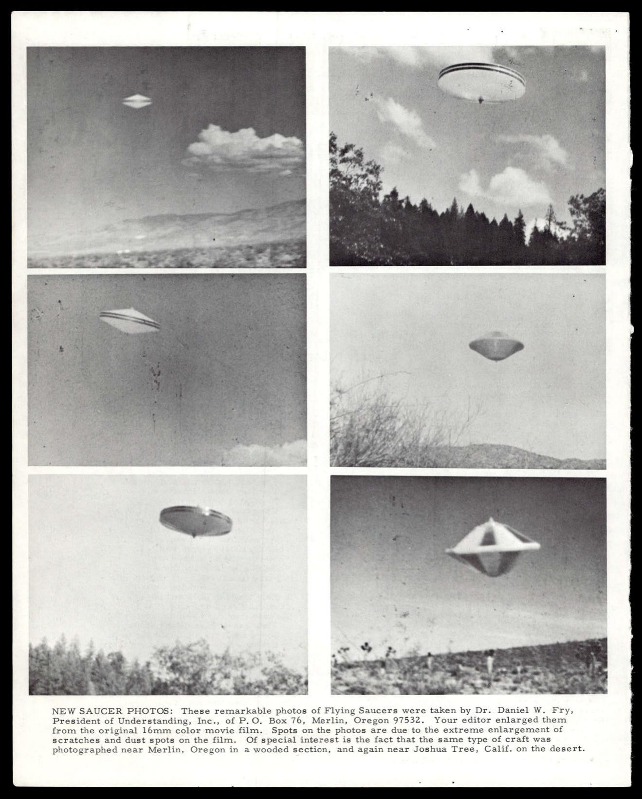

第十二頁是 6 格飛碟照片，每格獨立框：

> NEW SAUCER PHOTOS: These remarkable photos of Flying Saucers were taken by Dr. Daniel W. Fry, President of Understanding, Inc., of P.O. Box 76, Merlin, Oregon 97532. Your editor enlarged them from the original 16mm color movie film. Spots on the photos are due to the extreme enlargement of scratches and dust spots on the film. Of special interest is the fact that the same type of craft was photographed near Merlin, Oregon in a wooded section, and again near Joshua Tree, Calif. on the desert.
>
> 這些 Flying Saucers 照片由 Understanding 公司董事長 Dr. Daniel W. Fry（Oregon 州 Merlin 鎮 P.O. Box 76）拍攝。編輯把原 16mm 彩色電影底片放大。照片上的斑點是底片放大後的刮痕與灰塵。同型號的飛行器分別在 Oregon Merlin 樹林區與加州 Joshua Tree 沙漠地區拍到。

6 張照片：

- 上左：上下對稱菱形碟，高空 + 山脊背景
- 上右：土星環式碟，松樹背景（雜誌封面那張）
- 中左：菱形碟，藍天
- 中右：方形碟，類似土星環，灌木背景
- 下左：碟身 + 圓頂，灌木背景
- 下右：三角形 / 菱形碟，灌木 + 山背景

Daniel Fry 自稱 1949-07 在新墨西哥 White Sands 飛彈試射場附近被外星人 A-Lan 接到太空船。他後來成立 Understanding, Inc. 教 contactee 哲學，這 6 張照片是 1960 年代他發布的「證據」之一。

## §13 媒體剪報集 2：Wichita 飛碟訪客

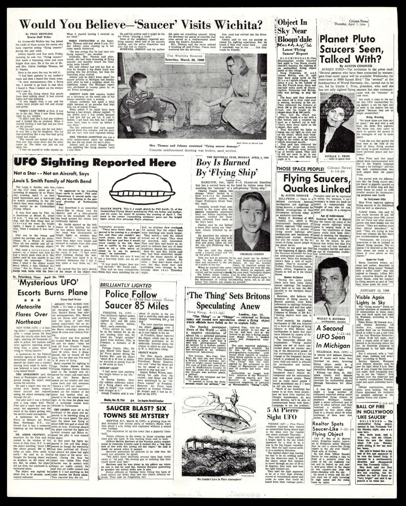

第十三頁是另一個剪報集合：

- 「Would You Believe ─ 'Saucer' Visits Wichita?」
- 「Objet In Sky Near Bisque-isle」
- 「Planet Pluto Saucers Seen, Talked With?」
- 「UFO Sighting Reported Here」（地方版本）
- 「Boy Is Burned By 'Flying Ship'」
- 「Mysterious UFO Escorts Burns Plane」
- 「Flying Saucers, Quakes Linked」
- 「A Second UFO Seen In Michigan」
- 「SAUCER BLASTS SIX TOWNS, SET MYSTERY」
- 「The 'Thing' Sets Britons Speculating Anew」
- 「Police Follow Saucer 85 Miles」

剪報集中地理分布橫跨 Wichita（Kansas）、Michigan、Britain、地方城鎮，是 1966 年 4-6 月「UFO 季」全國性報導潮的剪輯。

## §14 媒體剪報集 3：Wall Street Journal 報導

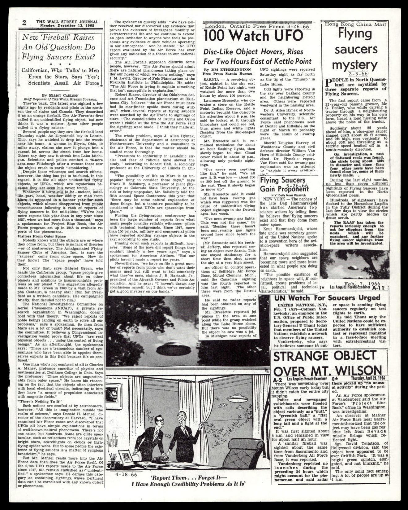

第十四頁的剪報區還包含 Wall Street Journal 1965-12 月的「Flying 'Football' Aims An Old Question to the Air Force」、「100 Watt UFO（Bug-Like Object Hovers, Rises For Two Hours End of Kettle Point）」、「Flying Saucers Mystery」、「Flying Saucers Are Forgot」、「UN Watch For Saucers Urged」、「STRANGE OBJECT OVER MT. WILSON」。

「Mt. Wilson 上空神秘物體」剪報指 1966 年加州 Mount Wilson 天文台週邊的目擊案，編輯把它跟全國 UFO flap 串在一起。

## §15 1966 Saucer Top Story

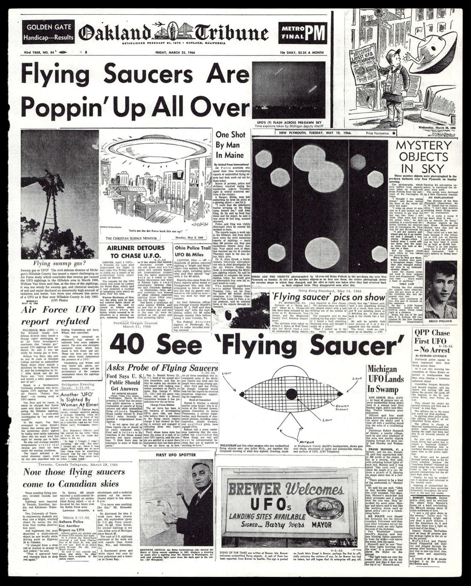

第十五頁是 Oakland Tribune 1966 年的封面「**Flying Saucers Are Poppin' Up All Over**」+ 多份地方報剪報：「One Shot By Man In Maine」、「Mystery Objects In Sky」、「40 See 'Flying Saucer'」、「Aids Probe of Flying Saucers」、「Air Force UFO report refuted」、「Now those flying saucers come to Canadian shores」。

## §16 媒體剪報集 4

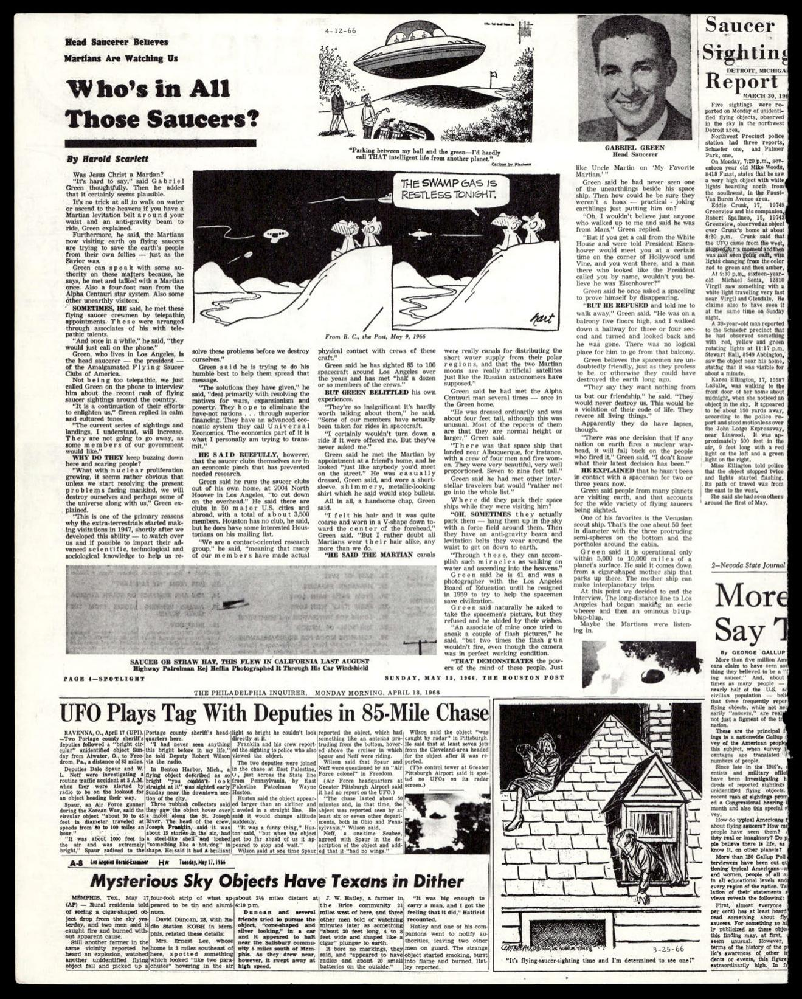

第十六頁是「Who's in All Those Saucers?」雜誌文章 + 「Mysterious Sky Objects Have Texans in Dither」+ 「UFO Plays Tag With Deputies in 85-Mile Chase」。

## §17 媒體剪報集 5：5 Million Have Seen Saucers Poll

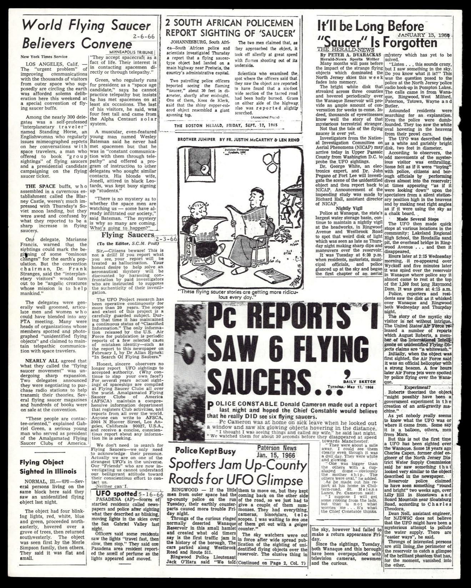

第十七頁包含 Gallup poll 報導「More Than 5 Million People Say They Saw Flying Saucers」（蓋洛普民調指 1966 年估計有 500 萬美國人聲稱看過飛碟）。

> POLICE COMMISSIONER Police would not give names of those who alleged that they sighted last night and tonight that the Civil Coastside would believe.
>
> The witnesses included one police officer and a witness... the new world's two civilian aircraft and several others traversed the route.

剪報旁邊還有「'PC' REPORTS SAW 6 FLYING SAUCERS...?」（警察 PC 回報看到 6 個飛碟）。

## §18 媒體剪報集 6：Civil Defense Director Watches Saucer

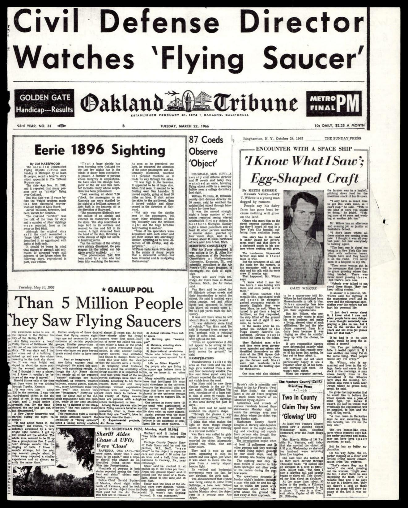

第十八頁封底剪報：「**Civil Defense Director Watches 'Flying Saucer'**」（Oakland Tribune），「ENCOUNTER WITH A SPACE SHIP / 'I Know What I Saw'-Egg-Shaped Craft」（個人證述），「Eerie 1896 Sighting」（1896 年神秘目擊回顧）+ 「Than 5 Million People they Saw Flying Saucers」（同前頁的 Gallup poll）+ 「GALLUP POLL: Some Doubt That UFO's Exist」。

封底也有 1966 年 5 月 Oakland Tribune 的「**87 Coeds Observe 'Object'**」（87 名女學生集體目擊）報導。

## §19 為什麼 IRS 職員的舉報得到 FBI 認真處理

對照 [Section 9](../008-65_hs1-834228961_62-hq-83894_section_9/report.md)：1957 Sputnik 後 FBI 已經把 UFO 雜誌 + 民間出版品歸進主案卷的習慣，逐漸從個案調查轉向「資訊監控」。Serial 449 是 1966 年這個趨勢的典型範例：

1. **舉報人身分**：Jarvis H. Cooper 是 IRS（國稅局）員工。聯邦員工檢舉同類聯邦敏感議題會優先處理
2. **內容定性**：Cooper 沒舉報「飛碟現象」，而是「Communist Party line」。1966 年越戰升溫期，反美軍工複合體論述會被當作親共指標
3. **跨州轉案**：Philadelphia 收件 → Los Angeles 轉案（因雜誌總部在 LA）→ 上呈 Director。三層處理顯示 FBI 內部的 misclassification miscellaneous 機制
4. **歸檔不調查**：LA SAC 明寫 No further action contemplated。把資料保存下來，但不開新案

LA SAC 信件中的「100-24442-40/」是 LA Division 內部子案編號（100 系列 = Subversive Matters，是 FBI 的反顛覆檔案分類）。但 Bureau 最終把它歸進 62 系列 Internal Security 主案卷（Serial 449），意味 Hoover 認為這是 UFO 案件而不是反顛覆案件。

## 影像規格與來源

| 項目 | 內容 |
|---|---|
| 格式 | PDF，AES-256 加密 |
| 頁數 | 18 |
| 解密日 | 2007-05-24（FBI Automatic Declassification Guide） |
| 公開日 | 2026-05-08 |
| 機關 | FBI Philadelphia → Los Angeles → Director（Hoover） |
| 機密層級 | 無分類（民間雜誌歸檔） |
| LA Division 子案 | 100-24442-40/（IS-MISCELLANEOUS） |
| 官方下載 | <https://www.war.gov/medialink/ufo/release_1/65_hs1-834228961_62-hq-83894_serial_449.pdf> |

## 相關案件

- [#013 Serial 403](../013-65_hs1-834228961_62-hq-83894_serial_403/report.md) ─ Gray Barker 1956 書整本歸檔，同樣是「民間出版物進案卷」處理模式
- [#008 Section 9](../008-65_hs1-834228961_62-hq-83894_section_9/report.md) ─ Stringfield Tsar Bomba 預警電話、Bryant manuscript 案，1950 年代後期 FBI 從個案轉向文化監控
- [#005 Section 5](../005-65_hs1-834228961_62-hq-83894_section_5/report.md) ─ Winchell「外星人來看原子彈」全國廣播 → 民眾自薦舉報

## 來源

US Department of War, PURSUE FOIA Release, 2026-05-08
65_HS1-834228961_62-HQ-83894_Serial_449
<https://www.war.gov/UFO/#65_HS1-834228961_62-HQ-83894_Serial_449>
