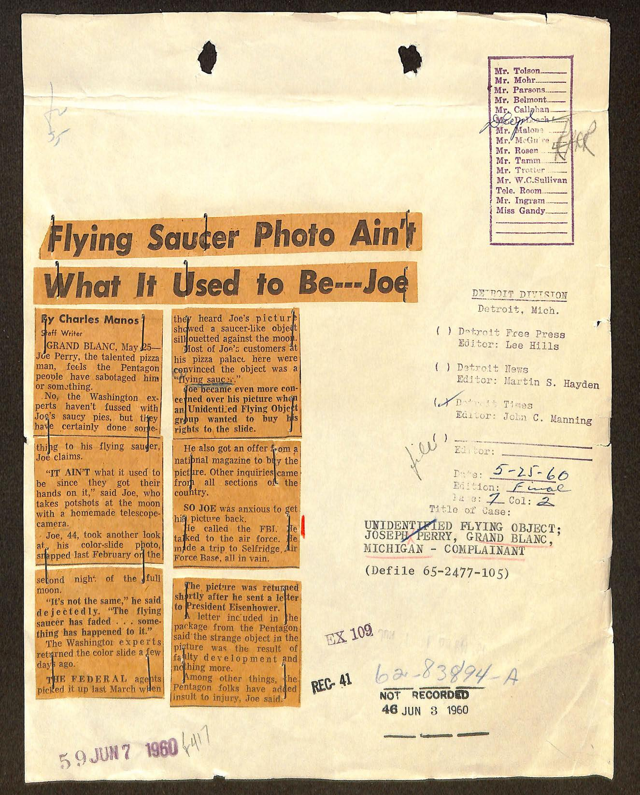
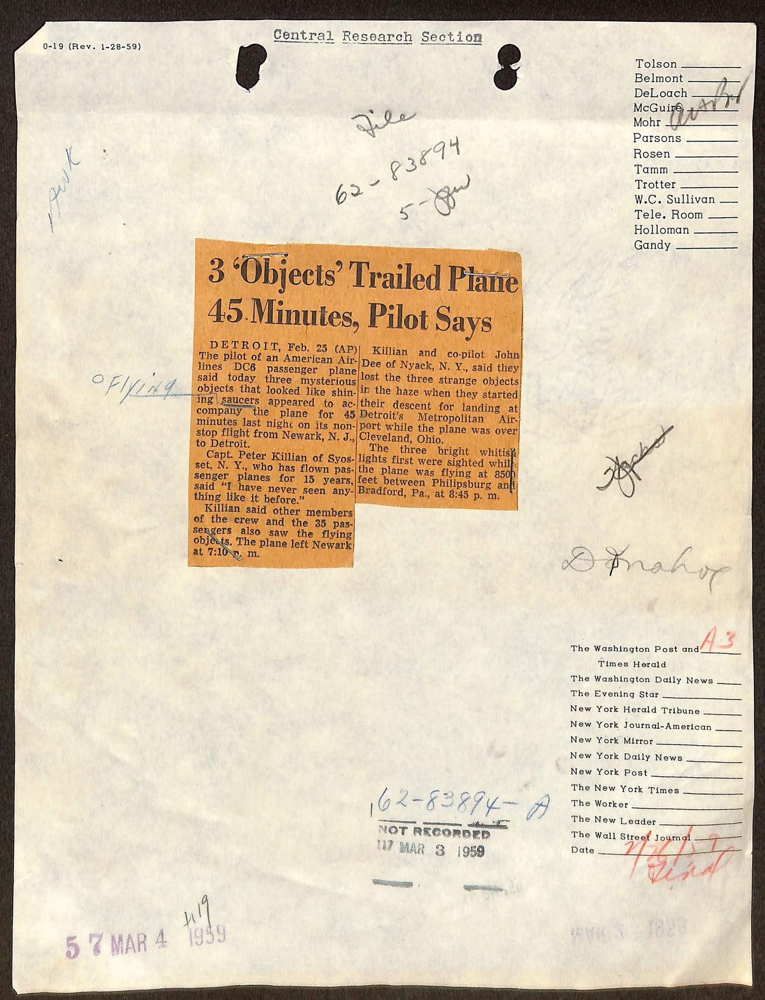
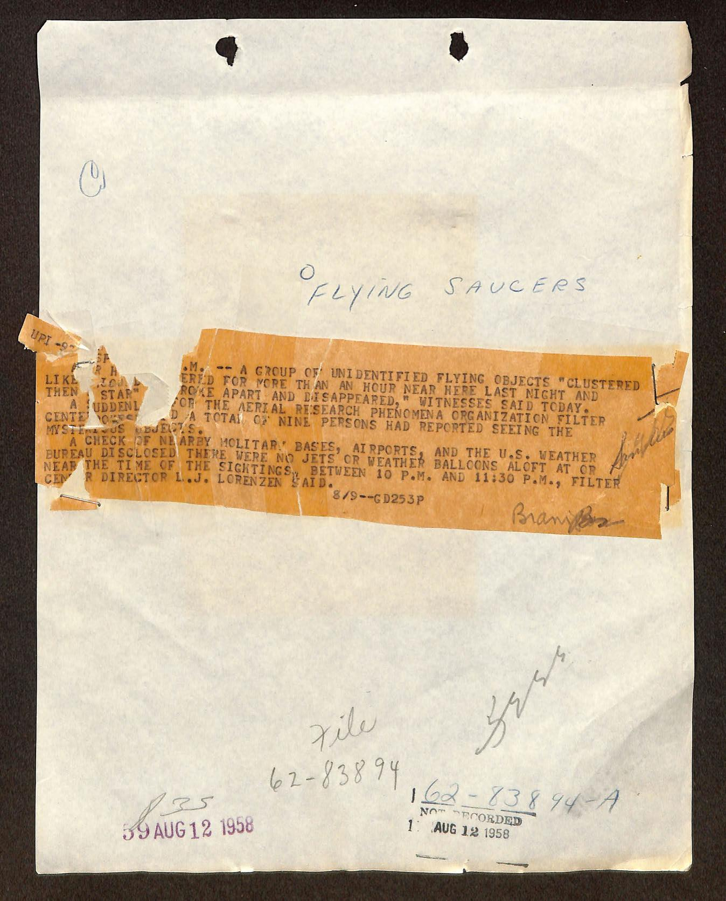
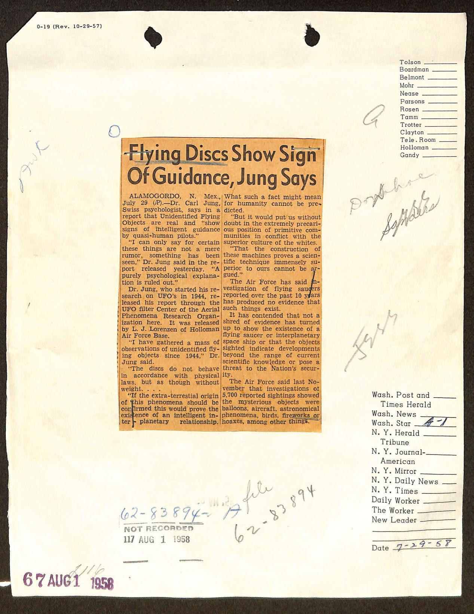
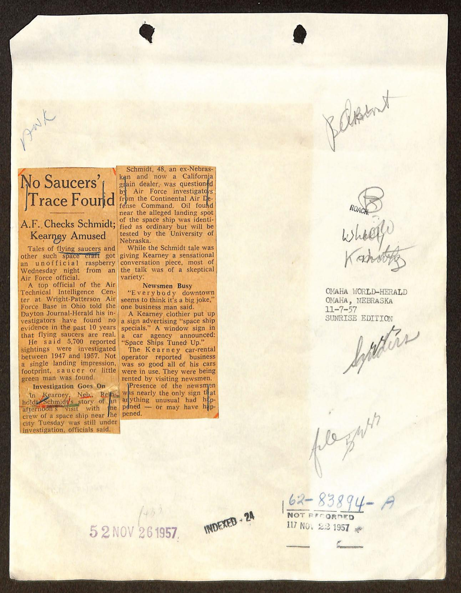
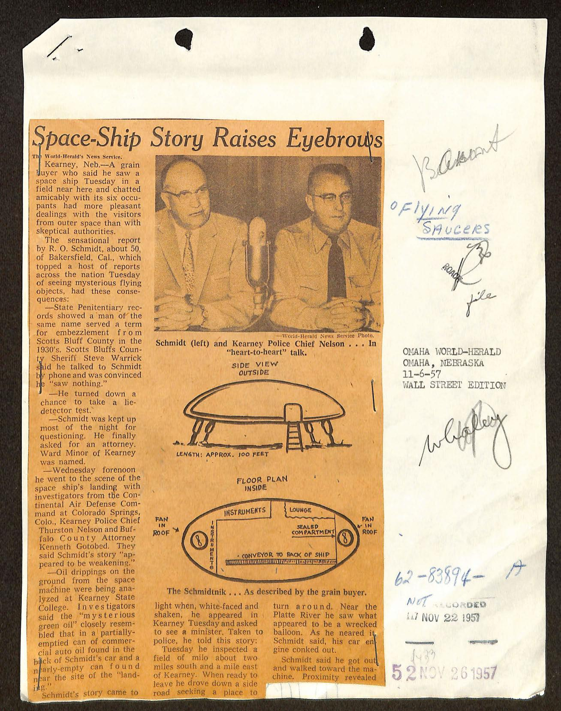
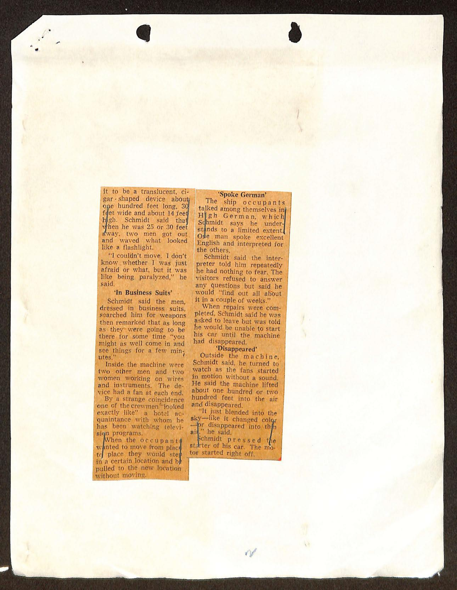

# FBI 62-HQ-83894 案卷 #016 ─ SUB A：62-83894-A 子卷 / 1957-1960 五份 UFO 媒體剪報附 FBI 內部傳閱單

| 欄位 | 內容 |
|---|---|
| 案卷編號 | `65_HS1-834228961_62-HQ-83894_SUB_A` |
| 日期 | 1957-11-22 至 1960-06-08（剪報日期） |
| 主軸 | FBI HQ 把 62-HQ-83894 主案卷的「子卷 A」（SUB A）開出來，專門收錄媒體剪報 + Bureau Officials 簽閱單。本子卷收 1957-1960 五則：Schmidt Kearney 太空船降落案 + Carl Jung 飛碟有引導論 + APRO 9 人目擊 + American Airlines Killian 機長三物體追飛、與 Detroit Free Press「Joe」剪報 |
| 頁數 | 124（信封封面 + 卷宗夾 + 多份 0-19 與 FD-245.1 表單 + 剪報粘貼頁，本次 JPEG 抽出 8 頁） |
| 官方 portal | <https://www.war.gov/UFO/#65_HS1-834228961_62-HQ-83894_SUB_A> |

## 為什麼 62-HQ-83894 案卷會多出一本「SUB A」子卷

FBI 文件編號結構是 `Class-Case-Serial`。62-HQ-83894 主案卷在這個範圍裡是 Internal Security 大類底下的「Flying Discs / UFO」總案。Serial 序號是時間順序的內部編號。當主案卷因為材料類型不同（如媒體剪報 vs. 個案調查）需要分流時，FBI 會開「子卷」（Sub-file）來收編。SUB A 就是 62-HQ-83894 的第一個子卷，整本拿來放剪報 + 內部 routing slip。

對比 [Serial 403](../013-65_hs1-834228961_62-hq-83894_serial_403/report.md) 把一整本書編入主案卷、[Serial 449](../015-65_hs1-834228961_62-hq-83894_serial_449/report.md) 把一本雜誌整本上呈，SUB A 是另一條處理動線：剪報走子卷而不進主案卷編號。Bureau Central Research Section 把報紙的 UFO 剪報剪下、貼到 0-19 表單（Office of Origin route slip），讓 Bureau Officials（Tolson、Boardman、Belmont、Mohr、Parsons、Rosen、Tamm、Trotter、W.C. Sullivan、Tele. Room、Holloman、Gandy）逐人傳閱簽名後歸 SUB A。

## §1 子卷封面：FD-245.1 卷宗夾

第一頁是 FBI Headquarters 的 FD-245.1（Rev. 1-4-99）卷宗夾正面，棕白斜線邊框是 FBI HQ「Field Office Criminal Investigative and Administrative Files」標準封面。重要元素：

- 上方手寫 `U.S. Department of Justice / Bureau of Investigation`（部分被中間白色標籤蓋住）
- 中間白色 FBI Central Records Center 標籤：Class/Case # 0062 83894、HQ-HEADQUARTERS、Sub A、Vol. 1、Serial # 1、OPEN、條碼 8/11/1274151
- 右側手寫 `File No. 62-83894-A` + `Volume Number 1 / Serials 1-OPEN`
- 右上藍色解密貼紙：「Declassification authority derived from FBI Automatic Declassification Guide, issued May 24, 2007」
- 中下方預印項目（全部空白）：Armed and Dangerous、DO NOT DESTROY、ELSUR、Escape Risk、Financial Privacy Act、FOIPA、NCIC、OCIS、Suicidal、Other
- 底部「See also Nos.」空白欄

「OPEN」表示這個 SUB A 子卷仍持續累積，沒有正式結案。FD-245.1 是 1999-01-04 改版的封面，意味這份卷宗在 1999 年之後被重新裝訂過。「ELSUR」= Electronic Surveillance（電子監聽），「NCIC」= National Crime Information Center，「OCIS」= Organized Crime Information System。FBI 的標準封面同時兼容 UFO 案、犯罪案、間諜案，所以列了這麼多預印項目。

## §2 卷宗夾複本

第二頁是同一份 FD-245.1 封面的第二份影本（雙面影印或重複歸檔）。內容完全相同，連手寫字跡都一樣，是同一張封面的兩次掃描或主案卷與子卷各保留一份的證明。

## §3 1960-06-08 Detroit Free Press「Flying Saucer Photo Ain't What It Used to Be---Joe」

第三頁是 0-19 表單（Rev. 1-28-59，Central Research Section route slip），上面貼一份 Detroit Free Press 1960-05-25 的橘色剪報「Flying Saucer Photo Ain't What It Used to Be---Joe」。

剪報內容（部分可辨）：

> By Charles Manos
> **GRAND BLANC, Mich**. ─ A Flint policeman now claims the saucer-like object he photographed near here Feb. 22 isn't what it used to be. Detective Joe Perry, the unlisted Saturday saucer-snapper, said today the picture appeared in The Free Press, but not in February... Perry's picture turned out to be a bird... It just goes to show what a flick of light, a 6¼c piece, an Argus C-3 camera and a man's imagination can do.

> Flint 警局偵探 Joe Perry 1960-02-22 在 Michigan Grand Blanc 附近拍到的「飛碟」照片，最後鑑定為一隻鳥。剪報強調這張照片在二月只是光線、6¼ 分美元硬幣、Argus C-3 相機與人的想像力組合的結果。

剪報旁是 FBI 內部 routing 部分，鋼筆手寫資訊：

- 標題行：DETROIT DIVISION（Detroit, Mich.）
- Subject 1：Robert Free Press / Editor Lee Hills（Detroit Free Press 編輯）
- Subject 2：Detroit News / Editor Martin S. Hayden
- 日期欄：5-25-60
- 編輯：John C. Mannina
- 案件編號：UNIDENTIFIED FLYING OBJECT; JOSEPH PERRY, GRAND BLANC, MICHIGAN ─ COMPLAINANT
- File 編號：65-2477-105
- 接收章：5 60 JUN 7 1960、NOT RECORDED 48 JUN 8 1960
- 紅色手寫 `61` + `62-83894-A`

右上是 Bureau Officials 簽閱欄（FBI 高層 Tolson、Boardman、Belmont、Mohr、Nease、Parsons、Rosen、Tamm、Trotter、W.C. Sullivan、Tele. Room、Holloman、Gandy 等的簽名格）。橫線意味該員已過目。

`65-2477-105` 是 Detroit Field Office 的本地 case number（65 是 Espionage 大類，2477 是 Detroit 本地分類），它跟 HQ 的 62-83894-A 是兩個不同的編號系統，HQ 把 Detroit 寄來的副本一律歸進 SUB A。

## §4 1959-02-25 Detroit AP：「3 'Objects' Trailed Plane 45 Minutes, Pilot Says」

第四頁是另一份 0-19 表單，貼了一份 1959-02-25 美聯社 Detroit 電「3 'Objects' Trailed Plane 45 Minutes, Pilot Says」剪報。

剪報內容：

> **DETROIT, Feb. 25 (AP)** ─ The pilot of an American Airlines DC-6 passenger plane said today three mysterious objects that looked like shining saucers appeared to accompany the plane for 45 minutes last night on its nonstop flight from Newark, N. J., to Detroit.
>
> **Capt. Peter Killian** of Syosset, N. Y., who has flown passenger planes for 15 years, said "I have never seen anything like it before."
>
> Killian and co-pilot John Dee of Nyack, N. Y., said they lost the three strange objects in the haze when they started their descent for landing at Detroit's Metropolitan Airport while the plane was flying over Cleveland, Ohio.
>
> The three bright whitish lights first were sighted while the plane was flying at 8,500 feet between Phillipsburg and Bradford, Pa., at 8:45 p.m.
>
> Killian said other members of the crew and the 35 passengers also saw the flying objects. The plane left Newark at 7:10 p.m.

> 美國航空 DC-6 客機機長今日表示，三個發亮、像飛碟的神秘物體昨晚在 Newark 飛 Detroit 不停航班上伴飛 45 分鐘。Syosset 紐約籍機長 Peter Killian，15 年飛行經驗，說「從未見過這種狀況」。Killian 和 Nyack 紐約籍副機長 John Dee 表示，飛機從 Cleveland 上空開始下降到 Detroit Metropolitan 機場時，三物體在霧中消失。三道明亮白光最初在賓州 Phillipsburg 與 Bradford 之間 8,500 英尺高空被發現，時間是晚上 8:45。其他機組員與 35 名乘客也看到。班機 7:10 從 Newark 起飛。

Capt. Peter Killian 案是 1959 年代美國民航 UFO 報告中最被討論的個案之一。American Airlines、機長 + 副機長 + 機組 + 乘客共 38 人目擊，飛行時間長達 45 分鐘，是少見的多人長時間 commercial flight 案。空軍 Project Blue Book 後來把此案結論為「Jupiter + 兩顆恆星折射」（金星等），但機組員、American Airlines、UFO 研究組織（NICAP）皆強烈反對結論。

頁面手寫 routing：

- 中央：`Flying` `62-83894 / 5-Doc`
- 右上 Bureau Officials 簽閱欄（多人簽過：Mohr、Belmont/austin 等）
- 右下「Date: 5 7 MAR 4 1959」+ NOT RECORDED 117 MAR 3 1959
- 案件編號：`62-83894-A`

「5-Doc」（5-Document，意指這是 Serial 5 的附件）的記號顯示這份剪報在 SUB A 內部被掛在 Serial 5 之下。

## §5 1958-08-09 UPI Alamogordo「APRO 9 人目擊集團」

第五頁是 0-19 表單，貼一份 1958-08-09 UPI 「Flying Saucers」標題的 GD253P 電稿。

電稿內容（部分可辨）：

> UPI ─ A group of unidentified flying objects "clustered like a cluster of stars" hovered for more than an hour near here last night and then broke apart and disappeared, witnesses said today.
>
> A spokesman for the Aerial Research Phenomena Organization filter center disclosed a total of nine persons had reported seeing the mysterious objects.
>
> A check of nearby military bases, airports, and the U.S. Weather Bureau disclosed there were no jets or weather balloons aloft at or near the time of the sightings, between 10 p.m. and 11:30 p.m., Filter Center Director **L. J. Lorenzen** said.

> UPI ─ 一群不明飛行物「像星團一樣聚集」，昨夜在此地附近懸停超過一小時，然後解體消失，證人今日表示。
> 「Aerial Research Phenomena Organization」（APRO）過濾中心發言人透露，共 9 人目擊。
> 過濾中心主任 L. J. Lorenzen 表示，調查附近軍事基地、機場、美國氣象局，當晚 10:00 至 11:30 沒有噴射機或氣象氣球升空。

頁面手寫 `FLYING SAUCERS`（標題） + 兩個 1958-08-12 收件章 + `62-83894`、`62-83894-A`、NOT RECORDED 12 AUG 12 1958。

APRO（Aerial Phenomena Research Organization）由 Coral 和 Jim Lorenzen 1952 在 Wisconsin 創立，1960 年代搬到 Tucson, Arizona，是 1950-70 年代美國最大民間 UFO 組織之一（與 NICAP 並列）。L. J. Lorenzen 就是 Jim Lorenzen，APRO 的 Director。

## §6 1958-07-29 Alamogordo：Jung「Flying Discs Show Sign Of Guidance」

第六頁是 0-19 表單，貼一份 1958-07-29「Flying Discs Show Sign Of Guidance, Jung Says」剪報。

剪報內容：

> **ALAMOGORDO, N. Mex., July 29 (AP)** ─ Dr. **Carl Jung**, Swiss psychologist, says in a report that Unidentified Flying Objects are real and "show signs of intelligent guidance by quasi-human pilots."
>
> "I can only say for certain these things are not a mere rumor, something has been seen," Dr. Jung said in the report released yesterday. "A purely psychological explanation is ruled out."
>
> Dr. Jung, who started his research on UFO's in 1944, released his report through the UFO filter Center of the Aerial Phenomena Research Organization here. It was released by **L. J. Lorenzen** of Holloman Air Force Base.
>
> "I have gathered a mass of observations of unidentified flying objects since 1944," Dr. Jung said.
>
> "The discs do not behave in accordance with physical laws, but as though without weight."
>
> "If the extra-terrestrial origin of these phenomena should be confirmed this would prove the existence of an intelligent inter-planetary relationship."

> 瑞士心理學家 Carl Jung 在報告中表示，不明飛行物是真實的，並「顯示出由類似人類的駕駛員所做的智能引導跡象」。
> Jung 強調這些東西不是謠言，純粹的心理學解釋已被排除。
> Jung 1944 年起研究 UFO，這份報告經 APRO 過濾中心（Holloman 空軍基地 L. J. Lorenzen 釋出）。
> Jung：「飛碟不遵守物理定律，像沒有重量一樣。」
> Jung：「如果這些現象的外星起源被確認，就證明智能行星際關係存在。」

剪報下半繼續：

> What such a fact might mean for humanity cannot be predicted.
> "But it would put us without doubt in the extremely precarious position of primitive comparison, confronted with the superior culture of the whites."
> "That the construction of these machines proves a scientific technique immensely superior to ours cannot be argued."
>
> The Air Force has said its investigation of flying saucers reported over the past 10 years has produced no evidence that such things exist.
>
> It has contended that not a shred of evidence has turned up to show the existence of a flying saucer or interplanetary space ship or that the objects sighted indicate developments beyond the range of current scientific knowledge or pose a threat to the Nation's security.
>
> The Air Force said last November that investigations of 5,700 reported sightings showed the mysterious objects were balloons, aircraft, astronomical phenomena, birds, fireworks or hoaxes, among other things.

> 這對人類意義無法預測。「但它毫無疑問會把我們置於極為不利的原始對比地位，面對更高層次的文化。」「這些機械的構造證明遠勝於我們的科學技術，無可爭議。」
> 空軍稱過去十年調查飛碟報告無證據顯示其存在。空軍 11 月稱 5,700 件目擊調查顯示物體是氣球、飛機、天文現象、鳥、煙火或惡作劇等。

Jung 1958 年的言論（後來收入《Flying Saucers: A Modern Myth of Things Seen in the Skies》1959 年出版）跟空軍官方立場形成直接對立。剪報並列兩種敘事是 1957 Sputnik 後美國輿論對 UFO 看法分裂的縮影。

頁面 Bureau Officials 簽閱（13 人）+ 1958-08-01 收件章 + `62-83894` + `62-83894-A` + NOT RECORDED 117 AUG 1 1958。

## §7 1957-11-22 Omaha World-Herald：「No Saucers' Trace Found / A.F. Checks Schmidt; Kearney Amused」

第七頁是 0-19 表單，貼一份 1957-11-22 Omaha World-Herald「No Saucers' Trace Found / A.F. Checks Schmidt; Kearney Amused」剪報。

剪報內容：

> Tales of flying saucers and other such space craft got an unofficial raspberry Wednesday night from an Air Force official.
>
> A top official of the Air Technical Intelligence Center at Wright-Patterson Air Force Base in Ohio told the Dayton Journal-Herald his investigators have found no evidence in the past 10 years that flying saucers are real.
>
> He said **5,700 reported sightings** were investigated between 1947 and 1957. Not a single landing impression, footprint, saucer or little green man was found.
>
> **Investigation Goes On**
> In Kearney, Neb., Reinhold **Schmidt**'s story of his afternoon visit with the crew of a space ship near the city Tuesday was still under investigation, officials said.
>
> Schmidt, 48, an ex-Nebraskan and now a California grain dealer, was questioned by Air Force investigators from the Continental Air Defense Command. Oil found near the alleged landing spot of the space ship was identified as ordinary but will be tested by the University of Nebraska.
>
> While the Schmidt tale was giving Kearney a sensational conversation piece, most of the talk was of a skeptical variety:
>
> **Newsmen Busy**
> "Everybody downtown seems to think it's a big joke," one businessman said.
> A Kearney clothier put up a sign advertising "space ship specials." A window sign in a car agency announced: "Space Ships Tuned Up."
> The Kearney car-rental operator reported business was so good all of his cars were in use. They were being rented by visiting newsmen.

> 空軍官員給飛碟故事非官方的吐舌頭。
> Wright-Patterson 空軍基地 Air Technical Intelligence Center 高層告訴 Dayton Journal-Herald，過去十年調查 5,700 件目擊，沒有發現任何著陸壓痕、腳印、飛碟或小綠人。
> Nebraska 州 Kearney 市的 Reinhold Schmidt 故事仍在調查。Schmidt 48 歲，前 Nebraska 人，現為加州糧食商，被 Continental Air Defense Command 訊問。傳聞著陸點附近找到的油被鑑定為普通油但仍交 Nebraska 大學檢測。
> Kearney 市民多數抱持懷疑：服裝店掛「太空船特賣」招牌、汽車經銷商寫「太空船調校」、租車業者全部車輛因記者湧入而被租光。

頁面 Bureau Officials 簽閱（多人簽過）+ Omaha World-Herald, Omaha, Nebraska, 11-7-57 + INDEXED-24 + 1957-11-26、11-25 兩個收件章 + `62-83894-A` NOT RECORDED 117 NOV 25 1957。

## §8 1957-11-06 Wall Street Edition：「Space-Ship Story Raises Eyebrows」+ Schmidt 太空船圖

第八頁是 Omaha World-Herald 1957-11-06 Wall Street Edition「Space-Ship Story Raises Eyebrows」剪報，附 R. O. Schmidt 證述的太空船草圖。

剪報內容（節錄）：

> The World-Herald's News Service
> **Kearney, Neb.** ─ A grain buyer who said he saw a space ship Tuesday in a field near here and chatted amicably with its six occupants had more pleasant dealings with the visitors from outer space than with skeptical authorities.
>
> The sensational report by **R. O. Schmidt**, about 50, of Bakersfield, Cal., which topped a host of reports across the nation Tuesday of seeing mysterious flying objects, had these consequences:
> ─ State Penitentiary records showed a man of the same name served a term for embezzlement from Scotts Bluff County in the 1930's. Scotts Bluff County Sheriff Steve Warrick said he talked to Schmidt by phone and was convinced he "saw nothing."
> ─ He turned down a chance to take a lie-detector test.
> ─ Schmidt was kept up most of the night for questioning. He finally asked for an attorney. Ward Minor of Kearney was named.
> ─ Wednesday forenoon he went to the scene of the space ship's landing with investigators from the Continental Air Defense Command at Colorado Springs, Colo., Kearney Police Chief Thurston Nelson and Buffalo County Attorney Kenneth Gotobed. They said Schmidt's story "appeared to be weakening."
> ─ Oil drippings on the ground from the space machine were being analyzed at Kearney State College. Investigators said the "mysterious green oil" closely resembled that in a partially-emptied can of commercial auto oil found in the back of Schmidt's car and a nearly-empty bottle could be found near the site of the "landing."
>
> Schmidt's story came to light when, white-faced and shaken, he appeared in Kearney Tuesday and asked to see a minister. Taken to police, he told this story:
>
> Tuesday he inspected a field of milo about two miles south and a mile east of Kearney. When ready to leave he drove down a side road seeking a place to turn around. Near the Platte River he saw what appeared to be a wrecked balloon. As he neared it, Schmidt said, his car engine conked out.
>
> Schmidt said he got out and walked toward the machine. Proximity revealed it to be a translucent, cigar-shaped device about one hundred feet long, 30 feet wide and about 14 feet high. Schmidt said that when he was 25 or 30 feet away, two men got out and waved what looked like a flashlight.
>
> "I couldn't move. I don't know whether I was just afraid or what, but it was like being paralyzed," he said.

> Schmidt 描述：在 Kearney 以南 2 英里、東 1 英里的高粱田巡查，回程時在 Platte 河附近看到像「破殘的氣球」的東西，車子引擎熄火。他下車走過去，發現是一個半透明、雪茄形、約 100 英尺長、30 英尺寬、14 英尺高的物體。靠近 25-30 英尺時，兩個男子出來揮舞像手電筒的東西。「我動不了，不知道是害怕還是怎樣，像被癱瘓。」

中間是 Schmidt 描述的太空船兩視圖：

- 上方「SIDE VIEW OUTSIDE」：橢圓 / 雪茄形體，下方有三隻著陸腳架，旁邊一具梯子（爬到艙口用），長度標註「LENGTH: APPROX. 100 FEET」
- 下方「FLOOR PLAN INSIDE」：橢圓平面圖，標 INSTRUMENTS（儀表板，前後兩端各一）、LOUNGE（中間休息區）、SEALED COMPARTMENT（密封艙）、FAN IN ROOF（屋頂風扇，左右兩個圓形）、CONVEYOR TO BACK OF SHIP（船尾輸送帶）
- 圖右下「The 'Schmidtnik'... As described by the grain buyer」（Sputnik 時代命名的玩笑，1957-10-04 Sputnik 升空，Kearney 案發生 11 月初）

「Schmidtnik」這個諷刺命名直接連結到 1957-10-04 蘇聯 Sputnik 升空後一個月的時代氛圍。對照 [Section 9](../008-65_hs1-834228961_62-hq-83894_section_9/report.md) 1957-11 Levelland 引擎熄火案，Schmidt 案（1957-11-05）正落在同一波 UFO flap 中。剪報延續到第八頁右側：

- 「In Business Suits」：Schmidt 說兩人穿西裝，搜身確認他沒武器，說「進來坐幾分鐘看看也好」。
- 「Spoke German」：船內有兩男兩女在電線板上工作。設備兩端都有風扇。一個船員的臉跟 Schmidt 認識的某個飯店熟人「完全一樣」。當乘員想換位置時，地板會把他們「滑到」新位置。乘員之間講「高地德語」（High German），Schmidt 自己會講一些。一名翻譯告訴 Schmidt 沒什麼好怕的，但拒絕回答任何問題，只說「兩個禮拜內你會知道全部」。修好後 Schmidt 被請出，但無法發動車子，直到船離開。
- 「Disappeared」：Schmidt 在 100-200 英尺高空看著風扇開始無聲轉動，船升起。「它就融入天空，像是變色或消失到空中。」Schmidt 一按啟動按鈕，引擎立刻發動。

頁面 Bureau Officials 簽閱欄寫了「Belmont」「Ressie」「Roach」「Wheel-」（部分手寫不清，可能有 13 個高層簽閱）+ Omaha World-Herald, Omaha, Nebraska, 11-6-57 WALL STREET EDITION + 兩個 1957-11-22 / 11-26 收件章 + `62-83894-` + `A` NOT RECORDED + INDEXED 24。

Schmidt 案後來被空軍與當地警方判定為惡作劇 / 詐欺（Schmidt 1930 年代有挪用公款前科 + 太空船「油漬」與其車後座的商用機油相符）。但這份 SUB A 把它收進剪報，意味 FBI 仍把它當「UFO 文化監控」的一環。

## §9 SUB A 子卷在 FBI 案卷結構中的位置

對照 [Serial 153](../010-65_hs1-834228961_62-hq-83894_serial_153/report.md)（1947-07 Oak Ridge Presley 民眾照片）、[Serial 220](../012-65_hs1-834228961_62-hq-83894_serial_220/report.md)（1950 Garcia Macias 信件 + 黑板手繪設計圖）、[Serial 403](../013-65_hs1-834228961_62-hq-83894_serial_403/report.md)（Gray Barker 1956 整本書）、[Serial 449](../015-65_hs1-834228961_62-hq-83894_serial_449/report.md)（Flying Saucers International 整本雜誌），SUB A 是第五種歸檔形態：媒體剪報專用子卷。

各形態差別：

| 類型 | 範例 | 處理方式 |
|---|---|---|
| 民眾照片 | Serial 153 | 單獨 Serial 號 + Internal Security X 分級 |
| 民眾信件 | Serial 220 | 單獨 Serial 號 + 翻譯成英文 |
| 整本書 | Serial 403 | 單獨 Serial 號 + 護封掃描歸檔 |
| 整本雜誌 | Serial 449 | 單獨 Serial 號 + SAC 上呈 Director |
| 散裝剪報 | SUB A | 一本子卷收齊多份 + 0-19 表單 + 13 人傳閱 |

SUB A 的差別在於：每份剪報都附 0-19 routing slip，13 位 Bureau Officials 都要過目簽名後才入卷。傳閱級高層名單（Tolson = Hoover 副手、Belmont = Internal Security 助理 Director、Sullivan = Domestic Intelligence 助理 Director 等）顯示這些剪報雖然沒到「開新案」的層級，但仍會被全部高層過目。

從本子卷 8 頁可辨內容看，FBI 1957-1960 對 UFO 媒體報導的注意點集中在三類：

1. **多人目擊、空軍背景反應**（APRO 9 人、Killian DC-6 38 人）
2. **高知名度公開人物言論**（Jung 1958 報告）
3. **疑似惡作劇 / 詐欺案**（Schmidt 1957、Detroit Joe Perry 1960）

第三類「惡作劇」剪報出現在 SUB A，表示 Bureau 不止關注「現象本身」，也關注「公眾如何被引導 / 被誤導」的傳播學面向。

## 影像規格與來源

| 項目 | 內容 |
|---|---|
| 格式 | PDF，AES-256 加密 |
| 頁數 | 124（本次 JPEG 抽出 8 頁） |
| 解密日 | 2007-05-24（FBI Automatic Declassification Guide） |
| 公開日 | 2026-05-08 |
| 機關 | FBI HQ Central Research Section（Bureau Officials 13 人傳閱）+ Field Offices（Detroit 等）|
| 機密層級 | 無分類（公開媒體剪報） |
| 子卷狀態 | OPEN（持續累積，未結案） |
| 卷宗夾版本 | FD-245.1 (Rev. 1-4-99) |
| 條碼 | 8/11/1274151（與 Serial 164、220、403、449 同批數位化） |
| 官方下載 | <https://www.war.gov/medialink/ufo/release_1/65_hs1-834228961_62-hq-83894_sub_a.pdf> |

## 相關案件

- [#008 Section 9](../008-65_hs1-834228961_62-hq-83894_section_9/report.md) ─ Sputnik 後 1957-11 Levelland 引擎熄火案，與本卷 Schmidt 1957-11 Kearney 案同期
- [#010 Serial 153](../010-65_hs1-834228961_62-hq-83894_serial_153/report.md) ─ 1947 Oak Ridge Presley 民眾照片單獨 Serial 案
- [#012 Serial 220](../012-65_hs1-834228961_62-hq-83894_serial_220/report.md) ─ 1950 Garcia Macias 民眾信件單獨 Serial 案
- [#013 Serial 403](../013-65_hs1-834228961_62-hq-83894_serial_403/report.md) ─ Gray Barker 1956 整本書 Serial 案
- [#015 Serial 449](../015-65_hs1-834228961_62-hq-83894_serial_449/report.md) ─ Flying Saucers International 整本雜誌 Serial 案

## 來源

US Department of War, PURSUE FOIA Release, 2026-05-08
65_HS1-834228961_62-HQ-83894_SUB_A
<https://www.war.gov/UFO/#65_HS1-834228961_62-HQ-83894_SUB_A>
