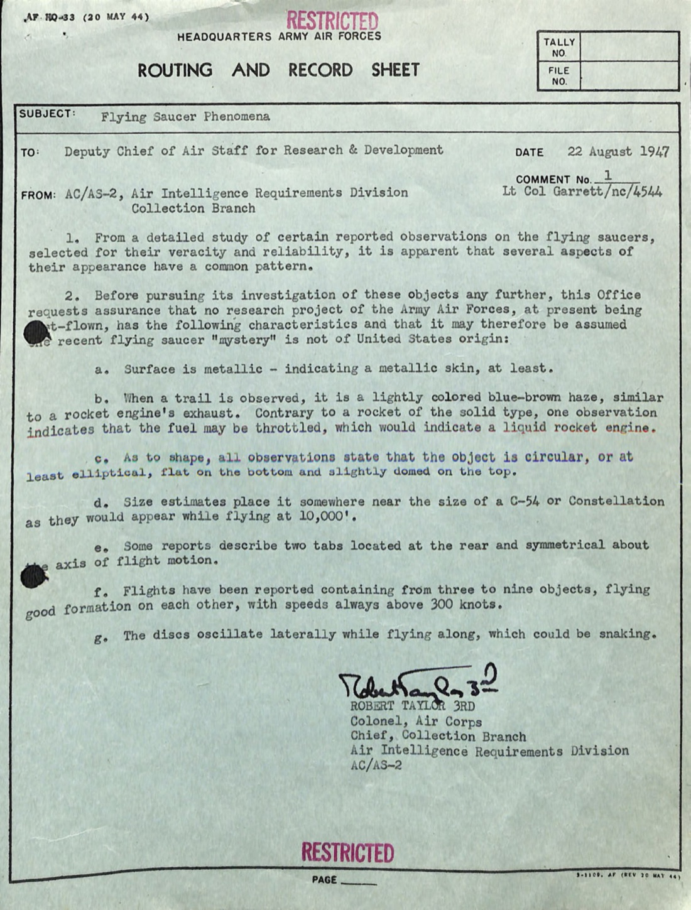
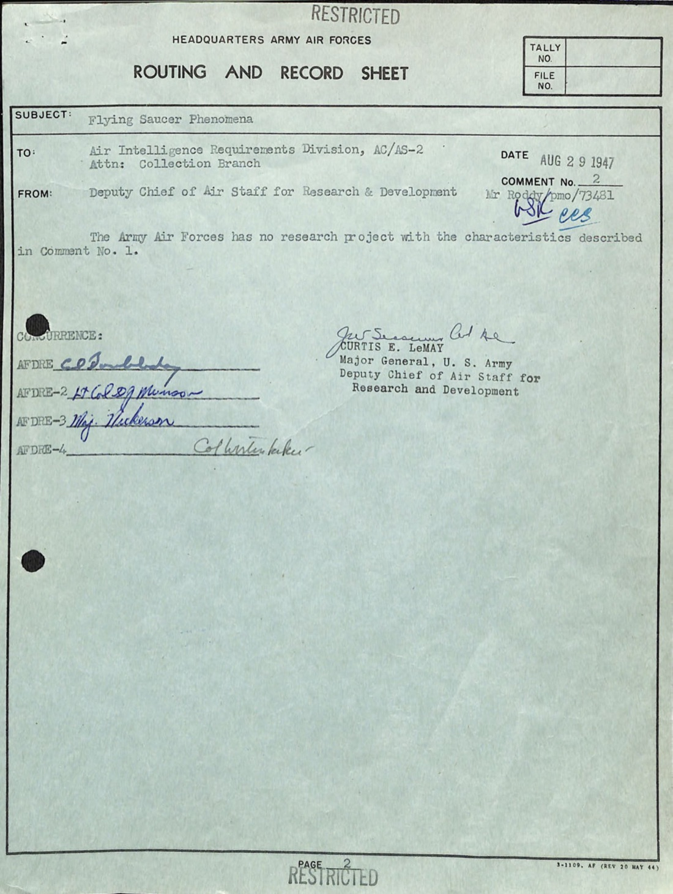
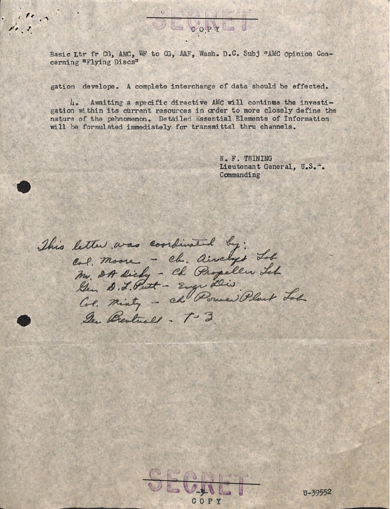
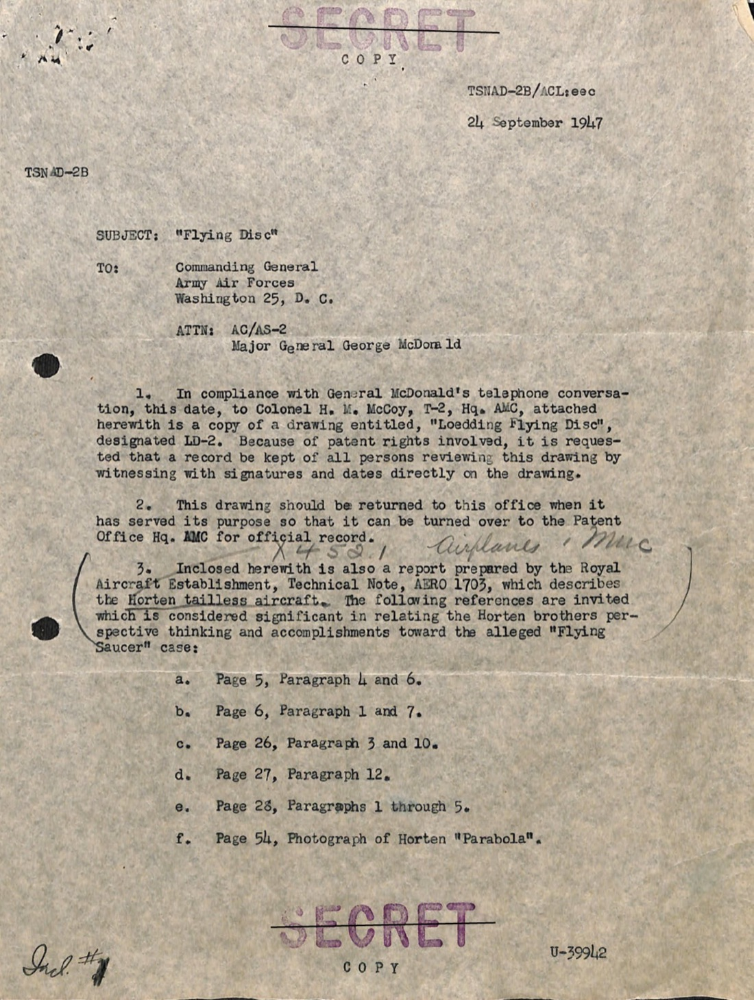
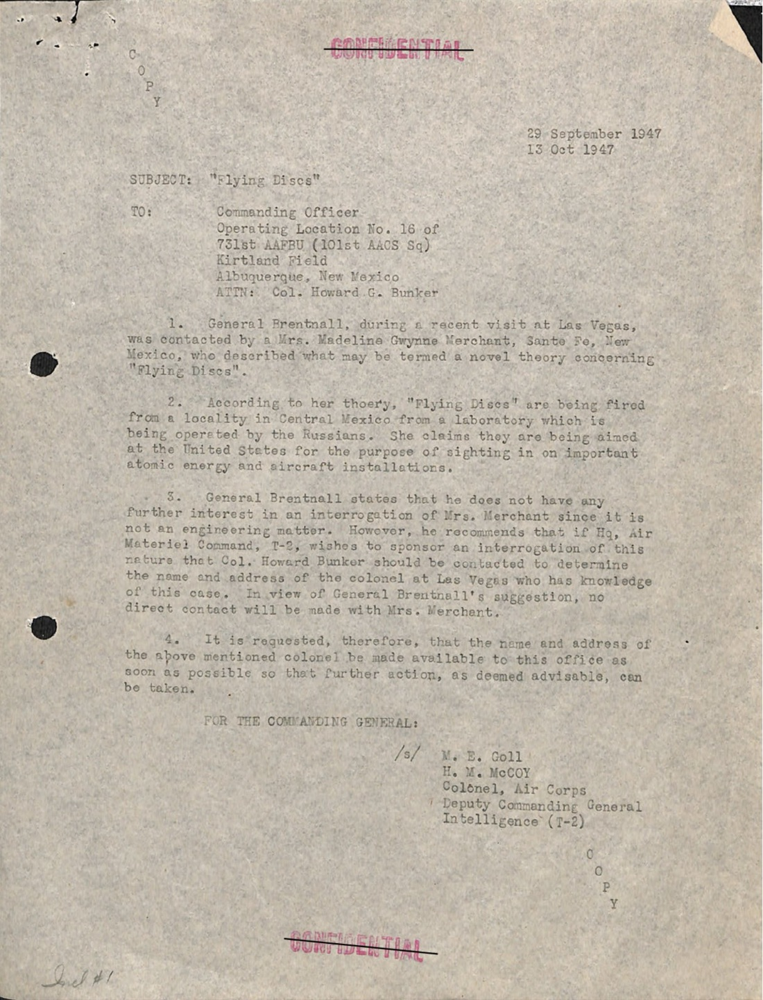
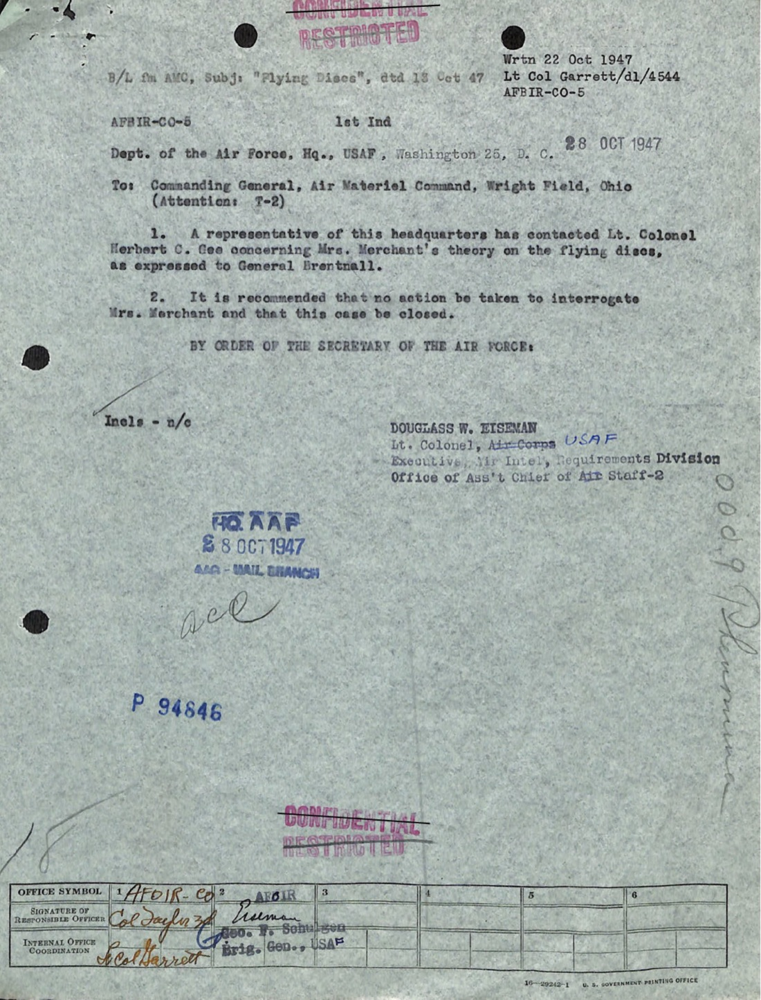
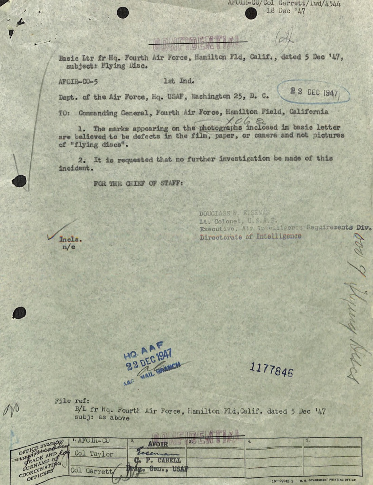
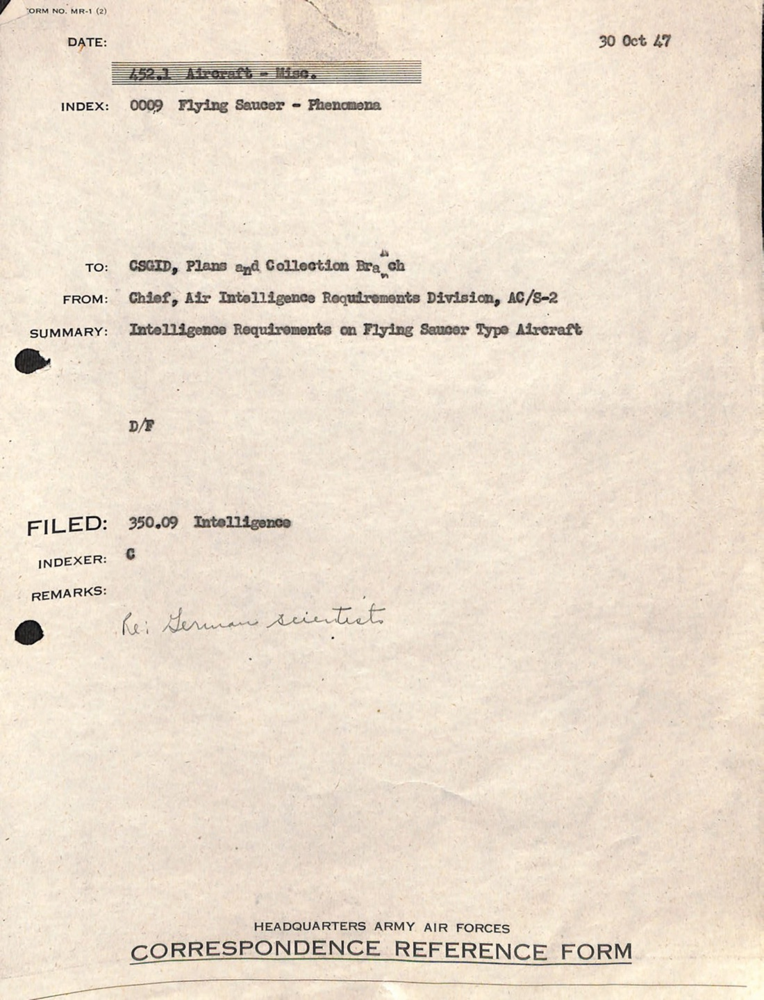
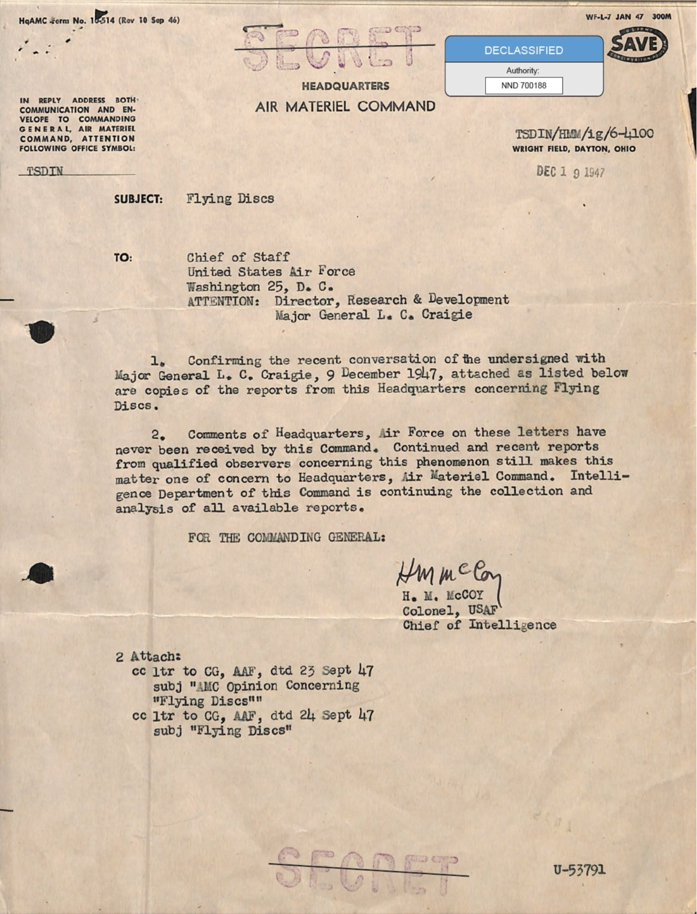
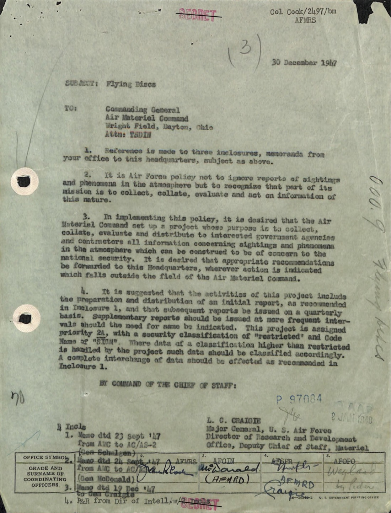

# #017 Air Materiel Command「飛碟」案卷 1947-08 → 1947-12：Project Sign 起源公文鏈

| 欄位 | 內容 |
|---|---|
| 檔案編號 | 18_100754_ General 1946-7_Vol_2 |
| 來源機關 | U.S. Department of War（Air Materiel Command / 美國陸軍航空隊／空軍） |
| 日期範圍 | 1947-08-22 → 1947-12-30 |
| 頁數 | 28 頁 |
| 地點 | Wright Field（Dayton, Ohio）、Hamilton Field（CA）、Kirtland Field（NM）、華盛頓特區 |
| 核心關鍵字 | flying disc, flying saucer, AMC opinion, Twining letter, Project Sign 前身, Horten brothers, Loedding LD-2, LeMay |
| 機密層級 | DECLASSIFIED（原 SECRET / RESTRICTED） |
| 公開日 | 2026-05-08 |

## 為什麼這份檔案重要

1947 年 6 月 24 日 Kenneth Arnold 在 Washington 州 Rainier 山看到九個飛行物，新聞用了「飛碟」一詞，美國接下來六個月被飛碟目擊報告淹沒。後來大家熟悉的 Project Blue Book、Project Grudge、Project Sign，是這場輿論潮的官方回應，但回應是怎麼產生的？是誰下令？怎麼下令？根據什麼證據？

這份檔案是 1947 年 8 月到 12 月之間，AMC（Air Materiel Command，空中物資司令部，駐俄亥俄州 Wright Field）和華府 USAF 總部之間的飛碟公文鏈。它走完三件事：

1. **1947-08-22**：AAF 情報處先列出飛碟的「共同特徵」（金屬反光、圓盤、編隊飛行、超過 300 節），向 R&D 部門問「這是我們自己的研究計畫嗎？」
2. **1947-08-29**：Curtis E. LeMay 少將（時任 Deputy Chief of Air Staff for R&D）回函「The Army Air Forces does not have any project with the characteristics in Comment No. 1」（不是我們的）。
3. **1947-09-23**：AMC 司令 Nathan F. Twining 中將回函「**The phenomenon reported is something real and not visionary or fictitious**」，建議華府指派 Code Name + 優先序，正式立案研究。
4. **1947-12-30**：USAF 總部回函 AMC：「**it is desired that the Air Materiel Command set up a project**」，要 AMC 設一個專案，蒐集、整理、評估並向相關政府機構和承包商分發飛碟和大氣現象的所有資訊。

這份 12 月 30 日的指令，就是 1948 年 1 月正式啟動的 **Project Sign**（後改名 Project Grudge、Project Blue Book）的成立令。Project Sign 是美國政府第一個系統性研究飛碟的官方專案，整個故事從這份檔案開始。

檔案還夾帶兩個有趣的脈絡：

- **Horten 兄弟線**：AMC 同時在比對德國 Horten 兄弟（無尾翼飛行翼設計者）的 Horten Parabola 圖紙，並引用 1947 年 6 月駐莫斯科武官報告「1600 架 Horten VIII 噴射版正在為蘇聯轟炸機中隊生產」。也就是說，AMC 一開始就在問「會不會是俄國拿到 Horten 圖紙做出來的？」
- **Mrs. Merchant 線**：新墨西哥州 Santa Fe 一位女士 Madeline Gwynne Merchant 跟 Brentnall 准將提出「飛碟是俄國人在墨西哥中部的實驗室發射出來，目標是美國原子能設施」的理論。AMC 把這條線追了將近一個月後決定「close this case」，但這條線就是 Twining 信中「foreign nation with nuclear propulsion」這個括號的人類來源。

## 1. 1947-08-22 Garrett Memo：先列特徵

8 月 22 日，AC/AS-2（情報處）情報需求部蒐集分支主任 R.D. Doyle 上校簽了一份 Routing and Record Sheet（RRS）給 R&D 部門，這就是後來 UFO 學家稱為「Garrett Memo」的文件（執筆人是 Lt Col George D. Garrett）。

Doyle 把當時收到的飛碟報告中可信度較高的一批做了內部研究，整理出七條共同特徵：

> a. Surface is metallic — indicating a metallic skin, at least.
> b. When a trail is observed, it is a lightly colored blue-brown haze, similar to a rocket engine's exhaust. Contrary to a rocket of the solid type, one observation indicates that the fuel may be throttled, which would indicate a liquid rocket engine.
> c. As to shape, all observations state that the object is circular, or at least elliptical, flat on the bottom and slightly domed on the top.
> d. Size estimates place it somewhere near the size of a C-54 or Constellation as they would appear while flying at 10,000'.
> e. Some reports describe two tabs located at the rear and symmetrical about the axis of flight motion.
> f. Flights have been reported containing from three to nine objects, flying good formation on each other, with speeds always above 300 knots.
> g. The discs oscillate laterally while flying along, which could be snaking.

> a. 表面金屬，至少是金屬蒙皮。
> b. 偶有尾流，呈淺藍棕色霧狀，類似火箭引擎排氣。但和固體火箭不同，有目擊指出燃料可以節流，這意味是液態火箭引擎。
> c. 形狀方面，所有目擊都說物體是圓形或至少橢圓，底部平、頂部微拱。
> d. 大小估計大約是 C-54 或 Constellation 客機在一萬呎高度看起來的大小。
> e. 部分報告描述機尾有兩個對稱片狀結構，沿飛行軸對稱。
> f. 目擊到的編隊由三到九個物體組成，彼此編隊飛行良好，速度都在 300 節以上。
> g. 飛行時圓盤側向擺動，可能是 S 形軌跡。

整段語氣是工程描述，不是 sci-fi。然後 Doyle 把問題甩給 R&D：「在我們進一步調查之前，請告訴我們 AAF 沒有任何研究計畫具有上述特徵，這樣我們才可以假設這現象不是美國自己的東西。」

## 2. 1947-08-29：LeMay 回函「不是我們的」

七天後，當時 41 歲的 **Curtis E. LeMay 少將**（後來的 SAC 總司令、二戰太平洋戰區戰略轟炸主導者、1968 年 George Wallace 競選副總統搭檔）以 Deputy Chief of Air Staff for R&D 身分簽了 Comment No. 2 回給 AC/AS-2：

> The Army Air Forces does not have any project with the characteristics in Comment No. 1.

> 陸軍航空隊沒有任何具備 Comment No. 1 所列特徵的研究計畫。

一句話就是「不是我們做的」。這一句話的政治意義很重：它把「保密軍事計畫」這個最低成本的解釋直接從桌上拿掉。從這一刻開始，飛碟不能再用「可能是我們自己的東西」搪塞過去。

## 3. 1947-09-11：AC/AS-2 把整個檔案送到 Wright Field

9 月 11 日，AC/AS-2 把「this Office 持有的完整飛碟目擊報告檔案」整批交給 AMC 的 T-2（情報部門）Mr. A.C. Loedding 拿去做 photostat 副本：

> 1. As arranged verbally with Mr. Loedding, inclosed is the complete file maintained by this Office on reported sightings of Flying Discs.

> 1. 如先前與 Loedding 先生口頭協議，現附上本辦公室保存的飛碟目擊報告完整檔案。

收件人 Loedding 是 AMC T-2 的航空工程師，後來在 Project Sign 內部一直是「異常物理載具」論的主要支持者。把整本目擊檔案實體搬到 Wright Field 這個動作，等於把研究主導權從華府移交給 AMC。

## 4. 1947-09-23：Twining 回函「現象是真的」

12 天後，AMC 司令 **Nathan F. Twining 中將**（後來的 USAF 首任參謀長、JCS 主席）親簽回函給 Brig. Gen. George Schulgen（AC/AS-2）：

這就是 UFO 研究圈所稱的「Twining Letter」。Twining 召集了 Air Institute of Technology、T-2 情報處、Engineering Division T-3 的 Aircraft / Power Plant / Propeller 三大實驗室聯席會議，產出 AMC 的官方意見：

> 2. It is the opinion that:
> a. The phenomenon reported is something real and not visionary or fictitious.
> b. There are objects probably approximating the shape of a disc, of such appreciable size as to appear to be as large as man-made aircraft.
> c. There is a possibility that some of the incidents may be caused by natural phenomena, such as meteors.
> d. The reported operating characteristics such as extreme rates of climb, maneuverability (particularly in roll), and action which must be considered evasive when sighted or contacted by friendly aircraft and radar, lend belief to the possibility that some of the objects are controlled either manually, automatically or remotely.

> 2. 本司令部認為：
> a. 所報告的現象是真的，不是幻覺也不是虛構。
> b. 存在大致呈圓盤形的物體，尺寸顯著到看起來像是和人造飛機差不多大。
> c. 部分案例有可能是自然現象造成，例如流星。
> d. 報告中描述的操作特性（極高的爬升率、機動性，特別是橫滾、被友軍飛機和雷達偵測時表現出的閃避行為），讓人相信這些物體是被有意操控的，無論是手動、自動或遙控。

接下來是物體的「共同描述」，注意這份描述是把前面 Garrett 列的特徵再壓縮一輪：

> e. The apparent common description of the objects is as follows:
> (1) Metallic or light reflecting surface,
> (2) Absence of trail, except in a few instances when the object apparently was operating under high performance conditions.
> (3) Circular or elliptical in shape, flat on bottom and domed on top.
> (4) Several reports of well kept formation flights varying from three to nine objects.
> (5) Normally no associated sound, except in three instances a substantial rumbling roar was noted.
> (6) Level flight speeds normally above 300 knots are estimated.

> e. 物體的共同描述如下：
> (1) 金屬或反光表面。
> (2) 通常沒有尾流，只有少數例外是物體在高性能操作狀態下才會出現尾流。
> (3) 形狀圓形或橢圓，底部平、頂部拱。
> (4) 多次目擊到三到九個物體編隊飛行良好。
> (5) 通常沒有伴隨聲音，僅三次目擊到顯著的隆隆轟鳴。
> (6) 平飛速度估計通常在 300 節以上。

然後是 Twining 信件最關鍵的可行性段落，講「如果是人造，做得到嗎？」：

> f. It is possible within the present U.S. knowledge — provided extensive detailed development is undertaken — to construct a piloted aircraft which has the general description of the object in subparagraph (e) above which would be capable of an approximate range of 7000 miles at subsonic speeds.

> f. 以美國當前的技術，如果投入充分的研發，是有可能造出符合 (e) 段描述、能以次音速飛行約 7000 英里的有人駕駛飛機。

也就是說 AMC 認為這「不違反物理」，但需要可觀資源。然後 Twining 把可能的三條解釋路徑都列出來：

> h. Due consideration must be given the following:
> (1) The possibility that these objects are of domestic origin — the product of some high security project not known to AC/AS-2 or this Command.
> (2) The lack of physical evidence in the shape of crash recovered exhibits which would undeniably prove the existence of these objects.
> (3) The possibility that some foreign nation has a form of propulsion possibly nuclear, which is outside of our domestic knowledge.

> h. 必須考慮以下幾點：
> (1) 這些物體有可能是國內來源，是某個 AC/AS-2 和本司令部都不知道的高機密專案的產品。
> (2) 缺乏實體證據（例如墜毀回收的殘骸）可以毫無疑問地證明這些物體存在。
> (3) 有可能某個外國擁有美國技術之外的推進系統，例如核動力推進。

(1) 已經被 LeMay 8 月 29 日的信回掉了。(2) 是直接點名「我們手上沒有實體」。(3) 是 Mrs. Merchant 那條線的官方版本：俄國 + 可能核推進。

最後是建議行動：

> 3. It is recommended that:
> a. Headquarters, Army Air Forces issue a directive assigning a priority, security classification and Code Name for a detailed study of this matter...
> 4. Awaiting a specific directive AMC will continue the investigation within its current resources in order to more closely define the nature of the phenomenon.

> 3. 建議事項：
> a. 陸軍航空隊總部發布指令，為此議題的詳細研究指派優先序、機密等級和代號⋯⋯
> 4. 在等待指令期間，AMC 將以現有資源繼續調查，以更精確定義此現象的本質。

簽名：**N. F. TWINING / Lieutenant General, U.S.A. / Commanding**。Twining 後來在 1953 年成為 USAF 第二任參謀長，1957 年成為參謀長聯席會議主席。把名字放在這封信底下，是相當高的政治賭注。

## 5. 1947-09-24：McCoy 接力，Loedding 圖紙與 Horten Parabola

Twining 信發出隔天，AMC 副司令 H.M. McCoy 上校（Twining 信中提到的 Engineering Division T-3 三大實驗室開會的主導者）發了一封標題「Flying Disc」的信給華府 AC/AS-2 的 McDonald 少將：

> 1. In compliance with General McDonald's telephone conversation, this date, to Colonel H. M. McCoy, T-2, Hq. AMC, attached herewith is a copy of a drawing entitled, "Loedding Flying Disc", designated LD-2. Because of patent rights involved, it is requested that a record be kept of all persons reviewing this drawing by witnessing with signatures and dates directly on the drawing.

> 1. 依據今日 McDonald 將軍與 AMC 司令部 T-2 McCoy 上校的電話協議，附上「Loedding 飛碟」圖紙副本，編號 LD-2。由於牽涉專利權，要求所有檢視此圖紙的人員直接在圖紙上簽名並註明日期，作為見證紀錄。

「Loedding Flying Disc」LD-2 圖紙就是 Alfred Loedding（AMC T-2 工程師）親手畫的圓盤型飛行器設計。他畫 LD-2，是把當時受訪目擊者描述的圓盤外型嘗試逆向工程出一個工程草圖。

接下來信件附了 Royal Aircraft Establishment（RAE）Technical Note AERO 1703 的引用清單：

> 3. Inclosed herewith is also a report prepared by the Royal Aircraft Establishment, Technical Note, AERO 1703, which describes the Horten tailless aircraft. The following references are invited which is considered significant in relating the Horten brothers perspective thinking and accomplishments toward the alleged "Flying Saucer" cases:
> a. Page 5, Paragraph 4 and 6.
> b. Page 6, Paragraph 1 and 7.
> c. Page 26, Paragraph 3 and 10.
> d. Page 27, Paragraph 12.
> e. Page 28, Paragraphs 1 through 5.
> f. Page 54, Photograph of Horten "Parabola".

> 3. 另附英國皇家航空研究院（RAE）技術備忘 AERO 1703，描述 Horten 無尾翼飛機。請特別注意以下段落，這些段落對於連結 Horten 兄弟的設計思路與所謂「飛碟」案例具有重要意義：
> a. 第 5 頁，第 4、6 段。
> b. 第 6 頁，第 1、7 段。
> c. 第 26 頁，第 3、10 段。
> d. 第 27 頁，第 12 段。
> e. 第 28 頁，第 1 至 5 段。
> f. 第 54 頁，Horten「Parabola」照片。

接下來是 9 月 24 日這封信最 alarming 的一段，引用 1947 年 6 月駐莫斯科美國武官報告：

> 4. A recent report from the U. S. Military Attache, Moscow, USSR, dated 9 June 1947, indicates that 1600 aircraft, directly or indirectly based on the Horten VIII design (six engine pusher, having a wing spread of 151 feet and a gross weight of approximately thirty-three thousand pounds) are being built for bomber squadron use. The Russian version, however, is jet propelled, reference report whose identification No. is V-32291-S.

> 4. 駐莫斯科美國武官 1947 年 6 月 9 日的近期報告指出，蘇聯正在生產 1600 架直接或間接基於 Horten VIII 設計（六引擎推進、翼展 151 英尺、總重約 33,000 磅）的飛機，供轟炸機中隊使用。但俄方版本改為噴射動力，參考報告編號 V-32291-S。

二戰結束後 Horten 兄弟設計的全翼機（特別是 Horten Ho 229 噴射飛行翼）落入俄方手中是當時 AMC 的內部焦慮。McCoy 在 9 月 24 日把這條線和飛碟並排討論，等於是在 Twining 信第 2.h.(3) 段「外國有美國不知道的推進技術」這個括號裡填入一個具體的工程候選人。

## 6. 1947-09-23 → 10-15：Mrs. Merchant 的俄國理論

Twining 信送出同一天，AMC 還在處理另一條線。Brentnall 准將去 Las Vegas 訪問時被 Santa Fe（新墨西哥州）一位 Mrs. Madeline Gwynne Merchant 攔下，講出她的「novel theory」：

> 2. According to her theory, "Flying Discs" are being fired from a locality in central Mexico from a laboratory which is being operated by the Russians. She claims they are being aimed at the United States for the purpose of sighting in on important atomic energy and aircraft installations.

> 2. 根據她的理論，「飛碟」是從墨西哥中部的一個地點發射，那裡有一個由俄國人經營的實驗室。她聲稱這些飛碟是瞄準美國，目的是偵測重要的原子能和飛機設施。

Brentnall 把線交給 AMC，AMC 又把線交給 Kirtland Field（新墨西哥州 Albuquerque）的 Col. Howard Bunker。Bunker 10 月 2 日回信說：負責當地連繫的 Lt. Col. Herbert C. Gee（原來 Los Alamos / Las Vegas 指揮官）已經調職到華府工兵團，「沒有人接他的位置」，「也沒有人比 Brentnall 將軍本人更了解 Mrs. Merchant 的理論」。

10 月 22 日華府 Air Intelligence Requirements Division 的 Douglass W. Eisenhart 中校簽下結案令：

> 2. It is recommended that no action be taken to interrogate Mrs. Merchant and that this case be closed.

> 2. 建議不對 Mrs. Merchant 進行訊問，本案結案。

這條線的工程價值不高（她沒有具體證據），但她代表了一種典型的 1947 年公民焦慮：戰爭剛結束，俄國敵意明顯，原子彈剛投到日本兩年，新墨西哥州又是 Manhattan Project 大本營，「俄國在墨西哥」這個邏輯在當時並不離譜。AMC 不立刻丟掉這條線，跑了將近一個月才結案。

## 7. 1947-10-22：Hamilton Field 的 Oregon 照片

幾乎同時，第 4 航空軍司令部從 Oregon 的 Portland 一位 Mary L. Herren 女士那邊收到了三張「飛碟照片」。

第 4 航空軍 4AFDA-3 情報處 Donald L. Springer 中校 1947-12-05 發了一封給華府的信：

> 1. The attached photographs were forwarded to this office by a very reliable source of information, obtained from a Mrs. L. Herren, 1825 NE Bidwell Avenue, Portland 2, Oregon. She advises these photographs were taken some time between November 5th and 15th, 1946, in the vicinity of Jefferson, Oregon, and points out the formation in the photographs as being objects she did not recall seeing herself but she thought might possibly be flying discs.
> 2. The objects referred to appear in the sky area of each accompanying photograph. The uniformity of the markings would tend to indicate that the camera or film used to take these pictures was possibly defective. No incidents of flying discs have been reported from that vicinity on or about the inclusive dates named above.

> 1. 隨附照片由可靠消息來源轉送給本辦公室，原始提供者為俄勒岡州波特蘭 1825 NE Bidwell Avenue 的 Mrs. L. Herren。她說照片拍攝時間大約是 1946 年 11 月 5 日到 15 日之間，地點在俄勒岡州 Jefferson 附近，她指出照片中天空中的編隊是她自己並未實際看見、但可能是飛碟的物體。
> 2. 上述物體出現在每張照片的天空區域。標記的一致性，意味相機或底片可能有瑕疵。該地區在上述日期前後並未有任何飛碟事件報告。

12 月 18 日，華府 USAF AFOIR-CO-5 回信：

> 1. The marks appearing on the scenes presented in basic letter are believed to be defects in the film, paper, or camera and not pictures of "flying discs".
> 2. It is requested that no further investigation be made of this incident.

> 1. 基本信件中所附畫面上出現的標記，我們認為是底片、相紙或相機的瑕疵，不是「飛碟」的照片。
> 2. 要求不再對此事件進行進一步調查。

12 月 30 日（也就是 USAF 對 AMC 發出立案指令同一天），這個 case 正式被關掉。Oregon 照片不是飛碟，是底片缺陷。

## 8. 1947-11-18：McCoy 抱怨「華府都沒回」

11 月 18 日，McCoy 再發一封信給 AC/AS-2 的 Garrett，已經有點不耐煩的味道：

> 1. The inclosed newspaper clippings are submitted for your information and comment. The incident reported in Seattle appeared in the "Dayton Journal" on 12 November 1947, and should be followed up if possible.
> 2. The story by Lionel Shapiro regarding war weapons developed in Spain evidently was printed in a number of leading newspapers throughout the country. The significance of this article will be dependent upon certain essential elements for such alleged important developments, such as funds, materials, experimental testing facilities, and technological "know-how". The latter is supposed to be supplied by German scientists. The German scientists at this Hq indicate that no important scientists from Germany are working in Spain, and those mentioned in this article are not known to them.
> 3. If possible, therefore, an effort should be made to obtain names, qualifications, or any information that might help to identify the alleged German scientists working in Spain.
> 4. A brief statement was made in a recent intelligence report from Hq, USAF, AC/AS-2, regarding a flying disc incident in Alaska in September. The close range sighting reported should render a more detailed observation than what was reported, which also suggests a follow-up.
> 5. It is further requested that this office be advised as to progress being made on the plotting of all flying disc incidents to date, particularly in North America. It was understood that Dr. Carroll was going to plot these incidents, but no further word was received regarding this effort.

> 1. 附上 Seattle 飛碟事件的剪報（1947-11-12 Dayton Journal），可能值得追查。
> 2. Lionel Shapiro 報導西班牙正在研發戰爭武器的故事，登在全國多家大報。這篇報導的重要性，要看是否具備幾個基本要素：資金、材料、實驗測試設施、技術 know-how。其中 know-how 據稱是由德國科學家提供。本司令部的德國科學家表示，沒有重要德國科學家在西班牙工作，文章中提到的人他們也不認識。
> 3. 因此如果可能，請設法取得姓名、資歷或任何資訊，協助識別據稱在西班牙工作的德國科學家。
> 4. USAF 總部最近一份情報報告簡短提到 9 月在 Alaska 的飛碟事件。報告中提到的是近距離目擊，應該能提供比目前更詳細的觀察，建議追蹤。
> 5. 此外，請告知本辦公室至今所有飛碟事件的位置標繪進度，特別是北美地區。先前理解是 Dr. Carroll 會負責標繪，但至今未收到後續消息。

第 5 段是抱怨：你們答應做的地圖呢？整整兩個月過去了，9 月 11 日交給 Loedding 的整本檔案是不是有人在看？

第 2 到 4 段是 McCoy 把線繼續往外拉：德國科學家可能在西班牙做事？阿拉斯加 9 月的近距離目擊有沒有後續？Lionel Shapiro 報導裡的西班牙武器計畫是不是 Horten 線的另一個分支？

11 月 24 日 McCoy 又補一封信，要求華府把 11 月 18 日那封信加上「SECRET」分類號 U-48983。

## 9. 1947-12-09：McCoy 上呈 USAF 總部 Craigie 少將

11 月 18 日信沒回。McCoy 12 月 9 日終於決定越過 Garrett，直接上呈到 USAF 總部 R&D 處長 L.C. Craigie 少將：

> 1. Confirming the recent conversation of the undersigned with Major General L. C. Craigie, 9 December 1947, attached as listed below are copies of the reports from this Headquarters concerning Flying Discs.
> 2. Comments of Headquarters, Air Force on these letters have never been received by this Command. Continued and recent reports from qualified observers concerning this phenomenon still makes this matter one of concern to Headquarters, Air Materiel Command. Intelligence Department of this Command is continuing the collection and analysis of all available reports.

> 1. 確認本人 1947 年 12 月 9 日與 L. C. Craigie 少將最近的會談內容，附上本司令部關於飛碟的相關報告副本。
> 2. 本司令部至今未收到空軍總部對這些信件的任何回覆。然而，來自合格觀察者關於此現象的持續和近期報告，仍使本案成為本司令部關切的事項。本司令部情報處正持續蒐集和分析所有可得報告。

附件清單兩件：
- 1947-09-23「AMC Opinion Concerning Flying Discs」（Twining 信）
- 1947-09-02「Flying Discs」

這份信的潛台詞是：「我們在 9 月就送出 Twining 中將親簽的建議書，三個月沒有回音，但目擊報告還在進來。請華府做決定。」這條線繞過 AC/AS-2，直接打到 R&D 主管那邊，是 AMC 用組織政治推進度的動作。

## 10. 1947-12-30：USAF 回函「set up a project」

3 週後，USAF 總部副參謀長（物資）M.S. Fairchild 中將親簽指令發回 AMC：

> 2. It is Air Force policy not to ignore reports of sightings and phenomena in the atmosphere but to recognize that part of its mission is to collect, collate, evaluate and act on information of this nature.
>
> 3. In implementing this policy, it is desired that the Air Materiel Command set up a project whose purpose is to collect, collate, evaluate and distribute to interested government agencies and contractors all information concerning [sightings] and phenomena in the atmosphere which can be construed to be of concern to the national security. It is desired that appropriate recommendations be forwarded to this Headquarters, wherever action is indicated which falls outside the field of the Air Materiel Command.

> 2. 空軍政策是不忽視大氣現象與目擊報告，並承認蒐集、整合、評估並據以行動屬於其任務之一。
>
> 3. 為落實此政策，要求 Air Materiel Command 設立一項專案，目的是蒐集、整合、評估，並向相關政府機關和承包商分發所有涉及大氣現象與目擊報告、可被認定為與國家安全相關的資訊。對於落在 Air Materiel Command 職權範圍以外的議題，請將適當建議轉呈本總部。

落款：

> Director of Research and Development

Twining 1947-09-23 提出「請華府指派優先序、機密等級、代號」，1947-12-30 華府正式同意。AMC 在 1948 年 1 月 22 日把這個專案命名為 **Project Sign**（內部代號 Saucer），主導者就是 Twining 信中提到的 T-2 情報處 + T-3 Engineering Division。

Project Sign 一年後（1949-02）改名 Project Grudge，1952 年再改名 Project Blue Book，到 1969 年才正式結束。

## 11. 時間軸

| 日期 | 文件 | 來源 | 收件 | 摘要 |
|---|---|---|---|---|
| 1947-08-22 | RRS Comment No. 1 | AC/AS-2 Air Intel Requirements Div Collection Branch (R.D. Doyle 上校署名) | Deputy CofAS R&D | 列出飛碟 7 條共同特徵，問「這是 AAF 的計畫嗎？」 |
| 1947-08-29 | RRS Comment No. 2 | Deputy CofAS R&D (LeMay 少將) | AC/AS-2 | 「AAF does not have any project with the characteristics in Comment No. 1」 |
| 1947-09-11 | Ltr「Reported Sightings of Flying Discs」 | AC/AS-2 (Garrett) | AMC T-2 | 整本目擊檔案實體交給 Loedding 做 photostat |
| 1947-09-23 | Ltr「AMC Opinion Concerning Flying Discs」 | AMC CG (Twining 中將) | AAF CG attn Schulgen 准將 | Twining 信：「phenomenon is real」「請華府立案」 |
| 1947-09-23 | Ltr「Flying Disc」(LD-2 圖紙線) | AMC T-2 (McCoy) | AC/AS-2 (McDonald 少將) | Loedding LD-2 圖紙 + RAE Horten Parabola 參考清單 |
| 1947-09-24 | Ltr「Flying Saucers」(日本雷達線) | AMC T-2 (McCoy) | AC/AS-2 (Garrett) | 詢問 Schulgen 提到的日本雷達目擊 |
| 1947-09-29 | Ltr「Flying Discs」(Merchant 線) | AMC T-2 (McCoy) | Kirtland Field Bunker 上校 | Mrs. Merchant 俄國理論轉介 |
| 1947-10-02 | 1st Ind Kirtland Field | Bunker 上校 | AMC T-2 | Gee 中校已調職，無人接手；除 Brentnall 外無新資訊 |
| 1947-10-15 | Ltr 致 AC/AS-2 | AMC T-2 (McCoy 透過 Clingerman 上校) | AC/AS-2 (Garrett) | 請華府決定 Merchant 案怎麼處理 |
| 1947-10-22 | 1st Ind | AC/AS-2 (Eisenhart 中校) | AMC | 結案：不訪問 Merchant，case closed |
| 1947-11-12 | (剪報) Seattle 飛碟事件 | Dayton Journal | — | McCoy 11-18 信引用 |
| 1947-11-18 | Ltr「Flying Discs」 | AMC T-2 (McCoy) | AC/AS-2 (Garrett) | 剪報 + Shapiro 西班牙文 + 阿拉斯加目擊 + 抱怨地圖標繪沒進度 |
| 1947-11-24 | Ltr「Flying Discs」 | AMC T-2 (McCoy) | AC/AS-2 (Garrett) | 要求對 11-18 信加上 SECRET 分類號 U-48983 |
| 1947-12-05 | Ltr「Flying Disc」(Herren 照片) | 4th AF DA-3 (Springer 中校) | USAF Director of Intelligence | Oregon 1946-11 三張照片轉送 |
| 1947-12-09 | Ltr「Flying Discs」 | AMC T-2 (McCoy) | USAF CofS attn Craigie 少將 | 越過 AC/AS-2，直接給 R&D 主管，抱怨三個月沒回 |
| 1947-12-18 | 1st Ind Hamilton Field | USAF AFOIR-CO-5 | 4th AF | Oregon 照片是底片瑕疵，不予處理 |
| 1947-12-30 | Ltr 致 AMC | USAF Director of R&D (Fairchild 中將) | AMC CG | 「set up a project」，Project Sign 成立令 |

## 12. 觀察

**(1) 時間差**：Twining 信 1947-09-23 發出，USAF 正式回函指令 1947-12-30 發出，間隔三個月。期間 AMC 每個月都在發追問信，但華府沒有正式回應。

**(2) McCoy 12-09 那封信的政治動作**：McCoy 在 11 月 18 日信沒得到回應後，跳過原本對口的 AC/AS-2，直接上呈到 R&D 主管 Craigie 少將。三週後立案令就下來了。這顯示「decision 卡關在 AC/AS-2 / R&D 之間的優先序爭奪」，繞過去就解開。

**(3) Twining 信第 2.h.(3) 段**：「外國擁有美國技術之外的推進系統，例如核動力推進」，這條線在後續 AMC 內部的工程討論中持續被拿出來。9 月 24 日 McCoy 信把 Horten 線填進這個括號（蘇聯 Horten VIII 噴射版），1948 年 1 月後 Project Sign 內部「Estimate of the Situation」初稿則把這個括號往「extraterrestrial」方向填，但被 Vandenberg 將軍駁回。

**(4) Mrs. Merchant 案的處理時間**：9 月底開始，10 月 22 日結案，整整一個月。AMC 沒有把 amateur 來源直接丟掉，而是循官方訪談、跨單位協調的程序跑完。這個處理流程後來在 Project Sign / Grudge / Blue Book 都保留下來：民間目擊報告會被分配到「值得追查」「資料不足」「已解釋」三類。

**(5) Loedding LD-2 的工程意義**：在 Twining 信之外，AMC 內部已經在做圓盤型飛行器的工程逆向設計。Alfred Loedding（民間工程師出身，1942 進 AMC）後來在 Project Sign 內部一直主張「異常物理載具是真實的工程物件」，但他在 Project Sign 第二份報告完成前（1948-12）就被調離 Wright Field。Loedding 線在 Project Grudge 階段被擱置。

**(6) Horten 兄弟線的科學貢獻**：Horten Ho 229 是真實存在的德國 1944-45 飛行翼噴射機原型。戰後設計圖部分落入蘇聯手中是事實。但 McCoy 9-24 信中提到的「1600 架 Horten VIII 噴射版正在生產」，這個情報後來被證實是錯的：蘇聯確實取得了 Horten 設計，但沒有大規模量產。

## 13. 跨檔案連結

- **[#022 SHAEF foofighters 1944-12 → 1945-03](../022-331_120752_numeric_files_1944-1945_37153_german_armament_equipment_documents/report.md)**：本檔案的二戰前傳。1945-03-15 RAF D.D.I.2 G/C Hopkins 結案信用「Me 262 + flak rocket，但 still a mystery」做結；2 年半後的 1947-09-23 Twining 信用「phenomenon is real, but no physical evidence」做結。同一套官方公文 pattern：(a) 工程描述化，(b) 列出已知技術候選人，(c) 承認「但仍未完全解釋」。
- **後續 FBI 卷宗 1947-07 → 1953**：FBI 在 Arnold 事件後一週內就收到 USAF 請求協助調查目擊者背景的轉介，本檔案 p-27 提到的 1947-08-05「Request for F. B. I. Investigation on Background of Certain Witnesses to Flying Discs」就是 AAF 對 FBI 那條線的早期路標。這條線後來成為 FBI Records 主檔（#001 起頭那批）。

## 14. 來源

- 原始檔案：[U.S. Department of War — 18_100754_ General 1946-7_Vol_2](https://www.war.gov/UFO/#18_100754_%20General%201946-7_Vol_2)
- PDF 直接下載：`https://www.war.gov/medialink/ufo/release_1/18_100754_ general 1946-7_vol_2.pdf`
- 公開日：2026-05-08
- 28 頁，原機密等級 SECRET / RESTRICTED，DECLASSIFIED
