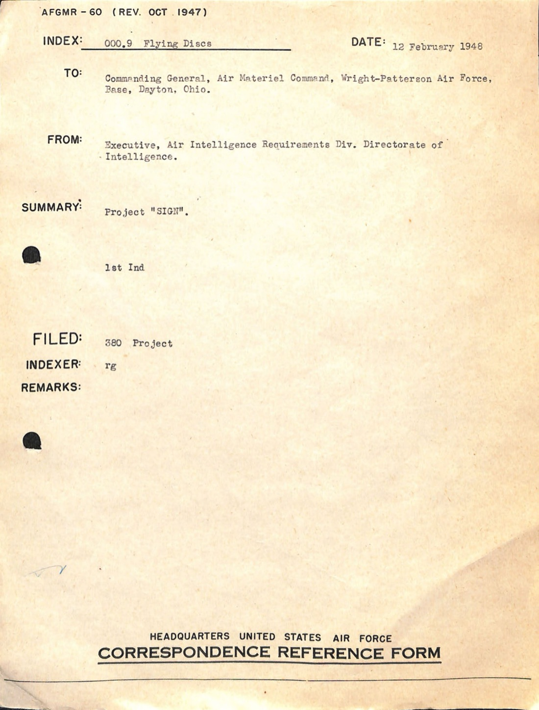
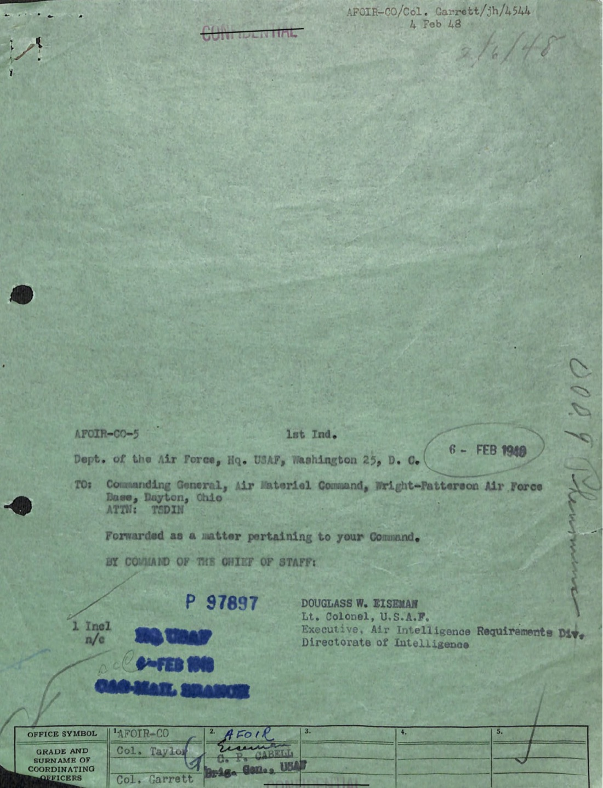
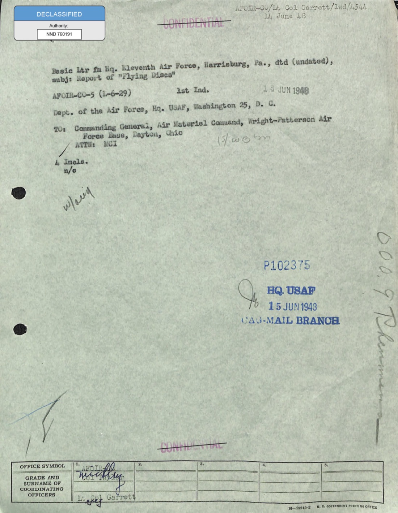
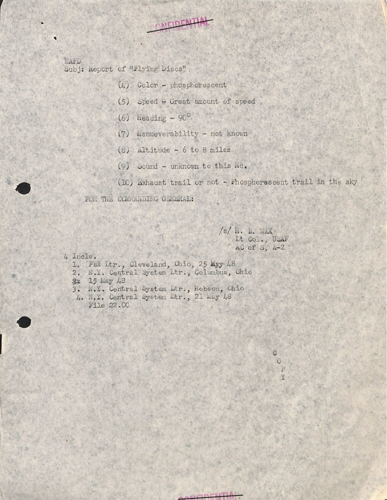
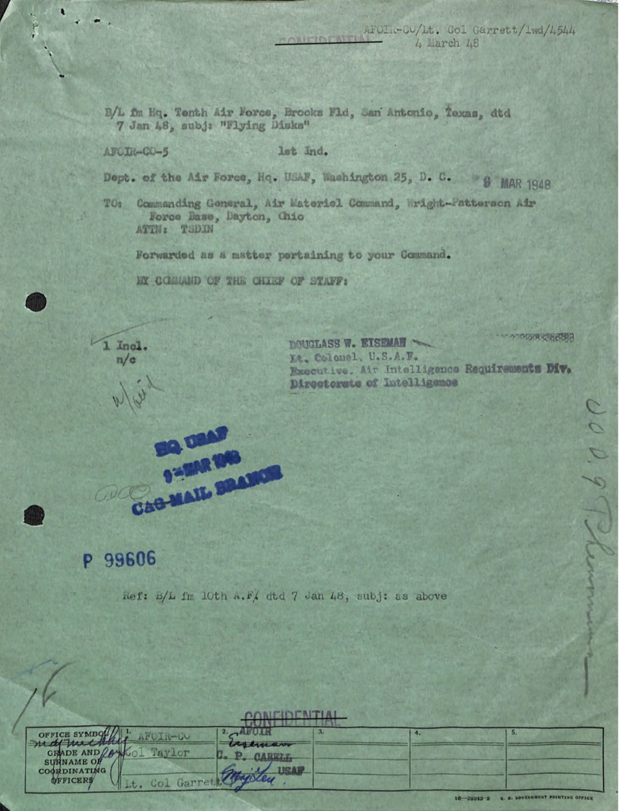
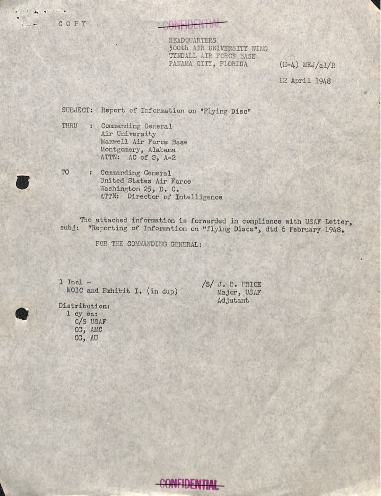
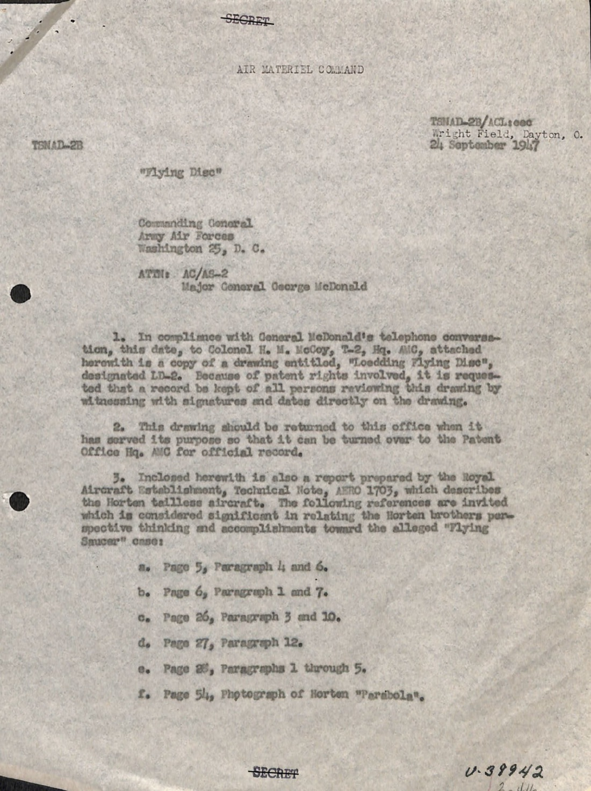
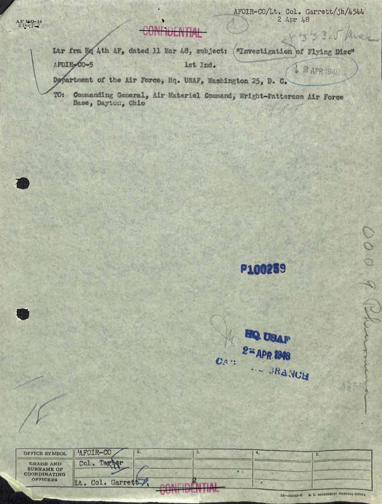
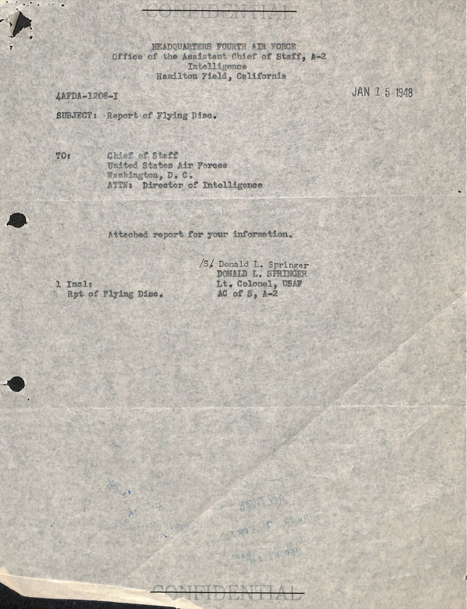

# #018 USAF General 1948 Vol 1：Project Sign 內部 28 頁通信集

| 欄位 | 內容 |
|---|---|
| 檔案編號 | 18_6369445_General_1948_Vol_1 |
| 來源機關 | USAF 總部 Directorate of Intelligence / AMC Wright-Patterson MCIAXO-3 |
| 日期範圍 | 1948-01-07 → 1948-06-15 |
| 頁數 | 28 頁 |
| 機密層級 | RESTRICTED / SECRET ／ DECLASSIFIED (NND 760197) |
| 公開日 | 2026-05-08 |

## 為什麼這份檔案重要

[#017 AMC flying disc 1947 / Project Sign 起源公文鏈](../017-18_100754_general_1946-7_vol_2/report.md) 結束於 1947-12-30 USAF 對 AMC 發出 Project Sign 立案令。本檔案接續，是 1948 年上半年（1-6 月）USAF 內部關於「Flying Discs」的雜項通信集 28 頁。

不像 [#028 Incident Summaries 1-100](../028-38_143685_box7_incident_summaries_1-100/report.md) 是案件目錄（每件案做 Check-List 標準格式），本檔案收的是 **行政與管理層的通信**：基地報告轉發、AMC 對 USAF 總部的詢問、USAF 對 AMC 的指示、案件路由問題、Loedding LD-2 圖紙的再次出現。

歷史價值：

1. **「Project SIGN」名稱首次出現於 USAF 通信**（p-25，1948-02-12）：本檔案保留了 SIGN 從立案令（1947-12-30 未命名）到正式命名（1948-02 命名為 Project Sign）期間的內部紙本軌跡。
2. **5 月 Pennsylvania 第十一航空軍案件處理流程示範**：從基地 → 軍區 → AMC 的轉報路線完整呈現。
3. **AMC TSMAD-2B（McCoy 上校的單位）的延續活動**：Loedding LD-2 圖紙在 1948 年中期仍在 AMC 內部被引用、傳閱。

## 1. 1948-02 Project SIGN 正式命名

p-25 的標題列：

> AFORM-60 (REV. OCT 1947)
> INDEX: 000.9 Flying Discs   DATE: 12 February 1948
> TO: Commanding General, Air Materiel Command, Wright-Patterson Air Force Base, Dayton, Ohio.
> FROM: Executive, Air Intelligence Requirements Div. Directorate of Intelligence.
> SUMMARY: project "SI[GN]"
> 1st Ind
> FILED: SA Project
> INDEXER: rg

> AFORM-60 (REV. OCT 1947)
> 索引：000.9 飛碟   日期：1948-02-12
> 致：俄亥俄 Dayton Wright-Patterson 空軍基地 AMC 司令官
> 自：USAF 總部情報處空軍情報需求部執行長
> 摘要：project "SIGN"
> 第 1 號附件
> 歸檔：SA Project
> 索引者：rg

「project 'SIGN'」是 1947-12-30 立案令到 1949-02 改名 Grudge 之間的正式專案名稱。從 1948-02-12 的這份索引卡可以看到，USAF 總部已經穩定使用「SIGN」這個代號（先前 1947-09 Twining 信「請華府指派 Code Name」，1948-01-22 內部 Saucer Project 內部代號，1948-02 改為 Project Sign 對外正式名稱）。

p-26 緊接著是 Garrett 上校 1948-02-04 從 USAF 總部 AFOIR-CO 簽出的 1st Ind 轉發單給 AMC，主旨「Forwarded as a matter pertaining to your Command」（轉交貴司令部處理）。Garrett 是 [#017](../017-18_100754_general_1946-7_vol_2/report.md) 中 1947-08-22 Garrett Memo 的同一人，AC/AS-2 情報需求部蒐集分支的 Lt Col。1948-02 他升為 Col。

## 2. 1948-05 Pennsylvania 第十一航空軍案件

> Basic Ltr fm Hq. Eleventh Air Force, Harrisburg, Pa., dtd (undated), subj: Report of "Flying Discs"
> AFOIR-CO-5 (16-29) 1st Ind, 1 JUN 1948
> Dept. of the Air Force, Hq. USAF, Washington 25, D.C.
> TO: Commanding General, Air Materiel Command, Wright-Patterson Air Force Base, Dayton, Ohio
> ATTN: MCIAXO-3

> 基本信件來自 Pennsylvania 州 Harrisburg 第十一航空軍司令部，未註日期，主旨：飛碟報告
> AFOIR-CO-5 (16-29) 第 1 號附件，1948-06-01
> 美國空軍部，總部，華盛頓 25 D.C.
> 致：AMC 司令官，俄亥俄 Dayton Wright-Patterson AFB
> 收件：MCIAXO-3

第十一航空軍（Harrisburg, PA）內部報告：

> In compliance with paragraph 14, ADC Letter 1-5-5, 25 March 1948, the following information relative to "Flying Discs" is hereby submitted. The attached report was received this headquarters 27 May.

> 依據 ADC Letter 1-5-5（1948-03-25）第 14 段規定，茲提報以下飛碟資訊。所附報告於 1948-05-27 收悉本部。

附件案件描述（p-003）：

> (4) Color - phosphorescent
> (5) Speed - Great amount of speed
> (6) Heading - 90°
> (7) Maneuverability - not known
> (8) Altitude - 6 to 8 miles
> (9) Sound - unknown to this Hq
> (10) Exhaust trail or not - Phosphorescent trail in the sky

> (4) 顏色 - 磷光色
> (5) 速度 - 極快速度
> (6) 航向 - 90°
> (7) 機動性 - 未知
> (8) 高度 - 6 至 8 英里
> (9) 聲音 - 本部未知
> (10) 尾流 - 天空中可見磷光色尾流

附件還包括 PRR（Pennsylvania Railroad）Cleveland Ohio 1948-05-25 信件、NY Central system Columbus Ohio 信件。鐵路通信員透過 RR 系統把目擊報告轉到第十一航空軍。

公文路由：鐵路通信員（Cleveland / Columbus）→ 第十一航空軍（Harrisburg）→ USAF 總部 AFOIR（華府）→ AMC Wright-Patterson MCIAXO-3。完整跨州轉送共耗時約 4-5 週（1948-05-25 → 1948-06-01 1st Ind 簽發 → 1948-06-15 歸檔 AMC）。

## 3. 1948-01-07 Mantell Day 案件：第十航空軍 Brooks Field

> B/L fm Hq. Tenth Air Force, Brooks Fld, San Antonio, Texas, dtd 7 Jan 48, subj: "Flying Disks"
> AFOIR-CO-5 1st Ind.
> Dept. of the Air Force, Hq. USAF, Washington 25, D. C. (date 25 Jan 1948?)
> TO: Commanding General, Air Materiel Command, Wright-Patterson Air Force Base, Dayton, Ohio
> ATTN: TSDIN
> Forwarded as a matter pertaining to your Command.
> BY COMMAND OF THE CHIEF OF STAFF:
> DOUGLASS W. EISEMAN
> Lt. Colonel, USAF
> Executive, Air Intelligence Requirements Div.
> Directorate of Intelligence

> 基本信件來自 Texas 州 San Antonio Brooks Field 第十航空軍司令部，1948-01-07 簽發，主旨「Flying Disks」
> AFOIR-CO-5 第 1 號附件
> 美國空軍部，總部，華盛頓 25 D.C.（簽發日期 1948-01-25 左右？）
> 致：AMC 司令官，俄亥俄 Dayton Wright-Patterson AFB
> 收件：TSDIN
> 轉交貴司令部處理。
> 奉參謀長之命：
> Douglass W. Eiseman
> 中校，美國空軍
> 執行長，空軍情報需求部
> 情報處

1948-01-07 是 [Mantell day](../028-38_143685_box7_incident_summaries_1-100/report.md#5-mantell-day1948-01-07-kentucky-案件群)。第十航空軍駐 Brooks Field（San Antonio, TX）當天向華府發出獨立案件報告，與 Kentucky / Ohio 群聚目擊未必同源，但同一日的多地報告構成 1948 早期 USAF 內部對「集中爆發」現象的工作意識。

Eiseman 中校（後升上校）是 USAF 總部 AFOIR-CO 1948 年的常駐執行長，多次出現在本檔案中（[#017](../017-18_100754_general_1946-7_vol_2/report.md) 也有他）。轉交模式幾乎所有來信都是「Forwarded as a matter pertaining to your Command」+ Eiseman 簽。

## 4. 1948-04-12 Tyndall Field 500th Aviation Battalion

> HEADQUARTERS
> 500th AIR [...]
> TYNDALL [Field], Florida
> 12 April 1948
> SUBJECT: Report of Information on "Flying Disc"
> THRU: Commanding General, Air University, Maxwell Air Force Base, Montgomery, Alabama, ATTN: AC of S, A-2
> TO: Commanding General, United States Air Force, Washington 25, D. C., ATTN: Director of Intelligence
> The attached information is forwarded in compliance with USAF Letter, subj: "Reporting of Information on 'Flying Discs'", dtd 6 February 1948.

> 第 500 航空 [部隊] 司令部
> Tyndall Field, Florida
> 1948-04-12
> 主旨：飛碟資訊報告
> 經 由：Air University 司令官（Alabama 州 Montgomery Maxwell AFB），收件：AC of S, A-2
> 致：USAF 司令官（華盛頓 25 D.C.），收件：情報處長
> 附件依 1948-02-06 USAF「飛碟資訊回報」之規定轉送。

「依 1948-02-06 USAF 立規」這句說明 [#025 FSR 200-4 1948-49 彙編](../025-342_hs1-416511228_319.1_flying_discs_1949/report.md) 中強調的 1948-02-06 USAF 直送 AMC 指令，在 1948-04 已經被各地基地穩定執行，並透過 Air University 為中介，案件由基地經 Air University（軍訓單位）再到 USAF 總部，最後到 AMC。多層中介意味實際遞交時間會比點對點長很多。

## 5. 1948-09-24 AMC TSMAD-2B 重提 Loedding LD-2 圖紙

> AIR MATERIEL COMMAND
> TSMAD-2B/ACL/[...]
> Wright Field, Dayton, O.
> 24 September 1948
> SUBJECT: "Flying Disc"
> Commanding General, Army Air Forces, Washington 25, D. C.
> ATT: AC/AS-2, Major General George McDonald
>
> In compliance with General McDonald's telephone conversation, this date, to Colonel H. M. McCoy, T-2, Hq. AMC, attached herewith is a copy of a drawing entitled, "Loedding Flying Disc," designated [...] Because of patent rights involved, it is requested that of all [...]

> AMC
> TSMAD-2B/ACL/[...]
> 俄亥俄 Dayton Wright Field
> 1948-09-24
> 主旨：飛碟
> 致：陸軍航空隊司令部，華盛頓 25 D.C.
> 收件：AC/AS-2，George McDonald 少將
>
> 依 McDonald 將軍與 AMC 司令部 T-2 McCoy 上校今日電話協議，附上「Loedding 飛碟」圖紙副本 [...] 由於牽涉專利權，要求所有 [...]

這份 1948-09-24 信件是 [#017](../017-18_100754_general_1946-7_vol_2/report.md) 中 1947-09-24 McCoy 致 McDonald「Loedding LD-2 + Horten Parabola」信件的「整整一年後重提」。也就是 1948-09 USAF 內部仍在傳閱 Loedding LD-2 圖紙。

Alfred C. Loedding（簽 ACL）是 AMC T-2 的航空工程師，1947-09 親手繪製了基於目擊報告逆向工程的圓盤型設計。1948-09 還在傳閱此圖，表示 AMC 內部對「圓盤型載具可建構性」這條工程線仍保持活躍。Loedding 後續在 Project Sign 內部一直主張「異常物理載具是真實工程物」，1948 年末被調離 Wright-Patterson。

## 6. 1948-03-12 Fourth Air Force 調查信

> AFOIR-CO/Lt. Col. Garrett/jh/4544
> 2 Apr 48
> Ltr from 4th AF, dated 12 Mar 48, subject: (investigation) Report of Flying Disc
> AFOIR-CO-5 1st Ind. 2 APR 1948
> Dept of the Air Force, Hq. USAF, Washington 25, D. C.
> TO: Commanding General, Air Materiel Command, Wright-Patterson Air Force Base, Dayton, Ohio
> P-100289
> [...]
> OFFICE SYMBOL: AFOIR-CO   GRADE AND SURNAME OF COORDINATING [Col. Garrett] [2 APR 48]

> AFOIR-CO/Lt. Col. Garrett/jh/4544
> 1948-04-02
> 第 4 航空軍 1948-03-12 信件，主旨：（調查）飛碟報告
> AFOIR-CO-5 第 1 號附件，1948-04-02
> 美國空軍部，總部，華盛頓 25 D.C.
> 致：AMC 司令官，俄亥俄 Dayton Wright-Patterson AFB
> 案件編號 P-100289
> [...]
> 辦公室代號：AFOIR-CO   協調官：Garrett 上校   1948-04-02

第 4 航空軍駐 Hamilton Field（CA）是 [#017](../017-18_100754_general_1946-7_vol_2/report.md) 1947-12-05 Hamilton Field 報告 Oregon Herren 照片案的同單位。1948-03-12 又向華府提交飛碟調查報告，被 Garrett（已升 Lt. Col）接手轉送 AMC。

## 7. 1948-01-15 第四航空軍 Hamilton Field

> HEADQUARTERS FOURTH AIR FORCE
> Office of the Assistant Chief of Staff, A-2
> Intelligence
> Hamilton Field, California
> 4AFDA-1208-7   JAN 15 1948
> SUBJECT: Report of Flying Disc
> TO: Chief of Staff, United States Air Forces, Washington, D. C.
> ATTN: Director of Intelligence
> Attached report for your information.
> /s/ Donald L. Springer
> DONALD L. SPRINGER
> 2 Incl: Lt. Colonel, USAF
> Rpt of Flying Disc, AC of S, A-2

> 第四航空軍司令部
> 副參謀長辦公室 A-2 情報處
> 加州 Hamilton Field
> 4AFDA-1208-7   1948-01-15
> 主旨：飛碟報告
> 致：USAF 參謀長，華盛頓 D.C.
> 收件：情報處長
> 附件供參。
> 簽：Donald L. Springer 中校
> 附件 2 份：飛碟報告

Springer 中校（Lt Col）是 [#017](../017-18_100754_general_1946-7_vol_2/report.md) 1947-12-05 Oregon Mary L. Herren 照片案的署名人。1948-01-15 他又從 Hamilton Field 簽另一份飛碟報告上呈華府。Springer 是第四航空軍 1947-48 期間的主要 UFO 案件聯絡人。

## 8. 觀察

**(1) 公文路由的網絡結構**：本份檔案的 28 份通信涵蓋至少 7 個來源（Pennsylvania 第 11 AF、Texas 第 10 AF、Florida 第 500 AB、California 第 4 AF、Maxwell Air University、AMC、USAF 總部）。所有源頭都向 AMC 收斂，但中間經過 USAF 總部 AFOIR-CO 中介。AFOIR-CO（Air Force Office of Intelligence Requirements - Collection）是 1948 年 USAF 對外案件接收口，由 Garrett 上校與 Eiseman 中校主導。

**(2) Garrett 上校的角色延續**：[#017](../017-18_100754_general_1946-7_vol_2/report.md) 1947-08-22 「Garrett Memo」列七條飛碟特徵的同一人，1948 年仍在 USAF 總部處理飛碟通信，本檔案中至少 3 處有他的簽名或編號（p-15、p-25、p-26）。Garrett 是 1947-49 USAF 飛碟政策的低階常駐執行人。

**(3) Project SIGN 的命名節奏**：1947-12-30 立案令未命名 → 1948-01-22 內部「Saucer」代號 → 1948-02 改名「SIGN」（首次見於本檔案 p-25 索引卡）→ 1949-02 改名「Grudge」。「SIGN」的命名邏輯不明（內部猜測為「signs」或「signal」），但這個名字使用了一整年（1948-02 → 1949-02）。

**(4) Loedding LD-2 的延續性**：1947-09-24 → 1948-09-24，整整一年期間 Loedding LD-2 圖紙在 AMC TSMAD-2B → USAF AC/AS-2 之間反覆傳閱。這個延續性說明 AMC 對「圓盤型載具的工程可建構性」這條線並非短暫好奇，而是持續分析。Loedding 1948 年末才被調離 Wright-Patterson，意味這條線在 Project Grudge 改名後才被擱置。

**(5) 1948-02-06 立規的執行延遲**：USAF 總部 1948-02-06 對所有指揮部發布「飛碟報告直送 AMC」指令（見 [#025](../025-342_hs1-416511228_319.1_flying_discs_1949/report.md#1-1948-02-06-usaf-指令所有飛碟報告直送-amc)），但本檔案 Tyndall Field 1948-04-12 案件仍然「依立規 + 經 Air University 中介」上呈，與「直送 AMC」指令字面意義不符。這意味實務上「直送」是政策而非實作；多層中介仍然普遍存在。

## 9. 跨檔案連結

- **[#017 AMC flying disc 1947 / Project Sign 起源公文鏈](../017-18_100754_general_1946-7_vol_2/report.md)**：本檔案的直接前身。#017 收 1947-08 到 1947-12 立案前的文件；本檔案收 1948-01 到 1948-06 立案後到 Estimate of Situation 撰寫初期的內部通信。
- **[#028 / #026 / #027 Project Sign Incident Summaries 三冊](../028-38_143685_box7_incident_summaries_1-100/report.md)**：本檔案是「行政通信」面向，那三冊是「案件目錄」面向。兩條線並行運轉。本檔案中 Mantell Day（1948-01-07 第十航空軍 Brooks Field）、Pennsylvania 第十一航空軍 1948-05、Tyndall Field 1948-04-12 等案件，部分對應 Incident Summaries 內的 Check-List。
- **[#025 FSR 200-4 飛碟事件彙編 1948-49](../025-342_hs1-416511228_319.1_flying_discs_1949/report.md)**：本檔案中 Tyndall Field 1948-04-12 提到的「依 1948-02-06 USAF 立規」是 #025 中 FSR 200-4 1948-11 之前的初期版本。

## 10. 來源

- 原始檔案：[U.S. Department of War — 18_6369445_General_1948_Vol_1](https://www.war.gov/UFO/#18_6369445_General_1948_Vol_1)
- PDF 直接下載：`https://www.war.gov/medialink/ufo/release_1/18_6369445_general_1948_vol_1.pdf`
- 公開日：2026-05-08
- 28 頁，原 RESTRICTED / SECRET，DECLASSIFIED (NND 760197)
