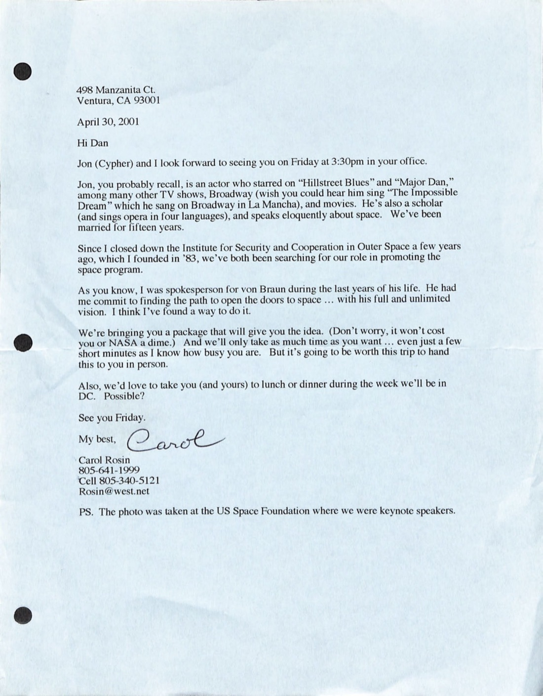
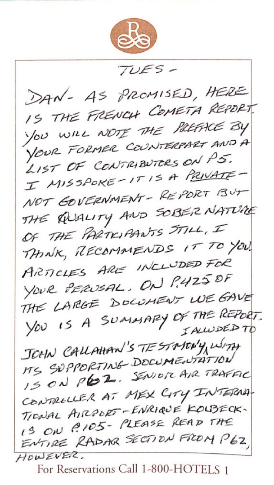
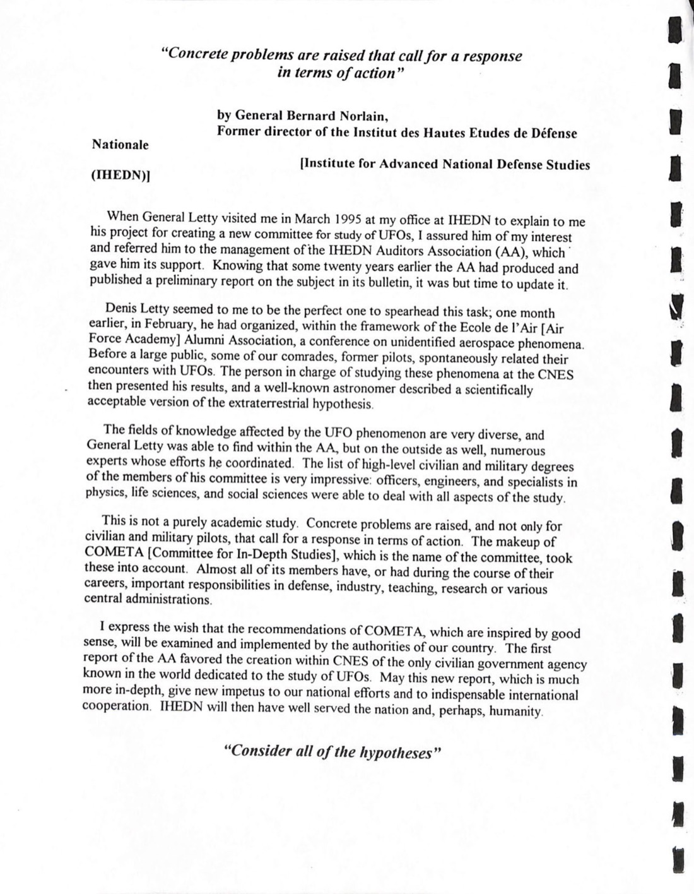
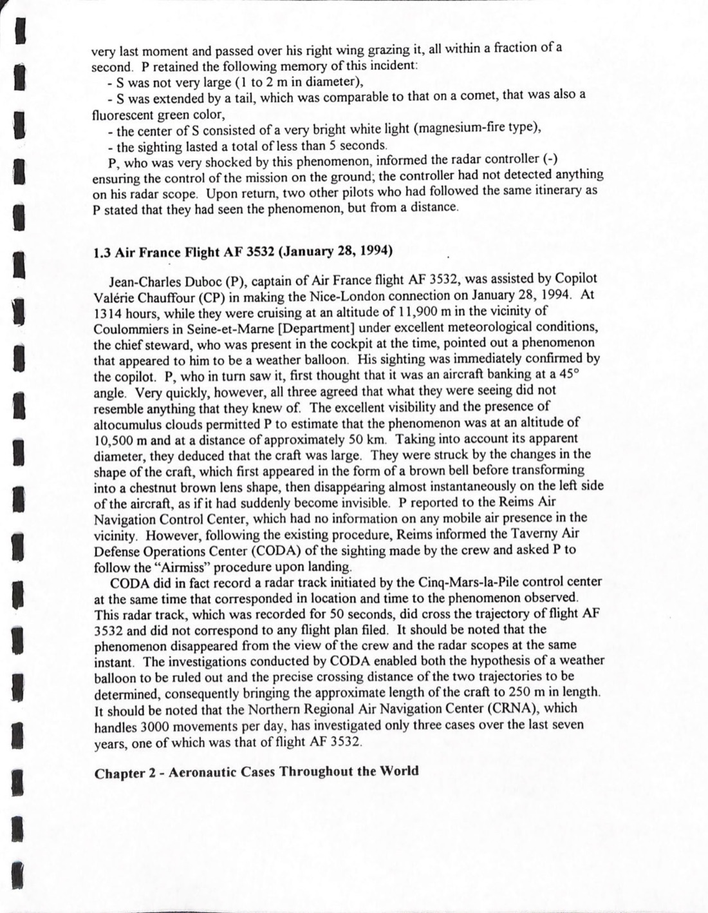
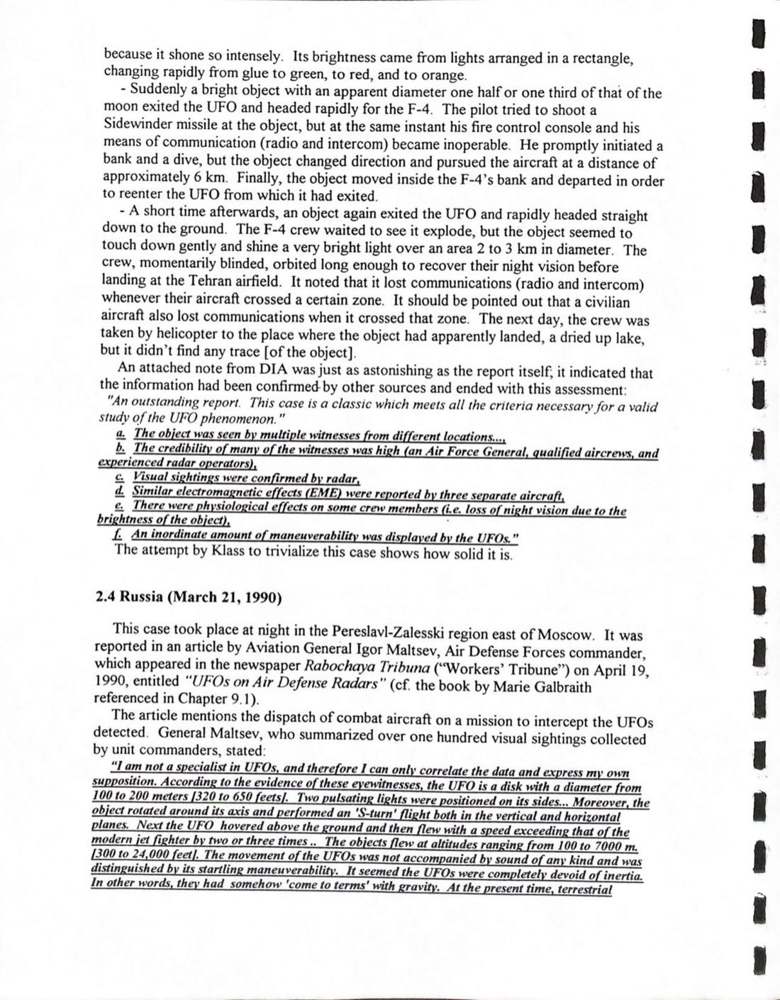
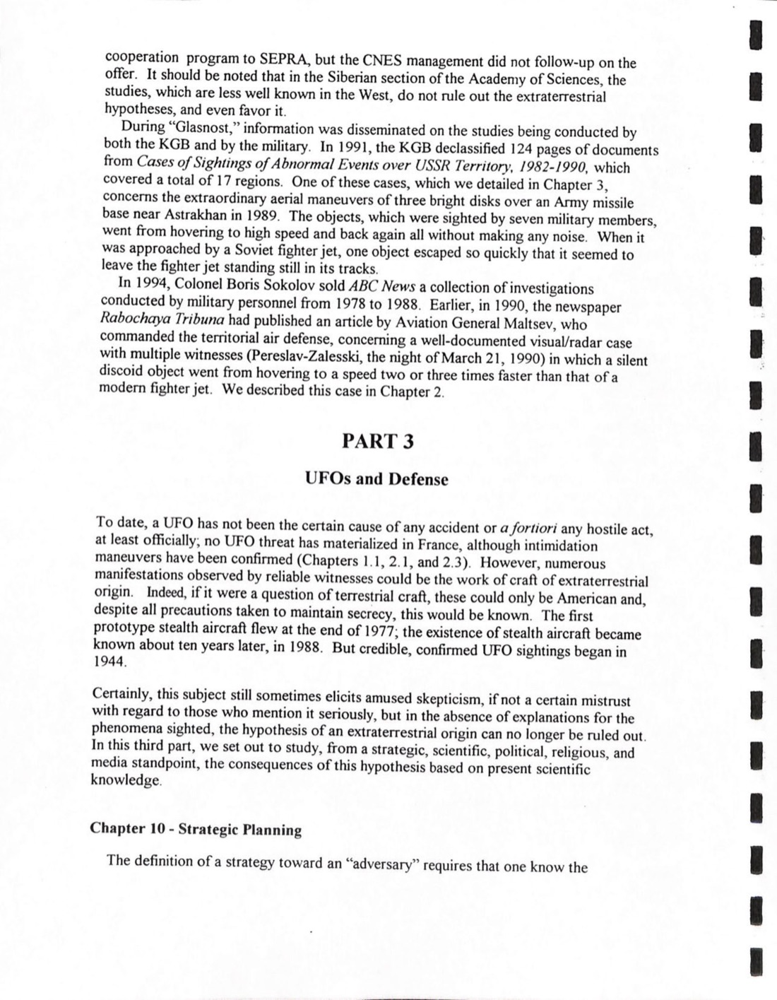
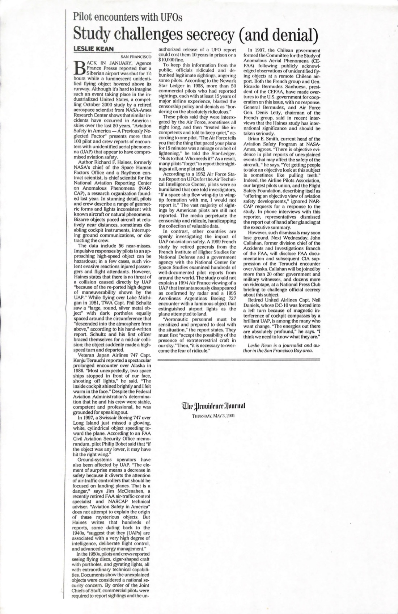

# #019 COMETA 報告 1999 + Carol Rosin → NASA 2001：法國軍方退休將領的 ET 假設研究

| 欄位 | 內容 |
|---|---|
| 檔案編號 | 255_413270_UFO's_and_Defense_What_Should_we_Prepare_For |
| 來源機關 | NASA（收件方）／ COMETA 委員會（法國，作者）／ Carol Rosin（傳遞者）|
| 日期 | 1999-07（COMETA 法文版 VSD 雜誌特刊）／ 2001-04-30（Rosin 致 NASA 的轉送信）|
| 頁數 | 94 頁 |
| 機密層級 | 非機密公開文件（法方）／ NASA 內部收存 |
| 公開日 | 2026-05-08 |

## 為什麼這份檔案重要

1999 年 7 月，法國雜誌《VSD》刊出一份名為「**UFOs and Defense: What Should We Prepare For?**」的獨立報告，作者是 **COMETA**（Comité d'études approfondies，「深度研究委員會」），主席 **Air Force General Denis Letty**（退役法國空軍將領），成員包括退役將軍、Institut des Hautes Études de Défense Nationale（IHEDN，法國最高國防研究院）審計員協會（AA）相關人士、CNES（法國國家太空研究中心）研究員、物理學家、生命科學家、社會科學家。

COMETA 報告以軍方/防衛體系角度系統性分析全球 UFO 案件，結論建議「外星假設」是「最佳解釋」，並建議法國政府以正式政策回應 UFO 現象。報告 1999-07 法文版發行，2000-02 英文翻譯版完成。

**2001-04-30**：Carol Rosin（Wernher von Braun 晚年發言人、1983 年創辦 Institute for Security and Cooperation in Outer Space, ISCOS）親自把英文版 COMETA 報告以及 Leslie Kean 的相關 SF Chronicle 文章一併送到 NASA 高層手中（收件人「Dan」極可能是 1992-2001 NASA 局長 Daniel Goldin）。NASA 收文並歸入 255_413270 檔案。25 年後 2026-05-08 解密公開。

歷史意義：

1. **是 NASA 已解密文件中極少數來自外國軍方背景委員會的完整 ET-hypothesis-friendly 報告**。COMETA 不是 USAF 文件，不是國務院電報，是法國退休將領對 UFO 議題的官方角度公開研究。
2. **報告作者背景的可信度**：General Bernard Norlain（IHEDN 前主任）、General Denis Letty（前法空軍）、Admiral Lacoste（前 DGSE 總監）等。在西方軍方體系中，這個層級的退休將領聯署公開支持 ET 假設極為罕見。
3. **Carol Rosin 與 von Braun 的「false flag alien」線**：Rosin 在轉送信中明確指出她是 von Braun 晚年發言人。von Braun 對 Rosin 預言的「美國未來威脅敘事序列：俄國 → 恐怖主義 → 流氓國家 → 小行星 → 偽造外星威脅」在 1974-77 期間就提出，本檔案以 Rosin 親筆證詞形式進入 NASA 內部檔案系統。
4. **NASA 收存而不行動**：本檔案 2001 進 NASA、2026 解密公開，期間 25 年 NASA 沒有對 COMETA 結論做正式回應。

## 1. Carol Rosin 1999-04-30 致 "Dan" 的轉送信

> 498 Manzanita Ct., Ventura, CA 93001
> April 30, 2001
> Hi Dan,
>
> Jon (Cypher) and I look forward to seeing you on Friday at 3:30pm in your office. Jon, you probably recall, is an actor who starred on "Hillstreet Blues" and "Major Dad," among many other TV shows [...]
>
> Since I closed down the Institute for Security and Cooperation in Outer Space a few years ago, which I founded in '83, we've both been searching for our role in promoting the space program.
>
> As you know, I was spokesperson for von Braun during the last years of his life. He had me commit to finding the path to open the doors to space ... with his full and unlimited vision. I think I've found a way to do it.
>
> We're bringing you a package that will give you the idea. (Don't worry, it won't cost you or NASA a dime.) And we'll only take as much time as you want ... even just a few short minutes as I know how busy you are. But it's going to be worth this trip to hand this to you in person.

> 498 Manzanita Ct., Ventura, CA 93001
> 2001-04-30
> 嗨 Dan，
>
> Jon (Cypher) 和我期待週五下午 3:30 在您辦公室見面。Jon，您可能記得，是個演員，曾主演《警網雙雄》(Hillstreet Blues)、《Major Dad》等多部電視劇 [...]
>
> 自我幾年前關閉 1983 年創辦的太空合作安全研究所（ISCOS）後，我們倆一直在尋找如何促進太空計畫的角色。
>
> 如您所知，我是 Wernher von Braun 晚年的發言人。他要我承諾找出打開太空之門的途徑⋯⋯依照他完整無限的願景。我想我找到了方法。
>
> 我們帶一份包裹來給您（不用擔心，這不會花您或 NASA 一毛錢）。我們只佔用您願意給的時間⋯⋯哪怕只是幾分鐘，因為我知道您很忙。但這次親自送來是值得的。

**「Dan」的身分**：2001-04-30 NASA Administrator 是 **Daniel Goldin**（任職 1992-04 至 2001-11-17）。Goldin 是 NASA 歷史上任期最長的局長，主導「Faster, Better, Cheaper」太空計畫改革。Rosin 的「親自送來」意味她安排了一場 NASA 局長辦公室的會面。

## 2. Rosin 手寫附註：COMETA 報告的隱含意義

手寫附註（部分難辨）：

> FUELS -
>
> Dan, As Promised, Here is the [Famous] COMETA Report you may have [heard of] by your former counterpart and a list of contributors on P. 5.
>
> [I have] spoken with this report but not [in] government, [because of] the early and sober nature of the implications it [recommends].
>
> [Also included] for your perusal, copies of the [larger document we gave you] is a summary of the report... [also included]
>
> [Technical pilots' first-rate documentation], Aerospace Air Traffic [authority]
>
> [Comment] At MPL Cinic [in] Tehran (Iran Airport - Ehrlich Foundation) is on close [reads], please read the Iran/Iraq section from p. 20 however.

(手寫筆跡部分難辨，但要點清楚：)

- 「Dan，依承諾，這是著名的 COMETA 報告，您可能從前任聽說過⋯⋯」
- 「我有跟政府討論過這份報告，但 [強調] 早期且嚴肅性質⋯⋯」
- 「附上 [更大文件] 的副本，作為報告摘要⋯⋯」
- 「請特別讀第 20 頁的伊朗 / Tehran 段落」

關鍵指引：Rosin 把 COMETA 報告 + Tehran 1976 F-4 案件（COMETA 第 20 頁附近）標示給 Goldin 注意。Tehran 案在 UFO 研究界是「五星級」的軍方案件，因為附有 DIA（美國防衛情報局）的「outstanding report. This case is a classic」評語。

## 3. COMETA 報告本文

### 3.1 標題與作者

> UFOs and Defense:
> What Should We Prepare For?
>
> An independent report on UFOs written by the French association COMETA. This report details the results of a study by the Institute of Higher Studies for National Defence.
>
> This paper originally appeared in a special issue of the magazine VSD Published in France in July 1999.

> UFO 與國防：
> 我們應該準備什麼？
>
> 法國協會 COMETA 撰寫的獨立 UFO 報告。本報告詳述國立國防高等研究院（IHEDN）的研究結果。
>
> 本文最初發表於 1999 年 7 月法國 VSD 雜誌特刊。

### 3.2 序言（General Bernard Norlain）

> "Concrete problems are raised that call for a response in terms of action"
>
> by General Bernard Norlain,
> Former director of the Institut des Hautes Études de Défense Nationale [IHEDN]
>
> When General Letty visited me in March 1995 at my office at IHEDN to explain to me his project for creating a new committee for study of UFOs, I assured him of my interest and referred him to the management of the IHEDN Auditors Association (AA), which gave him its support. Knowing that some twenty years earlier the AA had produced and published a preliminary report on the subject in its bulletin, it was but time to update it.
>
> Denis Letty seemed to me to be the perfect one to spearhead this task; one month earlier, in February, he had organized, within the framework of the École de l'Air [Air Force Academy] Alumni Association, a conference on unidentified aerospace phenomena. Before a large public, some of our comrades, former pilots, spontaneously related their encounters with UFOs. The person in charge of studying these phenomena at the CNES then presented his results, and a well-known astronomer described a scientifically acceptable version of the extraterrestrial hypothesis.
>
> [...] The makeup of COMETA [Committee for In-Depth Studies], which is the name of the committee, took these into account. Almost all of its members have, or had during the course of their careers, important responsibilities in defense, industry, teaching, research or various central administrations.

> 「具體問題已被提出，呼籲以行動回應」
>
> 作者：Bernard Norlain 將軍
> 國立國防高等研究院（IHEDN）前主任
>
> 1995 年 3 月 Letty 將軍來 IHEDN 我的辦公室向我說明他要創立新的 UFO 研究委員會的計畫，我向他保證感興趣，並推薦他到 IHEDN 審計員協會（AA）管理層，後者給予支持。考慮到約 20 年前 AA 曾在其通訊中發布過該主題的初步報告，現在正是更新的時候。
>
> Denis Letty 在我看來是領導此任務的完美人選；一個月前的 2 月，他在空軍學校校友會的框架內組織了一場關於不明航太現象的會議。在大量公眾面前，我們的一些同志，前飛行員，自發地講述了他們與 UFO 的遭遇。CNES 內負責研究此現象的人介紹了他的結果，一位知名天文學家描述了一個科學上可接受的外星假設版本。
>
> [...] COMETA（深度研究委員會，委員會的名稱）的組成考慮到這些因素。其幾乎所有成員，要麼當前，要麼在其職業生涯中，都在國防、工業、教學、研究或各種中央行政機構擔任過重要職務。

**COMETA 成員背景**：報告 p-5 列出貢獻者名單，包括：
- General Bernard Norlain（IHEDN 前主任、前法空軍）
- General Denis Letty（前法空軍、COMETA 主席）
- Admiral Marc Merlo
- General Bruno Lemoine（前法空軍）
- General Pierre Lapenne（前法空軍）
- General André Dubrut
- Jean-Jacques Vélasco（GEPAN/SEPRA 主任，CNES 內部 UFO 研究單位）
- 與其他物理學家、社會學家、Andrei Sakharov 級別的科學顧問

這個成員清單在西方軍方體系中是極為罕見的「公開支持 ET 假設研究」的退休將領聯署。

### 3.3 1994-01-28 Air France AF 3532 案

COMETA 報告詳述多起案件，其中 1994-01-28 Air France AF 3532 案：

> Jean-Charles Duboc (P), captain of Air France flight AF 3532, was assisted by Copilot Valérie Chauffour (CP) in making the Nice-London connection on January 28, 1994. At 1314 hours, while they were cruising at an altitude of 11,900 m in the vicinity of Coulommiers in Seine-et-Marne [Department] under excellent meteorological conditions, the chief steward, who was present in the cockpit at the time, pointed out a phenomenon that appeared to him to be a weather balloon. His sighting was immediately confirmed by the copilot. P, who in turn saw it, first thought that it was an aircraft banking at a 45° angle. Very quickly, however, all three agreed that what they were seeing did not resemble anything that they knew of. The excellent visibility and the presence of altocumulus clouds permitted P to estimate that the phenomenon was at an altitude of 10,500 m and at a distance of approximately 50 km. Taking into account its apparent [...]

> Jean-Charles Duboc 機長與副機長 Valérie Chauffour 駕駛 Air France AF 3532 班次（Nice → London），1994-01-28 13:14。當時他們在 Seine-et-Marne 省 Coulommiers 附近 11,900 m 高度巡航，氣象條件極佳。在駕駛艙的座艙長指出一個他認為是氣象氣球的現象，副機長立即確認。機長最初認為是傾斜 45° 的飛機。但三人迅速一致同意他們看到的東西不像任何已知物體。能見度與卷積雲讓機長估計該現象位於 10,500 m 高度、約 50 km 距離。考慮其視角 [...]

Duboc 機長後續成為 COMETA 報告的關鍵證人。法國 GEPAN/SEPRA 對此案做了完整的雷達 + 飛行員口供 + 軌道重建分析，結論物體尺寸數百公尺、無確定解釋。

### 3.4 1976-09-19 Tehran F-4 Phantom 案

COMETA 重述 1976-09-19 Iran F-4 案的工程細節：

> Suddenly a bright object with an apparent diameter one half or one third of that of the moon exited the UFO and headed rapidly for the F-4. The pilot tried to shoot a Sidewinder missile at the object, but at the same instant his fire control console and his means of communication (radio and intercom) became inoperable. He promptly initiated a bank and a dive, but the object changed direction and pursued the aircraft at a distance of approximately 6 km. Finally, the object moved inside the F-4's bank and departed in order to reenter the UFO from which it had exited.
>
> A short time afterwards, an object again exited the UFO and rapidly headed straight down to the ground. The F-4 crew waited to see it explode, but the object seemed to touch down gently and shine a very bright light over an area 2 to 3 km in diameter.
>
> An attached note from DIA was just as astonishing as the report itself, it indicated that the information had been confirmed by other sources and ended with this assessment:
>
> "An outstanding report. This case is a classic which meets all the criteria necessary for a valid study of the UFO phenomenon."

> 突然一個亮物體（視直徑約為月球的 1/2 或 1/3）從 UFO 中射出，迅速朝 F-4 飛來。飛行員嘗試發射 Sidewinder 飛彈，但同時他的火控控制台與通訊（無線電 + intercom）失效。他立即傾斜俯衝，但物體改變方向以約 6 km 距離追擊飛機。最終物體在 F-4 傾斜內部移動並返回母船。
>
> 不久後，另一個物體再次從 UFO 射出並直下地面。F-4 機組等待爆炸，但物體似乎輕柔著陸，並在直徑 2-3 km 的區域照射極亮的光。
>
> DIA 附加的備註與報告本身同樣令人吃驚，指出該訊息已由其他來源確認，並以此評語結束：「outstanding report. This case is a classic which meets all the criteria necessary for a valid study of the UFO phenomenon.」

**1976 Tehran F-4 案件**：Imperial Iranian Air Force F-4 Phantom 戰機 Captain Jafari + Lt General Mohammad Houssain Kavoosi 1976-09-19 凌晨在 Tehran 上空與 UFO 遭遇。F-4 武器系統與通訊 EM 干擾、第二架 F-4 起飛追擊也遭遇相同干擾、物體分裂出小物體在 Mehrabad 機場地面降落。USAF MAAG-Iran（軍援顧問組）將事件報告 DIA（DIA Report 6 894 0139 76）。DIA 給出極罕見的「outstanding case」評語。COMETA 用此案做 ET-hypothesis 的核心物證之一。

### 3.5 法國 Gendarmerie Nationale 系統化資料蒐集

> Since 1974, over 3,000 gendarmerie reports representing an average of three spontaneous testimonies per document have been collected and forwarded to GEPAN/SEPRA. Added to this are some one hundred investigations and interventions in the field, conducted jointly with the local [gendarmerie] forces. All of these have [...]

> 自 1974 年以來，超過 3,000 份國家憲兵隊報告（每份平均 3 個自發證詞）已被收集並轉送 GEPAN/SEPRA。此外還有約 100 次現場調查與介入，與當地憲兵隊聯合執行。所有這些已 [...]

法國 1977 年正式創立 **GEPAN**（Groupe d'Études des Phénomènes Aérospatiaux Non-identifiés，「不明航太現象研究組」），後改名 **SEPRA**（Service d'Expertise des Phénomènes de Rentrée Atmosphérique，「大氣再入現象專業服務」），2005 年再改名 **GEIPAN**。GEPAN/SEPRA/GEIPAN 隸屬 CNES，是世界上唯一持續運轉的官方 UFO 研究單位。本檔案 1999 年的成績單：自 1974 累積 3,000+ 案件，每案平均 3 個獨立證人。

### 3.6 蘇聯 KGB 1991 解密

> In 1991, the KGB declassified 124 pages of documents from Cases of Sightings of Abnormal Events over USSR Territory, 1982-1990, which covered a total of 17 regions. One of these cases, which we detailed in Chapter 3, concerns the extraordinary aerial maneuvers of three bright disks over an Army missile base near Astrakhan in 1989. The objects, which were sighted by seven military members, went from hovering to high speed and back again all without making any noise. When it was approached by a Soviet fighter jet, one object escaped so quickly that it seemed to leave the fighter jet standing still in its tracks.

> 1991 年 KGB 解密 124 頁文件，內容為「1982-1990 蘇聯領土上空異常事件目擊案件」，共覆蓋 17 個地區。其中一案（在第 3 章詳述）涉及 1989 年三個亮圓盤在 Astrakhan 附近陸軍飛彈基地的異常空中機動。物體被 7 名軍方人員目擊，從懸停到高速再回到懸停，全程無聲。當蘇聯戰機接近時，一個物體迅速脫離，使戰機看起來像靜止不動。

COMETA 引用蘇聯 KGB 解密資料作為「ET 假設不是西方獨有觀點」的證據。1989 年 Astrakhan 案是冷戰末期蘇軍對 UAP 反應的重要紀錄。

### 3.7 Leslie Kean 的 SF Chronicle 文章

文末附加 Leslie Kean 2001 年 SF Chronicle 文章「Pilot encounters with UFOs」，引用 Dr. Richard Haines（NASA Ames Research Center 退休航太科學家）2000 年「Aviation Safety in America - A Previously Neglected Factor」研究，含 100+ 件飛行員 UAP 遭遇影響飛安的案件。

Kean 後來於 2010 年出版《UFOs: Generals, Pilots and Government Officials Go on the Record》一書，由 Crown 出版（Penguin Random House 旗下）發行。Kean 2017 年是 New York Times 揭露 AATIP（DoD UAP 計畫）的記者之一。

## 4. COMETA 的政策建議

報告主要建議（COMETA 簡化版）：

1. **承認 UAP 現象的真實性**：不再將之歸為「虛假目擊」或「自然現象」。
2. **建立國際合作框架**：法國應主動推動 UAP 議題的國際科學合作。
3. **資訊解密與公開**：政府應解密相關 UFO 檔案，讓科學社群審查。
4. **嚴肅考慮外星假設**：「the extraterrestrial hypothesis is the best of all the hypotheses」。
5. **強化 GEPAN/SEPRA 資源**：CNES 內部 UFO 研究單位應獲得更多資源。

法國政府對 COMETA 報告的官方回應：未公開。但 1999 年後 GEPAN/SEPRA 持續運轉，2005 年改名 GEIPAN，2007 年起公開所有歷史案件資料庫，至今累積超過 3,200 件案件（其中 100+ 件分類為「D 類 = 即使深入調查仍無法解釋」）。

## 5. 觀察

**(1) NASA 收存而不行動**：Rosin 2001-04-30 親自把 COMETA 報告 + Kean 文章送進 NASA 局長辦公室。NASA 收文歸入 255_413270。25 年期間 NASA 對 COMETA 結論做正式回應的紀錄為零。2022 NASA 啟動的「UAP Independent Study Team」（David Spergel 主持）名義上才是 NASA 對 UAP 議題的首次官方研究。Goldin 時代（1992-2001）NASA 對 UAP 議題的處理態度是「收存、不評論」。

**(2) Rosin 的 von Braun 線**：Rosin 在轉送信中明確強調「I was spokesperson for von Braun during the last years of his life」。von Braun 1974-77 期間對 Rosin 的「美國未來威脅敘事序列」（俄國、恐怖、流氓國家、小行星、外星人）預言在本檔案以親筆證詞形式進入 NASA 內部檔案。雖然信中沒展開細節，但這個身分宣稱本身就是檔案的歷史價值之一。

**(3) COMETA 報告的「將軍聯署」性質**：包括 IHEDN 前主任 Norlain 將軍在內的退役高階軍官公開聯署「ET 假設是最佳解釋」，在西方軍方體系中是極為罕見。同等級的美國 USAF / DoD 退休將領聯署 UAP/ET 議題的紀錄要等到 2020 年代（DeLonge 的 TTSA、Lue Elizondo 的 AATIP 公開等）才出現。

**(4) 1976 Tehran F-4 案的跨文件確認**：COMETA 用此案做 ET 假設物證，引用的是 DIA Report 6 894 0139 76。DIA 自己評語「outstanding case，meets all the criteria necessary for a valid study」。DIA 是 1961 年成立的美軍情報整合機構（高於各軍種 G-2 / A-2），其「outstanding」評語在美軍 UFO 案件處理中極為罕見。

**(5) GEPAN/SEPRA/GEIPAN 是世界唯一持續運轉的官方 UFO 研究單位**：法國 1977 年至今未中斷的 UAP 研究機制與美國 Project Blue Book 1969 年結束、AATIP 2007-12 短暫運轉、AARO 2022 年才正式重啟形成強烈對比。COMETA 報告的存在本身就是 50 年期間法國對 UAP 議題持續制度化的證據。

## 6. 跨檔案連結

- **[#029 白宮 Space Council 1963 Hunter](../029-59_214434_sp_16_1963_alien_race/report.md)**：本檔案的 36 年後續。Hunter 1963 在白宮內部寫的「ET 接觸政策」備忘是西方政府極少數從政策角度討論 ET 的文件；COMETA 1999 是西方第一次以軍方退休將領聯署形式公開支持 ET 假設研究。
- **[#152 State Department UAP Cable 2, Kazakhstan, 1994-01-31](https://www.war.gov/UFO/#State%20Department%20UAP%20Cable%202,%20Kazakhstan,%20January%2031,%201994)**：本檔案 Air France AF 3532 案發生於 1994-01-28，三天後（1994-01-31）國務院 Kazakhstan UAP 電報。兩案是否同物體軌跡需另查。
- **[#017 AMC flying disc 1947 / Project Sign 起源公文鏈](../017-18_100754_general_1946-7_vol_2/report.md)**：本檔案 Norlain 將軍序言「Concrete problems are raised that call for a response in terms of action」與 Twining 1947-09 信「the phenomenon is something real and not visionary or fictitious」屬於同類「軍方內部承認現象真實 + 呼籲正式研究」立場，相隔 52 年。

## 7. 來源

- 原始檔案：[U.S. Department of War — 255_413270_UFO's_and_Defense_What_Should_we_Prepare_For](https://www.war.gov/UFO/#255_413270_UFO%27s_and_Defense_What_Should_we_Prepare_For)
- PDF 直接下載：`https://www.war.gov/medialink/ufo/release_1/255_413270_ufo's_and_defense_what_should_we_prepare_for.pdf`
- 公開日：2026-05-08
- 94 頁，內容包含 Carol Rosin 2001 轉送信 + COMETA 1999 報告英譯版 + Leslie Kean 2001 SF Chronicle 文章 + 附錄
