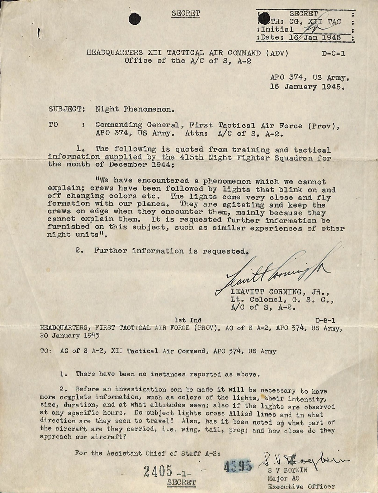
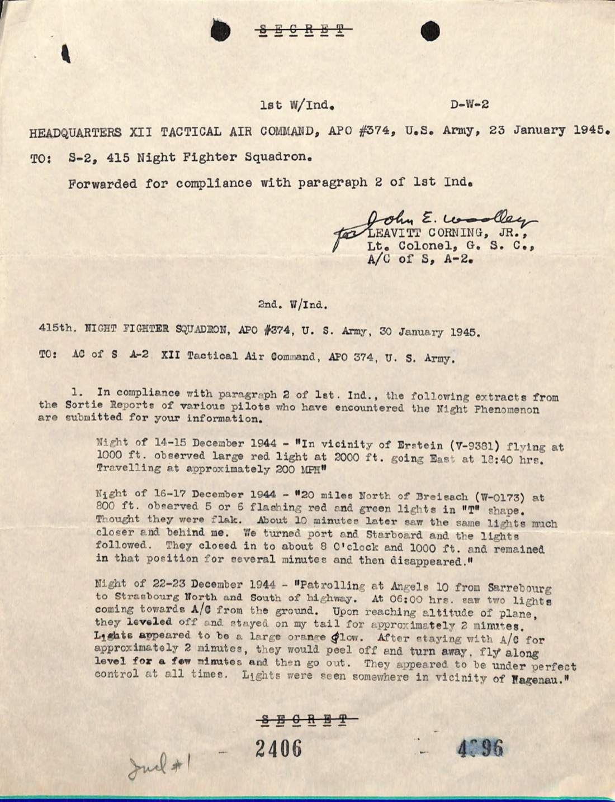
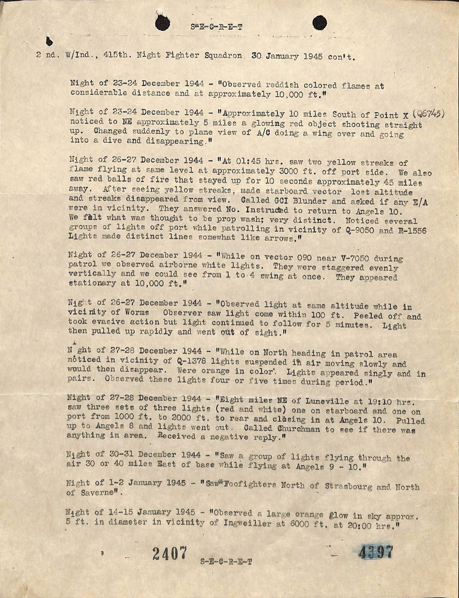
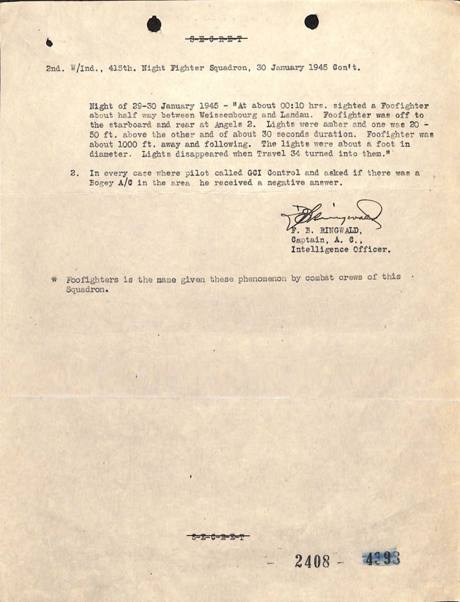
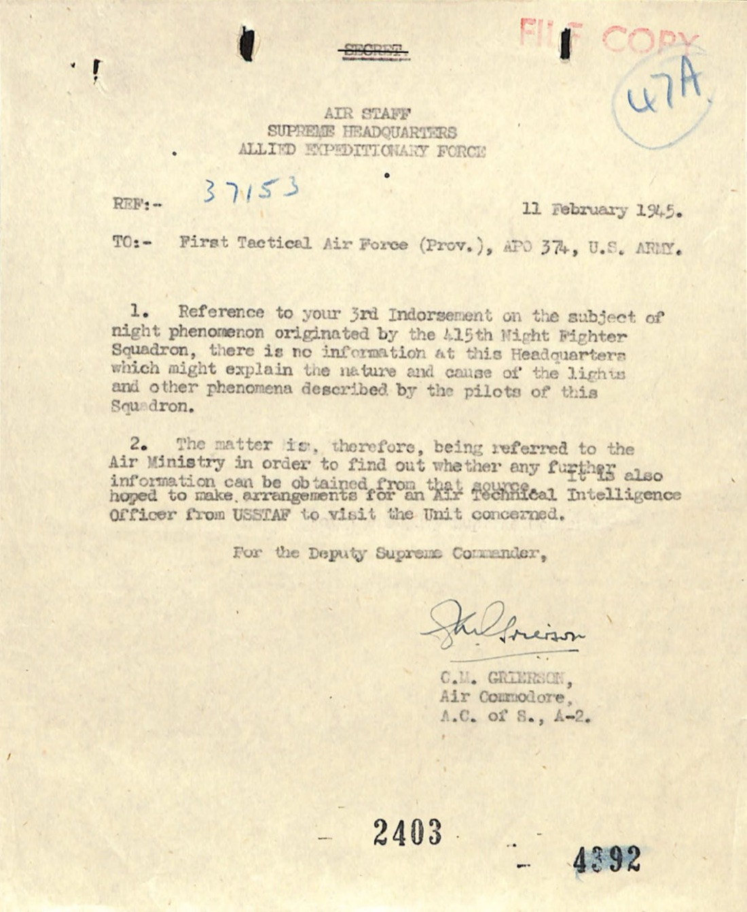
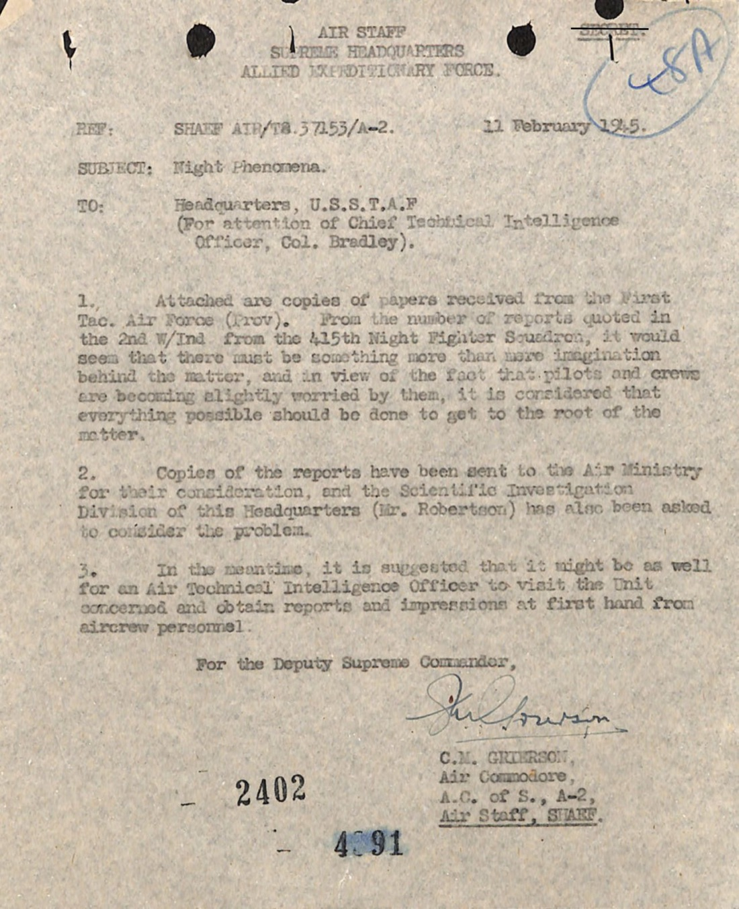
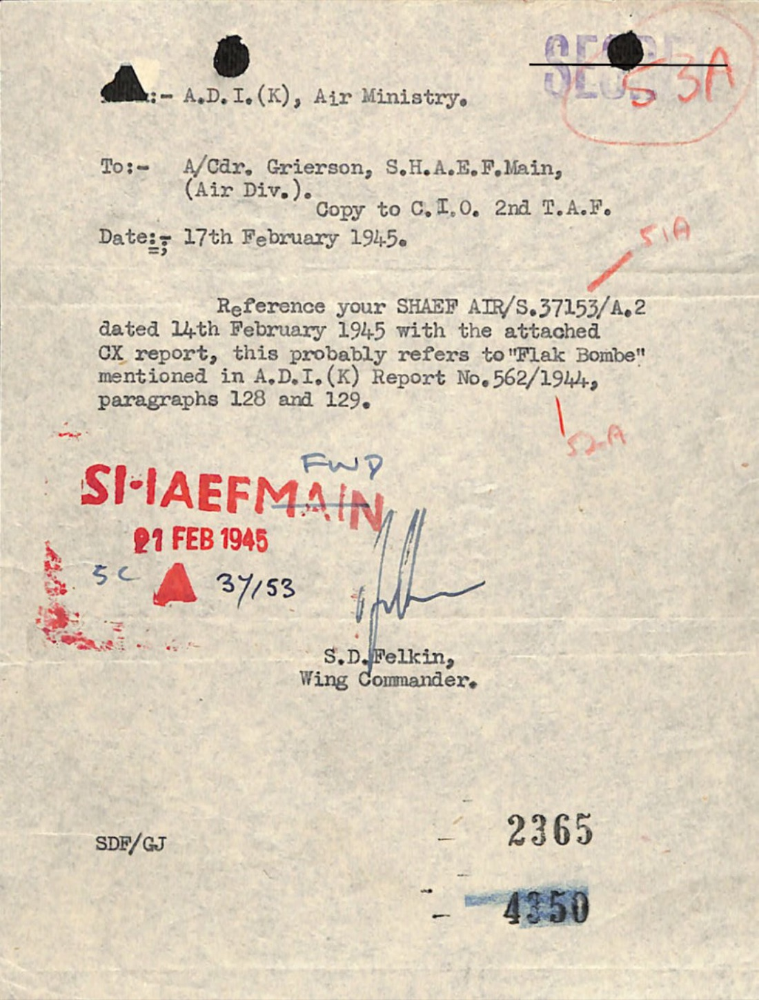
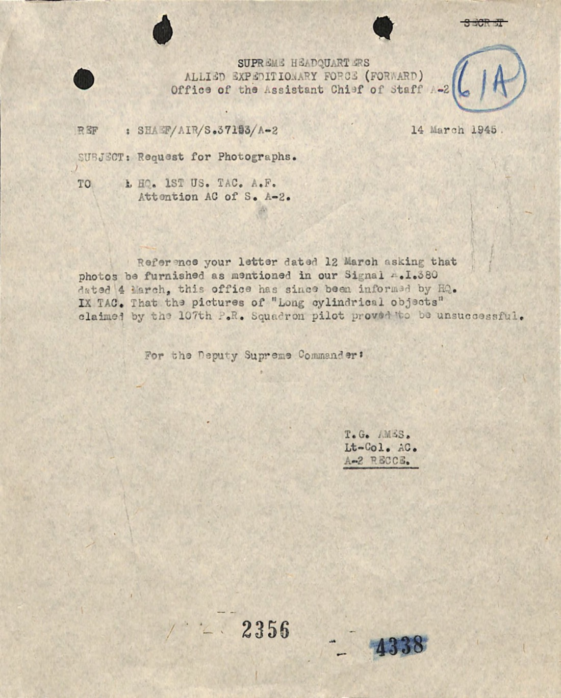
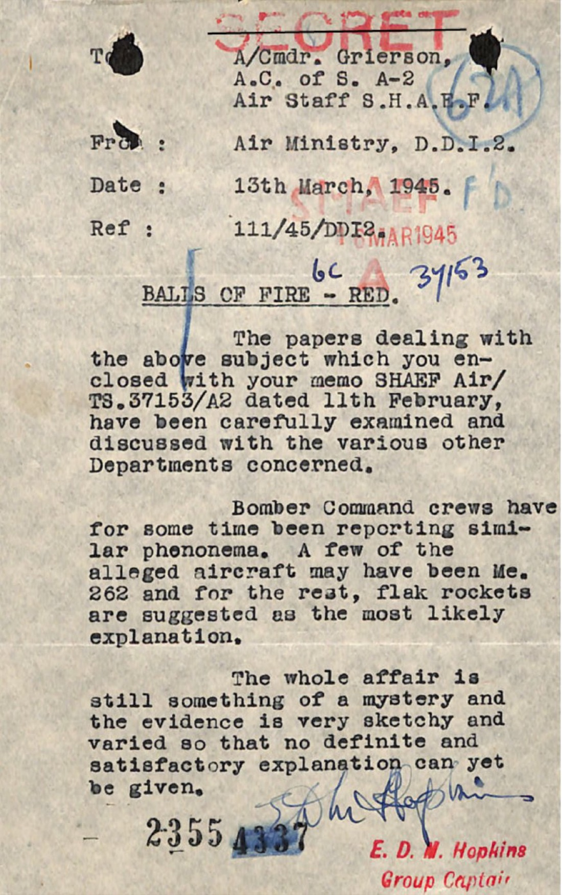
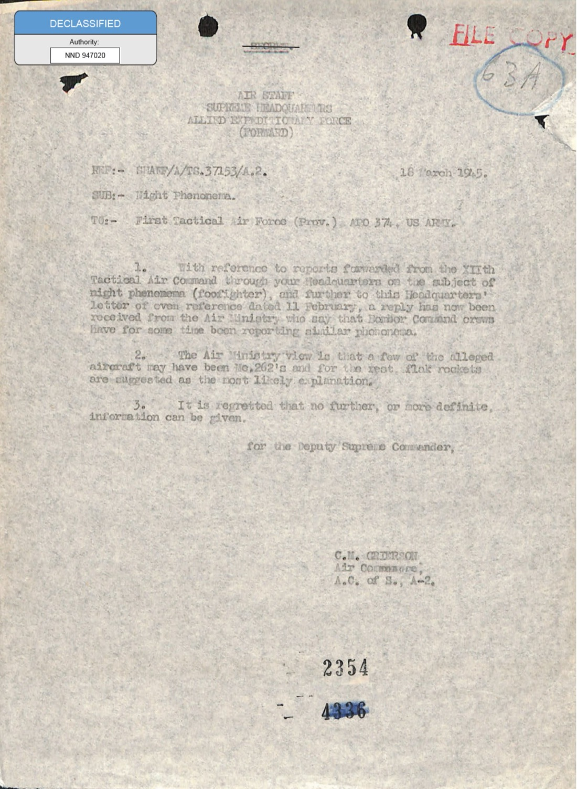

# #022 SHAEF 1944-12 → 1945-03 foofighters：415th 夜間戰鬥機中隊與「flak rocket」假設

| 項目 | 內容 |
|---|---|
| 機關 | 美國陸軍 + 盟軍最高司令部（SHAEF）+ 英國空軍部 |
| 檔名 | `331_120752_Numeric_Files_1944–1945_37153_German_Armament_Equipment_Documents.pdf` |
| 頁數 | 17 頁 |
| 時間 | 1944-12-14 → 1945-03-18 |
| 地點 | 法國亞爾薩斯（Strasbourg、Saverne、Luneville、Erstein、Breisach、Worms、Weissembourg、Landau、Ingweiller） |
| 分級 | SECRET |
| 官方 portal | <https://www.war.gov/UFO/#331_120752_Numeric_Files_1944%E2%80%931945_37153_German_Armament_Equipment_Documents> |

## 為什麼這份檔案重要

FBI 62-HQ-83894 卷宗從 1947-06 Kenneth Arnold 案開始，但「天上有不明物體跟著飛機」這個現象，比 Arnold 早兩年半。

1944 年 12 月，美國陸軍第 415 夜間戰鬥機中隊 (415th Night Fighter Squadron, 415th NFS) 在亞爾薩斯北部上空執行夜間巡邏時，把跟飛的彩色燈光寫進當月訓練報告。隔月 (1945-01) 軍方走完整套官僚程序：XII Tactical Air Command (XII TAC) A-2 情報官 Leavitt Corning Jr. 中校簽發 D-C-1 號公文，First Tactical Air Force (Prov.) 沿線上呈，最後送進盟軍最高司令部 SHAEF Air/S.37153/A.2 案號，再轉到倫敦空軍部 D.D.I.2。

這份卷宗就是這條公文鏈的全部紙本：13 則 415th NFS 飛行員 sortie 摘要、3 月空軍部回覆「Me 262 加 flak rocket，全案還是個謎」、IX TAC 67th Tactical Reconnaissance Group 拍到「12 呎鋁色雪茄形物體」但底片沖洗失敗的紀錄。

「foofighters」這個名詞，就在這份檔案的最後一頁有官方腳註：「Foofighter 是這個中隊作戰機組為這種現象取的名字。」

## §1 415th NFS 1944-12 訓練報告：「a phenomenon which we cannot explain」

公文鏈的最上游，是 415th NFS 自己 1944-12 月份提交的訓練與戰術資訊裡的一段話。XII TAC 的 Corning 中校 1945-01-16 把它原文引述上呈：

> "We have encountered a phenomenon which we cannot explain; crews have been followed by lights that blink on and off changing colors etc. The lights come very close and fly formation with our planes. They are agitating and keep the crews on edge when they encounter them, mainly because they cannot explain them. It is requested further information be furnished on this subject, such as similar experiences of other night units."
>
> 「我們遇到一種我們無法解釋的現象。機組員被一些一閃一閃、會變色的燈追著。這些燈會貼得很近，跟我們的飛機編隊飛行。它們令人心煩，遇到的時候讓機組員緊繃，主要是因為機組員無法解釋它們。我們請求提供進一步資訊，例如其他夜間單位是否有類似經驗。」

注意四件事：
- **不是個案，是「現象」**。中隊已經累積到把它寫成集體經驗。
- **彩色 + 一閃一閃 + 編隊跟飛**：這三項就是後續所有 sortie 摘要的關鍵詞。
- **agitating + on edge**：軍方文件用情緒詞描述機組員狀態。
- **主動要求其他單位回報**：這份報告是 1944-12 月，而 RAF Bomber Command 1944 年同時期也在報告類似現象（後文 1945-03 空軍部回信會證實）。

## §2 1945-01-20 First TAF 的標準制式回覆

接到 415th NFS 的引述後，XII TAC 1945-01-16 上呈第一級指揮部。1945-01-20 First Tactical Air Force (Prov.) 的執行軍官 Boykin 少校回覆，內容是飛碟調查的早期模板：

> "1. There have been no instances reported as above. 2. Before an investigation can be made it will be necessary to have more complete information, such as colors of the lights, their intensity, size, duration, and at what altitudes seen; also if the lights are observed at any specific hours. Do subject lights cross Allied lines and in what direction are they seen to travel? Also, has it been noted of what part of the aircraft are they carried, i.e. wing, tail, prop; and how close do they approach our aircraft?"
>
> 「一、無上述案件回報。二、進行調查前必須取得更完整資訊，包括燈光的顏色、強度、大小、持續時間、所見高度，以及燈光是否在特定時段出現。所述燈光是否越過盟軍戰線？往哪個方向移動？另已注意觀察燈光出現在飛機哪個部位，例如機翼、尾翼、螺旋槳，以及距離我機多近？」

這套「請補資料」清單在 1947 後 FBI 與 Air Force 之間的飛碟通信會反覆出現。差別是這裡發信人是真的想知道、而不是要把案子送出去（後者要到 1948 SIGN→GRUDGE 之後才會出現，見 [#004 Section 4 報告](../004-65_hs1-834228961_62-hq-83894_section_4/report.md)）。

## §3 1945-01-30 415th NFS 情報官的 13 則 sortie 摘要

回覆 First TAF 補資料要求的，是 415th NFS 自己的情報官（簽名是 Captain, A.C., Intelligence Officer，名字模糊）。他從 12-1 月的飛行員 sortie report 中抽出 13 條，按夜次排列。完整呈現：

> Night of 14-15 December 1944：In vicinity of Erstein (V-9381) flying at 1000 ft. observed large red light at 2000 ft. going East at 18:40 hrs. Travelling at approximately 200 MPH
>
> 1944-12-14/15 夜：在 Erstein (V-9381) 上空 1000 英尺飛行，於 18:40 觀察到一個大紅燈在 2000 英尺往東移動。時速約 200 英里。

> Night of 16-17 December 1944：20 miles North of Breisach (W-O173) at 800 ft. observed 5 or 6 flashing red and green lights in "T" shape. Thought they were flak. About 10 minutes later saw the same lights much closer and behind me. We turned port and starboard and the lights followed. They closed in to about 8 O'clock and 1000 ft. and remained in that position for several minutes and then disappeared.
>
> 1944-12-16/17 夜：在 Breisach (W-O173) 以北 20 英里、高度 800 英尺，觀察到 5 或 6 個閃爍的紅綠燈呈 T 字形。原以為是高射砲火。約 10 分鐘後再次看見同樣的燈，距離拉近且位於後方。我機左右閃避，燈跟著轉。它們收進到大約 8 點鐘方向、距離 1000 英尺，停留數分鐘後消失。

> Night of 22-23 December 1944：Patrolling at Angels 10 from Sarrebourg to Strasbourg North and South of highway. At 06:00 hrs. saw two lights coming towards A/C from the ground. Upon reaching altitude of plane, they leveled off and stayed on my tail for approximately 2 minutes. Lights appeared to be a large orange glow. After staying with A/C for approximately 2 minutes, they would peel off and turn away, fly along level for a few minutes and then go out. They appeared to be under perfect control at all times. Lights were seen somewhere in vicinity of Hagenau.
>
> 1944-12-22/23 夜：在 Sarrebourg 至 Strasbourg 之間公路南北兩側 10,000 英尺巡邏。06:00 看見兩個燈從地面朝本機接近。抵達本機高度後，它們轉平飛、跟在我機尾後約 2 分鐘。燈呈現大團橘色光輝。跟隨本機約 2 分鐘後，它們會脫離轉開、平飛數分鐘後熄滅。整個過程它們看起來都在完全控制之下。燈出現於 Hagenau 附近。

> Night of 26-27 December 1944：On vector 090 near V-7060 during patrol we observed airborne white lights. They were staggered evenly vertically and we could see from 1 to 4 swing at once. They appeared stationary at 10,000 ft.
>
> 1944-12-26/27 夜：在 V-7060 附近以方位角 090 巡邏，觀察到空中白色燈光，垂直方向均勻分布，一次可看到 1 至 4 個一起擺動。它們在 10,000 英尺看似靜止。

> Night of 26-27 December 1944：Observed light at same altitude while in vicinity of Worms. Observer saw light come within 100 ft. Peeled off and took evasive action but light continued to follow for 5 minutes. Light then pulled up rapidly and went out of sight.
>
> 1944-12-26/27 夜（另一架）：於 Worms 附近觀察到同高度的燈。觀察員看到燈接近至 100 英尺以內。本機脫離並採取規避動作，但燈持續跟隨 5 分鐘。隨後燈快速拉高、消失於視野。

> Night of 27-28 December 1944：Eight miles NE of Luneville at 19:10 hrs. saw three sets of three lights (red and white) one on starboard and one on port from 1000 ft. to 2000 ft. to rear and closing in at Angels 10. Pulled up to Angels 6 and lights went out. Called Churchman to see if there was anything in area. Received a negative reply.
>
> 1944-12-27/28 夜：在 Luneville 東北 8 英里 19:10 看見三組三盞燈（紅與白），一組在右舷一組在左舷，從 1000 英尺到 2000 英尺、在後方逐漸逼近 10,000 英尺。本機拉升到 6,000 英尺，燈熄滅。呼叫 Churchman 詢問該區是否有他機，回覆為無。

> Night of 1-2 January 1945：Saw "Foofighters" North of Strasbourg and North of Saverne.
>
> 1945-01-01/02 夜：在 Strasbourg 以北與 Saverne 以北看見「Foofighters」。

> Night of 14-15 January 1945：Observed a large orange glow in sky approx. 5 ft. in diameter in vicinity of Ingweiller at 6000 ft. at 20:00 hrs.
>
> 1945-01-14/15 夜：在 Ingweiller 附近 6000 英尺、20:00 觀察到天空一個大型橘色光球，直徑約 5 英尺。

> Night of 29-30 January 1945：At about 00:10 hrs. sighted a Foofighter about half way between Weissembourg and Landau. Foofighter was off to the starboard and rear at Angels 2. Lights were amber and one was 20-30 ft. above the other and of about 30 seconds duration. Foofighter was about 1000 ft. away and following. The lights were about a foot in diameter. Lights disappeared when Travel 34 turned into them.
>
> 1945-01-29/30 夜：約 00:10 在 Weissembourg 與 Landau 之間中間點看見一個 Foofighter。Foofighter 位於右後方 2,000 英尺高度。燈呈琥珀色，一盞在另一盞上方 20-30 英尺處，持續約 30 秒。Foofighter 距離約 1000 英尺、跟隨在後。燈直徑約 1 英尺。當 Travel 34（呼號）轉向它們時，燈消失。

報告結尾，415th NFS 情報官在腳註明確定義這個名詞：

> "Foofighters is the name given these phenomenon by combat crews of this Squadron."
>
> 「Foofighters 是本中隊作戰機組為這種現象所取的名字。」

並補上一句：

> "In every case where pilot called GCI Control and asked if there was a Bogey A/C in the area he received a negative answer."
>
> 「飛行員每次呼叫 GCI 地面管制站詢問該區是否有未識別機，得到的答覆都是無。」

GCI (Ground-Controlled Interception) 是夜間戰鬥機唯一的雷達依靠。GCI 全部回報沒有 bogey，這條對應的是「不是友軍機，也不是被雷達看到的敵機」。

## §4 1945-02 SHAEF 把案子推到 RAF 空軍部

1945-02-12 SHAEF Air Staff 給 First TAF 回覆（簽署 Air Commodore, A.C. of S., A-2）：

> "There is no information at this Headquarters which might explain the nature and cause of the lights and other phenomena described by the pilots of this Squadron. The matter is, therefore, being referred to the Air Ministry in order to find out whether any further information can be obtained from that source. The Air Ministry has also been requested to provide an Air Technical Intelligence Officer from USSTAF to visit the Unit concerned."
>
> 「本部對該中隊飛行員所描述的燈光與其他現象，無資訊可解釋其性質與原因。本案因此轉交空軍部，以查明是否能從該來源獲得進一步資訊。已請空軍部安排美國戰略空軍 USSTAF 的一名航空技術情報官前往該單位實地了解。」

附信另有一段值得記：

> "It would seem that there must be something more than mere imagination behind the matter, and in view of the fact that pilots and crews are becoming slightly worried by them, it is considered that everything possible should be done to get to the root of the matter."
>
> 「此事背後似乎不僅僅只是想像，鑑於飛行員與機組員開始感到些許擔心，本部認為應盡一切可能查明根源。」

「something more than mere imagination」（不僅僅只是想像）這句話來自 SHAEF Air Staff，不是民間調查者，分量很重。

## §5 1945-02-17 空軍部 A.D.I.(K) 的「Flak Bombe」回信

RAF Air Ministry 的 A.D.I.(K)（敵國裝備技術情報組）1945-02-17 給 SHAEF Main Air Div. 的 A/Cdr. Grierson 回覆 (副本送 2nd TAF)：

> "Reference your SHAEF AIR/S.37153/A.2 dated 14th February 1945 with the attached OX report, this probably refers to 'Flak Bombe' mentioned in A.D.I.(K) Report No. 562/1944, paragraphs 128 and 129."
>
> 「關於貴部 1945-02-14 SHAEF AIR/S.37153/A.2 文件及所附 OX 報告，本案可能是 A.D.I.(K) 報告 No. 562/1944 第 128 與 129 段所述的『Flak Bombe』。」

「Flak Bombe」在當時是空軍部對德國高射砲與所謂遙控防空火箭的統稱。這份卷宗只引用報告編號，沒有附正文，但根據後文 3 月空軍部 D.D.I.2 給 Grierson 的回信，可以推斷 A.D.I.(K) 認為這是德軍新型反空中武器。

## §6 1945-03-01 IX TAC 67th TAC/R 的「12 呎鋁色雪茄」與失敗的底片

1945-03-02 IX TAC 訊息 AI-329 給 Air Staff SHAEF Forward，內容是 1945-03-01 67 Tactical Reconnaissance Group 第 107 中隊一位飛行員的目擊：

> "An aluminum colored cigar shaped object came about 12 feet long and 1 foot in diameter was observed floating in the air at 5,000 ft. It appeared to be vertically suspended with small fins and a mast projecting from the lower end. The object attacked and partially deflated; a red flame resulted without smoke. The cylinder did not disintegrate. Photo taken by 107 SQ of 67 TAC/R Group at 011030 vic F-5710."
>
> 「一個鋁色雪茄形物體，長約 12 英尺、直徑 1 英尺，在 5,000 英尺高度浮於空中。看起來垂直懸吊，下端有小尾翼與一根桿狀凸出。本機開火攻擊，物體部分洩氣，產生紅色無煙火焰。圓柱體未解體。1945-03-01 10:30 在座標 F-5710 由 67 TAC/R Group 第 107 中隊拍下照片。」

兩個技術細節值得停一下：
- **12 呎 × 1 呎、垂直懸吊、有桿狀凸出**：這個外型描述後來在 1947-09 Newfoundland Harmon Field 案的 Kodachrome 照片（[#009 Serial 130 報告](../009-65_hs1-834228961_62-hq-83894_serial_130/report.md)）再次出現，描述完全不同的目擊者用了類似的詞彙。
- **被攻擊後「partially deflated」**：用「洩氣」這個動詞描述固體物體很罕見。這暗示報告人原本以為它是某種充氣物，但又「red flame without smoke」「did not disintegrate」（紅焰、無煙、不解體）這三項又不像氣球。

SHAEF Air Staff 1945-03-12 主動發信給 187th US TAC AAF 要求底片。1945-03-14 回信：

> "The pictures of 'Long cylindrical objects' claimed by the 107th R.R. Squadron pilot proved to be unsuccessful."
>
> 「107 偵察中隊飛行員聲稱拍到的『長圓柱形物體』照片，沖洗結果失敗。」

於 SHAEF 而言這是第二次失敗：先是 1945-01 第 415 中隊的口頭描述無法佐證，這次連底片都沒洗出來。

## §7 1945-03-15 空軍部 D.D.I.2 的最終回信：「whole affair is still something of a mystery」

1945-03-15 RAF Air Ministry D.D.I.2 的 Group Captain E. F. Hopkins 給 SHAEF Main 的 A/Cdr. Grierson 寫定案信。標題寫的是「BALLS OF FIRE - RED」（紅色火球）。

> "The papers dealing with the above subject which you enclosed with your memo SHAEF Air/T3.57155/A2 dated 11th February, have been carefully examined and discussed with the various other Departments concerned. Bomber Command crews have for some time been reporting similar phenomena. A few of the alleged aircraft may have been Me. 262 and for the rest, flak rockets are suggested as the most likely explanation. The whole affair is still something of a mystery and the evidence is very sketchy and varied so that no definite and satisfactory information can yet be given."
>
> 「您 1945-02-11 SHAEF Air/T3.57155/A2 備忘錄所附本案文件，已仔細審查並與相關各部門討論。Bomber Command 機組員一段時間以來持續回報類似現象。其中少數所稱的飛行器可能是 Me. 262 噴射機，其餘則以高射砲火箭為最可能的解釋。但整起事件仍是個謎，證據非常零散與多樣，目前無法提供明確且令人滿意的資訊。」

注意兩件事：
- **RAF Bomber Command 同時期也在回報**。415th NFS 不是孤例。
- **Me 262 + flak rockets 假設**。Me 262 是德國世界上第一架實戰噴射戰機，1944-04 首批服役。Flak rocket 指地面發射的遙控火箭。但 Hopkins 自己承認「whole affair is still something of a mystery」（整起事件仍是個謎）。

1945-03-18 SHAEF Air Staff 把空軍部回信轉發 First TAF，正式結案：

> "It is regretted that no further or more definite information can be given."
>
> 「很遺憾，本部無法提供進一步或更明確的資訊。」

## §8 公文鏈時間軸

| 日期 | 單位 | 案號／檔次 | 內容 |
|---|---|---|---|
| 1944-12 月份 | 415th NFS | 訓練與戰術資訊 | 集體承認「a phenomenon which we cannot explain」 |
| 1945-01-16 | XII TAC, A-2 | D-C-1 | Corning 中校發起 Night Phenomenon 調查 |
| 1945-01-20 | First TAF (Prov.) | 1st Ind. | Boykin 少校要求補完整資料（顏色、強度、大小、高度） |
| 1945-01-25 | XII TAC | 1st W/Ind. | 轉發給 415th NFS S-2 補資料 |
| 1945-01-30 | 415th NFS | 2nd W/Ind. | 情報官提交 13 則 sortie 摘要、明確定義 foofighters |
| 1945-02-04 | XII TAC (ADV) | 2nd Ind. | 轉呈 First TAF |
| 1945-02-05 | First TAF (Prov.) | 3rd Ind. | 轉呈 SHAEF Air Staff，承認「further investigation is warranted」 |
| 1945-02-12 | SHAEF Air Staff | SHAEF AIR/S.37153/A-2 | 轉案空軍部，並承認「something more than mere imagination」 |
| 1945-02-14 | SHAEF | AIR/S.37153/A.2 | 與 OX 報告一同送倫敦 |
| 1945-02-17 | RAF Air Ministry A.D.I.(K) | (無案號) | 回覆「probably Flak Bombe per A.D.I.(K) 562/1944 §128-129」 |
| 1945-03-01 | 67 TAC/R / 107 SQ | (無案號) | 12 呎鋁色雪茄目擊，攻擊後部分洩氣 |
| 1945-03-02 | HQ IX TAC | AI-329 | 訊號上呈 SHAEF Air Staff Forward |
| 1945-03-05 | HQ IX TAC | (無案號) | 信號回覆 D.D.I.2 詢問 |
| 1945-03-12 | SHAEF | (無案號) | 要求 187 US TAC AAF 提供底片 |
| 1945-03-14 | HQ IX TAC | 951102A | 回覆「pictures proved to be unsuccessful」 |
| 1945-03-15 | RAF Air Ministry D.D.I.2 | 111/45/DDI2 | G/C Hopkins 結案信：Me 262 + flak rocket，但仍是謎 |
| 1945-03-18 | SHAEF | AIR/S.37153/A.2 | 轉發空軍部結案信給 First TAF |

## §9 觀察

**415th NFS 不是想像或誇張，是有制度紀律的紀錄**。13 則 sortie 摘要每一則都附座標、高度、時間、呼叫 GCI 確認過無 bogey，全部走過正式 sortie report 程序。情報官在腳註明確定義 foofighters 是「機組員為這種現象取的名字」（命名與正式裝備區分），這是嚴謹的態度。

**SHAEF 內部不認為這是想像**。1945-02-12 信件明說「something more than mere imagination behind the matter」（不僅只是想像），並要求 USSTAF 派 Air Technical Intelligence Officer 實地訪談機組員。這個建議在 1945 年的時間壓力下沒有執行。

**RAF 的「Me 262 + flak rocket」假設有技術問題**。Me 262 是戰機，速度 870 km/h（一倍超過 P-61 黑寡婦夜戰機）。但 415th NFS 多次描述「停留」「跟隨數分鐘」「上升消失」「在後方收進到 8 點鐘方向 1000 英尺」這些低速行為，與 Me 262 飛行特性不符。Flak rocket 假設則無法解釋「拉升消失」「分組編隊」「跟著飛機轉彎」。

**67 TAC/R 的「12 呎鋁色雪茄」是另一條獨立線**。1945-03-01 IX TAC 案不在 415th NFS 的 13 則摘要裡，地點、單位、外型描述都不同（日間目擊、垂直懸吊、被攻擊後部分洩氣）。但 SHAEF 把兩條線視為同一案處理。這是後續 1947+ UFO 調查的雛形：把「不明飛行物」當成一個大類，不細分。

**Hopkins 結案信為什麼分量重**。Group Captain E. F. Hopkins 是 RAF D.D.I.2（敵國技術情報副總監），1945 年負責所有德國武器情報的解讀。他結案時用「whole affair is still something of a mystery」、「evidence is very sketchy and varied」、「no definite and satisfactory information can yet be given」，意思是 RAF 在 1944-45 年根本沒有掌握 foofighters 是什麼。

**1945-03-18 之後**。SHAEF 沒有再對 415th NFS 案發文。但兩年後 1947-06 Arnold 案爆發時，FBI 與空軍同樣經歷了「報告堆積 → 要求補資料 → 套用既有解釋（這次是俄國武器）→ 仍是謎」的同一條公文路徑（見 [#002 Section 2 報告](../002-65_hs1-834228961_62-hq-83894_section_2/report.md)）。差別是 1945 年的解釋是「Me 262 + flak rocket」、1947 年的解釋是「俄國秘密武器」（見 [#004 Section 4 報告](../004-65_hs1-834228961_62-hq-83894_section_4/report.md) Gasser 案）。

## 交叉連結

- [#002 Section 2 報告](../002-65_hs1-834228961_62-hq-83894_section_2/report.md)：1947-06 Arnold 案後 FBI 接到的早期通報，同樣的「閃光、追飛、無法解釋」措辭
- [#004 Section 4 報告](../004-65_hs1-834228961_62-hq-83894_section_4/report.md)：1948-07 SIGN 設立、Gasser 提出「俄國飛彈」假設，與 1945 Hopkins「flak rocket」假設同構
- [#009 Serial 130 報告](../009-65_hs1-834228961_62-hq-83894_serial_130/report.md)：1947-08 Newfoundland Harmon Field 案的 Kodachrome 拍到「圓柱／雪茄形」物體，與 1945-03-01 67 TAC/R 目擊外型相似

## 來源

- 官方 portal: <https://www.war.gov/UFO/#331_120752_Numeric_Files_1944%E2%80%931945_37153_German_Armament_Equipment_Documents>
- 17 頁完整 PDF 來自 US Department of War 2026-05-08 解密釋出
