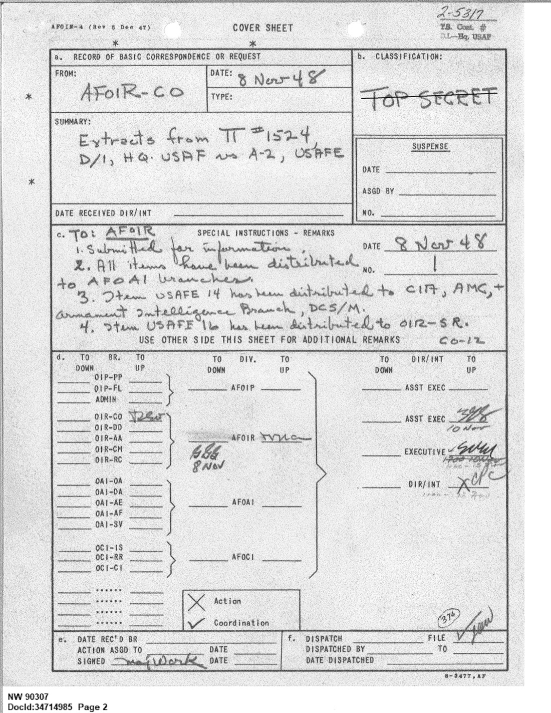
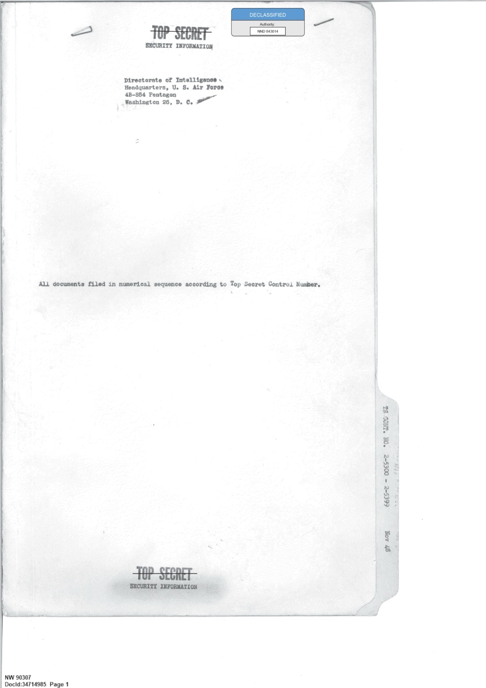
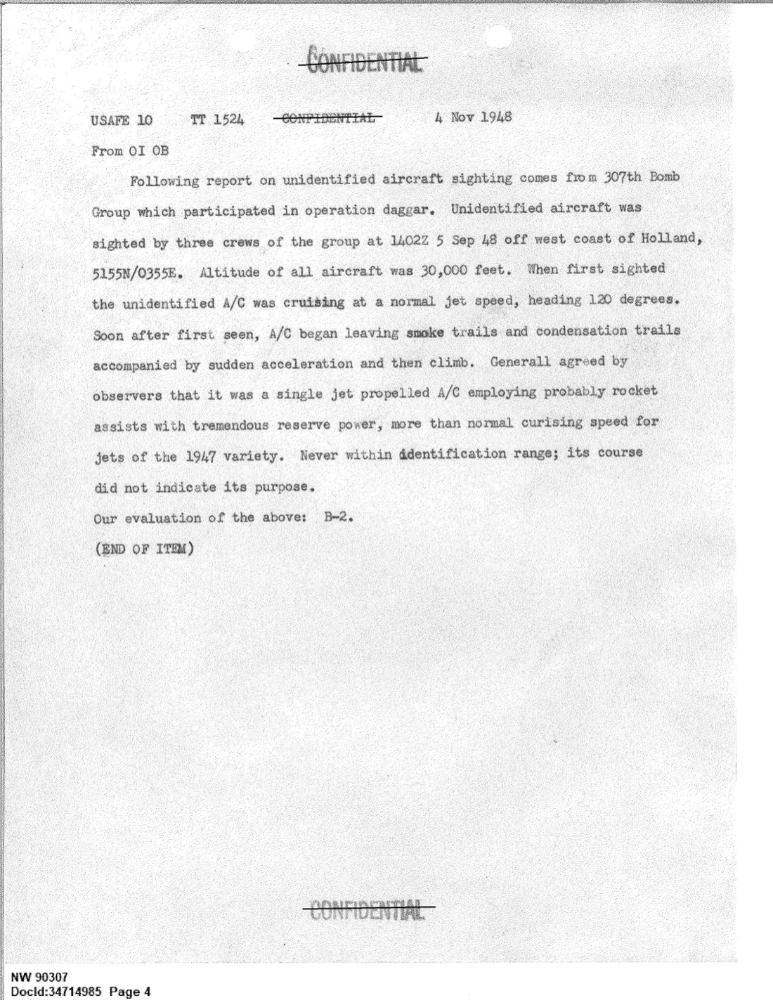
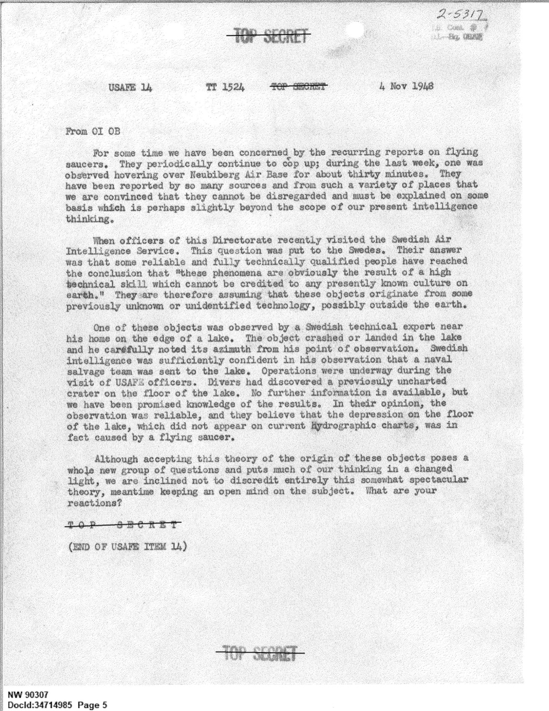
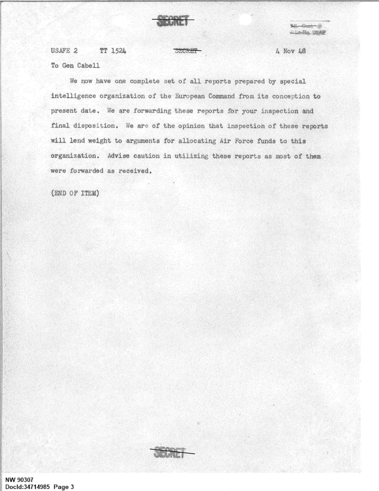
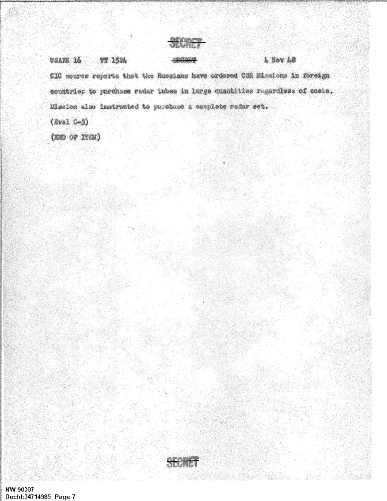

# #023 USAFE 致 Cabell 將軍 1948-11-04：荷蘭外海與瑞典湖底火山口

| 欄位 | 內容 |
|---|---|
| 檔案編號 | 341_110448_Records_Relating_to_the_Collection_and_Dissemination_of_Intelligence_1948-1955-TS_CONT_No.2_2-5300-2-5399 |
| 來源機關 | U.S. Air Force, Directorate of Intelligence（DoI / Cabell 將軍辦公室） |
| 日期 | 1948-11-04（USAFE 電報）／ 1948-11-08（DoI 收文歸檔） |
| 頁數 | 7 頁 |
| 地點 | 北海荷蘭外海（51°55N 03°55E）、巴伐利亞 Neubiberg Air Base、瑞典湖區、Kholomia 機場（蘇聯） |
| 核心關鍵字 | USAFE, General Cabell, 307th Bomb Group, Operation Dagger, Neubiberg, Swedish Air Intelligence, lake crater, 高科技非人類文明, Soviet Redut radar |
| 機密層級 | TOP SECRET CONTROL（TS Cont No.2 2-5300 → 2-5399 區段）／ DECLASSIFIED |
| 公開日 | 2026-05-08 |

## 為什麼這份檔案重要

1947 年 Project Sign 立案後，全球各地的飛碟目擊報告開始流入美方情報網絡。其中 1948 年秋天有一條訊號特別不一樣：美國駐歐空軍（USAFE）情報主任收到瑞典空軍情報處的正式說法，稱「這些現象顯然是某種高科技的結果，而這種科技不能歸屬於地球上任何已知文明」。瑞典官方追到一個技術專家目擊的湖底墜落地點，派出海軍打撈隊，潛水員找到「未在水文圖上的火山口」。

USAFE 把這條訊息打包進四封電報，1948-11-04 直接呈報給時任 USAF 情報主任 **Charles P. Cabell 少將**（後來 1953-62 擔任 CIA 副局長、Bay of Pigs 時期的關鍵人物）。電報以 TOP SECRET CONTROL 編號歸入 USAF DoI 內部追蹤系統。

這份檔案的歷史地位：
1. **早於 Project Sign 結案報告**（1949-02 改名 Grudge），是 USAF 內部第一次正式收到「外國盟友的情報機構認為飛碟是非地球技術」這種說法。
2. **307th Bomb Group 北海目擊**（1948-09-05 三組空勤目擊）是早期同時段、多目擊者的軍方專業報告。
3. **湖底火山口** + 海軍打撈隊 + 水文圖比對，是早期最具技術細節的「downed disc + physical recovery」紀錄。

## 1. 文件結構與路線

電報共四條，分別屬於三個機密等級：

| 序號 | 等級 | 主題 |
|---|---|---|
| USAFE 2 TT 1524 | SECRET | Cabell 致函：附上歐洲司令部特殊情報組織所有報告供「最終處置」 |
| USAFE 10 TT 1524 | CONFIDENTIAL | 1948-09-05 307th BG 北海外海目擊報告 |
| USAFE 14 TT 1524 | TOP SECRET | Neubiberg 飛碟懸停 + 瑞典空軍情報處說法 + 湖底火山口 |
| USAFE 16 TT 1524 | SECRET | 蘇聯 CSR 任務在海外大量採購雷達真空管 |

中間還夾了第五條，USAFE-A1：蘇聯 Kholomia 機場附近 Redut 雷達技術細節（從一個蘇聯叛逃飛行員口述取得）。這份歸檔在同一個 TS Cont No.2 2-5300 → 2-5399 編號區段，意思是「飛碟」和「蘇聯雷達」在 USAF DoI 內部被視為同一條情報線的不同切面。

封面是 **Directorate of Intelligence / Headquarters, U.S. Air Force / E 48-854 Pentagon / Washington 25, D.C.**：

E 48-854 是這份文件在 DoI 內部的接收登錄號。Cabell 在 1948 年初接任 USAF 情報主任（前任是 George C. McDonald），這份文件落地時他剛上任不到一年。

## 2. 1948-09-05：307th Bomb Group 北海目擊

第一條 CONFIDENTIAL 電報來自 USAFE OI OB（情報處），由 USAFE 直接觀察到並收歸的：

> Following report on unidentified aircraft sighting comes from 307th Bomb Group which participated in operation daggar. Unidentified aircraft was sighted by three crews of the group at 1402Z 5 Sep 48 off west coast of Holland, 5155N/0355E. Altitude of all aircraft was 30,000 feet. When first sighted the unidentified A/C was cruising at a normal jet speed, heading 120 degrees. Soon after first seen, A/C began leaving smoke trails and condensation trails accompanied by sudden acceleration and then climb. Generally agreed by observers that it was a single jet propelled A/C employing probably rocket assists with tremendous reserve power, more than normal cruising speed for jets of the 1947 variety. Never within identification range; its course did not indicate its purpose.
>
> Our evaluation of the above: B-2.

> 以下不明飛行物目擊報告來自參與「Dagger 行動」的第 307 轟炸機大隊。1948-09-05 14:02Z，三組機組人員在荷蘭西海岸外海（51°55N 03°55E）上空 30,000 英尺高度目擊不明飛行物。初次目擊時，該不明機以正常噴射機速度巡航，航向 120 度。目擊後不久，該機開始拖出煙跡與凝結尾流，伴隨突然加速並爬升。觀察者普遍認為這是一架噴射動力單機，可能搭配火箭助推，剩餘動力極大，速度遠超 1947 年級別的噴射機正常巡航速度。從未進入識別範圍，航向也未顯露目的。
>
> 我方評估：B-2。

技術解讀：

- **Operation Dagger** 是 1948 年 9 月初 SAC 在歐洲執行的多日多機演習。307th BG 駐 RAF Marham，飛 B-29。在這個演習脈絡中，三組空勤同時目擊到不明物。
- **51°55N 03°55E** 是北海荷蘭外海，大約位於海牙以北 60 公里。
- **30,000 ft + 120° 航向** 是 B-29 的典型巡航高度與方向（往東南往中歐）。
- **噴射 + 可能火箭助推**：1948 年的工程基準。當時美方主力噴射機是 P-80 Shooting Star（最高速度約 600 mph），蘇聯有 MiG-9，英國有 Meteor。三組機組「普遍同意」這架的剩餘動力遠超 1947 年級別，等於是說它的性能在 1948 年的工程框架內無法歸類。
- **B-2 評估碼**：USAF 標準評估系統的「來源可靠 / 內容可能屬實」，但「未經獨立確認」。對軍機目擊報告而言，B-2 是相對正面的評估。

## 3. 1948-10 末：Neubiberg Air Base 30 分鐘懸停

這就是 TOP SECRET 電報的主體：

> For some time we have been concerned by the recurring reports on flying saucers. They periodically continue to crop up; during the last week, one was observed hovering over Neubiberg Air Base for about thirty minutes. They have been reported by so many sources and from such a variety of places that we are convinced that they cannot be disregarded and must be explained on some basis which is perhaps slightly beyond the scope of our present intelligence thinking.

> 一段時間以來，我們一直對反覆出現的飛碟報告感到關切。它們定期持續冒出來：上週，一個物體在 Neubiberg 空軍基地上空懸停了大約三十分鐘。這些報告來源之多、地點之雜，我們確信不能無視，必須以某種基礎來解釋，而這個基礎可能略超出我們現有的情報思維範圍。

**Neubiberg Air Base** 位於慕尼黑近郊，1948 年是 USAFE 的駐德空軍基地之一，由 86th Fighter Bomber Group（F-47 Thunderbolt 後改 F-84）駐紮。「上週懸停 30 分鐘」是 1948 年 10 月底的事件。

「perhaps slightly beyond the scope of our present intelligence thinking」這句話的措辭值得注意。USAFE 不直接用「extraterrestrial」這個詞，但暗示「我們目前的情報架構不夠用」。

## 4. 瑞典空軍情報處的正式說法

USAFE 軍官 1948 年秋訪問瑞典時，把飛碟議題正式提給瑞典空軍情報處：

> When officers of this Directorate recently visited the Swedish Air Intelligence Service. This question was put to the Swedes. Their answer was that some reliable and fully technically qualified people have reached the conclusion that "these phenomena are obviously the result of a high technical skill which cannot be credited to any presently known culture on earth." They are therefore assuming that these objects originate from some previously unknown or unidentified technology, possibly outside the earth.

> 當本指揮部軍官近期訪問瑞典空軍情報處時，我們把這個問題提給瑞典方面。他們的回答是：一些可靠且具備充分技術資格的人員已得出結論，「這些現象顯然是某種高科技的結果，而這種科技不能歸屬於地球上任何當前已知的文明」。因此他們假設，這些物體源自某種先前未知或未識別的技術，可能來自地球之外。

這是已解密美軍文件中，最早一次明確記錄某個盟國的官方情報機構對 USAF 表達「飛碟可能來自地球以外」的立場。瑞典 1946-48 期間正在追查所謂「ghost rocket」現象（北歐天空大量火箭狀物體目擊），瑞典軍方一度懷疑是蘇聯從佩內明德取得的 V-2 衍生型，但 1948 年的這個說法已經明顯超出俄製武器的解釋範圍。

文件用語「possibly outside the earth」在 1948 年的軍方文件中是極罕見的措辭。

## 5. 湖底火山口

緊接著是這份電報最戲劇性的內容：

> One of these objects was observed by a Swedish technical expert near his home on the edge of a lake. The object crashed or landed in the lake and he carefully noted its azimuth from his point of observation. Swedish intelligence was sufficiently confident in his observation that a naval salvage team was sent to the lake. Operations were underway during the visit of USAF officers. Divers had discovered a previously uncharted crater on the floor of the lake. No further information is available, but we have been promised knowledge of the results. In their opinion, the observation was reliable, and they believe that the depression on the floor of the lake, which did not appear on current Hydrographic charts, was in fact caused by a flying saucer.

> 其中一個物體被一位瑞典技術專家在他家附近、湖邊觀察到。物體墜入或降落在湖中，他從觀察點仔細記下了方位角。瑞典情報部門對他的觀察有足夠信心，派出海軍打撈隊到該湖。USAF 軍官訪問期間，打撈作業仍在進行。潛水員已發現一個此前未在水文圖上記錄的湖底火山口。目前沒有更多資訊，但對方已承諾後續結果將通知我方。他們認為，該觀察是可靠的，並相信這個湖底凹陷（未出現在現有水文圖上）實際上是飛碟造成的。

幾個技術細節值得拆解：

- **「技術專家 + 自家附近 + 湖邊」**：證人不是路人，是有工程背景並具備方位測量能力的人。
- **「仔細記下方位角」**：從一個點測得方位角無法定位墜落點。文件沒講距離，但既然海軍打撈隊真的找到了湖底凹陷，要嘛是專家從多個位置觀察並做了三角測量，要嘛湖很小所以方位角足以縮小範圍。
- **「未在水文圖上的火山口」**：1940 年代的瑞典湖區水文圖密度其實不算低，發現一個沒記錄的凹陷意味該凹陷可能是新形成的。
- **「Swedish intelligence was sufficiently confident in his observation that a naval salvage team was sent」**：派出海軍打撈隊不是日常動作，這是一個政府級別的資源投入決策。

USAF 內部對這條線的態度：

> Although accepting this theory of the origin of these objects poses a whole new group of questions and puts much of our thinking in a changed light, we are inclined not to discredit entirely this somewhat spectacular theory, meantime keeping an open mind on the subject. What are your reactions?

> 雖然接受這些物體的此種起源理論會帶出一整批新問題，並且讓我們的許多現有思考處於不同的角度，我們傾向不完全否定這個略具戲劇性的理論，同時對此議題保持開放心態。你方有何反應？

「What are your reactions?」這句話直接拋給 Cabell。USAFE 不下結論，但顯然不想單方面把這條線丟掉。

## 6. Cabell 那封 SECRET 信

最前面那封 SECRET 電報（USAFE 2 TT 1524）是 USAFE 致 Cabell 的封面信，附整套歐洲司令部特殊情報組織的報告：

> We now have one complete set of all reports prepared by special intelligence organization of the European Command from its conception to present date. We are forwarding these reports for your inspection and final disposition. We are of the opinion that inspection of these reports will lend weight to arguments for allocating Air Force funds to this organization. Advise caution in utilizing these reports as most of them were forwarded as received.

> 我們現在擁有歐洲司令部特殊情報組織自成立以來至今的所有報告完整集。我們將這些報告轉交給您審閱並作最終處置。我們認為，審閱這些報告將有助於支持為該組織分配空軍經費的論據。請謹慎使用這些報告，因為大部分是「按收到狀態」轉送的。

兩條 subtext：

1. **「argument for allocating Air Force funds」**：這套 UFO 報告同時被當作 USAFE 特殊情報組織爭取預算的籌碼。
2. **「forwarded as received」**：USAFE 沒有對這些報告做獨立查證，等於是說「我們也不確定，請華府自己判斷」。

收件人 **Major General Charles P. Cabell** 當時的職位是 USAF Director of Intelligence。1948 年的 USAF DoI 直接管理 Project Sign（AMC Wright Field 的執行單位）的政策走向。同一時期 Sign 內部正在準備 Estimate of the Situation 草稿（後來被 Vandenberg 駁回的「extraterrestrial」評估）。瑞典湖底火山口這條線在 Estimate 中被引用機率不低，但 Cabell 對這份檔案的個別處理意見並未在這份檔案中留下。

Cabell 1953 年離開 USAF 成為 CIA 副局長，1962 年因 Bay of Pigs 失敗辭職。對 UFO 史而言，他是 1948-53 年間 USAF 飛碟政策的關鍵守門人，這份文件是他到任早期收到的第一批高密度國際 UAP 情報。

## 7. 蘇聯雷達線

第四封電報（USAFE 16 TT 1524）和湖底火山口故事並排，但是另一條軸：

> CIC source reports that the Russians have ordered CSR Missions in foreign countries to purchase radar tubes in large quantities regardless of costs. Mission also instructed to purchase a complete radar set.

> CIC 線人報告，俄方已下令在外國的 CSR 任務團大量採購雷達真空管，不計成本。任務團也獲指示購買一整套完整的雷達設備。

把這條訊號和湖底火山口放在同一份文件，等於是 USAFE 同時把兩個敵情可能性擺到 Cabell 桌上：

- 飛碟 = 蘇聯先進雷達 + 飛行武器？
- 飛碟 = 「地球以外」？

USAFE 不選邊。USAFE 把兩條線都遞交，讓華府決定。

p-06 同樣是這份檔案的一部分，內容是蘇聯 Kholomia 機場附近的 Redut 雷達技術細節（從某個叛逃飛行員口述取得），與 UAP 沒有直接關聯，但屬於同一個 TS Cont 編號區段，顯示這套檔案在 DoI 內部是當作「歐洲戰區綜合敵情」處理的。

## 8. 時間軸

| 日期 | 事件 | 來源 |
|---|---|---|
| 1948-09-05 14:02Z | 307th BG 三組空勤北海荷蘭外海目擊（51°55N 03°55E）| USAFE 10 TT 1524 |
| 1948-10 末（"during the last week"）| Neubiberg AB 上空飛碟懸停 30 分鐘 | USAFE 14 TT 1524 |
| 1948-10 秋 | USAFE 軍官訪問瑞典空軍情報處 | USAFE 14 TT 1524 |
| 1948-10 秋 | 瑞典技術專家湖邊目擊 + 方位角測量 | 同上 |
| 1948-10 秋（USAF 訪問期間進行中）| 瑞典海軍打撈隊作業，潛水員發現未記錄火山口 | 同上 |
| 1948-11-04 | USAFE 四封電報 + 一封蘇聯雷達細節電報 → Cabell | TT 1524 序列 |
| 1948-11-08 | DoI HQ USAF 收文歸檔（E 48-854）| Cover sheet |

## 9. 觀察

**(1) 這份檔案的歷史地位**：是已解密美軍文件中最早一次以盟國官方情報機構的口吻提出「飛碟可能來自地球以外」的紀錄。瑞典空軍情報處說法的措辭強度（「高科技」「不能歸屬於地球上任何已知文明」「可能來自地球之外」）在 1948 年的軍方文件中極為罕見。

**(2) USAFE 的處理策略**：不對盟國說法表態，只把球丟給華府（「What are your reactions?」），但同時用最高機密等級（TOP SECRET）保護這條線。並把「蘇聯先進武器」和「湖底火山口」兩條解釋線都遞給 Cabell，讓華府自己做政治判斷。

**(3) Cabell 收到時的政策背景**：1948 年底 Project Sign 內部正在準備「Estimate of the Situation」草稿，據後續 Edward Ruppelt 1956 年回憶錄稱該草稿傾向 ET 結論並被 Vandenberg 將軍駁回。本檔案是 Cabell 上任不到一年內收到的高密度國際 UAP 情報，與 Estimate 的時間窗高度重合。

**(4) 「湖底火山口」的後續**：本檔案結尾「No further information is available, but we have been promised knowledge of the results」。已解密的後續 USAFE / DoI 通信中，目前沒有看到瑞典海軍打撈隊的最終報告流回美方的紀錄。

**(5) 307th BG 北海目擊的工程意義**：B-2 評估碼 + 三組機組獨立目擊 + 30,000 ft + 「火箭助推 + 噴射 + 1947 機型之外的剩餘動力」三條件並列，這份報告即便用 1948 年的工程基準也屬「無法歸類」級別。Operation Dagger 是 SAC 在歐洲練習對蘇聯城市戰略轟炸的多日演習，目擊地點正在 NATO 空域，這個物體選在這個時間出現在這個位置，是否屬於演習觀察線，文件未表態。

**(6) Neubiberg 30 分鐘懸停**：「Hovering」這個詞在 1948 年的航空工程語彙中無對應對象（直升機尚未量產化部署）。30 分鐘懸停意味物體可以維持與重力場垂直方向的長時間穩定推力，且燃料/能量代價可控。USAFE 不在電報中對此做工程解釋，直接把它列為「present intelligence thinking」之外的現象。

## 10. 跨檔案連結

- **[#017 AMC flying disc 1947 / Project Sign 起源公文鏈](../017-18_100754_general_1946-7_vol_2/report.md)**：本檔案的直接上游。1947-12-30 USAF 立案令成立 Project Sign，AMC 的目擊評估流程正式啟動；不到 11 個月後，這批國際 UAP 情報就已經以 TOP SECRET 等級送達 DoI 主任桌上。Twining 信第 2.h.(3) 段「foreign nation with nuclear propulsion」這個括號，在本檔案中被瑞典空軍情報處的「地球以外」說法暫時填了另一種內容。
- **[#022 SHAEF foofighters 1944-1945](../022-331_120752_numeric_files_1944-1945_37153_german_armament_equipment_documents/report.md)**：1944-12 → 1945-03 SHAEF 公文鏈呈現的「現象是真的，但無法解釋」pattern，在 1948-11 USAFE → Cabell 這條線上重現一次。SHAEF 結案語「Me 262 + flak rocket，但 still a mystery」，被本檔案的「蘇聯雷達 vs 地球以外」這個雙軌並陳代換。

## 11. 來源

- 原始檔案：[U.S. Department of War — 341_110448_Records_Relating_to_the_Collection_and_Dissemination_of_Intelligence_1948-1955-TS_CONT_No.2_2-5300-2-5399](https://www.war.gov/UFO/#341_110448_Records_Relating_to_the_Collection_and_Dissemination_of_Intelligence_1948-1955-TS_CONT_No.2_2-5300-2-5399)
- PDF 直接下載：`https://www.war.gov/medialink/ufo/release_1/341_110448_records_relating_to_the_collection_and_dissemination_of_intelligence_1948-1955-ts_cont_no.2_2-5300-2-5399.pdf`
- 公開日：2026-05-08
- 7 頁，TOP SECRET CONTROL，DECLASSIFIED（NW 90307 / DocID 34714985）
