# #025 FSR 200-4 飛碟事件彙編 1948-12 → 1950-01：Project Sign / Grudge 鐵桶式回報的第一年

| 欄位 | 內容 |
|---|---|
| 檔案編號 | 342_HS1-416511228_Box186_319.1 Flying Discs 1949 |
| 來源機關 | USAF Flight Service Centers（多個基地）→ AMC Wright-Patterson AFB MCIAXO-3 |
| 日期範圍 | 1948-02-06（USAF 立規）→ 1948-11-02（FSR 200-4 發布）→ 1948-12-03（首案）→ 1949-12-XX → 1950-01-09（Lowry 結卷） |
| 頁數 | 143 頁 |
| 地點 | 美國本土多州 + 加拿大 + Newfoundland + 夏威夷 Hickam + 日本 |
| 機密層級 | RESTRICTED ／ DECLASSIFIED |
| 公開日 | 2026-05-08 |

## 為什麼這份檔案重要

[#017 AMC flying disc 1947 / Project Sign 起源公文鏈](../017-18_100754_general_1946-7_vol_2/report.md)記錄了 1947-12-30 USAF 對 AMC 發出立案令成立 Project Sign。立案令說「設一個專案蒐集、整合、評估所有飛碟資訊」，但具體怎麼蒐集、誰來蒐、用什麼格式、報到哪、多快回報，立案令並沒有講。

回答這些問題的兩份規範：

1. **1948-02-06**：USAF 總部對所有指揮部發布指令，任何飛碟相關資訊，直接送 AMC Wright-Patterson，attention: SD（Saucer Division）。不走一般通信渠道。
2. **1948-11-02**：Flight Service Regulation (FSR) 200-4，標準化「Unidentified Flying Objects」事件報告格式。20 個項目（形狀、尺寸、顏色、速度、航向、機動性、高度、聲音、尾流、見證者背景、雷達確認、…），由各地 Flight Service Center 負責蒐集和上報。

這份檔案是 FSR 200-4 機制運轉的第一個完整週期（1948-12 → 1950-01）所累積的事件彙編，由 Lowry Flight Service Center（科羅拉多 Denver）1950-01-09 結卷上呈 AMC。共 143 頁，覆蓋 30+ 起目擊報告，跨美國本土、紐芬蘭、夏威夷、日本。

這份檔案的歷史意義：

1. **是 Project Sign / Grudge 早期最大量的原始 case file**。Project Sign 自己後來編的「Project Sign Report」（1949-02 發布）所引用的案例都來自這個系統。
2. **顯示 USAF 內部資料蒐集的工程化程度**：用 RFC 風格的標準格式（FSR 200-4），各地 Flight Service Center 平行回報，AMC 中央彙整，年度結卷。
3. **包含日本中央氣象台 1949-01-25 流星案**：說明這個系統會把自然現象一起收進來，由 AMC 做事後分類。
4. **包含 Chance-Vought V-173 / XF5U-1（「飛行薄餅」）的對照圖**：海軍真實圓盤型實驗機，被當作目擊者描述的對照基準附在某起案件中。

## 1. 1948-02-06 USAF 指令：所有飛碟報告直送 AMC

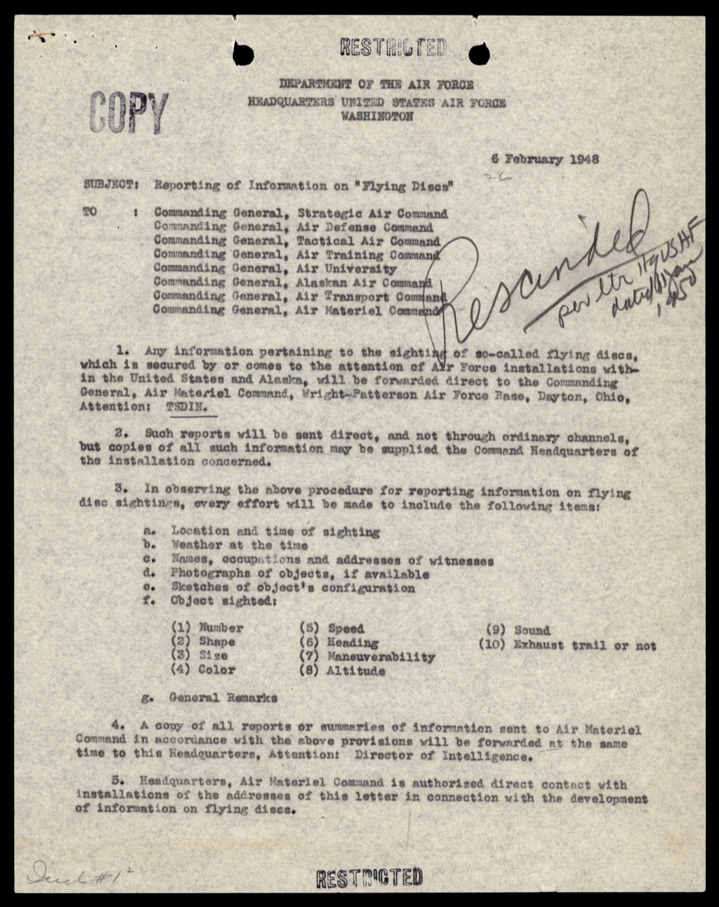

> SUBJECT: Reporting of Information on "Flying Discs"
>
> TO: Commanding General, Strategic Air Command / Air Defense Command / Tactical Air Command / Air Training Command / Air University / Alaskan Air Command / [...]
>
> 1. Any information pertaining to the sighting of so-called flying discs which is secured by or comes to the attention of Air Force installations within the United States and Alaska, will be forwarded direct to the Commanding General, Air Materiel Command, Wright-Patterson Air Force Base, Dayton, Ohio, Attention: TSDIN.
>
> 2. Such reports will be sent direct, and not through ordinary channels, but copies of all such information may be supplied the Command Headquarters of the installation concerned.

> 主旨：「飛碟」資訊回報
>
> 致：戰略空軍司令部、防空司令部、戰術空軍司令部、空軍訓練司令部、空軍大學、阿拉斯加空軍司令部 [...] 各司令官
>
> 1. 任何由美國本土與阿拉斯加境內空軍設施所獲取、或進入其視野的「飛碟」目擊相關資訊，將直接轉送 AMC（俄亥俄 Dayton Wright-Patterson 空軍基地）司令官，收件：TSDIN（後改 MCIAXO-3）。
>
> 2. 此類報告直送、不走一般通信渠道；副本可送至相關設施的指揮部總部。

「不走一般通信渠道」這句話的工程含義：飛碟報告繞過正常的 hierarchical 報告系統，採用 point-to-point 結構直送 AMC。這降低了報告在中間層被截留、誤分類、或被埋藏的機率。

收件代號從 1947 年的 TSDIN（McCoy 上校 1947 年的代號）演變成 MCIAXO-3（AMC Intelligence Analysis Office, Section 3）。MCIAXO-3 即後來 Project Sign / Grudge / Blue Book 的內部承辦組。

## 2. FSR 200-4：把目擊報告標準化

1948-11-02 USAF 發布 Flight Service Regulation 200-4。FSR 是 Flight Service 系統的內部規章，涵蓋飛行管制、氣象、通信等。200-4 是 200 系列中專門處理「Unidentified Flying Objects」的條目。

各地 Flight Service Center（FSC）使用標準化表單 HqAMC Form No. 10-530，欄位包括：

- Essential Elements of Information：日期、時間、地點、天氣
- Object sighted：數量、形狀、尺寸、顏色、速度、航向、機動性、高度、聲音、尾流、雷達跡象、燈光、支撐、推進方式、穩定面、外觀變化
- Observer：姓名、軍階、單位、職業、肉眼/望遠鏡、距離、角度、追蹤時間
- Conditions：能見度、雲層、其他相關背景
- Disappearance：消失方式（淡出、爆炸、躲到雲後等）
- Distribution：抄送對象

實際案件示例（Olmsted FSC 1949-09-22 案，PA）：

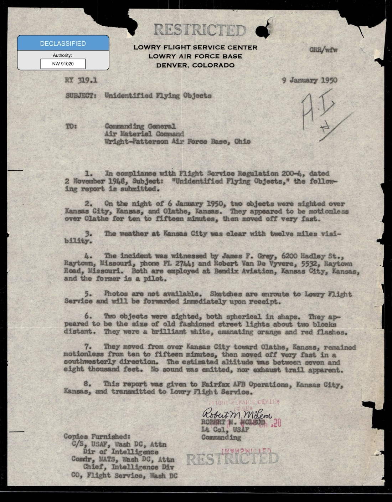

> 9 January 1950 / Unidentified Flying Objects
>
> 1. In compliance with Flight Service Regulation 200-4, dated 2 November 1948, Subject: "Unidentified Flying Objects," the following report is submitted.
>
> 2. On the night of 6 January 1950, two objects were sighted over Kansas City, Kansas, and Olathe, Kansas. They appeared to be motionless over Olathe for ten to fifteen minutes, then moved off very fast.
>
> 6. Two objects were sighted, both spherical in shape. They appeared to be the size of old fashioned street lights about two blocks distant. They were a brilliant white, emanating orange and red flashes.

> 1950-01-09 ／ 不明飛行物
>
> 1. 依據 1948-11-02 Flight Service Regulation 200-4「不明飛行物」之規定，提交以下報告。
>
> 2. 1950-01-06 夜，兩個物體在 Kansas City（堪薩斯州）與 Olathe（堪薩斯州）上空被目擊。它們在 Olathe 上空停滯 10 到 15 分鐘，然後快速離開。
>
> 6. 兩個物體均為球形。看起來大小約為兩個街區外的舊式街燈。它們發出明亮的白光，並閃現橙紅色光芒。

這份 Lowry FSC 1950-01-09 案是檔案的封面案，發生在堪薩斯州 Olathe 上空。兩個證人：James P. Grey（Raytown, MO，Bendix Aviation 雇員，本人是飛行員）與 Robert Van De Vyvere（Bendix Aviation 同事）。兩物體停滯 10-15 分鐘後高速向西南飛離。

Lowry FSC 在 1950-01-09 把這份案件當作觸發點，順帶把所有累積的 1949 年 FSR 200-4 案件一併打包上呈 AMC。這就是這份 143 頁檔案的由來。

## 3. 1948-12-03 Fairfield-Suisun AFB：第一個被詳細追問的案子

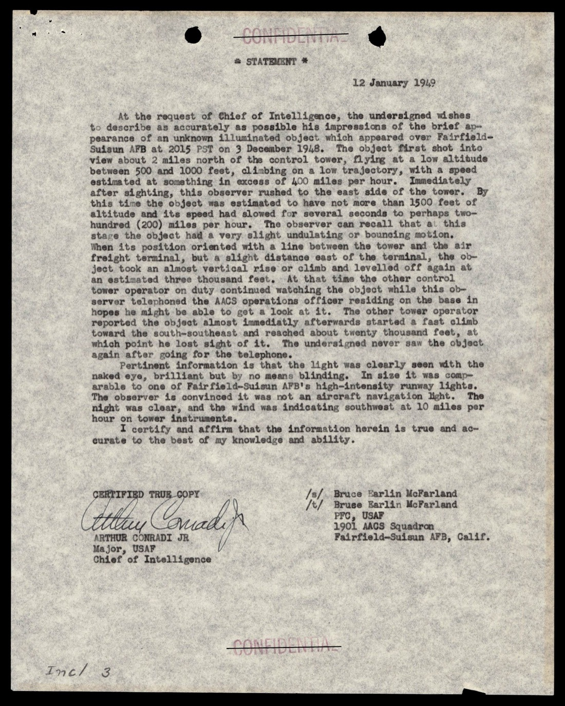

1948-12-03 2015 PST，Fairfield-Suisun AFB（加州，今 Travis AFB）控制塔操作員報告飛碟。Chief of Intelligence 親自要求書面證詞，1949-01-12 寫成：

> The object first shot into view about 2 miles north of the control tower, flying at a low altitude between 500 and 1000 feet, climbing on a low trajectory, with a speed estimated at something in excess of 400 miles per hour. Immediately after sighting, this observer rushed to the east side of the tower. By this time the object was estimated to have not more than 1500 feet of altitude and its speed had slowed for several seconds to perhaps two-hundred (200) miles per hour. The observer can recall that at this stage the object had a very slight undulating or bouncing motion.
>
> When its position oriented with a line between the tower and the air freight terminal, but a slight distance east of the terminal, the object took an almost vertical rise or climb and levelled off again at an estimated three thousand feet.

> 物體最初出現在控制塔以北約 2 英里處，低空飛行，高度 500 至 1000 英尺，沿低彈道爬升，速度估計超過每小時 400 英里。目擊後本觀察員立即衝到塔台東側。此時物體高度估計不超過 1500 英尺，速度減慢了幾秒鐘，可能降至每小時兩百英里。觀察員回想，此時物體有一種非常輕微的波動或彈跳運動。
>
> 當其位置與塔台和航空貨運站之間的連線對齊，但略偏終端東側時，物體進行了幾乎垂直的爬升，然後再次在約三千英尺處平飛。

兩個技術觀察點：(1) 「slight undulating or bouncing motion」（輕微波動或彈跳）在 200 mph 巡航時。(2) 「almost vertical rise」從 1500 ft 升到 3000 ft。這兩個運動學特徵 1948 年量產飛機都做不到。

## 4. 1948-12-08 Chanute AFB：Sergeant Houtag 衝去找 Duty Forecaster

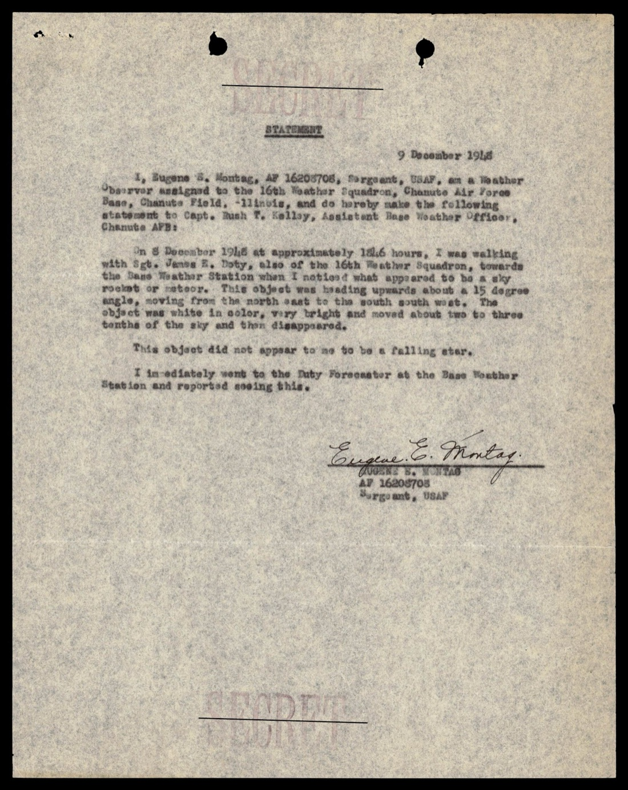

> I, Eugene S. Houtag, AF 16209708, Sergeant, USAF, a Weather Observer assigned to the 16th Weather Squadron, Chanute Air Force Base, Chanute Field, Illinois, [...] make the following statement [...]
>
> On 8 Dec 1948 at approximately 1446 hours, I was walking with Sgt. Janese J. Doty, also of the 16th Weather Squadron, towards the Base Weather Station when I noticed what appeared to be a meteor. This object was heading upwards about 15 degrees moving from the north east to the south south west. The object was white in color, very bright and moved about two to three tenths of the sky and then disappeared.
>
> The object did not appear to me to be a falling star. I immediately went to the Duty Forecaster at the Base Weather Station and reported seeing this.

> 我，Eugene S. Houtag，AF 16209708，美國空軍中士，氣象觀察員，編制於 Chanute 空軍基地（伊利諾州 Chanute Field）第 16 氣象中隊 [...] 茲為下述陳述 [...]
>
> 1948 年 12 月 8 日約 1446 時，我與第 16 氣象中隊 Sgt. Janese J. Doty 同行走往基地氣象站，途中我注意到一個看起來像流星的物體。這個物體往上方移動，角度約 15 度，從東北方向移到西南偏南方向。物體為白色，非常明亮，劃過天空約十分之二到十分之三的範圍後消失。
>
> 這個物體在我看來不像一顆流星。我立即前往基地氣象站找值班預報員報告所見。

Houtag 是專業氣象觀察員。他的判斷依據是「不像流星」：流星走的是向下軌道，這個物體往上 15 度走北東 → 西南偏南。所以他不接受流星解釋，立刻去找值班預報員，這個動作觸發了正式 FSR 200-4 報告。

這個案件的工程意義不在物體本身，在於 FSR 200-4 機制：基地氣象觀察員看到不合常理的天空物體 → 立刻找值班預報員 → 報告經由 Flight Service Center 進入正式管道。

## 5. 1949-07-25 Mr. Clark Cub Cruiser：5 物編隊 180 度迴轉

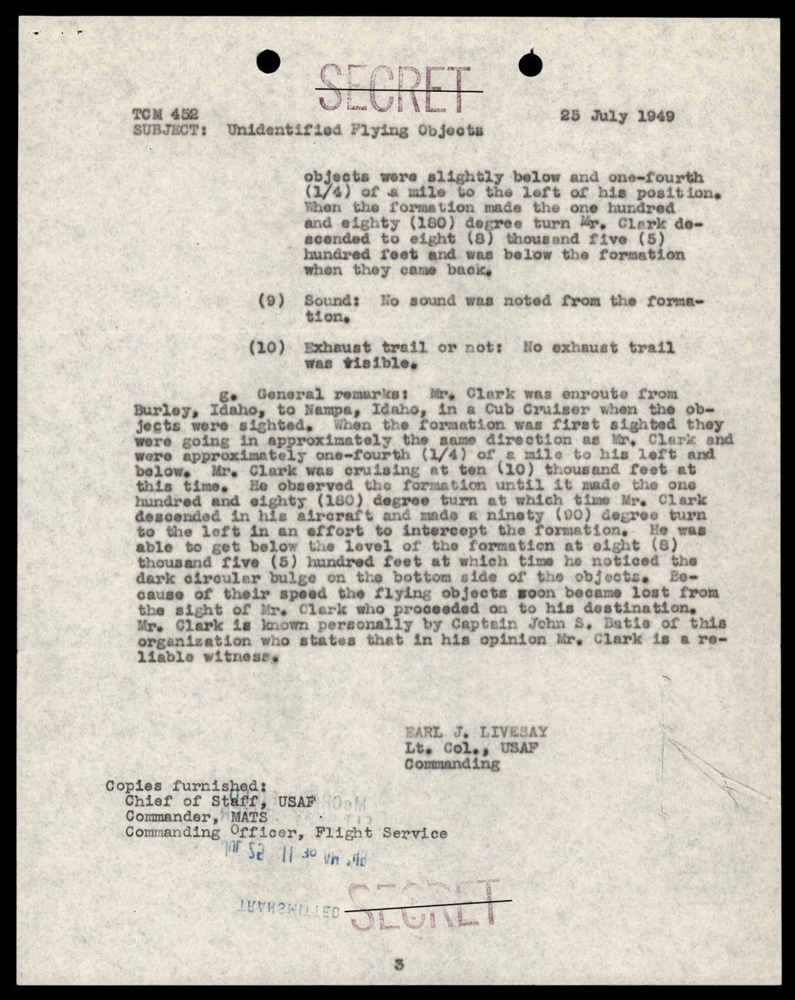

1949-07-25，Mr. Clark 駕駛 Piper Cub Cruiser 從愛達荷州 Burley 飛往 Nampa（直線距離約 230 km，Cub Cruiser 巡航速度約 110 mph，飛 2 小時左右）。途中他在 10,000 ft 高度看到一個編隊：

> Mr. Clark was enroute from Burley, Idaho, to Nampa, Idaho, in a Cub Cruiser when the objects were sighted. When the formation was first sighted they were going in approximately the same direction as Mr. Clark and were approximately one-fourth (1/4) of a mile to his left and below. Mr. Clark was cruising at ten (10) thousand feet at this time. He observed the formation until it made the one hundred and eighty (180) degree turn at which time Mr. Clark descended in his aircraft and made a ninety (90) degree turn to the left in an effort to intercept the formation. He was able to get below the level of the formation at eight (8) thousand five (5) hundred feet and was below the formation when they came back.

> Clark 駕 Cub Cruiser 由愛達荷 Burley 飛往 Nampa 途中目擊。最初看見編隊時，它們與 Clark 方向大致相同，位於他左方四分之一英里、稍低位置。Clark 當時巡航 10,000 英尺。他持續觀察直到編隊做 180 度迴轉，此時 Clark 把飛機下降，並左轉 90 度試圖攔截。他成功降到 8,500 英尺位於編隊下方，當編隊掉頭回來時他在下方位置。

關鍵點：Clark 是合格飛行員，駕著一架慢速教練機嘗試攔截。他的觀察條件比地面證人好得多，且他的速度判斷有飛機儀表作參考。「五物編隊 + 180 度迴轉 + 維持隊形」是 1949 年的工程基準下的可疑高機動性。

## 6. 1949-08-22 Seattle WA：三位空中防衛中隊管制員

McChord FSC（華盛頓州）1949-08-23 報告，1949-08-22 1645Z 西雅圖上空目擊：

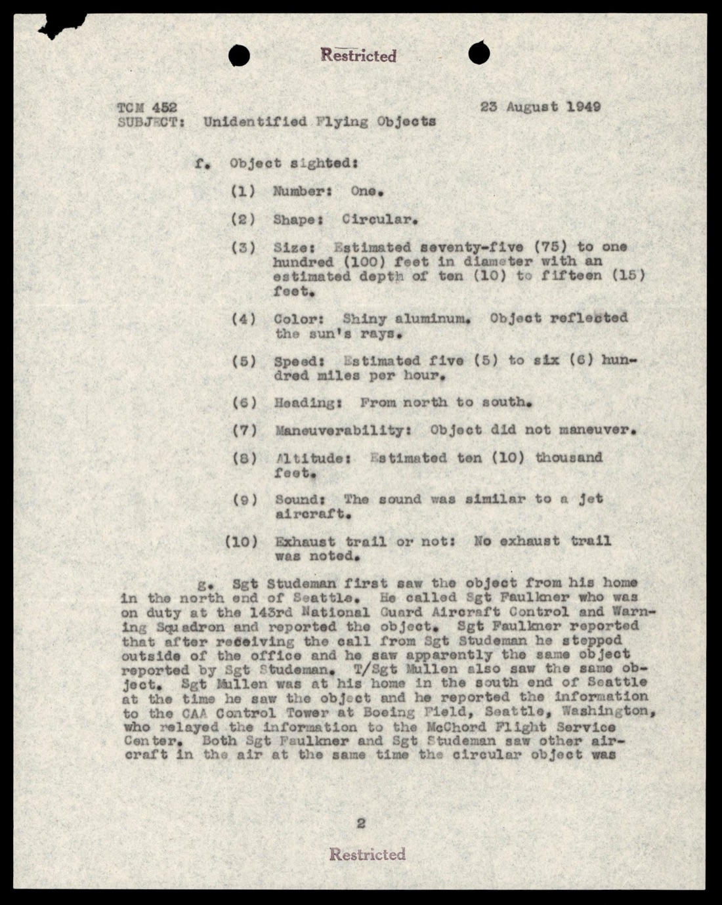

> 1. Object sighted:
> (1) Number: One.
> (2) Shape: Circular.
> (3) Size: Estimated seventy-five (75) to one hundred (100) feet in diameter with an estimated depth of ten (10) to fifteen (15) feet.
> (4) Color: Shiny aluminum. Object reflected the sun's rays.
> (5) Speed: Estimated five (5) to six (6) hundred miles per hour.
> (6) Heading: From north to south.
> (7) Manouverability: Object did not maneuver.
> (8) Altitude: Estimated ten (10) thousand feet.
> (9) Sound: The sound was similar to a jet aircraft.
> (10) Exhaust trail or not: No exhaust trail was noted.

> 1. 物體目擊：
> (1) 數量：一個。
> (2) 形狀：圓形。
> (3) 尺寸：估計直徑 75 至 100 英尺，厚度估計 10 至 15 英尺。
> (4) 顏色：閃亮鋁色。物體反射陽光。
> (5) 速度：估計 500 至 600 英里每小時。
> (6) 航向：從北向南。
> (7) 機動性：物體未做機動。
> (8) 高度：估計 10,000 英尺。
> (9) 聲音：類似噴射機。
> (10) 尾流：未見尾流。

三名目擊者均為 143rd 國民兵 Aircraft Control and Warning Squadron 的管制員：Sgt Roger H. Studeman（家中），Jack Faullmer（值勤中），T/Sgt T. D. Mullen（家中）。三人分別在西雅圖南北兩端先後看到同一物體，並透過 CAA 西雅圖控制塔通報 McChord FSC。

「75-100 英尺直徑、10-15 英尺厚、無尾流、500-600 mph」這組數字對 1949 年的工程是無法解釋的：當時美方最快量產戰機是 F-86 Sabre（664 mph），但 F-86 是長條型有尾流。圓形 + 無尾流 + 高速 + 巨大這幾個條件聯立沒有匹配項。

## 7. 1949-07-26 Spokane WA Bill Miller：商業飛行員目擊

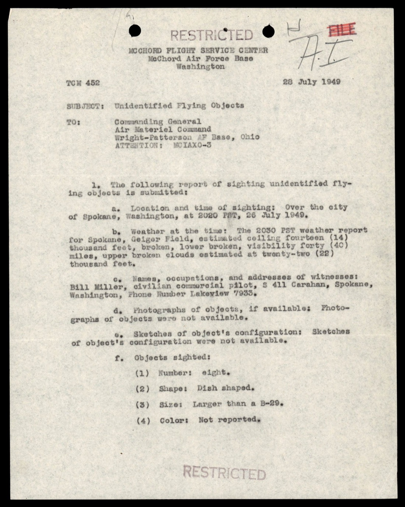

Geiger FSC（華盛頓州）1949-07 報告：1949-07-26 2050 PST，平民商業飛行員 Bill Miller 在華盛頓州 Spokane 上空目擊。天氣晴朗，能見度 25 英里，22,000 ft 有破雲層。

這個案件本身細節不在這份頁，但與 1949-07-25 Idaho Clark 案合起來，顯示 1949 年 7 月底太平洋西北部出現一波集中目擊。

## 8. 1949 年 2 月 Hickam AFB：「Roger Five Dog」排查

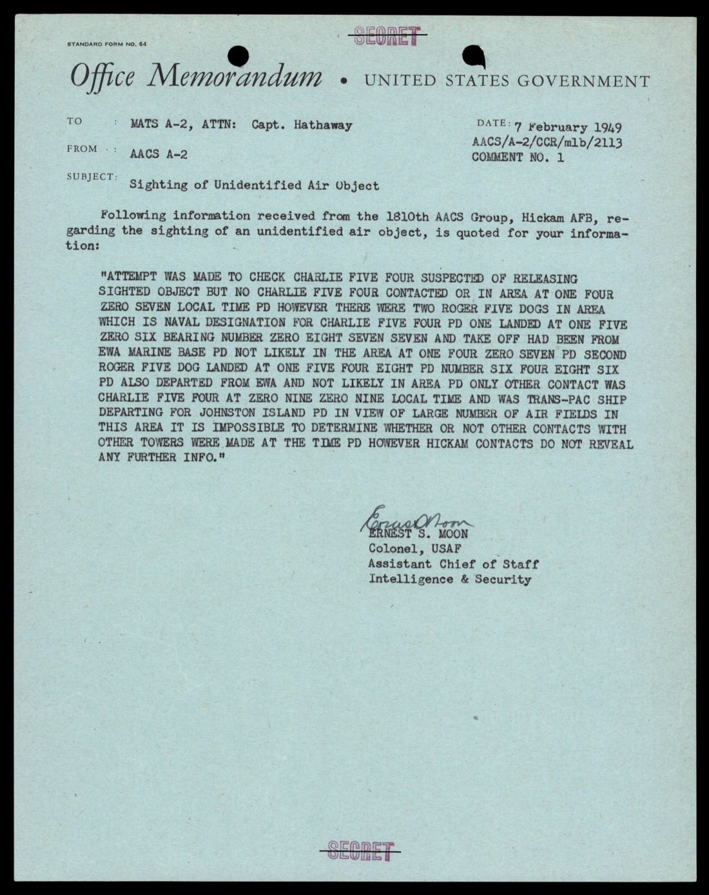

1949-02 夏威夷 Hickam AFB（位 1810th AACS Group）AACS A-2 內部備忘：

> ATTEMPT WAS MADE TO CHECK CHARLIE FIVE FOUR SUSPECTED OF RELEASING SIGHTED OBJECT BUT NO CHARLIE FIVE FOUR CONTACTED OR IN AREA AT ONE FOUR ZERO SEVEN LOCAL TIME PD HOWEVER THERE WERE TWO ROGER FIVE DOGS IN AREA WHICH IS NAVAL DESIGNATION FOR CHARLIE FIVE FOUR PD ONE LANDED AT ONE FIVE ZERO SIX BEARING NUMBER ZERO EIGHT SEVEN SEVEN AND TAKE OFF HAD BEEN FROM EWA MARINE BASE PD NOT LIKELY IN THE AREA AT ONE FOUR ZERO SEVEN PD [...] IT IS IMPOSSIBLE TO DETERMINE WHETHER OR NOT OTHER CONTACTS WITH OTHER TOWERS WERE MADE AT THE TIME PD HOWEVER HICKAM CONTACTS DO NOT REVEAL...

> 試圖核查涉嫌投放目擊物體的 Charlie Five Four（C-54）但 1407 本地時無 C-54 聯繫或在區域內 PD 然而當時區域內有兩架 Roger Five Dog（海軍代號 R5D 即 C-54）PD 其中一架 1506 著陸機號 0877 起飛地為 EWA 海軍陸戰隊基地 PD 1407 不太可能在區域 PD [...] 無法判定當時是否有其他控制塔的接觸 PD 但 Hickam 接觸紀錄未顯示...

電報全用 phonetic alphabet（CHARLIE FIVE FOUR = C-54，ROGER FIVE DOG = R5D）。AACS 排查過 1407 當地時間附近的所有 C-54 / R5D 飛行紀錄，確認沒有 C-54 在事發位置，但有兩架 R5D 在區域內，登陸時間都不符合事發時間。標準的「排除常規飛行物」流程。

電報結尾隱含的結論：Hickam 區域內可以確認的合法飛行物無法解釋目擊物。

## 9. 1949-02-21 Goose Bay Lab → St Johns NFLD：MATS 直接回報

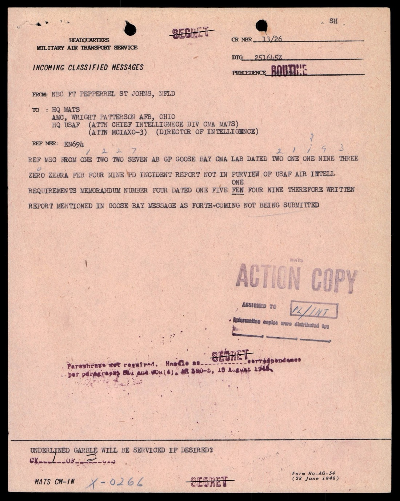

1949-02 末，紐芬蘭 Ft Pepperrell（St Johns）發出 MATS（軍事航空運輸服務）電報：

> REF MSG FROM ONE TWO TWO SEVEN AB GP GOOSE BAY CMA LAB DATED TWO ONE ONE NINE THREE ZERO ZEBRA FEB FOUR NINE PD INCIDENT REPORT NOT IN PURVIEW OF USAF AIR INTELLIGENCE REQUIREMENTS MEMORANDUM NUMBER FOUR DATED ONE FIVE FEB FOUR NINE THEREFORE WRITTEN REPORT MENTIONED IN GOOSE BAY MESSAGE AS FORTHCOMING NOT BEING SUBMITTED

> 參考 1227 AB Gp Goose Bay 拉布拉多 1949-02-21 1930Z 訊息 PD 事件報告不屬 USAF 空軍情報需求備忘錄第 4 號（1949-02-15）範圍 PD 因此 Goose Bay 訊息中提到的後續書面報告不予提交

這份反向訊息揭露了 FSR 200-4 系統的篩選機制：USAF 空軍情報需求備忘錄第 4 號（USAF Air Intelligence Requirements Memorandum No. 4, 1949-02-15）明定哪些案件屬於正式 UFO 報告對象，哪些不屬於。Goose Bay 一開始準備報，被告知「不在範圍內」後撤回。

也就是說，這份檔案是「進入 FSR 200-4 篩選後留下來的案件」，本身已是經過初步分類的子集。實際上 1948-1950 年的飛碟報告流量比這份檔案還大。

## 10. 1949-01-25 日本流星案：FSR 200-4 系統把自然現象也吃進來

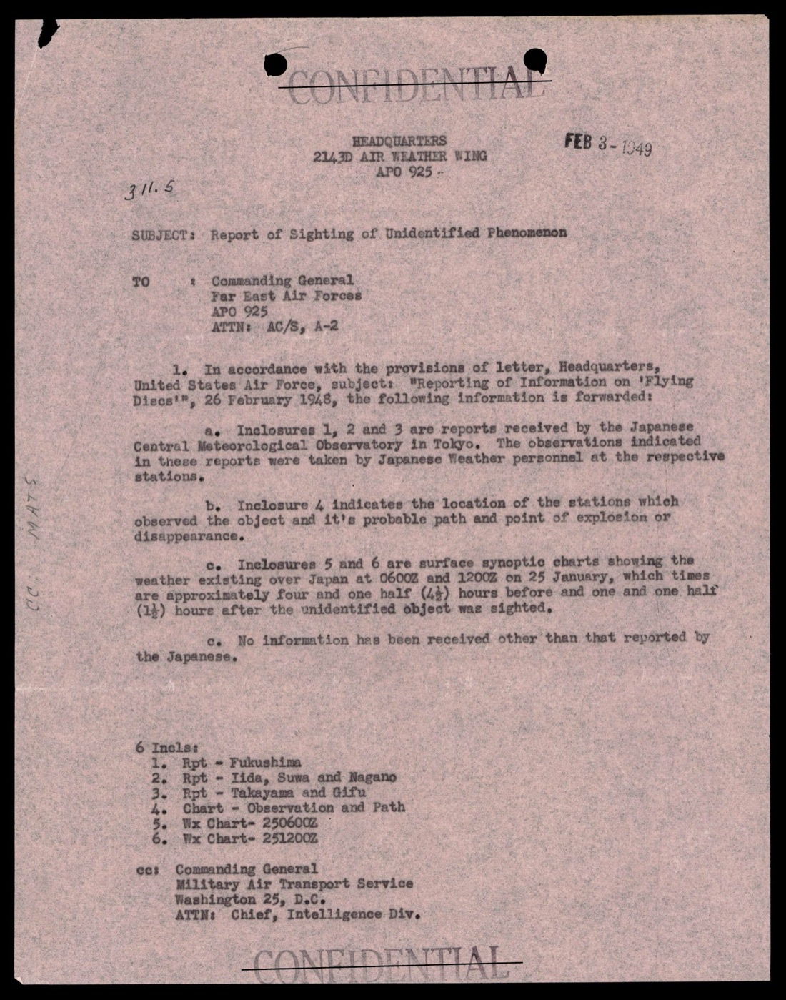

2143rd Air Weather Wing（駐 APO 925，遠東空軍）1949-06 回報，附 4 份日本中央氣象台（Central Meteorological Observatory, Tokyo）的觀測報告：

> a. Inclosures 1, 2 and 3 are reports received by the Japanese Central Meteorological Observatory in Tokyo. The observations indicated in these reports were taken by Japanese Weather personnel at the respective stations.

> a. 附件 1、2、3 為東京日本中央氣象台收到之報告。報告中所示觀測由日方各氣象站氣象人員取得。

事件：1949-01-25 約 1940 時，福島、飯田、諏訪、長野、高山、岐阜等地氣象站同時觀測到一個發光物體：

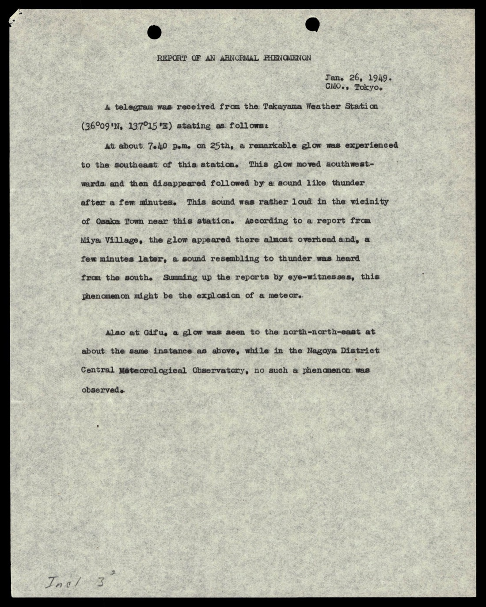

> REPORT OF AN ABNORMAL PHENOMENON / Jan. 26, 1949. / C.M.O., Tokyo.
>
> A telegram was received from the Takayama Weather Station (36°09'N, 137°15'E) stating as follows:
>
> At about 7.40 p.m. on 25th, a remarkable glow was experienced to the southeast of this station. This glow moved southwest-wards and then disappeared followed by a sound like thunder after a few minutes. This sound was rather loud in the vicinity of Osaka Town near this station. According to a report from Miya Village, the glow appeared there almost overhead and, a few minutes later, a sound resembling to thunder was heard from the south. Summing up the reports by eye-witnesses, this phenomenon might be the explosion of a meteor.

> 異常現象報告 ／ 1949-01-26 ／ 東京中央氣象台
>
> 接獲高山氣象站（36°09'N, 137°15'E）電報如下：
>
> 25 日約 7:40 p.m.，本站東南方出現顯著發光現象。此發光物體向西南方向移動，隨後消失，幾分鐘後傳來如雷聲音。此聲音在本站附近大瀉町（Osaka Town）一帶相當響亮。據宮村（Miya Village）報告，光體幾乎在頭頂出現，數分鐘後南方傳來如雷之聲。綜合目擊者報告，此現象可能為流星爆炸。

飯田氣象站、長野氣象站、福島氣象站的報告維度類似：北至南向西南方向的發光物，3-4 秒後伴隨打雷聲（衝擊波）。日本氣象專家全部判定「very likely a meteor」。

這個案件本身是流星，但出現在這份檔案的工程意義是：FSR 200-4 系統會把日本氣象台的觀測經由 2143rd AWW → FEAF → USAF → AMC 鏈條傳到 Wright-Patterson。整個鏈條跨四個機構、兩個大洲、五個月時間。這份 case file 顯示這個系統的觸角已經達到了。

## 11. Chance-Vought V-173 / XF5U-1：對照基準

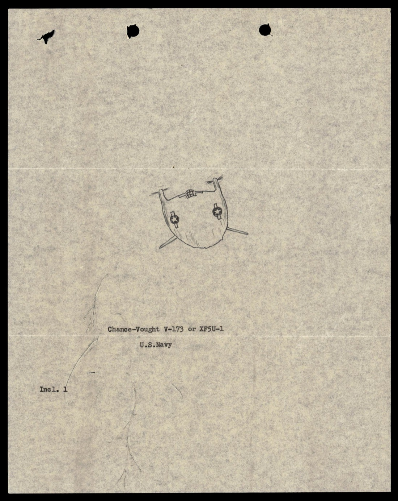

檔案中有一張手繪草圖，標示「Chance-Vought V-173 or XF5U-1 / U.S.Navy / Incl. 1」。

V-173 是 Chance-Vought 公司 1942 年的圓盤型實驗機原型（綽號「Flying Pancake」），1947 年成熟版 XF5U-1 完成但未飛行；計畫 1947 年 8 月取消。XF5U-1 的圓盤直徑約 28 ft，兩具螺旋槳，外型確實近似一般大眾心目中的「飛碟」。

這張草圖出現在這份 FSR 200-4 檔案的工程意義：當某個目擊者描述「圓盤型」，調查員會以 V-173/XF5U-1 為「已知圓盤型飛行器」的基準，問目擊者「是否更像這個 / 不像這個」。也就是說，AMC 已經有了標準對照圖卡。對照基準存在這件事本身告訴我們：1949 年的調查員不是把「圓盤」直接歸類為「不存在」，而是先和已知工程結果比對，再判別。

## 12. 觀察

**(1) FSR 200-4 是 Project Sign / Grudge 的工程化基礎建設**：1948-02-06 USAF 直送 AMC 指令 + 1948-11-02 FSR 200-4 標準表 + 各地 FSC 平行回報 + AMC 中央年度結卷。這個基礎建設運轉了 21 年（1948 → 1969 Project Blue Book 結束），每年的 case file 都按這個樣式整理。

**(2) 篩選後的子集**：USAF Air Intelligence Requirements Memorandum No. 4（1949-02-15）已經是 FSR 200-4 機制的篩選層。Goose Bay 1949-02-21 案被告知「不在範圍」並撤回，這意味實際進入這份 case file 的案件已經是初步篩選後的剩餘集合。原始流量更大。

**(3) 自然現象的吸納能力**：日本 1949-01-25 流星案、Chanute Sgt Houtag 1948-12-08「不像流星」案，都呈現 FSR 200-4 同時收進自然現象和真正未識別案。檔案不做事前篩選，是 AMC 中央事後做分類，這保留了原始證據完整性。Project Blue Book 後期常被批評「故意把案件分類為自然現象以結案」，但 FSR 200-4 機制本身設計是把所有案件都收進來，分類是分開的步驟。

**(4) 飛行員 vs 地面目擊**：1948-12-03 Fairfield-Suisun、1949-07-25 Clark Cub Cruiser、1949-07-26 Spokane Bill Miller、1949-08-22 Seattle 三位 AACW 中隊管制員，這些案件的證人都具有航空背景（飛行員、空管、雷達操作員）。文件中沒有看到對「業餘」目擊者的特殊處理，但案件的篩選清單顯示 AMC 偏好可量化、有航空背景的觀察。

**(5) Chance-Vought 對照圖的隱含意義**：1948-49 年的調查員手上有「已知圓盤型」基準圖。這個基準圖的存在說明 AMC 在判別目擊時的工程嚴謹度：他們不直接把「圓盤」歸類為「不可能」，而是先和已知圓盤型量產載具比對，再做差異化分析。

**(6) 地理分布**：本份檔案的案件覆蓋美國本土多州（CA, WA, ID, IL, MA, MO, PA, AL, SC 等）+ 加拿大 Goose Bay + 紐芬蘭 St Johns + 夏威夷 Hickam + 日本中央，美軍駐地的全球觸角第一次完整地把飛碟資料蒐集系統打開來。

## 13. 跨檔案連結

- **[#017 AMC flying disc 1947 / Project Sign 起源公文鏈](../017-18_100754_general_1946-7_vol_2/report.md)**：本檔案是 #017 立案令的執行層。1947-12-30 USAF 對 AMC 發出立案令；1948-02-06 USAF 對所有指揮部發布「飛碟報告直送 AMC」指令；1948-11-02 FSR 200-4 標準化案件格式；1948-12-03 第一個 FSR 200-4 案件落地（Fairfield-Suisun）；1950-01-09 Lowry FSC 結卷上呈，覆蓋 1948-12 → 1949-12 全部案件。Project Sign（1948-01 → 1949-02）的工程基建在這份檔案中完整呈現。
- **[#023 USAFE → Cabell 1948-11](../023-341_110448_records_relating_to_intelligence_1948-1955_netherlands/report.md)**：本檔案 1948-12 Fairfield-Suisun 案發生在 Cabell 接到 USAFE 報告後一個月。兩個系統並行運轉：USAFE 走 DoI 高機密管道（#023 → Cabell），AMC FSR 200-4 走全境通用管道（#025）。
- **[#024 Russell 1955 蘇聯飛碟目擊](../024-341_110677_numerical_file_5-2500_azerbaijan/report.md)**：1955 IR 193-55 報告中 USAIRA Ryan 寫「lends credence to many 'saucer' reports」，「many saucer reports」指的就是 FSR 200-4 系統 1948-1955 累積的這些案件。

## 14. 來源

- 原始檔案：[U.S. Department of War — 342_HS1-416511228_319.1 Flying Discs 1949](https://www.war.gov/UFO/#342_HS1-416511228_319.1%20Flying%20Discs%201949)
- PDF 直接下載：`https://www.war.gov/medialink/ufo/release_1/342_hs1-416511228_box186_319.1-flying-discs-1949.pdf`
- 公開日：2026-05-08
- 143 頁，原 RESTRICTED，DECLASSIFIED
