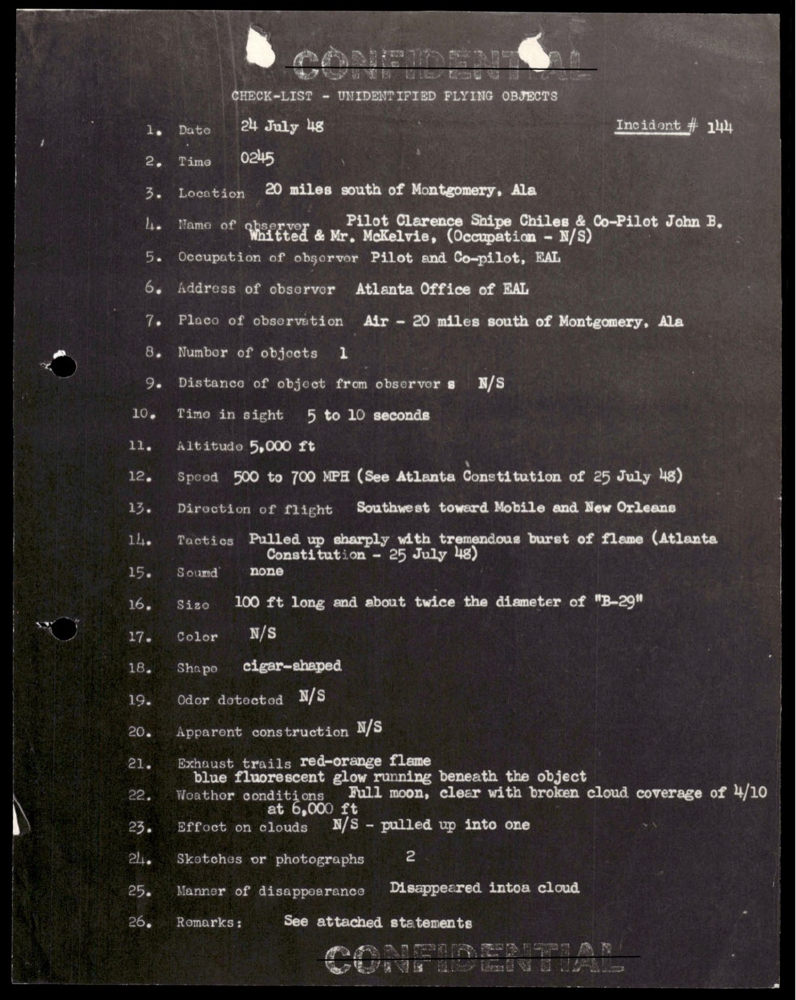
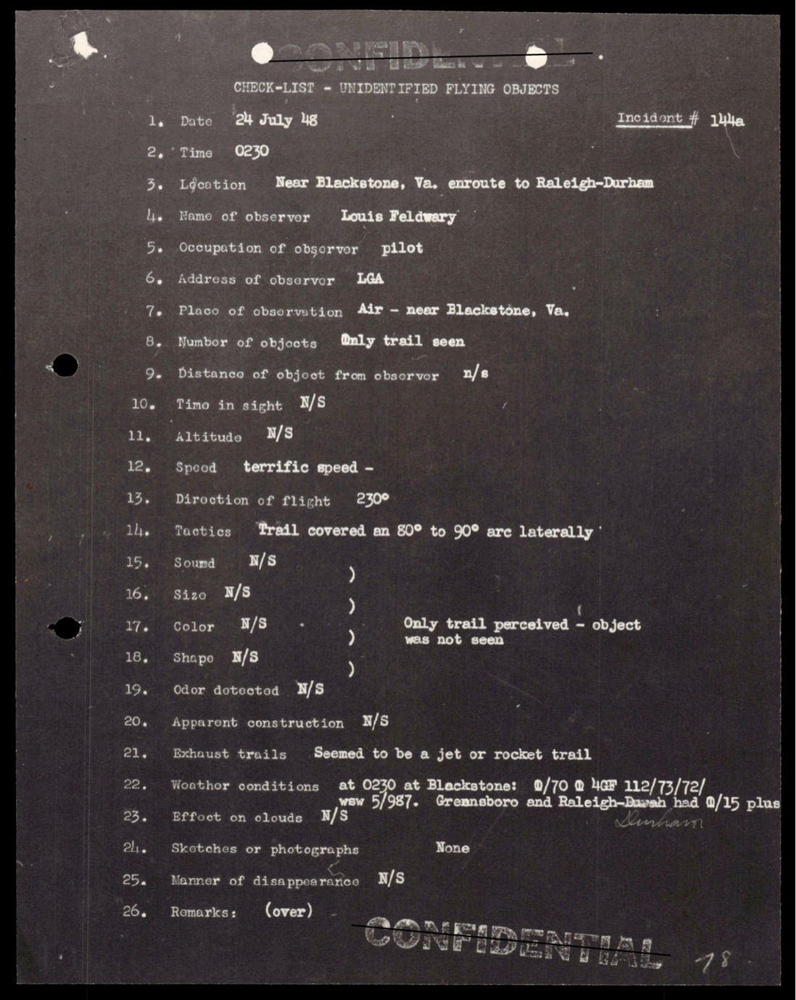
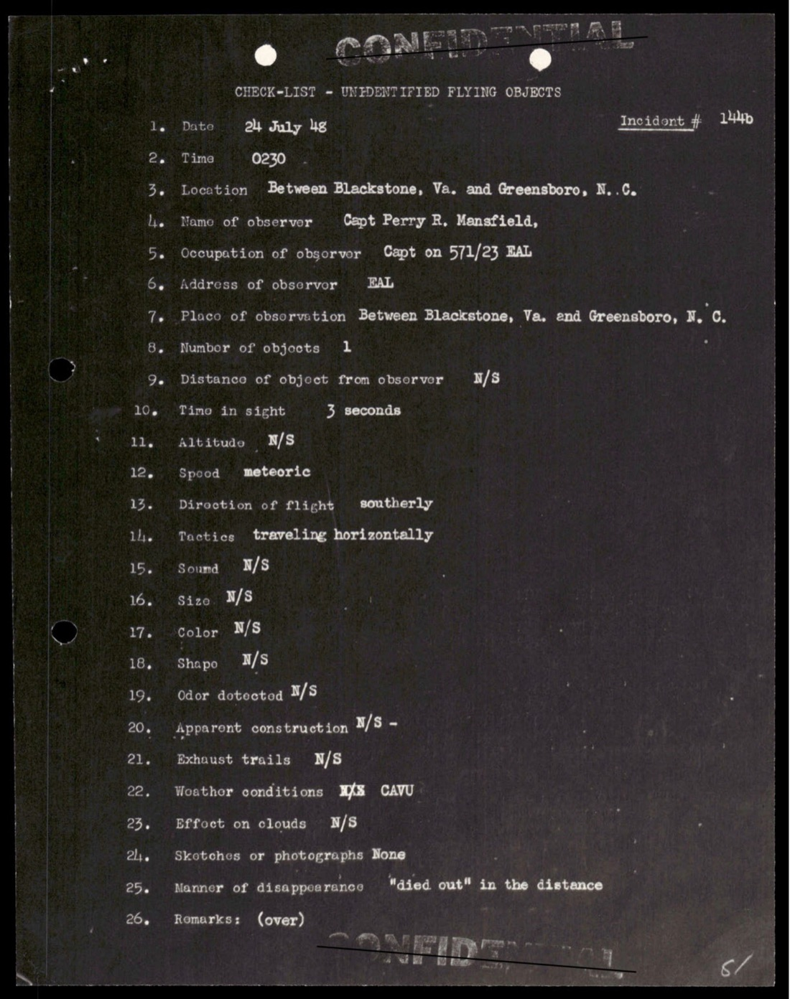
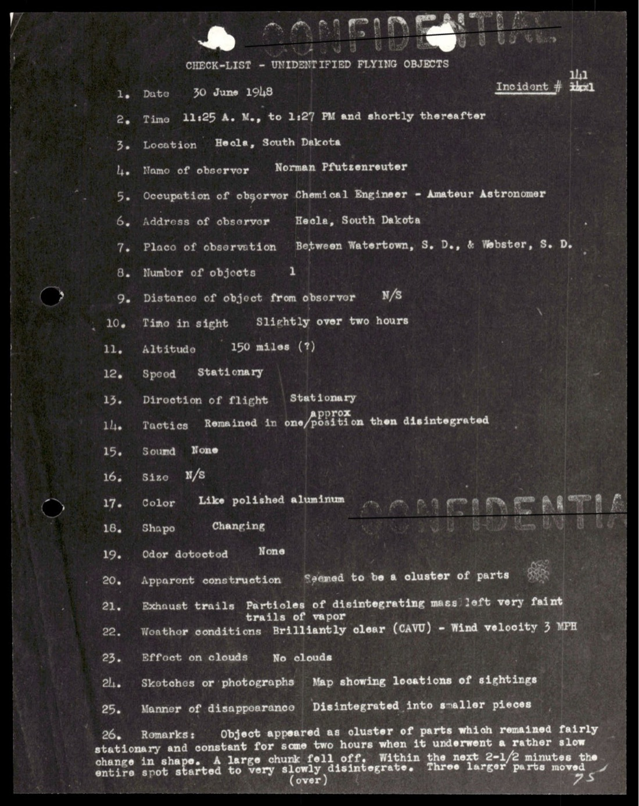
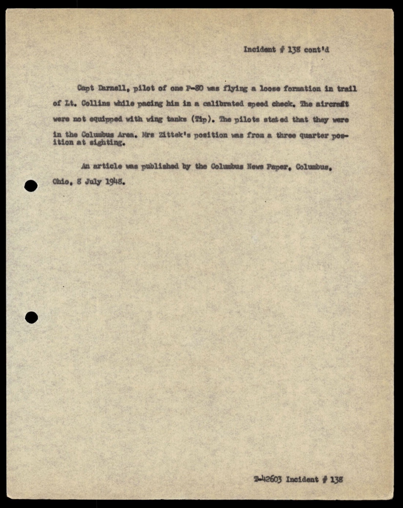
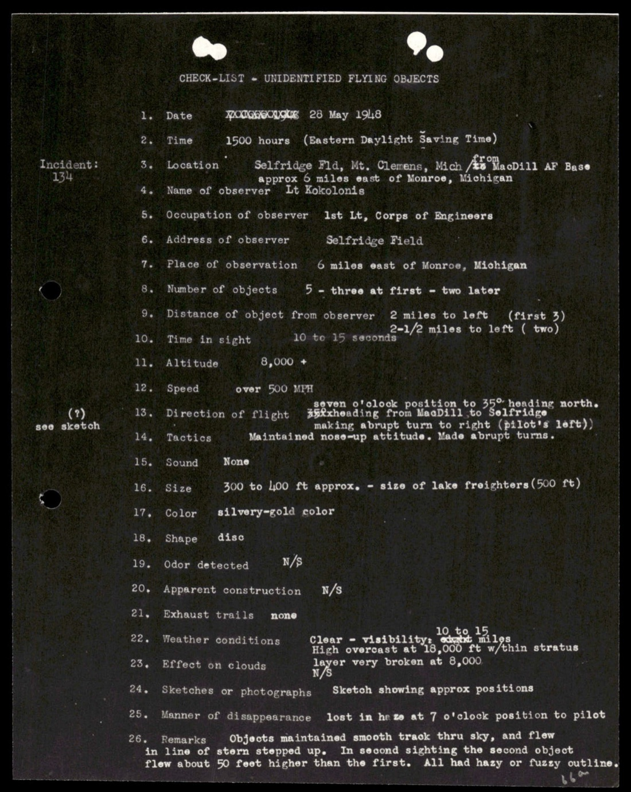
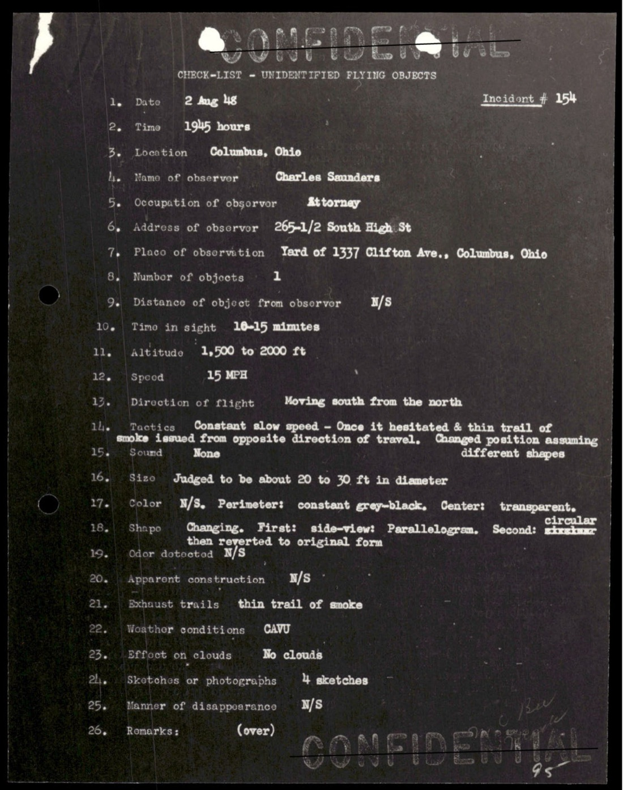
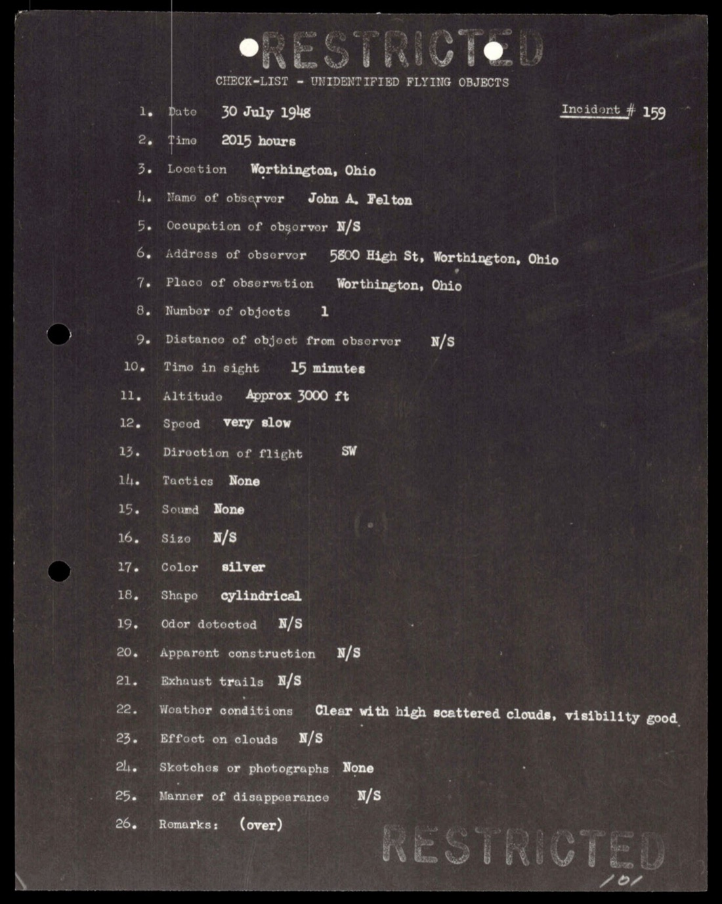
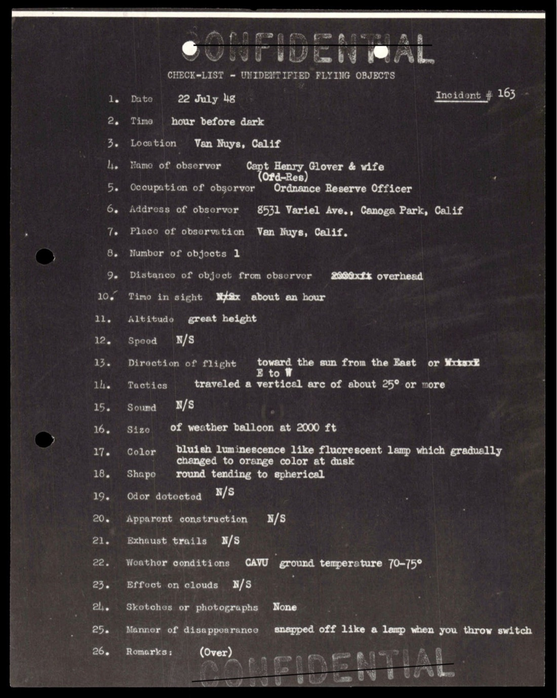

# #026 Project Sign Incident Summaries 101-172：1948 Mantell 後到 Estimate of Situation 草稿期

| 欄位 | 內容 |
|---|---|
| 檔案編號 | 38_143685_box_Incident_Summaries_101-172 |
| 來源機關 | AMC Wright-Patterson AFB Project Sign |
| 日期範圍 | 1948-02-18（#103）→ 1948-08（#172）|
| 頁數 | 178 頁，覆蓋 Incident #101 至 #172 |
| 機密層級 | RESTRICTED / CONFIDENTIAL ／ DECLASSIFIED |
| 公開日 | 2026-05-08 |

## 為什麼這份檔案重要

這是 [#028 Incident Summaries 1-100](../028-38_143685_box7_incident_summaries_1-100/report.md) 的續編。1-100 卷收的是 1947 飛碟潮起源 + 1948-01 Mantell day；本卷 101-172 涵蓋 1948-02 到 1948-08，正好是 Project Sign 內部「Estimate of the Situation」TS 草稿撰寫期。後者據 Edward Ruppelt 1956 年回憶錄稱傾向「extraterrestrial」結論，但被 USAF 參謀長 Vandenberg 將軍駁回。

本卷最關鍵案件：**Incident #144，1948-07-24 Chiles-Whitted 案**，Eastern Airlines DC-3 兩位民航飛行員 Captain Clarence S. Chiles 與 First Officer John B. Whitted 在 Montgomery, Alabama 南方 20 英里 5,000 ft 高度，與一架 100 英尺長雪茄型物體近距離擦身。物體拉升後消失於雲中，留下紅橘色火焰尾跡和藍色螢光輝光。這是 Project Sign 任期內第二知名的案件（僅次於 Mantell）。

另一個鑑別力極高的案件：**Incident #140，1948-06-30 Hecla, South Dakota 案**，化學工程師兼業餘天文學家 Norman Pfutzenreuter 在 South Dakota 觀察一個「估計 150 英里高度、停留 2 小時、最終解體」的「拋光鋁色」物體。150 英里高度遠超過任何已知 1948 年飛機性能。

## 1. Incident #144：Chiles-Whitted Eastern Airlines（1948-07-24）

> 1. Date 24 July 48
> 2. Time 0245
> 3. Location 20 miles south of Montgomery, Ala
> 4. Name of observer Pilot Clarence Shipe Chiles & Co-Pilot John B. Whitted; passenger Mr. McKelvie (Occupation - N/S)
> 5. Occupation of observer Pilot and Co-pilot, EAL
> 6. Address of observer Atlanta Office of EAL
> 7. Place of observation Air - 20 miles south of Montgomery, Ala.
> 8. Number of objects 1
> 10. Time in sight 5 to 10 seconds
> 11. Altitude 5,000 ft
> 12. Speed 500 to 700 MPH (See Atlanta Constitution of 25 July 48)
> 13. Direction of flight Southwest toward Mobile and New Orleans
> 14. Tactics Pulled up sharply with tremendous burst of flame (Atlanta Constitution - 25 July 48)
> 15. Sound none
> 16. Size 100 ft long and about twice the diameter of "B-29"
> 17. Color N/S
> 18. Shape cigar-shaped
> 21. Exhaust trails red-orange flame; blue fluorescent glow running beneath the object
> 22. Weather conditions Full moon, clear with broken cloud coverage of 4/10 at 6,000
> 25. Manner of disappearance Disappeared into a cloud (pulled up into one)

> 1. 日期 1948-07-24
> 2. 時間 0245
> 3. 地點 Alabama 州 Montgomery 南方 20 英里
> 4. 目擊者 機長 Clarence Shipe Chiles 與副機長 John B. Whitted；乘客 Mr. McKelvie
> 5. 職業 Eastern Airlines (EAL) 機長與副機長
> 6. 住址 EAL Atlanta 辦公室
> 7. 觀察地點 空中，Montgomery 南方 20 英里
> 8. 物體數量 1
> 10. 停留時間 5 至 10 秒
> 11. 高度 5,000 英尺
> 12. 速度 500 至 700 mph（參 Atlanta Constitution 1948-07-25）
> 13. 飛行方向 西南，朝 Mobile 與 New Orleans
> 14. 機動 突然拉升，伴隨巨大火焰爆射
> 15. 聲音 無
> 16. 尺寸 100 英尺長，直徑約 B-29 的兩倍
> 17. 顏色 未述
> 18. 形狀 雪茄型
> 21. 尾流 紅橘色火焰；下方有藍色螢光輝光
> 22. 天氣 滿月，晴朗，6,000 ft 處有 4/10 破雲
> 25. 消失方式 急拉進雲中

工程鑑別力：
- **雪茄型 100 ft 長 + 直徑 B-29 兩倍**：B-29 翼展 43 m，所以這物體直徑約 86 m。100 英尺長 = 30 米，所以直徑 86 m 與長度 30 m 矛盾。可能性：(a) Chiles/Whitted 把「直徑」誤指「翼展」級的某個尺度，或 (b) 物體實際是巨型短粗雪茄型，比例與 B-29 完全不同。
- **5-10 秒視窗 + 500-700 mph + 突然拉升**：DC-3 巡航約 200 mph，物體以 2.5-3.5 倍速度迎面通過，並在錯身瞬間拉升消失於雲層。
- **「藍色螢光輝光下方」**：1948 年最先進的尾流可視化是火箭燃料尾焰。「螢光輝光」+「在物體下方非後方」不符合任何 1948 年已知推進方式。
- **乘客 Mr. McKelvie 也看到了**：3 名目擊者中 1 人是 paying passenger，非空勤組員。

Chiles 與 Whitted 1948-07-25 在 Atlanta Constitution 公開談這次目擊，引發美國全國新聞報導（《紐約時報》《Time 雜誌》《Newsweek》都跟進）。Project Sign 內部把此案列為「Estimate of the Situation」草稿的核心案例之一，與 Mantell 案併列。USAF 後續官方解釋為「球狀閃電 / bolide / 流星」，但火焰、形狀、長度等特徵不符合 1948 年已知的火球流星行為。

### 1.1 Incident #144 同夜的擴展目擊

同一夜 Chiles-Whitted 案的 5 小時內，Virginia 也有目擊者報告：

> 1. Date 24 July 48
> 2. Time 0230
> 3. Location Near Blackstone, Va, enroute to Raleigh-Durham
> 4. Name of observer Louis Feldwary
> 5. Occupation of observer pilot
> 6. Address of observer EAL
> 8. Number of objects Only trail seen
> 12. Speed terrific speed
> 13. Direction of flight 230°
> 14. Tactics "Trail covered an 80° to 90° arc laterally"
> 17. Color N/S - Only trail perceived, object was not seen

> 1. 日期 1948-07-24
> 2. 時間 0230
> 3. 地點 Blackstone（Virginia）附近，飛往 Raleigh-Durham 途中
> 4. 目擊者 Louis Feldwary
> 5. 職業 飛行員
> 6. 住址 EAL（Eastern Airlines）
> 8. 物體數量 只見到尾流
> 12. 速度 極快
> 13. 飛行方向 230°
> 14. 機動 「尾流橫向覆蓋 80° 到 90° 弧度」
> 17. 顏色 未述（只看到尾流，未見物體本身）

> 1. Date 24 July 48   Incident # 144[?]
> 2. Time 0230
> 3. Location Between Blackstone, Va. and Greensboro, N.C.
> 4. Name of observer Capt Perry R. Mansfield
> 5. Occupation of observer Capt on 571/23 EAL
> 8. Number of objects 1
> 10. Time in sight 3 seconds
> 12. Speed meteoric
> 13. Direction of flight southerly
> 22. Weather conditions CAVU
> 25. Manner of disappearance "fased out" in the distance

> 1. 日期 1948-07-24
> 2. 時間 0230
> 3. 地點 Blackstone (Virginia) 至 Greensboro (North Carolina) 之間
> 4. 目擊者 Capt Perry R. Mansfield
> 5. 職業 EAL 571 班次第 23 班的機長
> 8. 物體數量 1
> 10. 停留時間 3 秒
> 12. 速度 流星級
> 13. 飛行方向 南向
> 22. 天氣 CAVU（雲底高、能見度佳）
> 25. 消失方式 在遠處「淡出」

Project Sign 把同一夜 Virginia 到 Alabama 三起 EAL 機組目擊（Feldwary、Mansfield、Chiles-Whitted）連結成單一物體軌跡：從 Virginia 沿 230° 方位飛行到 Alabama。

## 2. Incident #140：Hecla SD 化學工程師目擊（1948-06-30）

> 1. Date 30 June 1948   Incident # 140
> 2. Time 11:25 A. M. to 1:27 PM and shortly thereafter
> 3. Location Hecla, South Dakota
> 4. Name of observer Norman Pfutzenreuter
> 5. Occupation of observer Chemical Engineer - Amateur Astronomer
> 6. Address of observer Hecla, South Dakota
> 7. Place of observation Between Watertown, S. D., & Webster, S. D.
> 8. Number of objects 1
> 10. Time in sight Slightly over two hours
> 11. Altitude 150 miles (?)
> 12. Speed Stationary
> 13. Direction of flight Stationary
> 14. Tactics Remained in one position then disintegrated
> 15. Sound None
> 17. Color Like polished aluminum
> 18. Shape Changing

> 1. 日期 1948-06-30   案件編號 #140
> 2. 時間 11:25 AM 至 13:27 之後不久
> 3. 地點 South Dakota 州 Hecla
> 4. 目擊者 Norman Pfutzenreuter
> 5. 職業 化學工程師（業餘天文學家）
> 6. 住址 South Dakota 州 Hecla
> 7. 觀察地點 Watertown 與 Webster（南達科他）之間
> 8. 物體數量 1
> 10. 停留時間 略多於 2 小時
> 11. 高度 150 英里（?）
> 12. 速度 靜止
> 13. 飛行方向 靜止
> 14. 機動 停留一位置不動，最終解體
> 15. 聲音 無
> 17. 顏色 像拋光鋁
> 18. 形狀 變化中

工程鑑別力：
- **150 英里高度 + 靜止 2 小時 + 解體**：1948 年沒有任何工程載具可以在 150 英里（240 km，相當於熱層）停留 2 小時。氣象氣球最高約 18-30 英里。1948 年 V-2 火箭可達 90 英里但是彈道飛行不停留。Sputnik 1957 年才出現。150 英里高度 + 靜止 + 拋光鋁色不對應任何 1948 已知工程候選人。
- **「Changing shape」+「Disintegrated」**：暗示物體可能不是固體載具，而是某種高層大氣的物理現象（夜光雲？極光相關？）。但業餘天文學家會把這類自然現象認得出來，所以 Pfutzenreuter 排除了常見的解釋。
- **觀察者背景**：化學工程師（量化背景）+ 業餘天文學家（識別已知天體經驗）。對 1948 年 Project Sign 而言這是高可信度證人組合。

## 3. Incident #138：P-80 戰機 + 平民同步目擊（1948-07 Columbus, Ohio）

Incident #138 cont'd：

> Capt Tamell, pilot of one P80 was flying a loose formation in trail of Lt. Collins while pacing him in a calibrated speed check. The aircraft were not equipped with wing tanks (Tip). The pilots stated that they were in the Columbus Area. Mrs Zittek's position was from a three quarter position at sighting.
>
> An article was published by the Columbus News Paper, Columbus, Ohio, 8 July 1948.

> Capt Tamell 駕駛一架 P-80，鬆散編隊跟在 Lt. Collins 後方進行校準速度檢查。飛機未裝翼端油箱。兩位飛行員陳述他們當時在 Columbus 地區。Mrs Zittek 從 3/4 角度位置目擊。
>
> 相關新聞登於 1948-07-08 Columbus News Paper。

P-80 是當時 USAF 第一線量產噴射戰機（最高速度 600 mph）。Capt Tamell + Lt Collins 兩位現役戰機飛行員的目擊 + 地面平民 Mrs Zittek 從 3/4 角度的獨立目擊 + 同日報紙登載，這是少見的 3 證人「空 + 地」並進案件。

## 4. Incident #134：Selfridge Field 5 機編隊（1948-05-28）

> 1. Date 28 May 1948
> 2. Time 1500 hours (Eastern Daylight Saving Time)
> 3. Location Selfridge Fld, Mt. Clemens, Mich, approx 6 miles east of Monroe, Michigan
> 4. Name of observer Lt Kokolonis
> 5. Occupation of observer 1st Lt, Corps of Engineers
> 6. Address of observer Selfridge Field
> 8. Number of objects 5 - three at first - two later
> 9. Distance of object from observer 2 miles to left (first 3); 2-1/2 miles to left (two)
> 10. Time in sight 10 to 15 seconds
> 11. Altitude 8,000 ft
> 12. Speed over 500 MPH
> 13. Direction of flight from MacDill to Selfridge, making abrupt turn to right (pilot's left)
> 14. Tactics Maintained nose-up attitude. Made abrupt turns.

> 1. 日期 1948-05-28
> 2. 時間 1500 EDT
> 3. 地點 Michigan 州 Mt. Clemens 的 Selfridge Field，約位於 Monroe 東方 6 英里
> 4. 目擊者 Lt Kokolonis
> 5. 職業 工兵團 1st Lt
> 6. 住址 Selfridge Field
> 8. 物體數量 5（最初 3 個，稍後 2 個）
> 9. 距離 左方 2 英里（前 3 個）；左方 2.5 英里（後 2 個）
> 10. 停留時間 10 至 15 秒
> 11. 高度 8,000 英尺
> 12. 速度 超過 500 mph
> 13. 飛行方向 從 MacDill 朝 Selfridge，再急右轉（飛行員左轉）
> 14. 機動 保持機鼻上揚，做急轉

Selfridge Field 就是 [#031](../031-65_hs1-101634279_100-de-18221_serial_844_detroit_1958/report.md) Detroit 案中 Weaver 嘗試致電的那個基地。Lt Kokolonis（工兵團軍官）駕駛飛行中目擊 5 架編隊「保持機鼻上揚 + 急轉」。「保持機鼻上揚」+「急轉」是 1948 年沒有任何已知量產載具的高機動運動學組合。

## 5. Incident #154：Columbus Ohio 律師目擊形狀變化（1948-08-02）

> 1. Date 2 Aug 48   Incident # 154
> 2. Time 1945 hours
> 3. Location Columbus, Ohio
> 4. Name of observer Charles Senders
> 5. Occupation of observer attorney
> 7. Place of observation Yard of 1337 Clifton Ave., Columbus, Ohio
> 8. Number of objects 1
> 10. Time in sight 10-15 minutes
> 11. Altitude 1,500 to 2000 ft
> 12. Speed 15 MPH
> 13. Direction of flight Moving south from the north
> 16. Size Judged to be about 20 to 30 ft in diameter
> 17. Color N/S. Perimeter: constant grey-black, Center: transparent
> 18. Shape Changing. First: sidewiew Parallelogram. Second: Sinmilar hourglass then returning to original form

> 1. 日期 1948-08-02   案件編號 #154
> 2. 時間 19:45
> 3. 地點 Ohio 州 Columbus
> 4. 目擊者 Charles Senders
> 5. 職業 律師
> 7. 觀察地點 Columbus, Ohio, 1337 Clifton Ave 院子
> 8. 物體數量 1
> 10. 停留時間 10-15 分鐘
> 11. 高度 1,500 至 2,000 英尺
> 12. 速度 15 mph
> 13. 飛行方向 由北向南移動
> 16. 尺寸 估計直徑 20 至 30 英尺
> 17. 顏色 未述。邊緣：恆定灰黑色；中心：透明
> 18. 形狀 變化中。首先：側視平行四邊形；其次：類似沙漏，然後返回原形狀

「形狀變化」+「邊緣灰黑、中心透明」+「20-30 ft + 15 mph + 1500 ft 高度」+「10-15 分鐘」是極不尋常的案件組合。Senders（律師）作為證人具有專業背景的可信度。

## 6. Incident #159：Worthington, Ohio 4 物編隊（1948-07-30）

1948-07-30 20:15 Worthington (Ohio) 居民 John A. Felton 看到 4 個物體編隊，高度約 3,000 ft，停留 15 分鐘。Ohio 1948-07 / 08 兩個月內多起獨立目擊（Columbus #138、Senders #154、Felton #159），地理集中度高。Project Sign 內部把這些案件視為「群聚現象」（cluster phenomenon）。

## 7. Incident #165：Van Nuys CA 兵器後備官員夫婦（1948-07-22）

> 1. Date 22 July 48   Incident # 165
> 2. Time hour before dark
> 3. Location Van Nuys, Calif
> 4. Name of observer Mr. [redacted] & wife
> 5. Occupation of observer Ordnance Reserve Officer
> 6. Address of observer 8531 Variel Ave., Canoga Park, Calif
> 8. Number of objects 1
> 10. Time in sight about an hour
> 11. Altitude great height
> 12. Speed N/S
> 13. Direction of flight cut the sun from the East or West [unclear]
> 14. Tactics traveled a vertical arc of about 25° or more
> 16. Size Of weather balloon at 2000 ft
> 17. Color bluish luminescence like fluorescent lamp which gradually changed to orange color at dusk
> 18. Shape round tending to spherical

> 1. 日期 1948-07-22   案件編號 #165
> 2. 時間 日落前一小時
> 3. 地點 加州 Van Nuys
> 4. 目擊者 [遮蔽] 先生與夫人
> 5. 職業 兵器後備軍官
> 6. 住址 加州 Canoga Park, 8531 Variel Ave
> 8. 物體數量 1
> 10. 停留時間 約一小時
> 11. 高度 高空
> 12. 速度 未述
> 13. 飛行方向 [文字不清]
> 14. 機動 走出約 25° 或更大垂直弧度
> 16. 尺寸 像 2000 ft 高度的氣象氣球
> 17. 顏色 藍色螢光（像螢光燈），黃昏時逐漸變橘色
> 18. 形狀 圓形偏球形

「藍色螢光 → 黃昏變橘色」是高層大氣物體被太陽從下方照射、隨日光角度變化反射色彩的典型訊號。但「停留 1 小時 + 25° 垂直弧度移動」對應的速度（從觀察角度推算）不是氣球可以達到的。可能是高空研究氣球，但 Van Nuys 1948 年附近沒有對應的氣球放飛紀錄。

## 8. Project Sign 的「Estimate of the Situation」TS 草稿背景

本卷 101-172 涵蓋的 1948-02 → 1948-08，正是 Project Sign 內部撰寫並上呈 USAF 總部「Estimate of the Situation」TS 草稿的時間窗。根據 Edward Ruppelt（Project Blue Book 主任 1951-53）1956 年回憶錄《The Report on Unidentified Flying Objects》：

- 1948-08 Project Sign 完成 Estimate 草稿，傾向 ET 結論。
- 1948-09 草稿經 AMC 司令上呈 USAF 參謀長 Vandenberg 將軍。
- 1948-12 Vandenberg 駁回，理由「缺乏物理證據」。
- 1949-02 Project Sign 改名 Grudge，對 ET 結論的內部立場大幅後退。

支撐 Estimate 草稿的核心案件正是本卷的 Chiles-Whitted（#144）、Hecla SD（#140）、以及前卷 [#028](../028-38_143685_box7_incident_summaries_1-100/report.md) 的 Arnold（#17）、Mantell（#30 系列）、Muroc（#1）、Lake Mead（#53）。

Vandenberg 駁回 Estimate 草稿的決定，標誌 USAF 官方立場從「現象可能是真實的」往「個案多有解釋」的轉向。本卷 101-172 是這個轉向發生前的最後一批高鑑別力案件。

## 9. 觀察

**(1) 案件密度的時間分布**：1947-06 Arnold 起到 1948-08 約 14 個月，Project Sign 累積到 #172。平均每月約 12 件，但實際分布不均：1947-06/07 月有 #1 到 #100 大部分（飛碟潮高峰），1948-01 Mantell day 集中爆發 #30/#33 系列，1948-05 到 1948-08 又一波春末夏初集中（#134、#138、#140、#144、#154、#159、#165）。

**(2) 民航客機機組成為證人來源**：本卷的 EAL Chiles-Whitted（#144）、Feldwary、Mansfield 同夜 3 起，以及 #138 P-80 戰機 + 民間女性同步目擊，顯示 1948 年中期「空中職業人員」作為證人的比重快速上升。這比 [#017](../017-18_100754_general_1946-7_vol_2/report.md) 1947 期間（多為地面平民 + 軍方控制塔）有顯著差異。

**(3) 物體類型的多樣化**：本卷案件中出現了 (a) 雪茄型大型載具（Chiles-Whitted #144）、(b) 高空靜止解體型（Hecla #140）、(c) 形狀變化型（Senders #154）、(d) 螢光球體（Van Nuys #165）。Project Sign 的工程分類問題開始浮現：「飛碟」這個單一標籤已經容納不下 1948 年中期目擊報告的形態多樣性。

**(4) 媒體報導的反饋迴路**：本卷至少 2 起案件（#138 Columbus News Paper、#144 Atlanta Constitution）在事發後 1-2 天內登上地方/全國媒體。Project Sign 的 case file 直接附上報紙剪報作為佐證。媒體報導與案件處理之間的雙向反饋迴路，在這個時期已經形成。

**(5) Chiles-Whitted 案的後續官方解釋**：USAF 後續官方解釋（USAF Project Blue Book 結論）為「球狀閃電 / bolide / 火球流星」。但 Chiles-Whitted 描述的「100 ft 雪茄型 + 機鼻拉升 + 紅橘色火焰尾 + 藍色螢光輝光下方 + 5-10 秒視窗 + 急拉進雲中」在工程上無法與單一火球流星調和。Project Sign 內部分析 1948 年版本當時並未接受這個解釋。

## 10. 跨檔案連結

- **[#028 Project Sign Incident Summaries 1-100](../028-38_143685_box7_incident_summaries_1-100/report.md)**：本卷的前一冊。1-100 收 1947 飛碟潮起源 + 1948-01 Mantell day。本卷 101-172 接續 1948-02 之後到 1948-08，是 Project Sign 任期內第二大段案件。
- **#027 Incident Summaries 173-233**：本卷的後一冊。173 起的案件對應 Project Sign 末期（Estimate 草稿被駁回前後）到 1949-02 改名 Grudge 之前的時間窗。
- **[#017 AMC flying disc 1947 / Project Sign 起源公文鏈](../017-18_100754_general_1946-7_vol_2/report.md)**：本卷的內部脈絡支柱。Estimate of the Situation 草稿正是回應 Twining 信「the phenomenon is something real」的 ET 假設延伸。Vandenberg 1948-12 駁回 Estimate，等於在政策上把這條線壓回 [#017 Twining 信第 2.h.(3) 段「foreign nation」這個括號裡。

## 11. 來源

- 原始檔案：[U.S. Department of War — 38_143685_box_Incident_Summaries_101-172](https://www.war.gov/UFO/#38_143685_box_Incident_Summaries_101-172)
- PDF 直接下載：`https://www.war.gov/medialink/ufo/release_1/38_143685_box7_incident_summaries_101-172.pdf`
- 公開日：2026-05-08
- 178 頁，原 RESTRICTED / CONFIDENTIAL，DECLASSIFIED
