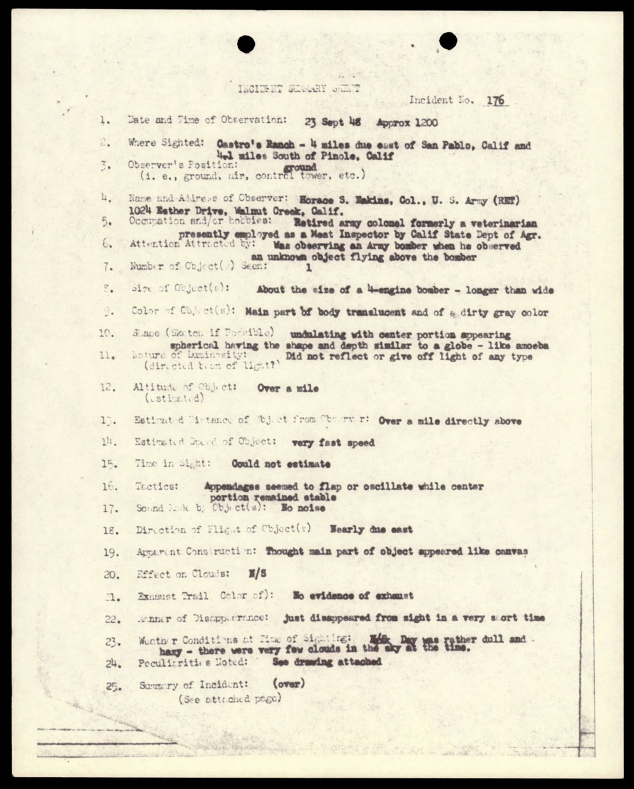
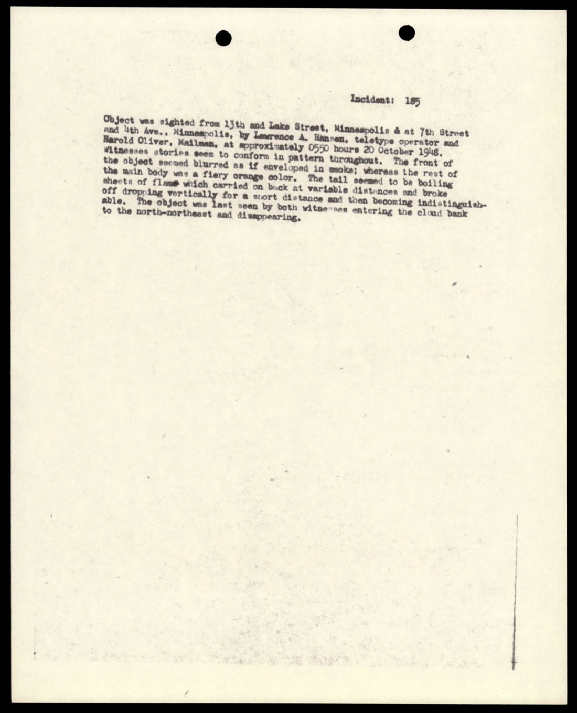
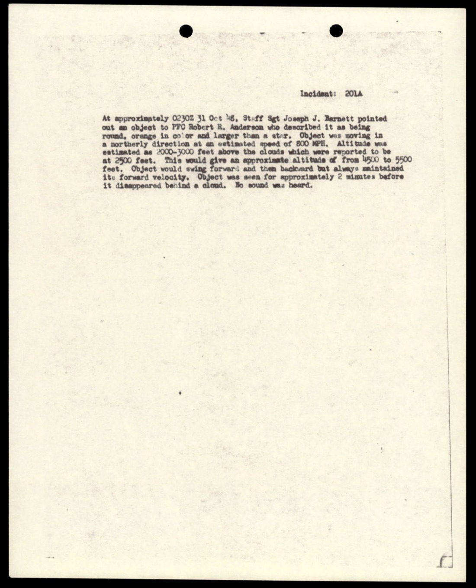
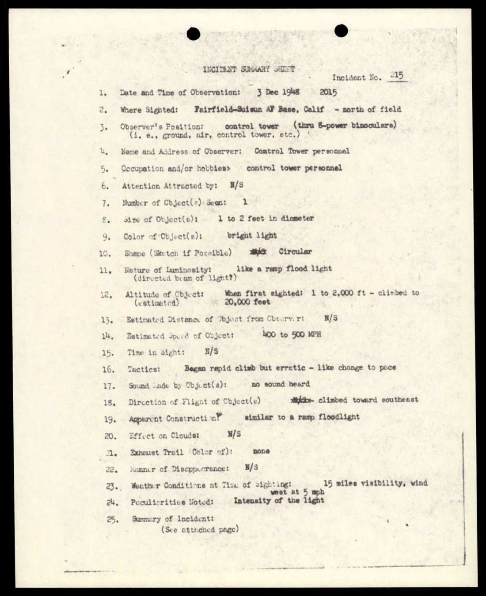
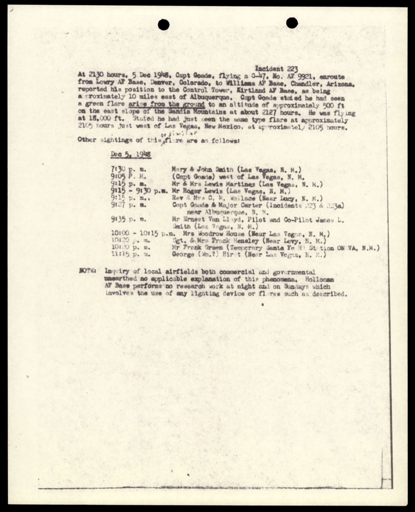
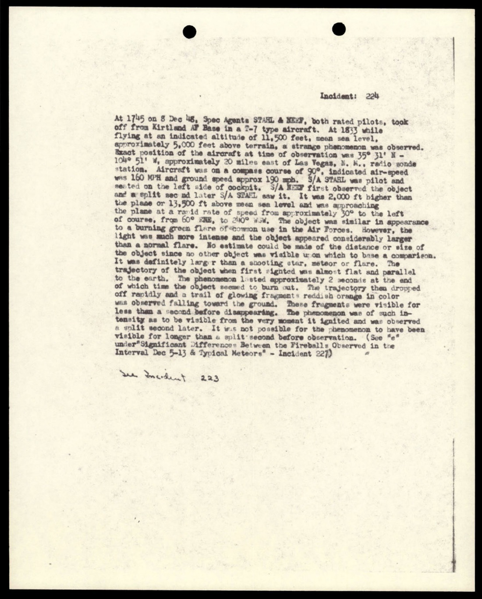
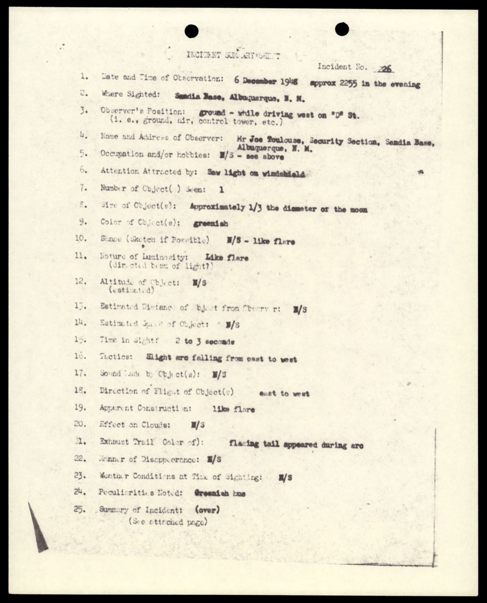

# #027 Project Sign / Grudge Incident Summaries 173-233：1948 末 Green Fireballs + Project Twinkle 前夜

| 欄位 | 內容 |
|---|---|
| 檔案編號 | 38_143685_box_Incident_Summaries_173-233 |
| 來源機關 | AMC Wright-Patterson AFB Project Sign（1949-02 改名 Grudge） |
| 日期範圍 | 1948-09（#176）→ 1949-01 / 02（#233）|
| 頁數 | 144 頁，覆蓋 Incident #173 至 #233 |
| 機密層級 | RESTRICTED / CONFIDENTIAL ／ DECLASSIFIED |
| 公開日 | 2026-05-08 |

## 為什麼這份檔案重要

這是 Project Sign 案件目錄三冊的最後一冊（接續 [#028](../028-38_143685_box7_incident_summaries_1-100/report.md) 與 [#026](../026-38_143685_box7_incident_summaries_101-172/report.md)）。覆蓋 1948-09 至 1949-02 之間的案件，Project Sign 內部「Estimate of the Situation」TS 草稿被 USAF 參謀長 Vandenberg 駁回前後的時間窗，1949-02 Sign 改名 Grudge。

本卷的核心內容：**1948 年 11-12 月新墨西哥州 / 內華達州 / 亞利桑那州的「Green Fireball」現象**，是 USAF 在 1948-49 期間最關注的單一現象群。包含：

1. **Incident #223**（1948-12-05 21:30）：USAF Capt Goade 駕 C-47 在 Albuquerque 東 10 mi 兩次目擊綠色火球
2. **Incident #224**（1948-12-08 18:33）：AFOSI 特別探員 Stahl & Hess 在 T-7 中見到 13,500 ft MSL 「比一般火焰更強的綠色光體」、橘紅碎片下落
3. **Incident #225**（1948-12-05 18:33）：同上 Stahl 與 Hess 的另一次目擊（重複編號或同案多次）
4. **Incident #226**（1948-12-06 22:55）：Sandia Base 保安單位 Joe Toulouse 開車目擊綠色光體
5. **Incident #227**（1948-12-12 21:02±30s）：**Dr. Lincoln La Paz**（UNM 隕石學系主任，後 Project Twinkle 主要科學家）親身目擊 + 4 名專業證人。

Green Fireballs 的工程鑑別力：
- **沿水平軌跡**（不是流星典型的下行彈道）
- **明亮綠色**（鎂、銅、鋇含量化學特徵，1948 年沒有自然金屬流星已知對應）
- **2-3 秒持續時間**（比典型流星長）
- **不在已知流星雨範圍**（La Paz 1948-12-12 案件離 Quadrantid + Geminid + Persid 都遠）
- **新墨西哥州集中爆發**：地理上集中在 Los Alamos、Sandia Base、Kirtland AFB 三大原子能設施周邊

USAF 對此的反應是 **Project Twinkle**（1949-04 啟動，駐 Holloman AFB，部署紅外/光譜攝影機在 New Mexico 進行系統性監測）。Twinkle 是 USAF 公開記錄中第一個專門為 UAP 現象設計的科學儀器部署任務。

## 1. Incident #176（1948-09-23 ~1200）：San Pablo CA 退役上校目擊

> 176. 23 Sept 48 Approx 1200
> Castro's Ranch - miles due east of San Pablo, Calif and miles South of Pinole, Calif
> Col. Horace S. Bekins, Col., U.S. Army (RET)
> [...] La Rosa Drive, Walnut Creek, Calif.
> Occupation: Retired army colonel formerly a veterinarian
> Presently employed as a Meat Inspector by Calif State Dept of Ag
> Was observing an Army bomber when he observed an unknown object flying above the bomber
>
> About the size of a 1-engine bomber - longer than wide
> Main part of body translucent and of a dirty gray color
> undulating with center portion appearing pearly
> Vertical edges having the shape and depth similar to a globe - like amoeba
> Did not reflect or give off light of any type
> Over a mile [altitude]
> Over a mile directly above
> very fast speed

> 176. 1948-09-23 約 1200
> Castro 牧場 - 加州 San Pablo 正東數英里 / Pinole 南數英里
> Col. Horace S. Bekins，美國陸軍上校（退役）
> [...] 加州 Walnut Creek La Rosa Drive
> 職業：退役陸軍上校，原職為獸醫
> 目前任職加州農業部門肉品檢查員
> 觀察陸軍轟炸機時，看到一個不明物體在轟炸機上方飛行
>
> 大小約為單引擎轟炸機，長度大於寬度
> 主要機身半透明，髒灰色
> 起伏波動，中央部分呈現珍珠色
> 垂直邊緣有類似地球的形狀深度，像變形蟲
> 不反射也不發光
> 高度超過 1 英里
> 正上方超過 1 英里
> 極快速度

「半透明、髒灰色、起伏波動、像變形蟲」是極不尋常的描述。退役上校 + 獸醫 + 肉品檢查員的背景組合，意味證人對形狀辨識訓練有素，不會輕易把雲或氣球看成怪物。

## 2. Incident #185（1948-10-20 0550）：Minneapolis 雙地點觀察

1948-10-20 凌晨 0550 Minneapolis，A.J. Hansen（teletype operator）與 Harold Oliver（Katleen）在 13th and Lake Street 及 7th Street and 8th Ave 兩地點同步目擊：

> Witnesses: The front of [object had bright] smoke; whereas the rest of [trail] was boiling [...] at variable distances and broke [up] before becoming indistinguishable [as object was] entering the cloud bank.

> 證人：物體前方為明亮 [可見的] 煙；其餘 [尾流] 處則翻騰沸騰 [...] 不規則間隔處分裂解體後變得難以辨識 [當物體] 進入雲層。

兩個獨立地點同步目擊「翻騰煙、不規則間隔解體」的現象。

## 3. Incident #201A（1948-10-31 0230Z）：軍方雙人「擺動但維持前進速度」目擊

> At approximately 0230Z 31 Oct 48, Staff Sgt Joseph J. Barnett pointed out an object to PFC Robert R. Anderson who described it as being round, orange in color and larger than a star. Object was moving in a northerly direction at an estimated speed of 600 MPH. Altitude was estimated as 2000-3000 feet above the clouds which were reported to be at 2500 feet. This would give an approximate altitude of from 4500 to 5500 feet. Object would swing forward and then backward but always maintained its forward velocity. Object was seen for approximately 2 minutes before it disappeared behind a cloud. No sound was heard.

> 1948-10-31 約 0230Z，Staff Sgt Joseph J. Barnett 指出物體給 PFC Robert R. Anderson 看，Anderson 描述為圓形、橘色、比星星大。物體向北移動，估計速度 600 mph。高度估計在雲層上方 2000-3000 英尺，雲底高 2500 英尺，故總高度約 4500-5500 英尺。物體會向前擺、再向後擺，但始終維持向前速度。目擊約 2 分鐘後消失於雲後。無聲。

「擺動但維持前進速度」的運動學特徵在飛行器中是少見的，固體飛行器會因擺動損失前進動量。這個描述比較像是「波浪式滑翔」（surfing motion）或「螺旋路徑投影」。

## 4. Incident #212（1948-12-03 2015）：Fairfield-Suisun AFB 控制塔 8 倍望遠鏡

> Date and Time of Observation: 3 Dec 1948 2015
> Where Sighted: Fairfield-Suisun AF Base, Calif - north of field
> Observer's Position: control tower (thru 8-power binoculars)
> Name and Address of Observer: Control Tower personnel
> Occupation and/or hobbies: control tower personnel
> [...] 1 to 2 feet in diameter
> bright light
> [Shape] Circular - like a ramp flood light
> Altitude Object: When first sighted 1 to 2,000 ft (estimated) 20,000 feet
> [Speed of] Object 400 to 500 MPH
> [Motion] Began rapid climb but erratic - like change to space
> Sound: no sound heard
> Climbed toward southeast

> 觀察時間：1948-12-03 2015
> 地點：加州 Fairfield-Suisun AF Base 北側
> 觀察者位置：控制塔（透過 8 倍望遠鏡）
> 觀察者：控制塔人員
> 職業/嗜好：控制塔人員
> [...] 直徑 1 至 2 英尺
> 亮光
> [形狀] 圓形，類似坡道泛光燈
> 物體高度：初見時 1 至 2,000 英尺，後估約 20,000 英尺
> [物體] 速度 400 至 500 mph
> [運動] 開始急升但軌跡不規則，像是切入空間
> 聲音：未聽見聲音
> 朝東南方爬升

這個案件對應的是 [#025 FSR 200-4 1948-49 彙編](../025-342_hs1-416511228_319.1_flying_discs_1949/report.md) 中的 Fairfield-Suisun 案。同一事件，兩份檔案分別記錄：FSR 200-4 收的是基地內部書面證詞，Incident Summary 收的是 Project Sign 內部的事後重整 Check-List。

## 5. Green Fireballs：1948-12 NM 集中爆發

### 5.1 Incident #223（1948-12-05 21:30）：Capt Goade C-47 雙次目擊

> At 2130 hours, 5 Dec 1948, Capt Goade, flying a C-47, No. AF 9901, enroute from Lowry AF Base, Denver, Colorado, to Williams AF Base, Chandler, Arizona, reported his position to the Control Tower, Kirtland AF Base, as being approximately 10 miles east of Albuquerque. Capt Goade stated he had seen a green flare drive from the south to north toward Albuquerque [...] at an altitude of approximately 500 ft east of his position at about 2127 hours. He was flying at 18,000 ft, and had seen the same type flare at approximately 2105 hours just west of Las Vegas, New Mexico, at approximately [...]

> 1948-12-05 21:30，Capt Goade 駕 C-47（AF 9901）從 Lowry AFB（Denver, CO）飛 Williams AFB（Chandler, AZ）途中，向 Kirtland AFB 控制塔回報位置在 Albuquerque 東約 10 英里處。Capt Goade 陳述他於 21:27 看到一個綠色火焰由南向北朝 Albuquerque 飛 [...] 距他位置東約 500 英尺處。他當時 18,000 英尺巡航高度。他在 21:05 也曾在 Las Vegas（New Mexico）西側看過同類型火焰 [...]

附頁列出當夜的其他綠色火焰目擊：
- Pvt Mary & John Smith（Las Vegas, NM）
- Capt Goade（Las Vegas 西側）
- Mr & Mrs Lewis Martinez（Las Vegas, NM）
- Mr Roger Lewis（Las Vegas, NM）
- Rev S.F. Wallace（Near Las Vegas）
- Capt Goode & Major Carter（Incident near Albuquerque, NM）
- Mr Ernest Van and pilot, co-pilot Smith（Las Vegas, NM）
- Mrs Woodrow House（Near Las Vegas, NM）
- Heseley（Near Las Vegas）
- ★★ Santa Fe ★★（NM）
- t（Near Las Vegas, NM）

一晚之內，至少 11 個獨立目擊點分布在 Las Vegas (NM) - Santa Fe - Albuquerque 三角區域。

### 5.2 Incident #224（1948-12-08 18:33）：AFOSI 探員飛機目擊

> At 1745 on 8 Dec 48, Spec Agents STAHL & HESS, both rated pilots, took off from Kirtland AF Base in a T-7 type aircraft. At 1833 while flying at an indicated altitude of 11,500 feet, mean sea level, approximately 5,000 feet above terrain, a strange phenomenon was observed. Exact position of the aircraft at time of observation was 35° 36' N, 104° 51' W, approximately 20 miles east of Las Vegas, N. M., radio sonde station. Aircraft was on a compass course of 90°, indicated airspeed was 160 MPH and ground speed approx 190 MPH. S/A STAHL was pilot and seated on the left side of cockpit. S/A HESS first observed the object and a split second later S/A STAHL saw it. It was 2,000 ft higher than the plane or 13,500 ft above mean sea level and was approaching the plane at a rapid rate of speed from approximately 30° to the left of course, from 60° to 240°. The object was similar in appearance to a burning green flare of common use in the Air Forces. However, the light was much more intense and the object appeared considerably larger than a normal flare. No estimate could be made of the distance or size of the object since no other object was visible upon which to base a comparison. It was definitely larger than a shooting star, meteor or flare. The trajectory of the object when first sighted was almost flat and parallel to the earth. The object lasted approximately 2 seconds at the end of which time the object seemed to burn out. The trajectory then dropped off rapidly and a trail of glowing fragments reddish orange in color was observed falling toward the ground. These fragments were visible for less than a second before disappearing.

> 1948-12-08 17:45，AFOSI 特別探員 STAHL 與 HESS（兩人均具評等飛行員資格）從 Kirtland AFB 起飛駕駛 T-7。1833 飛行於 11,500 英尺 MSL 高度（地表上方約 5,000 ft）時，觀察到奇特現象。飛機當時位置為 35°36'N, 104°51'W，Las Vegas（NM）radiosonde 站東約 20 英里。航向 90°，指示空速 160 mph，地面速度約 190 mph。STAHL 任飛行員位左座，HESS 先看到物體，瞬間之後 STAHL 也看到。物體位於飛機上方 2,000 ft（即 13,500 ft MSL），由 240° 方位向飛機快速接近（航向左方 30°）。物體外觀類似空軍常用燃燒中綠色火焰，但光度遠強於普通火焰，且物體外觀比普通火焰大得多。由於沒有其他物體可作比較基準，無法估計距離或尺寸。但顯然比流星、火焰或彈丸大。物體初見時軌跡幾乎水平、與地面平行，持續約 2 秒後熄滅。隨後軌跡急下，留下橘紅色發光碎片向地面墜落。這些碎片在消失前可見不到 1 秒。

工程鑑別力：
- **位置精確到秒**：35°36'N 104°51'W（Las Vegas NM 東 20 mi）
- **觀察者背景**：AFOSI 特別探員 + 兩人均為評等飛行員，當時 USAF 最高可信度的證人組合
- **儀器化的飛行參數**：13,500 ft MSL、5,000 ft AGL、160 mph IAS、190 mph GS、90° compass
- **物體運動學**：水平軌跡 → 2 秒燃燒 → 急下伴隨橘紅碎片
- **「比一般火焰強烈得多」**：意味著光度遠超普通信號火焰（軍用）的 1948 年最強基準

「水平軌跡 + 2 秒 + 急下」的綠色光體不符合天然流星（90% 流星沿陡峭下行軌跡）也不符合人造曳光彈（用於空對空通信，但是直線拋物彈道）。

### 5.3 Incident #226（1948-12-06 22:55）：Sandia 保安開車目擊

> 6 December 1948 approx 2255 in the evening
> Sandia Base, Albuquerque, N. M.
> Ground - while driving west on "Y" 9
> Observer: Mr Joe Toulouse, Security Section, Sandia Base, Albuquerque, N. M.
> Saw Light on windshield
> 1 [object]
> Approximately 1/3 the diameter of the moon
> greenish
> Like flare
> 2 to 3 seconds
> [path] are [arcing] falling from east to west

> 1948-12-06 約 22:55 晚上
> Sandia Base, Albuquerque, NM
> 地面 - 駕車向西行於「9」公路
> 觀察者：Mr Joe Toulouse, Sandia Base 安全處
> 看到光在擋風玻璃上
> 1 個物體
> 約月亮直徑的 1/3
> 綠色
> 像火焰
> 2 至 3 秒
> [路徑] 弧線由東向西墜落

Sandia Base 是 1948 年 NM 三大原子能設施之一（與 Los Alamos、Kirtland 並列）。保安人員在原子能設施附近目擊綠色火球，這在 1948-49 期間的政治敏感度極高。

### 5.4 Incident #227（1948-12-12 21:02）：Dr. Lincoln La Paz 親身目擊

> Dr La Paz's attention was directed to an area about 15° west of Z-Cygni by indirect vision he became aware of a very bright green ball (apparent angular diameter 5') to the right of the area in his center field of view which was moving from east to west very low on the horizon. Shouting "Look" to his companions Capt O. L. Phillips, AFRCAP Liaison Officer, Kirtland Fld., Lt Allen Clark, Intel Officer, N. Mex. Wing CAP, and Inspectors Jeffers and AZO Security Service (Los Alamos, N. M.) [...] who then timed duration of fall - 4 watch ranged from 2.1 spoons to 2.3 sec.
>
> The path of the green ball was almost exactly horizontal (altitude estimated as only 3 or 4 degrees) until just a tenth of a second or so before it disappeared. During the last one or two tenths of a second of its visibility a slight but definite curvature downward developed in its path. From the very beginning the ball was very bright, immediate comparison with Serius (at a much greater altitude than the green fireball) indicates that during all but the last one or two tenths of a second of the fireball's visibility it was at least of apparent magnitude -4 (minus four). Just as curvature in its path developed, the magnitude of the fireball rose slightly and it broke up into three or four smaller but still bright green fragments which disappeared almost instantly. Although Lt Clark stopped the car the moment the fireball disappeared and the occupants then stood outside the car and listened for meteoritic detonations or rumblings, nothing was heard. Guards at Los Alamos had also witnessed the same. The green fireball of December 12th, 9:02 p.m. plus or minus 30s appeared very near a point with the coordinates [...]

> Dr La Paz 的注意力被引導到 Z-Cygni 以西約 15° 區域。透過間接視線，他意識到在他中央視野右方有一個非常明亮的綠色球體（視角直徑 5'），低空從東向西移動。他對同行者大喊「Look」，同行者包含 Capt O.L. Phillips（AFRCAP 聯絡官，Kirtland Field）、Lt Allen Clark（NM 州 CAP 翼情報官）、Inspectors Jeffers 與 AZO 保安處（Los Alamos, NM）[...]，並計時：4 隻手錶範圍 2.1 至 2.3 秒。
>
> 綠球的路徑幾乎完全水平（仰角估計僅 3 或 4 度），直到消失前約 1/10 秒。在最後 1 至 2 個 1/10 秒的可見期間，路徑出現輕微但明確的向下彎曲。從一開始球體就非常明亮，與 Sirius（高度遠高於綠色火球）即時比較顯示，除了最後 1 至 2 個 1/10 秒，火球的視星等至少為 -4。在路徑彎曲時火球星等略升，分裂為三或四個較小但仍明亮的綠色碎片，幾乎立即消失。雖然 Lt Clark 在火球消失瞬間停下汽車，乘客下車聽是否有隕石爆裂或隆隆聲，但毫無聲響。Los Alamos 的警衛也同時目擊。1948-12-12 21:02 ±30 秒的綠色火球出現的位置座標為 [...]

**Dr. Lincoln La Paz** 是 UNM 隕石學系（Institute of Meteoritics）主任，美國當時最頂尖的火球專家。他親自看到的這個案件成為 USAF 對 Green Fireball 問題的科學起點。

La Paz 的分析（從本份摘要可推導）：
- **「視角直徑 5 弧分」**：相當於滿月直徑 30 弧分的 1/6。
- **「幾乎完全水平軌跡」**：3-4 度仰角，這與典型流星 30-60 度進入角度差異顯著。
- **「視星等 -4」**：比金星還亮，是極明亮火球。
- **「分裂為 3-4 碎片」**：可能對應流星空中爆裂（如 Geminid shower 12 月期間有 Geminid 流星雨高峰）。但 12-12 仍是 Geminid 高峰前 2 天。
- **「無聲響」**：「靜止的火球」是 La Paz 後續報告中最關鍵的奇特性質之一。隕石進入大氣應該有聲響（音波）。

La Paz 後續向 USAF 提交「Green Fireballs」報告，建議成立專案監測。1949-02 USAF 啟動 **Project Twinkle**（部署紅外與光譜攝影機在 Holloman AFB 進行系統性監測），由 La Paz 與 Joseph Kaplan（UCLA 物理學家）擔任顧問。

## 6. 觀察

**(1) 從一般飛碟轉向特定現象**：Project Sign 前兩冊（[#028](../028-38_143685_box7_incident_summaries_1-100/report.md) 和 [#026](../026-38_143685_box7_incident_summaries_101-172/report.md)）以「飛碟 / 飛行物」為單一範疇處理；本卷 173-233 首次出現以「Green Fireball」為內部分類的群聚現象。Project Sign 內部分析能力從通用 UAP 開始發展出針對特定現象的監測能力。

**(2) NM 三大原子能設施 + Green Fireball**：1948-12 集中爆發點 Las Vegas (NM)、Sandia Base、Kirtland AFB、Los Alamos、Albuquerque，全部都在 NM 原子能設施集群周邊。Green Fireballs 是否「來偵察核武設施」這個假設在 1948-49 USAF 內部被認真考慮（La Paz 報告中明確提出）。Project Twinkle 的部署位置（Holloman AFB）正是在 NM 中心。

**(3) Dr. Lincoln La Paz 的個案參與**：La Paz 是 1948 年美國最頂尖的火球專家，他親自看到並參與 Project Twinkle，本身就讓 Green Fireball 議題的科學嚴肅性遠高於一般 UFO 案件。La Paz 後續報告認為這些不是自然天體現象（無聲響 + 水平軌跡 + 集中地理 + 光度過強）。Project Twinkle 1949-51 部署期間並未捕獲到明確 Green Fireball 光譜資料，計畫 1951 年結束。

**(4) Project Sign 改名 Grudge 的政策轉向**：本卷後段（1949-01 之後案件）發生在 Estimate of the Situation 草稿被 Vandenberg 駁回（1948-12）之後、Project Sign 改名 Grudge（1949-02）之前。Grudge 期間 USAF 對外口徑明顯轉向「個案多有自然解釋」，但 Green Fireball 因為地理集中 + 原子能設施敏感性，是 Grudge 期間少數仍被認真追查的議題。

**(5) Incident #176 退役上校的「變形蟲」描述**：1948-09-23 Bekins 上校的描述「半透明、變形蟲狀、起伏」與本系列其他案件的「圓盤」/「雪茄」型物體完全不同。Project Sign 的 case file 並未把這類描述歸入特殊分類，繼續用通用「Unidentified Flying Object」標籤。形態學的多樣性問題在 Sign 任期內未被系統化處理。

## 7. 跨檔案連結

- **[#026 Project Sign Incident Summaries 101-172](../026-38_143685_box7_incident_summaries_101-172/report.md)**：本卷的前一冊。覆蓋 Estimate of the Situation 草稿撰寫期。本卷接續是 Estimate 被駁回到 Grudge 命名期。
- **[#028 Project Sign Incident Summaries 1-100](../028-38_143685_box7_incident_summaries_1-100/report.md)**：飛碟潮起源到 Mantell day。
- **[#017 AMC flying disc 1947 / Project Sign 起源公文鏈](../017-18_100754_general_1946-7_vol_2/report.md)**：本卷的政策上游。本卷 1948-12 案件密度直接觸發 1949-04 Project Twinkle，是 #017 立案令的第二代產出（第一代是 Project Sign 本身）。
- **[#025 FSR 200-4 飛碟事件彙編 1948-49](../025-342_hs1-416511228_319.1_flying_discs_1949/report.md)**：本卷 Incident #212（Fairfield-Suisun 1948-12-03）與 #025 中的 Fairfield-Suisun 案是同一事件的不同檔案版本（控制塔 8 倍望遠鏡觀察 vs. FSR 200-4 基地書面證詞）。

## 8. 來源

- 原始檔案：[U.S. Department of War — 38_143685_box_Incident_Summaries_173-233](https://www.war.gov/UFO/#38_143685_box_Incident_Summaries_173-233)
- PDF 直接下載：`https://www.war.gov/medialink/ufo/release_1/38_143685_box7_incident_summaries_173-233.pdf`
- 公開日：2026-05-08
- 144 頁，原 RESTRICTED / CONFIDENTIAL，DECLASSIFIED
