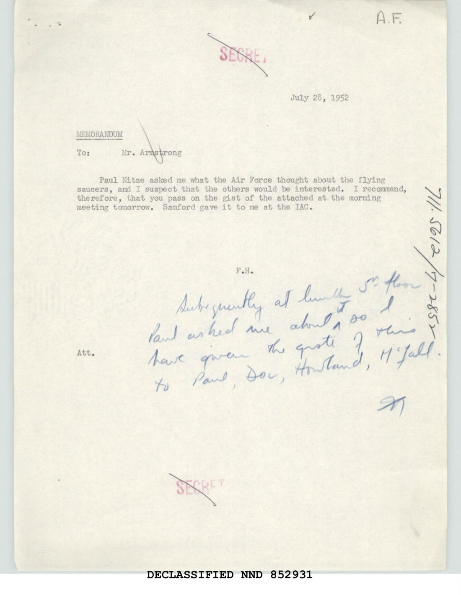

# #030 State Department 1952-07-28：Samford 給 Nitze 的飛碟摘要

| 欄位 | 內容 |
|---|---|
| 檔案編號 | 59_64634_711.5612/7-2852（國務院 1952 十進位檔案系統） |
| 來源機關 | Department of State |
| 作者 | F.H.（國務院內部員工） |
| 收件人 | Mr. Armstrong |
| 日期 | 1952-07-28（cover memo）／ 1952-07-26（attached memo）|
| 頁數 | 2 頁 |
| 機密層級 | SECRET ／ DECLASSIFIED (NND 852931) |
| 公開日 | 2026-05-08 |

## 為什麼這份檔案重要

1952 年 7 月，**華府飛碟事件**（Washington D.C. UFO incident, 1952-07-19 與 1952-07-26 兩個週末）讓飛碟議題從邊緣現象變成國家安全議題：

- **1952-07-19/20** 凌晨：Andrews AFB、Bolling AFB、National Airport 三個雷達站同步追蹤多個物體飛越國會山莊與白宮上空。
- **1952-07-26/27** 凌晨：同樣事件重演。F-94 戰鬥機 scramble。
- **1952-07-28**：本檔案撰寫。Paul Nitze 在午餐時詢問 F.H.「空軍對飛碟怎麼看」。
- **1952-07-29**：USAF 情報主任 **Major General John A. Samford** 在五角大廈舉行美國史上規模最大的飛碟記者會，宣布「credible observers have been reporting relatively incredible objects」。

本檔案是 Samford 公開記者會前一天，他在 **Intelligence Advisory Committee（IAC，CIA 主導的跨機構情報協調委員會，後來改名為 USIB）** 上對 State Department 代表口述的「Air Force 對飛碟議題的內部立場」。State Dept 員工 F.H. 把這份口述整理成書面摘要，交給 Mr. Armstrong，並隨後在 State Dept 五樓口頭傳給 Nitze、Doc、Howland、McFall 等高層。

歷史意義：

1. **是 1952 Washington UFO 期間 USAF 內部立場的書面快照**：「Air Force views the flying saucers as a threat only because they are not understood and they are sufficiently real as a phenomena to mean that they will give great attention to them until they understand them」，這句話的官方版本要到 7-29 記者會才公開，本檔案 7-28 已經寫好。
2. **「Credible observers are reporting the incredible」的原版**：Samford 1952-07-29 記者會的金句，本檔案 7-28 已經以引號形式記錄。
3. **Paul Nitze 親自介入**：Nitze 是 1950-53 國務院政策計畫部門主任、NSC-68 主要起草人、冷戰戰略主架構師。他「在午餐時問飛碟」這個動作，意味國務院最高層在 7-28 把飛碟列為當週重大議題。
4. **檔案歸入 711.5612 系列**：US-USSR 雙邊軍事關係檔案系列。State Dept 把飛碟議題明確放在「美蘇軍事關係」框架下處理。

## 1. 公文層級與路由

> July 28, 1952
> MEMORANDUM
> To: Mr. Armstrong
>
> Paul Nitze asked me what the Air Force thought about the flying saucers, and I suspect that the others would be interested. I recommend, therefore, that you pass on the gist of the attached at the morning meeting tomorrow. Samford gave it to me at the IAC.
>
> F.H.
> Att.
>
> [Handwritten note]: Subsequently at lunch 5th floor Paul asked me about it so I have given the gist of this to Paul, Doc, Howland, McFall.

> 1952-07-28
> 備忘錄
> 致：Mr. Armstrong
>
> Paul Nitze 問我空軍對飛碟有什麼看法，我懷疑其他人也會有興趣。因此建議您在明早會議中將所附內容的要點轉達。Samford 在 IAC 給我的。
>
> F.H.
> 附件
>
> [手寫注記]：之後在五樓午餐時 Paul 又問我此事，所以我把這份內容的要點告訴了 Paul、Doc、Howland、McFall。

**身分推斷**：
- **F.H.**：國務院內部員工，能參加 IAC 並有資格直接給 Samford 將軍口述、能在五樓午餐見到 Paul Nitze，這意味是 Assistant Secretary 或 Deputy Director 級別。1952 年國務院 F.H. 縮寫可能對應 **Freeman Matthews（Deputy Under Secretary）** 或 **Frederick Reinhardt** 等。
- **Mr. Armstrong**：可能是 W.G. Armstrong（Office of Intelligence Coordination）。
- **Paul Nitze**：1950-53 國務院 Policy Planning Staff（PPS）主任、1950 NSC-68 主要起草人、後來 1969-89 美蘇戰略武器談判美方主談人。
- **Doc**：可能是 Frederick C. "Doc" Reinhardt（國務院蘇聯司主任）或 Doc Matthews。
- **Howland**：可能是 William Howland（國務院遠東司）。
- **McFall**：Jack K. McFall（Assistant Secretary for Congressional Relations 1949-52）。

**IAC（Intelligence Advisory Committee）**：1947-1958 CIA 主導的美國跨機構情報協調委員會，前身是 NIA（國家情報局）。1952 年 IAC 成員包括 CIA、State Dept Bureau of Intelligence Research、Army G-2、ONI、USAF A-2、AEC、FBI。1952-07-28 IAC 會議上 Samford 把飛碟議題口述給與會的 State Dept 代表 F.H.。

**713.5612 檔案系列**：State Dept 1910-63 的十進位檔案系統。**711** 系列是「美國與外國的雙邊政治關係」；**711.56** 是「美蘇雙邊國家安全與軍事關係」；**711.5612** 是 711.56 之下的某個專題（可能是「聯合防衛 / 戰略武器」）。**/7-2852** 是歸檔日期 1952-07-28。

把飛碟議題歸入「美蘇雙邊軍事關係」檔案系列，意味國務院當時的主要假設是「飛碟可能是蘇聯飛行器」。

## 2. Samford 的口述紀錄

附件本身的內容（1952-07-26 日期）：

> July 28, 1952
> Subject: Flying Saucers
>
> General Samford, A-2, in response to my inquiry, said that there is very little that can be said to clarify the flying saucer business: It is still a complete enigma.
>
> He did, however, point out that phenomena falling within the general description of flying saucers have actually been known to exist and have been reported one way or another for over 100 years. The increase in observation and in reporting and publicity on the subject is probably attributable in the main to vastly improved methods of observation and reporting, including not only radar but the reporting systems used by civilian and military pilots. It is also attributable in some measure to the publicity which is given it, which takes on certain elements of a "fad."
>
> There is no question, according to Samford, that "credible observers are reporting the incredible." The radar observation may have elements of "electronic fluke," but is sufficiently tied in with pilot observation so that it cannot be attributed entirely to this. The Air Force views the flying saucers as a threat only because they are not understood and they are sufficiently real as a phenomena to mean that they will give great attention to them until they understand them.
>
> General Samford did not say anything about the possibility that they were man-made or controlled, friend or foe, but the whole implication of his remarks was that this possibility was not to be seriously considered.

> 1952-07-28
> 主旨：飛碟
>
> Samford 將軍（A-2）回應我的詢問時表示：關於飛碟議題能說的很少：它仍然是一個完全的謎。
>
> 不過他指出，符合飛碟一般描述的現象實際上是已知存在的，並以各種形式被報告了超過 100 年。觀察、報告與宣傳量的增加主要可歸因於觀察和報告方法的大幅改善，不僅包括雷達，還包括民航與軍方飛行員所使用的報告系統。此外也部分歸因於對此議題的宣傳，其中帶有某種「流行風潮」的元素。
>
> 根據 Samford，毫無疑問「可信的觀察者正在報告不可置信的事物」。雷達觀察可能帶有「電子失常」的元素，但因為與飛行員觀察緊密相連，無法完全歸因於此。空軍認為飛碟之所以構成威脅，僅僅是因為它們未被了解，且作為現象具有足夠的真實性，因此空軍將持續高度關注，直到了解為止。
>
> Samford 將軍未對「飛碟為人造或受控、友軍或敵軍」這個可能性發表任何看法，但他整段話的含義是：這個可能性不值得認真考慮。

### 2.1 關鍵語句拆解

**「It is still a complete enigma」**：USAF 情報主任 1952-07-28 的官方立場是「我們不知道飛碟是什麼」。這是 USAF 內部 5 年來（1947-52）累積案件目錄、Project Sign / Grudge / Blue Book 三代專案後的書面立場。

**「Phenomena falling within the general description of flying saucers have actually been known to exist and have been reported one way or another for over 100 years」**：把飛碟現象的時間框架擴展到 1852 年以後。這句話的工程含義是：飛碟不是 1947 年後的新現象，而是長期存在的環境物理現象，但 USAF 不知道是什麼。

**「Credible observers are reporting the incredible」**：Samford 1952-07-29 記者會的招牌句。本檔案 7-28 已經有引號形式紀錄，意味這個措辭是 Samford 自己定型的，而非記者會臨場發明。

**「Radar observation may have elements of 'electronic fluke,' but is sufficiently tied in with pilot observation so that it cannot be attributed entirely to this」**：對 1952-07 Washington UFO 事件（雷達 + F-94 飛行員雙重觀察）的官方解釋。Samford 不否認雷達訊號可能是「電子幻象」（atmospheric ducting，是當時 USAF 對外的標準解釋），但承認飛行員目擊不能完全用雷達失常解釋。

**「The Air Force views the flying saucers as a threat only because they are not understood」**：飛碟在 USAF 眼中是「未知 = 威脅」，不是「外星 = 威脅」或「俄國 = 威脅」。

**「General Samford did not say anything about the possibility that they were man-made or controlled, friend or foe, but the whole implication of his remarks was that this possibility was not to be seriously considered」**：F.H. 觀察 Samford 的措辭，推導出 Samford 不認為飛碟是人造（包括蘇聯）。這對 State Dept 內部討論的影響很重要，把 711.5612 系列的「蘇聯來源」假設打掉了。

### 2.2 沒說的話

Samford 在 IAC 上沒提：
- **Project Blue Book 的內部結論**。1952-07 Blue Book 正由 Captain Edward Ruppelt 主持，內部資料庫已累積數百案件。
- **「外星」假設的政治處理**。1948 Project Sign Estimate of the Situation 草稿傾向 ET 但被 Vandenberg 駁回，1952 年的 USAF 對外口徑已經完全避開 ET。
- **CIA 的處理**。1952 年 CIA 內部正在準備 **Robertson Panel**（1953-01 召開），對 UFO 議題做政策建議，本檔案 1 個月後 CIA 介入。

「不說的部分」比說的部分還重要：Samford 把「外星」「蘇聯」兩個解釋都從桌上撇開，剩下的只有「謎」。

## 3. 後續

1952-07-29 下午 16:00，五角大廈大記者會。Samford 公開發表：「credible observers reported relatively incredible objects」、官方解釋為「大氣折射 + 雷達電子幻象」。記者會被 NBC、CBS、AP、UPI、Reuters、AFP 全美與全球轉播。報導熱潮持續一週後逐漸消退。

**Robertson Panel**（1953-01-14 至 17）：CIA 召集 5 位科學家（H.P. Robertson、Luis Alvarez、Lloyd Berkner、Samuel Goudsmit、Thornton Page）+ Project Blue Book 主任 Ruppelt + Hynek 等顧問，3 天密集審查 USAF UFO 案件。Robertson Report 1953-01-17 完成（後 1958 解密），結論：

- UFO 對國家安全沒有直接威脅。
- 「continued emphasis on the reporting of these phenomena does, in these parlous times, result in a threat to the orderly functioning of the protective organs of the body politic」，「對這些現象的持續關注，在這個動盪時代，對國家防衛機構的有序運作構成威脅」。
- 建議**對外去敏感化**：透過教育、媒體、公開分析公開宣傳「UFO 都有自然解釋」。

Robertson Panel 直接定型了 1953-1969 年 Project Blue Book 的對外口徑：「個案幾乎全部可以用自然現象、誤認、虛假報告解釋」。本檔案 1952-07-28 Samford 摘要，是 Robertson Panel 召開前 6 個月的內部基線。

## 4. 觀察

**(1) 國務院為何介入飛碟**：1952-07 Washington UFO 事件發生在美國首都，雷達訊號可能引發誤判（「蘇聯偵察機」或「蘇聯飛彈」），對美蘇關係有直接影響。Paul Nitze 與 PPS 介入是合理的，Nitze 1950 NSC-68 寫的就是「美蘇對抗的長期戰略」，飛碟事件是當下測試。

**(2) 「100 年」這個尺度的含義**：Samford 把現象擴展到 1852 年以後，意味 USAF 自己對「現象的時間連續性」做過內部研究。1952 年確實有部分研究者（包括 Project Sign 內部）追溯到 19 世紀末的「mystery airships」現象（1896-97 加州/全美鬼影飛艇潮）、更早的彗星目擊（誤認為飛行物）。把現象擴展到 100 年的措辭，工程含義是「不可能是蘇聯飛機，因為蘇聯 1852 年不存在」。

**(3) 「電子幻象」與「飛行員觀察」的並存**：Samford 對 1952 Washington UFO 的官方解釋是「大氣折射 + 雷達 anomalous propagation」，這個解釋對應 USAF Air Weather Service 的初步分析。但 F-94 飛行員目擊不能用這個解釋，本檔案承認這個矛盾未解決。

**(4) State Dept 對 Samford 立場的接受**：F.H. 把 Samford 摘要傳給 Nitze、Doc、Howland、McFall 等高層，沒有附加任何 State Dept 自己的分析。這意味國務院 1952-07 接受 USAF 的處理權威，不另起爐灶。1985-2004 國務院 UAP 外交電報線（[#151-155](https://www.war.gov/UFO/)）是 State Dept 在「USAF 退出 UAP 業務後」的新一輪外交介入。

**(5) Samford 的職涯軌跡**：Samford 1950-56 任 USAF 情報主任，1956-59 任 NSA 局長。他離開 USAF 後的位置（NSA Director）是冷戰美國訊號情報的最高位。Samford 1952-07 對飛碟的處理態度（「未知就是威脅」）後來在 NSA 對信號情報的處理態度中也能看到延續。

## 5. 跨檔案連結

- **[#017 AMC flying disc 1947 / Project Sign 起源公文鏈](../017-18_100754_general_1946-7_vol_2/report.md)**：本檔案是 Project Sign 政策架構 5 年後的政府高層書面立場。Twining 1947-09 信第 2.h.(3) 段「foreign nation with form of propulsion possibly nuclear」，本檔案 Samford 1952-07 已經把這條線從桌上拿掉（「沒有任何意味是人造或受控、友軍或敵軍」）。
- **[#029 白宮 Space Council 1963 Hunter](../029-59_214434_sp_16_1963_alien_race/report.md)**：本檔案的 11 年後續。Samford 1952 不認真考慮 ET 假設；Hunter 1963 認真考慮 ET 假設並列出三種場景。1952 → 1963 美國政府的內部 ET 思考度提高，但對外口徑（Project Blue Book Status Reports）仍然否認。
- **[#028 / #026 / #027 Project Sign Incident Summaries 三冊](../028-38_143685_box7_incident_summaries_1-100/report.md)**：本檔案是這三冊背景下 USAF 對外總結。Samford「100 年現象 + 完全的謎」這個立場，是 1947-52 五年 USAF 內部累積數百案件後的書面結論。
- **後續 #151-155 State Department UAP Cables 1985-2004**：本檔案 1952 國務院的 711.5612 飛碟歸檔，是國務院後續 UAP 外交電報線（Papua New Guinea / Kazakhstan / Tbilisi / Ashgabat / Mexico）的前身。

## 6. 來源

- 原始檔案：[U.S. Department of War — 59_64634_711.5612[7-2852](https://www.war.gov/UFO/#59_64634_711.5612[7-2852)
- PDF 直接下載：`https://www.war.gov/medialink/ufo/release_1/59_64634_711.5612[7-2852.pdf`
- 公開日：2026-05-08
- 2 頁，原 SECRET，DECLASSIFIED (NND 852931)
