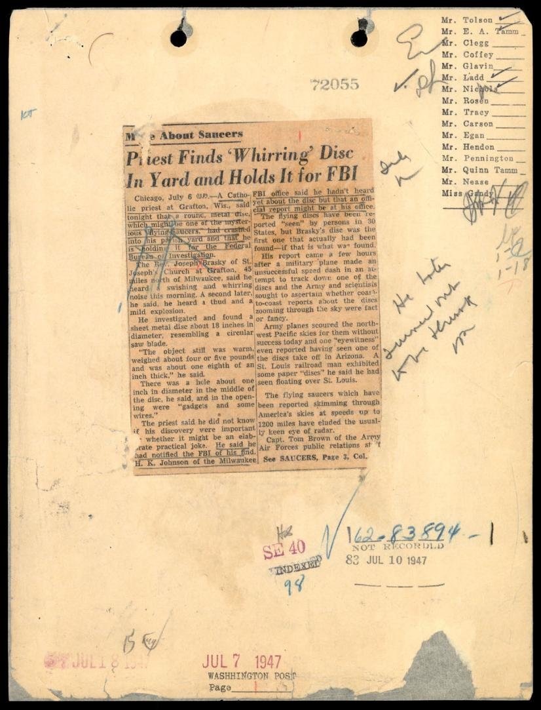
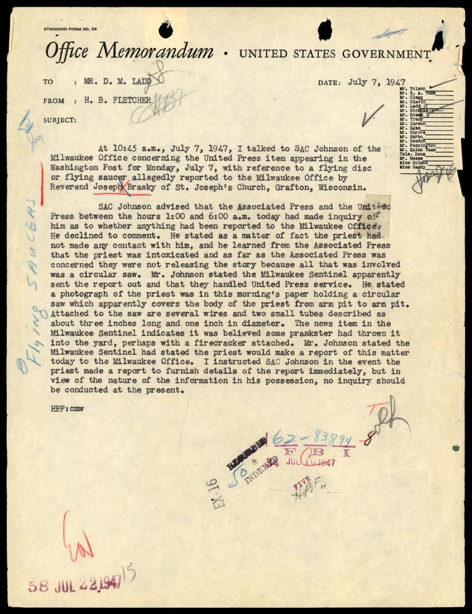
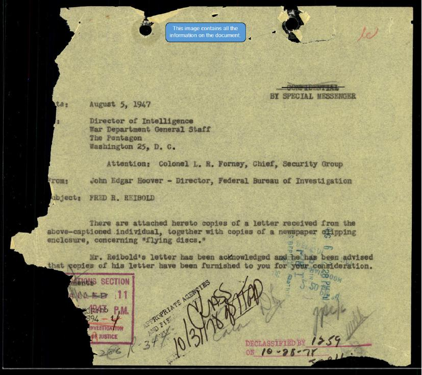
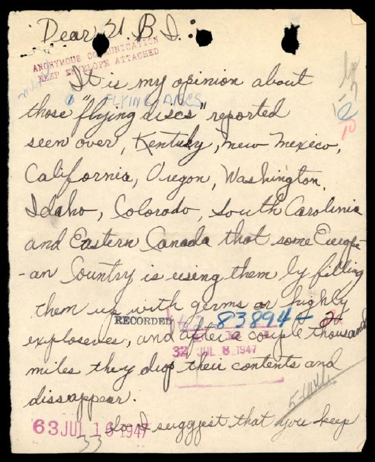
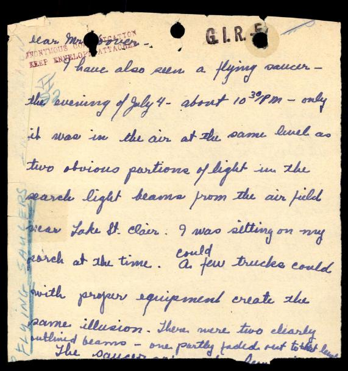

# FBI 62-HQ-83894 案卷 #033 ─ Section 1：1947 飛碟潮起點，民眾來信、神父惡作劇、Hoover 與軍方公文

| 欄位 | 內容 |
|---|---|
| 案卷編號 | `65_HS1-834228961_62-HQ-83894_Section_1` |
| 期間 | 1947-07 起 |
| 頁數 | 185 頁（PDF 全卷，本報告涵蓋前 25 頁） |
| Serial 範圍 | Serials 1-52（Vol 1） |
| 主軸 | Section 1 收 1947 年 7 月起的第一批 UFO 通報：民眾來信、報紙剪報、惡作劇調查、Hoover 與軍方公文交換、匿名陰謀論信 |
| 官方 portal | <https://www.war.gov/UFO/#65_HS1-834228961_62-HQ-83894_Section_1> |

## 本份報告範圍

Section 1 的 PDF 共 185 頁，本份為 overview 報告，僅基於前 25 頁影像化內容寫成。前 25 頁涵蓋 Serial 1 到 Serial 7 左右，即 1947 年 7 月初到 7 月中的早期通報。後段 Serial 8-52 跨入 1947-08 及之後的目擊潮，未在本報告涵蓋範圍內，讀者可至 [官方 portal](https://www.war.gov/UFO/#65_HS1-834228961_62-HQ-83894_Section_1) 下載完整 PDF。

## 卷宗結構

Section 1 是 62-HQ-83894 整套案卷的起點。封面格式 4-606 (REV. 9-20-79)，標籤資訊：

- Class/Case # 0062 83894，Sub 1，Vol 1，Serial 1-52
- 棕色紙標籤 SERIALS 1-52，SECTION 1，畫有紅色大 X
- 主封面紅色 DO NOT DESTROY 印章兩枚（左 FOIPA # 993087，右 FOIPA # 1366404）
- PICKETT STREET 黑色印章（FBI Alexandria, Virginia 的 records storage facility）
- SECRET 紅色印章已被劃線
- Transfer-Call 3421 / Use Care in Handling this File 紅色大字
- 藍色解密貼紙：FBI Automatic Declassification Guide, issued May 24, 2007

封面之後是 1947-07 起的早期 serials，組成為三類：

1. 媒體剪報：Washington Post、Boston Globe、Milwaukee Sentinel、Omaha 地方報
2. 民眾來信：寄給 Hoover 或 FBI 的目擊報告、陰謀論猜測、惡作劇後續說明
3. FBI 內部 Office Memorandum：SAC 各分局回報、調查結論、Hoover 對外公文

Section 1 比 [#002 Section 2](../002-65_hs1-834228961_62-hq-83894_section_2/report.md) 更早入卷，涵蓋 Serial 1-52，後者從 Serial 53 起算。

## §1 Serial 1：Grafton 神父在後院找到「呼嘯」飛碟

Section 1 的 Serial 1 是 1947-07-07 Washington Post 剪報「Priest Finds 'Whirring' Disc In Yard and Holds It for FBI」。剪報黏貼於 FBI 路由表，右上欄列出 Tolson、E. A. Tamm、Clegg、Coffey、Glavin、Ladd、Nichols、Rosen、Tracy、Carson、Egan、Hendon、Pennington、Quinn Tamm、Nease、Miss Gandy 等高層名單，紅色印章「162-83894-1 / NOT RECORDED / 83 JUL 10 1947」。

剪報內容：

> 芝加哥 7 月 6 日（UP）。 威斯康辛州 Grafton 一名天主教神父今晚表示，他在他的教區後院發現一個圓形金屬盤，可能是神秘「飛碟」之一，正為聯邦調查局保存中。
>
> Milwaukee 北方 45 哩的 St. Joseph's Church 的 Rev. Joseph Brasky 表示，他今晨聽到一陣呼嘯聲。一秒後，他聽到一聲悶響和輕微爆炸。
>
> 他過去調查，發現一塊金屬薄盤，直徑約 18 吋，外型像圓鋸片。
>
> 該物體仍然溫熱，重約 4-5 磅、厚約 1/8 吋。
>
> 圓盤中央有一個直徑約 1 吋的孔，洞中有「小機件和一些電線」。

Brasky 神父稱他不知這個發現是否重要，是否可能是精巧的惡作劇。他通知了 FBI 自己的發現。Milwaukee FBI 辦公室回應「未聽說圓盤，但官方報告可能已在其辦公室」。

接下來幾頁是這份剪報的反面（page-003，標準 FBI 收文章），續刊內文（page-004），以及 Section 1 的 Serial 1 完整檔案編號 162-83894-1。

## §2 Serial 2-3：神父案的內幕

1947-07-07 同日，FBI 內部 Office Memorandum，H. B. Fletcher 給 D. M. Ladd：

> 1947-07-07 10:45 a.m.，我與 Milwaukee Office 的 SAC Johnson 通話，討論 1947-07-07 Washington Post 中報導的飛碟事件，據稱 St. Joseph's Church 的 Reverend Joseph Brasky 通報給 Milwaukee Office。
>
> SAC Johnson 表示 Associated Press 和 United Press 今天凌晨 1:00 到 6:00 之間打電話來，詢問是否有任何通報。他拒絕評論。他說，事實上神父並未與他聯繫，他從 Associated Press 得知神父喝醉了，而就 AP 而言，他們不發稿，因為涉及的只是一個圓鋸片。Johnson 表示 Milwaukee Sentinel 顯然發了稿，由 United Press 接手。他說今晨報紙刊登了神父的照片，他從腋下抱到腋下托著盤狀物。盤上接著幾根電線和兩個約三吋長、一吋直徑的小管。Milwaukee Sentinel 的新聞表示，這可能是惡作劇者扔進院子的，也許還附上一個爆竹。

Fletcher 指示 SAC Johnson：若神父正式通報就轉送詳情，「但鑑於他持有的資訊性質，目前不應進行任何調查」。

對應的 New Orleans teletype（page-008，粉紅色紙）也記載：「RE FLYING DISCS, MISCELLANEOUS. Disc REPORTED FOUND BY F. G. HARISTON REVEALED TO BE PRANK」。文件收於 62-83894-3，FBI 1947-07-10 受理。

Section 1 第一個案件結案：圓鋸片加爆竹的惡作劇。

## §3 Serial 4：Omaha 燃燒物體目擊與 Hoover 親簽公文

1947-08-05，J. Edgar Hoover 親簽信函（BY SPECIAL MESSENGER）：

> 收件人：Director of Intelligence, War Department General Staff, The Pentagon, Washington 25, D. C.
>
> 經辦：Colonel L. R. Forney, Chief, Security Group
>
> 寄件人：John Edgar Hoover - Director, Federal Bureau of Investigation
>
> 主旨：FRED R. REIBOLD
>
> 茲附上一封由上述個人收到的信函副本，連同關於 flying discs 的一份報紙剪報副本。Reibold 先生的信已收到回函通知，並告知他信件副本已轉交給您審酌。

Reibold 的原信（page-011 到 014，手寫，Omaha Nebraska 8315 Wirnbaugh Ave）內容：

> 1947-07-07 22:30，我與岳母 Gertrude Sniffen 親眼見到一個燃燒的物體掉到我家門前街上。
>
> 檢查發現該物體呈現圓形，大約一枚銀元大小，1/4 吋厚，燃燒著極度高溫。
>
> 我通知了 World Herald 報社，他們派了記者過來。同時，一個小孩踢翻物體使其碎裂。記者抵達時拿走了碎片，說會送去化驗。
>
> 共有六人實際看到該物體，可以作證它燃燒時的高溫。
>
> 我們並未主張這是所謂的 flying saucer 或類似現象，但希望得到合理解釋，因為若該物體掉到屋頂上，肯定會引發火災。
>
> 我們可以肯定地說，它不是 Dr. Kenny 推斷的菸灰。它燒得如此高溫，連人行道上都焦黑。
>
> 有可能這是延遲施放的國慶煙火或類似物，但無論如何，我們請您注意，因為「博學的」Dr. Kenny 給的答案是抽菸斗的灰燼，這充滿嘲諷，完全令人不滿。

附剪報（page-015）：「'Flying Saucer' Just Someone's Pipe Dream」，Creighton College of Dentistry 化學系主任 Dr. C. L. Kenny 帶兩名學生分析灰燼，發現 sodium、potassium、iron、aluminum、carbonate、sulphate、未燃燒 carbon，「這與你會從普通菸斗菸草得到的相同分析」。62-83894-4 enclosure。

Reibold 把這份分析視為 Dr. Kenny 對通報人的羞辱。Hoover 把整件事透過 SPECIAL MESSENGER 親自送進五角大廈情報部。1947 年 8 月初的 FBI 還未正式啟動 UFO 調查職責，這封轉送信是早期 FBI 與軍方分工的明確證據。

## §4 Serial 5：匿名「歐洲國家投放細菌」陰謀論信

Serial 5 是一封 1947-07-08 收到的匿名來信，紅色印章「ANONYMOUS COMMUNICATION / KEEP ENVELOPE ATTACHED」+「FLYING DISCS」標題：

> 親愛的 FBI：
>
> 我認為這些在 Kentucky、New Mexico、California、Oregon、Washington、Idaho、Colorado、South Carolina 與東加拿大被通報目擊的「飛碟」，是某個歐洲國家在使用它們，填滿細菌或高度爆炸物，飛幾千哩後丟下內容物再消失。
>
> 我建議您手邊備好大量消毒劑，否則美國可能會遭遇危險。
>
> 來自：一位朋友

信封寄出地 New Brunswick NJ，1947-07-05 郵戳，貼 5 cent 郵票，寄到「The F.B.I. / Washington / District of Colombia」。

這類「飛碟是外國武器」的猜測在 1947 年很常見。FBI 把信檔入 62-83894-5。

## §5 Serial 6-7：諷刺信與民眾抱怨媒體嘲弄

Serial 6（page-020）是 1947-07-11 New York（Grand Central Station 郵戳）寄出的諷刺信，署名「The Combined and Amalgamated Committee of Sky-Scanners, Disc Decipherers and New-Product Introducers」：

> 親愛的先生：
>
> 您看過神秘的 Saucers 嗎？
> 它長什麼樣子？
> 您認為這些奇異的天空現象是否是更美好一日的預兆？
> 您是否相信這意味著新的革命性進步即將到來？
> 它會讓您的生活更明亮、快樂、有用嗎？
>
> 我們相信其中一個驚人的圓盤正朝您而去。然後秘密就會揭曉。

紅色印章「62-83894-6 / 37 JUL 1947」。FBI 把這份視同正常陳情，編入卷宗。

Serial 7（page-022）是 Boston Mass 一位女性 Miss X Finkelstein 1947-07-14 寄出：

> 容我提請您關注某些報紙對通報飛碟者的無情批評，特別是 Boston Globe 一篇由名為 Lincoln 的作者所寫的文章，以及本周 Boston Post 的一篇道歉文。
>
> 對通報者的批評非常不公平。從眼科醫生到精神科醫生，都在文章中公開抨擊他們。這是非常不好的方式來感謝這些人的努力。哪天當情況需要他們時，他們可能就不會再費心通報了。

紅色印章「162-83894-7 / 34 JUL 1947」+「EX-74」。Finkelstein 把媒體攻訐通報者視為下次危機的前置失效。

## §6 G.I.R. 民眾陰謀論：探照燈幻覺說

混在前 25 頁的還有兩封「G.I.R.」標記的後續信：

> 親愛的：
>
> 我也看到了飛碟。1947-07-04 大約 22:30，當時它的高度與 Lake St. Clair 附近機場探照燈光柱中的兩個明顯光點同高。當時我坐在我家門廊上。幾輛卡車加上適當設備就能製造同樣的幻覺。

續頁（page-017）：「第三束光從地面到飛碟逐漸消失。最近我提到太平洋上遇難的船並非自然現象引起⋯⋯」。FBI 收文 1947-07-22。

這封信代表 1947 年另一類民眾立場：飛碟是人造的，可能是探照燈幻覺。與陰謀論不同，更接近懷疑論。

## 影像規格與來源

| 圖片 | 內容 | 來源頁碼 | FBI Serial |
|---|---|---|---|
| cover.jpg | Section 1 卷夾封面，Serials 1-52 | PDF 封面 | — |
| page-002.jpg | Brasky 神父呼嘯飛碟剪報，Washington Post 1947-07-07 | PDF p.2 | 62-83894-1 |
| page-024.jpg | Fletcher 給 Ladd Office Memorandum，神父喝醉、圓鋸片惡作劇 | PDF p.24 | 62-83894-3 |
| page-010.jpg | Hoover 1947-08-05 致五角大廈情報部、轉送 Reibold 來信 | PDF p.10 | 62-83894-4 |
| page-006.jpg | 匿名歐洲國家投放細菌陰謀論信 | PDF p.6 | 62-83894-5 |
| page-016.jpg | G.I.R. 1947-07-04 Lake St. Clair 探照燈幻覺說 | PDF p.16 | — |

來源：U.S. Government, *War Department UFO Disclosure Archive*, FBI HQ 62-HQ-83894 Section 1，<https://www.war.gov/UFO/#65_HS1-834228961_62-HQ-83894_Section_1>。

## 相關案件

- [#002 Section 2](../002-65_hs1-834228961_62-hq-83894_section_2/report.md)：Section 1 的直接後繼，Serials 53-100，1947-06 到 1947-09 飛碟潮起源，含 Arnold/Rhodes/Army 實驗假設
- [#003 Section 3](../003-65_hs1-834228961_62-hq-83894_section_3/report.md)：1947-10-01 FBI 退出 UFO 調查令
- [#004 Section 4](../004-65_hs1-834228961_62-hq-83894_section_4/report.md)：Project SIGN 與 GRUDGE
- [#009 Serial 130](../009-65_hs1-834228961_62-hq-83894_serial_130/report.md)：Air Defense Command 1947-09-12 給 Hoover 的飛碟潮總結
