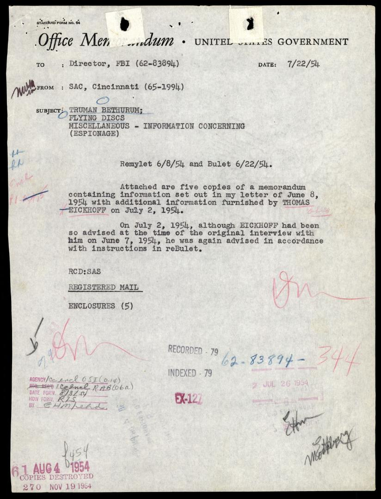
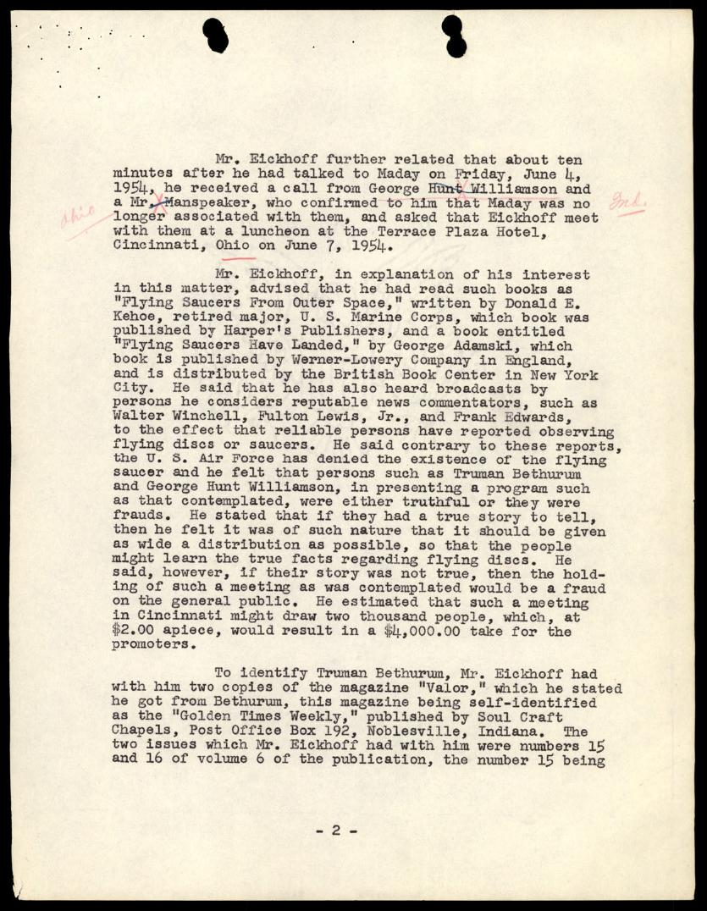
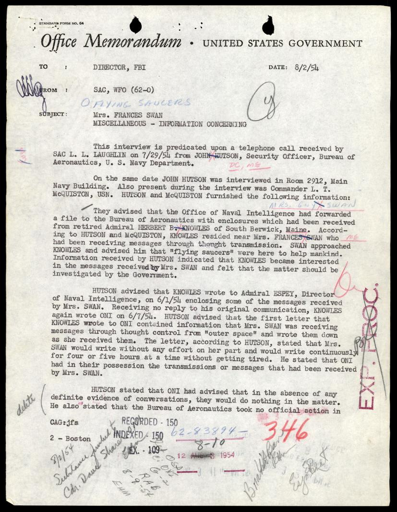
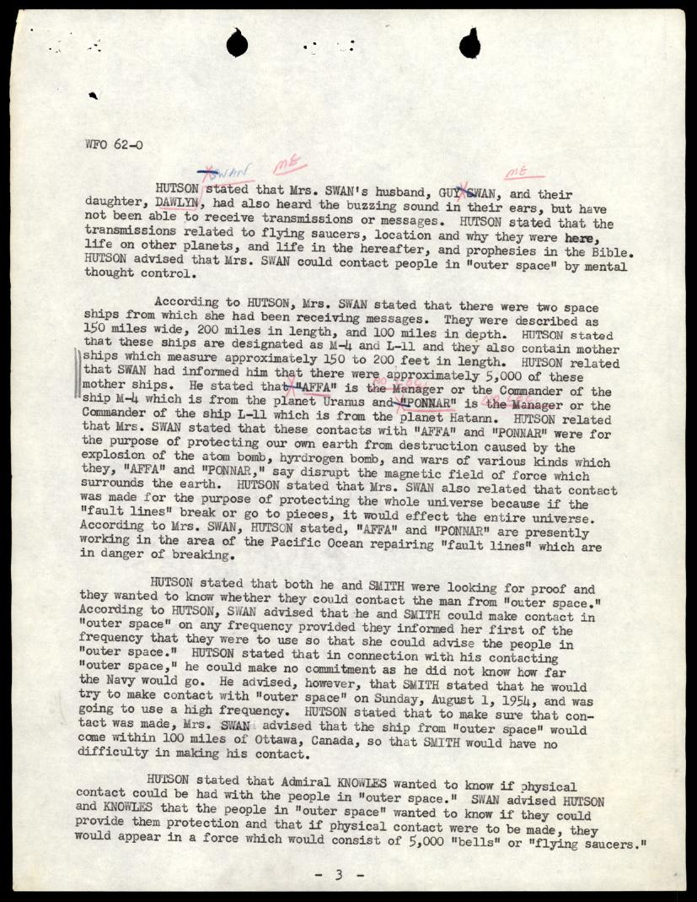
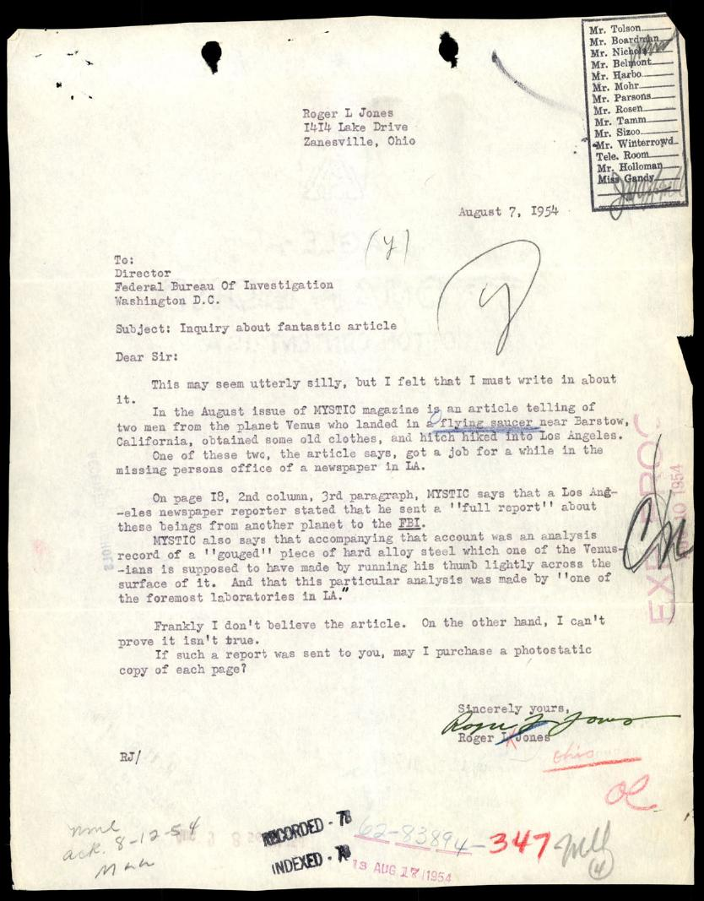
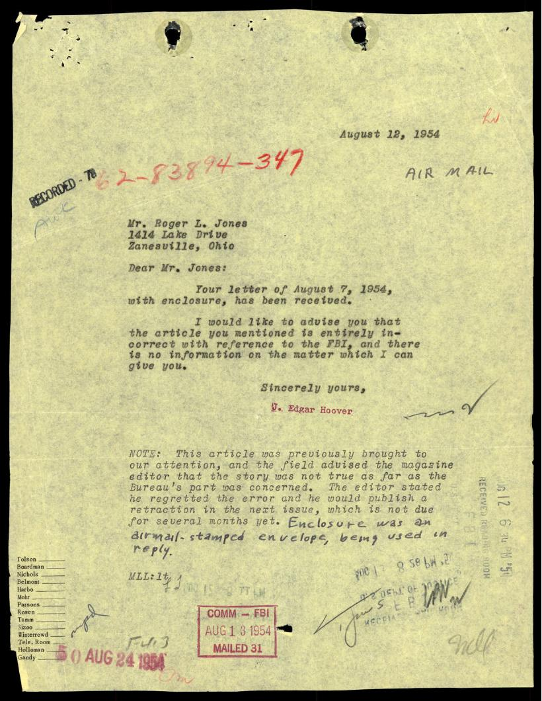

# FBI 62-HQ-83894 案卷 #034 ─ Section 8：1954 contactee 詐騙、Bethurum/Williamson 巡迴演講、Mrs. Swan 透過 thought transmission 接觸金星人

| 欄位 | 內容 |
|---|---|
| 案卷編號 | `65_HS1-834228961_62-HQ-83894_Section_8` |
| 期間 | 1954-06 起 |
| 頁數 | 217 頁（PDF 全卷，本報告涵蓋前 25 頁） |
| Serial 範圍 | Serials 344-384（Vol 8） |
| 主軸 | 1954 年 contactee 文化的 FBI 視角：Truman Bethurum 巡迴演講籌辦、George Hunt Williamson、William Dudley Pelley 的 Soul Craft Press、Mrs. Frances Swan 自動書寫接觸 AFFA/PONNAR、Hoover 親簽闢謠《MYSTIC》雜誌金星人故事 |
| 官方 portal | <https://www.war.gov/UFO/#65_HS1-834228961_62-HQ-83894_Section_8> |

## 本份報告範圍

Section 8 的 PDF 共 217 頁，本份為 overview 報告，僅基於前 25 頁影像化內容寫成。前 25 頁集中在 1954-06 到 1954-08 的 contactee 與「飛碟詐騙」相關案件。後段 Serial 358-384 跨入 1955 之後，未在本報告涵蓋範圍內。讀者可至 [官方 portal](https://www.war.gov/UFO/#65_HS1-834228961_62-HQ-83894_Section_8) 下載完整 PDF。

## 卷宗結構

Section 8 封面格式 4-595 (REV. 11-20-73)：

- Class/Case # 0062 83894，Sub 8，Vol 344，Serial 384
- 棕色紙標籤 SERIALS 344-384，SECTION 8，畫有紅色大 X
- 多枚 COPIED FOR FOIPA 印章（NOV 3 1976、MAY 4 1977 R310、MAY 14 1977 R34R、JAN 18 1979 F420）
- 兩枚 DO NOT DESTROY 黑色印章
- FOIPA # 993087 + 手寫補充 Serials 358 346
- 解密貼紙：FBI Automatic Declassification Guide, issued May 24, 2007

封面之後 page-002 是 Reading Room FOIPA 申請紀錄表（COPIED FOR FOIPA APR 14 1978 BY R330，補充 Serials 346, 353, 362 & 384）+ 1986 年三筆個別申請：Brian Parks (Serials 349-350) 1986-03-25、Richard Toronto (Serial 344) 1986-05-29、Brian Parks again (Serial 380) 1986-03-23。這份卷宗在 1970-80 年代 FOIPA 請求很頻繁。

前 25 頁可見的主軸：

1. Serial 344：Truman Bethurum 巡迴演講 FBI 調查（1954-07-22 SAC Cincinnati 報告，附 Eickhoff 訪談備忘錄）
2. Serial 346：Mrs. Frances Swan 透過 thought transmission 接觸金星人 AFFA 與 PONNAR（1954-08-02 SAC WFO 報告）
3. Serial 347：Roger L. Jones 詢問《MYSTIC》雜誌金星人故事是否真實（Hoover 1954-08-12 親簽回函）

## §1 Serial 344：Truman Bethurum 與 George Hunt Williamson 的 Cincinnati 巡迴演講

1954-07-22 SAC Cincinnati (65-1994) 給 Director, FBI (62-83894)：

> 主旨：TRUMAN BETHURUM; FLYING DISCS; MISCELLANEOUS - INFORMATION CONCERNING (ESPIONAGE)
>
> 附上五份備忘錄副本，含 1954-06-08 我信中所述資訊，以及 1954-07-02 由 THOMAS EICKHOFF 提供的額外資訊。
>
> 1954-07-02 雖然 EICKHOFF 在 1954-06-07 原始訪談時已被告知，但他依 reBulet 指示再次被告知。

紅色印章「62-83894-344 / RECORDED-79 INDEXED-79 / 27 JUL 26 1954」+「COPIES DESTROYED 270 NOV 19 1964」+「EX-127」。注意分類加上「(ESPIONAGE)」標籤，這是 FBI 對 contactee 案件採取的法律框架：不查 UFO 真偽，但會查是否涉及詐欺或情報滲透。

備忘錄主體（page-005 起）：

> 1954-06-07，Mr. Thomas Eickhoff, 3721 Tappan Avenue, Cincinnati 23, Ohio, Operator of Tom's Beauty Salon, Neave Building, Fourth and Race Streets, Cincinnati, Ohio, 表示雖然他不屬於任何對飛碟或圓盤感興趣的組織，但他對此主題有興趣。
>
> 他說 1954-06-03 在 *The Cincinnati Enquirer* 出現一則廣告，內容是 1954-06-11 將在 Cincinnati 的 Taft Auditorium 舉辦「真正的飛碟故事」節目。Mr. Eickhoff 表示該廣告未標示贊助者，只註明節目門票每人 $2.00 在 Cincinnati 的 Central Ticket Office 出售。
>
> Mr. Eickhoff 繼續說，由於他對飛碟主題感興趣，他想知道該節目的贊助者。他從 Central Ticket Office 得知廣告是由 Henry Maday, 364 West Lewiston Avenue, Ferndale 20, Michigan 訂的。

Maday 自稱代表 Truman Bethurum 與 George Hunt Williamson 行動，與 Bethurum/Williamson 對門票分潤產生爭議。1954-06-04 Maday 來電告知 Eickhoff 他已退出。十分鐘後 Williamson 與一位 Manspeaker 來電，邀請 Eickhoff 1954-06-07 在 Terrace Plaza Hotel 共進午餐。

## §2 Eickhoff 的 UFO 知識背景與動機

> Mr. Eickhoff 解釋他對此事興趣的緣由，他表示自己讀過 *Flying Saucers From Outer Space*（作者 Donald E. Kehoe，退役 USMC 少校，Harper's Publishers 出版）以及 *Flying Saucers Have Landed*（作者 George Adamski，英國 Werner-Lowery Company 出版，紐約 British Book Center 發行）。
>
> 他說他也聽過名嘴如 Walter Winchell、Fulton Lewis, Jr. 與 Frank Edwards 的廣播，提到可靠人士通報目擊飛碟。他說相反地，美國空軍否認飛碟存在，他認為 Truman Bethurum 與 George Hunt Williamson 這類人不是說真話就是詐欺。
>
> 他表示，如果他們有真實的故事可說，他覺得應該盡量廣泛傳播，讓大眾學到飛碟的真相。然而，他說如果他們的故事不真實，舉辦這種會議就是對大眾的詐欺。
>
> 他估計 Cincinnati 這種會議可能吸引 2000 人，每人 $2.00 將為發起人帶來 $4,000.00 收入。

Eickhoff 隨身帶兩本《Valor》雜誌，自稱為「Golden Times Weekly」，由 Indiana Noblesville 的 Soul Craft Chapels（P.O. Box 192）出版。1954-02-06 號文章稱 Truman Bethurum 是 Redondo Beach 卡車司機，1953-12-31 *Daily Breeze* 文章描述他在內華達沙漠遇到一群假定的太空探險者，由一位「迷人女性指揮官」指揮。文章稱 Bethurum 上過飛碟 11 次。

Bethurum 親筆字跡寫在第 15 號雜誌首頁：「This is a true story, a factual experience -- Truman Bethurum」。Bethurum 55 歲，住 519 North Gertruda Avenue, Redondo Beach, California。

## §3 Eickhoff 先找空軍 O'Mara 上校求證

> Eickhoff 重申他覺得 Bethurum 的故事若是真的應廣泛傳播，但若是假的就應該被起訴詐欺。他表示他首先把資訊帶到 Wright-Patterson Air Force Base 的 Lieutenant Colonel John O'Mara，他在 1954-06-06 週日親自拜訪 O'Mara 位於 Ohio Fairborn 的家。
>
> Eickhoff 問 O'Mara 上校是否有飛碟這種東西、Bethurum 的故事是否可能屬實。O'Mara 否認有飛碟存在，並告訴他《Flying Saucers in Outer Space》作者 Donald E. Kehoe 是騙子，相關資訊在華府可取得。但他被 O'Mara 告知空軍對 Bethurum 或 Williamson 不能採取行動。

Eickhoff 隨後在 1954-06-07 親自參加 Bethurum/Williamson 與其團隊在 L. H. Stringfield 家（7017 Britton Avenue, Cincinnati 27, Ohio）的工作會議。L. H. Stringfield 是後來 1957 年「Inforspace」UFO 研究組織的創辦人，1960 年代以「UFO crash retrieval」研究成名。1954 年的他已是 Cincinnati 在地的 contactee 圈子核心。

會議出席：Stringfield、Williamson、Manspeaker、Bethurum、Ralph Zimmermann、Eickhoff。Williamson 自我介紹為「考古學家」+《Valor》雜誌撰稿人。Manspeaker 也與《Valor》有關聯。

## §4 William Dudley Pelley 與 Soul Craft Press

> William Dudley Pelley, Noblesville, Indiana 經營 Soul Craft Press，除了 Noblesville 出版的其他小冊子外，還出版 Mr. Pelley 形容為「applied spirituality 期刊」的《Valor》週刊。據說此刊物主要處理 practical mysticism、Soulcraft 靈性運動、以及地球人與飛碟乘客之間的關係。
>
> 據說 Mr. Pelley 聲稱這些搭乘飛碟到地球的人擁有比地球人更高的智力，並來此學習地球人，目的是為地球人提供 intellectual guidance 與 spiritual endowment and guidance。

William Dudley Pelley 不是隨便的人物。他在 1933 年創辦 Silver Legion of America（俗稱 Silver Shirts），明顯仿效德國納粹的法西斯組織，1942 年因 sedition 起訴入獄，1950 年假釋。1954 年他在 Noblesville Indiana 經營 Soul Craft Press，把當年的政治運動改成 contactee 神祕主義包裝。FBI 對 Pelley 的關注延續了多年。

1954-07-02 Eickhoff 回報：Bethurum 已回加州，Cincinnati 會議無進展。Eickhoff 也與 Kehoe 通信，告知 O'Mara 上校稱 Kehoe 是騙子。Kehoe 表示「準備帶律師到華盛頓，向空軍當局澄清 O'Mara 上校的陳述」。

## §5 Serial 346：Mrs. Frances Swan 與外星人 AFFA、PONNAR

1954-08-02 SAC, WFO (62-0) 給 Director, FBI：

> 主旨：Mrs. FRANCES SWAN; MISCELLANEOUS - INFORMATION CONCERNING
>
> 本訪談因 1954-07-29 SAC L. L. Laughlin 接到 Bureau of Aeronautics, U.S. Navy Department 的 Security Officer John Hutson 來電而進行。
>
> 同日 John Hutson 在 Main Navy Building Room 2912 接受訪談。在場還有 USN Commander L. T. McQuiston。Hutson 與 McQuiston 提供以下資訊：
>
> 他們表示 Office of Naval Intelligence 已將一份 file 連同附件轉送給 Bureau of Aeronautics，那是從 South Berwick, Maine 的退役 Admiral Herbert B. Knowles 收到的。Knowles 居住在 Mrs. Frances Swan 附近，後者一直透過 thought transmission 接收訊息。Swan 接觸 Knowles 並告訴他「飛碟」是來幫助人類的。
>
> Knowles 收到 Mrs. Swan 收到的訊息後對此事產生興趣，覺得此事應由政府調查。

62-83894-346 / RECORDED-150 INDEXED-150 / EX-109 / 12 AUG 3 1954。

Hutson 1954-07-24/25/26 親自去 South Berwick Maine，住在 Admiral Knowles 家。加拿大政府物理學家 Wilber B. Smith（同樣對飛碟有興趣）也在 Knowles 家。Hutson 親眼看 Mrs. Swan 用自動書寫接收訊息：

> Hutson 表示 Mrs. Swan 接收到的訊息涉及飛碟、其他行星上的生命位置、他們為何在這裡、以及聖經中的預言。Hutson 告知 Mrs. Swan 可透過 mental thought control 與「外太空」的人接觸。
>
> 根據 Hutson，Mrs. Swan 表示有兩種太空船她收到訊息。她描述為長 150 哩、寬 200 哩、深 100 哩。Hutson 表示這些船被指定為 M-4 與 L-11，並含有測量約 150 到 200 呎長的母船。Hutson 表示 Swan 告知他共有約 5,000 艘母船。他表示 AFFA 是 M-4 船的 Manager 或 Commander，來自 Uranus 行星；PONNAR 是 L-11 船的 Manager 或 Commander，來自 Hatann 行星。
>
> Hutson 進一步表示 Swan 表示她與 AFFA 及 PONNAR 接觸的目的是保護地球免於我們的原子彈、氫彈爆炸所造成的破壞，以及干擾地球磁場的各種戰爭。AFFA 與 PONNAR 目前在太平洋海域附近修理可能崩裂的「fault lines」。

Mrs. Swan 進一步表示飛碟艦隊將在 1954-08 後半期出現於世界各國上空，「會足夠靠近地球，讓人類可以看見，他們也可看見街上的人」。Admiral Knowles 想知道能否實體接觸；Swan 回應若實體接觸，會由 5,000 艘「bells」或「flying saucers」組成的艦隊出現。

Hutson 描述 Mrs. Swan「中產階級、家具略低於中產，高中畢業或更低，心思單純、宗教取向、聖經研究者，研究 spiritualism 與其他 thought control systems」。此資訊轉送 USAF OSI + Army G-2 + Navy ONI，FBI 不採取進一步行動。

## §6 Serial 347：Roger L. Jones 詢問《MYSTIC》雜誌金星人故事

1954-08-07 Roger L. Jones (1414 Lake Drive, Zanesville, Ohio) 寄信給 Director：

> 這可能看似完全荒謬，但我覺得我必須寫信來問。
>
> 在《MYSTIC》雜誌八月號中有一篇文章，講兩個來自金星的男人駕飛碟降落在加州 Barstow 附近，拿了一些舊衣服，然後搭便車到 Los Angeles。
>
> 其中一個（文章說）在 LA 一家報社的失蹤人口辦公室找到一份工作一段時間。
>
> 在第 18 頁第 2 欄第 3 段，《MYSTIC》表示一位 Los Angeles 報社記者陳述他已寄了一份「完整報告」給 FBI 關於這些來自另一星球的人。
>
> 《MYSTIC》還說，附隨那份說明的是一份「凹刻」硬合金鋼分析記錄，據稱是其中一位金星人用拇指輕輕劃過表面所造成。該分析據說由「LA 其中一個頂尖實驗室」完成。
>
> 坦白說我不相信這篇文章。另一方面，我無法證明它不是真的。
>
> 如果有這樣的報告寄給您，我可以購買每頁照相副本嗎？

紅色印章「62-83894-347 / RECORDED-78 INDEXED-78 / 18 AUG 17 1954」。

1954-08-12 Hoover 親簽回函（AIR MAIL）：

> 親愛的 Mr. Jones：
>
> 您 1954-08-07 連同附件的信函已收到。
>
> 我想告知您，您提到的文章關於 FBI 的部分完全不正確，我無法提供此事的相關資訊。
>
> 此致，
>
> J. Edgar Hoover

NOTE 欄記載：「此文章先前已引起本局注意，外勤已告知雜誌編輯，就本局而言該故事不真實。編輯表示他遺憾這個錯誤，將在下一期刊登 retraction，但要數月後才會出版。隨函附上回信用之 airmail 郵戳信封。」

Hoover 對「金星人在 LA 報社上班」的回應只有兩句話，但這是 FBI 處理 contactee 文化的標準姿態：不深入、明確否認、留紙本紀錄。

## 影像規格與來源

| 圖片 | 內容 | 來源頁碼 | FBI Serial |
|---|---|---|---|
| cover.jpg | Section 8 卷夾封面，Serials 344-384 | PDF 封面 | — |
| page-003.jpg | SAC Cincinnati 1954-07-22 Bethurum 案報告 | PDF p.3 | 62-83894-344 |
| page-006.jpg | Eickhoff 訪談備忘錄第 2 頁：UFO 知識背景與動機 | PDF p.6 | 62-83894-344 附件 |
| page-012.jpg | SAC WFO 1954-08-02 Mrs. Frances Swan 報告封面 | PDF p.12 | 62-83894-346 |
| page-015.jpg | Hutson 敘述 Mrs. Swan 接觸 AFFA、PONNAR 細節 | PDF p.15 | 62-83894-346 附件 |
| page-024.jpg | Roger L. Jones 詢問《MYSTIC》金星人故事 | PDF p.24 | 62-83894-347 |
| page-022.jpg | Hoover 1954-08-12 親簽回函 | PDF p.22 | 62-83894-347 |

來源：U.S. Government, *War Department UFO Disclosure Archive*, FBI HQ 62-HQ-83894 Section 8，<https://www.war.gov/UFO/#65_HS1-834228961_62-HQ-83894_Section_8>。

## 相關案件

- [#007 Section 7](../007-65_hs1-834228961_62-hq-83894_section_7/report.md)：Section 8 的前一冊，1948 Gorman Fargo 空戰、1950 New Yorker Project Saucer 報導、1952-07 Washington DC 雷達視覺案
- [#008 Section 9](../008-65_hs1-834228961_62-hq-83894_section_9/report.md)：Section 8 的後一冊，Sputnik 後飛碟潮、Levelland 引擎熄火、Stringfield 接到的 Tsar Bomba 預警匿名電話（注意：L. H. Stringfield 在 Section 8 已出現於 1954 Bethurum 案會議地點）
- [#016 SUB A](../016-65_hs1-834228961_62-hq-83894_sub_a/report.md)：62-83894-A 子卷，1957-1960 五份 UFO 媒體剪報，含 Jung 飛碟有引導論
