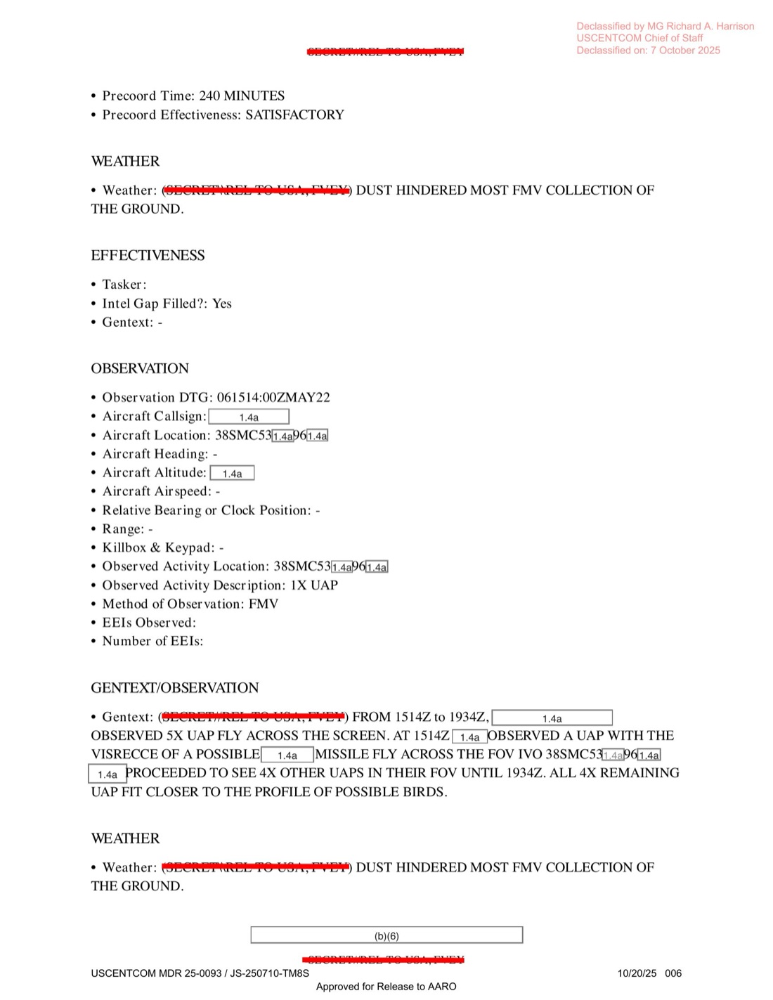
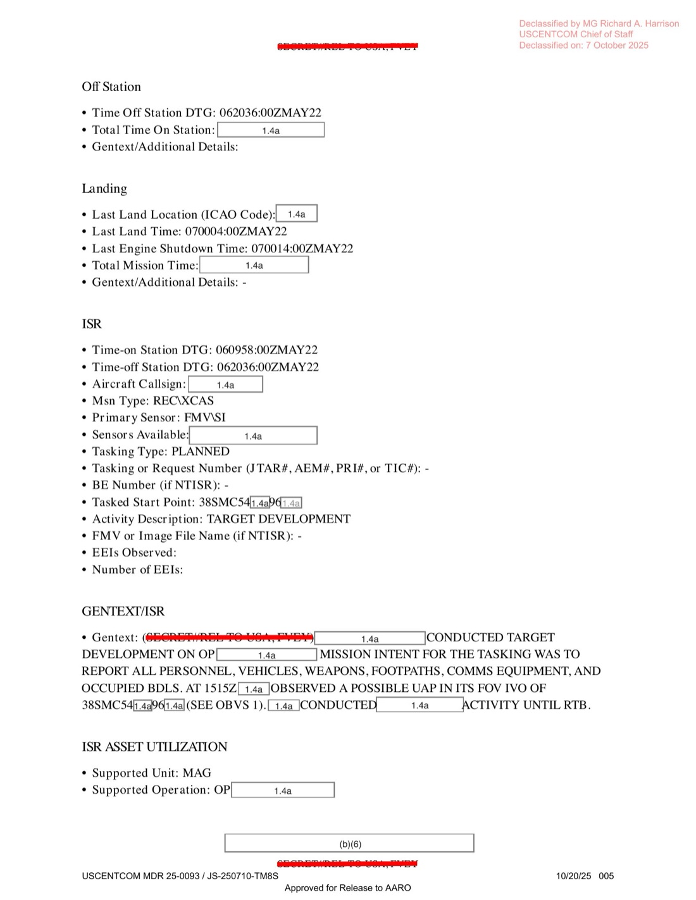

# #035 DOW-UAP-D10 Mission Report：伊拉克 2022-05-06 MQ-9 Reaper 21 小時任務目擊 5 個 UAP（1 飛彈狀 + 4 鳥狀）

| 欄位 | 內容 |
|---|---|
| 報告類型 | MISREP（Mission Report，任務報告） |
| 識別碼 | DOW-UAP-D10 |
| 任務日 | 2022-05-06（起飛 02:46Z）至 2022-05-07（最終引擎熄火 00:14Z） |
| 目擊時間 | 2022-05-06 15:14Z 至 19:34Z（4 小時 20 分鐘間斷觀測 5 次） |
| 行動 | INHERENT RESOLVE（OIR，反 ISIS 聯合特遣部隊作戰） |
| 主管 | USCENTCOM／AFCENT／609 CAOC（Combined Air Operations Center, Al Udeid Air Base, Qatar） |
| 機隊 | 432d Air Expeditionary Wing（MQ-9 Reaper 主力中隊，根據地 Creech AFB） |
| 機型 | XCAS（Cross-domain Close Air Support）+ FMV/SIGINT 主感測器 |
| 任務地點 | 伊拉克 38SMC5X (Mosul/Anbar/Ninewa 區，5 位數座標被遮蔽) |
| 原始機密層級 | SECRET（含特定情報來源 caveats） |
| 解密日期 | 預定 2047-05-06（25 年 hold） |
| 釋出途徑 | USCENTCOM MDR 25-0098 / JS-250710-TM8S，Approved for Release to AARO |
| 公開日 | 2026-05-08 |

## 為什麼這份檔案開啟了現代軍方 UAP 任務報告的視窗

#035 是 War Department 2026-05-08 釋出的 44 份「DOW-UAP-D 系列」MISREP 中最早公開的一份。這個系列代表的是現代戰場通報鏈：MQ-9 Reaper、F/A-18、F-35、E-2D 等平台機組／DGS（Distributed Ground Station）影像判讀員在執行 INHERENT RESOLVE（反 ISIS）、Operation Resolve、Pacific Sentry 等行動時，**透過 OPREP-3 通報程式遞交的標準格式報告**。

差別於 1947-1969 的 Project Sign/Blue Book 民間目擊蒐集，2022 年起的 MISREP 是：

1. **直接由現役機組／感測器操作員填報**：不再有「氣球」「金星」「冰冷雲層」等替代解釋的逐案核銷流程，UAP 被當作正規 ISR（Intelligence, Surveillance, Reconnaissance）資料項目記錄。
2. **AARO（All-domain Anomaly Resolution Office，全領域異常解決辦公室）為法定收件人**：2022 NDAA Sec 1683 要求 DoD 設立 AARO，所有美軍 UAP 通報必須遞送。本檔案 cover 頁明確標示「Approved for Release to AARO」。
3. **MDR（Mandatory Declassification Review）路徑**：USCENTCOM 透過 MDR 25-0098 案號審核後解密。原 25 年 hold（解密日 2047-05-06）被提前到 2026-05-08，提前 21 年。

本檔案是 USCENTCOM 系列 D10/D12/D14/D16/D18/D19/D20 一連串 2022-2024 反 ISIS 戰場 MISREP 的起頭。

## 1. 任務時序

D10 是一架 432 AEW 的 XCAS 任務（推測 MQ-9 Reaper，因 432 AEW 是 Reaper 主力中隊，且 XCAS + FMV + SIGINT + LRE 切換符合 Reaper 標準作業）。整個任務 21 小時，包含長距離跨海派遣到伊拉克 AOR（Area of Responsibility）：

| 時間（Zulu） | 動作 |
|---|---|
| 02:46Z | 起飛 |
| 02:53Z | 由 LRE（Launch and Recovery Element，本地起降組）切換到主控站（推測 Creech AFB, Nevada） |
| 09:58Z | 開始 SIGINT 收集，進入目標區 38SMC5X 進行 target development |
| **15:14Z** | **觀測 1 個 UAP（OBS 1，被列為 possible missile）** |
| **15:14–19:34Z** | **共觀測 5 個 UAP 橫越 FOV（4 個歸類為 possible birds）** |
| 20:36Z | 停止 SIGINT 收集，離開 station，返航 |
| 22:57Z | 切換回 LRE 進行降落 |
| 00:04Z（次日） | 著陸 |
| 00:14Z（次日） | 引擎熄火 |

LRE 切換 + SIGINT/FMV 雙感測器 + 22 小時持續時間 → MQ-9 Reaper 推測幾乎可確定。

## 2. 觀測本身

OBS 1 的完整 gentext：

> Gentext: (S/REL TO USA, FVEY) FROM 1514Z to 1934Z, [REDACTED] OBSERVED 5X UAP FLY ACROSS THE SCREEN. AT 1514Z [REDACTED] OBSERVED A UAP WITH THE VISRECCE OF A POSSIBLE [REDACTED] MISSILE FLY ACROSS THE FOV IVO 38SMC5[XX]P6[XX]. [REDACTED] PROCEEDED TO SEE 4X OTHER UAPS IN THEIR FOV UNTIL 1934Z. ALL 4X REMAINING UAP FIT CLOSER TO THE PROFILE OF POSSIBLE BIRDS.

> Gentext:（機密／可釋出予美國、五眼）由 1514Z 到 1934Z，[遮蔽] 觀測到 5 個 UAP 橫越螢幕。1514Z [遮蔽] 觀測到 1 個 UAP，視覺判讀（VISRECCE）顯示為可能的 [遮蔽] 飛彈，橫越視野（FOV），位於 38SMC5[XX]P6[XX] 附近。[遮蔽] 繼續觀測到 4 個其他 UAP 在視野中，直到 1934Z。剩餘 4 個 UAP 的特徵更接近可能的鳥類。

天氣：

> Weather: (S/REL TO USA, FVEY) DUST HINDERED MOST FMV COLLECTION OF THE GROUND.

> 天氣：（機密／可釋出予美國、五眼）沙塵阻礙了大部分對地面的 FMV 收集。

ISR 段 gentext（OP 任務意圖）：

> Gentext: (S/REL TO USA, FVEY) [REDACTED] CONDUCTED TARGET DEVELOPMENT ON OP [REDACTED]. MISSION INTENT FOR THE TASKING WAS TO REPORT ALL PERSONNEL, VEHICLES, WEAPONS, FOOTPATHS, COMMS EQUIPMENT, AND OCCUPIED BDLS. AT 1515Z [REDACTED] OBSERVED A POSSIBLE UAP IN ITS FOV IVO [REDACTED] (SEE OBS 1). [REDACTED] CONDUCTED [REDACTED] ACTIVITY UNTIL RTB.

> Gentext:（機密／可釋出予美國、五眼）[遮蔽] 對行動 [遮蔽] 進行目標研發。任務指派意圖為通報所有人員、車輛、武器、步道、通訊裝備與已佔據建築物（BDLs）。1515Z [遮蔽] 在其視野（FOV）內觀測到一個可能的 UAP，位於 [遮蔽] 附近（見 OBS 1）。[遮蔽] 持續執行 [遮蔽] 活動直到返航（RTB）。

目擊發生在「對地目標研發」任務脈絡中（人員／車輛／步道／佔據建物）。「飛彈狀 UAP」的判讀來自 VISRECCE（visual reconnaissance）：機組／DGS 影像判讀員看到形狀但無法確定。剩下 4 個「可能鳥類」較易解釋，沙塵環境下中東地區夏季空中鳥群活動極多。

## 3. 為什麼 UAP 通報 MQ-9 看到的鳥

讀者第一個疑問：如果剩下 4 個是「possible birds」，為什麼要當成 UAP 通報？

答案在 2022 NDAA Section 1683 對 UAP 的定義：**「near-space, atmospheric, and submerged objects」，凡感測器發現但未能即時確認身分的物體即須通報**。換言之，現代 UAP 通報採取「先標記後解釋」原則，現場操作員看到不確定的影像就需填 OPREP-3，由 AARO 後續做集中分析。

這個流程造成 D10 這類「1 個飛彈狀 + 4 個鳥狀」的混合條目：

- **正面意義**：消除以往「機組壓抑通報以免被嘲笑」的回報恐懼（Ryan Graves 2014-15 VFA-11 訓練飛行期間描述的問題，見 [#155 墨西哥國會聽證](../155-state_dept_uap_cable_5_mexico_2023/report.md)）。
- **負面意義**：噪音率高，AARO 需在大量「鳥／氣球／飛彈／碎片」中找出真正異常。

D10 OBS 1 的「飛彈狀 UAP」是這份檔案的真正資產：在 OIR 反 ISIS 戰場上，可能的飛彈推測指向何方未在文件中說明（伊朗代理人 Kata'ib Hezbollah/PMF 火箭/無人機？ISIS 殘部？俄羅斯？以色列空襲 Syria 殘存軌跡進入伊拉克？），但 432 AEW 在 MOSL/Anbar 對地任務期間看見 missile profile 的高速橫向飛行物，是該時期區域代理人衝突的指標性事件。

## 4. 觀察

**(1) MISREP 取代 Project Blue Book 結案表**：1948-1952 FSR 200-4 表單（[#025 FSR 200-4 1948-1949](../025-342_hs1-416511228_319.1_flying_discs_1949/report.md)）26 個欄位涵蓋目擊環境、機型、解釋分類。2022 MISREP 表單欄位多達 80 個以上（aircraft callsign / sensor names / radar / RWR / chaff / flare / decoy / 武器掛載 / TGT pod / data link 等），但**核心欄位「Observed Activity Description: 1X UAP」極簡**。這是 OPREP-3 體系的特徵：標記事實，留給 AARO 集中分析。

**(2) AARO「全資料庫」策略的物質基礎**：本檔案 cover 明確「Approved for Release to AARO」。AARO 自 2022 成立以來建立的 UAP 案件資料庫即由此類 MISREP 構成。D10 之後 War Dept 2026-05-08 釋出的這 44 份僅是冰山一角：DoD 內部估計 AARO 收件已逾 1500 案（2024 AARO 年度報告數字）。

**(3) 25 年 hold 提前 21 年解密的意義**：原始解密日為 2047-05-06，本次 MDR 提前到 2026-05-08。提前的 21 年正是 Trump 政府執行「Presidential Unsealing and Reporting System for UAP Encounters」承諾的結果。USCENTCOM MDR 25-0098 是這個系列的整批案號。

**(4) FMV/SIGINT 雙感測器與 SWIR/IR 缺席的對照**：D10 主感測器為 FMV（電光／可見光）+ SIGINT（訊號情報），未列 SWIR（短波紅外）或 thermal。對照 [#044 DOW-UAP-D25 希臘 2024-01](https://www.war.gov/UFO/#DOW-UAP-D25,%20Mission%20Report,%20Greece,%20January%202024) 的「菱形 UAP 僅 SWIR 可見」案，可見不同任務感測器配置決定可觀測物理特徵的範圍。沙塵環境的 D10 若有 SWIR 可能能解析鳥與非鳥的差異。

## 5. 跨檔案連結

- **[#155 State Dept Cable Mexico 2023](../155-state_dept_uap_cable_5_mexico_2023/report.md)**：Ryan Graves 在 2014-15 期間於 VFA-11 描述的「機組看到但不敢通報」現象。本檔案 D10 是「敢通報」之後通報出來的內容樣本。
- **[#017 AMC Project Sign 1947](../017-18_100754_general_1946-7_vol_2/report.md)**：1947-12-30 USAF 首次官方立案調查飛碟。從 Project Sign（1947）到 AARO（2022）的 75 年制度演化線上，D10 是 2022 起新體系的第一案。
- **[#025 FSR 200-4 1948-1949](../025-342_hs1-416511228_319.1_flying_discs_1949/report.md)**：FSR 200-4 26 欄位 vs. MISREP 80+ 欄位的表單史對照。
- **[#029 1963 Hunter NASC 備忘錄](../029-59_214434_sp_16_1963_alien_race/report.md)**：Hunter 預言美國 UAP 政策將以「ad hoc」「grand panic」方式處理。D10 + AARO 集中通報體系是對 Hunter 預言的部分修正（從 ad hoc 到體系化），但仍非單一統一政策。

## 6. 來源

- 原始檔案：[U.S. Department of War — DOW-UAP-D10, Mission Report, Middle East, May 2022](https://www.war.gov/UFO/#DOW-UAP-D10,%20Mission%20Report,%20Middle%20East,%20May%202022)
- PDF 直接下載：`https://www.war.gov/medialink/ufo/release_1/dow-uap-d10-mission-report-middle-east-may-2022.pdf`
- 6 頁，原 SECRET（S/REL TO USA, FVEY），USCENTCOM MDR 25-0098 / JS-250710-TM8S 解密
- 公開日：2026-05-08
- 注意：War.gov UFO 頁面 metadata 標示「Middle East」，但實際內容明確為伊拉克（38S MGRS grid，OIR 任務）
