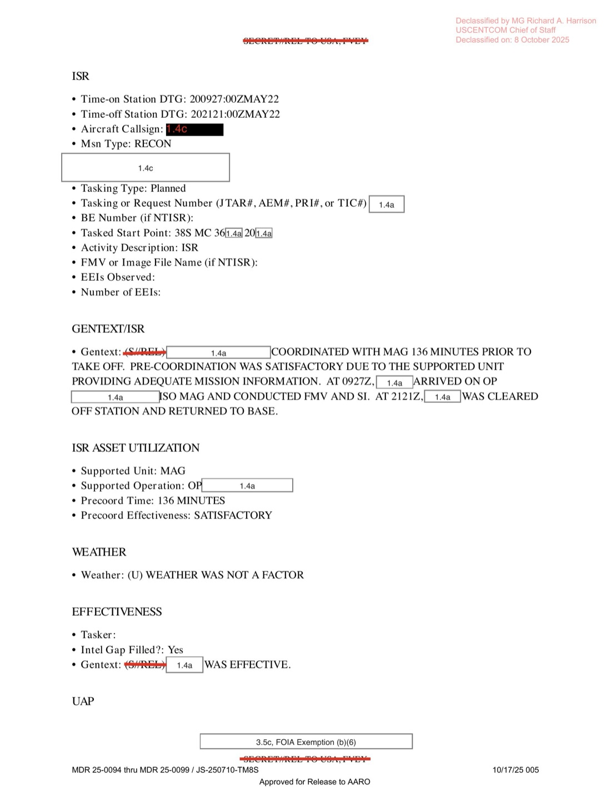

# #036 DOW-UAP-D12 Mission Report：伊拉克 2022-05-20 OP PHANTOM FLEX，196 ATKS MQ-9 在 18,000 ft 觀測 1 個 UAP

| 欄位 | 內容 |
|---|---|
| 報告類型 | MISREP |
| 識別碼 | DOW-UAP-D12 |
| 任務日 | 2022-05-20（起飛 05:42Z）至 2022-05-21（降落 00:36Z） |
| 目擊時間 | 2022-05-20 20:43Z |
| 行動 | INHERENT RESOLVE / OP PHANTOM FLEX |
| 主管 | USCENTCOM／ACC（Air Combat Command）／609 CAOC |
| 機隊 | 196 ATKS（196th Attack Squadron，加州空軍國民兵 March ARB，MQ-9 Reaper） |
| 友軍支援 | MAG（Marine Air-Ground 任務群） |
| SIGINT 平台 | AIRHANDLER Version 2 |
| 起降地 | OKAS（Ali Al Salem Air Base, Kuwait） |
| 任務地點 | 伊拉克 38SMC3X 區（PHANTOM FLEX OP） |
| 機載友軍高度 | 18,000 ft |
| 原始機密層級 | SECRET（含 ORCON / NOFORN 等 caveats） |
| 解密日期 | 預定 2047-05-21（25 年 hold） |
| 釋出途徑 | USCENTCOM MDR 25-0094 thru MDR 25-0099 / JS-250710-TM8S |
| 公開日 | 2026-05-08 |

## 為什麼這份檔案的細節值得注意

D12 是 D10 之後 14 天的 INHERENT RESOLVE 任務，但機組來自 **196 ATKS**（196th Attack Squadron）而非 432 AEW，並在 OP **PHANTOM FLEX** 框架下執行任務支援 MAG（Marine Air-Ground Task Force）。三組訊息值得關注：

1. **AIRHANDLER Version 2 訊號情報平台**：MQ-9 Reaper 機載 SIGINT 套件，過去屬高度機密。MDR 25-0094 至 25-0099 整批 USCENTCOM 釋出讓平台名稱首次出現在解密公文中。
2. **OP PHANTOM FLEX**：USCENTCOM 2022-05 期間針對伊拉克西部某一行動代號，本檔案是少數公開記錄之一。內容指向 MAG 海軍陸戰隊空地特遣群的伊拉克 ISO（In Support Of）行動。
3. **「Screener could not get a positive ID」**：DGS（Distributed Ground Station）影像判讀員（screener）已明確無法分類，但仍按 OPREP-3 程序送出 UAP 通報。這正是 [#035 D10](../035-dow_uap_d10_mission_report_iraq_may_2022/report.md) 一文討論的「先標記後解釋」原則的具體呈現。

## 1. 任務時序與行動脈絡

D12 是 19 小時跨界 MQ-9 任務：

| 時間（Zulu） | 動作 |
|---|---|
| 05:42Z | 起飛 OKAS（Ali Al Salem AB, Kuwait），「晚起飛」 |
| 05:51Z | 由 LRE 切到主控站（推測 March ARB, CA） |
| 06:14Z | 開始 SIGINT 收集（AIRHANDLER V2） |
| 09:27Z | 抵達 OP PHANTOM FLEX 任務區，38SMC3X，支援 MAG，執行 ISR 1 |
| **20:43Z** | **觀測 1 個 UAP，由北飛向東北，盡可能追蹤** |
| 21:21Z | 獲准離站、返航 |
| 23:46Z | 停止 SIGINT 收集 |
| 00:05Z（次日） | 切換回 LRE |
| 00:36Z | 降落 OKAS |

任務型態（Msn Type）：RECON。主感測器：FMV + SI。Tasking type：Planned。

**OKAS（Ali Al Salem Air Base）**：美軍科威特主要 MQ-9 起降基地，距離伊拉克邊境約 60 km。Reaper 從這裡升空後切換給遠端主控（CONUS 內陸 March ARB 或 Holloman AFB 之類），任務結束再切回 LRE 降落。

**OP PHANTOM FLEX**：根據可公開資料，PHANTOM 系列是 USCENTCOM 對伊拉克／敘利亞區域代理人威脅監控行動的代號之一。MAG 支援指向 2022-05 SDF（敘利亞民主部隊）／伊拉克 PMF（Popular Mobilization Forces，伊朗代理人）邊界張力期間的監視行動。

## 2. 觀測本身

OBS 1 在任務即將返航前 38 分鐘發生：

> UAP Description (e.g., size, shape, color, markings, recognizable features): (S/REL TO USA, FVEY) [REDACTED] OBSERVED A UAP AT 2043Z FLY NORTH TO NORTH EAST AND FOLLOWED AS LONG AS POSSIBLE. SCREENER COULD NOT GET A POSITIVE ID ON THE UAP.

> UAP 描述（如：尺寸、形狀、顏色、標記、可辨識特徵）：（機密／可釋出予美國、五眼）[遮蔽] 在 2043Z 觀測到 1 個 UAP 由北向東北飛行，盡可能持續追蹤。影像判讀員（Screener）無法對該 UAP 取得明確識別。

關鍵 metadata：

- **Initial Contact DTG**: 2022-05-20 20:43:00Z
- **Friendly Aircraft Location**: 38SMC84[X]77[Y]（MGRS 5 位數座標被遮蔽，38S MGRS grid 涵蓋伊拉克中部）
- **Friendly Aircraft Altitude/Depth**: 18,000 FT（MQ-9 Reaper 巡航高度）
- **UAP First Seen Location**: 38SMC79[X][X]（離 Reaper 約 5 km，依 MGRS 兩位數位移推算）
- **Number of UAP Sighted**: 1
- **UAP Altitude, Depth, Velocity, and Trajectory**: UNK
- **MDS Type / Asset Type / Tail Number**: UNK／UNK
- **UAP Physical State / Signatures / RF Frequency / RF Duration**: 全空白

「Screener could not get a positive ID」一句是這類 MISREP 的核心：機載 FMV + SIGINT 完整捕捉，但 DGS 後製影像判讀無法歸類。對照 [#035 D10](../035-dow_uap_d10_mission_report_iraq_may_2022/report.md) 的「VISRECCE 顯示為可能飛彈／鳥」，D12 連 VISRECCE 都無分類。

## 3. ISR 段提供的 UAP 任務環境

ISR 段 gentext：

> Gentext: (S/REL TO USA, FVEY) [REDACTED] COORDINATED WITH MAG 136 MINUTES PRIOR TO TAKEOFF. PRE-COORDINATION WAS SATISFACTORY DUE TO THE SUPPORTED UNIT PROVIDING ADEQUATE MISSION INFORMATION. AT 0927Z, [REDACTED] ARRIVED ON OP [REDACTED] (MAG) AND CONDUCTED FMV AND SI. AT 2121Z, [REDACTED] WAS CLEARED OFF STATION AND RETURNED TO BASE.

> Gentext:（機密／可釋出予美國、五眼）[遮蔽] 與 MAG 在起飛前 136 分鐘協調。預先協調令人滿意，因受支援單位提供了足夠的任務資訊。0927Z [遮蔽] 抵達 OP [遮蔽]（MAG）並執行 FMV 與 SI（訊號情報）。2121Z [遮蔽] 獲准離站並返航。

天氣：**WEATHER WAS NOT A FACTOR**（對比 D10 沙塵阻礙 FMV）。
任務有效性：**INTEL GAP FILLED? YES**。
ISR 評語：**WAS EFFECTIVE**。

D12 因此是天氣良好 + 任務成功 + UAP 觀測同時發生的高品質紀錄案例。Reaper 在 18,000 ft 巡航時看到 UAP 飛向 N/NE，判讀人員無法分類，意味著：

- 不是已知商業／軍方航空器（不在 OP 已知友軍清單，IFF 未顯示）
- 不是已知氣球（沒有飄移特徵描述）
- 不是已知鳥類（鳥的 FMV signature 大多容易識別，DGS 訓練有素）

至於「為何飛向 N/NE」：伊拉克中部 38S grid 向北東約是 Mosul → 庫德斯坦方向，向東北延伸進入伊朗西部山區。這個飛行方向的目的物可能是越境物體。

## 4. 觀察

**(1) AIRHANDLER V2 SIGINT 平台揭露**：MQ-9 Reaper 機載 SIGINT 套件 AIRHANDLER 自 2009 開始部署，Version 2 約 2018 後上線，但官方對外確認極少。MDR 25-0094-25-0099 整批 USCENTCOM 釋出第一次讓 AIRHANDLER Version 2 出現在公開文件。對 MISREP 來說這意味該機在 UAP 觀測時段同時做 SIGINT 收集，後續 AARO 分析可參考是否有 RF signature 對應目擊時間。

**(2) 196 ATKS Air National Guard 主導 OIR**：196 ATKS（March Air Reserve Base, California）是加州 ANG 的 163rd Attack Wing 下屬中隊，自 2007 起運作 MQ-9 並執行 OIR 遠端控制任務。本檔案是 ANG 中隊在 OIR 任務脈絡中產生的 UAP 報告，可推測類似報告在 Holloman / Hancock Field / Ellsworth 等其他 MQ-9 ANG 中隊也存在但未必都釋出。

**(3) OP PHANTOM FLEX 公開首次**：本檔案是這個 USCENTCOM 行動代號首次在公開政府文件中出現的記錄。

**(4) MGRS 38SMC grid 系統性遮蔽**：D10 / D12 兩份檔案都使用 38SMC grid 但詳細座標 4-5 位數被遮蔽。38SMC 大致對應伊拉克北中部（Mosul、Tikrit、Kirkuk 一帶）。這個遮蔽程度顯示美軍仍視該區具體任務位置為敏感資訊，但 grid square 等級已可公開。

## 5. 跨檔案連結

- **[#035 DOW-UAP-D10 伊拉克 2022-05-06](../035-dow_uap_d10_mission_report_iraq_may_2022/report.md)**：D12 14 天前的同型任務，432 AEW vs. 196 ATKS 機隊差異，沙塵環境 vs. 天氣良好的觀測品質對比。
- **[#155 State Dept Cable Mexico 2023](../155-state_dept_uap_cable_5_mexico_2023/report.md)**：Ryan Graves 描述「機組看到但不敢通報」歷史。D12 的「Screener could not get positive ID 但仍正式通報」是這個文化轉變的證據。

## 6. 來源

- 原始檔案：[U.S. Department of War — DOW-UAP-D12, Mission Report, Iraq, May 2022](https://www.war.gov/UFO/#DOW-UAP-D12,%20Mission%20Report,%20Iraq,%20May%202022)
- PDF 直接下載：`https://www.war.gov/medialink/ufo/release_1/dow-uap-d12-mission-report-iraq-may-2022.pdf`
- 6 頁，原 SECRET，USCENTCOM MDR 25-0094-25-0099 / JS-250710-TM8S 解密
- 公開日：2026-05-08
