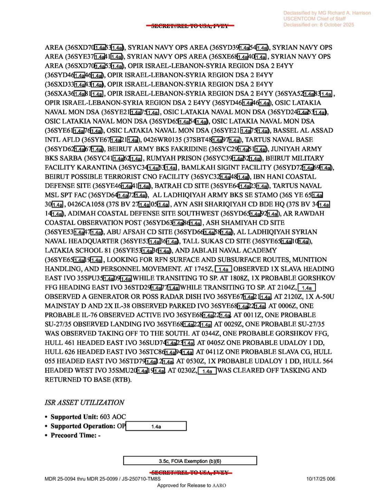
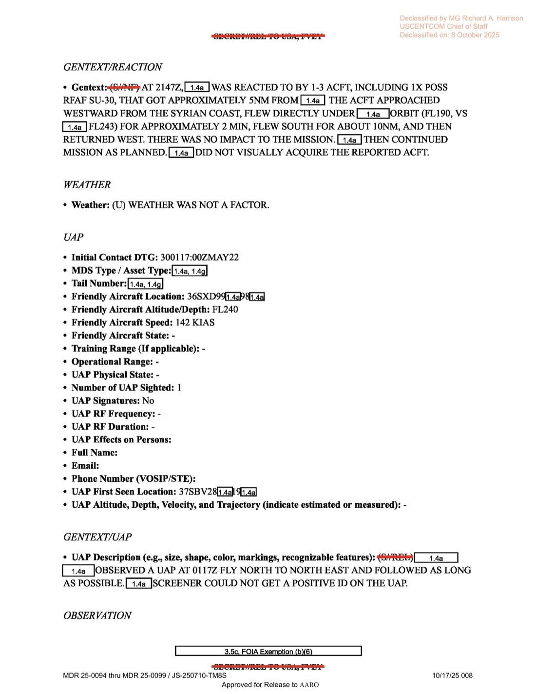
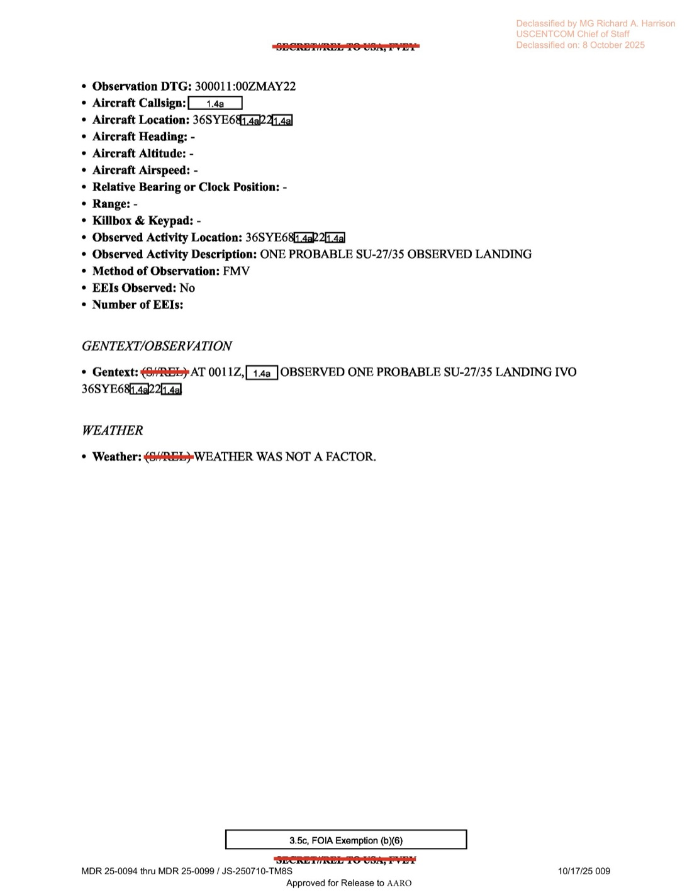

# #037 DOW-UAP-D14：2022-05-29 Eastern Mediterranean，MQ-9 監視俄羅斯地中海艦隊期間遭 Su-30 攔截 + 觀測 1 個小型 UAP

| 欄位 | 內容 |
|---|---|
| 報告類型 | MISREP |
| 識別碼 | DOW-UAP-D14 |
| 任務日 | 2022-05-29（起飛）至 2022-05-30（10:25Z 降落） |
| 行動 | 603 AOC / OP HUMMER SICKLE（USAFE-AFAFRICA） |
| 起飛基地 | LICZ（Naval Air Station Sigonella，義大利） |
| 降落基地 | LRCT（Mihail Kogălniceanu Air Base，羅馬尼亞康斯坦察） |
| 任務地點 | 黎巴嫩／敘利亞外海，Bassel Al-Assad 機場、Tartus 海軍基地、Latakia 海岸防衛系統 |
| SIGINT 平台 | AIRHANDLER |
| FMV 利用 | DGS-IN + DGS-4 |
| 任務型態 | RECON 多目標 ISR |
| UAP 觀測時間 | 2022-05-30 01:17Z（友軍位於 FL240, 142 KIAS） |
| 俄方反應 | 2022-05-29 21:47Z，1-3 架敵機（含 1 架疑似 RFAF Su-30）距 MQ-9 5 nm，於 FL190 從 MQ-9 軌道下方通過 2 分鐘 |
| 同任務 OBS | 2022-05-30 00:11Z 觀測 1 架可能 Su-27/35 降落於 Bassel Al-Assad；00:29Z 1 架同型起飛南向 |
| 機密層級 | SECRET（含 ORCON/NOFORN 等 caveats） |
| 解密日期 | 預定 2047，提前釋出 |
| 釋出途徑 | USCENTCOM MDR 25-0094 thru MDR 25-0099 / JS-250710-TM8S（注：發布單位是 USAFE 體系卻被收進 USCENTCOM MDR 整批） |
| 公開日 | 2026-05-08 |
| PDF 頁數 | 9 頁 |

## 為什麼這份檔案是 44 份 MISREP 中最重要的一份

D14 不是 D10/D12 那種純粹的「DGS 看到 UAP 無法 ID」單一觀測。它是一份 9 頁完整 MISREP，**同時**捕捉：

1. **MQ-9 監視俄羅斯地中海艦隊與 Bassel Al-Assad 俄軍機場的 ISR 主任務**：本任務 ISR Line 1 列出 **40 個以上的目標座標**，涵蓋 Syrian Navy OPS Areas、OPIR ISRAEL-LEBANON-SYRIA REGION DSA、Latakia naval mon DSA、Bassel Al-Assad 機場、Tartus 海軍基地、Beirut 軍營、Baalbek SIGINT 設施、Hezbollah 可能設施。
2. **RFAF Su-30 對美 MQ-9 攔截事件**：2022-05-29 21:47Z，俄羅斯聯邦空天軍（RFAF）Su-30 自敘利亞海岸西飛，於 FL190 從 MQ-9（FL243）軌道下方通過 2 分鐘，向南 10 nm 後返回西方。這是 2023-03-14 黑海 Su-27 撞擊 MQ-9 致毀事件（迫使 MQ-9 墜入黑海）的前 9.5 個月，且發生在 Mediterranean 而非黑海。
3. **同一架 MQ-9 同一任務內觀測 1 個小型 UAP**：2022-05-30 01:17Z，友軍 FL240、142 KIAS。DGS screener「無法取得明確 ID」。發生於 SU-30 攔截後 3.5 小時、SU-27/35 落 Bassel Al-Assad 後 66 分鐘。

也就是說，這份檔案是**俄羅斯 Aerospace Forces 已經在執行 NATO 軍機攔截任務的同一時刻、同一空域，美方 MQ-9 還看到一個無法歸類為俄機的另一物體**。AARO 收到這份 MISREP 後可對照 SIGINT、空管、衛星資料判定該 UAP 是否為第三方平台。

## 1. 任務時序

MQ-9 從 NAS Sigonella（義大利西西里島）起飛，跨整個地中海到敘利亞外海執勤後，**降落於羅馬尼亞 Mihail Kogălniceanu Air Base**（LRCT，黑海西岸 NATO 樞紐）。這個起降不同基地的安排顯示美軍將該機重新部署到 USEUCOM 黑海對俄前線。

| 時間（Zulu） | 動作 |
|---|---|
| ~14:24Z（05-29） | 起飛 Sigonella（LICZ） |
| 14:24Z | 由 LRE 切換 |
| 15:07Z | 開始 SIGINT 收集（AIRHANDLER） |
| 15:51Z | 抵達 SRO（Special Reconnaissance Orbit）track 41EMD |
| 19:38Z | 開始 IMINT，支援 603 AOC OP HUMMER SICKLE，41EMD Eastern Med |
| **21:47Z** | **遭 1-3 架敵機反應，含 1 架可能 RFAF Su-30（5 nm 距離）** |
| 00:11Z（05-30） | 觀測 1 架可能 Su-27/35 LANDING 於 Bassel Al-Assad |
| 00:29Z | 觀測 1 架可能 Su-27/35 起飛南向 |
| **01:17Z** | **觀測 1 個小型 UAP，飛向北/東北** |
| 02:30Z | 獲准返航 |
| 06:16Z | 離站 |
| 09:34Z | 切回 LRE |
| 10:25Z | 降落 LRCT（康斯坦察，羅馬尼亞） |

主控站推測為 Creech AFB 或 Hancock Field（Reaper CONUS 遠端控制中心）。

## 2. ISR 主任務：俄羅斯地中海艦隊與 Bassel Al-Assad 監視

ISR Line 1 列舉了 MQ-9 鏡頭涵蓋的**敘利亞／黎巴嫩沿岸軍事目標座標清單**（部分翻譯）：

> ... SYRIAN NAVY OPS AREA (36SYD39...), OPIR ISRAEL-LEBANON-SYRIA REGION DSA 2 E4YY (multiple 36S grids), OSIC LATAKIA NAVAL MON DSA (multiple grids), BASSEL AL ASSAD INTL AFLD (36SYE67...), TARTUS NAVAL BASE (36SYD62...), BEIRUT ARMY BKS FAKRIDINE (36SYC29...), JUNYAH ARMY BKS SARBA (36SYC4...), RUMYAH PRISON (36SYC39...), BEIRUT MILITARY FACILITY KARANTINA (36SYC34...), BAMLKAH SIGINT FACILITY (36SYD74...), BEIRUT POSSIBLE TERRORIST CNO FACILITY (36SYC32...), IBN HANI COASTAL DEFENSE SITE, BATRAH CD SITE, TARTUS NAVAL MSL SPT FAC, AL LADHIQIYAH ARMY BKS SE STAMO, AYN ASH SHARIQIYAH CD BDE HQ, ADIMAH COASTAL DEFENSE SITE, AR RAWDAH COASTAL OBSERVATION POST, ASH SHAMIYAH CD SITE, ABU AFSAH CD SITE, AL LADHIQIYAH SYRIAN NAVAL HEADQUARTER, TALL SUKAS CD SITE, LATAKIA SCHOOL 81, JABLAH NAVAL ACADEMY, LOOKING FOR REN SURFACE AND SUBSURFACE ROUTES, MUNITION HANDLING, AND PERSONNEL MOVEMENT.

> ... 敘利亞海軍作戰區（多個座標），ISRAEL-LEBANON-SYRIA 區域 OPIR DSA 2 E4YY（多個座標），LATAKIA 海軍監視 DSA，Bassel Al-Assad 國際機場，Tartus 海軍基地，貝魯特 FAKRIDINE 陸軍營，JUNYAH SARBA 陸軍營，RUMYAH 監獄，貝魯特 KARANTINA 軍事設施，BAMLKAH SIGINT 設施，貝魯特可能的恐怖份子 CNO（計算機網路作戰）設施，IBN HANI 海岸防衛點，BATRAH CD 點，Tartus 海軍飛彈支援設施，AL LADHIQIYAH 陸軍營，AYN ASH SHARIQIYAH 海岸防衛旅總部，ADIMAH 海岸防衛點，AR RAWDAH 海岸觀測哨，ASH SHAMIYAH CD 點，ABU AFSAH CD 點，AL LADHIQIYAH 敘利亞海軍總部，TALL SUKAS CD 點，LATAKIA School 81，JABLAH 海軍學院，搜尋俄羅斯海軍水面與水下航線、彈藥處理與人員移動。

ISR Line 1 列出的觀測時序（俄羅斯海軍部分）：

- 17:45Z：**1x SLAVA 級巡洋艦東行**於 35SPU3 區
- 18:08Z：**1x 可能 GORSHKOV 級巡防艦東行**於 36STD29
- 21:04Z：Bassel Al-Assad 機場觀測 1 個發電機或可能雷達天線
- 21:20Z：Bassel Al-Assad 觀測 **1x A-50U MAINSTAY-D AWACS + 2x IL-38 May 反潛機** 停在停機坪
- 00:06Z（05-30）：1x 可能 IL-76 active 於 Bassel Al-Assad
- **00:11Z：1x 可能 Su-27/35 降落於 Bassel Al-Assad**
- 00:29Z：1x 可能 Su-27/35 起飛南向
- 03:44Z：**1x 可能 GORSHKOV 級巡防艦 hull 461 東行**
- 04:05Z：**1x 可能 UDALOY I 級驅逐艦 hull 626 東行**
- 04:11Z：**1x 可能 SLAVA 級巡洋艦 hull 055 東行**
- 05:30Z：1x 可能 UDALOY I 級驅逐艦 hull 564 西行

這是 2022-02 俄羅斯入侵烏克蘭後 3 個月，俄地中海艦隊在 Tartus 與東地中海的常規調度。MQ-9 任務直接捕捉到艦艇 hull 編號（461、055、564、626），這在公開情資領域極為罕見的解析度。

## 3. RFAF Su-30 攔截事件

> Gentext: (S//NF) AT 2147Z, [REDACTED] WAS REACTED TO BY 1-3 ACFT, INCLUDING 1X POSS RFAF SU-30, THAT GOT APPROXIMATELY 5NM FROM [REDACTED]. THE ACFT APPROACHED WESTWARD FROM THE SYRIAN COAST, FLEW DIRECTLY UNDER [REDACTED] ORBIT (FL190, VS FL243) FOR APPROXIMATELY 2 MIN, FLEW SOUTH FOR ABOUT 10NM, AND THEN RETURNED WEST. THERE WAS NO IMPACT TO THE MISSION. [REDACTED] THEN CONTINUED MISSION AS PLANNED. [REDACTED] DID NOT VISUALLY ACQUIRE THE REPORTED ACFT.

> Gentext:（機密／不可外洩）21:47Z，[遮蔽] 遭 1-3 架機反應，含 1 架可能 RFAF Su-30，最近約 5 海里。該機自敘利亞海岸西飛，於 FL190 從 [遮蔽] 軌道（FL243）下方直接通過約 2 分鐘，向南飛約 10 海里，隨後返回西方。任務未受影響。[遮蔽] 隨後依計畫繼續任務。[遮蔽] 未對該機進行視覺確認。

REACTION 表單關鍵欄位：

- Initial Contact DTG: 2022-05-29 21:47:00Z
- Friendly Aircraft Location: 37S BV 34/14
- Friendly Aircraft Heading: 300°
- Friendly Aircraft Altitude: **FL243（約 24,300 ft）**
- Friendly Aircraft Airspeed: **148 KIAS**
- Number of Enemy Aircraft: 2
- **Enemy Aircraft Type: SU-30**
- **Enemy Aircraft Nationality: RUSSIAN**
- Source of ID: **NTIG**（國家技術情報界判定）
- Enemy Aircraft Heading: 270°
- **Enemy Aircraft Altitude: FL190**
- ESM: **No**（俄機未開啟電子戰系統）
- Countermeasures Employed: **NONE**

最後一句 **「[REDACTED] DID NOT VISUALLY ACQUIRE THE REPORTED ACFT」**：MQ-9 沒有透過 EO/IR 看到攔截的俄機。Su-30 的存在是透過 NTIG（國家技術情報，意指 SIGINT/雷達情資的 fused 判定）認定。MQ-9 在 FL243 高度、俄機在 FL190 高度（差 5,300 ft），俄機從下方通過代表了一次低 risk 但明確示威的接近。

對照 2023-03-14 黑海事件：俄 Su-27 倒油到 MQ-9 螺旋槳致機體墜海。D14 五月場景比 2023-03 早 9.5 個月，俄方戰術明顯較克制（保持距離 5 nm、未升至 MQ-9 同高度）。本檔案是俄美無人機緊張關係的早期記錄。

## 4. UAP 觀測本身

UAP 欄位摘要：

- **Initial Contact DTG: 2022-05-30 01:17:00Z**
- Friendly Aircraft Location: 36S XD 9X/XX
- **Friendly Aircraft Altitude: FL240**
- **Friendly Aircraft Speed: 142 KIAS**
- Number of UAP Sighted: 1
- UAP Signatures: **No**（無 RF / 紅外特殊 signature）
- UAP First Seen Location: 37S BV 28[X][X]
- UAP Altitude/Velocity/Trajectory: -

GENTEXT/UAP：

> UAP Description: (S/REL) [REDACTED] OBSERVED A UAP AT 0117Z FLY NORTH TO NORTH EAST AND FOLLOWED AS LONG AS POSSIBLE. [REDACTED] SCREENER COULD NOT GET A POSITIVE ID ON THE UAP.

> UAP 描述：（機密／可釋出）[遮蔽] 在 0117Z 觀測 1 個 UAP 飛向北/東北，盡可能持續追蹤。[遮蔽] 影像判讀員無法取得明確 ID。

**地理重要性**：MQ-9 友軍位置 36S XD 9X，UAP 首見位置 37S BV 28X。兩者在 Eastern Mediterranean 北部，36S XD 涵蓋地中海北部 Cyprus 南方海域，37S BV 涵蓋地中海／黑海交界區。UAP 北/東北飛向意味朝向土耳其／高加索方向。

**時間重要性**：01:17Z 已是 SU-30 攔截後 3.5 小時，並在 SU-27/35 落 Bassel Al-Assad 之後 66 分鐘。UAP 不在敘利亞航空交通結構內，亦不在以色列／黎巴嫩民用航線上。

D14 的 OBSERVATION 表單分開記錄了一個 **OBS Line 1：00:11Z 觀測可能 Su-27/35 降落於 36S YE 6X/2X**，這是 Bassel Al-Assad 跑道方位。明確區分「Su-27/35 是 Observation」「UAP 是 UAP」兩件事，意味機組／DGS 已排除「UAP 是另一架俄機」的可能性。

## 5. 觀察

**(1) MQ-9 over Eastern Med 的常態化**：本檔案顯示 USAFE-AFAFRICA 603 AOC 在 2022-05 已執行針對俄羅斯地中海艦隊的長時持續 ISR，從 Sigonella 起飛跨整個地中海 + 直接降落到羅馬尼亞 LRCT 表示資產可調度到黑海前線。D14 是這條北約 ISR 鏈在烏戰開戰後 3 個月的快照。

**(2) OP HUMMER SICKLE 行動代號**：本檔案是 OP HUMMER SICKLE 在公開政府文件中的早期記錄之一。USEUCOM／USAFE 對俄羅斯海軍與空軍的監視專案，與 USCENTCOM 的 OP INHERENT RESOLVE 形成分工：CENTCOM 看 ISIS／伊朗代理人，EUCOM 看俄方。

**(3) UAP 與俄機的明確區分**：D14 機組與 DGS 在同一任務中清楚把 Su-30 反應、Su-27/35 觀測、UAP 觀測三件事分別填入 REACTION／OBSERVATION／UAP 三張表單。這是制度化 UAP 通報的關鍵：機組沒有把所有不明物都歸成「UAP」混淆訊號，也沒有為了「正常化」事件而把 UAP 改填為「possible Su-27」。本檔案因此可作為 AARO「先標記後解釋」流程的成熟範例。

**(4) 解密後保留 OBS Line 1 完整艦艇 hull 編號**：MDR 解密過程保留了 GORSHKOV hull 461、SLAVA hull 055、UDALOY I hull 626 與 564 的完整編號。對應實際俄艦：055 應是 Slava 級 RFS Marshal Ustinov（055 為其北約代號編號）；461 對應 Admiral Gorshkov 級首艦 Admiral Gorshkov；626/564 為 Udaloy 級 Vice-Admiral Kulakov 與 Severomorsk 之一。這是 OSINT 社群可立即驗證的事實層。

## 6. 跨檔案連結

- **[#035 DOW-UAP-D10 伊拉克 2022-05-06](../035-dow_uap_d10_mission_report_iraq_may_2022/report.md)**：D10 是 432 AEW Iraq 純 MISREP。D14 同月但 USEUCOM 體系 + 多重事件（俄機反應 + UAP）。可對照「DGS 看到不能 ID」的判讀文化在 EUCOM／CENTCOM 一致。
- **[#036 DOW-UAP-D12 伊拉克 2022-05-20](../036-dow_uap_d12_mission_report_iraq_may_2022/report.md)**：D12 是 196 ATKS CENTCOM 任務。D14 機隊未署名但 LRE/AIRHANDLER 配置一致，推測為相同類型 MQ-9 部隊。
- **[#155 Mexico 2023 State Dept cable](../155-state_dept_uap_cable_5_mexico_2023/report.md)**：Ryan Graves 2014-15 描述「機組不敢通報 UAP」的文化問題。D14 同一機組同一任務正式通報 UAP 是這個文化變革的最強證據之一。

## 7. 來源

- 原始檔案：[U.S. Department of War — DOW-UAP-D14, Mission Report, Iraq, May 2022](https://www.war.gov/UFO/#DOW-UAP-D14,%20Mission%20Report,%20Iraq,%20May%202022)
- PDF 直接下載：`https://www.war.gov/medialink/ufo/release_1/dow-uap-d14-mission-report-iraq-may-2022.pdf`
- 9 頁，原 SECRET // ORCON/NOFORN，USCENTCOM MDR 25-0094-25-0099 / JS-250710-TM8S 解密
- 公開日：2026-05-08
- 注意：war.gov metadata 標示「Iraq, May 2022」但實際內容是 Eastern Mediterranean 任務（Sigonella → Constanta），主要監視目標在敘利亞／黎巴嫩外海與 Bassel Al-Assad。可能是政府 metadata 表單延用 USCENTCOM 整批分類。
