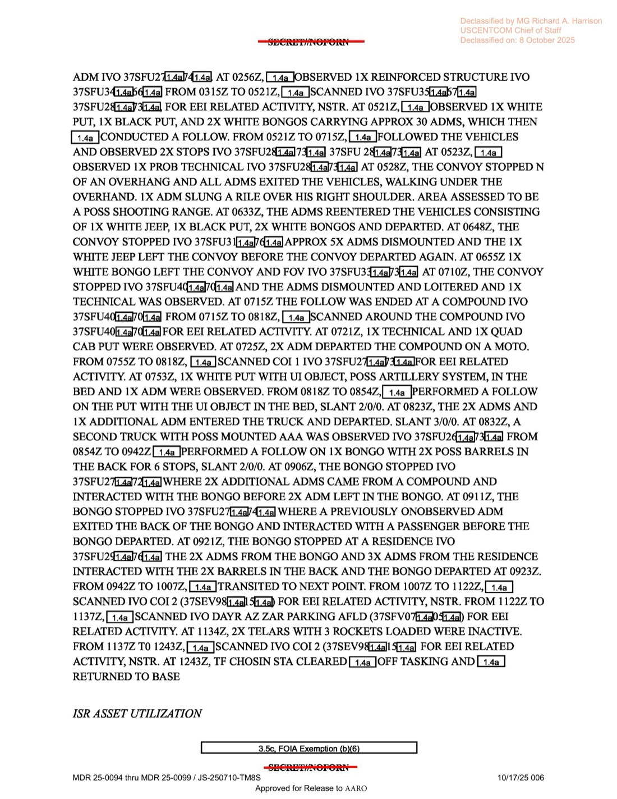

# #038 DOW-UAP-D16：2022-07-31 敘利亞 Deir ez-Zor TF CHOSIN 反恐車隊跟監期間目擊「不到 1 分鐘」UAP 由北向南

| 欄位 | 內容 |
|---|---|
| 報告類型 | MISREP |
| 識別碼 | DOW-UAP-D16 |
| 任務日 | 2022-07-30 起飛至 2022-07-31 降落（20.9 小時） |
| UAP 觀測時間 | 2022-07-31 02:39Z |
| 行動 | INHERENT RESOLVE，TF CHOSIN（Task Force CHOSIN，海軍陸戰隊任務群） |
| 主管 | USCENTCOM／AFCENT／609 CAOC |
| 起降基地 | OJMS（Muwaffaq Salti Air Base，約旦） |
| 任務地點 | 37SFU 區域（敘利亞東部 Deir ez-Zor 省） |
| 友軍高度 | 19,359 ft |
| 友軍速度 | 116 kts |
| UAP 移動 | N → S（北向南），持續時間 ≤ 1 分鐘 |
| 主要 IMINT 任務 | 跟監可疑 ISIS 車隊（白色 Jeep、黑色 PUT、白色 Bongo、Technical 武裝皮卡） |
| 機密層級 | SECRET // NOFORN |
| 解密日期 | 預定 2047-07-31，提前釋出 |
| 釋出途徑 | USCENTCOM MDR 25-0094 thru MDR 25-0099 / JS-250710-TM8S |
| 公開日 | 2026-05-08 |
| PDF 頁數 | 7 頁 |

## 為什麼這份檔案的脈絡與 D14 不同

D16 是 USCENTCOM 反 ISIS 戰場的純伊拉克／敘利亞東部地面跟監任務。執行單位是 **TF CHOSIN**（Task Force CHOSIN，名取自韓戰長津湖戰役，傳統屬美國海軍陸戰隊任務群），地理位置 **Deir ez-Zor 省**是 2017 SDF 解放後仍有 ISIS 殘部活動的核心區。

20.9 小時任務中，MQ-9 主要工作是地面車隊跟監：白色 Jeep、黑色 PUT（pickup truck）、白色 Bongo（小貨車）載著約 30 名 ADM（adult male），停在 overhang（岩棚）下被評為「可能射擊場」，其中一名 ADM 將步槍掛在右肩。後續跟監 Bongo 載著 2 桶不明物（可能化武原料？武器組件？）穿過數個 residence／compound 進行交接。

UAP 觀測本身極短：02:39Z **不到 1 分鐘**的 N → S 飛行物，發生在 IMINT 跟監車隊的同一視野中。

## 1. 任務時序

| 時間（Zulu） | 動作 |
|---|---|
| 30 16:39Z | TF CHOSIN STA 透過 7 Line 派遣 IMINT 任務 |
| 30 18:22Z | 從 Muwaffaq Salti AB（OJMS）起飛 |
| 30 18:29Z | LRE 切換 |
| 30 19:25Z | 開始 SIGINT 收集 |
| 30 20:28Z | 抵達任務區 37SFU3X，向 TF CHOSIN STA check in |
| **31 02:39Z** | **觀測 UAP 於 37SFU27[X]/[X]，KP 9（kill box / keypad 9）** |
| 31 02:56Z | 觀測 1 個強化結構（reinforced structure） |
| 31 03:15-05:21Z | 對 37SFU3X / 37SFU2X 區掃描，搜尋 BEI 相關活動，NSTR（無重大事件） |
| 31 05:21-07:15Z | 跟監車隊：白 Jeep + 黑 PUT + 2 白 Bongo 載 30 ADM |
| 31 05:28Z | 車隊停在 overhang 下，1 ADM 掛步槍於右肩，評為可能射擊場 |
| 31 06:33Z | ADM 重新上車離開 |
| 31 06:48Z | 5 ADM 下車，白 Jeep 離隊 |
| 31 07:10Z | 車隊停在 compound 旁，1 Technical 觀測到 |
| 31 07:15-08:18Z | 環掃 compound 找 EEI 活動 |
| 31 07:53Z | 觀測 1 白色 PUT 載「不明物 可能砲兵系統」於後車斗 |
| 31 08:18-08:54Z | 跟監載 UI（unknown item）卡車 |
| 31 08:32Z | 第二輛卡車「可能掛載 AAA（防空炮）」 |
| 31 08:54-09:42Z | 跟監 Bongo 載 2 桶經 6 站 |
| 31 11:22-11:37Z | DAYR AZ ZAR 停車場機場掃描，2 TELAR 載 3 火箭 inactive |
| 31 12:43Z | TF CHOSIN STA 清除任務、返航 |
| 31 13:43Z | RTB |
| 31 14:09Z | 終止 SIGINT 收集 |
| 31 14:58Z | LRE 切回 |
| 31 15:19Z | 降落 OJMS |

任務總計：20.9 mission hours、17.2 IMINT hours、18.7 SIGINT hours、2 total taskings。

## 2. UAP 觀測本身

UAP 欄位：

- **Initial Contact DTG: 2022-07-31 02:39:00Z**
- Friendly Aircraft Location: 37S FU 4[X]/8[X]
- **Friendly Aircraft Altitude: 19,359 FT**
- **Friendly Aircraft Speed: 116 KTS**
- Number of UAP Sighted: 1
- UAP Signatures: **No**
- UAP First Seen Location: 37S FU 27[X]/4[X]
- UAP Altitude/Velocity/Trajectory: -

GENTEXT/UAP：

> UAP Description: (S//NF) AT 310239Z, [REDACTED] OBSERVED AN UAP EVENT IVO 37SFU27[X]/4[X] IN KP 9. THE UAP OCCURED IN LESS THAN A MINUTE, WITH THE UAP MOVING FROM N TO S.

> UAP 描述：（機密／不可外洩）31 02:39Z [遮蔽] 觀測到 1 個 UAP 事件於 37SFU27[X]/4[X]，位於 KP 9（kill box / keypad 9）。UAP 持續時間不到 1 分鐘，由北向南移動。

**地理判讀**：37S FU 27 區位於敘利亞東部 Deir ez-Zor 省西側、Euphrates 河谷北岸。MQ-9 在 19,359 ft 高度 116 kts 速度，KP 9 是戰場 kill box / keypad 編號（OIR 將地圖分割成可派遣火力的方塊）。UAP 距 MQ-9 大約 13 nm。

**時間判讀**：02:39Z = 當地時間 05:39（夏令時 UTC+3），日出前。FMV 是電光感測器，黎明前可在熱對比下抓到地面與空中目標。

**N→S 飛行 < 1 分鐘**：若 UAP 在 MQ-9 視野中 N→S 橫越 < 1 分鐘，依 FOV 範圍推算速度約 100-300 kts，與彈道飛彈／鳥／無人機速度範圍有重疊。DGS 未給 positive ID。

## 3. ISR 主任務：可疑 ISIS 車隊跟監

ISR Line 1 完整描繪了一場 ISIS／武裝份子車隊跟監：

> 05:21Z [REDACTED] OBSERVED 1X WHITE PUT, 1X BLACK PUT, AND 2X WHITE BONGOS CARRYING APPROX 30 ADMS, WHICH THEN [REDACTED] CONDUCTED A FOLLOW. FROM 05:21Z TO 07:15Z, [REDACTED] FOLLOWED THE VEHICLES AND OBSERVED 2X STOPS... AT 05:28Z, THE CONVOY STOPPED N OF AN OVERHANG AND ALL ADMS EXITED THE VEHICLES, WALKING UNDER THE OVERHANG. 1X ADM SLUNG A RIFLE OVER HIS RIGHT SHOULDER. AREA ASSESSED TO BE A POSS SHOOTING RANGE.

> 05:21Z [遮蔽] 觀測到 1 輛白色 PUT、1 輛黑色 PUT、2 輛白色 Bongo 載約 30 ADM，[遮蔽] 隨後展開跟監。05:21Z 至 07:15Z 跟監車輛並觀測 2 次停車... 05:28Z 車隊停在岩棚北方，所有 ADM 下車走入岩棚下方。1 名 ADM 將步槍掛在右肩。該區評估為可能射擊場。

特定觀測：

- **07:53Z**：1 白色 PUT 後車斗載「不明物 可能砲兵系統」（UI OBJECT, POSS ARTILLERY SYSTEM）
- **08:32Z**：第二輛卡車「可能掛載 AAA（防空炮）」
- **08:54-09:42Z**：跟監 Bongo 載 2 桶不明物經 6 站，多次與其他 ADM 在 residence / compound 交接
- **11:34Z**：DAYR AZ ZAR 停車場機場觀測 **2 TELAR**（Transporter Erector Launcher And Radar）載 3 火箭，但 inactive

TELAR 出現在 DAYR AZ ZAR 是高度敏感資訊：TELAR 通常用於彈道飛彈或重型防空（如 9K37 Buk 或 Scud 系列）。OIR 標準作業是若 TELAR active 就會即時通報，inactive 仍記錄於日報供長期趨勢分析。

UAP 觀測（02:39Z）發生在這串車隊跟監**之前**（05:21Z 才開始 follow），意味著 UAP 不太可能是任務目標相關物（沒有跡象指 ISIS 武裝份子在 02:39Z 有空中活動）。02:56Z（UAP 17 分鐘後）觀測到強化結構，可能是 UAP 觸發了周邊環境搜索。

## 4. 觀察

**(1) 反 ISIS 戰場日常觀測 UAP 的頻率**：D10 / D12 / D16 三份都是 INHERENT RESOLVE 框架下的單機任務，三次都產生 UAP 通報。三件目擊都極短暫且 DGS 無法 ID。這意味在 OIR AOR 範圍內 MQ-9 任務看到 UAP 是常態化事件，不是異常的個案。

**(2) TF CHOSIN 在 Deir ez-Zor 的角色**：本檔案是 TF CHOSIN 在敘利亞東部 Euphrates 河谷的 ISR 直接證據。海軍陸戰隊 task force 持續駐紮敘利亞東部，與 SDF 合作監控 ISIS 殘部與伊朗代理人（IRGC、Kata'ib Hezbollah）穿越伊敘邊境的活動。

**(3) UAP 與地面任務的「時間距離」**：UAP 在 02:39Z 出現，地面跟監從 05:21Z 開始。中間 2.5 小時隔離意味著 UAP 不太可能是地面武裝份子放飛的偵察無人機（時間錯位太遠）。可能是當地民用無人機、其他飛行物、或感測器假象。但機組／DGS 仍按程序通報，這是 D10/D12 之外的另一個「先標記後解釋」案例。

**(4) MQ-9 IMINT/SIGINT 配比**：本任務 17.2 IMINT hours + 18.7 SIGINT hours，SIGINT 比 IMINT 早開始（19:25Z vs 20:28Z）並晚結束（14:09Z vs 13:43Z）。代表 SIGINT（推測 AIRHANDLER）作為環境感知支撐 IMINT 鎖定目標。SIGINT 段是否捕捉到 02:39Z UAP 對應的射頻訊號？這在公開 MISREP 中未揭露，但 AARO 內部分析應有此關聯。

## 5. 跨檔案連結

- **[#035 DOW-UAP-D10 伊拉克 2022-05-06](../035-dow_uap_d10_mission_report_iraq_may_2022/report.md)** ・ **[#036 DOW-UAP-D12 伊拉克 2022-05-20](../036-dow_uap_d12_mission_report_iraq_may_2022/report.md)**：USCENTCOM 反 ISIS 戰場 OIR 系列的前兩份 MISREP。D16 是 7 月份接續案。
- **[#037 DOW-UAP-D14 Eastern Med 2022-05-29](../037-dow_uap_d14_mission_report_eastern_mediterranean_may_2022/report.md)**：USAFE/USEUCOM 體系（Sigonella、603 AOC）的同時期任務，地理體系不同但同列「USCENTCOM MDR 25-0094-25-0099」整批解密。

## 6. 來源

- 原始檔案：[U.S. Department of War — DOW-UAP-D16, Mission Report, Syria, July 2022](https://www.war.gov/UFO/#DOW-UAP-D16,%20Mission%20Report,%20Syria,%20July%202022)
- PDF 直接下載：`https://www.war.gov/medialink/ufo/release_1/dow-uap-d16-mission-report-syria-july-2022.pdf`
- 7 頁，原 SECRET // NOFORN，USCENTCOM MDR 25-0094-25-0099 / JS-250710-TM8S 解密
- 公開日：2026-05-08
