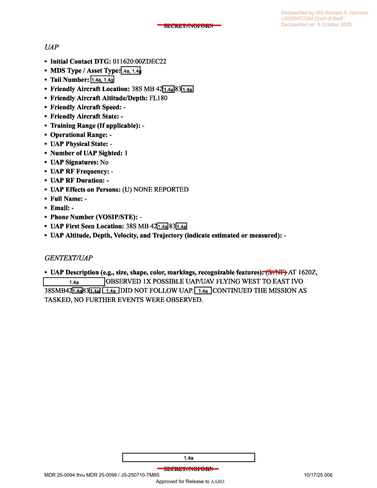

# #039 DOW-UAP-D18：2022-12-01 巴格達上空，482 ATKS MQ-9 在 FL180 觀測 1 個「可能 UAP/UAV」由西向東

| 欄位 | 內容 |
|---|---|
| 報告類型 | MISREP |
| 識別碼 | DOW-UAP-D18 |
| 任務日 | 2022-12-01 |
| UAP 觀測時間 | 16:20Z |
| 行動 | INHERENT RESOLVE |
| 主管 | USCENTCOM／ACC（Air Combat Command）／609 CAOC |
| 機隊 | **482 ATKS**（482nd Attack Squadron，Air Force Reserve，March Air Reserve Base, CA） |
| 起降基地 | OKAS（Ali Al Salem AB, Kuwait） |
| 任務地點 | 38S MB grid（巴格達區域，伊拉克中部） |
| 友軍高度 | FL180（18,000 ft） |
| UAP 方向 | 西 → 東，1 個 |
| UAP 性質 | 「可能 UAP/UAV」（首次明確列出可能無人機選項） |
| 機載友軍動作 | 未追蹤，繼續執行任務 |
| 影像利用單位 | DGS-AR（Distributed Ground Station - Air Reserve） |
| 機密層級 | SECRET // NOFORN |
| 解密日期 | 預定 2047-12-02 |
| 釋出途徑 | USCENTCOM MDR 25-0094 thru MDR 25-0099 / JS-250710-TM8S |
| 公開日 | 2026-05-08 |
| PDF 頁數 | 6 頁 |

## 為什麼這份是 D 系列中第一個「UAP/UAV」雙列檔

D18 是 D10 / D12 / D14 / D16 之後的第 5 份 USCENTCOM MISREP，但機組描述出現第一次明確的選項列表：

> OBSERVED 1X POSSIBLE UAP/UAV FLYING WEST TO EAST

「UAP/UAV」並列意味機組同時假設這可能是「真未識別現象」或「敵方無人機」。2022-12 巴格達上空的無人機威脅來源主要是 IRGC 與伊朗代理人 Kata'ib Hezbollah，使用 Shahed-136 / Mohajer-6 等小型 ISR/loitering 無人機從伊朗或敘利亞進入伊拉克。本檔案出現在這個威脅環境中，機組將 UAV 與 UAP 兩個假設並列是合理的戰術反應。

但機組「DID NOT FOLLOW UAP」（未追蹤），這意味：

1. 該物體距 MQ-9 較遠或速度太快，沒有時間切換 FOV
2. 主任務（在巴格達執行 TF 支援）的優先序高於 UAP 跟監
3. 沒有立即被判定為威脅物（沒有切到 weapons hot 模式）

## 1. 任務時序

| 時間（Zulu） | 動作 |
|---|---|
| 12:06Z | 從 OKAS（Ali Al Salem AB）起飛 |
| 12:20Z | LRE 切換 |
| 13:23Z | 開始 SIGINT 收集（AIRHANDLER）持續至次日 06:26Z |
| 15:18Z | 開始支援 TF [遮蔽] 於巴格達區，持續至 04:26Z |
| **16:20Z** | **觀測 1 個可能 UAP/UAV 由西向東於 38SMB43[X]/83[X]** |
| 04:26Z（12-02） | 獲准返航 |
| 06:26Z | 結束 SIGINT 收集 |
| 06:55Z | LRE 切回 |
| 07:23Z | 降落 OKAS |

任務總長約 19 小時 17 分。

## 2. 觀測本身

UAP 欄位：

- **Initial Contact DTG: 2022-12-01 16:20:00Z**
- Friendly Aircraft Location: 38S MB 4[X]/[X]
- **Friendly Aircraft Altitude: FL180（18,000 ft）**
- Number of UAP Sighted: **1**
- UAP Signatures: **No**（無 RF / 紅外特殊 signature）
- UAP Effects on Persons: **NONE REPORTED**
- UAP First Seen Location: 38S MB 43[X]/83[X]
- UAP Altitude/Velocity/Trajectory: -

GENTEXT/UAP：

> UAP Description: (S//NF) AT 1620Z, [REDACTED] OBSERVED 1X POSSIBLE UAP/UAV FLYING WEST TO EAST IVO 38SMB43[X]83[X]. [REDACTED] DID NOT FOLLOW UAP. [REDACTED] CONTINUED THE MISSION AS TASKED, NO FURTHER EVENTS WERE OBSERVED.

> UAP 描述：（機密／不可外洩）16:20Z [遮蔽] 觀測 1 個可能 UAP/UAV 由西向東飛行於 38SMB43[X]83[X] 附近。[遮蔽] 未追蹤該 UAP。[遮蔽] 依任務需求繼續執行，未再觀測到後續事件。

**地理判讀**：38S MB grid 涵蓋巴格達都會區與南郊。43[X]/83[X] 為 MGRS 5 位數座標，定位可達 10 公尺等級但被遮蔽。MQ-9 在 FL180（18,000 ft）高度，比 D10/D12 的 24,000 ft 低，可能因為任務需要更近的對地觀察解析度。

**方向「西向東」**：在巴格達上空，西向東飛行的物體可能來源：
- 從 Anbar 省（西部、伊敘邊境）飛入巴格達／伊朗方向 → 與伊朗代理人路徑相反
- 從敘利亞 Albu Kamal 過境 → 經 Anbar → 巴格達
- 民用航線（巴格達國際機場進場航路）

「DID NOT FOLLOW」加上「No Signatures」加上「未引發影響」三個條件，搭配機組將其列為「UAP/UAV」二選一，意味著該物體被機組視為**較低威脅**但**身分不明**。

## 3. 482 ATKS 與 DGS-AR：Air Force Reserve 體系

D18 的關鍵差異於其他 USCENTCOM 案件是它由 **482 ATKS**（482nd Attack Squadron）執行。482 ATKS 是位於 March ARB（加州）的 Air Force Reserve（空軍預備役）MQ-9 中隊，**並非 Air National Guard**（D12 的 196 ATKS 是加州 ANG）也非常規現役（D10 的 432 AEW）。

FMV 由 **DGS-AR** 利用：DGS（Distributed Ground Station）的 Air Reserve component，主要編制 PED（Processing, Exploitation, Dissemination，影像判讀）人員。

482 ATKS + DGS-AR 組合意味著該任務由 Reserve 體系獨立執行，並非與現役聯合作業。這顯示 2022 末美軍持續以 Reserve / ANG 為 OIR ISR 主力的長期趨勢（用 Reserve 維持作戰節奏、釋放現役單位給更高優先區域如太平洋或歐洲）。

## 4. 觀察

**(1) UAP/UAV 雙列首次明確化**：D10「possible missile + birds」、D12「screener could not get positive ID」、D14「small UAP」、D16「N→S < 1 min」、D18「UAP/UAV」。從 5 月到 12 月，機組描述的「分類化」程度明顯提高。D18 的「UAP/UAV」並列代表 AARO 通報文化中「UAV 可能性必須評估」的觀念已嵌入。對比 [#155 墨西哥國會 2023-09 Maussan + Graves](../155-state_dept_uap_cable_5_mexico_2023/report.md)，這個變化路徑顯示 2022 NDAA Sec 1683 對 UAP 定義（含 near-space, atmospheric, submerged）已被前線機組消化吸收。

**(2) 在伊朗代理人無人機威脅下的判讀挑戰**：2022-12 巴格達上空無人機威脅正在升高。Kata'ib Hezbollah、Asa'ib Ahl al-Haq 等親伊朗團體頻繁對美軍駐伊資產發動無人機攻擊。本檔案的「UAP/UAV」描述顯示機組必須在敵方無人機與真正不明物之間做即時判讀，這比 D10 的「missile/birds」分類更為複雜。

**(3) Air Force Reserve 在 OIR 的角色**：482 ATKS + DGS-AR 組合顯示 Reserve 在 OIR 的 ISR 工作量。對照 D10 的 432 AEW（現役）與 D12 的 196 ATKS（ANG），三份 MISREP 涵蓋了 MQ-9 全部三大來源體系（現役 + ANG + Reserve），象徵 USCENTCOM 對 ISR 需求在 2022 已超越單一體系容量。

**(4) 「DID NOT FOLLOW」的程序選擇**：D10 「followed as long as possible」、D14 跟監 SU-30 反應、D16 < 1 分鐘無法跟。D18 是首次明確「DID NOT FOLLOW UAP」並列為政策選擇（「CONTINUED THE MISSION AS TASKED」）。這意味機組／DGS 對 UAP 跟監採取「不影響主任務」原則，未為了 UAP 改變既定 ISR 軌道。AARO 對此類「政策放棄追蹤」的紀錄需另行對照 SIGINT 資料補位。

## 5. 跨檔案連結

- **[#035 D10 伊拉克 2022-05-06](../035-dow_uap_d10_mission_report_iraq_may_2022/report.md)** ・ **[#036 D12 伊拉克 2022-05-20](../036-dow_uap_d12_mission_report_iraq_may_2022/report.md)** ・ **[#038 D16 敘利亞 2022-07-31](../038-dow_uap_d16_mission_report_syria_july_2022/report.md)**：USCENTCOM OIR 系列。D18 是 12 月份案，6 個月時段內第 5 份 UAP 通報。
- **[#037 D14 Eastern Med 2022-05-29](../037-dow_uap_d14_mission_report_eastern_mediterranean_may_2022/report.md)**：USAFE/USEUCOM 體系。D14 同樣有「small UAP」描述，可對照「small UAP」vs.「UAP/UAV」兩種分類措辭。

## 6. 來源

- 原始檔案：[U.S. Department of War — DOW-UAP-D18, Mission Report, Iraq, December 2022](https://www.war.gov/UFO/#DOW-UAP-D18,%20Mission%20Report,%20Iraq,%20December%202022)
- PDF 直接下載：`https://www.war.gov/medialink/ufo/release_1/dow-uap-d18-mission-report-iraq-december-2022.pdf`
- 6 頁，原 SECRET // NOFORN，USCENTCOM MDR 25-0094-25-0099 / JS-250710-TM8S 解密
- 公開日：2026-05-08
