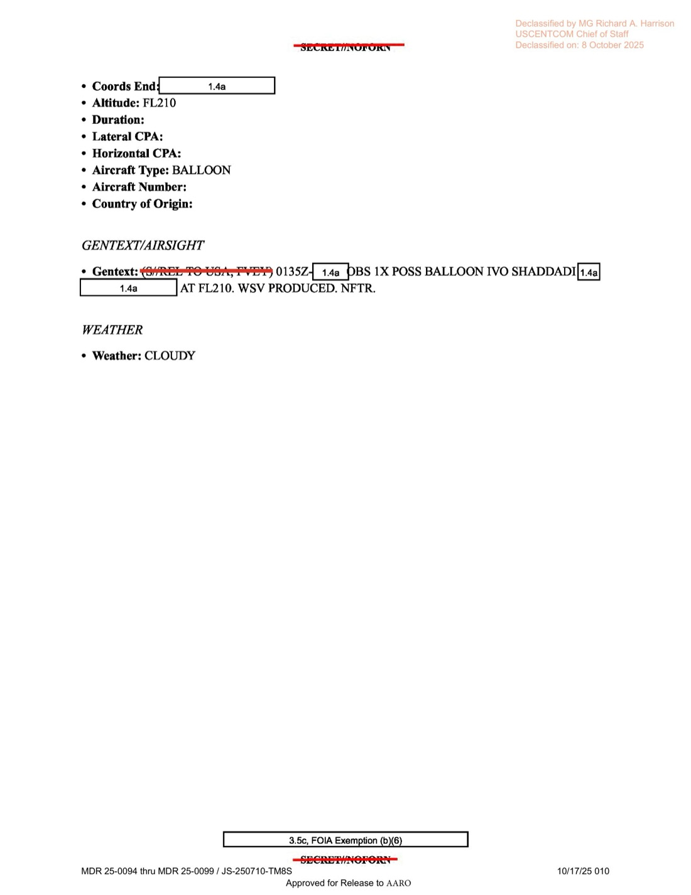

# #040 DOW-UAP-D19：2023-02-21 敘利亞 Shaddadi 上空，F-15E 二機編隊遭敵雷達干擾後 1 分鐘觀測 3 個 UAP 於 FL240

| 欄位 | 內容 |
|---|---|
| 報告類型 | MISREP |
| 識別碼 | DOW-UAP-D19 |
| 任務日 | 2023-02-21 |
| 行動 | INHERENT RESOLVE / DCA（Defensive Counter-Air）IVO ESSA killbox |
| 機型 | **2-ship F-15E Strike Eagle**（tail numbers 169, 188） |
| 機隊 | **389 EFS（389th Expeditionary Fighter Squadron）／332 AEW**（自 Mountain Home AFB, Idaho 部署） |
| 起降基地 | OJMS（Muwaffaq Salti AB，約旦） |
| C2 callsign | KINGPIN（USAF AWACS／Combined Air Operations 控制） |
| Tanker | KC-46/KC-135 加油機，MOM Track（首次）+ GANDER Track（後續兩次） |
| 武器掛載 | **2x AIM-120D + 2x AIM-9X + M61A1 機砲（510 發）**，120 chaff + 24 flare |
| TGT Pod | **SNIPER-SE**（先進瞄準莢艙） |
| 雷達 | Suite 9.1，RWR ALR-56C with IRSWA PACER WARE |
| 任務地點 | 敘利亞東北 Shaddadi 區（37S grid，SDF 控制區邊緣） |
| 觀測 1（00:21-24Z） | **遭 MFT RADAR JAMMING（多頻威脅雷達干擾）於 FL270**，IVO Shaddadi |
| 觀測 2（00:25Z） | **OBS 3X POSS UAP 於 FL240**，IVO Shaddadi，WSV PRODUCED |
| 觀測 3（01:35Z） | OBS 1X POSS BALLOON 於 **FL210（21,000 ft）**，IVO Shaddadi，WSV PRODUCED |
| 總任務時間 | 4 小時 55 分 |
| 機密層級 | SECRET // NOFORN |
| 解密日期 | 預定 2048-01-20 |
| 釋出途徑 | USCENTCOM MDR 25-0094 thru MDR 25-0099 / JS-250710-TM8S，**Declassified by MG Richard A. Harrison, USCENTCOM Chief of Staff, on 2025-10-08** |
| 公開日 | 2026-05-08 |
| PDF 頁數 | 10 頁 |

## 為什麼這份是 D 系列中最重要的單一檔案

D10–D18 都是 MQ-9 Reaper ISR 任務的副產品 UAP 觀測。D19 完全不同：

- 武裝戰鬥機（F-15E Strike Eagle）載著 2x AIM-120D + 2x AIM-9X 在 DCA（防空截擊）任務中
- **遭敵方多頻雷達干擾（MFT RADAR JAMMING）持續 3 分鐘**
- **干擾解除後 1 分鐘觀測 3 個 UAP 在 FL240**（比敵機尋常出沒高度高）
- **WSV PRODUCED**：F-15E 機載 HUD / SNIPER-SE 瞄準莢艙 / 雷達錄影皆完整保留
- 70 分鐘後在同一空域 Shaddadi 又見 1 個可能氣球於 FL210

也就是說，這是**敵方電子戰干擾 + 多體 UAP + 高品質感測器影像紀錄**的同時出現案例。對應 2023-02 全球熱議的中國氣球擊落事件（2023-02-04 South Carolina 外海 F-22 擊落 Pratas balloon），D19 在 17 天後 Syria 同樣出現「未識別物 + 可能氣球」的高關聯時間點。

歷史意義在這個案件可能對應 AARO 後續對 Syria 上空 UAP 高頻案件的調查。389 EFS 飛行員在當時就獲得 WSV，AARO 應可取得完整證據。

## 1. 任務時序

| 時間（Zulu） | 動作 |
|---|---|
| 02-20 23:20Z | 從 OJMS 起飛 2 架 F-15E（tail 169, 188） |
| 23:32Z | C2 check-in with KINGPIN（AWACS 控制器） |
| 23:45Z | 第一次空中加油（MOM Track，37K LBS combined） |
| 02-21 00:03Z | 抵達 ESSA killbox，開始 DCA |
| **00:21-00:24Z** | **遭 MFT RADAR JAMMING IVO Shaddadi 於 FL270，3 分鐘，NTFR（無進一步反應）** |
| **00:25Z** | **OBS 3X POSS UAP IVO Shaddadi 於 FL240，WSV PRODUCED** |
| 01:34Z | 第二次空中加油（GANDER Track，33.5K LBS） |
| **01:35Z** | **OBS 1X POSS BALLOON IVO Shaddadi 於 FL210，WSV PRODUCED** |
| 02:26Z | 第三次空中加油（GANDER Track，11K LBS） |
| 03:40Z | Check off station, C2 check-out |
| 04:25Z | 降落 OJMS |
| 04:35Z | BSD（block shutdown） |

KINGPIN 是常見的 AWACS / Combined Air Operations Center C2 callsign，在 OIR 期間負責整個戰場的空域管制。本任務 KINGPIN 全程在線。

## 2. 三大事件分析

### 2-1. 00:21-00:24Z MFT 雷達干擾事件

> 0021Z–0024Z [REDACTED] RECEIVED MFT RADAR JAMMING IVO SHADDADI AT FL270. NTFR.

**MFT（Multi-Function Threat / Multi-Frequency Threat）**：F-15E 雷達告警接收器（RWR ALR-56C）在多個頻率上接收到敵方雷達跳頻信號。3 分鐘的持續干擾意味著對方使用持續性電子戰系統，不是偶發 emitter。

候選對應系統：
- **Pantsir-S1 / SA-22**：敘利亞國軍與 Wagner 在 Latakia/Tartus/Khmeimim 部署，但 Shaddadi 在敘東北 SDF 控制區，距離較遠
- **Russian Krasukha / Tirada-2 EW 系統**：俄羅斯地面電子戰系統，可長距干擾
- **伊朗代理人 EW**：IRGC 可能使用伊朗自製或俄製干擾平台
- **Khmeimim AB 戰機 EW pod**：俄方 Su-34/35 攜帶 Khibiny pod 可遠距干擾

NTFR（No Further Action / No Further Time Required）意味著 F-15E 未對干擾做出反擊（如反輻射飛彈或機動規避）。

### 2-2. 00:25Z 3 個 UAP 觀測

干擾結束 1 分鐘後，F-15E 觀測到 **3 個** POSS UAP 於 **FL240（24,000 ft）**，在同一 Shaddadi 區域。

對照前述干擾位置（FL270，27,000 ft）vs. UAP 位置（FL240，24,000 ft），UAP 比干擾源略低 3,000 ft。位置在同一 IVO（IN VICINITY OF）。

**WSV PRODUCED**：Weapon System Video 已產製。F-15E 的 SNIPER-SE 先進瞄準莢艙具備 EO/IR 雙感測器，可錄製目標的可見光與紅外影像。同時 APG-82 AESA 雷達錄影可保留雷達回波。這是 AARO 可後續分析的關鍵證據。

3 個 UAP 同時出現意味：
- 不是單一物體誤判
- 不是雷達 ghost（多 ghost 機率低，且 SNIPER-SE 是獨立 EO/IR 感測器）
- 可能編隊
- 或為散布物（如氣球碎裂後散布）

時間關聯極為密切：**MFT 干擾 → 1 分鐘 → 3 UAP**。可能假設：

- (A) UAP 是 EW 干擾的「副作用物理現象」（如電離氣團、等離子體）
- (B) UAP 是 EW 干擾的「干擾源伴隨物」（如電子戰平台本身）
- (C) UAP 與 EW 干擾無因果關係，純時間巧合

判定需 AARO 內部 SIGINT/MASINT 對照。本檔案保留三種可能。

### 2-3. 01:35Z 可能氣球

70 分鐘後同一 Shaddadi 區域，**FL210（21,000 ft）** 觀測 1 個 POSS BALLOON：

> 0135Z [REDACTED] OBS 1X POSS BALLOON IVO SHADDADI [REDACTED] AT FL210. WSV PRODUCED. NFTR.

**注意 FL210 = 21,000 ft**（war.gov metadata 中文 blurb「2,100 呎高度」是錯譯，需修正）。

時間脈絡：2023-02-21 = 2023-02-04 中國 Pratas 氣球被擊落後 17 天。中國氣球在 SC 外海被擊毀後，美軍對所有「possible balloon」事件均提高敏感度。本案 0135Z 報告 1 個 balloon 後又繼續 DCA 任務（未做攔截），意味機組／C2 評估該物體為非威脅性（如氣象氣球、民用偵察氣球）。

或者，POSS BALLOON 是當天三個 UAP 觀測延伸觀察的第 4 個物體，因高度、特徵不同被另列 AIRSIGHT 條目（而非 UAP）。

## 3. F-15E 完整武器掛載：實質的「準戰鬥姿態」

D19 與其他 D 系列檔案最大差異在武器掛載。完整 ACEQUIP：

- **2x AIM-120D AMRAAM**（主動雷達中距空對空）
- **2x AIM-9X Block II**（被動紅外短距空對空）
- **M61A1 機砲 510 發**（20 mm Gatling）
- 120 chaff（RR-180）+ 24 flare（MJU-51/53）
- **SNIPER-SE 瞄準莢艙**（EO/IR 雙感測器，後期型號）
- **APG-82 AESA Suite 9.1**（最新軟體載荷）
- **ALR-56C RWR with IRSWA PACER WARE**（最新威脅資料庫）

這是準戰備姿態：MISREP 沒有列「Air-to-Ground Wpn」（被 redacted 或無），意味 F-15E 載著純空對空 loadout 執行 DCA。攜帶這個配置在 ESSA killbox 巡邏意味該空域已被 USCENTCOM 視為**潛在空中威脅區**。對應 2023-02 在 Syria 上空俄機、伊朗無人機、土耳其 F-16 多方活動的高密度脈絡。

當 F-15E 在這個配置下看到 3 個 UAP，飛行員的判讀框架包含：「**是否需要切到 weapons hot？**」答案顯然是否（NFTR），但這個判斷本身極具歷史意義，是 USAF F-15E 載著現役 AIM-120D 看見不明物的記錄。

## 4. ESSA killbox 與 Shaddadi 地理意義

- **ESSA**：OIR 戰區的 killbox 編號之一，敘利亞東北部
- **Shaddadi**：敘利亞 Hasakah 省南部小鎮，2017 SDF 解放後成為 US-led Coalition 主要前進基地之一（Mission Support Site Conoco / Green Village 一帶）
- **37S grid**：MGRS 第 37 區，涵蓋敘東北至土耳其南部

2023-02 期間 Shaddadi 周邊地緣張力：
- 北：土耳其 F-16 / Bayraktar TB2 對 SDF 區的攻擊（2023-02 Ankara 持續威脅）
- 東：伊朗代理人 Kata'ib Hezbollah 對美軍基地火箭攻擊
- 西：俄羅斯 + 敘利亞政府軍區域
- 南：ISIS 殘部與 Asayish 內部安全張力

F-15E 在這個多方角力空域做 DCA，遭遇 MFT 雷達干擾本身就是常態。但「3 個 UAP + 1 個氣球」在同一夜間出現需要單獨評估。

## 5. 觀察

**(1) MQ-9 → F-15E 的 UAP 通報差異**：D10–D18 都是 MQ-9 案件，DGS screener 主導判讀。D19 是 F-15E 案件，**戰機飛行員親眼觀測 + 完整 WSV 證據 + 武器系統雷達錄影 + SNIPER-SE EO/IR 雙感測器**。證據鏈完整度比 MQ-9 高至少一個數量級。

**(2) EW 干擾 + UAP 時間關聯**：3 分鐘 MFT 雷達干擾結束後 1 分鐘出現 3 UAP，是 AARO 應重點研究的時序模式。對照美海軍歷次 Nimitz 2004 與 Roosevelt 2014-15 UAP 事件，「EW/雷達異常 + UAP 出現」常被機組描述。Ryan Graves 在 [#155 墨西哥國會聽證](../155-state_dept_uap_cable_5_mexico_2023/report.md) 也談過 RAGE Pod 干擾期間異常雷達回波。D19 是這個 pattern 在 Syria 戰場的新案。

**(3) 解密人實名出現**：本檔案 cover 首次列出 **「Declassified by MG Richard A. Harrison, USCENTCOM Chief of Staff, on 2025-10-08」**。MG Harrison 是 USCENTCOM 第 21 任 Chief of Staff（2024 起），他親自簽批這份 MISREP 解密。這個級別的簽批顯示 USCENTCOM 對 D19 的特殊處理。

**(4) WSV 證據存在的政策意義**：D19 兩次「WSV PRODUCED」紀錄。意味 AARO 應該已收到完整影片證據。本檔案公開後，AARO 是否會另行釋出影片是後續焦點。對應 [#155 Maussan/Graves 聽證](../155-state_dept_uap_cable_5_mexico_2023/report.md) 中 Graves 提出的「政府保有飛行員 UAP 影片但不公開」批評，D19 影片是檢驗 AARO 透明度的試金石。

## 6. CSV blurb 中譯錯誤糾正

War.gov UFO 頁面 metadata 對 D19 的中文摘要：**「觀測『可能氣球』於約 2,100 呎高度」**。

實際內容：
- 觀測「3 個 POSS UAP 於 FL240（**24,000 ft**）」是主要事件
- 70 分鐘後另觀測「1 個 POSS BALLOON 於 FL210（**21,000 ft**）」是次要事件
- war.gov 中文翻譯混淆了 FL（Flight Level，百英呎為單位）與絕對英呎，將「FL210 = 21,000 ft」誤翻為「2,100 呎」
- war.gov metadata 完全略過了 3 UAP 主要事件與 MFT 雷達干擾事件

公開 metadata 與檔案實際內容的落差顯示 War Department 對該檔案的「降溫」處理。

## 7. 跨檔案連結

- **[#035 D10 / #036 D12 / #037 D14 / #038 D16 / #039 D18](../035-dow_uap_d10_mission_report_iraq_may_2022/report.md)**：D 系列前 5 份都是 MQ-9 ISR。D19 是首次 F-15E 戰機案。
- **[#155 Mexico 2023 State Dept](../155-state_dept_uap_cable_5_mexico_2023/report.md)**：Ryan Graves 在 2023-09 墨西哥國會與 2023-07 美國國會聽證描述「EW 異常 + UAP 共現」的飛行員證詞。D19 是 Graves 描述的 pattern 的 USAF 版實例。
- **[#037 D14 Eastern Med 2022-05](../037-dow_uap_d14_mission_report_eastern_mediterranean_may_2022/report.md)**：D14 是 MQ-9 在 Eastern Med 遇 Su-30 攔截。D19 是 F-15E 在 Syria 遇 MFT 干擾。對照看，2022-2023 美軍在中東地中海／敘利亞戰場的 UAP-EW 混合事件是常態。

## 8. 來源

- 原始檔案：[U.S. Department of War — DOW-UAP-D19, Mission Report, Syria, February 21, 2023](https://www.war.gov/UFO/#DOW-UAP-D19,%20Mission%20Report,%20Syria,%20February%2021,%202023)
- PDF 直接下載：`https://www.war.gov/medialink/ufo/release_1/dow-uap-d19-mission-report-syria-february-21-2023.pdf`
- 10 頁，原 SECRET // NOFORN，USCENTCOM MDR 25-0094-25-0099 / JS-250710-TM8S 解密
- Declassified by MG Richard A. Harrison, USCENTCOM Chief of Staff, on 2025-10-08
- 公開日：2026-05-08
