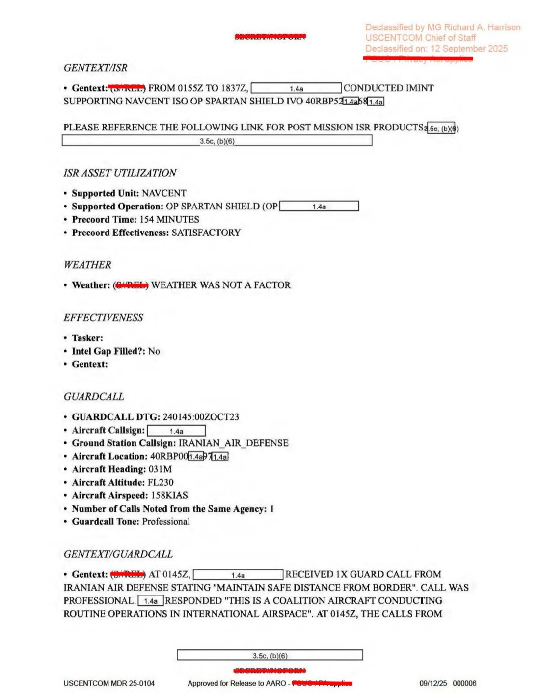
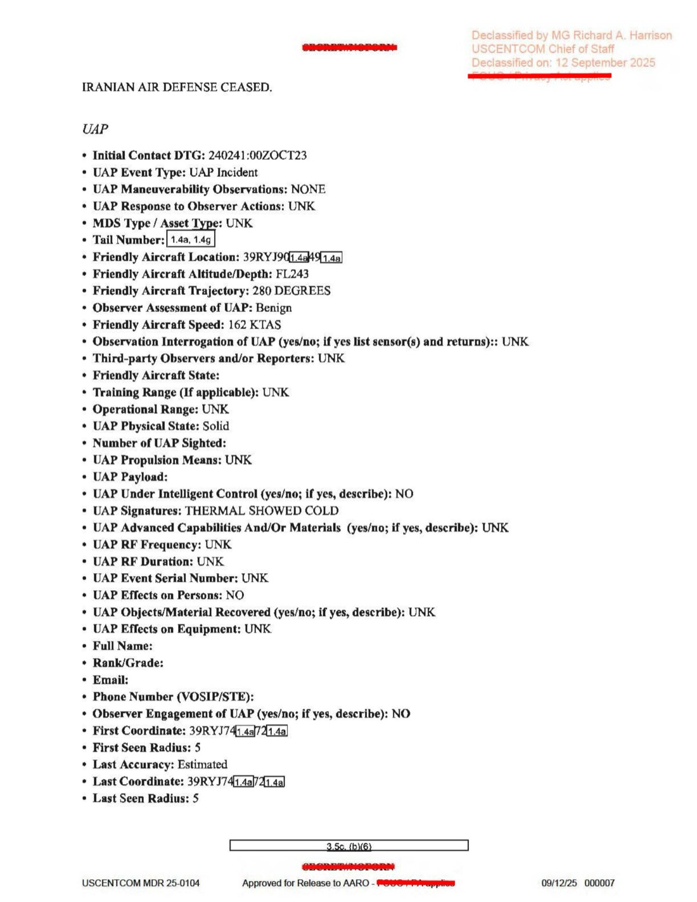
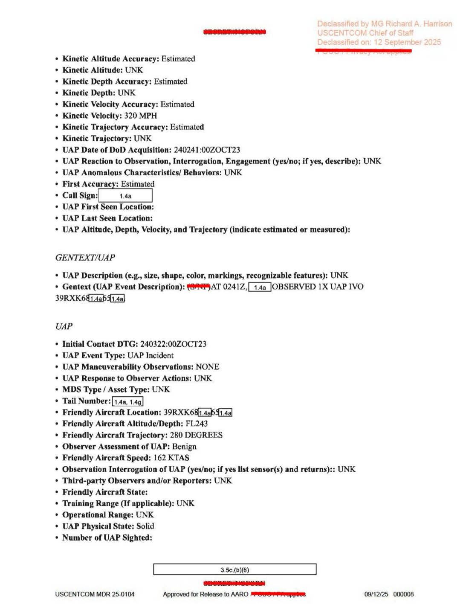

# #042 + #043 DOW-UAP-D23：2023-10-24 阿拉伯灣，50 ATKS MQ-9 收到伊朗 Air Defense「保持距離」警告後 56 分鐘觀測 2 個 UAP（320 mph / 440 mph，thermal cold）

| 欄位 | 內容 |
|---|---|
| 報告類型 | MISREP |
| 識別碼 | DOW-UAP-D23 |
| 任務日 | 2023-10-24 00:15Z 起飛至 21:08Z 引擎熄火（20 小時 43 分） |
| 行動 | **OP SPARTAN SHIELD**（USCENTCOM 阿拉伯半島嚇阻行動，非 OIR） |
| 主管 | USCENTCOM／ACC／609 CAOC |
| 機隊 | **50 ATKS（50th Attack Squadron，Holloman AFB）／432 AEW** |
| 起降基地 | OMAM（Al Dhafra Air Base，UAE） |
| 任務地點 | 阿拉伯灣 39R 與 40R MGRS grid（UAE 外海／伊朗領空邊界） |
| SIGINT 平台 | AIRHANDLER |
| 影像利用單位 | DGS-2 |
| 任務型態 | ISR 支援 NAVCENT |
| **特殊事件 GUARD CALL（01:45Z）** | **伊朗 Air Defense via Guard Frequency：「Maintain safe distance from border」**，friendly aircraft FL230, 158 KIAS, 031° |
| **UAP Line 1（02:41Z）** | MQ-9 在 FL243、162 KTAS、280° 觀測 1 個 UAP，39RYJ7X 區域，**Solid physical state, thermal showed COLD, NOT under intelligent control, Kinetic Velocity 320 MPH**，Observer Assessment: Benign |
| **UAP Line 2（03:22Z）** | MQ-9 在 FL243、162 KTAS、280° 觀測 1 個 UAP，39RXL6X 區域，**Solid, NOT under intelligent control, Kinetic Velocity 440 MPH**，Observer Assessment: Benign |
| 機密層級 | SECRET // NOFORN / FOUO Privacy Act applies |
| 解密日期 | 預定 2048-10-25 |
| 釋出途徑 | USCENTCOM MDR 25-0104，**Declassified by MG Richard A. Harrison, USCENTCOM Chief of Staff, on 2025-09-12** |
| 公開日 | 2026-05-08 |
| PDF 頁數 | 9 頁 |
| README 條目 | **#042 + #043 共享同一份 PDF（CSV 重複條目）** |


## 為什麼這份檔案結合伊朗外交事件 + 2 個 UAP

D23 是 D 系列中第一份**完整描述伊朗-美軍互動 + UAP 事件**的 MISREP。執行單位是 50 ATKS / 432 AEW，OP SPARTAN SHIELD 而非 OP INHERENT RESOLVE。地理位置是阿拉伯灣（Persian Gulf）的 39R/40R MGRS grid，這是 UAE 與伊朗之間的水域，國際空域邊界即在此處。

事件時序：

1. **01:45Z**：伊朗 Air Defense 透過 Guard Frequency（國際緊急頻率 243.0 MHz）向 MQ-9 發送 1 通專業口吻警告：「Maintain safe distance from border」。MQ-9 回應：「This is a coalition aircraft conducting routine operations in international airspace」。伊朗端隨後停止呼叫。
2. **02:41Z**（伊朗呼叫後 56 分鐘）：UAP Line 1。1 個 UAP，固態（Solid），熱影像顯示「冷」（COLD）。
3. **03:22Z**（UAP Line 1 後 41 分鐘）：UAP Line 2。1 個 UAP，固態，更快（440 mph）。
4. **02:41Z → 03:22Z 共 41 分鐘**內，相同 MQ-9 在同一空域觀測到兩個 UAP，速度都遠超 MQ-9 的 162 KTAS（巡航約 186 mph）。

42+43 編號重複是 CSV 系統的 entry 重複，實際對應同一份 9 頁 PDF：UAP Line 1 對 #042，UAP Line 2 對 #043，本報告合併處理。

## 1. 任務時序

| 時間（Zulu） | 動作 |
|---|---|
| 00:15Z | 從 OMAM（Al Dhafra AB, UAE）起飛 |
| 00:30Z | LRE handover |
| **01:45Z** | **接收伊朗 Air Defense Guard Call「Maintain safe distance from border」** |
| 01:50Z | 開始 AIRHANDLER SIGINT |
| 01:55Z | 抵達 SRO Track IRISH SICKLE |
| 01:55-18:37Z | 執行 IMINT 支援 NAVCENT，OP SPARTAN SHIELD |
| **02:41Z** | **OBS 1X UAP（UAP Line 1）於 39RYJ7X** |
| **03:22Z** | **OBS 1X UAP（UAP Line 2）於 39RXL6X** |
| 18:37Z | 獲准 RTB |
| 19:12Z | 離站 |
| 20:19Z | 結束 SIGINT |
| 20:58Z | 降落 OMAM |
| 21:08Z | BSD |

總任務時間 20 小時 43 分，On-station 17 小時 17 分。

## 2. 伊朗 Air Defense Guard Call



GUARD CALL Line 1 完整內容：

> Initial DTG: 2023-10-24 01:45:00Z
> Aircraft Callsign: [REDACTED]
> **Ground Station Callsign: IRANIAN_AIR_DEFENSE**
> Aircraft Location: 40RBP0X
> Aircraft Heading: 031M
> Aircraft Altitude: FL230
> Aircraft Airspeed: 158 KIAS
> Number of Calls Noted from the Same Agency: 1
> **Guardcall Tone: Professional**

> Gentext: (S//REL) AT 01452, [REDACTED] RECEIVED 1X GUARD CALL FROM IRANIAN AIR DEFENSE STATING "MAINTAIN SAFE DISTANCE FROM BORDER". CALL WAS PROFESSIONAL. [REDACTED] RESPONDED "THIS IS A COALITION AIRCRAFT CONDUCTING ROUTINE OPERATIONS IN INTERNATIONAL AIRSPACE". AT 0145Z, THE CALLS FROM IRANIAN AIR DEFENSE CEASED.

> Gentext:（機密／可釋出）01:45Z [遮蔽] 收到 1 通來自伊朗 Air Defense 的 Guard Call，訊息為「保持與邊界的安全距離」。呼叫語氣專業。[遮蔽] 回應「這是聯軍機，正在國際空域執行例行行動」。01:45Z 後伊朗 Air Defense 的呼叫停止。

「Professional」評估意味著呼叫不是威脅性、也不是干擾性的，是依國際空管規範的標準警告。伊朗 Air Defense 監控阿拉伯灣空域，發現 MQ-9 接近 12 nm 領空邊界即透過 Guard Frequency 通報。

「The calls ceased」意味伊朗端在 MQ-9 確認身分後不再持續呼叫。雙方都依國際空管程序處理。

## 3. UAP Line 1（02:41Z）



UAP 完整欄位（D23 採用較 D14 / D19 / D20 更詳細的表單，新增「UAP Event Type」「Maneuverability」「Physical State」「Propulsion Means」「Intelligent Control」「Advanced Capabilities」「Kinetic Velocity」「Anomalous Characteristics」等多欄）：

- **Initial Contact DTG: 2023-10-24 02:41:00Z**
- **UAP Event Type: UAP Incident**
- **UAP Maneuverability Observations: NONE**
- UAP Response to Observer Actions: UNK
- Friendly Aircraft Location: 39R YJ 9[X]/6[X]
- **Friendly Aircraft Altitude: FL243**
- Friendly Aircraft Trajectory: **280 DEGREES**
- **Observer Assessment of UAP: Benign**
- Friendly Aircraft Speed: **162 KTAS**
- **UAP Physical State: Solid**
- **UAP Under Intelligent Control: NO**
- **UAP Signatures: THERMAL SHOWED COLD**
- UAP Advanced Capabilities And/Or Materials: UNK
- UAP RF Frequency: UNK
- UAP RF Duration: UNK
- **UAP Effects on Persons: NO**
- **UAP Effects on Equipment: UNK**
- First Coordinate: 39R YJ 7[X]
- First Seen Radius: 5
- Last Coordinate: 39R YJ 74[X]
- Last Seen Radius: 5
- **Kinetic Velocity: 320 MPH**
- Kinetic Trajectory: UNK
- UAP Anomalous Characteristics / Behaviors: UNK

GENTEXT/UAP：

> (S//NF) AT 0241Z, [REDACTED] OBSERVED 1X UAP IVO 39RXK6[X]/[X].

> （機密／不可外洩）02:41Z [遮蔽] 在 39RXK6X 附近觀測 1 個 UAP。

關鍵 signatures：
- **Solid Physical State**：物體有實體（非雲、雷達 ghost）
- **Thermal showed COLD**：紅外感測器顯示物體比環境冷。這與一般無人機（如 Iranian Mohajer-6, Shahed-129）正好相反，無人機引擎發熱會顯示「HOT」。「COLD」可能對應：
  - 高空氣球（氣球皮在 24,000 ft 接近大氣溫度，可能比海面對流層暖空氣冷）
  - 反射熱物質（如 Mylar 銀箔球體）
  - 已耗盡燃料的滑翔物體
  - 純被動載具
- **NOT under intelligent control**：機組／DGS 認為物體沒有主動操控跡象
- **Kinetic Velocity 320 MPH**：320 mph = 278 KTAS，幾乎正好是 Mohajer-6 巡航速度（150 mph）的兩倍，但低於 Shahed-136（185 mph）。實際對應比例難判斷
- **Observer Assessment: Benign**：被判定為非威脅

## 4. UAP Line 2（03:22Z，41 分鐘後）



- **Initial Contact DTG: 2023-10-24 03:22:00Z**
- **UAP Event Type: UAP Incident**
- **UAP Maneuverability Observations: NONE**
- Friendly Aircraft Location: 39R XK 6[X]/[X]
- **Friendly Aircraft Altitude: FL243**
- Friendly Aircraft Trajectory: **280 DEGREES**
- **Friendly Aircraft Speed: 162 KTAS**
- **UAP Physical State: Solid**
- **UAP Under Intelligent Control: NO**
- **UAP Signatures: UNK**（未列 THERMAL COLD）
- First Coordinate: 39R XL 6[X]
- Last Coordinate: 39R XL 6[X]
- **Kinetic Velocity: 440 MPH**
- Kinetic Trajectory: UNK

GENTEXT/UAP：

> (S//NF) AT 0322Z, [REDACTED] OBSERVED 1X UAP IVO 39RXK6[X]/[X].

> （機密／不可外洩）03:22Z [遮蔽] 在 39RXK6X 附近觀測 1 個 UAP。

差異：
- UAP Line 1: 320 mph + thermal COLD
- UAP Line 2: 440 mph + signatures UNK
- 兩者均「Solid」、「Not intelligent control」、「Benign」

44% 速度增加（320 → 440 mph）若是同物體則對應加速度，但兩個觀測點 First Coordinate 不同（YJ 7X → XL 6X），且間隔 41 分鐘，較可能是**兩個不同物體**，而非同一物體前後觀測。

## 5. 伊朗 Air Defense + UAP 的因果鏈

事件流：

```
01:45Z  伊朗 Air Defense 警告「Maintain safe distance」
        ↓ 56 分鐘
02:41Z  UAP #1 觀測（320 mph, thermal COLD）
        ↓ 41 分鐘
03:22Z  UAP #2 觀測（440 mph）
```

合理推測：

**(A) 伊朗無人機反應推測**：伊朗 Air Defense 警告後，可能派出 IRGC 無人機監視 MQ-9 行為。但 Mohajer-6 / Shahed 系列無人機 thermal 應顯示 HOT 而非 COLD。
- 反對證據：thermal COLD
- 支持證據：時間關聯密切、區域是伊朗領空邊界、伊朗無人機曾多次接近美軍 ISR

**(B) 高空氣球假設**：阿拉伯灣中央高空可能漂浮氣球（如類似 2023-02 中國 Pratas balloon），thermal cold 符合氣球特性。
- 反對證據：320-440 mph 比氣球漂移速度（< 100 mph）快得多
- 支持證據：thermal COLD、Solid、NOT intelligent control

**(C) 第三方無人機**：俄羅斯、葉門、伊拉克其他派遣的無人機。
- 候選：俄羅斯 Orion-E（曾在敘利亞操作）、UAE 自有無人機巡航

**(D) 真實 UAP（非已知系統）**：thermal COLD + 320/440 mph + Solid + NOT intelligent control 的組合不容易對應已知人造系統，特別是「thermal cold」。

AARO 內部分析需對照 SIGINT（同時 AIRHANDLER 收集），是否抓到對應無人機控制訊號。

## 6. OP SPARTAN SHIELD 與 D 系列的脈絡轉移

D10-D20 都在 OP INHERENT RESOLVE（反 ISIS）框架。D23 是 **OP SPARTAN SHIELD**：USCENTCOM 自 2011 持續執行的「阿拉伯半島嚇阻與夥伴能力建構」行動，主要對抗伊朗。

D23 支援單位是 **NAVCENT**（U.S. Naval Forces Central Command），意味 MQ-9 同時為海軍提供海域 ISR：

- 監視阿拉伯灣與荷姆茲海峽（Strait of Hormuz）的航行自由
- 對伊朗 IRGC Navy 小艇、機動 SAM 系統提供預警
- 支援 Coalition Naval Forces（CTF-152 等）

UAP 觀測在這個任務背景中具有特殊意義：伊朗 IRGC 在 2019、2023 多次騷擾國際航線商船，「2 個 UAP」可能是伊朗對美 ISR 的反 ISR 反應。

## 7. 觀察

**(1) UAP 表單擴展**：D10 / D12 / D14 / D16 / D18 / D19 / D20 使用較簡 UAP 欄位（約 15-20 個）。D23 採用較詳盡 UAP Event Type / Maneuverability / Physical State / Propulsion Means / Intelligent Control / Advanced Capabilities / Kinetic Velocity / Anomalous Characteristics 等共 30+ 欄位。意味 AARO 在 2023 已將 UAP 標準表單擴展，前線單位已採用新版。

**(2) Iranian Air Defense + UAP 時間關聯**：D23 將「Guard Call from Iranian Air Defense」與「2 UAPs」放在同一份 MISREP 中。這個編排意味 AARO 對「敵方主動聯絡 + UAP 出現」的關聯有興趣。對比 [#040 D19](../040-dow_uap_d19_mission_report_syria_february_2023/report.md) 的「MFT 雷達干擾 + 3 UAPs」、本案的「Iranian Air Defense call + 2 UAPs」構成「外部訊號／威脅 + UAP」共現的第二案。

**(3) thermal COLD 物理意義**：紅外熱像顯示「冷」是 UAP 文獻中少見的描述。AATIP/AARO 過往案例（如 Nimitz 2004「Tic-Tac」）主要描述「白熱」或「無熱跡」。「冷」意味物體溫度低於背景大氣，對應假設：
- 物體高速冷卻（如金屬球體高速下降不發熱）
- 物體覆有冷介質（如冰、液氮）
- 物體本身為反射型（無熱輻射）
- 物體在 FL243 高度比 290 K 海平面大氣冷
這個 signature 對應的人造系統候選有限，主要是氣球或反射器。

**(4) MG Harrison 解密日期 2025-09-12**：本檔案早於 D19 / D20 的 10-08 簽批。意味 D23 是首批被批准解密的案件之一。對應 D 系列釋出時間排序，D23 應為「首批 12 件 MDR 25-0104」批次中的關鍵案件。

## 8. 跨檔案連結

- **[#040 D19 / #041 D20 敘利亞 ESSA killbox](../040-dow_uap_d19_mission_report_syria_february_2023/report.md)**：F-15E / F-16CM 戰機案。D19 + D20 是戰機觀測叢集，D23 是 MQ-9 + 阿拉伯灣叢集。
- **[#037 D14 Eastern Med 2022-05-29](../037-dow_uap_d14_mission_report_eastern_mediterranean_may_2022/report.md)**：MQ-9 與俄方戰機互動。D23 是 MQ-9 與伊朗 Air Defense 互動。兩案構成「美軍 ISR 平台與敵方互動 + UAP 共現」模式。
- **[#045 D27 UAE 2023-10](https://www.war.gov/UFO/#DOW-UAP-D27,%20Mission%20Report,%20United%20Arab%20Emirates,%20October%202023)**：D 系列接續，同月份阿拉伯灣案件。

## 9. 來源

- 原始檔案：[U.S. Department of War — DOW-UAP-D23, Mission Report, United Arab Emirates, October 2023](https://www.war.gov/UFO/#DOW-UAP-D23,%20Mission%20Report,%20United%20Arab%20Emirates,%20October%202023)
- PDF 直接下載：`https://www.war.gov/medialink/ufo/release_1/dow-uap-d23-mission-report-united-arab-emirates-october-2023.pdf`
- 9 頁，原 SECRET // NOFORN / FOUO Privacy Act applies
- USCENTCOM MDR 25-0104 解密
- Declassified by MG Richard A. Harrison, USCENTCOM Chief of Staff, on 2025-09-12
- 公開日：2026-05-08
- 注意：CSV 中 #042 與 #043 兩個條目共享同一 URL，對應同一份 PDF 中的 UAP Line 1（02:41Z）與 UAP Line 2（03:22Z），本報告合併處理
