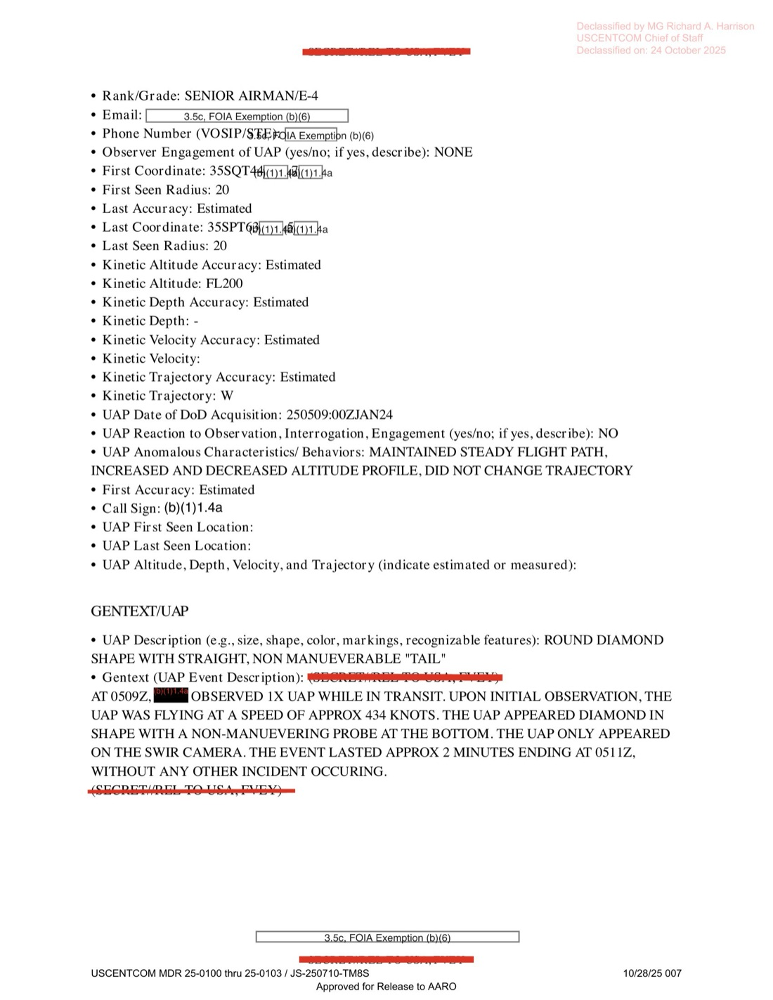
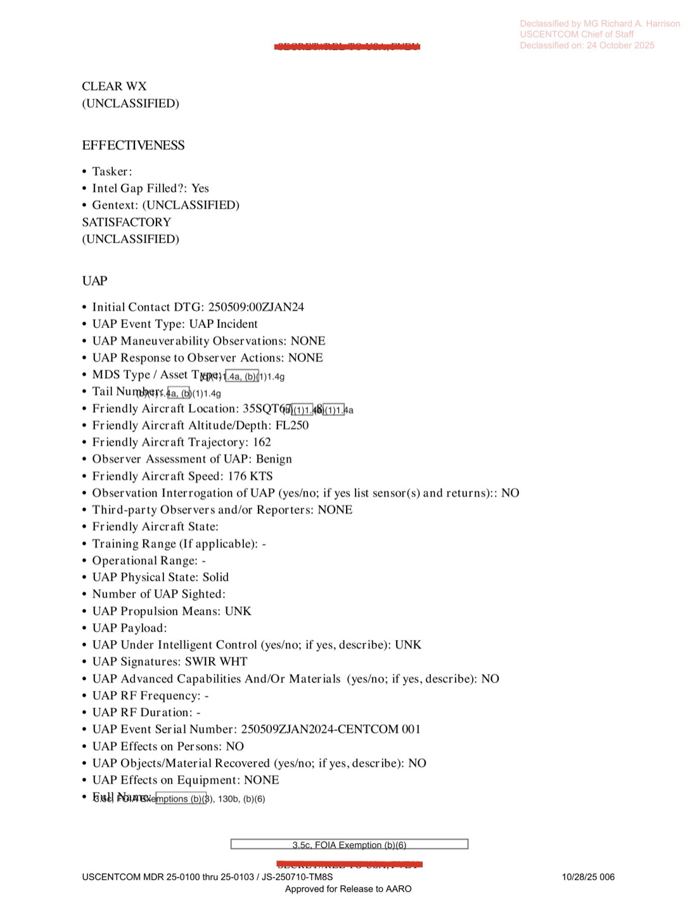

# #044 DOW-UAP-D25：2024-01-25 希臘上空，AFSOC 33 SOS MQ-9 在 transit 中 SWIR 觀測到 1 個「菱形帶非機動探針」UAP，434 節，僅 SWIR 可見

| 欄位 | 內容 |
|---|---|
| 報告類型 | MISREP |
| 識別碼 | DOW-UAP-D25 |
| **UAP 事件序號** | **250509ZJAN2024-CENTCOM 001** |
| 任務日 | 2024-01-25 01:09Z 起飛至 21:59Z 引擎熄火（20 小時 50 分） |
| 行動 | （行動代號 redacted） |
| 主管 | USCENTCOM／**AFSOC（Air Force Special Operations Command）**／603 AOC + 609 CAOC |
| 機隊 | **33 SOS（33rd Special Operations Squadron）／27 SOW**（Cannon AFB, NM） |
| 起降基地 | LGLR（Larissa Air Base, Greece） |
| 任務地點 | 從希臘 transit 中 + 35S grid（Aegean Sea / Crete area） |
| ISR 目標區 | 36RXV19X grid（賽普勒斯區 ISR 任務） |
| TGT Pod | **AN/DAS-4 MTS-B**（Multi-Spectral Targeting System with SWIR） |
| 數據鏈 | LINK 16 |
| 任務型態 | AREC（Aerial Reconnaissance） |
| 主感測器 | FMV |
| Sensors Available | **BLASPHEMY** （感測器系統代號） |
| IFF | 4055 |
| **UAP 觀測時間** | **2024-01-25 05:09Z 至 05:11Z（2 分鐘）** |
| **UAP 位置** | 35SQT44/7X 至 35SPT63/5X（W 方向） |
| **UAP 高度** | **FL200**（20,000 ft，比 MQ-9 FL250 低 5,000 ft） |
| **UAP 速度** | **434 KTS（499 mph，803 km/h）** |
| **UAP 形狀** | **「ROUND DIAMOND SHAPE WITH STRAIGHT, NON MANUEVERABLE 'TAIL'」** ／ 圓鈍菱形 + 直線非機動式「尾／探針」於底部 |
| **UAP 可見光譜** | **僅 SWIR camera 可見**（EO / visible 不可見） |
| **SWIR signature** | WHITE（白色） |
| Physical State | Solid（固態） |
| Intelligent Control | UNK |
| Anomalous Behaviors | MAINTAINED STEADY FLIGHT PATH, INCREASED AND DECREASED ALTITUDE PROFILE, DID NOT CHANGE TRAJECTORY |
| Observer Assessment | Benign |
| 機密層級 | SECRET // REL TO USA, FVEY |
| 解密日期 | 預定 2049-01-25 |
| 釋出途徑 | USCENTCOM MDR 25-0100-25-0103 / JS-250710-TM8S，**Declassified by MG Richard A. Harrison, USCENTCOM Chief of Staff, on 2025-10-24** |
| 公開日 | 2026-05-08 |
| PDF 頁數 | 7 頁 |

## 為什麼 D25 是 44 份 MISREP 中物理特徵最完整的單一觀測

D25 提供了現代 UAP 報告中極為罕見的**形狀 + 光譜 + 動力學**完整描述：

- **形狀**：圓鈍菱形（diamond）+ 底部直線非機動式 probe/tail
- **光譜**：**只在 SWIR（短波紅外，1.0-3.0 μm）出現**，EO / 可見光 / MWIR / LWIR 無回應
- **SWIR 強度**：白色（最亮）
- **速度**：434 KTS（499 mph）
- **高度**：FL200（20,000 ft）
- **軌跡**：穩定西向飛行，高度有上下變化但不改變航向
- **持續時間**：2 分鐘
- **跟其他物體互動**：無
- **對機組／設備影響**：無

對比 [#040 D19](../040-dow_uap_d19_mission_report_syria_february_2023/report.md) F-15E 看到的 3 個「亮物」、[#041 D20](../041-dow_uap_d20_mission_report_syria_essa_march_2023/report.md) 10-20 個 W→E 機動物、[#042+#043 D23](../042_043-dow_uap_d23_mission_report_uae_october_2023/report.md) 阿拉伯灣 thermal cold 物體，D25 的形狀＋光譜＋運動學三重特定描述是**最易與已知物體比對**的案例。

### SWIR-only 的物理意涵

AN/DAS-4 MTS-B 是 MQ-9 Reaper / U-28A 攜帶的多光譜目標系統，涵蓋：

- EO（可見光，0.4-0.7 μm）
- NIR（近紅外，0.7-1.0 μm）
- **SWIR（短波紅外，1.0-3.0 μm）**
- MWIR（中波紅外，3.0-8.0 μm）
- LWIR（長波紅外，8.0-14.0 μm）

「只在 SWIR 可見」是非常特殊的物理特徵。可能對應：

1. **特殊塗層**：吸收可見光，但 SWIR 帶反射或自發發射的材料（如某些隱身塗層、SWIR 標籤）
2. **熱燈／LED**：某些工業/軍用 SWIR 燈具（如 850-1550 nm SWIR LED）
3. **化學發光物質**：某些燃料或推進劑燃燒產物在 SWIR 帶有強烈訊號（如固態火箭推進劑、Hydrazine + N2O4 反應產物）
4. **電弧或電漿**：高溫電漿在 SWIR 區段強烈
5. **雷射光束散射**：1064 nm Nd:YAG 雷射、1550 nm telecom 雷射在 SWIR 強反射
6. **未知物理機制**：某種尚未識別的物理體

「Diamond shape with non-maneuvering probe at bottom」搭配 SWIR-only 描述，在公開 UAP 文獻中無直接對應案例。AATIP/AARO 過往 Tic-Tac / Gimbal / GoFast 影片均為 LWIR/MWIR + 可見光雙顯著。D25 是「SWIR-only」獨特首案。

### 速度 434 KTS 的對應範圍

434 KTS = 499 mph = 803 km/h，這個速度對應：

| 候選平台 | 巡航速度 | 對應 |
|---|---|---|
| 商業客機 | 480-600 KTS | 太快 |
| MQ-9 Reaper | 195 KTS | 不符 |
| MQ-1 Predator | 110 KTS | 不符 |
| RQ-4 Global Hawk | 357 KTS | 接近但較慢 |
| U-2 | 410 KTS | 接近 |
| F-15 / F-16 巡航 | 480-500 KTS | 略快 |
| 鳥類 | < 100 KTS | 不符 |
| 一般氣球 | < 50 KTS | 不符 |
| 高空氣球（jet stream） | 100-200 KTS | 不符 |
| Loitering 無人機 | 60-200 KTS | 不符 |

434 KTS 在 FL200（20,000 ft）「穩定飛行 + 高度上下變化但不改方向」+ Diamond + SWIR-only 的組合無對應已知系統。U-2 速度接近但「diamond + tail」形狀不符、SWIR-only 不符（U-2 機體在 LWIR 也可見）。

## 1. 任務時序

| 時間（Zulu） | 動作 |
|---|---|
| 01:09Z | SLR（Satellite Link Recovery）takeoff from LGLR |
| 01:35Z | 7-LINED to support [REDACTED] |
| **05:09Z** | **觀測 1 個 UAP（在 transit 期間，非任務站點）** |
| **05:11Z** | **UAP 消失** |
| 06:35Z | 抵達 SP（Start Point）on station |
| 06:35-13:53Z | POL（Pattern of Life）觀測，NSTR |
| 13:53-15:00Z | 1 stop follow on 1x ADM in silver SUV |
| 14:00Z | 觀測 1 個大型白色 box 從 black SUV 移到 white van |
| 15:04Z | 離站，RTB |
| 21:49Z | 降落 LGLR |
| 21:59Z | BSD |

UAP 觀測發生在 **MQ-9 從 LGLR transit 到任務區的航線中**，距離任務區還有 1 小時 26 分。這是 MQ-9 從希臘起飛、前往支援 ISR 任務區（推測賽普勒斯 36RXV grid）途中。

## 2. UAP 觀測完整內容

GENTEXT/UAP 完整描述：

> UAP Description: ROUND DIAMOND SHAPE WITH STRAIGHT, NON MANUEVERABLE "TAIL"
>
> Gentext (UAP Event Description): (SECRET//REL TO USA, FVEY) AT 0509Z, [REDACTED] OBSERVED 1X UAP WHILE IN TRANSIT. UPON INITIAL OBSERVATION, THE UAP WAS FLYING AT A SPEED OF APPROX 434 KNOTS. THE UAP APPEARED DIAMOND IN SHAPE WITH A NON-MANUEVERING PROBE AT THE BOTTOM. THE UAP ONLY APPEARED ON THE SWIR CAMERA. THE EVENT LASTED APPROX 2 MINUTES ENDING AT 0511Z, WITHOUT ANY OTHER INCIDENT OCCURING.

> UAP 描述：圓鈍菱形帶有直線、不機動的「尾／探針」
>
> Gentext（UAP 事件描述）：（機密／可釋出予美國、五眼）05:09Z [遮蔽] 在 transit 過程中觀測到 1 個 UAP。初次觀測時，UAP 以約 434 節速度飛行。UAP 形狀為菱形，底部有一個不機動的探針。UAP 只出現在 SWIR camera 上。事件持續約 2 分鐘，05:11Z 結束，期間未發生任何其他事件。

完整 UAP 表單欄位：

- UAP Event Type: **UAP Incident**
- UAP Maneuverability Observations: **NONE**
- UAP Response to Observer Actions: **NONE**
- Friendly Aircraft Altitude: **FL250**
- Friendly Aircraft Trajectory: **162°**
- Friendly Aircraft Speed: **176 KTS**
- Observer Assessment of UAP: **Benign**
- Observation Interrogation of UAP: **NO**
- Third-party Observers and/or Reporters: **NONE**
- UAP Physical State: **Solid**
- UAP Propulsion Means: **UNK**
- UAP Under Intelligent Control: **UNK**
- **UAP Signatures: SWIR WHT**
- UAP Advanced Capabilities And/Or Materials: **NO**
- UAP RF Frequency: **-**（未列）
- UAP Event Serial Number: **250509ZJAN2024-CENTCOM 001**
- UAP Effects on Persons: **NO**
- UAP Objects/Material Recovered: **NO**
- UAP Effects on Equipment: **NONE**
- Observer Engagement of UAP: **NONE**
- Kinetic Altitude: **FL200**
- Kinetic Trajectory: **W**
- UAP Date of DoD Acquisition: 2024-01-25 05:09:00Z
- UAP Reaction to Observation / Interrogation / Engagement: **NO**
- **UAP Anomalous Characteristics / Behaviors: MAINTAINED STEADY FLIGHT PATH, INCREASED AND DECREASED ALTITUDE PROFILE, DID NOT CHANGE TRAJECTORY**

「**Anomalous Behaviors**」一欄首次填入有意義內容（D14 / D19 / D20 / D23 都是 UNK）：高度上下變化但軌跡不變是少見的物理動力學特徵。對應的人造物候選極少：

- 太陽光照晝夜溫差導致氣球高度變化？氣球速度太低
- 飛行員調整氣壓導致高度波動？速度與行為不符
- 重力波 + 推進系統補償？需主動控制 → 但「Intelligent Control: UNK」
- 大氣折射視差導致 apparent altitude 變化？可能解釋部分

## 3. AFSOC 33 SOS / 27 SOW 的 OPSEC 脈絡

D25 的執行單位 **33 SOS（33rd Special Operations Squadron）** 屬於 27 SOW（Cannon AFB, NM），是 AFSOC 在 MQ-9 平台上的 Special Operations 中隊。33 SOS 任務性質與 50 ATKS（D23）、77 EFS（D20）、389 EFS（D19）、432 AEW（D10）不同：

- **AFSOC 任務性質**：直接支援美國特種作戰司令部（USSOCOM）需求，包括 JSOC、Delta Force、SEAL Team 6 等。任務地點全球分散，常於高敏感區域執行。
- **作業基地 LGLR（Larissa）**：希臘 Larissa AB 是 NATO 樞紐，也是 USAF 在巴爾幹／東地中海／中東通行的中繼站。AFSOC 自 LGLR 出發可覆蓋整個東地中海／黑海／敘利亞／賽普勒斯。
- **CENTCOM 整批解密但 AFSOC 任務**：本檔案被收進 USCENTCOM MDR 25-0100-25-0103 釋出包，意味該任務在 USCENTCOM AOR 內執行（即使機組屬 AFSOC）。

任務地點 36RXV19X 是賽普勒斯區 grid。MQ-9 從希臘飛賽普勒斯 ISR 一般是支援敘利亞情況監視、TF JSEC（Joint Special Ops 中東）相關。Operation 與 Supported Unit 都被 redacted。

## 4. ISR 主任務側寫

ISR 段 gentext：

> Gentext: (S//REL) UPON ARRIVAL TO THE SP AT 0635Z, [REDACTED] OBSERVED NO EEI RELATED ACTIVITY. FROM 0635Z-1353Z, [REDACTED] CONDUCTED POL AND OBSERVED NSTR. FROM 1353Z-1500Z, [REDACTED] CONDUCTED A 1X STOP FOLLOW ON 1X ADM IN A SILVER SUV. AT 1400Z, [REDACTED] OBSERVED A LARGE WHITE BOX BEING TRANSFERRED FROM BLACK SUV TO WHITE VAN.

> Gentext:（機密／可釋出）06:35Z 抵達 SP，[遮蔽] 未觀測到 EEI 相關活動。06:35Z-13:53Z [遮蔽] 進行 POL（Pattern of Life）觀測，NSTR。13:53Z-15:00Z [遮蔽] 對 1 個 ADM 在銀色 SUV 中執行 1 站跟監。14:00Z [遮蔽] 觀測到 1 個大型白色 box 從黑色 SUV 轉移到白色 van。

「大型白色 box 從黑色 SUV 轉移到白色 van」是典型 ISR POL 觀測，可能是武器、現金、毒品或其他敏感物。任務性質 + 賽普勒斯地理位置 + 「大型白色 box 轉移」三項暗示**反恐／反走私**任務脈絡。

D25 UAP 觀測（05:09Z 在 transit 中）與 ISR 主任務（06:35Z 起在賽普勒斯）地理位置不同，因此 UAP 觀測是**偶然的「順帶觀測」**，並非任務目標。

## 5. 觀察

**(1) D 系列中第一個帶「UAP Event Serial Number」的檔案**：250509ZJAN2024-CENTCOM 001。這個 serial 編號意味 USCENTCOM 在 2024-01 開始為 UAP 事件設立連號系統。「001」表示這可能是 USCENTCOM 該系列的首號，但實際上 D10 (2022-05)、D12 (2022-05) 等更早 MISREP 也有 UAP。可能 CENTCOM 系列重新啟動，或 D25 屬於不同 sub-series。

**(2) SWIR-only signature 的稀有性**：在公開 UAP 文獻中（AATIP 釋出影片 + AARO 年度報告 + Pentagon UAP Task Force 報告），「only SWIR」signature 從未被公開承認。Nimitz 2004 Tic-Tac 是 LWIR 顯著的物體。D25 SWIR-only 是公開記錄中首次系統性描述。AARO 對 D25 的分析應已將其列為「特殊光譜 signature 案例」獨立追蹤。

**(3) 「Diamond + probe at bottom」 形狀的物理含義**：菱形主體 + 底部直線非機動 probe/tail 結構可能對應：
- 高空滑翔武器（HGV）外形：火箭推進器分離後留下的滑翔體本體 + 殘留 probe
- 大氣探測球體 + 配重繩
- 偵察氣球 + 載荷掛載線
- ETH 假設：未知物體

**(4) MG Harrison 第三次簽批**：[#040 D19 / #041 D20 / #044 D25] 共三份均由 MG Harrison 親自簽批解密。D25 簽批日 2025-10-24 是其中最晚，D19/D20 是 10-08，D23 是 9-12。意味 D25 屬於後續批次（MDR 25-0100-25-0103），與 D19/D20 的 MDR 25-0094-25-0099 不同。

**(5) AFSOC 33 SOS 跨體系**：D25 是首份 AFSOC（特戰司令部）中隊執行的 D 系列 MISREP，與 ACC（D19/D20/D23）、AFCENT（D10/D12/D14/D16/D18）並列。意味 AARO 收集的案件來源跨越 USAF 全部主要 MAJCOM。

## 6. 跨檔案連結

- **[#040 D19 敘利亞 2023-02-21](../040-dow_uap_d19_mission_report_syria_february_2023/report.md)**：F-15E 觀測 3 UAP 於 FL240（無 SWIR-only 標記）。
- **[#041 D20 敘利亞 ESSA 2023-03-31](../041-dow_uap_d20_mission_report_syria_essa_march_2023/report.md)**：F-16CM 觀測 10-20 個亮物於 FL600+，TV mode（非 SWIR-only）。
- **[#042+#043 D23 UAE 2023-10-24](../042_043-dow_uap_d23_mission_report_uae_october_2023/report.md)**：MQ-9 觀測 thermal COLD 物體（與 SWIR WHITE 對比）。
- **[#051 D33 / #052 D35 希臘 2023-10](https://www.war.gov/UFO/#DOW-UAP-D33,%20Mission%20Report,%20Greece,%20October%202023)**：希臘區域接續 MISREP（2023-10 + 2024-01 構成希臘叢集）。

## 7. 來源

- 原始檔案：[U.S. Department of War — DOW-UAP-D25, Mission Report, Greece, January 2024](https://www.war.gov/UFO/#DOW-UAP-D25,%20Mission%20Report,%20Greece,%20January%202024)
- PDF 直接下載：`https://www.war.gov/medialink/ufo/release_1/dow-uap-d25-mission-report-greece-january-2024.pdf`
- 7 頁，原 SECRET // REL TO USA, FVEY
- USCENTCOM MDR 25-0100-25-0103 / JS-250710-TM8S
- Declassified by MG Richard A. Harrison, USCENTCOM Chief of Staff, on 2025-10-24
- 公開日：2026-05-08
