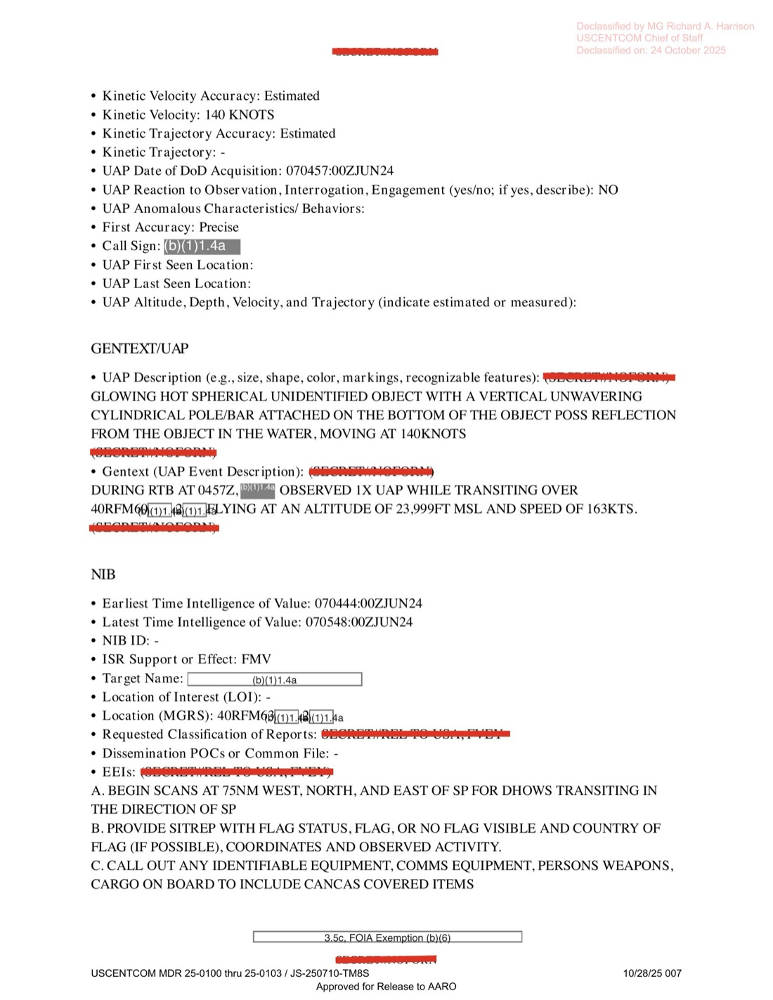
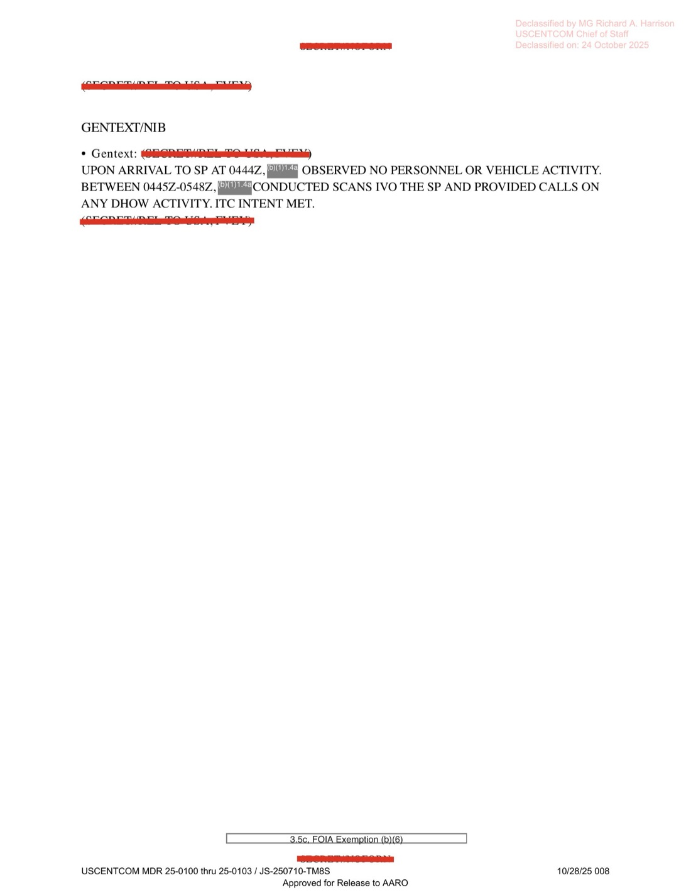

# #045 DOW-UAP-D27：2024-06-07 阿曼灣，AFSOC 3 SOS MQ-9 在 RTB 中觀測「圓柱條／棒附底部」UAP 貼水面 140 KTS 直線飛行

| 欄位 | 內容 |
|---|---|
| 報告類型 | MISREP |
| 識別碼 | DOW-UAP-D27 |
| **UAP 事件序號** | **060457ZJUN2024-CENTCOM** |
| 任務日 | 2024-06-06 21:00Z 起飛至 2024-06-07 RTB 期間 |
| 行動 | **OP ENDURING SENTINEL**（USCENTCOM 反胡塞武裝行動，2023-10 起在紅海／阿拉伯海保護國際航運） |
| 主管 | USCENTCOM／**AFSOC** |
| 機隊 | **3 SOS（3rd Special Operations Squadron）／27 SOW**（Cannon AFB, NM） |
| 起降基地 | OMAM（Al Dhafra AB, UAE）via SLR |
| 任務地點 | **40R/40Q FM grid（Gulf of Oman 阿曼灣，紅海口外）** |
| UAP 觀測時間 | 2024-06-07 04:57Z（在 RTB transit 中） |
| 友軍高度 | **23,999 ft MSL**（FL240） |
| 友軍速度 | 163 KTS |
| **UAP 形狀** | **「CYLINDRICAL POLE/BAR ATTACHED ON THE BOTTOM OF THE OBJECT POSS REFLECTION」**（圓柱形棒／條附於物體底部，可能反射） |
| **UAP 機動** | **「FLYING STRAIGHT JUST OVER THE WATER AT SPEED」**（貼水面快速直線飛行） |
| **UAP 速度** | **140 KNOTS** |
| Physical State | Solid |
| Intelligent Control | 欄位空白 |
| UAP Propulsion | UNKNOWN |
| Observer Assessment | Benign |
| UAP First Coord | 40RFM60X |
| UAP Last Coord | 40QFM92X |
| Reaction to Observation | NO |
| 機密層級 | SECRET // NOFORN |
| 釋出途徑 | USCENTCOM MDR 25-0100-25-0103 |
| 公開日 | 2026-05-08 |
| PDF 頁數 | 8 頁 |

## 為什麼 D27 與 D25 構成「物體 + 底部附屬結構」叢集

D25 與 D27 兩份都來自 AFSOC（D25 = 33 SOS, D27 = 3 SOS，皆 27 SOW），相隔 4 個月（2024-01-25 → 2024-06-07），UAP 描述都具備**主體 + 底部突出物**結構：

| 案件 | UAP 主體 | 底部附屬 | 速度 | 高度 | 光譜 |
|---|---|---|---|---|---|
| **D25**（希臘 2024-01） | 圓鈍菱形（diamond） | 直線非機動「尾／探針」 | 434 KTS | FL200 | 僅 SWIR 可見 |
| **D27**（Gulf of Oman 2024-06） | （主體被遮蔽） | 圓柱形棒／條（可能反射） | 140 KTS | 貼水面 |（未列） |

兩案的「物體底部有非機動性附屬結構」描述，AARO 可能正在追蹤是否為相同類型物體在不同任務情境下的不同表現（速度、高度差異 3 倍以上），或為不同物體共享相似形態學特徵。

「Just over the water」是 D27 的關鍵：在阿曼灣（Gulf of Oman）140 KTS 貼海面飛行符合飛彈、巡弋無人機、超低空監視機特徵。但「圓柱條附底部 + 反射」描述不對應已知系統。

## 1. 任務時序

| 時間（Zulu） | 動作 |
|---|---|
| 06-06 21:00Z | 從 OMAM（Al Dhafra AB, UAE）SLR 起飛 |
| 22:56Z | 抵達 SP（Start Point），未觀測到人員或車輛活動 |
| 06-07 04:44Z | 完成 ISR 任務 |
| **04:57Z** | **在 RTB transit 中觀測 1 個 UAP** |
| - | 返航 OMAM |

## 2. UAP 觀測本身

GENTEXT/UAP：

> UAP Description: (SECRET//NOFORN) CYLINDRICAL POLE/BAR ATTACHED ON THE BOTTOM OF THE OBJECT POSS REFLECTION
>
> Gentext (UAP Event Description): (SECRET//NOFORN) DURING RTB AT 0457Z, [REDACTED] OBSERVED 1X UAP WHILE TRANSITING OVER [REDACTED]. FLYING AT AN ALTITUDE OF 23,999FT MSL AND SPEED OF 163KTS.

> UAP 描述：（機密／不可外洩）圓柱形棒／條附於物體底部，可能為反射
>
> Gentext（UAP 事件描述）：（機密／不可外洩）04:57Z RTB 期間，[遮蔽] 在 transit 過程中於 [遮蔽] 上空觀測到 1 個 UAP。[友軍] 飛行高度 23,999 ft MSL、速度 163 KTS。

**注意 README 中文 blurb「估算高度約 24,000 呎、速度 163 節」是 friendly aircraft（MQ-9）參數，非 UAP 本身**。UAP 本身：
- **「FLYING STRAIGHT JUST OVER THE WATER」**（貼水面，意味海拔極低，可能 < 100 ft）
- Kinetic Velocity 140 KNOTS（UAP 自身速度）

完整 UAP 表單：

- UAP Event Type: UAP Incident
- **UAP Maneuverability Observations: FLYING STRAIGHT JUST OVER THE WATER AT SPEED**
- UAP Response to Observer Actions: NO CHANGE
- **UAP Physical State: Solid**
- UAP Propulsion Means: **UNKNOWN**
- UAP Under Intelligent Control: （空白）
- UAP Signatures: -
- UAP Advanced Capabilities And/Or Materials: NO
- UAP Effects on Persons: NO
- UAP Effects on Equipment: -
- **First Coordinate: 40RFM60X**
- **Last Coordinate: 40QFM92X**
- First/Last Seen Radius: -
- **Kinetic Velocity: 140 KNOTS**
- Observer Assessment: Benign

40RFM 與 40QFM grid 跨 R/Q 區分界，**這意味物體從一個 MGRS 100 km 區跨越到另一區**，是長距離飛行（不只是短時間觀測）。

## 3. OP ENDURING SENTINEL 脈絡

D27 的 Operation 欄位明確列為 **ENDURING SENTINEL**。這是 2023-10 開始的 USCENTCOM 海上保護行動，目標為對抗胡塞武裝（Houthi）對紅海／阿曼灣／亞丁灣國際商船的攻擊。

時間軸：
- 2023-10：胡塞武裝開始攻擊紅海商船
- 2023-12：美主導 Operation PROSPERITY GUARDIAN 啟動
- 2024-01：USCENTCOM ENDURING SENTINEL 啟動，3 SOS 等 AFSOC MQ-9 開始監視
- **2024-06-07：D27 觀測**

阿曼灣與紅海口外是胡塞武裝飛彈、無人機、無人船活動高密度區。140 KTS 貼水面飛行的物體在這個威脅環境中**符合 Shahed-136 / Mohajer 系列伊朗無人機**或**胡塞武裝自製反艦巡弋武器**的速度範圍。

但「圓柱條附底部 + 可能反射」描述與已知胡塞武器（如 Quds-1, Toofan 系列）外觀不同。可能候選：

- 一次性偵察無人機 + 載荷
- 伊朗 Karrar / Mohajer 變種
- 高空氣球 + 配重繩（但 140 KTS 太快）
- 反射性物體在 EO/IR 上的視覺異常
- 未知物體

## 4. 「水面反射」可能性

UAP 描述明確標示「POSS REFLECTION」（可能為反射）。在 MQ-9 操作員的判讀中，「水面波光反射出來的明亮點 + 飛機本身的影子」是常見的視覺幻象。但本檔案仍以 UAP Incident 通報，意味機組／DGS 認為**反射假設不能完全解釋觀測**。

「貼水面 + 圓柱條」可能對應：
- 真實物體 + 真實底部附屬
- 真實物體 + 水面反射形成「附屬」幻象
- 完全是反射幻象

AARO 應對影片資料進行進一步幾何分析確認。

## 5. 觀察

**(1) D27 是 D 系列中第二份 AFSOC 案件**：D25 是 33 SOS，D27 是 3 SOS。兩中隊都屬 27 SOW（Cannon AFB），意味 27 SOW 在 2024 上半年的 USCENTCOM AOR 中累積至少 2 份 UAP 通報。

**(2) Operation ENDURING SENTINEL 是 D 系列中第二個明示行動代號**：D10-D20 多在 OP INHERENT RESOLVE（反 ISIS），D23 是 OP SPARTAN SHIELD（阿拉伯半島），D27 是 OP ENDURING SENTINEL（紅海／阿曼灣反胡塞）。三大 USCENTCOM 行動都產生 UAP 通報。

**(3) War.gov metadata 標題日期錯誤再現**：本檔案 PDF 內部明確為 2024-06-07，但 war.gov 公開頁面標題寫「October 2023」。對應 [#041 D20「Southern United States 2020」 vs. 實際敘利亞 2023-03-31](../041-dow_uap_d20_mission_report_syria_essa_march_2023/report.md)，這已是 D 系列中第二份檔案標題與內容日期不符的案例。

**(4) UAP Event Serial Number 系統的擴展**：D25 = 250509ZJAN2024-CENTCOM **001**。D27 = 060457ZJUN2024-CENTCOM（未附編號）。意味 2024 上半年 USCENTCOM UAP serial 系統開始運作，但格式仍在演進中。

## 6. 跨檔案連結

- **[#044 D25 希臘 2024-01-25](../044-dow_uap_d25_mission_report_greece_january_2024/report.md)**：D25 與 D27 都是 27 SOW MQ-9 + 描述「主體 + 底部附屬」結構的 UAP，但速度與高度差異大。
- **[#042+#043 D23 UAE 2023-10-24](../042_043-dow_uap_d23_mission_report_uae_october_2023/report.md)**：D23 是相鄰區域（阿拉伯灣／阿曼灣口）的 MQ-9 UAP，速度範圍類似（320-440 mph）但無「底部附屬」描述。

## 7. 來源

- 原始檔案：[U.S. Department of War — DOW-UAP-D27, Mission Report, United Arab Emirates, October 2023](https://www.war.gov/UFO/#DOW-UAP-D27,%20Mission%20Report,%20United%20Arab%20Emirates,%20October%202023)
- PDF 直接下載：`https://www.war.gov/medialink/ufo/release_1/dow-uap-d27-mission-report-united-arab-emirates-october-2023.pdf`
- 8 頁，原 SECRET // NOFORN
- USCENTCOM MDR 25-0100-25-0103 解密
- 公開日：2026-05-08
- 注意：war.gov metadata 標題「October 2023」與內容日期 2024-06-07 不符；location「UAE」與實際 Gulf of Oman 不符
