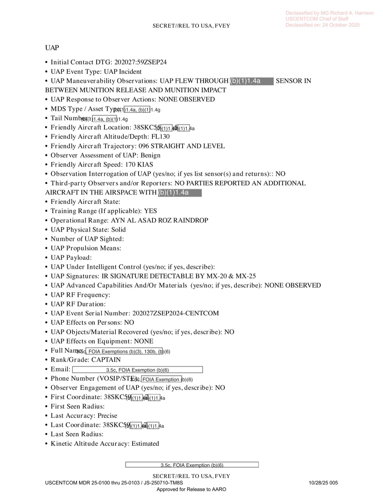
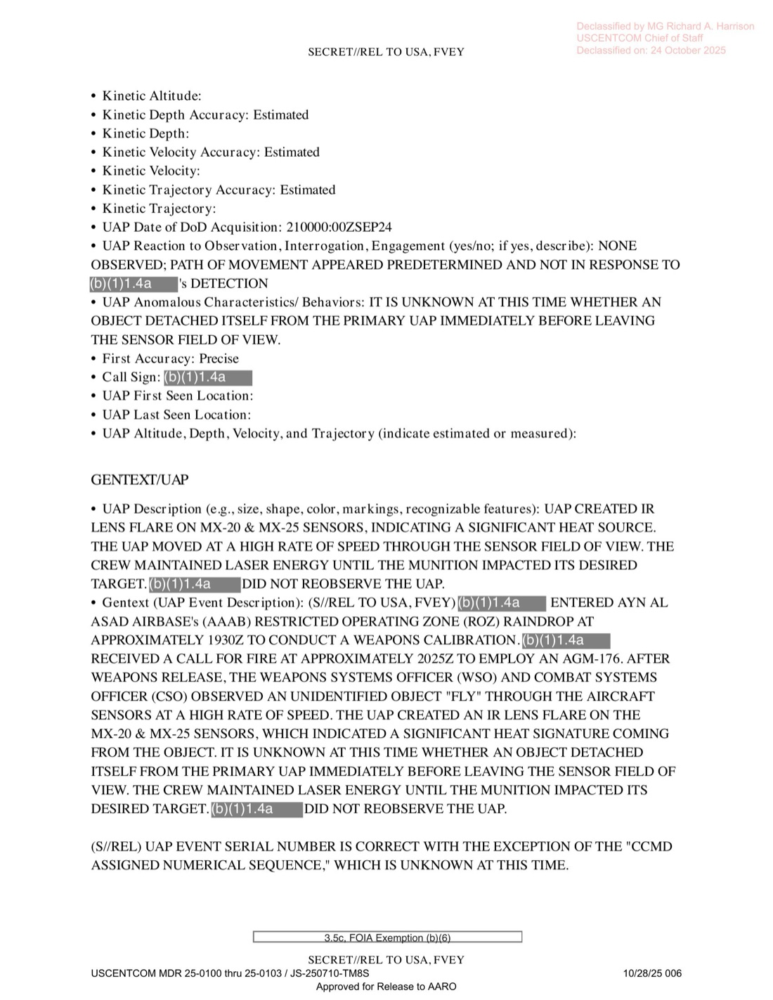

# #046 DOW-UAP-D28：2024-09-20 伊拉克 Ayn al Asad，AC-130J Ghostrider 在 AGM-176 Griffin 飛彈飛行間隙觀測 1 個高速 UAP 穿越感測器視野產生 IR 鏡頭炫光

| 欄位 | 內容 |
|---|---|
| 報告類型 | MISREP |
| 識別碼 | DOW-UAP-D28 |
| **UAP 事件序號** | **202027ZSEP2024-CENTCOM** |
| 任務日 | 2024-09-20 17:40Z 起飛至 2024-09-21 00:46Z 降落（7 小時 6 分） |
| 行動 | OP INHERENT RESOLVE |
| 主管 | USCENTCOM／**AFSOC** |
| 機隊 | **SOTU 016（Special Operations Tactical Unit 016）／379 AEW** |
| 機型推測 | **AC-130J Ghostrider 砲艇機**（30 mm + 105 mm 主砲 + AGM-176 Griffin） |
| 起降基地 | OKAS（Ali Al Salem AB, Kuwait） |
| 任務地點 | **AYN AL ASAD ROZ RAINDROP**（伊拉克 Al Asad Air Base 訓練範圍） |
| 任務型態 | **ARMED OVERWATCH**（訓練 / 武器試射）|
| UAP 觀測時間 | 2024-09-20 20:27:59Z |
| **事件脈絡** | **AGM-176 Griffin PGM 釋放與彈著之間（"BETWEEN MUNITION RELEASE AND MUNITION IMPACT"）** |
| 友軍位置 | 38SKC55X（Al Asad 範圍內） |
| 友軍高度 | **FL130（13,000 ft）** |
| 友軍速度 | 170 KIAS |
| 友軍航向 | 096° STRAIGHT AND LEVEL |
| UAP 位置 | 38SKC59X，「Last Accuracy: Precise」（精確） |
| **UAP 動作** | **「UAP FLEW THROUGH [REDACTED] SENSOR IN BETWEEN MUNITION RELEASE AND MUNITION IMPACT」** |
| **UAP 描述** | **「UAP CREATED IR LENS FLARE ON MX-20 & MX-25 SENSORS, INDICATING A SIGNIFICANT HEAT SOURCE. THE UAP MOVED AT A HIGH RATE OF SPEED THROUGH THE SENSOR FIELD OF VIEW.」** |
| **UAP IR signature** | **detectable by MX-20 & MX-25**（雙感測器同時記錄） |
| Physical State | Solid |
| **UAP Anomalous Behaviors** | **「IT IS UNKNOWN AT THIS TIME WHETHER AN OBJECT DETACHED ITSELF FROM THE PRIMARY UAP IMMEDIATELY BEFORE LEAVING [SENSOR FIELD OF VIEW]」**（不確定主 UAP 在離開感測器視野前是否有次物體分離） |
| **UAP Reaction to Observation** | **「NONE OBSERVED; PATH OF MOVEMENT APPEARED PREDETERMINED AND NOT IN RESPONSE TO [REDACTED]」**（移動路徑似為預定，非對 [遮蔽] 的反應） |
| 3rd Party Reporters | **NO PARTIES REPORTED AN ADDITIONAL AIRCRAFT IN THE AIRSPACE** |
| Observer Engagement | NO |
| Observer Assessment | Benign |
| Observer rank | **CAPTAIN（O-3）** |
| 機密層級 | SECRET // REL TO USA, FVEY |
| 釋出途徑 | USCENTCOM MDR 25-0100-25-0103，Declassified by MG Harrison 2025-10-24 |
| 公開日 | 2026-05-08 |
| PDF 頁數 | 6 頁 |
| war.gov metadata 錯誤 | **PDF 標題「East China Sea 2024」 vs. CSV 標題「Iraq, September 2024」 vs. 實際 Ayn al Asad** |

## 為什麼 D28 是 D 系列中物理與時間關聯最強的事件

D28 描述了一個極為特定的時序：

1. **AC-130J 釋放 AGM-176 Griffin 精準導引飛彈**
2. **飛彈飛行途中**（release → impact 間隔通常 10-60 秒）
3. **1 個高速 UAP 穿越 AC-130J 的 MX-20 + MX-25 EO/IR 感測器視野**
4. **UAP 在 2 個獨立感測器上同時造成 IR 鏡頭炫光**（指示「significant heat source」）
5. **CSO 觀察員（O-3 軍官）親眼確認**

時間與空間都精確：UAP 位置 38SKC59X、AC-130J 位置 38SKC55X、UAP 速度極快、IR 強發光。Last Accuracy 罕見地填「Precise」而非「Estimated」。

幾個關鍵物理特徵：

- **「significant heat source」**：對應的人造系統包括飛彈尾焰、戰鬥機 afterburner、衛星重返
- **「high rate of speed through sensor FOV」**：MX-20/MX-25 的 FOV 在 wide mode 約 28°，在 narrow mode 約 0.6°。從 FOV 邊到邊的「快速穿越」意味物體速度極快或 FOV 為 narrow mode
- **「between munition release and impact」**：時間窗極窄（推測 < 60 秒），UAP 出現恰巧在此期間
- **「object may have detached from primary UAP」**：類似 [#155 墨西哥國會聽證](../155-state_dept_uap_cable_5_mexico_2023/report.md) Ryan Graves 與 David Fravor 描述的「卵母艦 + 子物體」現象

## 1. AC-130J Ghostrider 推測依據

ACEQUIP 欄位明確顯示：

- **武器：30 mm + 105 mm 砲（1020 round 30mm + 80 round 105mm + AGM-176 Griffin）**
- **AAQ-24B LAIRCM** + AAQ-24 IRCM
- AAR-47 MWS + ALR-56M RWR
- ALE-47 干擾彈發射器，716 RR-180 chaff，240 flare（MJU-71/MJU-66/M206）
- **MX-25 TGT pod**
- GATEWAY data link（特種作戰系統）
- 雷達：AN/APN-241

30 mm + 105 mm 砲是 AC-130J Ghostrider 的標誌性主砲（取代 AC-130U Spooky 的 40 mm 砲）。Griffin（AGM-176）是 AC-130J 標準配備之精準小型空地導彈。LAIRCM + IRCM + MWS + ALE-47 是 AC-130J 標準自衛配置。

AC-130J 自 2017 服役，由 4 SOS / 73 SOS 等 AFSOC 中隊操作。「SOTU 016」可能是 Special Operations Tactical Unit 016 的代號，對應某個 AC-130J 部署型編組。

## 2. 任務時序

| 時間（Zulu） | 動作 |
|---|---|
| 09-20 17:40Z | 從 OKAS（Ali Al Salem AB, Kuwait）起飛 |
| 19:30Z | 抵達 ARMED OVERWATCH station |
| 19:30Z～20:27Z | 進入 AYN AL ASAD ROZ RAINDROP 訓練範圍 |
| **20:27:59Z** | **AGM-176 Griffin PGM 釋放後、彈著前，CSO 觀測 UAP 穿越感測器視野，IR 鏡頭炫光** |
| 23:23Z | 離站 |
| 09-21 00:46Z | 降落 OKAS |

「ROZ RAINDROP」是 AYN AL ASAD 的 ROZ（Restricted Operating Zone）代號之一，AC-130J 在此處可進行射擊訓練。

## 3. UAP 觀測詳述

GENTEXT/UAP（部分內容）：

> UAP Description: UAP CREATED IR LENS FLARE ON MX-20 & MX-25 SENSORS, INDICATING A SIGNIFICANT HEAT SOURCE. THE UAP MOVED AT A HIGH RATE OF SPEED THROUGH THE SENSOR FIELD OF VIEW. THE [REDACTED] DID NOT REOBSERVE THE UAP.

> UAP 描述：UAP 在 MX-20 與 MX-25 感測器上產生 IR 鏡頭炫光，顯示其為顯著熱源。UAP 以高速橫越感測器視野。[遮蔽] 未再觀測到該 UAP。

> Gentext (UAP Event Description): (S//REL TO USA, FVEY) [REDACTED] ENTERED AYN AL [ASAD] ROZ RAINDROP. [REDACTED]'S COMBAT SYSTEMS OFFICER (CSO) OBSERVED AN UNIDENTIFIED OBJECT "FLY" THROUGH THE AIRCRAFT SENSORS AT A HIGH RATE OF SPEED. THE UAP CREATED AN IR LENS FLARE ON THE [SENSORS]. ... ITSELF FROM THE PRIMARY UAP IMMEDIATELY BEFORE LEAVING THE SENSOR FIELD OF VIEW. ... [REDACTED] DID NOT REOBSERVE THE UAP.

> Gentext（UAP 事件描述）：（機密／可釋出予美國、五眼）[遮蔽] 進入 Ayn al Asad ROZ RAINDROP。[遮蔽] 的戰鬥系統官（CSO）觀測到 1 個不明物體「飛」過機載感測器，速度極高。UAP 在 [感測器] 上產生 IR 鏡頭炫光... [某個物體] 在離開感測器視野前 [可能] 從主 UAP 分離。... [遮蔽] 未再觀測到該 UAP。

關鍵欄位：

- UAP Event Type: **UAP Incident**
- UAP Maneuverability: **UAP FLEW THROUGH [SENSOR] IN BETWEEN MUNITION RELEASE AND MUNITION IMPACT**
- UAP Response to Observer Actions: **NONE OBSERVED**
- UAP Physical State: **Solid**
- **UAP Signatures: IR SIGNATURE DETECTABLE BY MX-20 & MX-25**
- UAP Reaction to Observation: **NONE OBSERVED; PATH OF MOVEMENT APPEARED PREDETERMINED AND NOT IN RESPONSE TO [REDACTED]**
- **UAP Anomalous: IT IS UNKNOWN AT THIS TIME WHETHER AN OBJECT DETACHED ITSELF FROM THE PRIMARY UAP IMMEDIATELY BEFORE LEAVING [SENSOR FOV]**
- Third-party Observers: **NO PARTIES REPORTED AN ADDITIONAL AIRCRAFT IN THE AIRSPACE**
- First/Last Coordinate: **38SKC59X**（First/Last 同一座標 → 通過感測器視野期間 UAP 在窄區段內）
- **Last Accuracy: Precise**

## 4. UAP 與 Griffin 飛彈互動的物理可能性

UAP 出現在「Griffin 釋放與彈著之間」這個極短時間窗（< 1 分鐘），同時：

- 「significant heat source」≈ 飛彈級熱量
- 「high rate of speed」≈ 飛彈級速度
- 「object may have detached」≈ MIRV 式次物體釋放

候選假設：

**(A) AC-130J 自身的 Griffin 飛彈**：但飛彈會在 release 後**遠離 AC-130J**，不會「flew through sensor」。除非 sensor 對準 target 而 Griffin 飛行軌跡橫越 sensor，這在物理上仍可能但 CSO 不會把已知 Griffin 列為 UAP。

**(B) 第二枚未通知飛彈**：3rd Party Reporters「NO PARTIES REPORTED AN ADDITIONAL AIRCRAFT」明確排除。

**(C) 第二架 AC-130J 或無人機釋放的彈藥**：同上，排除。

**(D) 巡弋飛彈／無人機**：伊朗代理人在 Al Asad 周邊地區（PMF、Kata'ib Hezbollah）曾發射多次飛彈／無人機。但 ROZ RAINDROP 是訓練範圍，敵方在此處空襲機率低；且「path predetermined, not reactive」描述不符敵方目標反應。

**(E) 真實 UAP 與 Griffin 軌跡偶然重合**：時間窗 < 1 分鐘 + 空間在感測器視野內 + 同方向，巧合機率極低。

**(F) 多體 UAP（primary + detached secondary）**：與 Graves/Fravor 描述「卵母艦」現象相符。

候選 (F) 在 UAP 文獻中對應 AATIP 報告的「Tic-Tac 級分離飛行物」、Stratton-Bray 紀錄、David Grusch 證詞等。本檔案明確列「object may have detached from primary UAP」是 D 系列中首次出現的「主物體 + 次物體分離」描述。

## 5. 觀察

**(1) D 系列中第二份 AFSOC 案件 + 首份 AC-130J 案件**：D25 (33 SOS MQ-9) 與 D27 (3 SOS MQ-9) 已建立 AFSOC 中隊軌跡，D28 加入 AC-130J 武裝平台。AC-130J 砲艇機在伊拉克訓練期間遭遇 UAP，且 UAP 出現在飛彈試射時機，是 AARO 應深度分析的時間關聯案例。

**(2) 「object detached from primary UAP」描述首次出現**：D 系列中 D10 / D12 / D14 / D16 / D18 / D19 / D20 / D23 / D25 / D27 都是「單一 UAP」描述。D28 首次出現「主物體 + 次物體分離」假設。對應 [#155 墨西哥國會聽證](../155-state_dept_uap_cable_5_mexico_2023/report.md) Ryan Graves 描述的「卵母艦」現象，本檔案是 USAF AC-130J CSO 視角的相似描述。

**(3) 「Last Accuracy: Precise」**：D 系列中其他案件 Last Accuracy 多為「Estimated」。D28 採「Precise」意味 UAP 位置已由 MX-20 + MX-25 雙感測器精確 fix。AARO 取得這份檔案後可比對該座標於同時段美軍 GPS 訊號、其他 NTIG 來源是否有對應 track。

**(4) MX-20 + MX-25 雙感測器同時記錄**：AC-130J 配備 MX-20（前部 EO/IR）+ MX-25（後部 EO/IR）。雙感測器都記錄到 IR 鏡頭炫光意味物體在兩個感測器視野中出現，可以做立體幾何分析。WSV (Weapon System Video) 應存在。

**(5) PDF 標題「East China Sea」 vs. 內容 Ayn al Asad**：D 系列中第三例 metadata 錯誤（前兩例：D20 標題 Southern US 內容敘利亞、D27 標題 UAE 內容 Gulf of Oman）。「East China Sea」與「Iraq」差距極大，可能是早期內部分類錯誤遺留。

## 6. 跨檔案連結

- **[#044 D25 希臘 2024-01-25](../044-dow_uap_d25_mission_report_greece_january_2024/report.md)** ・ **[#045 D27 Gulf of Oman 2024-06-07](../045-dow_uap_d27_mission_report_gulf_of_oman_june_2024/report.md)**：D25 / D27 / D28 構成 AFSOC 三案叢集，覆蓋希臘 / 阿曼灣 / 伊拉克三地。
- **[#155 Mexico 2023 State Dept](../155-state_dept_uap_cable_5_mexico_2023/report.md)**：Graves/Fravor 描述「卵母艦」與「次物體分離」現象。D28 是 USAF AC-130J 視角的首份對應案例。
- **[#040 D19 / #041 D20 敘利亞 ESSA killbox](../040-dow_uap_d19_mission_report_syria_february_2023/report.md)**：戰機平台案。D28 + 戰機案構成「武裝平台觀測 UAP」叢集，與 MQ-9 ISR 案件對比。

## 7. 來源

- 原始檔案：[U.S. Department of War — DOW-UAP-D28, Mission Report, Iraq, September 2024](https://www.war.gov/UFO/#DOW-UAP-D28,%20Mission%20Report,%20Iraq,%20September%202024)
- PDF 直接下載：`https://www.war.gov/medialink/ufo/release_1/dow-uap-d28-mission-report-east-china-sea-2024.pdf`（注意 URL 標 east-china-sea 但內容為伊拉克）
- 6 頁，原 SECRET // REL TO USA, FVEY
- USCENTCOM MDR 25-0100-25-0103 解密
- Declassified by MG Richard A. Harrison, USCENTCOM Chief of Staff, on 2025-10-24
- 公開日：2026-05-08
- 注意：PDF 標題「East China Sea 2024」、URL 含「east-china-sea」均與內容（伊拉克 Ayn al Asad）不符
