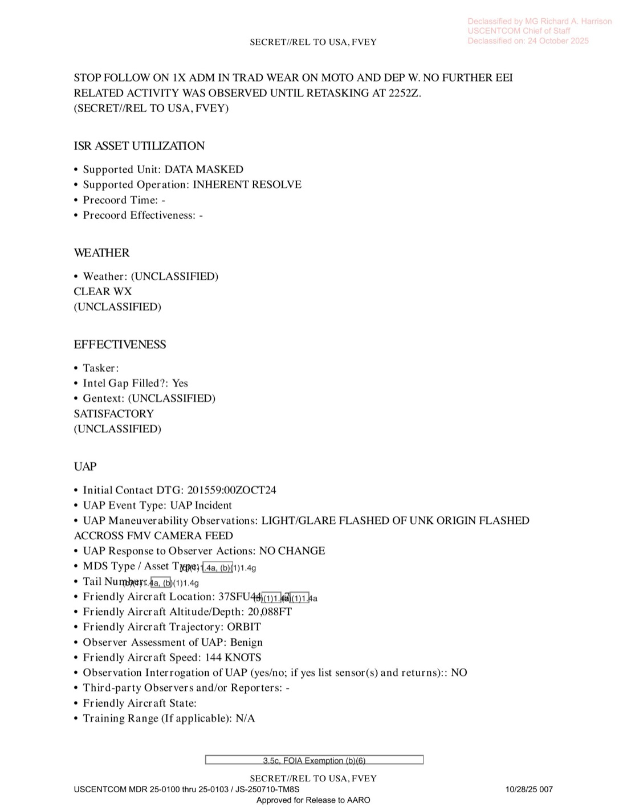

# #048 + #049 + #050 DOW-UAP-D32：2024-10-20 敘利亞，AFSOC 12 SOS MQ-9 在 45 分鐘內觀測多次「misshapen ball of white light」**Plasma** 事件

| 欄位 | 內容 |
|---|---|
| 報告類型 | MISREP |
| 識別碼 | DOW-UAP-D32 |
| **UAP 事件序號** | **201559ZOCT2024** |
| 任務日 | 2024-10-20 08:23Z 起飛至 2024-10-21 01:24Z 降落（20 小時 24 分） |
| 行動 | OP INHERENT RESOLVE，**GCP - VEO（violent extremist group 全球作戰計畫）** |
| 主管 | USCENTCOM／**AFSOC** |
| 機隊 | **12 SOS（12th Special Operations Squadron）／27 SOW**（Cannon AFB, NM） |
| 起降基地 | OJMS（Muwaffaq Salti AB, Jordan） |
| 任務地點 | 敘利亞 37S FU 36/79（多目標 ISR） |
| 任務型態 | TARGET DEV (Target Development) |
| Sensors Available | **SANTA FE** |
| Tasking Type | Dynamic |
| UAP 觀測時間 | 2024-10-20 15:59Z 至 16:44Z（**45 分鐘**） |
| 友軍高度 | **20,088 ft** |
| 友軍速度 | 144 KNOTS |
| 友軍軌跡 | **ORBIT**（繞圈飛行，非直線 transit） |
| **UAP Physical State** | **Plasma**（D 系列中首次「Plasma」分類） |
| **UAP 描述** | **「MISHAPEN AND UNEVEN BALL OF WHITE LIGHT」**（畸形不規則的白光球體） |
| **多次事件時間** | **15:59Z、16:02Z、16:09Z、16:20Z、16:44Z**（5 次獨立 light/glare events） |
| **事件位置變化** | 15:59 / 16:02 / 16:44 直接穿越 FMV camera；**16:09 / 16:20 在 FMV feed 頂部呈現 halo effect** |
| UAP Signatures | LIGHT |
| UAP Maneuverability | LIGHT/GLARE FLASHED OF UNK ORIGIN FLASHED ACROSS FMV CAMERA FEED |
| UAP Anomalous Behaviors | **「AIRCREW ASSESSED THIS NOT TO BE A LASING EVENT」**（機組明確排除雷射攻擊假設） |
| UAP Propulsion | UNKNOWN |
| Intelligent Control | NO |
| Observer Assessment | Benign |
| UAP First/Last Coordinate | 37SFU36（同一座標，UAP 在固定區域內反覆出現） |
| Aircrew Rank | E-4 |
| 機密層級 | SECRET // REL TO USA, FVEY |
| 釋出途徑 | USCENTCOM MDR 25-0100-25-0103，Declassified by MG Harrison 2025-10-24 |
| 公開日 | 2026-05-08 |
| PDF 頁數 | 10 頁 |
| README 條目 | **#048 + #049 + #050 三個重複條目共享同一 PDF** |

## 為什麼 D32 是 D 系列中物理特徵最異常的案件

D32 是 D 系列中**第一個 UAP Physical State 列為「Plasma」**的檔案。其他案件（D10-D28）多為「Solid」。Plasma 是物質第四態（電離氣體），其物理特性與固體完全不同：

- 高溫（通常 >5,000 K）
- 受磁場操控
- 自發發光（與環境溫差無關）
- 可能伴隨電離無線電傳播
- 邊界不固定（"misshapen and uneven"）

D32 的描述「misshapen and uneven ball of white light」精確符合**電漿球（plasma ball）**或**球狀閃電（ball lightning）**的物理形態學特徵。對應的人造系統候選極少：

| 候選 | 對應度 |
|---|---|
| 球狀閃電（自然現象） | 高（白光、不規則、自發光） |
| 高壓電弧放電 | 中（需要明確電源） |
| 高空電漿釋放實驗（如 HAARP） | 低（地理位置不符敘利亞） |
| 微波武器電漿產生 | 低（需要強微波源） |
| 飛彈尾焰電漿 | 低（飛彈會明顯移動） |
| 反射性物體幻象 | **被排除**：機組明確「AIRCREW ASSESSED THIS NOT TO BE A LASING EVENT」 |

「Halo effect at top of FMV feed」描述也對應於球狀電漿在感測器上的光暈擴散，而非單純光點。

## 1. 任務時序

| 時間（Zulu） | 動作 |
|---|---|
| 10-20 08:23Z | 從 OJMS（Muwaffaq Salti AB, Jordan）SLR 起飛 |
| 11:02Z | 抵達 SP1（37S FV 85/81，Syria），觀測 3 ADM + 1 moto |
| 11:58Z | 觀測活動結束 |
| 12:30Z | 抵達 SP2（37S FU 36/79），觀測 1 vehicle |
| 13:13-14:10Z | 3 stop follow on 1 ADM 騎機車 |
| **15:59Z** | **UAP Event 1**：light/glare crossed FMV camera |
| **16:02Z** | **UAP Event 2**：light/glare crossed FMV camera |
| **16:09Z** | **UAP Event 3**：light/glare halo at top of FMV feed |
| **16:20Z** | **UAP Event 4**：light/glare halo at top of FMV feed |
| **16:44Z** | **UAP Event 5**：light/glare crossed FMV camera |
| 16:44Z | UAP 事件結束 |
| 22:52Z | retasking |
| 23:18Z | SP3 任務段 |
| 10-21 01:24Z | 降落 OJMS |

任務總長 20:24，14:22 FMV hours，13:02 SIGINT hours，3 個 FMV 任務 + 3 個 SIGINT 任務。

## 2. UAP 觀測本身

完整 UAP 表單關鍵欄位：

- **Initial Contact DTG: 2024-10-20 15:59:00Z**
- UAP Event Type: **UAP Incident**
- **UAP Maneuverability Observations: LIGHT/GLARE FLASHED OF UNK ORIGIN FLASHED ACCROSS FMV CAMERA FEED**
- UAP Response to Observer Actions: **NO CHANGE**
- Friendly Aircraft Location: 37SFU44[X]/[X]
- **Friendly Aircraft Altitude: 20,088 FT**
- **Friendly Aircraft Trajectory: ORBIT**（繞圈飛行）
- Friendly Aircraft Speed: **144 KNOTS**
- Observer Assessment: **Benign**
- Operational Range: -
- **UAP Physical State: Plasma**
- UAP Propulsion Means: **UNKNOWN**
- UAP Under Intelligent Control: **NO**
- **UAP Signatures: LIGHT**
- UAP Advanced Capabilities And/Or Materials: **NO**
- UAP Effects on Persons: **NO**
- UAP Effects on Equipment: -
- First Coordinate: **37SFU36[X]/9[X]**
- First Seen Radius: 5
- Last Coordinate: **37SFU36[X]/9[X]** （同一座標）
- Last Seen Radius: 15
- Kinetic Altitude / Depth / Velocity / Trajectory: 全部 -（無）
- UAP Date of DoD Acquisition: 2024-10-20 15:59:00Z
- UAP Reaction to Observation / Interrogation / Engagement: **NO**
- **UAP Anomalous Characteristics / Behaviors: LIGHT/GLARE FROM UNKNOWN ORIGIN FLASHED ACCROSS FMV CAMERA FEED. AIRCREW ASSESSED THIS NOT TO BE A LASING EVENT.**

GENTEXT/UAP：

> UAP Description: MISHAPEN AND UNEVEN BALL OF WHITE LIGHT.

> UAP 描述：畸形不規則的白光球體。

> Gentext (UAP Event Description): (SECRET//REL TO USA, FVEY) FROM 1559Z-1644Z, [REDACTED] OBSERVED MULTIPLE GLARES OR LIGHT FROM UNKNOWN ORIGIN AT DIFFERENT ANGLES AND DIRECTIONS. AT 1559Z, 1602Z AND AT 1644Z, [REDACTED] OBSERVED 1X LIGHT/GLARE CROSSED DIRECTLY ON THE FMV CAMERA. AT 1609Z AND 1620Z, [REDACTED] OBSERVED A LIGHT/GLARE HALO EFFECT AT THE TOP OF [REDACTED] FMV FEED. AIRCREW CONSIDERED THIS NO MISSION IMPACT OR CHANGE AND UAP WAS BENIGN.

> Gentext（UAP 事件描述）：（機密／可釋出予美國、五眼）15:59Z 至 16:44Z，[遮蔽] 觀測到來自不明來源的多次強光或眩光，不同角度與方向。15:59Z、16:02Z 與 16:44Z，[遮蔽] 觀測到 1 次 light/glare 直接穿越 FMV camera。16:09Z 與 16:20Z，[遮蔽] 觀測到 light/glare 於 [遮蔽] FMV feed 頂部呈 halo effect。機組認為此事件對任務無影響或改變，且 UAP 為良性。

## 3. 「Aircrew assessed not a lasing event」的意義

機組明確排除「LASING EVENT」（雷射攻擊）這項對美軍 ISR 平台的重大威脅。

近年來中俄伊朗等對美軍 ISR 平台的雷射照射屢有發生：
- 2018 中國對美 RC-135 在吉布提的雷射照射
- 2022 俄羅斯對 NATO 偵察機的雷射攻擊
- 2023 伊朗代理人對美軍 MQ-9 的雷射干擾

雷射攻擊典型 signature：強烈白光突發於 FMV，可能造成感測器灼傷。但雷射 attacks 通常有：
1. 集中光斑（不會 misshapen）
2. 持續時間短（不會延續 45 分鐘）
3. 線性軌跡（不會「halo effect」）

D32 機組（E-4 級 SrA） 在當下判定**「不是 lasing」**，這個排除是 AARO 對該案分類的關鍵：UAP 不是敵方主動攻擊，但仍未識別。

## 4. GCP - VEO 與 12 SOS 的脈絡

「Global Campaign Plan - VEO（violent extremist group）」是 D32 ISR 的標籤，意味該任務在追蹤恐怖主義組織（ISIS、Al-Qaeda 殘部、伊朗代理人 PMF）。**12 SOS** 是 AFSOC 27 SOW 的 MQ-9 中隊（D25 = 33 SOS, D27 = 3 SOS, D28 = SOTU 016, D32 = 12 SOS - 27 SOW 已四個編組單位產生 UAP 通報）。

任務軌跡：OJMS → 3 個 SP（37S FU 區域）→ 22 小時持續 ISR + 5 次 UAP 事件叢集。**UAP 5 次事件在 45 分鐘內**，加上 First/Last Coordinate 都是 37SFU36X（同一位置）→ UAP 在固定空間內反覆出現/消失，而 MQ-9 在 ORBIT 模式繞圈。

如果機組 ORBIT 直徑約 5 nm，每圈約 90 秒（144 KTS），45 分鐘約繞 30 圈。5 次事件平均每 9 分鐘一次。**UAP 在固定地理位置出現，MQ-9 繞圈中每次經過該位置時看到光球**，這個物理模式可對應：

- **地面或低空高溫熱源**（如金屬反射、火焰、化學反應）+ MQ-9 視角變化導致時隱時現
- **持續存在的氣象現象**（如球狀閃電、聖艾爾摩之火、電漿放電）
- **跟隨 MQ-9 的物體**（但「path predetermined」+「halo」描述不符）
- **大氣折射 + 太陽光線形成的光學現象**（但 15:59-16:44Z 在敘利亞為下午晚段，太陽角度可解釋部分眩光）

## 5. 觀察

**(1) D 系列中首個「Plasma」分類**：D 系列其他案件 Physical State 多為「Solid」。D32 採「Plasma」是表單擴展後的新分類首次使用。AARO 收進此案後可作為「Plasma signature」標準參考案例。

**(2) 多次事件 + 同座標 + MQ-9 ORBIT 的時空關聯**：UAP 集中在 37SFU36X 區域內持續 45 分鐘，但 MQ-9 繞圈飛行。意味 UAP 是「在固定地理位置」而非「跟隨 MQ-9」。這個物理模式與 [#040 D19](../040-dow_uap_d19_mission_report_syria_february_2023/report.md) 在 Shaddadi 的「MFT + 3 UAP」、[#041 D20](../041-dow_uap_d20_mission_report_syria_essa_march_2023/report.md) 在 ESSA 的「10-20 UAP at FL600+」可能存在地理叢集關聯。

**(3) 27 SOW 四中隊全部產生 UAP 通報**：D25 (33 SOS) + D27 (3 SOS) + D28 (SOTU 016) + D32 (12 SOS) = 27 SOW 四個 AFSOC MQ-9 中隊均有 UAP 案件入錄。這個密度意味 27 SOW 對 AFSOC 中隊在 USCENTCOM AOR 的 UAP 通報量極大。

**(4) CSV 三條目共享 PDF 的編號設計**：README #048 / #049 / #050 三條目對應同一份 PDF 的同一 UAP 事件（不像 D23 #042+#043 對應 2 個 UAP）。意味 D32 在 War.gov 公開系統中被列為 3 個獨立 UAP 通報，但實際是 5 次 sub-events 合併在 1 個 UAP Event Serial（201559ZOCT2024）。這個編號慣例不一致可能反映 War.gov 與 AARO 內部編號方法的差異。

## 6. 跨檔案連結

- **[#040 D19 敘利亞 Shaddadi 2023-02-21](../040-dow_uap_d19_mission_report_syria_february_2023/report.md)** ・ **[#041 D20 敘利亞 ESSA 2023-03-31](../041-dow_uap_d20_mission_report_syria_essa_march_2023/report.md)**：敘利亞同區域 UAP 案件 cluster。
- **[#044 D25 / #045 D27 / #046 D28 AFSOC 27 SOW 系列](../044-dow_uap_d25_mission_report_greece_january_2024/report.md)**：D25 / D27 / D28 / D32 構成 AFSOC 27 SOW 四中隊 UAP 案件。
- **[#155 Mexico 2023 State Dept](../155-state_dept_uap_cable_5_mexico_2023/report.md)**：Graves 描述「未知光球」與 Plasma 假設的 Maussan 圈內辯論。D32 是美軍視角的 Plasma 案件記錄。

## 7. 來源

- 原始檔案：[U.S. Department of War — DOW-UAP-D32, Mission Report, Syria, October 2024](https://www.war.gov/UFO/#DOW-UAP-D32,%20Mission%20Report,%20Syria,%20October%202024)
- PDF 直接下載：`https://www.war.gov/medialink/ufo/release_1/dow-uap-d32-mission-report,-syria-october-2024.pdf`
- 10 頁，原 SECRET // REL TO USA, FVEY
- USCENTCOM MDR 25-0100-25-0103 解密
- Declassified by MG Richard A. Harrison, USCENTCOM Chief of Staff, on 2025-10-24
- 公開日：2026-05-08
- 注意：CSV 中 #048 / #049 / #050 三個條目共享同一 URL 與內容，對應同一份 UAP Event Serial（201559ZOCT2024）中的 5 次 sub-events，本報告合併處理
