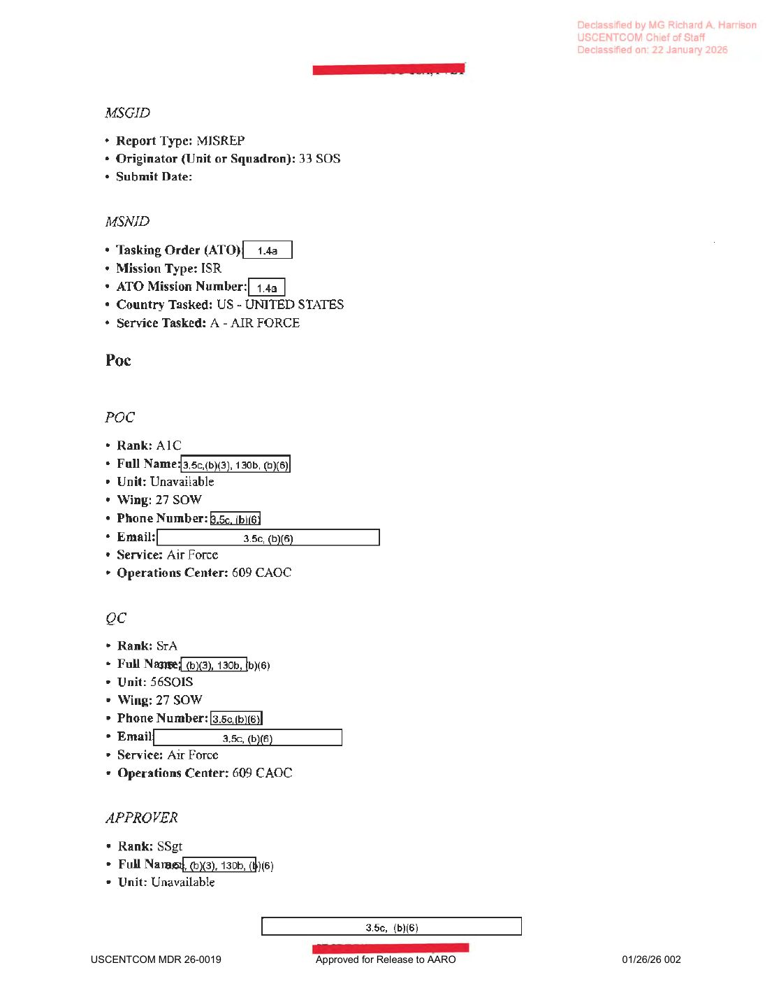
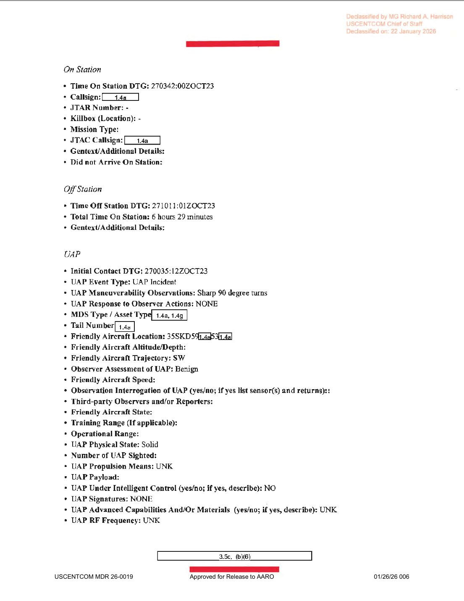
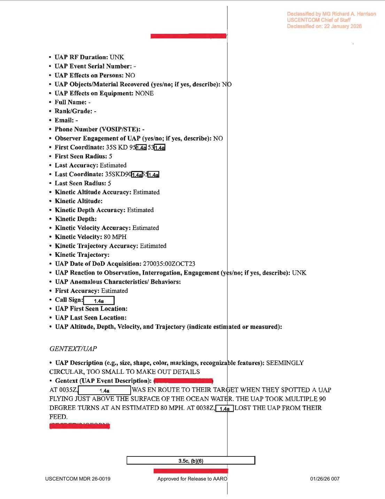

# #051 DOW-UAP-D33：2023-10-27 凌晨，33 SOS MQ-9 自希臘 Larissa 起飛途中於東地中海觀測 1 個「貼海面 + 多次 90 度直角轉彎」UAP，80 MPH，3 分鐘後脫離 sensor

| 欄位 | 內容 |
|---|---|
| 報告類型 | MISREP 9329374 |
| 識別碼 | DOW-UAP-D33 |
| 任務時間 | 起飛 2023-10-26 23:39Z LGLR, 落地 2023-10-27 13:09Z OJMS, 總任務 13 小時 30 分 |
| 主管 | USCENTCOM／**AFSOC**, 603 AOC, 609 CAOC |
| 機隊 | **33 SOS（33rd Special Operations Squadron）／27 SOW**（Cannon AFB, NM） |
| 起飛基地 | **LGLR（Larissa Air Base, Greece）** |
| 落地基地 | **OJMS（Marka, Jordan）** transit/reposition |
| 任務型態 | ISR / AREC / TARGET DEVELOPMENT |
| 全球作戰計畫 | **GCP-VEO**（Violent Extremist Organizations） |
| ATO Mission Type | ISR |
| 主感測器 | FMV / G-MESH |
| TGT Pod | **AN/DAS-4**（MQ-9 標準 EO/IR pod, MTS-B 升級版） |
| Avionics | AWGMESH |
| Data Link | LINK 16 |
| **UAP 觀測時間** | **2023-10-27 00:35:12Z** |
| UAP 脫離時間 | 00:38Z（**僅 3 分鐘觀測**） |
| **UAP 第一座標** | **35S KD 95X**（MGRS, 東地中海／敘黎沿海） |
| UAP 末座標 | 35S KD 9X |
| 友軍位置 | 35S KD 5X |
| 友軍航向 | **SW（西南方）** |
| **UAP 形狀** | **「SEEMINGLY CIRCULAR, TOO SMALL TO MAKE OUT DETAILS」**（看似圓形，過小無法辨識細節） |
| **UAP 機動** | **「Sharp 90 degree turns」** + **「FLYING JUST ABOVE THE SURFACE OF THE OCEAN WATER」** |
| **UAP 速度** | **80 MPH** |
| UAP 數量 | 1 |
| Physical State | **Solid** |
| Propulsion | UNK |
| Intelligent Control | NO |
| Signatures | NONE |
| Observer Assessment | Benign |
| Reaction to Observation | NONE |
| Effects on Equipment | NONE |
| 機密層級 | SECRET（caveat 遮蔽） |
| 解密日期 | 2048-10-26（25 年機密期）→ 2026-01-22 MDR 提前解密 |
| 釋出途徑 | USCENTCOM **MDR 26-0019**（Approved for Release to AARO 2026-01-26） |
| 公開日 | 2026-05-08 |
| PDF 頁數 | 7 頁 |

## 為什麼 D33「sharp 90 degree turns」是 D 系列首次明確直角機動描述

D33 是 D 系列**第一份在 UAP 表單「Maneuverability Observations」欄位明確填入「Sharp 90 degree turns」**的檔案。其他 D 系列案件機動描述多為：

| 案件 | Maneuverability 描述 |
|---|---|
| D10 / D12 | 散布行為，無明確機動 |
| D19 | 「Estimated 350 KTS」（直線） |
| D20 | 「Floating in air」（漂浮，無明確機動） |
| D23 | 「ROTATE」（旋轉）+ 直線 |
| D25 | 「Straight line」（直線非機動） |
| D27 | 「Flying straight just over the water at speed」（直線） |
| D28 | 「Object detached」（分離） |
| D32 | 「In place but slowly drifting」（飄移） |
| **D33** | **「Sharp 90 degree turns」（多次直角轉彎）** |

「**直角轉彎**」是 AATIP 提出 UAP「五大可觀察特徵」（five observables）之一，與**反慣性運動**直接對應。一個 80 MPH 的物體做尖銳 90 度轉彎，瞬間離心力極高，對任何已知傳統有人 / 無人載具的氣動性能來說都是不可行的。Nimitz 2004 Tic-Tac 案的「瞬間方向反轉」與本案的「多次 90 度直角」屬於同一機動類別。

## 1. 任務脈絡：從希臘飛往約旦的轉場任務

D33 不是常規 ISR 巡邏，而是**轉場（repositioning / reposition）任務**：

> **「TRANSITED AND LANDING AT OJMS TO REPLACE THE LIGHTNING LINE THAT LANDED AT LGLR YESTERDAY.」**
>
> 「轉場並於 OJMS（Marka, Jordan）落地，以取代昨日已於 LGLR（Larissa, Greece）落地的 Lightning 編隊。」

也就是說，33 SOS 在 2023 年 10 月底正在進行**希臘↔約旦兩地之間的 MQ-9 換班輪替**。LGLR（Larissa Air Base）位於希臘中部，是 AFSOC MQ-9 在歐洲／地中海戰區的前進部署點。OJMS（Marka, Jordan）則是 USCENTCOM 在中東的 MQ-9 基地之一。

任務時序：

| 時間 (Zulu) | 動作 |
|---|---|
| **2023-10-26 23:39Z** | 從 LGLR（Larissa, Greece）起飛 |
| 23:5XZ | LRE handed over to MCE |
| 2023-10-27 00:13Z | 7-lined to support data masked |
| **00:35:12Z** | **觀測 UAP（en route, 在前往任務區的途中）** |
| 00:38Z | UAP 從 sensor feed 消失 |
| 03:42Z | 抵達 SP（Start Point）36S YC 401X 開始 FMV/SIGINT |
| 10:11Z | RTB（Return to Base） |
| 12:13Z | Handed back to LRE |
| **13:09Z** | **落地 OJMS（Marka, Jordan）** |

UAP 觀測時友軍尚在轉場途中（**未抵達任務 SP**）。00:35Z 與 03:42Z（抵達 SP）之間相隔 3 小時 7 分，意味 UAP 在希臘起飛後約 56 分鐘被偵測，當時 MQ-9 位於希臘到任務區之間的東地中海上空。

## 2. UAP 觀測核心內容

GENTEXT/UAP：

> UAP Description: SEEMINGLY CIRCULAR, TOO SMALL TO MAKE OUT DETAILS
>
> Gentext (UAP Event Description): AT 0035Z [REDACTED] WAS EN ROUTE TO THEIR TARGET WHEN THEY SPOTTED A UAP FLYING JUST ABOVE THE SURFACE OF THE OCEAN WATER. THE UAP TOOK MULTIPLE 90 DEGREE TURNS AT AN ESTIMATED 80 MPH. AT 0038Z, [REDACTED] LOST THE UAP FROM THEIR FEED.

> UAP 描述：看似圓形，過小無法辨識細節
>
> Gentext（UAP 事件描述）：00:35Z [遮蔽] 在前往任務目標的途中，發現一個 UAP 貼著海面飛行。該 UAP 以約 80 MPH 速度做多次 90 度直角轉彎。00:38Z，[遮蔽] 在感測器畫面上失去該 UAP 蹤跡。

關鍵欄位：

- **UAP Maneuverability Observations: Sharp 90 degree turns**
- UAP Response to Observer Actions: NONE
- **UAP Physical State: Solid**
- UAP Propulsion Means: UNK
- UAP Under Intelligent Control: NO
- UAP Signatures: NONE
- UAP Effects on Equipment: NONE
- **Kinetic Velocity: 80 MPH**
- First Coordinate: 35S KD 95X
- Last Coordinate: 35S KD 9X
- Friendly Aircraft Trajectory: SW
- Observer Assessment: Benign

「**Intelligent Control: NO**」這個欄位回答耐人尋味。UAP 表單原意是問「該物體是否在智能控制下運作」。**多次 90 度直角轉彎**直觀上**應該**是智能控制的證據（不可能是隨機漂浮），但機組／DGS 填了 NO。可能解讀：

1. 機組保守填寫，避免做超出觀測證據的判斷
2. 90 度轉彎被視為機械／預編程行為，非「智能」反應
3. UAP 對觀察者沒有任何反應（NONE）→ 未察覺被觀測 → 視為 NO

## 3. 「貼海面 + 直角轉彎」的物理意涵

「Just above the surface of the ocean water」（貼海面）+「Sharp 90 degree turns」（直角轉彎）+「80 MPH」 構成本案的物理 signature：

**已知系統比對**：

| 候選 | 是否可解釋 |
|---|---|
| 一般小型無人機（DJI, Mavic） | 可貼海面、可 90 度轉彎，但 80 MPH 超出多數消費機性能（一般 ≤ 40 MPH） |
| 軍用偵察無人機（Scan Eagle） | 巡航 ~58 MPH，無法做直角轉彎（固定翼） |
| 巡弋飛彈 / 自殺式無人機（Shahed-136） | 直線 ~115 MPH，無法做直角轉彎 |
| 反艦飛彈 | 直線高速，不做直角轉彎 |
| 海上鳥類 | 速度太快（80 MPH 已超出多數海鳥飛行速度） |
| 海面反射幻象 | 不會做「多次 90 度轉彎」（連續可追蹤行為） |
| 旋翼無人機（quadcopter）超低空 | **唯一能同時滿足貼海面 + 80 MPH + 90 度直角的候選** |

最接近的已知系統是**高性能四旋翼無人機在超低空快速機動**。但「圓形」描述（無翼面、無可見構型）+ 80 MPH 在海面上方的連續直角機動仍超出多數民用 / 商用四旋翼性能包絡。

## 4. 地理脈絡：MGRS 35S KD 與東地中海

UAP 與友軍位置都用 MGRS 座標表示：

- 友軍 35S KD 5X
- UAP First 35S KD 95X
- UAP Last 35S KD 9X

**35S grid zone** 涵蓋東地中海大部分區域（24°E–30°E, 32°N–40°N）。KD 為該 grid zone 內的 100 km 子方格。從希臘 LGLR 起飛、約 50 分鐘後在 35S KD 區域，地理上對應希臘以南海域（克里特島周邊或更東 Cyprus 方向）。

由於 UAP 與友軍同在 35S KD 100 km 方格內，距離不超過 ~50 公里。MQ-9 EO/IR sensor 在數十公里外仍可清晰觀測小型物體，這支持 PDF 描述「too small to make out details」（物體太小，但仍能持續追蹤 3 分鐘以辨識直角轉彎行為）。

「**SW（西南方）**」友軍航向意味 MQ-9 大致從東地中海北部（希臘附近）向西南飛往非洲北部或地中海南部。但任務最終落地是 OJMS（約旦, 位於起飛地點東南方），所以這趟轉場可能繞了較大角度航跡或包含多段任務區。

## 5. 觀察

**(1) D33 是 D 系列第三份 27 SOW AFSOC 案件**：D25（33 SOS, Greece 2024-01）→ D27（3 SOS, Gulf of Oman 2024-06）→ D33（33 SOS, Greece 2023-10）。**D25 與 D33 都是 33 SOS、都是希臘 LGLR**，意味 33 SOS 在 2023-10 至 2024-01 之間至少累積 2 份 UAP 通報，**LGLR 周邊（東地中海北部）成為 33 SOS 的 UAP 觀測熱點**。

**(2) Sharp 90 degree turns 是 D 系列首次直角機動明確記錄**：對應 AATIP 五大可觀察特徵（Sudden/instantaneous acceleration, Hypersonic velocities without signatures, Low observability, Trans-medium travel, Positive lift）。「直角轉彎」本身屬於「瞬間加速度」類別，因為 90 度轉向需要瞬間將原向速度向量分量歸零並建立新向量，這在 80 MPH 下意味極短時間內承受極高 G 力。

**(3) MDR 26-0019 是 D 系列中目前看到最早的 2026 MDR 批次**：D32 是 MDR 25-0094 至 25-0099 系列；D33 跳到 MDR 26-0019（2026 年的 19 號批次）。意味 D33 在 2026-01-22 才被解密、2026-01-26 才釋出至 AARO，是相對較晚才完成解密流程的檔案。但仍在 2026-05-08 公開日期內出現。

**(4) Operation 欄位完全遮蔽（1.4a）**：D33 比 D27（ENDURING SENTINEL）、D32（INHERENT RESOLVE）、D23（SPARTAN SHIELD）更保密，連 OP 代號都未公開。可能候選包含 ATLANTIC RESOLVE（東歐反俄）、INHERENT RESOLVE（反 ISIS, 仍在進行）、或某個未公開的東地中海行動。

**(5) Initial Contact 00:35:12Z 精確到秒**：D 系列多數案件 Initial Contact 精確到分鐘（如 D27 = 04:57Z）。D33 精確到秒（00:35:12Z）意味本案的時間戳記是從 FMV 影片畫格直接擷取的，**MQ-9 影片資料本身具有秒級時間印記**。本案的 3 分鐘 FMV（00:35:12Z–00:38:00Z）是 AARO 後續分析的核心證據。

## 6. 跨檔案連結

- **[#044 D25 希臘 2024-01-25](../044-dow_uap_d25_mission_report_greece_january_2024/report.md)**：同為 33 SOS 從 LGLR 起飛、同為東地中海週邊觀測。D25 是 SWIR-only 菱形 + 探針 434 KTS，D33 是 FMV 圓形 + 直角轉彎 80 MPH。兩者形態、速度、感測器路徑完全不同，但共享地理（東地中海）與單位（33 SOS）。
- **[#045 D27 Gulf of Oman 2024-06](../045-dow_uap_d27_mission_report_gulf_of_oman_june_2024/report.md)**：同為 27 SOW AFSOC、同為「貼水面」觀測，但 D27 是直線 140 KTS（無轉彎）、D33 是直角轉彎 80 MPH。AFSOC MQ-9 觀測的水面 UAP 行為譜系。
- **[#047 D3 阿拉伯灣 2020](../047-dow_uap_d3_mission_report_arabian_gulf_2020/report.md)**：D3 是 D 系列最早水面相關案件，D33 是首次明確直角機動，兩者皆為 EO/IR 短時觀測（D3 = 27 秒, D33 = 3 分鐘）。

## 7. 來源

- 原始檔案：[U.S. Department of War — DOW-UAP-D33, Mission Report, Greece, October 2023](https://www.war.gov/UFO/#DOW-UAP-D33,%20Mission%20Report,%20Greece,%20October%202023)
- PDF 直接下載：`https://www.war.gov/medialink/ufo/release_1/dow-uap-d33-mission-report-greece-october-2023.pdf`
- 7 頁，SECRET
- USCENTCOM MDR 26-0019 解密（2026-01-22）
- Approved for Release to AARO：2026-01-26
- 公開日：2026-05-08
- 注意：報告標題寫「Greece」，但 UAP 觀測點 MGRS 35S KD 實際在東地中海公海，非希臘領空；任務轉場目的地為約旦 OJMS
