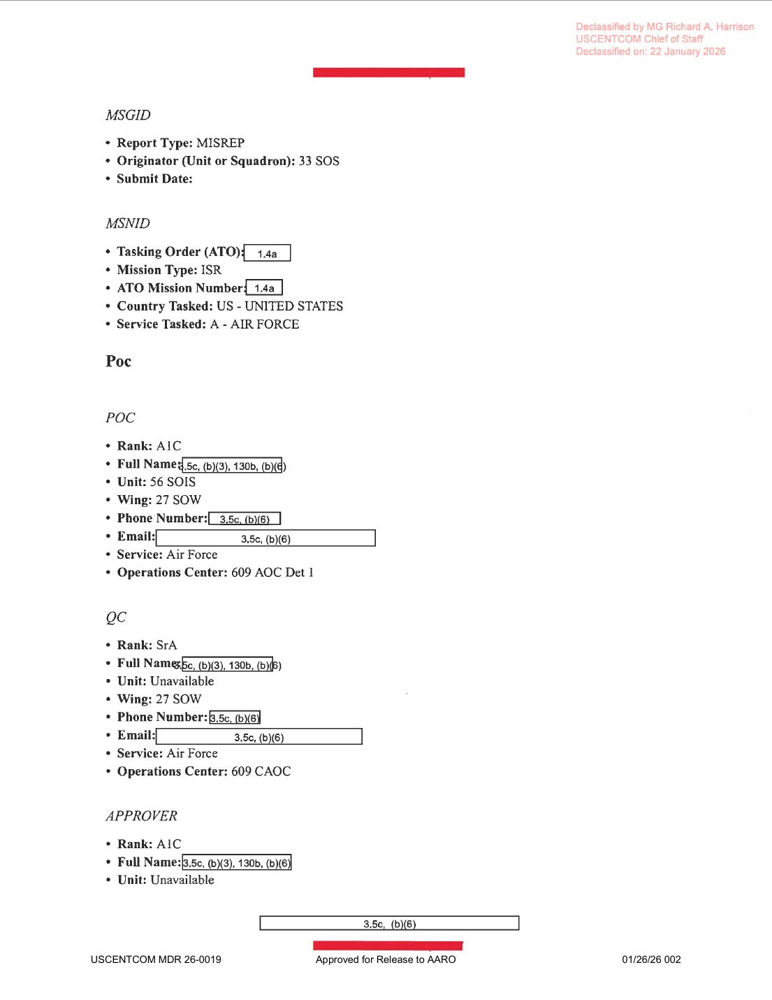
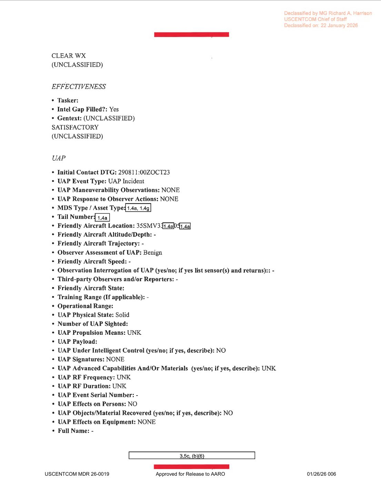

# #052 DOW-UAP-D35：2023-10-29 早 08:11Z，33 SOS MQ-9 在希臘 LGLR 巡邏返航中觀測 1 個「貼海面直線飛向陸地」UAP，30 MPH，與兩日前 D33 共構成東地中海觀測對

| 欄位 | 內容 |
|---|---|
| 報告類型 | MISREP 9337873 |
| 識別碼 | DOW-UAP-D35 |
| 任務時間 | 起飛 2023-10-28 15:04Z LGLR, 落地 2023-10-29 11:05Z LGLR, 總任務 20 小時 01 分 |
| 主管 | USCENTCOM／**AFSOC**, 603 AOC, 609 CAOC |
| 機隊 | **33 SOS（33rd Special Operations Squadron）／27 SOW**（Cannon AFB, NM, 同 D33） |
| 起降基地 | **LGLR（Larissa AB, Greece）** 雙向 |
| 任務型態 | ISR / FMV/SIGINT collection |
| ISR 任務區 | 36S YC 401X 5X（與 D33 完全相同 SP）|
| ATO Mission Type | ISR |
| 主感測器 | FMV |
| **UAP 觀測時間** | **2023-10-29 08:11:00Z** |
| **UAP 第一座標** | **35S MV 3X**（東地中海，D33 之 35S KD 以東 100 km grid 區段） |
| UAP 末座標 | 35S MV 3X（同方格） |
| **UAP 形狀** | **「SEEMINGLY CIRCULAR, TOO SMALL TO MAKE OUT DETAILS」**（與 D33 描述逐字一致） |
| **UAP 機動** | **「NONE」** + **「FLEW STRAIGHT ABOVE THE OCEAN TOWARDS LANDS」**（直線飛向陸地） |
| **UAP 速度** | **30 MPH** |
| UAP 數量 | 1 |
| Physical State | Solid |
| Propulsion | UNK |
| Intelligent Control | NO |
| Signatures | NONE |
| Observer Assessment | Benign |
| 機密層級 | SECRET |
| 解密日期 | 2048-10-28 → 2026-01-22 MDR 提前解密 |
| 釋出途徑 | USCENTCOM MDR 26-0019（與 D33 同批） |
| 公開日 | 2026-05-08 |
| PDF 頁數 | 7 頁 |

## 為什麼 D33 + D35 是「48 小時內同單位、同基地、同 ISR 任務區」的 UAP 雙觀測案

D33（10-27）與 D35（10-29）兩份 MISREP 高度同構：

| 屬性 | D33 | D35 |
|---|---|---|
| MISREP 編號 | 9329374 | 9337873 |
| 中隊 | 33 SOS | 33 SOS |
| Wing | 27 SOW | 27 SOW |
| 任務型態 | ISR transit | ISR round-trip |
| 起飛 | LGLR 26 Oct 23:39Z | LGLR 28 Oct 15:04Z |
| 落地 | OJMS 27 Oct 13:09Z | LGLR 29 Oct 11:05Z |
| ISR SP | 36S YC 401X 5X | 36S YC 401X 5X（**完全相同**） |
| UAP 觀測時間 | 27 Oct 00:35Z | 29 Oct 08:11Z |
| UAP 座標 | 35S KD 95X / 9X | 35S MV 3X |
| 形狀描述 | 「seemingly circular, too small to make out details」 | 「seemingly circular, too small to make out details」（**字句完全一致**） |
| 速度 | 80 MPH | 30 MPH |
| 機動 | Sharp 90 degree turns | NONE（直線飛向陸地） |
| 飛行高度 | Just above the ocean water | Just above the ocean water |
| Physical State | Solid | Solid |
| Propulsion | UNK | UNK |
| Intelligent Control | NO | NO |

**「字句完全一致的 UAP 描述」**意味兩件事的可能性：

1. **同一類物體在不同時間被觀測**：兩個物體屬於同一類型（小型圓形、貼海面），AARO 或 33 SOS 機組已將此類觀測標準化為單一描述模板
2. **同一批機組沿用前案描述模板**：33 SOS 在 D33 後建立了該描述語句，D35 機組複用

兩者皆指向：**東地中海北部（希臘以東、塞普勒斯／黎巴嫩以西海域）出現一類重複出現的水面 UAP 物體**，足以讓 33 SOS MQ-9 在 48 小時內提交兩份相同形態描述的 UAP 通報。

## 1. 任務脈絡

D35 是完整 ISR 巡邏（非轉場）：

| 時間 (Zulu) | 動作 |
|---|---|
| 2023-10-28 15:04Z | 從 LGLR 起飛 |
| 15:15Z | LRE→MCE handover |
| 16:18Z | 7-lined to support data masked |
| 20:18Z | 抵達 SP 36S YC 401X 5X 開始 FMV/SIGINT |
| **2023-10-29 08:11Z** | **觀測 UAP** |
| 09:42Z | RTB |
| 10:35Z | MCE→LRE handover |
| **11:05Z** | **落地 LGLR** |

任務全長 20:01（含 RTB 與 LRE handover 階段），FMV 9:24。UAP 觀測時友軍應已完成主任務並正在 RTB（返航）階段。

## 2. UAP 觀測核心內容

GENTEXT/UAP：

> UAP Description: SEEMINGLY CIRCULAR, TOO SMALL TO MAKE OUT DETAILS
>
> Gentext (UAP Event Description): AT 0811Z [REDACTED] WAS RTB WHEN THEY SPOTTED A UAP FLYING JUST ABOVE THE SURFACE OF THE OCEAN WATER. THE UAP FLEW STRAIGHT ABOVE THE OCEAN TOWARDS LANDS. AT 0811Z [REDACTED] LOST THE UAP FROM THEIR FEED.

> UAP 描述：看似圓形，過小無法辨識細節
>
> Gentext（UAP 事件描述）：08:11Z [遮蔽] 正在 RTB 返航時發現一個 UAP 貼海面飛行。該 UAP 直線飛向陸地方向。08:11Z [遮蔽] 在感測器畫面上失去該 UAP。

關鍵欄位：

- **UAP Maneuverability Observations: NONE**（與 D33 對比強烈）
- **Kinetic Velocity: 30 MPH**
- First / Last Coordinate: 35S MV 3X（同 grid 方格）
- UAP Trajectory: 「STRAIGHT ... TOWARDS LANDS」（直線朝陸地）
- Friendly Aircraft State: RTB（Return to Base）

「**TOWARDS LANDS**」與「flew straight」共構：UAP 沿單一向量直線航行，目標方向為陸地。35S MV 3X 位於東地中海，附近主要陸地為：

- **黎巴嫩 / 敘利亞海岸**（東北方向）
- **賽普勒斯島**（中間位置）
- **以色列海岸**（東南方向）
- **土耳其南海岸**（北方）

PDF 未明確說「towards which land」，無法逕自推斷目標地點。但 UAP 朝陸地方向飛行而非朝公海，意味該物體**有目的地**，與「無智能控制（Intelligent Control: NO）」的填寫存在張力。

## 3. 對照 D33 機動譜系

D33 是「sharp 90 degree turns」（多次直角轉彎、3 分鐘觀測），D35 是「straight, no maneuvering」（直線、極短觀測）。兩個物體在描述上完全一致（圓形、貼海面、過小）但行為差異大：

- 同類物體在不同任務脈絡下展現不同行為（一次積極機動、一次目的地導向直線）
- 兩個不同物體在 48 小時內出現在同片海域
- 同一物體在不同階段展現不同行為模式

D35 中「TOWARDS LANDS」的語意值得留意。「進入陸地」對應於潛在的著陸／吸收任務，但因物體過小、Sensor 解析度限制，無法判定是否真的抵達陸地。

## 4. 觀察

**(1) D33 + D35 構成 D 系列首組「同單位連續觀測對」**：48 小時內、同基地（LGLR）、同單位（33 SOS）、同 ISR 任務區（36S YC 401X 5X）、相鄰 grid（35S KD↔35S MV）、相同 UAP 描述模板。對應 [#041 D20](../041-dow_uap_d20_mission_report_syria_essa_march_2023/report.md) 中 77 EFS 提到「**PRIOR SORTIES 看到編隊**」的觀察：33 SOS 在 2023-10 末週的東地中海也展現了類似的「同單位連續觀測」模式。

**(2) MDR 26-0019 是 D33 + D35 + 同批次共享解密號**：意味 AARO / USCENTCOM 將 D33 與 D35 作為**單一解密包**處理，而非個別評估。這支持「兩案被視為同一事件序列」的解讀。

**(3) 30 MPH「直線朝陸地」與 80 MPH「90 度直角」對比**：D35 速度為 D33 的 37.5%。如果是同一類物體，速度差異意味「巡航模式 vs. 機動模式」兩種狀態。對應 D 系列其他「快慢切換」案件（如 D23 320 mph→440 mph）。

**(4) Friendly Aircraft Altitude/Trajectory 全部空白**：D35 的 Friendly Aircraft Altitude、Speed、Trajectory 欄位都是「-」（未填）。對比 D33（Trajectory: SW）填寫較完整。可能因 D35 觀測時間極短（事件描述兩個時間戳都是 08:11Z，意味物體被偵測後幾乎立即從畫面消失），機組無法即時記錄友軍 metadata。

**(5) AARO 應將 D33 + D35 視為連續觀測對**：兩份報告共享單位、地理區、形狀描述、Physical State（Solid）、Propulsion（UNK）、Intelligent Control（NO）。AARO 後續分析應作為「東地中海 33 SOS 連續觀測」case study。

## 5. 跨檔案連結

- **[#051 D33 希臘 → 約旦 2023-10-27](../051-dow_uap_d33_mission_report_greece_october_2023/report.md)**：48 小時前的姐妹案。同 33 SOS、同 LGLR 起飛、同任務 SP、相鄰 grid、相同 UAP 描述模板。
- **[#044 D25 希臘 2024-01-25](../044-dow_uap_d25_mission_report_greece_january_2024/report.md)**：D33+D35 後三個月，同 33 SOS、同 LGLR，但 UAP 形態（菱形 + 探針 434 KTS）完全不同。33 SOS 從 LGLR 累積至少 3 份 UAP 通報。
- **[#045 D27 Gulf of Oman 2024-06-07](../045-dow_uap_d27_mission_report_gulf_of_oman_june_2024/report.md)**：同 27 SOW（3 SOS）、同「貼水面」觀測類型，但於阿拉伯海方向。AFSOC MQ-9 觀測的水面 UAP 集合擴大。

## 6. 來源

- 原始檔案：[U.S. Department of War — DOW-UAP-D35, Mission Report, Greece, October 2023](https://www.war.gov/UFO/#DOW-UAP-D35,%20Mission%20Report,%20Greece,%20October%202023)
- PDF 直接下載：`https://www.war.gov/medialink/ufo/release_1/dow-uap-d35-mission-report-greece-october-2023.pdf`
- 7 頁，SECRET
- USCENTCOM MDR 26-0019 解密（2026-01-22, 與 D33 同批）
- Approved for Release to AARO：2026-01-26
- 公開日：2026-05-08
