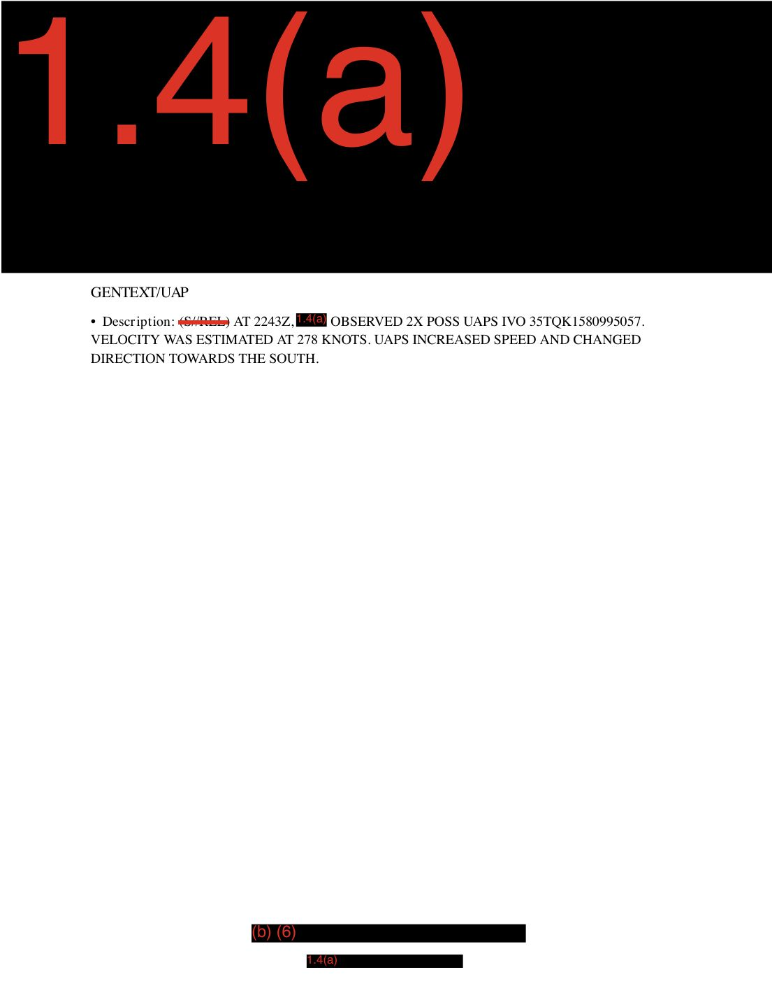

# #059 DOW-UAP-D5：2020 年某日（具體日期遮蔽）**地中海戰區**（標題誤標 Arabian Gulf）13:54Z 與 22:43Z 兩次獨立觀測，相隔 8 小時 49 分鐘，第一筆 1 個 UAP 40 KTS 等速 FL160-170，第二筆 **2 個 UAPs 278 KTS 加速轉向南方**，全 6 頁中 5 頁 1.4(a) 完全遮蔽，僅 GENTEXT/UAP 兩段 S//REL 殘文

| 欄位 | 內容 |
|---|---|
| 報告類型 | MISREP（編號遮蔽）|
| 識別碼 | DOW-UAP-D5 |
| 日期 | **2020 年某日**（具體月份與日期遮蔽） |
| 戰區 | **地中海戰區**（依 MGRS 推定，標題誤標 "Arabian Gulf"） |
| **UAP 觀測 #1** | **13:54Z, 1 個 UAP, MGRS 34S CE 7566 9 9009 8**（地中海中部，Sicily / Tunisia / Malta 附近）|
| UAP #1 速度 | **40 KNOTS（等速）** |
| UAP #1 高度 | **FL160 到 FL170**（16,000-17,000 ft） |
| UAP #1 機動 | UAP speed remained constant（速度保持等速） |
| **UAP 觀測 #2** | **22:43Z, 2 個 POSS UAPs, MGRS 35T QK 1580 9 95057**（東地中海 / 土耳其 / Aegean 海方向）|
| UAP #2 速度 | **278 KNOTS（估算）** |
| UAP #2 機動 | **UAPS INCREASED SPEED AND CHANGED DIRECTION TOWARDS THE SOUTH**（加速 + 轉向南方）|
| **兩次觀測間隔** | **8 小時 49 分鐘** |
| 機密層級 | **SECRET // REL TO ...**（兩筆觀測前綴皆為 S//REL，與 [#054 D4](../054-dow_uap_d4_mission_report_arabian_gulf_2020/report.md) 相同模式） |
| 遮蔽程度 | **6 頁中 5 頁完全 1.4(a) 遮蔽**，僅 2 個 GENTEXT/UAP 段落殘留 |
| 公開日 | 2026-05-08 |
| PDF 頁數 | 6 頁 |

## 為什麼 D5 在高遮蔽下仍揭示 D 系列「同任務雙 UAP 事件」

前 58 份 D 系列檔案中：
- **單一觀測時刻多 UAP**：D3（27 秒 4 個）、D19（1 分鐘 3 個）、D20（1 分鐘 10-20 個）、D32（45 分鐘 5 次）、D42（peak 3 個）、D44（1 個）
- **同任務多觀測時刻**：罕見

D5 明確記錄「同一份 MISREP 內，相隔 8 小時 49 分鐘的兩次完全獨立 UAP 觀測」。意味該任務的友軍機（或情監偵單位）在跨時段的 ISR 中遇到了兩組性質完全不同的 UAP：

| 屬性 | 觀測 #1（13:54Z） | 觀測 #2（22:43Z） |
|---|---|---|
| 物體數量 | 1 個 | 2 個 POSS UAPs |
| 速度 | **40 KNOTS（極慢）** | **278 KNOTS（中等高速）** |
| 高度 | **FL160-FL170**（中空層） | 未指明 |
| 機動 | **等速直線** | **加速 + 轉向南方** |
| MGRS | **34S CE 75669 90098**（地中海中部） | **35T QK 15809 95057**（東地中海 / 土耳其方向） |
| 兩座標距離 | — | **約 1,500 km 以上**（中地中海 → 東地中海 / 土耳其方向，跨多個 MGRS zone） |

「**40 vs. 278 KNOTS**」（7 倍速差）、「等速 vs. 加速轉向」、「1 個 vs. 2 個」、「中地中海 vs. 東地中海」：兩次觀測在每個維度上都不同。這不是同一物體的延續觀測，而是 D 系列「跨時段跨地理 + 不同物理特徵」雙 UAP 案件。

## 1. UAP 觀測 #1（13:54Z）

GENTEXT/UAP（第 5 頁）：

> "(S//REL) AT 1354Z, [REDACTED] OBSERVED 1X UAP IVO 34SCE7566990098. VELOCITY WAS 40 KNOTS AT FL160 TO FL170. UAP SPEED REMAINED CONSTANT."

> 「(S//REL) 13:54Z [遮蔽] 在 MGRS 34S CE 75669 90098 附近（IVO = In the Vicinity Of）觀測 1 個 UAP。速度 40 KNOTS，高度 FL160 到 FL170 之間。UAP 速度保持等速。」

關鍵特徵：

- **40 KNOTS（74 km/h）**：極慢，遠低於戰機巡航速度（300+ KTS）、低於 MQ-9 Reaper 巡航（120-180 KTS），接近**輕型氣球 / 慢飛艇 / 螺旋槳超輕型飛機**速度
- **FL160-FL170**：航空中空層，**民航機巡航高度以下**（民航機典型 FL300-FL400），但**高於普通氣球漂浮 高度**（典型氣象氣球 FL250+）
- **40 KTS 在 FL160 等速** = **不太可能是常見人造平台**。最接近的可能性：飛艇、滑翔機、特殊氣球載具
- **MGRS 34S CE**：地中海中部，**Sicily / Malta / Tunisia / 利比亞外海**附近

## 2. UAP 觀測 #2（22:43Z）

GENTEXT/UAP（第 6 頁）：

> "(S//REL) AT 2243Z, [REDACTED] OBSERVED 2X POSS UAPS IVO 35TQK1580995057. VELOCITY WAS ESTIMATED AT 278 KNOTS. UAPS INCREASED SPEED AND CHANGED DIRECTION TOWARDS THE SOUTH."

> 「(S//REL) 22:43Z [遮蔽] 在 MGRS 35T QK 15809 95057 附近觀測 **2 個 POSS UAPs**。速度估算 278 KNOTS。**UAPs 加速並向南方變更航向**。」

關鍵特徵：

- **278 KNOTS（515 km/h）**：戰機巡航速度範圍，**對應 [#054 D4](../054-dow_uap_d4_mission_report_arabian_gulf_2020/report.md) 的「321 KNOTS」精確雷達 doppler 估算**模式
- **2 個 UAPs 同時**：編隊或併行觀測
- **加速 + 轉向**：**主動機動**（與 D4「UAP 加速且向東變向」、D7、D8 等 2020 阿拉伯灣早期案件機動模式高度相似）
- **MGRS 35T QK**：35T 緯度帶 40-48°N，35 經度帶 24-30°E，**對應東地中海 / 土耳其 / Aegean 海**方向
- 轉向南方 = 朝**地中海 / 北非**方向

## 3. 地理推斷：兩座標都在地中海，與標題「Arabian Gulf」完全不符

MGRS 座標轉換：

**34S CE 75669 90098**：
- 34S 經度帶 18°E-24°E（中地中海）
- S 緯度帶 32°N-40°N
- 對應地理位置：**Sicily Channel / Malta / Tunisia 北部 / 利比亞海岸**附近

**35T QK 15809 95057**：
- 35T 經度帶 24°E-30°E（東地中海 / 土耳其）
- T 緯度帶 40°N-48°N
- 對應地理位置：**東 Aegean Sea / 土耳其西北 / 馬爾馬拉海 / Bosphorus 海峽**附近

兩個座標：
- **34S CE → 35T QK**：跨越**約 1,500 km**（從中地中海到東地中海 / 土耳其方向）
- 都**不在 USCENTCOM AOR**（阿拉伯灣 / 波斯灣 / 中東陸地）
- 都在**USEUCOM AOR**（歐洲司令部，含地中海與土耳其）

**D 系列第 8 處 metadata 錯誤**：War.gov 標題 "Arabian Gulf, 2020" 與 PDF 內容明確的地中海座標完全矛盾。

## 4. 對比 D4 的「S//REL + 高遮蔽 + 加速轉向」共構模式

D5 與 [#054 D4](../054-dow_uap_d4_mission_report_arabian_gulf_2020/report.md) 共享多個 signature：

| 屬性 | D4 | D5 |
|---|---|---|
| 機密層級 | **SECRET // REL TO USA, FVEY** | **(S//REL) 兩筆觀測前綴** |
| 遮蔽程度 | 5 頁中 4 頁 1.4(a) 完全遮蔽 | **6 頁中 5 頁 1.4(a) 完全遮蔽** |
| 觀測者 | **PILOT**（有人機飛行員） | 觀測者遮蔽（推測同類 PILOT）|
| 速度 | 321 KNOTS（精確） | **278 KNOTS**（估算）|
| 機動 | **加速 + 向東變向** | **加速 + 轉向南方**（觀測 #2）|
| MGRS | 34S DG（中地中海） | **34S CE + 35T QK**（中 + 東地中海）|
| 標題 vs. 內容 | Arabian Gulf vs. 中地中海（不符） | **Arabian Gulf vs. 地中海（不符）**|
| 觀測單位 | 遮蔽 | 遮蔽 |
| 解密路徑 | 推測 USCENTCOM MDR | 推測 USCENTCOM MDR（未列號碼）|

**D4 + D5 構成 D 系列「2020 年地中海 S//REL FVEY 高遮蔽 PILOT 觀測雙案」**：

1. 同 2020 年
2. 同地中海戰區（標題均誤標 Arabian Gulf）
3. 同 S//REL FVEY 機密層級
4. 同 PILOT（有人機）觀測者類別
5. 同「加速 + 變向」UAP 機動模式
6. 同「絕大多數頁面 1.4(a) 完全遮蔽」呈現方式

**可能解讀**：D4 + D5 屬於**同一系列任務的同一週 / 同月 ISR**，可能來自**駐地中海的航空母艦戰鬥群**（如 USS Eisenhower / Truman CSG）或駐 NAS Sigonella（Sicily）/ Souda Bay（Crete）/ Incirlik（Turkey）的有人駕駛偵察機（如 EP-3 / U-2 / RC-135）。

## 5. 觀察

**(1) D5 是 D 系列「同任務內跨時段雙 UAP 事件」案件**：兩次觀測相隔 8 小時 49 分鐘，物體數量、速度、高度、地理位置、機動模式全部不同。意味該任務（可能為長時程 ISR sortie 或多 sortie 拼接的 MISREP）跨越兩個獨立 UAP 事件。

**(2) D 系列第 8 處 metadata 標題錯誤**：War.gov 標題 "Arabian Gulf, 2020" 與 PDF MGRS 座標（34S CE 中地中海 + 35T QK 東地中海）完全不符。延續 D4（Arabian Gulf 標題 vs. 34S DG 中地中海內容）的同模式錯誤。**「2020 年 Arabian Gulf」可能是 DOW UAP 釋出包對 2020 年所有 USCENTCOM AOR 任務報告的默認標題模板**，導致跨戰區 MISREP 都被標為 Arabian Gulf。

**(3) S//REL 兩筆觀測前綴 = REL TO USA FVEY**：(S//REL) 是 SECRET // REL TO [partners] 的縮寫。完整字段被 1.4(a) 刪除線遮蔽，**但延續 D4 的 FVEY（US, UK, AU, CA, NZ 五眼）模式**。意味本 MISREP 屬於可與五眼共享的 ISR 收集，可能是 NATO 框架內的多國情監偵任務。

**(4) 「40 KNOTS 等速 FL160-170」是 D 系列低速中空層 signature**：對比其他 D 系列案件：
   - D3 阿拉伯灣（4 個 UAP，速度未精確記錄）
   - D27 Gulf of Oman（140 KTS 貼水面）
   - D33 東地中海（80 MPH 貼海面）
   - D35 東地中海（30 MPH 貼海面）
   - D5 觀測 #1（40 KNOTS at FL160-170 中空層等速），記錄「慢速 + 中空層 + 持續等速」signature

   候選物體類別：飛艇、滑翔機、特殊氣球（如平流層氣球，但 FL160 低於典型平流層氣球）、慢速無人機（如 RQ-7 Shadow 或商用四旋翼，但續航與航程不符該座標的偏遠位置）。

**(5) 「278 KNOTS 加速 + 轉向」與 D4「321 KNOTS 加速 + 轉向」對應**：兩案速度都在 270-321 KNOTS 範圍，機動模式都是「加速 + 變向」。可能對應同類物體（例如 2020 年地中海某類 UAV 群體）的不同觀測時刻。**278 KNOTS 也對應 D 系列其他「278 KNOTS」記錄**（如 README 中 D8 「278 節（320 mph）」相同數值，是常見對應值，可能對應同一類載具的標準速度）。

**(6) MGRS 34S CE + 35T QK 跨 1,500 km 軌跡可能意味同類物體的兩個獨立中隊**：兩個觀測座標相距甚遠，**不可能是同一物體在 8h49m 內以 40 KTS 或 278 KTS 抵達**（40 KTS × 8.8h = 352 NM = 652 km，未達 1,500 km；278 KTS × 8.8h = 2,447 NM = 4,532 km，過頭）。意味**兩個物體（組）獨立**，是地中海各處部署的某類載具家族。

## 6. 跨檔案連結

- **[#054 D4 阿拉伯灣 2020](../054-dow_uap_d4_mission_report_arabian_gulf_2020/report.md)**：同 2020 + 同 S//REL + 同地中海戰區（標題誤標 Arabian Gulf）+ 同「加速 + 變向」機動 + 同 PILOT 觀測。**D4 + D5 構成 D 系列 2020 地中海 S//REL FVEY 高遮蔽 PILOT 觀測雙案**。
- **[#047 D3 阿拉伯灣 2020](../047-dow_uap_d3_mission_report_arabian_gulf_2020/report.md)**：D 系列最早 2020 阿拉伯灣案件（27 秒 4 個 UAP）。D3 標題 vs. PDF 內容相符，與 D4 / D5 標題誤標模式不同。
- **[#055 D42 波斯灣 2020-08-31](../055-dow_uap_d42_range_fouler_debrief_japan_2023/report.md)**：D 系列另一份標題誤標案件（Japan vs. 39R WL 波斯灣）。**D4 + D5 + D42 + D44 共構 2020 年標題 metadata 錯誤家族**。

## 7. 來源

- 原始檔案：[U.S. Department of War — DOW-UAP-D5, Mission Report, Arabian Gulf, 2020](https://www.war.gov/UFO/#DOW-UAP-D5,%20Mission%20Report,%20Arabian%20Gulf,%202020)
- PDF 直接下載：`https://www.war.gov/medialink/ufo/release_1/dow-uap-d5-mission-report-arabian-gulf-2020.pdf`
- 6 頁，SECRET // REL TO [遮蔽]（S//REL）
- 5 頁完全 1.4(a) 遮蔽，僅第 5、6 頁含 GENTEXT/UAP 殘文
- 公開日：2026-05-08
- 注意：War.gov 標題 "Arabian Gulf, 2020" 與 PDF 內容明確的地中海 MGRS 座標（34S CE 中地中海 + 35T QK 東地中海）完全矛盾。**D 系列第 8 處 metadata 標題錯誤**。
