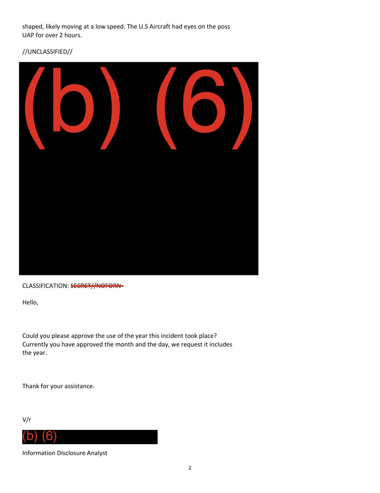

# #062 DOW-UAP-D52：2024-10-31 美軍機觀測 1 個橢圓 / orb 形狀 UAP，低速移動，**單筆觀測長達 2 小時以上**（D 系列最長單一觀測），USD(I&S) 與 **15 AF / DET 1 PAROC**（與 D50 的 12 AF/DET 3 不同的另一個 numbered Air Force）email 來回確認 tearline 可加入「年份」資訊

| 欄位 | 內容 |
|---|---|
| 報告類型 | **Email Correspondence**（D 系列第 3 份 email 對話案件，繼 D50 / D51 之後） |
| 識別碼 | DOW-UAP-D52 |
| **觀測日期** | **2024-10-31（31 OCT 24）** |
| 戰區 / AOR | **NA**（Not Available / 未在 tearline 標示）|
| 觀測者 | **US AIRCRAFT** |
| **持續時間** | **OVER 2 HOURS（超過 2 小時）** ← **D 系列最長單一觀測** |
| 形狀 | **Oval / Orb shaped**（橢圓 / 球形） |
| 速度 | **Low speed**（低速） |
| 高度 | 未指定 |
| 機密層級 | email 整體 **SECRET // NOFORN**；tearline 為 **UNCLASSIFIED** |
| 寄件方 | **Information Disclosure Analyst, USD(I&S)**（與 D50 / D51 同辦公室） |
| 回應方 | **PAROC Intel Data Analysis Technician, 15 AF / DET 1**（與 D50 的 12 AF / DET 3 不同的另一個 numbered Air Force） |
| email 對話日 | 觀測日後（推測 2024-11 至 2026-05 之間，具體日期未明示）|
| 主題 | 申請在 tearline 中加入「年份」資訊（month + day 已批准，請求補加 year）|
| PDF 內部 metadata 標題 | **"DoW-UAP-D30"**（D 系列**第 4 次連續 off-by-22 系統性錯誤**：D49→D27, D50→D28, D51→D29, D52→D30） |
| 公開日 | 2026-05-08 |
| PDF 頁數 | 2 頁 |


## 為什麼 D52 是 D 系列「持續時間最長」的單一 UAP 觀測

前 61 份 D 系列案件持續時間譜系：

| 案件 | 持續時間 |
|---|---|
| D50 # 1（INDOPACOM） | 12 秒 |
| D50 # 2 | 23 秒 |
| D38（波斯灣 SPEAR） | 1 分鐘 |
| D44（Gulf of Aden SPEAR） | 1 分 13 秒 |
| D33（東地中海） | 3 分鐘 |
| D14（東中國海） | 1-2 分鐘 |
| D25（希臘） | 2 分鐘 |
| D51（Pacific Time Zone civilian） | 8 分鐘 |
| D32（敘利亞 plasma）| 45 分鐘（5 次離散事件） |
| **D52（US Aircraft）** | **OVER 2 HOURS** ✨ |

D52 是 D 系列「單一連續觀測 > 1 小時」案件。對應「likely moving at a low speed」描述，意味該 UAP 在 sensor 視野中幾乎靜止或極慢漂浮，機組能維持持續鎖定超過 120 分鐘。

「**The U.S Aircraft had eyes on the poss UAP for over 2 hours**」是極不尋常的觀測模式：
- 對普通 MQ-9 Reaper（loiter 時間 14-27 小時）：可行
- 對 F/A-18 / F-16（航程 1-3 小時）：完成整個 sortie 時間都可能在追蹤
- 對 RC-135 / U-2 / EP-3 偵察機（任務時間 8-12+ 小時）：完全可行

意味本案的觀測平台**有能力長時間留在該物體附近並持續記錄**，**且該物體一直未離開 sensor 範圍**。

## 1. tearline 內容（最終批准版）



```
//UNCLASSIFIED//
31 OCT 24, U.S Aircraft observed a possible UAP. It appeared to be oval/orb
shaped, likely moving at a low speed. The U.S Aircraft had eyes on the poss
UAP for over 2 hours.
//UNCLASSIFIED//
```

譯：

> 「2024-10-31，美軍機觀測到一個可能的 UAP。其外觀呈**橢圓 / 球形**，**很可能以低速移動**。美軍機**對該可能 UAP 持續觀測超過 2 小時**。」

關鍵特徵：
- **31 OCT 24** = 2024-10-31 萬聖節當日
- **U.S Aircraft**（不明軍機平台）
- **Possible UAP**（標註為「可能」，留下不確定性）
- **Oval / Orb shaped**：橢圓或球形，**對應 D 系列 D38（round + black hot solid white）+ D44（round + bright white）+ D32（misshapen ball of white light, plasma）+ D33+D35（seemingly circular）等 orb 家族**
- **Low speed**：低速（呼應 D5 觀測 #1「40 KNOTS 等速」、D33「80 MPH」、D35「30 MPH」）
- **Over 2 hours observation**：D 系列最長

## 2. email 對話揭示「分階段批准 tearline 元素」的解密流程

email 對話展現 D 系列**第 3 種解密協作模式**：

### Email #1（USD(I&S) → 15 AF/DET 1 PAROC，請求年份核可）

> "Hello, Could you please approve the use of the year this incident took place? Currently you have approved the month and the day, we request it includes the year. Thank for your assistance."

> 「您好，可否請您批准使用本事件發生的**年份**？您目前批准的是月份與日期，我們請求加入年份。感謝您的協助。」

意味：
- **此前已有獨立 email 確認 "31 OCT" 可 UNCLASSIFIED 釋出**（只有月+日）
- **這份 email 是補申請「2024」年份**

### Email #2（15 AF/DET 1 PAROC → USD(I&S)，批准）

> "Good morning, Below is the requested additional information (include the year) to the UNCLASS tear line. Let us know if you have any questions, comments or concerns."

> 「早安，下方是您所要求加入年份的 UNCLASS tearline 補充資訊。如有任何問題、評論或疑慮請告知。」

附帶：完整批准版 tearline（即上述 //UNCLASSIFIED// 版本）

## 3. 「PAROC」的多 Numbered Air Force 存在性確認

D52 是 D 系列第 2 份 PAROC 對話文件（前案為 D50）：

| 文件 | PAROC 所屬單位 |
|---|---|
| **D50（2025-04 INDOPACOM）** | **12 AF / DET 3 PAROC Intel Data Analysis Technician Team Lead** |
| **D52（2024-10-31 NA）** | **15 AF / DET 1 PAROC Intel Data Analysis Technician** |

**「PAROC」存在於 12 AF / DET 3 + 15 AF / DET 1 兩個獨立 numbered Air Force 的不同分遣隊中**。意味 PAROC：
- 不是單一單位的部門名稱
- 而是**跨 numbered Air Force 的標準化情報分析職能**
- 每個 numbered Air Force 在 AARO / DOD 解密請求中扮演中介角色

**「12 AF」與「15 AF」差異**：
- **12 AF**（Twelfth Air Force, USAF）：自 2008 起為 **AFSOUTH（Air Forces Southern）**，US Southern Command（USSOUTHCOM）空軍部分，覆蓋拉丁美洲 / 加勒比 / 南美洲
  - DET 3 = Detachment 3，可能負責太平洋戰區情報任務（與 D50 INDOPACOM AOR 對應）
- **15 AF**（Fifteenth Air Force, USAF）：自 2020 重新啟用後為 **Air Forces Indo-Pacific（AFIP）**（與 USINDOPACOM 對應）的支援角色，或為 ACC 內的東半球空中作戰中心
  - DET 1 = Detachment 1，可能負責特定戰區任務

**對應 D 系列觀測**：
- D50 由 12 AF/DET 3 PAROC 處理 → 標記 INDOPACOM AOR
- D52 由 15 AF/DET 1 PAROC 處理 → 標記 NA AOR（未明示）

可能解讀：**多個 numbered Air Force 的 PAROC 分別處理屬於各自管區的 UAP 通報**。但 NA AOR 標記意味本案 AOR 屬於 sensitive 或跨區域，需 USD(I&S) 後續單獨討論。

## 4. 「Likely moving at a low speed」+ 「over 2 hours」的物理意涵

**Orb / oval + low speed + 2 小時** 共構特殊 signature：

1. **氣球候選**：橢圓 / 球形 + 低速 + 長時觀測 = 高空氣象氣球（typical FL250-FL350，速度 20-30 KTS 風速漂浮）。但氣象氣球**通常單向漂浮 + 不會被軍機關注 2 小時**（除非進入敏感空域）。
2. **非氣球候選**：
   - **間諜氣球**（如 2023-02 中國高空偵察氣球橫越美國事件，但那次觀測也僅 8 天）
   - **太陽能無人機 / 高空滯空平台**（如 Loon / Aquila / Zephyr，能在平流層滯留數天）
   - **未知物體**（U-X-X = AATIP 五項可觀察特徵中的「low observability + positive lift」）
3. **持續 2 小時的記錄價值**：軍機**選擇留在該物體附近 2 小時**，意味機組或上級指揮認為該物體**具情報收集價值**。這個決策本身就是分類 signature。

對應 [#055 D42](../055-dow_uap_d42_range_fouler_debrief_japan_2023/report.md) 的「3 個物體 moving amongst each other」與 [#053 D38](../053-dow_uap_d38_range_fouler_debrief_middle_east_may_2020/report.md) 的「erratic movements」截然不同：D52 是**穩定低速、長時間追蹤**型，非機動異常型。

## 5. 觀察

**(1) D52 是 D 系列「最長單一觀測」案件**：> 2 小時持續觀測，超越其他案件最長（D32 45 分鐘離散事件）。對應 sensor 平台必須具備長滯空能力（MQ-9 Reaper 或長航時偵察機）+ 物體本身穩定可追蹤。

**(2) D 系列 PAROC 多單位確認**：D50（12 AF/DET 3）+ D52（15 AF/DET 1）共同確認 PAROC 是跨多 numbered Air Force 的標準化角色。未來 D 系列 email 案件可能還有 16 AF / 1 AF / 18 AF / 25 AF 等其他 numbered Air Force 的 PAROC 出現。

**(3) D 系列「分階段批准 tearline 元素」紀錄**：D52 揭示 tearline 的釋出並非整體批准，而是逐字段分階段審查。本案先批准 "31 OCT"（月+日），再單獨補申請 "2024"（年份）。意味每一個 metadata 元素都可能被視為 classified 處理。

**(4) D 系列「NA」AOR 標記**：D50 用 INDOPACOM，D51 用 Pacific Time Zone，D52 用 NA。「NA」（Not Available）意味該案 AOR 仍未經批准公開。對比 D52 同時批准「2024 年份」釋出，AOR 是更敏感的元素，需要更高層級審查。

**(5) PDF 內部 metadata 「DoW-UAP-D30」是 D 系列第 4 次連續 off-by-22 metadata 錯誤**：D49 → D27, D50 → D28, D51 → D29, **D52 → D30**。**4 次連續、無例外的 22 號偏移**，強烈支持「DOW 上傳系統有 22 號 ID mapping bug」的假設。可能在 D 系列 D-列表中，前 22 個 ID（D1-D26）為已釋出案件，後續 D27+ 為新釋出，DOW PDF metadata 系統將後續 D 編號的 PDF 自動填入 D-22 編號（即映射到舊釋出 D 編號）。

**(6) 2024-10-31 萬聖節 UAP 觀測**：日期巧合萬聖節，但這純粹是時間巧合，**對 D 系列分析無意義**。然而從文化角度，這個日期確保 D52 在 UAP 社群中會被特別關注。

## 6. 跨檔案連結

- **[#060 D50 INDOPACOM Email 2025-04](../060-dow_uap_d50_email_correspondence_indopacom_april_2025/report.md)**：D 系列前一份 PAROC email 對話，由 12 AF / DET 3 處理。
- **[#061 D51 Pacific Time Zone Email 2023-03](../061-dow_uap_d51_email_correspondence_pacific_time_zone_march_2023/report.md)**：D 系列前一份 email 對話，由 AFOSI 處理（非 PAROC 路徑）。
- **PDF metadata 系統性 off-by-22 錯誤**：D49 → D27, D50 → D28, D51 → D29, **D52 → D30**（連續 4 次）。

## 7. 來源

- 原始檔案：[U.S. Department of War — DOW-UAP-D52, Email Correspondance, NA, August 2024](https://www.war.gov/UFO/#DOW-UAP-D52,%20Email%20Correspondance,%20NA,%20August%202024)
- PDF 直接下載：`https://www.war.gov/medialink/ufo/release_1/dow-uap-d52-email-correspondance-na-august-2024.pdf`
- 2 頁，email 整體 SECRET // NOFORN，tearline UNCLASSIFIED
- 觀測日期：2024-10-31
- 寄件方：USD(I&S) Information Disclosure Analyst
- 回應方：15 AF / DET 1 PAROC Intel Data Analysis Technician
- 公開日：2026-05-08
- 注意：War.gov 標題 "Email Correspondance, NA, August 2024" 與 tearline 中明確的「31 OCT 24」日期不符（標題寫 August 8 月，實際觀測為 October 10 月）。可能對應 email 對話起始月份（8 月）vs. 觀測月份（10 月）的差異，或 DOW 標題填寫錯誤。標題拼字 "Correspondance" 為錯字（正確拼法 Correspondence），是 DOW 標題單字拼錯誤。
- PDF 內部 metadata 標題誤標為 "DoW-UAP-D30"，是 D 系列第 4 次連續 off-by-22 metadata 錯誤。
