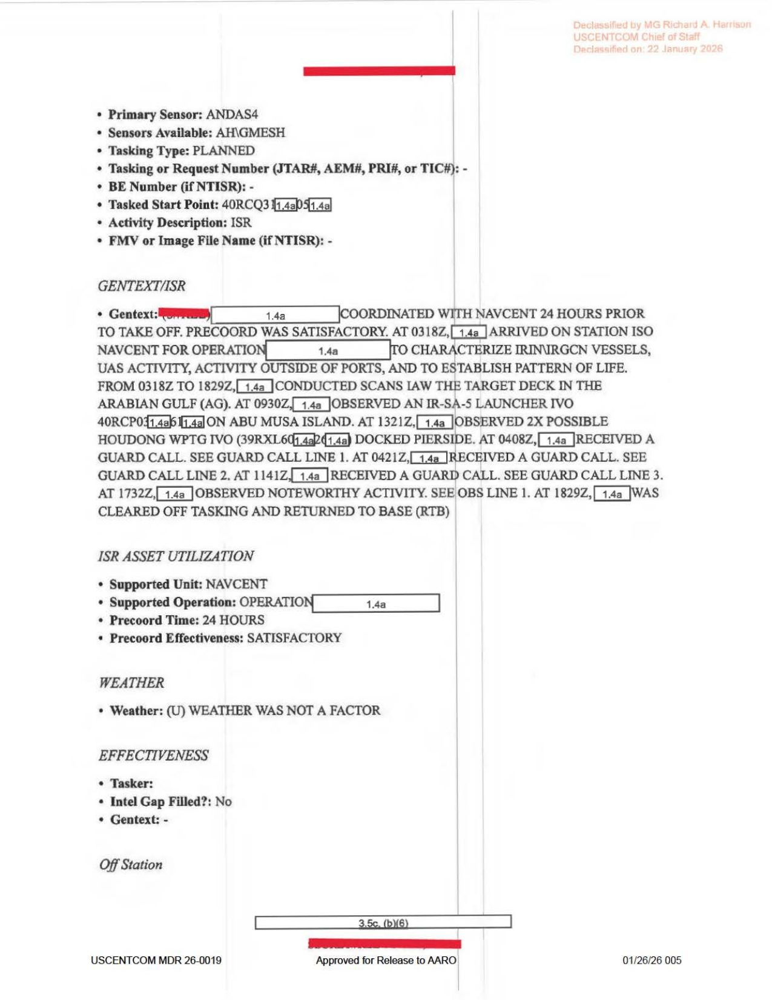

# #071 DOW-UAP-D62：3 次伊朗喊話、2 次失聯、然後出現 UAP

2020-09-16，482 ATKS / 432 AEW 的 MQ-9 Reaper 在荷莫茲海峽上空執行又一次 21 小時 NAVCENT 支援任務。當天的事件密度比 D60、D61 都高：

| 時刻 (UTC, 9/16) | 事件 |
|---|---|
| 04:08Z | 伊朗防空 GUARD CALL #1 |
| 04:21Z | 伊朗防空 GUARD CALL #2（13 分鐘後）|
| 11:41Z | 伊朗防空 GUARD CALL #3（在 FL040 = 4,000 英呎低空時被喊話）|
| 12:48Z - 12:59Z | LOST LINK #1（11 分鐘 EMI，原因 UNKNOWN，1.4g 遮蔽）|
| 14:14Z - 14:41Z | LOST LINK #2（27 分鐘 EMI，原因 UNKNOWN，1.4g 遮蔽）|
| 17:32Z | 觀測 1 個 UAP（IVO 39RVM51[?]70[?]）|

3 次伊朗喊話、2 次共 38 分鐘的原因不明 EMI、1 個 UAP，同一架 MQ-9 同一個任務日內全部發生。

## 為什麼 FL040 那麼引人注意

第三次喊話 11:41Z 那次，MQ-9 高度只有 FL040 = 4,000 英呎。

MQ-9 Reaper 在戰區 ISR 任務的巡航高度通常是 FL180 - FL250（18,000 - 25,000 英呎）。在 4,000 英呎飛行意味：

1. 任務需要低空特寫：可能在拍攝伊朗船舶/港口/機場的高解析影像
2. 被迫下降：高層雲遮、或 sensor 需要更近距離
3. 受到威脅或干擾：高高度資料鏈中斷，操作員把無人機壓低尋找視距 backup link

FL040 對 MQ-9 是脆弱的高度，伊朗的 MANPADS（單兵防空飛彈）、輕型防空砲、空對空飛彈都能覆蓋。報告寫「PROFESSIONAL」喊話加「STANDARD CALL / STANDARD RESPONSE」，意味伊朗沒有開火，但 MQ-9 處於可被攻擊的高度。

## 1.4(g) 是什麼

EMI 兩次事件都標示：

- Affected System：[1.4g 遮蔽]
- Frequency Affected：[1.4g 遮蔽]
- Type of EMI：UNKNOWN

美國國安檔案 EO 13526 的分類條款：

- 1.4(a)：軍事計畫/武器系統/作戰
- 1.4(c)：情報來源、方法、加密
- 1.4(d)：外交關係
- 1.4(g)：基礎設施或保護美國國家安全資產的脆弱性

1.4(g) 用來遮 EMI 詳情，意味「告訴你 MQ-9 哪個系統被哪個頻率干擾」會洩漏美方的對抗策略。這兩次 EMI 不像雷暴雲或太陽閃焰那樣的環境干擾，比較像針對性的電子作用。

## 「LOST LINK TO POSSIBLE」是關鍵

兩次 EMI 的 gentext 都寫：

> AT [time]Z, [1.4a] EXPERIENCED LOST LINK TO POSSIBLE [1.4g] [1.4a]. REGAINED LINK AT [time]Z.

「LOST LINK TO POSSIBLE [遮蔽]」這個介系詞片語暗示操作員當下判斷失聯是由某個「可能的」來源造成，但對應的系統或對手名稱被 1.4g 遮掉。

可能的補上：

1. TO POSSIBLE IRANIAN JAMMING（最直觀解讀）
2. TO POSSIBLE EMI FROM UAP（UAP-related signature）
3. TO POSSIBLE SATCOM DEGRADATION FROM SPACE WEATHER

如果是選項 1（伊朗電子戰），1.4g 的意義是「告訴你伊朗具備這種能力會暴露 US 對抗能力」。如果是選項 2（UAP），1.4g 的意義是「告訴你 UAP 有這種能力會暴露 US 知道這個 signature」。

報告選用 1.4g 而不是更通用的 1.4a，意味遮的是對抗策略，不是事件本身。

## UAP 出現在 EMI 結束 2 小時 51 分後

時間軸的時序值得注意：

- 12:59Z：Lost Link #1 結束
- 14:41Z：Lost Link #2 結束
- 17:32Z：觀測 UAP

最後一次失聯結束 2 小時 51 分鐘後才看到 UAP。兩個事件並非同步。

如果 EMI 直接由 UAP 造成，UAP 應該出現在 EMI 期間或剛結束時。但 UAP 出現在很久之後，這支持「EMI 與 UAP 是獨立事件」的解讀。也就是說，伊朗電子戰跟偶發 UAP 觀測剛好疊加在同一個 21 小時任務裡。

不過拉回整個 D 系列，D58 也是電子戰加 UAP 同時出現，D62 也是。UAP 環境跟 EW 環境在 USCENTCOM 戰區共存是有經驗證據的事實。

## 報告比 D60 / D61 多 2 頁

D60 是 6 頁、D61 是 7 頁、D62 是 9 頁。

多出的 2 頁主要是 EMI 兩個事件的詳細欄位（JSIR ID、Type、Duration、Mission Impact、Affected System、Frequency、Gentext）。每個 EMI 事件填一個 9 欄區塊。

JSIR（Joint Spectrum Interference Resolution）是美軍頻譜干擾通報系統，每個事件有 ID 編號可追蹤：

- JSIR ID 330412（EMI #1，9/16 12:48Z）
- JSIR ID 330414（EMI #2，9/16 14:14Z）

兩個 ID 連號（412 → 414），意味 9/16 那天 USCENTCOM 戰區還有 ID 413 在別處發生。當天戰區的電子干擾事件不只 D62 這一架 MQ-9。

## 影像規格與來源

| 屬性 | 內容 |
|---|---|
| 格式 | PDF（9 頁 MISREP 表格） |
| 影像化解析度 | 150 DPI 轉 JPEG |
| 來源 | USCENTCOM，編號 MDR 26-0019 |
| 原始機密等級 | SECRET（caveats 完全遮蔽）|
| 解密日期（原訂） | 2045-03-01 |
| 解密日期（實際 AARO 釋出） | 2026-01-22 |
| 解密官 | MG Richard A. Harrison, USCENTCOM Chief of Staff |
| AARO 釋出 | Approved for Release to AARO |
| 公開日 | 2026-05-08 |
| **MISREP 編號** | **4782130** |
| **事件時間** | **2020-09-16**（21 小時任務） |
| **事件地點** | **荷莫茲海峽**（MGRS 39RVM 至 40RCP）|
| **觀測平台** | **MQ-9 Reaper（482 ATKS, 432 AEW）** |
| **任務總時長** | **20.9 小時** |
| **UAP 觀測時刻** | **17:32Z** |
| **UAP 位置** | **MGRS 39RVM51[?]70[?]**（MQ-9 同一格內）|
| **UAP 描述** | **UAP**（無進一步描述） |
| **觀測方法** | **FMV** |
| **EMI 事件 1** | **12:48Z-12:59Z（11 分），JSIR ID 330412** |
| **EMI 事件 2** | **14:14Z-14:41Z（27 分），JSIR ID 330414** |
| **總 EMI 失聯時間** | **38 分鐘** |
| **伊朗喊話次數** | **3 次**（04:08Z, 04:21Z, 11:41Z）|
| **最低高度** | **FL040 = 4,000 英呎**（11:41Z 被喊話時） |
| 直接下載 | <https://www.war.gov/medialink/ufo/release_1/dow-uap-d62-mission-report-strait-of-hormuz-september-2020.pdf> |
| 官方 portal | [war.gov/UFO/#DOW-UAP-D62](https://www.war.gov/UFO/#DOW-UAP-D62,%20Mission%20Report,%20Strait%20of%20Hormuz,%20September%202020) |

## 相關案件

- [#070 D61 阿拉伯灣 2020-08-27](../070-dow_uap_d61_mission_report_persian_gulf_aug_2020/report.md)：20 天前同單位的 UAP FORMATION。
- [#069 D60 阿拉伯灣 2020-08-08](../069-dow_uap_d60_mission_report_persian_gulf_aug_2020/report.md)：1 個月前同單位的 UAP TRANSITTING。
- [#067 D58 NA 2020-10](../067-dow_uap_d58_range_fouler_na_oct_2020/report.md)：1 個月後 F-15E + Noise Jamming 案，**D 系列中另一份明確涉及電子戰的紀錄**。
