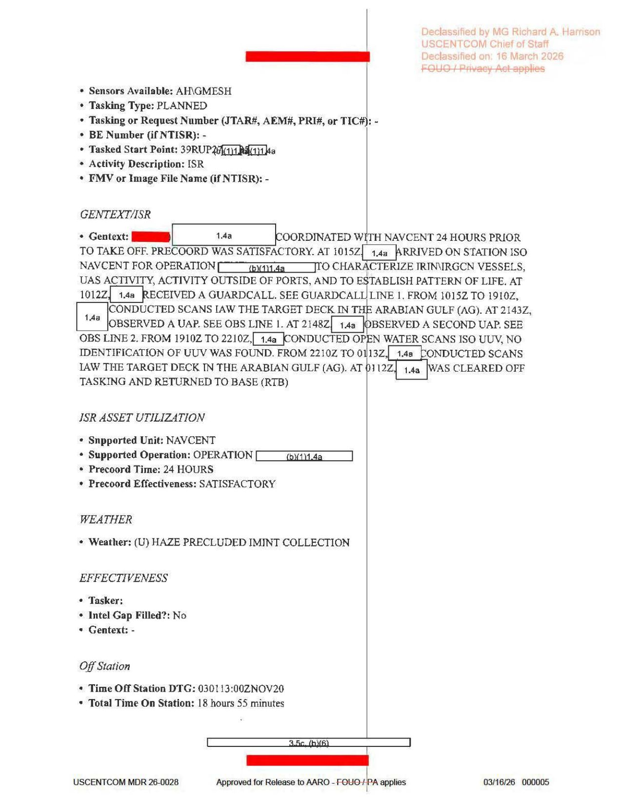

# #073 DOW-UAP-D64：UUV 開放水域掃描的 5 分鐘空檔，2 個 UAP 出現

2020-11-02，482 ATKS / 432 AEW 的 MQ-9 Reaper 又一次從 OKAS 起飛，20 小時 42 分鐘任務。這次的任務 ATO 是 EX（不是 D62/D63 的 DR），主要差別是任務內容增加了一段「開放水域掃描，搜尋 UUV」。在這段水下無人載具搜索期間，MQ-9 觀測到 2 個 UAP，間隔 5 分鐘。

D63 那次是 21 小時、5 次伊朗喊話、1 個 UAP。D64 把喊話次數壓回 1 次，UAP 變成 2 個，新增了 UUV 任務段。

## 21 小時時間軸

| 時刻 (UTC, 11-02) | 事件 |
|---|---|
| 06:08Z | 起飛 OKAS |
| 06:18Z | 從 LRE 交接 |
| 10:12Z | 1 次伊朗 GUARD CALL（FL210, M068 heading, Professional tone）|
| 10:15Z | 抵達 ISO NAVCENT station（IVO 阿拉伯灣 + 荷莫茲 + 阿曼灣）|
| 10:15Z - 19:10Z | Target deck scans（Arabian Gulf, 7 小時 55 分鐘）|
| 19:10Z - 22:10Z | **OPEN WATER SCANS ISO UUV**（3 小時，no identification of UUV was found）|
| 21:43Z | **觀測 UAP #1**（IVO 39RWK58, MQ-9 在 FL220 / 105 KIAS / 110T 航向）|
| 21:48Z | **觀測 UAP #2**（IVO 39RWK60，traveling NW，MQ-9 同 FL220 / 107 KIAS）|
| 22:10Z - 01:13Z | Target deck scans 第二段 |
| 01:13Z (11-03) | Cleared off tasking → RTB |
| 02:50Z | 降落 OKAS |
| 03:00Z | Engine shutdown |

Total Mission Time: 20 小時 42 分鐘。MISREP 編號 5039166。

## UUV 開放水域掃描任務段

D 系列 70 多份 MISREP 中，D64 是有明確寫出「OPEN WATER SCANS ISO UUV」任務描述的一份。

UUV 是 Unmanned Underwater Vehicle（無人水下載具）。MQ-9 從 FL220 高空搜尋 UUV 看起來矛盾，因為 UUV 在水面下，MQ-9 的 EO/IR 加 ANDAS4 SAR 無法穿透水。但實務上，MQ-9 搜尋 UUV 是看：

1. **水面拖纜或浮標**：UUV 與母船之間的通訊浮標
2. **航跡或泡沫**：淺水區大型 UUV 移動時的水面擾動
3. **母船活動 pattern**：可能釋放 UUV 的伊朗船舶
4. **取回作業**：UUV 上浮被 IRGCN 快艇接走

2020 年是伊朗 UUV 能力快速發展的時間點。伊朗 2020 年公佈過 Fateh 級柴電潛艇加多型小型 UUV，可能用於水雷布放、情資蒐集、或攻擊型 USV/UUV。MQ-9 在阿拉伯灣專門掃水面的 3 小時段，是 NAVCENT 對抗伊朗潛在水下威脅的偵察行動。

最關鍵的是，MQ-9 在這段時間沒有找到任何 UUV，卻找到了 2 個 UAP。

## 兩個 UAP 觀測：5 分鐘間隔

| 屬性 | UAP #1 | UAP #2 |
|---|---|---|
| 時刻 (UTC) | 21:43Z | 21:48Z |
| MQ-9 位置 | 39RWK7?[1.4a]?? | 39RWK6?[1.4a]?? |
| MQ-9 高度 | FL220 | FL220 |
| MQ-9 速度 | 105 KIAS | 107 KIAS |
| MQ-9 航向 | 110 T | 110 T |
| UAP 位置 | 39RWK58 | 39RWK60 |
| 描述 | "1X UNIDENTIFIED AERIAL PHENOMENON" + altitude unknown + bearing 080 T | "AN ADDITIONAL UAP TRAVELING NW" |
| Method | FMV | FMV |

兩次 MQ-9 都在 FL220、相近航向、相近座標格 39RWK6-7 內，MQ-9 自身只移動了 5 分鐘 × 107 KIAS ≈ 9 海里。MGRS 格 39RWK58 與 39RWK60 在阿拉伯灣中部、伊朗海岸附近。

UAP #1 給出 bearing 080T（東向），altitude unknown。UAP #2 給出 traveling NW（西北向）。

兩個方向相差 130 度，是兩個不同物體，不是同一個 UAP 5 分鐘後被重新觀測。這呼應 [#070 D61](../070-dow_uap_d61_mission_report_persian_gulf_aug_2020/report.md) 的 FORMATION 加 [#047 D3](../047-dow_uap_d3_mission_report_arabian_gulf_2020/report.md) 的 4 個 UAP（含 2 個 side-by-side），D 系列「同戰區同任務段多個 UAP」的累積證據。

## 為什麼 D64 換到 ACC + 379 AEW + AH_GMESH_VORTEX

D62 / D63 的 MAJCOM 都是 AFCENT。D64 改成 ACC（Air Combat Command），approver 列在 379 AEW 而不是 432 AEW，POC 在 12 AF PAROC 而不是同部署單位。

這幾條暗示 D64 的任務鏈條和前兩份不太一樣：

1. 379 AEW 駐地是 Al Udeid Air Base（卡達），是 USCENTCOM 戰區主基地，與 OKAS 不同
2. 12 AF PAROC 是 PACAF / ACC 的 Numbered Air Force，理論上不該管中東任務
3. ACC MAJCOM 而不是 AFCENT 意味這架 MQ-9 可能是 CONUS 直接控制的 reach-back 任務

加上 Additional Avionics 換成 AH_GMESH_VORTEX（D62/D63 用 AH-BS_WARIO），D64 的 sensor suite 配置不一樣。AH-BS_WARIO 與 AH_GMESH_VORTEX 都是 MQ-9 的 SIGINT 或通訊中繼模組，VORTEX 系列較新（2018 年後部署），具備網狀通訊能力。

這架 MQ-9 看起來是「CONUS reach-back 加增強 SIGINT 載荷加 UUV 搜索目標」的特化配置，與 D62/D63 的 NAVCENT 標準支援任務不同。

## D62 + D63 + D64 三份對照

| 項目 | D62（09-16）| D63（10-01/02）| D64（11-02）|
|---|---|---|---|
| MISREP 編號 | 4782130 | 4871281 | 5039166 |
| ATO Code | DR | DR | EX |
| 單位 | 482 ATKS / 432 AEW | 482 ATKS / 432 AEW | 482 ATKS / 379 AEW approver |
| MAJCOM | AFCENT | AFCENT | ACC |
| POC PAROC | 不適用 | PAROC | 12 AF PAROC |
| Additional Avionics | AH-BS_WARIO | AH-BS_WARIO | AH_GMESH_VORTEX |
| 任務 ATO | DR | DR | EX |
| 伊朗喊話 | 3 | 5 | 1 |
| 喊話 tone | Pro × 3 | Pro × 3 + Dir × 2 | Pro × 1（FL210）|
| EMI 事件 | 2 (38 min) | 0 | 0 |
| 特殊任務段 | 不適用 | 不適用 | UUV 開放水域掃描 3 hr |
| UAP 數量 | 1 | 1 | 2 |
| UAP 時刻 | 17:32Z | 18:29Z | 21:43Z + 21:48Z（5 min 間隔）|
| Weather | 未列 | HEAVY HAZE | HAZE PRECLUDED IMINT COLLECTION |

霾再度妨礙影像收集。三份報告連續顯示 2020 年秋季阿拉伯灣 ISR 環境受霾困擾，UAP 觀測證據強度因此受影響。

## UUV 任務與 UAP 觀測的時間重疊不是巧合

最值得記住的是：

> 19:10Z - 22:10Z = OPEN WATER SCANS ISO UUV
> 21:43Z + 21:48Z = 2 UAP 觀測

兩個 UAP 出現在 UUV 搜索段的最後 25 分鐘，UUV 沒找到，UAP 卻被連續觀測到 2 次。

幾種可能解讀。一是巧合，MQ-9 sensor focused 在水面意味著它正在仔細看，所以更容易發現任何空中異常。二是誘餌或干擾，如果 UAP 確實是伊朗或他方資產，可能是為了讓 MQ-9 從 UUV 搜索轉移注意力。三是共生 signature，UAP 與 UUV 同類別「無人化威脅」，可能來自同一作業。四是觀測偏差，D 系列其他 NAVCENT MQ-9 任務也都在掃水面，但只有 D64 同時有 UUV 任務段，這是這個時間重疊第一次被記錄。

報告本身沒下任何結論，只是並列事實。MQ-9 在 22:10Z 結束 UUV 段、回到 target deck scans，然後 RTB。

## 影像規格與來源

| 屬性 | 內容 |
|---|---|
| 格式 | PDF（7 頁 MISREP 表格） |
| 影像化解析度 | 150 DPI 轉 JPEG |
| 來源 | USCENTCOM，編號 MDR 26-0028 |
| 原始機密等級 | SECRET（caveats 完全遮蔽）|
| 解密日期（原訂） | 2045-03-01 |
| 解密日期（實際 AARO 釋出） | 2026-03-16 |
| 解密官 | MG Richard A. Harrison, USCENTCOM Chief of Staff |
| AARO 釋出 | Approved for Release to AARO |
| 公開日 | 2026-05-08 |
| MISREP 編號 | **5039166** |
| 事件時間 | 2020-11-02（20 小時 42 分鐘任務）|
| 事件地點 | 阿拉伯灣、荷莫茲、阿曼灣（MGRS 39RWK / 39RUP / 39RUN 區）|
| 觀測平台 | MQ-9 Reaper（482 ATKS, 379 AEW approver） |
| MAJCOM | ACC（與 D62/D63 的 AFCENT 不同）|
| ATO Code | EX |
| 任務類型 | AREC（Aerial Reconnaissance）|
| Primary Sensor | ANDAS4 + AH_GMESH_VORTEX 額外航電（D62/D63 用 AH-BS_WARIO）|
| 特殊任務段 | OPEN WATER SCANS ISO UUV（19:10Z - 22:10Z，no UUV identification） |
| UAP #1 時刻 | **21:43Z**（FL220, 105 KIAS, bearing 080T）|
| UAP #2 時刻 | **21:48Z**（5 分鐘後，FL220, 107 KIAS, traveling NW）|
| UAP 觀測方法 | FMV |
| 伊朗喊話次數 | 1 次（10:12Z，Professional，FL210）|
| 總任務時數 | 20.42 mission hours（18.55 IMINT hours / 1 IMINT tasking prosecuted）|
| Weather | HAZE PRECLUDED IMINT COLLECTION |
| 直接下載 | <https://www.war.gov/medialink/ufo/release_1/dow-uap-d64-mission-report-iran-november-2020.pdf> |
| 官方 portal | [war.gov/UFO/#DOW-UAP-D64](https://www.war.gov/UFO/#DOW-UAP-D64,%20Mission%20Report,%20Iran,%20November%202020) |

## 相關案件

- [#072 D63 荷莫茲 2020-10-01](../072-dow_uap_d63_mission_report_strait_of_hormuz_oct_2020/report.md)：32 天前同 MQ-9 / 482 ATKS、5 次伊朗喊話、Abu Musa Island ATR 72-500 觀測。
- [#071 D62 荷莫茲 2020-09-16](../071-dow_uap_d62_mission_report_strait_of_hormuz_sep_2020/report.md)：47 天前同 482 ATKS MQ-9、2 次 EMI 失聯加 1 UAP。
- [#070 D61 阿拉伯灣 2020-08-27](../070-dow_uap_d61_mission_report_persian_gulf_aug_2020/report.md)：67 天前同單位、FORMATION 多個 UAP 案件。
- [#047 D3 阿拉伯灣 2020](../047-dow_uap_d3_mission_report_arabian_gulf_2020/report.md)：同 AOR / AFCENT MQ-9、27 秒內 4 個 UAP，短間隔多 UAP 觀測的另一個案例。
