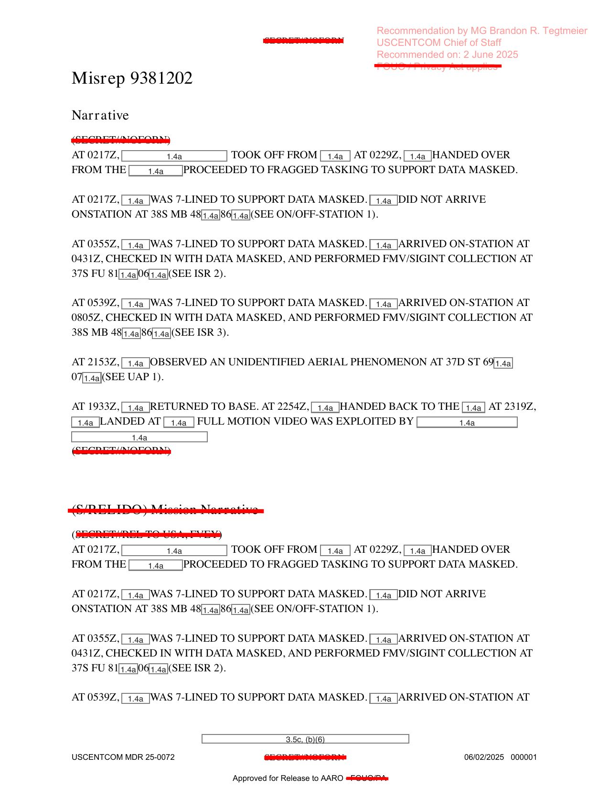

# #076 DOW-UAP-D74：VEO 監控 11 小時尾段、UAP 從南方 424 KN「彈跳球」掠過

2023-11-09 那天，USAF 一架 ISR 機在敘利亞執行 OP INHERENT RESOLVE 反 ISIS 監視任務，全天盯住一棟住宅與一輛帶後掛備胎的白色 SUV，從 08:05Z 看到 19:33Z 共 11 小時 28 分。任務結束 RTB 的路上，21:53Z 機組看到「1 個 probable HC UAP shaped as a bouncy ball」從南方接近、降低高度、安全擦肩而過，以 424 節等速持續 7 分鐘才脫離視距。

這份 MISREP 把完整 41 欄 UAP 資料卡格式填好填滿，shape / state / propulsion / signatures / advanced capabilities / first 與 last coordinates / radius / kinetic altitude 都有值。

## 任務時間軸（OP INHERENT RESOLVE 反 ISIS / VEO）

| 時刻 (UTC, 11-09) | 事件 |
|---|---|
| 02:17Z | 起飛 |
| 02:29Z | 從 LRE 交接 |
| 02:17Z - 03:55Z | 7-LINED to support DATA MASKED（前段任務，未抵達 station）|
| 03:55Z | 抵達 ON-STATION at 37S FU 81[?]00[?]（ISR 2）|
| 05:39Z | 7-LINED, 抵達 ON-STATION at 38S MB 48[?]86[?]（ISR 3）|
| 08:05Z | 抵達 building 觀測：白色 SUV 帶後掛備胎，停在建築北側，評估為 PROB VOI |
| 08:05Z - 15:52Z | 6X stop follow-on PROB VOI 加 PROB POI（6 次跟監）|
| 09:26Z | PROB POI 與 1 個 ADM 從建築 S 側出來進入 PROB VOI 前左右 |
| 09:39Z | RECEIVED PROB MATCH 給 1X ADM |
| 16:32Z | LOST PID → RESET BACK to building，觀測 NO EEI related activity |
| 17:19Z | 2X 先前觀測到的 ADMs 評估為 POSS IMINT MATCH to POI |
| 19:33Z | RTB without additional EEI to report |
| 21:53Z | **UAP 首次接觸**（while RTB）|
| 22:54Z | Handed back |
| 23:19Z | Landed |

Total Time On Station: 11 小時 28 分鐘。MISREP 編號 9381202。

ISR Activity Description 是 TARGET DEVELOPMENT。Global Campaign Plan 是 GCP - VEO（violent extremist group，意指 ISIS 殘餘或敘利亞境內反美武裝團體）。

## UAP 41 欄完整資料卡

D74 用了完整 41 欄 UAP 資料卡格式，把所有欄位列出：

### Encounter 基本資料

| 欄位 | 值 |
|---|---|
| Initial Contact DTG | **092153:00Z NOV 23**（2023-11-09 21:53Z）|
| UAP Event Type | UAP Incident |
| UAP Event Serial Number | 092153ZNOV2023-CENTCOM |
| MDS Type / Asset Type（己方）| 1.4a, 1.4g 遮蔽 |
| Friendly Aircraft Location | 37S ET 34[1.4a]09[1.4a] |
| Friendly Aircraft Trajectory | SOUTHEAST |
| Friendly Aircraft Altitude/Depth | 1.4g 遮蔽 |
| First Coordinate | 37DST69[1.4a]7[1.4a] |
| First Seen Radius | 5 |
| Last Coordinate | 37SFT28[1.4a]3[1.4a] |
| Last Seen Radius | 10 |
| Kinetic Altitude Accuracy | Estimated |
| Kinetic Altitude | 170 |
| Kinetic Velocity Accuracy | Estimated |
| Kinetic Velocity | **424 KN**（424 節 = 488 mph）|

### UAP 物理特性

| 欄位 | 值 |
|---|---|
| UAP Maneuverability Observations | NONE（無機動）|
| UAP Response to Observer Actions | NO |
| UAP Physical State | Solid（固體狀態）|
| Number of UAP Sighted | 未填 |
| UAP Propulsion Means | UNK（未知）|
| UAP Payload | 未填 |
| UAP Under Intelligent Control | NO（非智慧控制）|
| UAP Signatures | 1.4a 遮蔽 |
| UAP Advanced Capabilities And/Or Materials | **YES, TRAVELED ~424KN CONSISTENTLY FOR AT LEAST 7MINS IN THE SHAPE OF A BOUNCY BALL** |
| UAP RF Frequency | NONE |
| UAP RF Duration | N/A |
| Observer Assessment of UAP | Benign（無威脅）|

### 互動與後果

| 欄位 | 值 |
|---|---|
| UAP Effects on Persons | NO |
| UAP Objects/Material Recovered | NO |
| UAP Effects on Equipment | NONE |
| UAP Reaction to Observation / Interrogation / Engagement | NO |
| UAP Anomalous Characteristics / Behaviors | N/A |
| Observer Engagement of UAP | NO |

## GENTEXT 全文逐字保留

> WHILE RTB AT 2153Z, [1.4a] OBSERVED 1X PROB HC UAP SHAPED AS A BOUNCY BALL COME FROM THE SOUTH AT NEAR CO-ALT. [1.4a] OBSERVED THE PROB UAP DROP ALTITUDE AND SAFELY PASS THEIR AIRCRAFT WHILE CONSISTANTLY MAINTAINING ~424KN. AFTER 7MIN OF WATCHING, THE PROB UAP BECAME OUT OF RANGE AND [1.4a] CARRIED ON THEIR RTB. NO EMISSIONS CAME FROM THE PROB UAP, UAP WAS NOT CONSIDERED A THREAT TO THE AIRCRAFT OR PUBLIC SAFETY, AND THE UAP HAD NO EFFECTS ON THE AIRCREW.

5 個動詞片語勾勒事件：

1. COME FROM THE SOUTH AT NEAR CO-ALT：UAP 從南方接近，幾乎同高度
2. DROP ALTITUDE：下降高度
3. SAFELY PASS THEIR AIRCRAFT：安全通過
4. CONSISTANTLY MAINTAINING ~424KN：維持 424 節（≈ 0.6 Mach）
5. OUT OF RANGE：脫離視距

「PROB HC UAP」這個縮寫 D 系列少見。HC 在 MISREP / SPEAR 命名約定中可能對應 Hostile Craft（敵對載具）或 High-Confidence（高置信度）。「PROB」（probable）加「HC」加「UAP」三層描述，意味分析者建議這是可能來自敵方的高置信度 UAP 觀測。

## "Bouncy Ball" 的形狀為什麼重要

「形似彈跳球」的 UAP 描述在 D 系列出現過 3 次：

- [#075 D7](../075-dow_uap_d7_mission_report_arabian_gulf_2020/report.md)：LOOKS LIKE A BALLOON, SIMILAR TO PREVIOUSLY REPORTED UAP FROM 48FW（2020 阿拉伯灣，31,000 ft，wind-driven）
- [#053 D38](../053-dow_uap_d38_range_fouler_debrief_middle_east_may_2020/report.md)：ROUND 加 ATFLIR solid white（2020-05-14 波斯灣 F/A-18）
- D74：BOUNCY BALL 加 424 KN consistent 加 drops altitude 加 7 min

「Bouncy Ball」與「Balloon」是不同物理對應：

| 形狀詞 | 含義 |
|---|---|
| Balloon | 柔軟充氣物，wind-driven，零自主推進 |
| Bouncy Ball | 彈性固體，可能 self-propelled |
| Sphere / Orb | 中性描述，未指定材質 |
| Round | 形狀但未指定維度 |

D74 自填表「Physical State: Solid」加「Propulsion: UNK」加「Maneuverability: NONE」與「Advanced Capabilities: YES, 424KN consistently」形成內部矛盾。solid 物體保持 424 KN 持續 7 分鐘不可能沒有推進，要嘛是 ballistic（重力加投擲動能），要嘛是 propulsion 但 sensor 看不到。

「Drop altitude and safely pass」這個動作意味 UAP 不是被動風飄，是主動降低高度繞過己方飛機。但表填「Maneuverability Observations: NONE」加「Intelligent Control: NO」。分析者選擇用保守的方式記錄，把可觀察到的機動行為歸為「pass」而不是「manoeuver」。

## OP INHERENT RESOLVE 的 VEO 監視脈絡

D74 不是純粹 UAP encounter，是反 ISIS / 反 VEO 監視任務的副產品。整個 11 小時 28 分鐘任務的主要目標：

- 觀察 white SUV with rear-mounted tire（typical Daesh / VEO 載具特徵）
- 跟監 PROB POI（Person of Interest）加 ADM（Adult Male / armed individual）
- 6 次 stop follow-on（連續跟拍）
- 等待 EEI（Essential Elements of Information）出現

任務結束 RTB 過程中才出現 UAP。這個時間序的意涵：UAP 不是任務目標，sensor 操作員在 RTB 時被 UAP 經過視野觸發觀察；無預警出現，與其他 D 系列預先 cued by radar / SIGINT 的觀測不同；與 VEO 活動無關，UAP 從南方來、無 emission、無 effects on equipment，看不出與地面 VEO 活動有任何因果關聯。

## 解密路徑：MDR 25-0072

D74 的 metadata 揭示 USCENTCOM 在敘利亞戰區的審查節奏：

- MDR 編號: 25-0072（2025 財年第 72 號 MDR 案件）
- 解密官: MG Brandon R. Tegtmeier, USCENTCOM Chief of Staff
- Recommended on: 2025-06-02
- Operation: INHERENT RESOLVE
- Declassification Date（原訂）: 2048-11-09

D74 的解密推薦者是 Tegtmeier，與 D62 / D63 / D64 / D65 的 Harrison（MDR 26-0028 批次）不同。MDR 25-0072 是 2025 財年（更早一年），D74 較早送審，可能因為含完整 41 欄資料卡、UAP signatures 可清楚記錄、無敏感對手關聯，所以較快放行。

## 影像規格與來源

| 屬性 | 內容 |
|---|---|
| 格式 | PDF（10 頁 MISREP 表格，含 41 欄 UAP 資料卡）|
| 影像化解析度 | 150 DPI 轉 JPEG |
| 來源 | USCENTCOM，編號 MDR 25-0072 |
| 原始機密等級 | SECRET // NOFORN |
| 解密日期（原訂） | 2048-11-09 |
| 解密日期（推薦）| 2025-06-02 |
| 解密官 | MG Brandon R. Tegtmeier, USCENTCOM Chief of Staff |
| AARO 釋出 | Approved for Release to AARO |
| 公開日 | 2026-05-08 |
| MISREP 編號 | **9381202** |
| 事件時間 | 2023-11-09 21:53Z（UAP first contact）|
| 任務時段 | 2023-11-09 02:17Z 起飛 → 23:19Z 降落（21 小時 02 分）|
| 任務 On Station | 11 小時 28 分鐘 |
| 事件地點 | 敘利亞（MGRS 37S / 38S 區）|
| 觀測平台 | 1.4a/1.4g 遮蔽（推測 MQ-9 或 SIGINT/ISR 載具）|
| 支援 Operation | INHERENT RESOLVE（反 ISIS）|
| GCP | VEO（violent extremist group）|
| 任務類型 | ISR 加 TARGET DEVELOPMENT |
| Primary Sensor | FMV |
| UAP 描述 | **PROB HC UAP shaped as a BOUNCY BALL** |
| UAP 速度 | **~424 KN**（≈ 488 mph）|
| UAP 高度 | Kinetic Altitude 170（單位未明示，可能 hundreds of feet）|
| UAP 持續時間 | 7 分鐘 watching before out of range |
| UAP 機動 | DROP ALTITUDE AND SAFELY PASS the aircraft |
| UAP Maneuverability | NONE（observer 自評）|
| UAP Physical State | Solid |
| UAP Propulsion | UNK |
| UAP Intelligent Control | NO |
| UAP RF Emissions | NONE |
| Observer Assessment | Benign |
| First Coordinate | 37DST69[?]7[?]（radius 5） |
| Last Coordinate | 37SFT28[?]3[?]（radius 10） |
| Friendly Aircraft Trajectory | SOUTHEAST |
| Weather | CLEAR WX（晴朗）|
| 直接下載 | <https://www.war.gov/medialink/ufo/release_1/dow-uap-d74-mission-report-syria-november-2023.pdf> |
| 官方 portal | [war.gov/UFO/#DOW-UAP-D74](https://www.war.gov/UFO/#DOW-UAP-D74,%20Mission%20Report,%20Syria,%20November%202023) |

## 相關案件

- [#075 D7 阿拉伯灣 2020](../075-dow_uap_d7_mission_report_arabian_gulf_2020/report.md)：Balloon-shaped UAP 加 31,000 ft 加 wind-driven，是 D74「bouncy ball」shape 的前期案例。
- [#053 D38 波斯灣 2020-05-14](../053-dow_uap_d38_range_fouler_debrief_middle_east_may_2020/report.md)：F/A-18 ATFLIR ROUND 加 solid white，圓形 UAP 觀測。
- [#048-050 D32 敘利亞 2024-10-20](../048_049_050-dow_uap_d32_mission_report_syria_october_2024/report.md)：同戰區 AFSOC 12 SOS MQ-9 觀測 plasma UAP，與 D74 相隔約 11 個月。
- [#040 D19 敘利亞 2023-02-21](../040-dow_uap_d19_mission_report_syria_february_2023/report.md)：同國家、9 個月前 F-15E 二機編隊觀測 3 UAP。
- [#041 D20 敘利亞 ESSA 2023-03-31](../041-dow_uap_d20_mission_report_syria_essa_march_2023/report.md)：F-16CM 二機編隊 10-20 個 UAP @ FL600+，敘利亞 2023 春季案件。
- [#064 D55 敘利亞 2016-11](../064-dow_uap_d55_mission_report_syria_2016/report.md)：同地點 7 年前的 P-8A 「疑似飛彈」案件，D 系列敘利亞最早一份。
