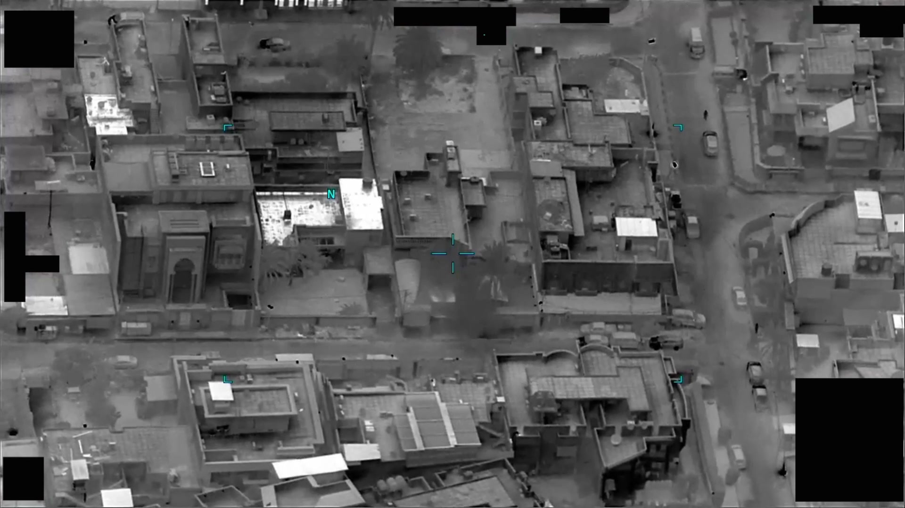
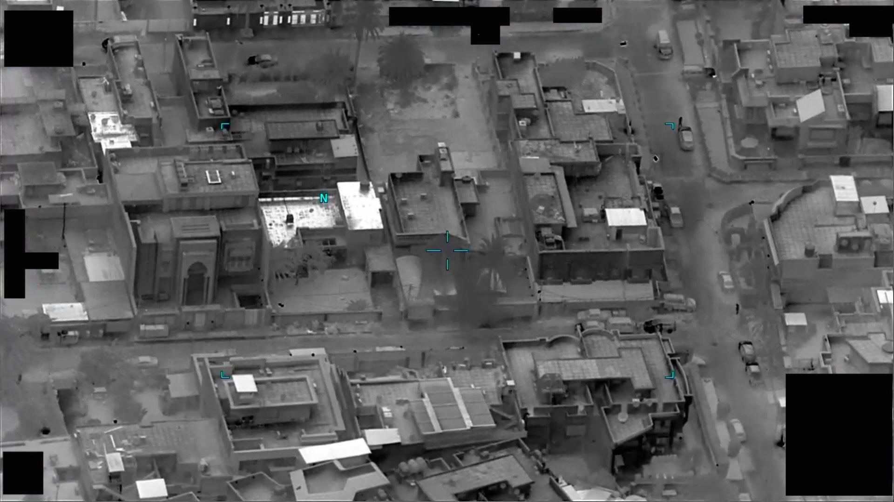

# #083 DOW-UAP-PR23：伊拉克 2022-12，10 秒 IR 影片，對比區左下→右上，6 秒離開視野

> **影像限制**：報告描述目標自畫面左下進、右上出的對角穿越，但 sensor 鎖定的是底下巴格達都市目標，UAP 僅在畫面邊緣短暫出現。11 個候選截幀均不見對角軌跡，原始訊號可能太弱或在視野外緣。

PR23 是 Part 1 中軌跡方向特殊的條目：對比區由左下進入畫面、向右上斜飛、6 秒處離開。這個對角線軌跡與 PR19、PR22 的近水平軌跡不同，但 D 系列 MISREP 對軌跡的描述極簡，難以從文字反推 PR23 的方向到底是友軍視角還是地面參考。

## 影片內容

- 長度：10 秒（10.73 秒，DVIDS 鏡像），1920x1080，30 fps
- 紅外影片。對比區從畫面左下進入，向右上方斜向移動，6 秒處離開視野，剩下 4 秒為背景。Sensor 沒有 follow，holding 在原視野，這代表 sensor 操作員的注意力在另一個目標（D18 MISREP 提到的對地任務），UAP 是「背景中的不明對象」而非主動追蹤目標。

## 對應 D 系列 MISREP

對應 [#039 DOW-UAP-D18](../039-dow_uap_d18_mission_report_iraq_december_2022/report.md)（伊拉克巴格達區 2022-12-01 16:20Z，482 ATKS MQ-9 在 FL180 觀測 1 個「可能 UAP/UAV」由西向東，未追蹤、繼續執行任務）。

D18 是 D 系列中首次把「可能 UAV」列入分類選項的案例，這個變化反映 2022 年伊朗代理人在伊拉克密集投放 Shahed-136 一次性自殺無人機。PR23 影片的「對比區」可能就是一架低速 UAV，但 thermal signature 不足以做型號 ID。

## 為什麼這份未解

- 「可能 UAP/UAV」標籤本身代表現場未鎖定身分
- sensor 未 follow，6 秒就脫離視野，後段資料缺失
- 巴格達區白噪比高（民航、警察直升機、無人機），背景排除困難
- 沒有雷達交叉資料佐證

## 影像規格與來源

| 欄位 | 內容 |
|---|---|
| 系列 | DOW-UAP-PR23 |
| 地點 | 伊拉克巴格達區 |
| 月份 | 2022-12 |
| 影片長度 | 10 秒 |
| 感測器 | IR |
| 對應 MISREP | DOW-UAP-D18（[#039](../039-dow_uap_d18_mission_report_iraq_december_2022/report.md)） |
| 公開日 | 2026-05-08 |
| 釋出途徑 | USCENTCOM MDR 25-0094 thru MDR 25-0099 |
| 官方來源 | [DOW-UAP-PR23, Unresolved UAP Report, Iraq, December 2022](https://www.war.gov/UFO/#DOW-UAP-PR23,%20Unresolved%20UAP%20Report,%20Iraq,%20December%202022) |
| DVIDS 鏡像 | [DVIDS video 1006062](https://www.dvidshub.net/video/1006062/) |

DVIDS 鏡像（video ID 1006062）；以下描述依 mp4 截幀與官方 caption 與 D18 MISREP 對應段。

## 相關報告

- [#039 D18 伊拉克 2022-12](../039-dow_uap_d18_mission_report_iraq_december_2022/report.md)，PR23 對應的 MISREP 觀測（巴格達區 482 ATKS MQ-9，「可能 UAP/UAV」首次分類）。
