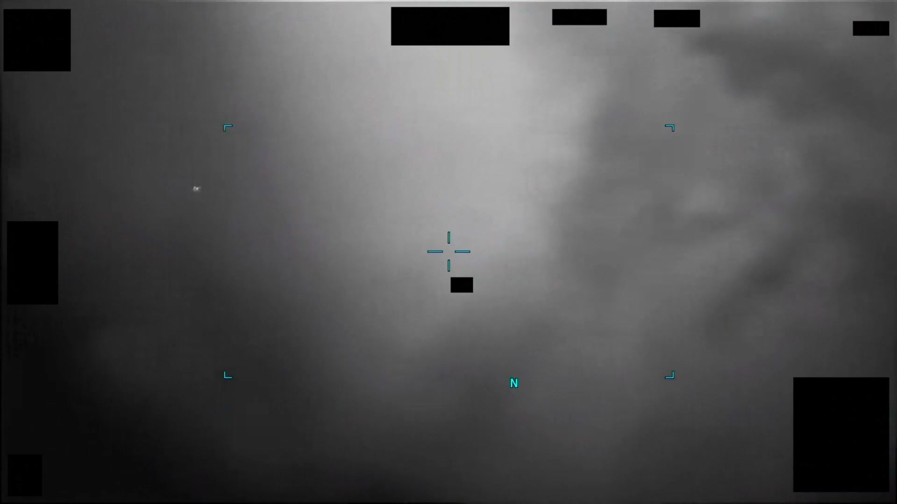
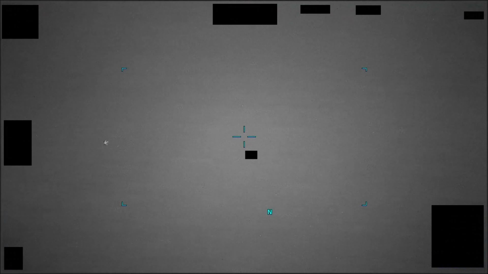
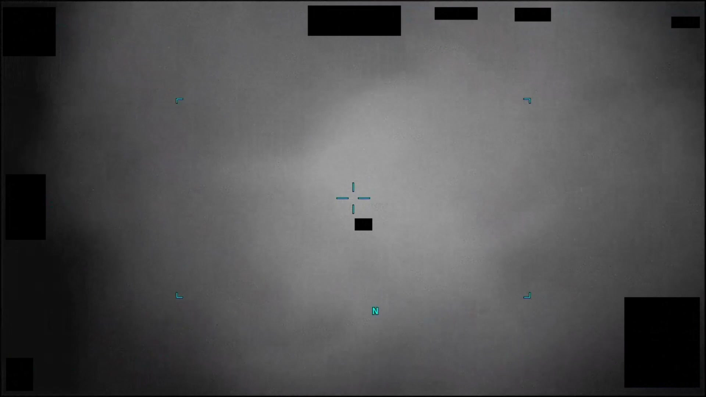

# #084 DOW-UAP-PR26：UAE 2023-10，43 秒 IR 影片，左上對比區停留，17/18 秒感測器橫掃，29 秒失鎖

PR26 是 Part 1 中影片長度第二長的條目（43 秒），可以看到 sensor 操作員的反應序列：先停留觀測、後嘗試橫掃 reacquire、最後失鎖。這個流程是 MQ-9 sensor 操作員處理低 contrast UAP 的標準動作。

## 影片內容

43 秒紅外影片。

- 0-17 秒：對比區停留在畫面左上四分之一，sensor 不移動
- 17-18 秒：sensor 突然橫掃（pan）右移，可能是判讀員嘗試 reacquire 或切換到次目標
- 18-29 秒：對比區進入畫面中央偏右
- 29 秒後：lock 失敗，後段為 sensor 自動 search pattern

整段沒有 blue-cross lock，sensor 未能取得 stable track。

## 對應 D 系列 MISREP

對應 [#042+#043 DOW-UAP-D23](../042_043-dow_uap_d23_mission_report_uae_october_2023/report.md)（阿拉伯灣 2023-10-24，50 ATKS MQ-9 收到伊朗 Air Defense「保持距離」警告後 56 分鐘，02:41Z 與 03:22Z 分別觀測 2 個 UAP，320 mph 與 440 mph，thermal cold，OP SPARTAN SHIELD）。

PR26 + PR27 兩段影片分別對應 D23 的 OBS 1 與 OBS 2。PR26 的「左上停留 + 17 秒橫掃」對應 02:41Z 觀測（320 MPH UAP，39RYJ7X grid）。

## 為什麼這份未解

D23 + PR26 在 D 系列中是少數有明確速度（320 / 440 mph）與物理狀態（Solid, thermal cold, NOT under intelligent control）的條目，但仍 unresolved：

- thermal cold 排除 jet engine、ramjet、火箭
- 320-440 mph 高於商用 UAV、低於 fighter
- 「NOT under intelligent control」意指軌跡平直、無 evasive maneuver
- 伊朗 GUARD CALL 提前 56 分鐘預警，存在「伊朗主動派遣」的可能但無 IFF 證據

29 秒後 sensor 失鎖的特徵，與 thermal cold + 高速直線飛行的 D23 描述一致。

## 影像規格與來源

| 欄位 | 內容 |
|---|---|
| 系列 | DOW-UAP-PR26 |
| 地點 | UAE 外海（阿拉伯灣） |
| 月份 | 2023-10 |
| 影片長度 | 43 秒 |
| 感測器 | IR（MQ-9 MTS-B） |
| 對應 MISREP | DOW-UAP-D23（[#042+#043](../042_043-dow_uap_d23_mission_report_uae_october_2023/report.md)） |
| 公開日 | 2026-05-08 |
| 釋出途徑 | USCENTCOM MDR 25-0104，2025-09-12 由 USCENTCOM Chief of Staff 解密 |
| 官方來源 | [DOW-UAP-PR26, Unresolved UAP Report, United Arab Emirates, October 2023](https://www.war.gov/UFO/#DOW-UAP-PR26,%20Unresolved%20UAP%20Report,%20United%20Arab%20Emirates,%20October%202023) |
| DVIDS 鏡像 | [DVIDS video 1006063](https://www.dvidshub.net/video/1006063/) |

DVIDS 鏡像（video ID 1006063）；以下描述依 mp4 截幀與官方 caption。
