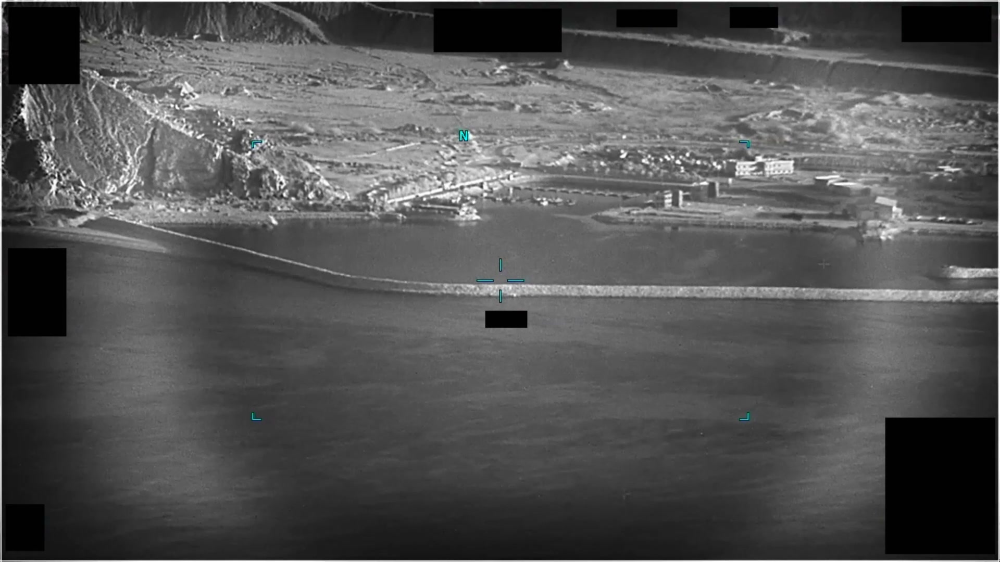

# #085 DOW-UAP-PR27：UAE 2023-10，4 分 57 秒 IR 影片，前 1m55s 無內容，後感測器追蹤對比區，3m27s 後失而復得

PR27 是 Part 1 中影片長度最長的條目（4 分 57 秒）。「前 1m55s 無內容」對應 sensor 在 search pattern 中尚未鎖定 UAP，1m55s 後 sensor 鎖到一個對比區開始 follow，3m27s 處有一次失鎖再復得。

## 影片內容

總長 4 分 57 秒，分段：

- 0-1m55s：sensor 自動 search 或對地巡邏，無 UAP 內容
- 1m55s-3m27s：sensor 鎖定對比區，開始 track。對比區在畫面中相對穩定，sensor 自動 follow 形成 narrow zoom
- 3m27s：lock 短暫脫離（fade out），對比區消失約數秒後復現
- 3m30s 至 4m57s：sensor reacquire 後繼續追蹤至影片結束

整段持續觀測時間約 3 分鐘，遠長於 PR26 的 43 秒。

## 對應 D 系列 MISREP

對應 [#042+#043 DOW-UAP-D23](../042_043-dow_uap_d23_mission_report_uae_october_2023/report.md)（阿拉伯灣 2023-10-24，50 ATKS MQ-9 OP SPARTAN SHIELD，OBS 1 在 02:41Z、OBS 2 在 03:22Z）。

PR27 對應 D23 OBS 2（03:22Z）：MQ-9 在 FL243 觀測到 1 個 UAP，39RXL6X 區域，Solid 物理狀態、NOT under intelligent control、Kinetic Velocity 440 MPH。3 分鐘觀測時間與 440 mph 高速一致，sensor 必須持續微調才能保持 lock。3m27s 的失而復得，可能是 UAP 短暫進入背景熱亂流（cluster fade）。

## 為什麼這份未解

PR27 看似資料豐富（3 分鐘 stable track）但仍 unresolved：

- 440 mph + thermal cold + 平直軌跡 → 不符 any known platform 標籤
- 未取得 radar altitude 交叉驗證
- 未引發友軍 attack scramble
- AARO assessment 為 Benign（無威脅），但 unidentified 標籤保留

D23 報告中「Observer Assessment: Benign」意味現場機組判斷此非敵意，但 origin 不明的事實沒有被解決。

## 影像規格與來源

| 欄位 | 內容 |
|---|---|
| 系列 | DOW-UAP-PR27 |
| 地點 | UAE 外海（阿拉伯灣） |
| 月份 | 2023-10 |
| 影片長度 | 4 分 57 秒 |
| 感測器 | IR（MQ-9 MTS-B） |
| 對應 MISREP | DOW-UAP-D23 OBS 2（[#042+#043](../042_043-dow_uap_d23_mission_report_uae_october_2023/report.md)） |
| 公開日 | 2026-05-08 |
| 釋出途徑 | USCENTCOM MDR 25-0104 |
| 官方來源 | [DOW-UAP-PR27, Unresolved UAP Report, United Arab Emirates, October 2023](https://www.war.gov/UFO/#DOW-UAP-PR27,%20Unresolved%20UAP%20Report,%20United%20Arab%20Emirates,%20October%202023) |
| DVIDS 鏡像 | [DVIDS video 1006067](https://www.dvidshub.net/video/1006067/) |

DVIDS 鏡像（video ID 1006067）；以下描述依 mp4 截幀與官方 caption。

## 相關報告

- [#042+#043 D23 阿拉伯灣 2023-10](../042_043-dow_uap_d23_mission_report_uae_october_2023/report.md)，PR27 對應的 MISREP 觀測（OP SPARTAN SHIELD，OBS 2 03:22Z，440 mph 約 3 分鐘 stable track）。
