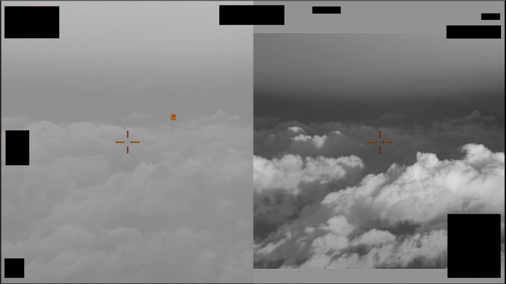
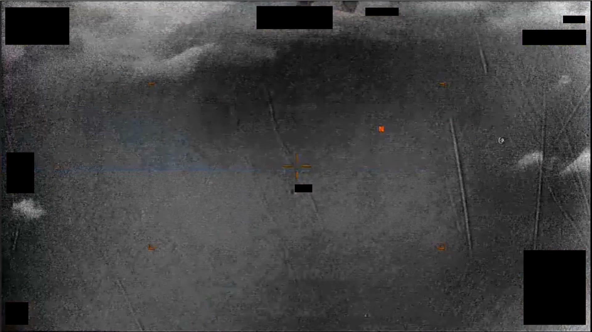

# #086 DOW-UAP-PR28：希臘 2024-01，1 分 5 秒多模態影片，SWIR 上「倒淚滴+垂直拖尾」切到可見光即消失

PR28 是 Part 1 中第一份多模態影片（EO + SWIR），也是 SWIR 通道專屬可見的 UAP 案例。AN/DAS-4 MTS-B 同時記錄可見光與短波紅外，PR28 影片在 SWIR 上明顯可見一個「倒淚滴+垂直拖尾」形體，切到 EO（可見光）通道後同一位置完全空白。

## 影片內容

1 分 5 秒。畫面切換 EO 與 SWIR 兩種模式：

- SWIR 通道：中央可見「倒淚滴」（teardrop）形體，下方拖一條垂直線狀尾跡
- EO 通道：同一視野空白，無對應物體
- 整段 sensor 操作員手動切換 modality 確認 SWIR-only 訊號

SWIR-only visibility 是這個案例最特殊的物理特徵。SWIR 波段（約 0.9-1.7 μm）對某些化學氣團、推進物殘留、或冷卻系統釋放的低溫氣體比可見光敏感。

## 對應 D 系列 MISREP

對應 [#044 DOW-UAP-D25](../044-dow_uap_d25_mission_report_greece_january_2024/report.md)（希臘 2024-01-25 05:09Z 至 05:11Z，AFSOC 33 SOS MQ-9 在 transit 中 SWIR 觀測 1 個「菱形帶非機動探針」UAP，434 節，僅 SWIR 可見）。

D25 是 D 系列中首次明列「Sensors Available: BLASPHEMY」並指出 UAP「僅 SWIR 可見」的條目。PR28 1 分 5 秒影片正是這 2 分鐘觀測的剪輯。

## 為什麼這份未解

D25 + PR28 是 D 系列中首份明確「SWIR-only」標記的條目，但仍 unresolved：

- SWIR-only visibility 排除所有 hot-thermal platforms（jet、rocket、ramjet）
- 「菱形+探針」形狀不對應任何已知 UAV 或 cruise missile
- 434 節（800 km/h）速度與形狀的組合無已知工程匹配
- AN/DAS-4 MTS-B 是公開推測中能達到的 sensor 靈敏度上限，更高解析度需要 spectrum 分析儀

PR28 的物理特徵（SWIR-only + teardrop + 垂直拖尾）後續會在 D27（PR29）的「倒淚滴+垂直拖尾」UAE 觀測再現一次。

## 影像規格與來源

| 欄位 | 內容 |
|---|---|
| 系列 | DOW-UAP-PR28 |
| 地點 | 希臘 / Aegean Sea |
| 月份 | 2024-01 |
| 影片長度 | 1 分 5 秒 |
| 感測器 | EO + SWIR（AN/DAS-4 MTS-B） |
| 對應 MISREP | DOW-UAP-D25（[#044](../044-dow_uap_d25_mission_report_greece_january_2024/report.md)） |
| 公開日 | 2026-05-08 |
| 釋出途徑 | USCENTCOM MDR |
| 官方來源 | [DOW-UAP-PR28, Unresolved UAP Report, Greece, January 2024](https://www.war.gov/UFO/#DOW-UAP-PR28,%20Unresolved%20UAP%20Report,%20Greece,%20January%202024) |
| DVIDS 鏡像 | [DVIDS video 1006073](https://www.dvidshub.net/video/1006073/) |

DVIDS 鏡像（video ID 1006073）；以下描述依 mp4 截幀與官方 caption。

## 相關報告

- [#044 D25 希臘 2024-01](../044-dow_uap_d25_mission_report_greece_january_2024/report.md)，PR28 對應的 MISREP 觀測（AFSOC 33 SOS MQ-9 SWIR-only，菱形帶探針，434 節）。
- [#051 D33 希臘 2023-10](../051-dow_uap_d33_mission_report_greece_october_2023/report.md)，同地點（希臘 / Aegean）的 D 系列觀測，背景上下文。
- [#052 D35 希臘 2023-10](../052-dow_uap_d35_mission_report_greece_october_2023/report.md)，同地點（希臘 / Aegean）的 D 系列觀測，背景上下文。
