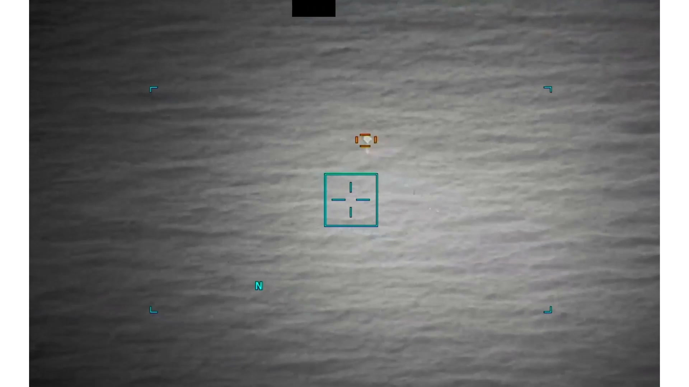
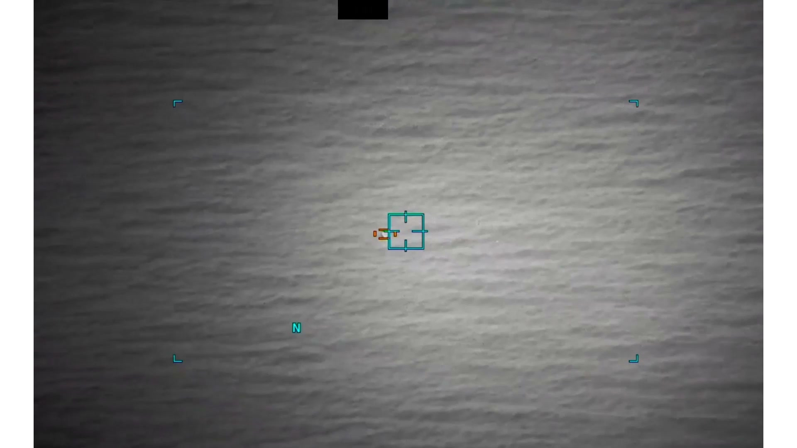

# #087 DOW-UAP-PR29：UAE 2024-06，21 秒 IR 影片，中央「倒淚滴+垂直拖尾」，操作員研判水面反射

PR29 與 PR28 共享相同形態學描述（「倒淚滴+垂直拖尾」），但 caption 多了一句「操作員研判水面反射」。這是 PR 系列中少數 caption 直接提到「possible explanation」的條目，雖然官方仍將其列為 unresolved。

## 影片內容

21 秒紅外影片。畫面中央出現「倒淚滴」對比區，下方有一條垂直線狀拖尾。背景紋理顯示對比區位於海面上方（阿曼灣），高度極低。21 秒內物體幾乎不動，sensor 緩慢 zoom-in 後 caption 標記「possibly water reflection」。

## 對應 D 系列 MISREP

對應 [#045 DOW-UAP-D27](../045-dow_uap_d27_mission_report_gulf_of_oman_june_2024/report.md)（阿曼灣 2024-06-07 04:57Z，AFSOC 3 SOS MQ-9 在 23,999 ft MSL RTB transit 中觀測「圓柱條／棒附底部，可能反射」UAP 貼水面 140 KTS 直線飛行）。

D27 MISREP gentext 已明列「CYLINDRICAL POLE/BAR ATTACHED ON THE BOTTOM OF THE OBJECT POSS REFLECTION」，意即操作員當下就懷疑底部的「棒狀拖尾」是水面反射的鏡像。PR29 21 秒影片即此觀測段的剪輯。

## 為什麼這份未解

「water reflection」假設只解釋下方的「垂直拖尾」，不解釋上方的「倒淚滴」本體：

- 若整體都是反射，物體本身來自何處？
- 140 kts 直線飛行貼水面，與低空巡航 UAV（Shahed-136 約 100-115 kts）速度相近，但 D27 並未確認 UAV ID
- AFSOC 3 SOS 是特種作戰指揮鏈，主要支援反胡塞武裝（OP ENDURING SENTINEL），紅海/阿曼灣是胡塞 USV 與 OWA-UAV 活動區
- 觀測角度（向下俯視水面）讓物體與其反射難以分離

PR29 與 PR28（D25）共享「倒淚滴+垂直拖尾」形態，這個跨案例的形狀重複是 AARO 後續關注的重點。

## 影像規格與來源

| 欄位 | 內容 |
|---|---|
| 系列 | DOW-UAP-PR29 |
| 地點 | 阿曼灣（Gulf of Oman），UAE 標籤 |
| 月份 | 2024-06 |
| 影片長度 | 21 秒 |
| 感測器 | IR（MQ-9 MTS-B） |
| 對應 MISREP | DOW-UAP-D27（[#045](../045-dow_uap_d27_mission_report_gulf_of_oman_june_2024/report.md)） |
| 公開日 | 2026-05-08 |
| 釋出途徑 | USCENTCOM MDR |
| 官方來源 | [DOW-UAP-PR29, Unresolved UAP Report, United Arab Emirates, June 2024](https://www.war.gov/UFO/#DOW-UAP-PR29,%20Unresolved%20UAP%20Report,%20United%20Arab%20Emirates,%20June%202024) |
| DVIDS 鏡像 | [DVIDS video 1006074](https://www.dvidshub.net/video/1006074/) |

DVIDS 鏡像（video ID 1006074）；以下描述依 mp4 截幀與官方 caption。

## 相關報告

- [#045 D27 阿曼灣 2024-06](../045-dow_uap_d27_mission_report_gulf_of_oman_june_2024/report.md)，PR29 對應的 MISREP 觀測（AFSOC 3 SOS MQ-9 04:57Z，「圓柱條附底部，可能反射」140 KTS）。
- [#042+#043 D23 阿拉伯灣 2023-10](../042_043-dow_uap_d23_mission_report_uae_october_2023/report.md)，同 UAE 標籤、同 USCENTCOM 海域的早期觀測，背景上下文。
- [#086 PR28 希臘 2024-01](../086-dow_uap_pr28_video_greece_january_2024/report.md)，共享「倒淚滴+垂直拖尾」形態學的 SWIR-only 案例。
