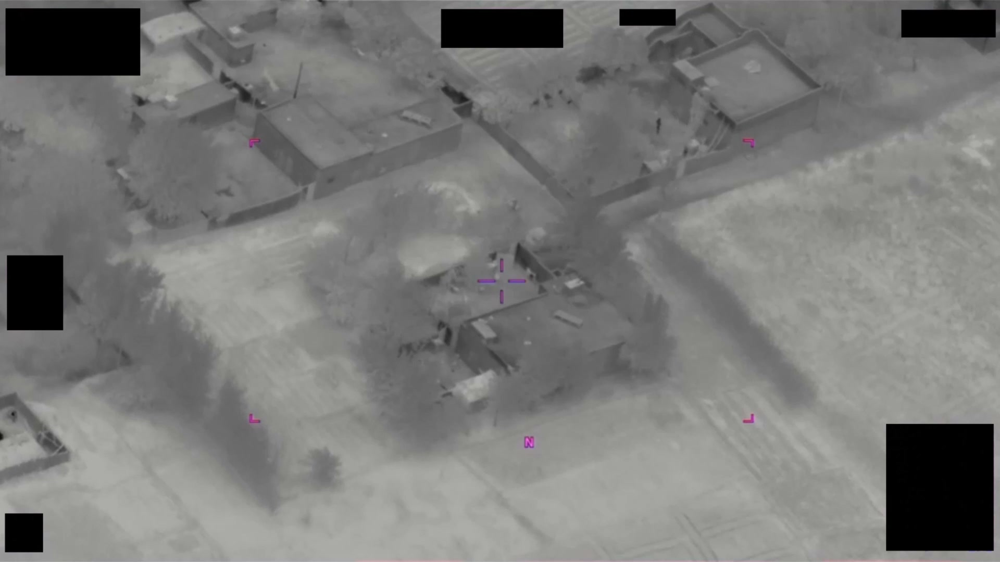
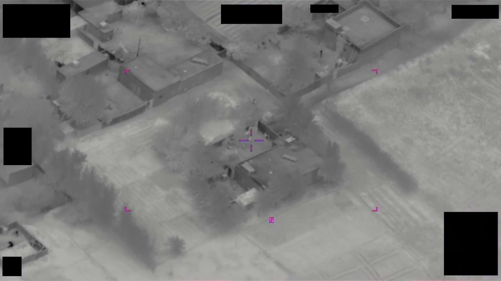

# #089 DOW-UAP-PR32：敘利亞 2024-10，6 秒 FMV，2-4 秒頂緣中央白紅色不規則亮區，水平半橢圓

> **影像限制**：報告描述畫面上緣中央出現紅白色半橢圓形 plasma，但 11 個候選截幀（每 0.6 秒一張）的視野中心都是地面目標，未見頂緣 plasma 形態。原始 mp4 訊號偏弱，cover 視為情境圖。

PR32 是 D32 Plasma 事件三段影片中的中段（6 秒）。形狀描述為「水平半橢圓」，與 PR31 的「不規則彩色亮區」、PR33 的「兩處半透明橙色不規則區」可以互相對照，呈現 plasma 形態學的時序變化。

## 影片內容

6 秒 FMV。

- 0-2 秒：背景為地表 ISR 目標區
- 2-4 秒：畫面頂緣中央出現白紅色不規則亮區，形狀為水平半橢圓（橢圓的下半部）
- 4-6 秒：亮區淡出，畫面回到背景

整段亮區持續約 2 秒，位置不大幅移動，邊緣模糊。色彩白紅相間對應 sensor false color 中「高亮度+某波段過飽」的標示，並非物理上的彩色。

## 對應 D 系列 MISREP

對應 [#048+#049+#050 DOW-UAP-D32](../048_049_050-dow_uap_d32_mission_report_syria_october_2024/report.md)（敘利亞 37S FU 2024-10-20，AFSOC 12 SOS MQ-9 45 分鐘 plasma 事件）。

PR32 6 秒對應 D32 三個 OBS event 中段，可能是 16:10Z 至 16:25Z 區間。「水平半橢圓」是 D32 MISREP 中「misshapen ball」的瞬時形狀變體。

## 為什麼這份未解

PR32 與 PR31、PR33 共享 Plasma 不解之謎：

- 「水平半橢圓」的形狀，若是物理體則需邊界封閉，plasma 雲團不會
- 2 秒持續時間 + 位置幾乎不動，速度接近零，但 IR signature 不穩
- AFSOC ISR 平台（MQ-9 + SANTA FE sensor）感測能力應能識別民用無人機，本案無 ID
- 周邊 VEO（暴力極端組織）作戰區，地面火力與閃光彈活動高，但 plasma cluster 不符合火力訊號特徵

## 影像規格與來源

| 欄位 | 內容 |
|---|---|
| 系列 | DOW-UAP-PR32 |
| 地點 | 敘利亞 37S FU |
| 月份 | 2024-10 |
| 影片長度 | 6 秒 |
| 感測器 | FMV（IR + sensor SANTA FE） |
| 對應 MISREP | DOW-UAP-D32（[#048+#049+#050](../048_049_050-dow_uap_d32_mission_report_syria_october_2024/report.md)） |
| 公開日 | 2026-05-08 |
| 釋出途徑 | USCENTCOM MDR |
| 官方來源 | [DOW-UAP-PR32, Unresolved UAP Report, Syria, October 2024](https://www.war.gov/UFO/#DOW-UAP-PR32,%20Unresolved%20UAP%20Report,%20Syria,%20October%202024) |
| DVIDS 鏡像 | [DVIDS video 1006078](https://www.dvidshub.net/video/1006078/) |

DVIDS 鏡像（video ID 1006078）；以下描述依 mp4 截幀與官方 caption。

## 相關報告

- [#048+#049+#050 D32 敘利亞 2024-10](../048_049_050-dow_uap_d32_mission_report_syria_october_2024/report.md)，PR32 對應的 MISREP 觀測（45 分鐘 plasma 事件，三個獨立 OBS）。
- [#088 PR31 敘利亞 2024-10](../088-dow_uap_pr31_video_syria_october_2024/report.md)，同 D32 plasma 事件的早段 5 秒影片。
- [#090 PR33 敘利亞 2024-10](../090-dow_uap_pr33_video_syria_october_2024/report.md)，同 D32 plasma 事件的末段 5 秒影片。
